+++
title = "Integrace a Zotaveni"
description = "Post-trip pece po bad tripu - psychologicka integrace, dlouhodobe nasledky, profesionalni pomoc, transformace narocneho zazitku"
weight = 4
date = 2026-01-30
updated = 2026-01-30

[taxonomies]
tags = ["bad-trip", "integrace", "zotaveni", "psychoterapie", "PTSD", "transformace"]
categories = ["harm-reduction", "medical"]

[extra]
lead = "Jak zpracovat narocny zazitek a transformovat ho v rust"
+++

# Integrace a Zotaveni

Bad trip konci, ale jeho zpracovani teprve zacina. Tato sekce popisuje **post-trip peci**, **dlouhodobou integraci** a **cestu k zotaveni**.

---

## Bezprostredni Post-Trip Faze (0-24 hodin)

### Fyzicka Pece

| Potreba | Akce |
|---------|------|
| **Hydratace** | Voda, bylinkove caje, elektrolyty |
| **Vyziva** | Lehka jidla - ovoce, orechy, polévka |
| **Odpocinek** | Umoznit spanek kdykoli |
| **Teplo** | Deka, teple obleceni |
| **Bezpeci** | Zustat v znamem prostredi |

### Psychologicka Pece

| Princip | Aplikace |
|---------|----------|
| **Nenutit mluvit** | Nechat prostor pro ticho |
| **Byt k dispozici** | Fyzicka pritomnost bez tlaku |
| **Normalizovat** | "Je normalni citit se ted divne" |
| **Nehodnotit** | Zadne "mohl jsi vedet" |
| **Trpelivost** | Zpracovani vyzaduje cas |

### Co Rict (a Co Ne)

| Rict | Nerict |
|------|--------|
| "Jsem tady, kdyz budes chtit mluvit" | "Povidej, co se dalo" |
| "Neni kam spechat" | "Uz je to za tebou" |
| "Je v poradku citit se jakkoliv" | "Nemysli na to" |
| "Jsi silny/a, ze jsi to zvládl/a" | "To bylo spatne rozhodnuti" |
| "Muzu ti s necim pomoct?" | "Uz vis, proc to bylo?" |

### Varovne Znaky v Post-Trip Fazi

| Priznak | Akce |
|---------|------|
| Prolongovane halucinace (>24h) | Konzultace s lekarem |
| Suicidalni myšlenky | Krizova linka (116 123), lekar |
| Tezka deprese | Profesionalni pomoc |
| Neschopnost spat (>48h) | Lekar |
| Panicke ataky | Profesionalni pomoc |
| Flashbacky | Normalni, ale sledovat |

---

## Kratkodobe Zotaveni (1-7 dni)

### Normalni Reakce

| Reakce | Frekvence | Trvani |
|--------|-----------|--------|
| Emocionalni labilita | Velmi casta | 1-3 dny |
| Unavena | Casta | 1-5 dni |
| Vivid sny | Casta | 1-7 dni |
| Zmeny nalady | Casta | 1-7 dni |
| Senzitivita na podnety | Stredne casta | 1-3 dny |
| Potreba samoty | Casta | Individualni |
| Filozoficke uvazovani | Casta | Individualni |

### Podpurne Aktivity

| Aktivita | Ucinek |
|----------|--------|
| **Priroda** | Uzemneni, klid |
| **Jemny pohyb** | Jóga, procházka |
| **Tvorivost** | Kreslení, psaní, hudba |
| **Meditace** | Stabilizace mysli |
| **Spanek** | Regenerace |
| **Sociální kontakt** | Pokud je vyhledáván |

### Journaling (Psani Deniku)

#### Proc Psat

| Duvod | Vysvetleni |
|-------|------------|
| Externalizace | Vynest z hlavy na papir |
| Zpracovani | Strukturovat chaotické |
| Odstup | Pohled z "venku" |
| Dokumentace | Pro budouci referenci |
| Insight | Objeveni vzorcu |

#### Integracni Otazky

```
OTAZKY PRO JOURNALING:
======================

ZAZITEK:
• Co bylo nejintenzivnější?
• Které momenty byly nejtezsi?
• Byly momenty klidu nebo vhledu?

EMOCE:
• Jaké emoce se objevily?
• Která emoce byla nejsilnejsi?
• Co jsem citil/a telesne?

MYSLENKY:
• Jaké myšlenky se opakovaly?
• Objevily se nová pochopení?
• Co mě prekvapilo?

VYZNAM:
• Co si z toho odnasim?
• Ukazuje to na něco v mém životě?
• Je neco, co chci změnit?

PECE:
• Co ted potrebuji?
• Koho potrebuji?
• Jak se mohu postarat sam/a o sebe?
```

---

## Dlouhodobe Zpracovani (Tydny-Mesice)

### Faze Integrace

```mermaid
flowchart TD
    node_INTEGRACNIPROCES["INTEGRACNI PROCES:"]
    node_AKUTNI17dni["AKUTNI 1-7 dni"]
    node_Stabilizace["• Stabilizace"]
    node_Zkladnpece["• Základní pece"]
    node_Nenutitzpracovani["• Nenutit zpracovani"]
    node_REFLEKTIVNI14tydny["REFLEKTIVNI 1-4 tydny"]
    node_Journaling["• Journaling"]
    node_Sdilenisduvernky["• Sdileni s duverníky"]
    node_Hledanivzorcu["• Hledani vzorcu"]
    node_INTEGRATIVNI16mesicu["INTEGRATIVNI 1-6 mesicu"]
    node_Aplikacevivote["• Aplikace v živote"]
    node_Terapeutickaprace["• Terapeuticka prace"]
    node_Behavioralnizmeny["• Behavioralni zmeny"]
    node_TRANSFORMACNImesicer["TRANSFORMACNI mesice-roky"]
    node_Dlouhodobezmeny["• Dlouhodobe zmeny"]
    node_Novaperspektiva["• Nova perspektiva"]
    node_Posttraumatickrust["• Post-traumatický rust"]

    node_INTEGRACNIPROCES --> node_AKUTNI17dni
    node_AKUTNI17dni --> node_Stabilizace
    node_Stabilizace --> node_Zkladnpece
    node_Zkladnpece --> node_Nenutitzpracovani
    node_Nenutitzpracovani --> node_REFLEKTIVNI14tydny
    node_REFLEKTIVNI14tydny --> node_Journaling
    node_Journaling --> node_Sdilenisduvernky
    node_Sdilenisduvernky --> node_Hledanivzorcu
    node_Hledanivzorcu --> node_INTEGRATIVNI16mesicu
    node_INTEGRATIVNI16mesicu --> node_Aplikacevivote
    node_Aplikacevivote --> node_Terapeutickaprace
    node_Terapeutickaprace --> node_Behavioralnizmeny
    node_Behavioralnizmeny --> node_TRANSFORMACNImesicer
    node_TRANSFORMACNImesicer --> node_Dlouhodobezmeny
    node_Dlouhodobezmeny --> node_Novaperspektiva
    node_Novaperspektiva --> node_Posttraumatickrust
```



<details>
<summary>ASCII verze diagramu</summary>

```
INTEGRACNI PROCES:
==================

AKUTNI (1-7 dni)
    • Stabilizace
    • Základní pece
    • Nenutit zpracovani
         ↓
REFLEKTIVNI (1-4 tydny)
    • Journaling
    • Sdileni s duverníky
    • Hledani vzorcu
         ↓
INTEGRATIVNI (1-6 mesicu)
    • Aplikace v živote
    • Terapeuticka prace
    • Behavioralni zmeny
         ↓
TRANSFORMACNI (mesice-roky)
    • Dlouhodobe zmeny
    • Nova perspektiva
    • Post-traumatický rust
```

</details>

### Potencialni Dlouhodobe Nasledky

#### Negativni (Vzacne)

| Nasledek | Popis | Management |
|----------|-------|------------|
| **HPPD** | Pretrvavajici percepcni zmeny | Cas, abstinence, odbornik |
| **Chronicka uzkost** | Zvysena bazalni uzkost | Terapie, relaxace |
| **Deprese** | Prolongovany pokles nalady | Profesionalni pomoc |
| **Trauma reakce** | PTSD-like symptomy | Trauma terapie |
| **Depersonalizace** | Pocit oddelenosti od sebe | Specializovana terapie |

#### Pozitivni (Castejsi)

| Vysledek | Popis |
|----------|-------|
| **Zvysena sebereflexe** | Hlubsi sebepoznani |
| **Post-traumaticky rust** | Rust z narocneho zazitku |
| **Zmena priorit** | Prehodnoceni hodnot |
| **Zvysena empatie** | Vetsi porozumeni druhým |
| **Duchovni rozvoj** | Prohloubeni spirituality |
| **Odolnost** | "Přežil/a jsem, zvládnu i jiné" |

### Post-Traumaticky Rust

Bad trip muze byt - paradoxne - zdrojem osobniho rustu. Vyzkum ukazuje, ze az **84%** lidi retrospektivne hodnoti narocne zazitky jako **prispivajici k dobre pohode**.

| Doména Rustu | Priklad |
|--------------|---------|
| Osobni síla | "Zjistil/a jsem, ze jsem silnejsi" |
| Nove moznosti | "Vidim život jinak" |
| Vztahy | "Více si vážím blízkých" |
| Ceneni života | "Každý den je dar" |
| Duchovni zmena | "Cítím se spojeny/a s něčím větším" |

---

## Profesionalni Pomoc

### Kdy Vyhledat Odbornika

| Indikace | Typ Pomoci |
|----------|------------|
| Symptomy pretrvávají >2 tydny | Psycholog/psychiatr |
| Suicidalni myšlenky | Krizová intervence, psychiatr |
| Tezka deprese/úzkost | Psychiatr + psychoterapie |
| Flashbacky, nightmary | Trauma terapeut |
| HPPD symptomy | Specialista na psychedelika |
| Neschopnost fungovat | Komplexni péce |

### Typy Terapie

| Pristup | Vhodnost | Popis |
|---------|----------|-------|
| **Integracni terapie** | Idealni | Specializace na psychedelické zážitky |
| **Kognitivne-behavioralni (CBT)** | Dobra | Práce s myšlenkami a chováním |
| **Somaticka terapie** | Dobra | Práce s tělesným prožíváním |
| **EMDR** | Dobra pro trauma | Zpracování traumatických vzpomínek |
| **Psychodynamická** | Stredni | Hloubkové pochopení |
| **Mindfulness-based** | Doplnkova | Regulace emocí |

### Kde Hledat Pomoc (CR)

| Zdroj | Kontakt |
|-------|---------|
| **Krizova linka** | 116 123 (24/7) |
| **Linka duvery** | 116 111 (24/7) |
| **NUDZ** | Narodní ústav duševního zdraví |
| **Psychiatricke ambulance** | Přes obvodniho lékaře |
| **Psychoterapeutické ambulance** | Seznam na psychoterapie.cz |

### Co Sdelit Terapeutovi

> **Uprimnost je klicová.** Terapeuti mají povinnost mlcenlivosti.

| Co sdelit | Proc |
|-----------|------|
| Pouzitá latka | Specifika zážitku |
| Davka a cas | Kontext |
| Co se dělo | Pochopení zážitku |
| Aktuální symptomy | Cílená intervence |
| Psychiatrická historie | Souvislosti |

---

## HPPD (Hallucinogen Persisting Perception Disorder)

### Co Je HPPD

| Aspekt | Popis |
|--------|-------|
| **Definice** | Pretrvávající percepcní zmeny po odeznení účinku |
| **Prevalence** | 1-4% uživatelů (odhady se liší) |
| **Trvání** | Týdny až roky |
| **Prognóza** | Často se zlepšuje s časem |

### Typy Percepcnich Zmen

| Typ | Popis |
|-----|-------|
| **Visual snow** | Statické "šumění" v zorném poli |
| **Trailing** | Stopy za pohybujícími se objekty |
| **After-images** | Přetrvávající obrazy po odvrácení pohledu |
| **Halos** | Svatozáře kolem světelných zdrojů |
| **Micropsia/macropsia** | Změny vnímané velikosti |
| **Geometrické vzory** | Při zavřených očích |

### Management HPPD

| Strategie | Popis |
|-----------|-------|
| **Abstinence** | Žádné další psychoaktivní látky |
| **Cas** | Často se spontánně zlepšuje |
| **Snízení stresu** | Stres zhoršuje symptomy |
| **Spánek** | Dostatek kvalitního spánku |
| **Omezení kofeinu** | Stimulanty mohou zhoršovat |
| **Farmakoterapie** | Clonazepam, lamotrigin (pod dohledem) |

### Odliseni od Flashbacku

| Flashback | HPPD |
|-----------|------|
| Kratky (sekundy-minuty) | Prolongovaný (hodiny-stále) |
| Epizodický | Kontinuální nebo častý |
| Často spojený s triggerem | Nezávislý na triggerech |
| Obsahuje psychologický kontext | Čistě percepcní |

---

## Self-Help Strategie

### Denni Rutina

| Cas | Aktivita | Ucinek |
|-----|----------|--------|
| Ráno | Pravidelné vstávání | Cirkadianní stabilizace |
| | Lehké protažení | Propojení s tělem |
| | Zdravá snídaně | Energie, stabilizace |
| Den | Práce/aktivita | Struktura, smysl |
| | Přestávky v přírodě | Uzemnění |
| Večer | Omezení obrazovek | Kvalita spánku |
| | Relaxační technika | Příprava na spánek |
| | Journaling | Zpracování dne |

### Grounding Techniky (Pro Každý Den)

| Technika | Popis |
|----------|-------|
| **5-4-3-2-1** | 5 věcí vidíš, 4 slyšíš, 3 cítíš... |
| **Studená voda** | Na obličej nebo ruce |
| **Nohy na zemi** | Vědomě cítit kontakt |
| **Fyzická aktivita** | Chůze, běh, jóga |
| **Dýchání** | Box breathing, 4-7-8 |
| **Příroda** | Čas venku, bosé nohy na trávě |

### Kognitivni Reframing

| Myšlenka | Reframe |
|----------|---------|
| "Jsem poškozený/á" | "Prošel/a jsem něčím náročným a učím se z toho" |
| "Nikdy nebudu normální" | "Vnímání se mění. Dávám si čas." |
| "Byla to chyba" | "Byla to zkušenost. Co z ní mohu vzít?" |
| "Neměl/a jsem to dělat" | "Stalo se. Co mohu dělat teď?" |

---

## Podpurna Komunita

### Vyhody Komunity

| Vyhoda | Vysvetleni |
|--------|------------|
| Normalizace | "Nejsem sám/a" |
| Sdílená zkušenost | Pochopení bez vysvětlování |
| Praktické rady | Co pomáhalo jiným |
| Sociální podpora | Snížení izolace |
| Naděje | Příklady zotavení |

### Kde Najit Podporu

| Zdroj | Typ |
|-------|-----|
| **Psychedelická společnost (PSY-CZ)** | Česká organizace |
| **MAPS Integration List** | Mezinárodní síť terapeutů |
| **Reddit r/psychedelics** | Online komunita |
| **Erowid Experience Vaults** | Sdílené zkušenosti |
| **Lokální integrační skupiny** | Osobní setkání |

### Pravidla Sdílení

| Delat | Nedelat |
|-------|---------|
| Poslouchat aktivně | Srovnávat zkušenosti |
| Validovat | Dávat nevyžádané rady |
| Respektovat tempo | Tlačit na sdílení |
| Udržovat důvěrnost | Sdílet příběhy jiných |

---

## Prevence Budouciho Bad Tripu

### Poučeni Pro Budoucnost

| Oblast | Otazka k zamysleni |
|--------|---------------------|
| Set | Byl jsem v dobrém psychickém stavu? |
| Setting | Bylo prostředí bezpečné? |
| Dávka | Nebyla příliš vysoká? |
| Látka | Byla testovaná? |
| Trip sitter | Měl jsem kvalitní podporu? |
| Příprava | Připravil/a jsem se dostatečně? |

### Pokud Se Rozhodnu Znovu

| Doporuceni | Vysvetleni |
|------------|------------|
| **Delsi pauza** | Minimálně 3-6 měsíců |
| **Nižší dávka** | Začít opatrně |
| **Lepší set** | Stabilní psychický stav |
| **Lepší setting** | Bezpečné prostředí |
| **Trip sitter** | Zkušený a důvěryhodný |
| **Integrace** | Zpracovat předchozí zkušenost nejdřív |

### Kdy NEPOKRACOVAT

| Situace | Doporuceni |
|---------|------------|
| Nezpracovaný předchozí bad trip | Počkat, zpracovat |
| Přetrvávající symptomy | Počkat na úplné odezněn |
| HPPD | Abstinence |
| Psychiatrická diagnóza | Konzultace s odborníkem |
| Užívání psychiatrických léků | Konzultace s lékařem |

---

## Shrnutí

### Klicové Zprávy

1. **Zotavení je proces** - dej si čas
2. **Bad trip může být učitel** - retrospektivně pozitivní u většiny
3. **Není ostuda vyhledat pomoc** - profesionálové jsou tu pro tebe
4. **Komunita pomáhá** - nejsi sám/a
5. **Budoucnost je otevřená** - tento zážitek tě nedefinuje

### Timeline Zotavení

```
TYPICKÝ PRŮBĚH ZOTAVENÍ:
========================

0-24h    Akutní stabilizace
         └→ Fyzická péče, bezpečí, přítomnost

1-7 dni  Krátkodobé zotavení
         └→ Odpočinek, normální reakce, journaling

1-4 týdny  Reflektivní fáze
           └→ Zpracování, sdílení, hledání významu

1-6 měsíců  Integrativní fáze
            └→ Aplikace, změny, terapie pokud třeba

6+ měsíců  Transformace
           └→ Dlouhodobé změny, nová perspektiva
```

---

## Kontakty Pro Pomoc

| Služba | Číslo | Dostupnost |
|--------|-------|------------|
| **Krizová linka** | 116 123 | 24/7 |
| **Linka důvěry** | 116 111 | 24/7 |
| **Záchranná služba** | 155 | 24/7 |
| **Tísňová linka** | 112 | 24/7 |

---

## Pokracovat

- **Zpět na lékařský přístup**: [Lékařský Přístup](@/harm-reduction/bad-trip/lekarsky-pristup.md)
- **Zpět na přehled**: [Bad Trip](@/harm-reduction/bad-trip/_index.md)
- **Harm Reduction celkově**: [Harm Reduction](@/harm-reduction/_index.md)

---

## Reference

1. Carbonaro, T.M., et al. (2016). Survey study of challenging experiences after ingesting psilocybin mushrooms. Journal of Psychopharmacology.

2. Barrett, F.S., et al. (2016). The Challenging Experience Questionnaire. Journal of Psychopharmacology.

3. Tedeschi, R.G., & Calhoun, L.G. (2004). Posttraumatic growth: Conceptual foundations and empirical evidence. Psychological Inquiry.

4. Brennan, W., & Belser, A.B. (2022). Models of psychedelic-assisted psychotherapy: A contemporary assessment and an introduction to EMBARK. Frontiers in Psychology.

5. Gashi, L., Sandberg, S., & Pedersen, W. (2021). Making "bad trips" good: How users of psychedelics narratively transform challenging trips into valuable experiences. International Journal of Drug Policy.

---

*Posledni aktualizace: 2026-01-30*
