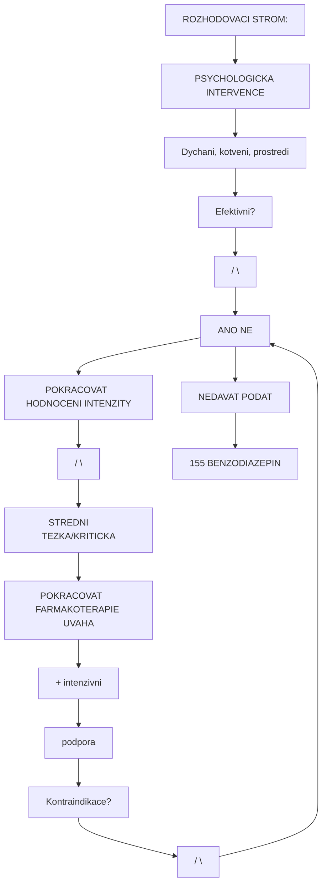
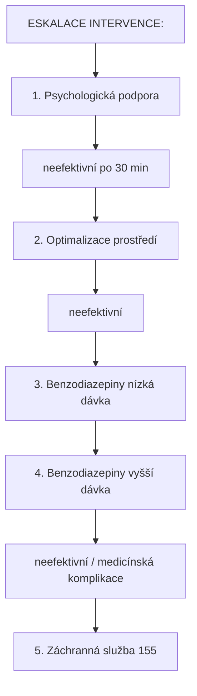

+++
title = "Lekarsky Pristup"
description = "Farmakologicka intervence pri bad tripu - benzodiazepiny, antipsychotika, kdy volat zachrannou sluzbu, nemocnicni management"
weight = 3
date = 2026-01-30
updated = 2026-01-30

[taxonomies]
tags = ["bad-trip", "farmakoterapie", "benzodiazepiny", "antipsychotika", "zachranna-sluzba", "toxikologie"]
categories = ["harm-reduction", "medical"]

[extra]
lead = "Kdy a jak pouzit farmakologickou intervenci - evidence-based pristup"
+++

# Lekarsky Pristup

Tato sekce popisuje **farmakologickou intervenci** a **medicinsky management** psychedelickych krizi. Informace jsou urceny pro **vzdelávání** a podporu informovaného rozhodovani.

---

## Upozorneni

> **Tato sekce nenahrazuje odbornou lekarskou péci.**
>
> Pri jakémkoli podezreni na zdravotni komplikaci **VOLEJTE 155**.
>
> Farmakologická intervence by mela byt **posledni moznost** po vycerpání psychologických technik.

---

## Rozhodovaci Algoritmus

### Kdy Pouzit Farmakoterapii



<details>
<summary>ASCII verze diagramu</summary>

```
ROZHODOVACI STROM:
==================

PSYCHOLOGICKA INTERVENCE
(Dychani, kotveni, prostredi)
         |
         v
    [Efektivni?]
        /    \
      ANO     NE
       |       |
       v       v
  POKRACOVAT  HODNOCENI INTENZITY
              /          \
         STREDNI        TEZKA/KRITICKA
            |                 |
            v                 v
    POKRACOVAT      FARMAKOTERAPIE UVAHA
    + intenzivni         |
    podpora              v
                 [Kontraindikace?]
                    /        \
                  ANO        NE
                   |          |
                   v          v
              NEDAVAT    PODAT
              → 155      BENZODIAZEPIN
```

</details>

### Indikace Pro Farmakoterapii

| Indikace | Popis |
|----------|-------|
| **Prolongovana panika** | >30 min nereagujici na psychologicke techniky |
| **Severna agitace** | Riziko sebepoškození nebo ubližení jinym |
| **Psychoticke symptomy** | Ztrata kontaktu s realitou |
| **Zadost pacienta** | Informovany souhlas k ukonceni zazitku |
| **Telesne symptomy** | Vyrazna tachykardie, hypertenze (>180/110) |

### Kontraindikace Farmakoterapie (Relativni)

| Stav | Riziko | Alternativa |
|------|--------|-------------|
| Respiracni insuficience | Deprese dychani | Nizsi davka, monitoring |
| Alkoholova intoxikace | Potenciace sedace | Opatrnost, nizsi davka |
| Neznama latka | Interakce | Pouze pozorování a 155 |
| Serotonin syndrom | Benzos nepomuzou | 155 OKAMZITE |

---

## Benzodiazepiny ("Trip Killers")

### Mechanismus Ucinku

Benzodiazepiny **neukoncuji** psychedelický ucinek primo. Pusobí jako:
- **Anxiolytika** - snizují uzkost
- **Sedativa** - navozují klid a spanek
- **Antikonvulziva** - prevence zachvatu

> Psychedelický zazitek pokracuje, ale osoba je klidnejsi a casto usne.

### Dostupne Preparaty

| Latka | Obchodni Nazev | Onset (p.o.) | Trvani | Ekvivalent |
|-------|----------------|--------------|--------|------------|
| **Diazepam** | Apaurin, Diazepam | 15-45 min | 4-6 h | 10 mg |
| **Alprazolam** | Xanax, Neurol | 15-30 min | 4-6 h | 0.5 mg |
| **Lorazepam** | Tavor | 30-60 min | 6-8 h | 1 mg |
| **Clonazepam** | Rivotril | 30-60 min | 8-12 h | 0.5 mg |
| **Oxazepam** | - | 45-90 min | 4-6 h | 15 mg |

### Doporucene Davkovani

#### Mirna az Stredni Krize

| Latka | Pocatecni Davka | Max. Dalsi | Poznamka |
|-------|-----------------|------------|----------|
| Diazepam | 5-10 mg p.o. | +5 mg po 30 min | Max 20 mg |
| Alprazolam | 0.5-1 mg p.o. | +0.5 mg po 30 min | Max 2 mg |
| Lorazepam | 1-2 mg p.o. | +1 mg po 30 min | Max 4 mg |

#### Tezka Krize (Pod Dohledem)

| Latka | Davka | Cesta | Poznamka |
|-------|-------|-------|----------|
| Diazepam | 10-20 mg | p.o./i.m. | I.M. ma erraticni absorpci |
| Lorazepam | 2-4 mg | p.o./i.m./i.v. | Preferovany pro i.m. |
| Midazolam | 5-10 mg | i.m./i.n. | Rychly onset, kratke trvani |

### Podani

```
POSTUP PODANI:
==============

1. SOUHLAS
   - Pokud mozno, ziskej souhlas
   - "Mam lék, ktery ti pomuze uklidnit se. Chces ho?"

2. INFORMACE
   - "Je to [nazev]. Pomaha s uzkosti."
   - "Za 15-30 minut se zacnes citit klidneji."

3. PODANI
   - Tableta s vodou
   - Osoba musi byt pri vedomi a schopna polykat

4. MONITORING
   - Sleduj dychani
   - Sleduj uroven vedomi
   - Neodchazej od osoby

5. HODNOCENI
   - Po 30 minutach: zlepsení?
   - Pokud ne: mozna dalsi davka (max limity!)
```

### Vedlejsi Ucinky a Rizika

| Ucinek | Frekvence | Management |
|--------|-----------|------------|
| Sedace | Caste | Ocekavane, bezpecne prostredi |
| Ataxie | Caste | Nepouštět chodit samotné |
| Amnézie | Stredni | Informovat po probuzeni |
| Paradoxni reakce | Vzacne | Vysadit, support |
| Respiracni deprese | Vzacne (vysoka davka) | 155, ventilace |

### Interakce

| Kombinace | Riziko | Akce |
|-----------|--------|------|
| **+ Alkohol** | Potenciace sedace/deprese | Snizit davku 50% |
| **+ Opiáty** | Respiracni deprese | KONTRAINDIKACE |
| **+ Barbituráty** | Respiracni deprese | KONTRAINDIKACE |
| **+ GHB** | Respiracni deprese | KONTRAINDIKACE |
| + Psychedelika | Zadna problematicka | Bezpecne |
| + MDMA | Zadna problematicka | Bezpecne |
| + Ketamin | Zvysena sedace | Opatrnost |

---

## Antipsychotika

### Kdy Zvazit

| Indikace | Poznamka |
|----------|----------|
| Prolongovana psychoza | >24h bez zlepseni |
| Agitace nereagujici na benzos | Po max. davce benzos |
| Anamneza psychotické poruchy | Dekompenzace |

> **POZOR**: Antipsychotika mohou **zhorsit** nektere stavy a maji zavaznejsi vedlejsi ucinky nez benzodiazepiny. Jejich pouziti by melo byt rezervovano pro **medicínský personál**.

### Preparaty (Pouze Pro Informaci)

| Latka | Onset | Poznámka |
|-------|-------|----------|
| Haloperidol | 20-40 min (p.o.) | Riziko EPS, prodlouzeni QT |
| Olanzapin | 15-45 min (i.m.) | Sedace, metabolicke ucinky |
| Risperidon | 30-60 min | Mene sedativní |
| Quetiapin | 30-60 min | Sedativni, mene EPS |

### Kontraindikace Antipsychotik

| Stav | Riziko |
|------|--------|
| Ketaminova intoxikace | Prodlouzeni ucinku |
| Anticholinerní toxidrom | Zhorseni |
| Serotonin syndrom | Muzou zhorsit |
| Prodlouzeni QT v anamneze | Arytmie |

---

## Medicinske Komplikace

### Serotonin Syndrom

#### Rozpoznani

```
HUNTEROVA KRITERIA:
===================

Expozice serotonernimu agens +

PRITOMNOST NEKTEREHO:
• Spontánni klonus
• Indukovany klonus + agitace nebo diaforeza
• Okulární klonus + agitace nebo diaforeza
• Tremor + hyperreflexie
• Hypertonie + teplota >38°C + klonus

TRIADA:
Neuromuskularni + Autonomni + Mentalni zmeny
```

#### Rizikove Kombinace

| Kombinace | Uroven Rizika |
|-----------|---------------|
| MAOI + DMT/Ayahuasca | **EXTREMNI** |
| MAOI + MDMA | **EXTREMNI** |
| SSRI + MDMA | VYSOKA |
| SSRI + Psilocybin | STREDNI |
| Tramadol + MAOI | **EXTREMNI** |
| Lithium + Psychedelika | VYSOKA (zachvaty) |

#### Management

| Krok | Akce |
|------|------|
| 1 | **155 OKAMZITE** |
| 2 | Ukoncit expozici (odstranit nalepky apod.) |
| 3 | Chlazeni (vlhké prostěradla, led) |
| 4 | Sledovat dychani |
| 5 | **NEDAVAT dalsi lateky** (vcetne benzos - nepomuzou) |

### Hypertermie

#### Rizikove Latky

| Latka | Riziko | Mechanismus |
|-------|--------|-------------|
| MDMA | Vysoke | Termogeneze + fyzicka aktivita |
| PMA/PMMA | Extremni | Vyrazna termogeneze |
| Stimulanty | Stredni | Zvysena aktivita |
| Serotonin syndrom | Extremni | Svalova rigidita |

#### Management

| Teplota | Akce |
|---------|------|
| 38-39°C | Chlazeni, tekutiny, klid |
| 39-40°C | Aktivni chlazeni, 155 |
| >40°C | **155 OKAMZITE** - zivot ohrozujici |

```
CHLAZENI:
=========

□ Presunout do chladu/stinu
□ Svleknout prebytecne obleceni
□ Vlhke prostěradla/rucniky
□ Vetraky, klimatizace
□ Led na klicove oblasti:
  - Krk
  - Podpazi
  - Třísla
□ TEKUTINY (pokud pri vedomi)
□ NE alkohol na kuzi (vazodilatace)
```

### Hyponatremie (MDMA)

#### Rizikové Faktory

| Faktor | Vysvetleni |
|--------|------------|
| Nadmerne pití vody | MDMA zvysuje žízeň |
| SIADH | MDMA zvysuje ADH |
| Zeny | Vyssi riziko |
| Dlouha tanecni aktivita | Pocení + prehnaná hydratace |

#### Priznahy

| Uroven | Symptomy |
|--------|----------|
| Mirna | Nauzea, bolest hlavy |
| Stredni | Zmatenost, slabost |
| Tezka | Zachvaty, edém mozku, **SMRT** |

#### Prevence

| Doporuceni | Vysvetleni |
|------------|------------|
| Max 500 mL/h | Nepít nadmerne |
| Sportovni napoje | Elektrolyty |
| Pravidelne pauzy | Snizeni poceni |

### Zachvaty

#### Rizikove Latky

| Latka | Riziko |
|-------|--------|
| Tramadol + MAOI | Extremni |
| Lithium + Psychedelika | Vysoke |
| MDMA (vysoke davky) | Stredni |
| Stimulanty | Stredni |
| Alkohol (odtah) | Vysoke |

#### Management

```
ZACHVAT - PRVNI POMOC:
======================

1. BEZPECNOST
   □ Odstranit nebezpecne predmety
   □ Nesnazit se zadrzovat!
   □ Nic do ust!

2. POLOHOVÁNÍ
   □ Polozit na zem
   □ Mekka podlozka pod hlavu

3. CASOVANI
   □ Zaznamenat zacatek
   □ Sledovat trvani

4. VOLAT 155 POKUD:
   □ Trvá >5 minut
   □ Opakuje se
   □ Po zachvatu nenabyva vedomi
   □ Je to prvni zachvat
   □ Je v tehotenstvi
   □ Ma diabetes
   □ Doslo k poraneni

5. PO ZACHVATU
   □ Stabilizovana poloha
   □ Sledovat dychani
   □ Zustat s osobou
```

---

## Kdy Volat 155

### Absolutni Indikace

| Stav | Akce |
|------|------|
| Ztrata vedomi | **155 OKAMZITE** |
| Zachvaty | **155 OKAMZITE** |
| Teplota >40°C | **155 OKAMZITE** |
| Bolest na hrudi | **155 OKAMZITE** |
| Cyanoza (modre rty/konky prstu) | **155 OKAMZITE** |
| Respiracni selhani | **155 OKAMZITE** |
| Aktivni sebeposkozovani | **155 OKAMZITE** |
| Nezvladnutelna agrese | **155 OKAMZITE** |

### Relativni Indikace

| Stav | Hodnoceni |
|------|-----------|
| Prolongovana psychoza (>6h) | Zvazit |
| Tachykardie >150/min | Zvazit |
| Hypertenze >180/110 | Zvazit |
| Nekontrolovatelna agitace | Zvazit |
| Zadna reakce na intervenci | Zvazit |

### Co Rict Dispečerovi

```
SCHEMA KOMUNIKACE S 155:
========================

1. "Volam ohledne [muze/zeny] ve veku cca [X] let."

2. "Ma [symptomy]."
   - Nereaguje / zachvaty / horečka / atd.

3. "Uzil/a [latku] (pokud vite) v [cas]."
   - Bud úprimni - dispečer nehlasi policii

4. "Jsme na adrese [presna adresa]."
   - Vcetne poschodí, cısla bytu

5. Odpovezte na otazky dispečera.

6. NEZAVESUJTE dokud vas k tomu nevyzvou.
```

---

## Nemocnicni Management

### Co Ocekatat v Nemocnici

| Faze | Postup |
|------|--------|
| **Tríáž** | Vitální funkce, anamnéza |
| **Stabilizace** | Monitoring, i.v. pristup |
| **Laborator** | Toxikologie, elektrolyty, EKG |
| **Intervence** | Dle nálezu |
| **Pozorování** | Obvykle 6-12 hodin |

### Informace Pro Zdravotniky

| Co sdelit | Proc |
|-----------|------|
| Presna latka (pokud zname) | Specificka intervence |
| Cas uzití | Predikce prubehu |
| Davka | Hodnoceni zavaznosti |
| Kombinace | Identifikace interakci |
| Predchozi reakce | Individualni faktory |
| Psychiatricka anamneza | Riziko dekompenzace |
| Aktualni léky | Interakce |

> **Zdravotnici mají povinnost mlcenlivosti.** Upřímnost zachraňuje životy.

---

## Pravni Aspekty (CR)

### Dekriminalizace vs. Legalita

| Aspekt | Status |
|--------|--------|
| Drízení pro osobní potrebu | Prestupek (male mnozstvi) |
| Distribuce | Trestny cin |
| Volání záchranky | **NEMA pravni nasledky pro volajiciho** |
| Lékařská péce | Povinná mlcenlivost |

> **Nikdy neváhejte volat 155 kvuli obavám z pravních nasledku.**
> Záchrana života ma absolutni prioritu.

### Poskytnuti Prvni Pomoci

| Princip | Vyznam |
|---------|--------|
| Povinnost poskytnout pomoc | § 150 TZ |
| Ochrana Good Samaritan | Nelze postihovat za poskytnutí pomoci |

---

## Shrnutí

### Hierarchie Intervenci



<details>
<summary>ASCII verze diagramu</summary>

```
ESKALACE INTERVENCE:
====================

1. Psychologická podpora
   ↓ (neefektivní po 30 min)
2. Optimalizace prostředí
   ↓ (neefektivní)
3. Benzodiazepiny (nízká dávka)
   ↓ (neefektivní po 30 min)
4. Benzodiazepiny (vyšší dávka)
   ↓ (neefektivní / medicínská komplikace)
5. Záchranná služba (155)
```

</details>

### Klicove Body

1. **Farmakoterapie je posledni moznost** - psychologicka intervence prvni
2. **Benzodiazepiny jsou bezpecne** v rozumnych davkach
3. **Antipsychotika** jen pro zdravotniky
4. **Pri pochybnostech volat 155** - lepsi falesny poplach nez ztrata zivota
5. **Uprimnost zachranuje zivoty** - sdelovat pravdive informace

---

## Pokracovat

- **Dalsi krok**: [Integrace a Zotaveni](@/harm-reduction/bad-trip/integrace-zotaveni.md)
- **Zpet na intervenci**: [Okamzita Intervence](@/harm-reduction/bad-trip/okamzita-intervence.md)
- **Zpet na prehled**: [Bad Trip](@/harm-reduction/bad-trip/_index.md)

---

## Reference

1. Passie, T., et al. (2008). The pharmacology of lysergic acid diethylamide: a review. CNS Neuroscience & Therapeutics.
2. Sessa, B., & Nutt, D. (2015). Making a medicine out of MDMA. British Journal of Psychiatry.
3. Boyer, E.W., & Shannon, M. (2005). The Serotonin Syndrome. NEJM.
4. Vollenweider, F.X., & Preller, K.H. (2020). Psychedelic drugs: neurobiology and potential for treatment of psychiatric disorders. Nature Reviews Neuroscience.

---

*Posledni aktualizace: 2026-01-30*
