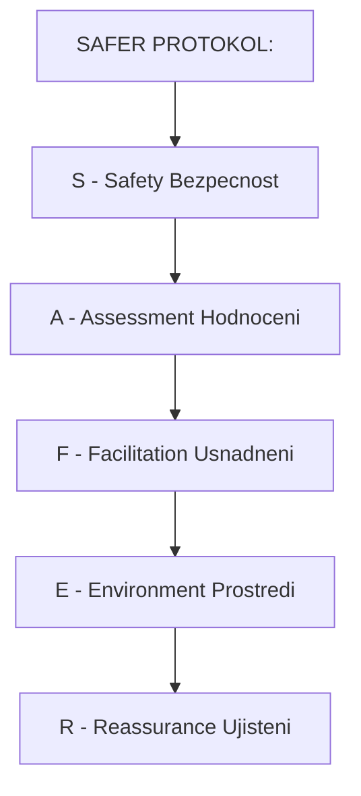
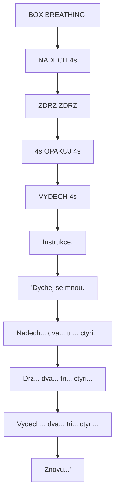

+++
title = "Okamzita Intervence"
description = "Krizova intervence pri bad tripu - step-by-step protokol, komunikacni techniky, de-eskalace, prostredni management"
weight = 2
date = 2026-01-30
updated = 2026-01-30

[taxonomies]
tags = ["bad-trip", "intervence", "krize", "de-eskalace", "trip-sitting", "prvni-pomoc"]
categories = ["harm-reduction", "medical"]

[extra]
lead = "Strukturovany pristup k zvladnuti akutni psychedelicke krize"
+++

# Okamzita Intervence

Tento protokol poskytuje **strukturovany pristup** k intervenci pri bad tripu. Nasledujte kroky v poradi, adaptujte dle situace.

---

## Zakladni Principy

### CALM Framework

| Princip | Vyznam | Aplikace |
|---------|--------|----------|
| **C**omposure | Vas klid = jejich klid | Regulujte vlastni dychani a hlas |
| **A**cceptance | Prijmete stav, nehodnoťte | "Je OK citit toto" |
| **L**istening | Aktivni naslouchani | Nechte je mluvit, neprerušujte |
| **M**indfulness | Pritomnost v momentu | Zde a ted, ne budoucnost |

### Co DELAT

| Akce | Proc |
|------|------|
| Zustat klidny | Vas stav se prenasi |
| Byt pritomny | Kotva v realite |
| Mluvit pomalu a tiše | Snizuje arousal |
| Nabizet volby | Vraci pocit kontroly |
| Validovat emoci | "Chapu, ze je to tezke" |
| Pripominat docasnost | "Toto prejde" |

### Co NEDELAT

| Chyba | Proc |
|-------|------|
| Panikarit | Zesi jejich paniku |
| Konfrontovat | Zvysuje odpor |
| Lhat | Ztraci duveru |
| Nutit | Zvysuje uzkost |
| Opustit | Bezpecnostni riziko |
| Kritizovat | Zhoršuje shame |
| Volat vic lidi | Prehlceni |

---

## Krizova Sekvence (SAFER)

### Prehled



<details>
<summary>ASCII verze diagramu</summary>

```
SAFER PROTOKOL:
===============

S - Safety (Bezpecnost)
    ↓
A - Assessment (Hodnoceni)
    ↓
F - Facilitation (Usnadneni)
    ↓
E - Environment (Prostredi)
    ↓
R - Reassurance (Ujisteni)
```

</details>

---

### S - Safety (Bezpecnost)

**Cas: Prvnich 30 sekund**

#### Fyzicka Bezpecnost

| Krok | Akce | Kontrola |
|------|------|----------|
| 1 | Zkontroluj okolí | Ostré predmety? Schody? Okna? |
| 2 | Odstran nebezpeci | Noze, sklo, léky mimo dosah |
| 3 | Zajisti prostor | Zamcene dvere, zabraneno uniku do provozu |
| 4 | Zkontroluj osobu | Zraneni? Dycha? Pri vedomi? |

#### Bezpecnostni Otazky

```
RYCHLA KONTROLA:
================

□ Je osoba pri vedomi a reaguje?
  [NE] → 155 OKAMZITE

□ Dycha normalne?
  [NE] → 155 OKAMZITE

□ Ma viditelna zraneni?
  [ANO] → Osetrit / 155

□ Je prostredi bezpecne?
  [NE] → Presunout osobu nebo odstranit nebezpeci
```

---

### A - Assessment (Hodnoceni)

**Cas: 30 sekund - 2 minuty**

#### Uroven Krize

| Uroven | Indikatory | Priorita Intervence |
|--------|------------|---------------------|
| **1 - Mirna** | Uzkost, neklid, otazky | Pritomnost, podpora |
| **2 - Stredni** | Panika, paranoia, place | Aktivni intervence |
| **3 - Tezka** | Dezorganizace, agitace | Farmako úvaha |
| **4 - Kriticka** | Sebeposkozeni, zachvaty | **155 OKAMZITE** |

#### Hodnotici Otazky (Pokud Komunikuje)

| Otazka | Ucel |
|--------|------|
| "Vis, kde jsi?" | Orientace mistem |
| "Vis, kdo jsem?" | Orientace osobou |
| "Co jsi vzal/a?" | Identifikace latky |
| "Kdy jsi to vzal/a?" | Casova osa |
| "Jak se ted citis?" | Subjektivní stav |
| "Boli te neco?" | Fyzicke symptomy |

---

### F - Facilitation (Usnadneni)

**Cas: Prubeznne**

#### Komunikacni Techniky

##### Ton a Tempo

| Aspekt | Doporuceni |
|--------|------------|
| **Hlasitost** | Tise, ale srozumitelne |
| **Tempo** | Pomale, s pauzami |
| **Ton** | Klidny, vrely, neutráľni |
| **Delka vet** | Kratke, jednoduche |

##### Validacni Formulace

| Situace | Co rici |
|---------|---------|
| Strach | "Je normalni cítit strach. Jsi v bezpeci." |
| Panika | "Toto je tezke. Dychej se mnou." |
| Zmatenost | "Je OK byt zmateny. Jsem tady s tebou." |
| Paranoia | "Rozumim, ze ti to tak pripada. Jsi v bezpeci." |
| "Umiram" | "Tvoje telo je v poradku. Toto je ucinek latky." |
| "Nikdy to neskonci" | "Vzdy to skonci. Kazdy trip skonci." |

##### Co NERICT

| Veta | Proc NE | Alternativa |
|------|---------|-------------|
| "Uklidni se" | Invaliduje, neefektivní | "Dychej se mnou" |
| "To nic neni" | Bagatelizuje | "Chapu, ze je to tezke" |
| "Mas halucinace" | Muze zesílit strach | "Vidis veci, ktere tam nejsou?" |
| "Mohl jsi vedet" | Kritika | - (mlcet) |
| "Bude to horsí" | Zhorsuje anticipaci | "Tohle prejde" |

#### Dychaci Techniky

##### Box Breathing (4-4-4-4)



<details>
<summary>ASCII verze diagramu</summary>

```
BOX BREATHING:
==============

        NADECH (4s)
            ↑
    ┌───────────────┐
    │               │
ZDRZ│               │ZDRZ
(4s)│   OPAKUJ     │(4s)
    │               │
    └───────────────┘
            ↓
        VYDECH (4s)

Instrukce:
"Dychej se mnou.
Nadech... dva... tri... ctyri...
Drz... dva... tri... ctyri...
Vydech... dva... tri... ctyri...
Drz... dva... tri... ctyri...
Znovu..."
```

</details>

##### 4-7-8 Technika (Pro Zklidneni)

| Faze | Trvani | Instrukce |
|------|--------|-----------|
| Nadech | 4 sekundy | Nosem, do bricha |
| Zadrzeni | 7 sekund | Jemne, bez napeti |
| Vydech | 8 sekund | Usty, pomalu |

#### Kotvici Techniky

##### 5-4-3-2-1 Grounding

| Smysl | Pocet | Instrukce |
|-------|-------|-----------|
| Zrak | 5 | "Rekni mi 5 veci, ktere vidis" |
| Hmat | 4 | "Dotkni se 4 ruznych povrchu" |
| Sluch | 3 | "Pojmenuj 3 zvuky, ktere slyšíš" |
| Čich | 2 | "Cítíš 2 vune?" |
| Chut | 1 | "Jakou mas chut v ustech?" |

##### Fyzicke Kotveni

| Technika | Popis |
|----------|-------|
| **Studena voda** | Na zapesti, za krk |
| **Led v ruce** | Intenzivni senzoricky vstup |
| **Nohy na zemi** | "Citi podlahu pod nohama" |
| **Objetí** | Pouze pokud osoba souhlasí |
| **Deka** | Pocit bezpeci, "cocoon" |

---

### E - Environment (Prostredi)

**Cas: Prubeznne**

#### Optimalizace Prostredi

| Faktor | Idealni Stav | Jak Dosahnout |
|--------|--------------|---------------|
| **Svetlo** | Tlumene, teplé | Zhasnout hlavni, rozsvítit svícku/lampicku |
| **Zvuk** | Ticho nebo klidná hudba | Vypnout TV, pustit ambient |
| **Teplota** | Prijemna | Deka k dispozici |
| **Prostor** | Soukromy | Zavrit dvere, odstranit cizi lidi |
| **Vzduch** | Cerstvý | Otevrit okno (zajistene!) |

#### Zmena Prostredi

| Situace | Akce |
|---------|------|
| Prehlceni podněty | Presun do klidnejsi mistnosti |
| Klaustrofobie | Ven na cerstvý vzduch (s doprovodem!) |
| Neprijemne asociace | Zmena pokoje |
| Chlad | Deka, teply caj |
| Horko | Vetrani, studena voda na zapesti |

#### Hudba

| Kdy | Typ | Poznamka |
|-----|-----|----------|
| Uzkost | Ambient bez rytmu | Brian Eno, Stars of the Lid |
| Panika | Ticho nebo priroda | Zvuky lesa, vody |
| Dezorientace | Zname, uklidnujici | Osobne znama hudba |
| Agitace | Vypnout hudbu | Redukce podnetu |

---

### R - Reassurance (Ujisteni)

**Cas: Prubeznne, opakovane**

#### Klicova Ujisteni

| Tema | Formulace |
|------|-----------|
| **Bezpeci** | "Jsi v bezpeci. Jsem tady s tebou." |
| **Docasnost** | "Toto prejde. Vzdy to prejde." |
| **Normalita** | "Toto je normalni reakce na latku." |
| **Fyzicke zdravi** | "Tvoje telo je v poradku." |
| **Identita** | "Jsi stale ty. [Jmeno], jsi tady." |
| **Cas** | "Je [cas]. Za [X] hodin bude lepe." |

#### Casova Orientace

```
CASOVA KOTVA:
=============

"Ted je [presny cas].
Vzal/a jsi [latku] v [cas uziti].
To je pred [X] hodinami.
Peak je obvykle [cas peaku].
Za [Y] hodin bude znatelne lepe.
Rano budes v poradku."

Priklad:
"Ted je 23:00.
Vzal jsi houby v 19:00.
To je pred 4 hodinami.
Peak uz je za tebou.
Za 2 hodiny bude výrazne lepe.
Rano budes v poradku."
```

---

## Specificke Situace

### Panika

| Faze | Akce |
|------|------|
| 1 | Zustan klidny, sniž vlastni aktivitu |
| 2 | "Dychej se mnou" (pomalý dech) |
| 3 | Fyzicky kontakt (pokud OK) |
| 4 | Grounding (5-4-3-2-1) |
| 5 | Pripomen docasnost |

### Paranoia

| Faze | Akce |
|------|------|
| 1 | **Nesouhlasit ANI neoponovat** |
| 2 | "Rozumim, ze ti to tak pripada" |
| 3 | Posileni bezpeci: "Jsi v bezpeci, jsem tady" |
| 4 | Nabidnout zmenu prostredi |
| 5 | Snizit pocet lidi v okoli |

> **POZOR**: Nikdy nerict "To neni pravda" ani "To si vymyslis" - muze zesílit paranoju.

### Thought Loops (Myslenkove Smycky)

| Faze | Akce |
|------|------|
| 1 | Rozpoznat pattern ("Opakujes se...") |
| 2 | Jemne prerusit: fyzicky podnet, zmena místa |
| 3 | Smerovat pozornost jinam: hudba, dychani |
| 4 | "Pojdme delat neco jineho" |

### Ego Smrt / "Umiram"

| Faze | Akce |
|------|------|
| 1 | "Tvoje telo je v poradku" (zkontroluj!) |
| 2 | "Toto je normalni psychedelicky zazitek" |
| 3 | Nabidnout "letting go" pokud jsou pripraveni |
| 4 | Fyzicka pritomnost (ruka na rameni) |
| 5 | Pokud panic: grounding, dychání |

> **Pro zkusené sittery**: Ego smrt muze byt transformativni. Pokud osoba je stabilni, muzete jemne podpořit "odevzdání se" místo boje.

### Agitace / Agrese

| Faze | Akce |
|------|------|
| 1 | **Zajistit vlastní bezpecnost** |
| 2 | Udrzet odstup (dosah paze + vic) |
| 3 | Klidny, neohrozujici postoj |
| 4 | "Neublizim ti. Chci ti pomoct." |
| 5 | Nabidnout volby: "Chces si sednout nebo stat?" |
| 6 | Pokud eskaluje: **155** |

> **BEZPECNOST PRVNI**: Nikdy se nestavejte hrdinove. Pri realne agresi volat pomoc.

### Sebeposkozovani

| Akce | Priorita |
|------|----------|
| Fyzicky zabranit (pokud bezpecne pro vas) | **OKAMZITE** |
| Odstranit prostredky | **OKAMZITE** |
| Volat 155 | **OKAMZITE** |
| Neodchazet od osoby | - |

---

## Podpora Vice Osob

### Rozdeleni Roli

| Role | Ukol |
|------|------|
| **Primarni sitter** | Primy kontakt s osobou v krizi |
| **Sekundarni** | Management prostredi, komunikace s ostatními |
| **Backup** | Pripravenost prevzit, odpocinek pro primarni |

### Rotace

| Cas | Akce |
|-----|------|
| Každých 30-60 min | Check-in mezi sittery |
| Pri znacich vyhorení | Stridat primarni roli |
| Pri eskalaci | Povolat backup |

---

## Post-Krizova Faze

### Stabilizace (Po odezneni akutni faze)

| Krok | Akce |
|------|------|
| 1 | Nabidnout vodu, lehke jidlo |
| 2 | Zabezpecit teply, pohodlny prostor |
| 3 | Zustat v blízkosti, ale dat prostor |
| 4 | Nenutt mluvit o zazitku hned |
| 5 | Umoznit spanek, pokud chce |

### Predani (Pokud odchazite)

| Krok | Akce |
|------|------|
| 1 | Zajistit, ze neni sama (duveryhodni osoba) |
| 2 | Predat informace: co se stalo, co pomohlo |
| 3 | Nechat kontakt pro dalsi den |
| 4 | Domluvit check-in na dalsi den |

---

## Checklist pro Sittera

```
PRIPRAVA (Pred Tripem):
=======================
□ Znam latku, davku, cas uziti
□ Mam cislo na 155 a toxikologicke centrum
□ Mam benzodiazepin k dispozici (pokud mozno)
□ Prostredi je bezpecne a pripravene
□ Mam vodu, deky, svicky
□ Jsem strizlivy a odpocinuty

BEHEM TRIPU:
============
□ Pravidelne vizualni check osoby
□ Nabizim vodu
□ Reaguji na varovne signaly
□ Menim prostredi dle potreby
□ Zustavám klidny

PRI KRIZI:
==========
□ S - Bezpecnost zajistena
□ A - Zhodnocena uroven krize
□ F - Komunikace a techniky aplikovany
□ E - Prostredi optimalizovano
□ R - Ujisteni opakovano

PO KRIZI:
=========
□ Osoba je stabilni
□ Neni sama
□ Ma kontakt pro dalsi den
□ Domluveny follow-up
```

---

## Pokracovat

- **Dalsi krok**: [Lekarsky Pristup](@/harm-reduction/bad-trip/lekarsky-pristup.md)
- **Zpet na rozpoznani**: [Rozpoznani a Symptomy](@/harm-reduction/bad-trip/rozpoznani-symptomy.md)
- **Zpet na prehled**: [Bad Trip](@/harm-reduction/bad-trip/_index.md)

---

*Posledni aktualizace: 2026-01-30*
