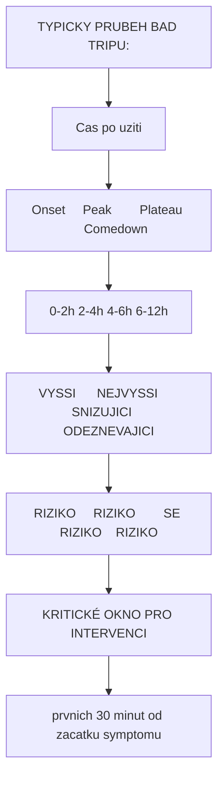

+++
title = "Rozpoznani a Symptomy"
description = "Jak rozpoznat bad trip - vcasne varovne znaky, progrese symptomu, diferencialni diagnostika psychedelickych krizi"
weight = 1
date = 2026-01-30
updated = 2026-01-30

[taxonomies]
tags = ["bad-trip", "symptomy", "diagnostika", "varovne-znaky", "psychoza"]
categories = ["harm-reduction", "medical"]

[extra]
lead = "Vcasne rozpoznani je klicove pro uspesnou intervenci"
+++

# Rozpoznani Bad Tripu

Vcasna identifikace rozvijejiciho se bad tripu umoznuje efektivnejsi intervenci a prevenci eskalace. Tato sekce popisuje **varovne znaky**, **progresi symptomu** a **diferencialni diagnostiku**.

---

## Varovne Znaky

### Casna Faze (Prvnich 5-15 minut)

| Znak | Projev | Vyznamnost |
|------|--------|------------|
| **Telesne napeti** | Zatnuté svaly, stisknuté celist | Vysoka |
| **Zrychleny dech** | Plytke, rychle dychani | Vysoka |
| **Zuzené zornice pri stimulantech** | Fyziologicka reakce | Stredni |
| **Neklid** | Neschopnost zustat v klidu | Vysoka |
| **Negativni anticipace** | "Toto nebude dobre" | Velmi vysoka |
| **Zaryte mlceni** | Nahlá ztrata komunikace | Vysoka |
| **Opetovne otazky** | "Co se deje?", "Kdy to skonci?" | Stredni |

### Vizualni Indikatory

```
TELESNE ZNAKY:
==============

Oblicej:
  [Bledost] → Strach, sympatikus
  [Cerveni] → Hypertermie, agitace
  [Pot]     → Uzkost, serotonin syndrom
  [Slzy]    → Emocni uvolneni nebo tisen

Postoj tela:
  [Strnulost]   → Zmrzle reakce (freeze)
  [Schouleni]  → Obrana, strach
  [Motoricky neklid] → Agitace
  [Tremor]     → Uzkost, stimulace
```

---

## Progrese Symptomu

### Stadium 1: Diskomfort (Mirny)

| Oblast | Prıznaky |
|--------|----------|
| **Kognitivni** | Negativni myslenkove smycky, ruminace |
| **Emocionalni** | Mírna uzkost, napeti, nepohodli |
| **Telesné** | Napetí, neklid, mírná nevolnost |
| **Behavioralni** | Hledani ujisteni, castejsi otazky |

**Prognoza**: Casto se spontanne zlepsi s podporou.

### Stadium 2: Tisen (Stredni)

| Oblast | Príznaky |
|--------|----------|
| **Kognitivni** | Paranoidni myšlení, zmatenost, obtizna koncentrace |
| **Emocionalni** | Vyrazna uzkost, strach, panika |
| **Telesné** | Tachykardie, poceni, tremor, hyperventilace |
| **Behavioralni** | Pokusy o unik, neklid, zadost o pomoc |

**Prognoza**: Vyzaduje aktivni intervenci.

### Stadium 3: Krize (Tezky)

| Oblast | Príznaky |
|--------|----------|
| **Kognitivni** | Dezorganizace mysleni, psychoticke prıznaky |
| **Emocionalni** | Teror, despair, ego disoluci |
| **Telesné** | Autonomni dysregulace, hypertermie |
| **Behavioralni** | Agitace, agrese, sebeposkozování |

**Prognoza**: Vyzaduje intenzivni intervenci, mozna farmakoterapie.

### Stadium 4: Kriticka Emergency

| Oblast | Príznaky |
|--------|----------|
| **Kognitivni** | Ztrata kontaktu s realitou |
| **Emocionalni** | Extremni stav |
| **Telesné** | Zachvaty, hypertermie >40°C, koma |
| **Behavioralni** | Aktivni sebeposkozovani, agrese |

**Akce**: **OKAMZITE VOLAT 155**

---

## Casova Osa Progrese



<details>
<summary>ASCII verze diagramu</summary>

```
TYPICKY PRUBEH BAD TRIPU:
=========================

Cas po uziti
    |
    v
[Onset]     [Peak]        [Plateau]     [Comedown]
0-2h        2-4h          4-6h          6-12h
   |           |              |             |
   v           v              v             v
VYSSI      NEJVYSSI      SNIZUJICI    ODEZNEVAJICI
RIZIKO     RIZIKO        SE RIZIKO    RIZIKO

                  ↑
        KRITICKÉ OKNO PRO INTERVENCI
        (prvnich 30 minut od zacatku symptomu)
```

</details>

### Trvání Dle Latky

| Latka | Onset | Peak | Celkove trvani | Rizikové okno |
|-------|-------|------|----------------|---------------|
| **LSD** | 30-60 min | 2-4 h | 8-12 h | Dlouhe |
| **Psilocybin** | 20-45 min | 1-2 h | 4-6 h | Stredni |
| **DMT (kourena)** | 2-5 min | 5-15 min | 20-45 min | Kratke |
| **Ayahuasca** | 30-60 min | 1.5-3 h | 4-8 h | Stredni |
| **MDMA** | 30-60 min | 1-2 h | 3-5 h | Stredni |
| **Ketamin** | 5-15 min | 30-60 min | 1-2 h | Kratke |
| **Amanita muscaria** | 30-120 min | 2-4 h | 4-10 h | Dlouhe, nepredvidatelne |

---

## Specificke Projevy Dle Latek

### Klasicka Psychedelika (LSD, Psilocybin, DMT)

| Priznak | Frekvence | Specificka Rizika |
|---------|-----------|-------------------|
| Uzkost/panika | Velmi caste | Eskalace do terror |
| Paranoia | Caste | Agrese, unik |
| Ego disoluci | Caste | "Umiram", ztrata identity |
| Time dilation | Velmi caste | "Nikdy to neskonci" |
| Thought loops | Caste | Frustrace, vyčerpani |
| Vizualni distorze | Vzdy pritomne | Desi, zmatenost |

### MDMA

| Priznak | Frekvence | Specificka Rizika |
|---------|-----------|-------------------|
| Uzkost | Mene caste | Casto na comedownu |
| Hypertermie | Riziko | **ZIVOT OHROZUJICI** |
| Hyponatremie | Riziko | **ZIVOT OHROZUJICI** (prilis vody) |
| Bruxismus | Velmi caste | Diskomfort |
| Serotonin syndrom | Vzacne | **ZIVOT OHROZUJICI** |

### Ketamin

| Priznak | Frekvence | Specificka Rizika |
|---------|-----------|-------------------|
| K-hole | Caste pri vysoke davce | Dezorientace, ztrata motility |
| Disociace | Vzdy pritomna | Panika z neovladani tela |
| Nevolnost | Caste | Riziko aspirace |
| Ataxie | Vzdy pritomna | Pady, zraneni |

### Amanita muscaria (Muscimol)

| Priznak | Frekvence | Specificka Rizika |
|---------|-----------|-------------------|
| Delírium | Caste | Ztrata kontaktu s realitou |
| Somnolencie | Caste | Riziko aspirace |
| Ataxie | Velmi caste | Pady, zraneni |
| Macropsia/micropsia | Caste | Dezorientace |
| Nepredvidatelnost | Charakteristicka | Obtizna intervence |

---

## Diferencialni Diagnostika

### Psychedelicka Krize vs. Jine Stavy

| Stav | Rozlisujici Znaky |
|------|-------------------|
| **Psychedelicka krize** | Casova souvislost s uzitim, typicke efekty latky, vetsinou zachovany kontakt |
| **Serotonin syndrom** | Hypetremie, rigidita, tremor, klonus, hyperreflexie |
| **Maligni neurolepticky syndrom** | Rigidita, hypertermie, ČAS po uziti neuroleptik |
| **Anticholinergni toxidrom** | Suchost, mydriaza, retence moci, tachykardie, hypertermie |
| **Hypoglykemie** | Bledost, poceni, zmatenost, bez vizualnich efektu |
| **Panicka ataka bez latek** | Zadna casova souvislost s uzitim, typicky kratsi |
| **Akutni psychoza** | Delsi trvani, zadna casova souvislost s latkou |

### Serotonin Syndrom - ROZPOZNANI

```mermaid
flowchart TD
    node_SEROTONINSYNDROMVARO["SEROTONIN SYNDROM - VAROVNE ZNAKY:"]
    node_TriadaKogniceAutonom["Triada: Kognice + Autonomni + Neuromuskulární"]
    node_KOGNITIVN["KOGNITIVNÍ:"]
    node_Agitace["• Agitace"]
    node_Zmatenost["• Zmatenost"]
    node_Hypomanie["• Hypo/manie"]
    node_AUTONOMNI["AUTONOMNI:"]
    node_Tachykardie["• Tachykardie"]
    node_Hypertermie38C["• Hypertermie &gt;38°C"]
    node_Mydriazarozsirenezor["• Mydriaza rozsirene zornice"]
    node_Poceni["• Poceni"]
    node_Prujem["• Prujem"]
    node_NEUROMUSKULARNI["NEUROMUSKULARNI:"]
    node_Tremor["• Tremor"]
    node_Hyperreflexie["• Hyperreflexie"]
    node_Klonusrhythmickkontr["• Klonus rhythmické kontrakce"]
    node_Rigiditaztuhlost["• Rigidita ztuhlost"]
    node_Myoklonus["• Myoklonus"]
    node_VYSOKERIZIKOPRIKOMBI["⚠️ VYSOKE RIZIKO PRI KOMBINACI:"]
    node_MAOITryptaminyDMTPsi["MAOI + Tryptaminy DMT, Psilocybin"]
    node_MAOIMDMA["MAOI + MDMA"]
    node_SSRIMDMA["SSRI + MDMA"]
    node_Lithiumpsychedelika["Lithium + psychedelika"]
    node_PRIPODEZRENIOKAMZITE["PRI PODEZRENI OKAMZITE VOLAT 155"]

    node_SEROTONINSYNDROMVARO --> node_TriadaKogniceAutonom
    node_TriadaKogniceAutonom --> node_KOGNITIVN
    node_KOGNITIVN --> node_Agitace
    node_Agitace --> node_Zmatenost
    node_Zmatenost --> node_Hypomanie
    node_Hypomanie --> node_AUTONOMNI
    node_AUTONOMNI --> node_Tachykardie
    node_Tachykardie --> node_Hypertermie38C
    node_Hypertermie38C --> node_Mydriazarozsirenezor
    node_Mydriazarozsirenezor --> node_Poceni
    node_Poceni --> node_Prujem
    node_Prujem --> node_NEUROMUSKULARNI
    node_NEUROMUSKULARNI --> node_Tremor
    node_Tremor --> node_Hyperreflexie
    node_Hyperreflexie --> node_Klonusrhythmickkontr
    node_Klonusrhythmickkontr --> node_Rigiditaztuhlost
    node_Rigiditaztuhlost --> node_Myoklonus
    node_Myoklonus --> node_VYSOKERIZIKOPRIKOMBI
    node_VYSOKERIZIKOPRIKOMBI --> node_MAOITryptaminyDMTPsi
    node_MAOITryptaminyDMTPsi --> node_MAOIMDMA
    node_MAOIMDMA --> node_SSRIMDMA
    node_SSRIMDMA --> node_Lithiumpsychedelika
    node_Lithiumpsychedelika --> node_PRIPODEZRENIOKAMZITE
```



<details>
<summary>ASCII verze diagramu</summary>

```
SEROTONIN SYNDROM - VAROVNE ZNAKY:
==================================

Triada: Kognice + Autonomni + Neuromuskulární

KOGNITIVNÍ:
  • Agitace
  • Zmatenost
  • Hypo/manie

AUTONOMNI:
  • Tachykardie
  • Hypertermie (>38°C)
  • Mydriaza (rozsirene zornice)
  • Poceni
  • Prujem

NEUROMUSKULARNI:
  • Tremor
  • Hyperreflexie
  • Klonus (rhythmické kontrakce)
  • Rigidita (ztuhlost)
  • Myoklonus

⚠️ VYSOKE RIZIKO PRI KOMBINACI:
   MAOI + Tryptaminy (DMT, Psilocybin)
   MAOI + MDMA
   SSRI + MDMA
   Lithium + psychedelika

→ PRI PODEZRENI OKAMZITE VOLAT 155
```

</details>

---

## Hodnotici Nastroje

### Rychle Hodnoceni (ABCDE)

| Krok | Oblast | Otazka |
|------|--------|--------|
| **A** | Airway | Ma volne dychaci cesty? |
| **B** | Breathing | Dycha spontanne a dostatecne? |
| **C** | Circulation | Je puls hmatny, barva kuze? |
| **D** | Disability | Je pri vedomi? Reaguje? |
| **E** | Environment | Je prostredi bezpecne? |

### Psychologicke Hodnoceni (STAMP)

| Krok | Oblast | Hodnoceni |
|------|--------|-----------|
| **S** | Speech | Srozumitelna? Tempo? |
| **T** | Thought | Organizovane? Paranoidni? |
| **A** | Affect | Adekvátní situaci? |
| **M** | Motor | Klidny? Agitovany? |
| **P** | Perception | Halucinace? Iluze? |

### Skala Intenzity Krize

| Uroven | Skore | Indikatory | Intervence |
|--------|-------|------------|------------|
| **1 - Mirna** | 1-3 | Diskomfort, mírna uzkost | Podpora, přítomnost |
| **2 - Stredni** | 4-6 | Panika, paranoia, tisen | Aktivni intervence |
| **3 - Tezka** | 7-8 | Psychotické příznaky, agitace | Farmakoterapie úvaha |
| **4 - Kriticka** | 9-10 | Sebeposkozeni, zachvaty, hypertermie | **155 OKAMZITE** |

---

## Specificke Populace

### Prvni Uziti

| Faktor | Riziko |
|--------|--------|
| Zadna zkusenost s altered states | Vysoke |
| Neznama reakce na latku | Vysoke |
| Castejsi panika z neznameho | Vysoke |
| Absence coping strategií | Vysoke |

**Doporuceni**: Nizsi davka, zkuseny trip sitter povinny.

### Psychiatricka Anamneza

| Diagnoza | Specificka Rizika |
|----------|-------------------|
| Schizofrenie/psychotické poruchy | **KONTRAINDIKACE** - dekompenzace |
| Bipolarní porucha | Manie, psychoza |
| Tezka deprese | Zhoršení, suicidalní ideace |
| PTSD | Retraumatizace, flashbacky |
| Úzkostné poruchy | Vyrazna panika |

### Kombinace Latek

| Kombinace | Riziko |
|-----------|--------|
| Psychedelika + MAOI | Serotonin syndrom |
| Psychedelika + Lithium | Zachvaty |
| MDMA + Stimulanty | Kardiotoxicita, hypertermie |
| Psychedelika + Alkohol | Dezinhibice, spatne rozhodovani |
| Psychedelika + Cannabis | Potenciace, panika |

---

## Varovne Signaly pro Sittera

### "Cervene Vlajky" - Okamzita Akce

| Signal | Vyznam | Akce |
|--------|--------|------|
| "Chci umirat" | Mozna suicidalita | Primy dohled, hodnoceni |
| Nahlé ticho po agitaci | Mozna disociace nebo prechod do krize | Jemne oslovit |
| Pokus o odchod | Unik, mozne nebezpeci | Nenásilně zadržet, uklidnit |
| Sebeposkozovani | Akutni krize | 155, fyzicka bezpecnost |
| Ztrata vedomi | Medicínská emergency | 155 okamzite |
| Zachvaty | Medicínská emergency | 155 okamzite |
| "Uz nikdy nebude normalne" | Existenciální distres | Kotveni, ujisteni |

### "Zlute Vlajky" - Zvýsená Pozornost

| Signal | Vyznam | Akce |
|--------|--------|------|
| Opakujici se otazky | Thought loops | Jemne presmerovat |
| Zrychleny dech | Narůstající uzkost | Spolecne dychani |
| Fyzicky neklid | Agitace | Nabidnout pohyb, zmenu |
| "Kdy to skonci?" | Netrpelivost, tísen | Casová orientace |
| Paranoidní zmínky | Rozvoj paranoje | Nenaplnovat, kotvit |

---

## Souhrn

### Klicove Body

1. **Vcasné rozpoznani** = efektivnejsi intervence
2. **Progrese je prevence** - jednat v casnych fazsích
3. **Každá latka má specifika** - znat rizika konkretni latky
4. **Medicínské emergency** vyzaduji profesionální pomoc (155)
5. **Diferencialni diagnostika** - nekterá rizika jsou zivot ohrozující

### Rozhodovaci Schema

```
ROZPOZNAL/A JSEM VAROVNE ZNAKY?
              |
              v
         [ANO] → Presuñ se k OKAMZITE INTERVENCI
              |
              v
    JE PRITOMEN NEKTERY Z TECHTO?
    • Zachvaty
    • Hypertermie >40°C
    • Sebeposkozovani
    • Bezvedomi
    • Bolest na hrudi
              |
         [ANO] → VOLEJ 155 OKAMZITE
              |
         [NE] → Pokracuj v psychologicke intervenci
```

---

## Pokracovat

- **Dalsi krok**: [Okamzita Intervence](@/harm-reduction/bad-trip/okamzita-intervence.md)
- **Zpet na prehled**: [Bad Trip](@/harm-reduction/bad-trip/_index.md)

---

*Posledni aktualizace: 2026-01-30*
