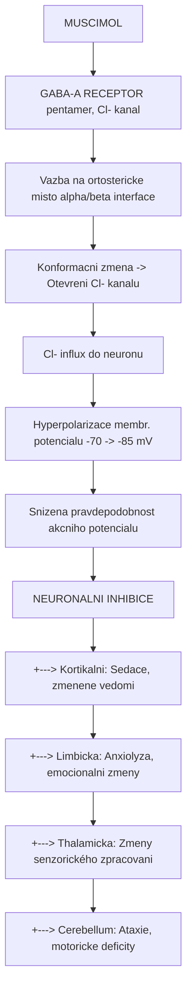
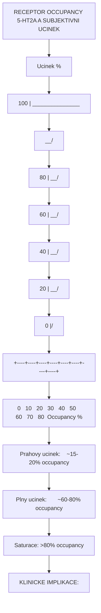

+++
title = "Mechanismy ucinku"
description = "Kompletni prehled mechanismu ucinku psychoaktivnich latek - receptorova kinetika, signalni transdukce, alostericka modulace, farmakokinetika-farmakodynamika"
weight = 3
sort_by = "weight"
insert_anchor_links = "right"
+++

# Mechanismy ucinku psychoaktivnich latek

**Mechanismy ucinku** (mechanisms of action, MOA) popisuji molekularni, bunecne a systemove procesy, jimiiz psychoaktivni latky vyvolavaji sve ucinky. Tato sekce pokryva ctyri fundamentalni aspekty: **receptorovou kinetiku a termodynamiku**, **signalni transdukci**, **alosterickou modulaci** a **farmakokinetiko-farmakodynamicke vztahy**.

---

## Zakladni principy farmakologickeho ucinku

### Od molekuly k ucinkum

```
PSYCHOAKTIVNI LATKA
        |
        v
[1] FARMAKOKINETIKA (PK)
    Absorpce -> Distribuce -> Metabolismus -> Eliminace
    "Co telo dela s latkou"
        |
        v
[2] RECEPTOROVA INTERAKCE
    Vazba ligandu -> Konformacni zmena receptoru
    "Molekularni udalost"
        |
        v
[3] SIGNALNI TRANSDUKCE
    G-proteiny, iontove kanaly, enzymy, genova exprese
    "Bunecna odpoved"
        |
        v
[4] FARMAKODYNAMIKA (PD)
    Neuronalni aktivita -> Okruhy -> Chovani
    "Co latka dela s telem"
        |
        v
SUBJEKTIVNI UCINEK
```

### Hierarchie efektu

| Uroven | Casovy ramec | Proces | Metody studia |
|--------|-------------|--------|---------------|
| **Molekularni** | ns-us | Vazba ligand-receptor, konformacni zmeny | Krystalografie, Cryo-EM, FRET |
| **Subcelularni** | us-ms | Aktivace G-proteinu, otevreni kanalu | Patch-clamp, BRET |
| **Bunecni** | ms-s | Ca2+ signaly, fosforylace, genova exprese | Ca2+ imaging, Western blot |
| **Synapticky** | ms-min | Synapticky prenos, plasticita | Elektrofyziologie |
| **Okruhovy** | s-h | Neuronalni site, oscilace | fMRI, EEG, MEG |
| **Systemovy** | min-h | Chovani, vnimani, vedomi | Psychometrie, fMRI |
| **Adaptivni** | h-dny | Neuroplasticita, tolerance, senzitizace | Longitudinalni studie |

---

## Klasifikace mechanismu podle typu receptoru

### Tri hlavni typy receptorovych mechanismu

```
1. GPCR (G-protein coupled receptors)
   Latky: LSD, psilocin, DMT, meskalin
   Receptor: 5-HT2A, 5-HT1A, D2
   Cas odpovedi: sekundy-minuty
   Signalizace: G-protein -> second messenger -> efektory

2. IONOTROPNI RECEPTORY
   Latky: muscimol, ketamin, PCP
   Receptor: GABA-A, NMDA
   Cas odpovedi: milisekundy
   Signalizace: Iontovy flux -> zmena membranoveho potencialu

3. TRANSPORTEROVE MECHANISMY
   Latky: MDMA, kokain, amfetaminy
   Cil: SERT, DAT, NET
   Cas odpovedi: sekundy
   Signalizace: Zvysena synaptická koncentrace monoaminu
```

### Srovnavaci tabulka mechanismu

| Mechanismus | Reprezentativni latka | Primarni cil | Typ interakce | Casovy profil |
|-------------|----------------------|--------------|----------------|---------------|
| **5-HT2A agonismus** | [Psilocybin](@/alkaloids/psilocybin.md) | [5-HT2A](@/receptors/5-ht2a.md) GPCR | Ortostericky agonismus | min-h |
| **5-HT2A agonismus (biased)** | [LSD](@/alkaloids/lsd.md) | [5-HT2A](@/receptors/5-ht2a.md) GPCR | Biased agonismus | h (prolongovany) |
| **NMDA antagonismus** | Ketamin | [NMDA](@/receptors/nmda.md) ionotrop. | Kanalovy blokator | ms (akutni) |
| **Sigma-1 agonismus** | [DMT](@/alkaloids/dmt.md) | [Sigma-1](@/receptors/sigma-1.md) | Chaperon | min-h |
| **kappa-opioid agonismus** | [Salvinorin A](@/alkaloids/salvinorin.md) | [KOR](@/receptors/opioid.md) | Ortostericky agonismus | min |
| **MAO inhibice** | Harmin | MAO-A enzym | Reverzibilni inhibice | h |
| **SERT reversal** | MDMA | SERT transporter | Substrat/reversal | h |

---

## Centralni signalni drahy psychoaktivnich latek

### 5-HT2A/Gq signalni kaskada (klasicka psychedelika)

Toto je **nejdulezitejsi** signalni draha pro ucinky klasickych psychedelik:

```mermaid
flowchart TD
    node_PSYCHEDELIKUMLSDpsil["PSYCHEDELIKUM LSD, psilocin, DMT, meskalin"]
    node_5HT2ARECEPTOR7TMGPCR["5-HT2A RECEPTOR 7-TM GPCR"]
    node_DRAHA1Gq11KANONICK["+---&gt; DRAHA 1: Gq/11 - KANONICKÁ"]
    node_FosfolipazaCbetaPLCb["Fosfolipaza C-beta PLCbeta"]
    node_169463c0["------+-------"]
    node_IP3DAG["IP3           DAG"]
    node_Ca2zERPKCaktivace["Ca2+ z ER    PKC aktivace"]
    node_CalmodulinFosforylac["Calmodulin   Fosforylace substratu"]
    node_CaMKIIERK12["CaMKII       ERK1/2"]
    node_4f76f3cc["+------+------+"]
    node_CREB["CREB"]
    node_Genovaexprese["Genova exprese"]
    node_BDNFArccFosEGR1["BDNF, Arc, c-Fos, EGR1"]
    node_NEUROPLASTICITA["NEUROPLASTICITA"]
    node_DRAHA2betaarrestin["+---&gt; DRAHA 2: beta-arrestin"]
    node_Receptorinternalizac["Receptor internalizace"]
    node_ERK12prolongovana["ERK1/2 prolongovana"]
    node_DESENZITIZACETOLERAN["DESENZITIZACE + TOLERANCE"]
    node_DRAHA3SrcAktmTOR["+---&gt; DRAHA 3: Src/Akt/mTOR"]
    node_mTORC1aktivace["mTORC1 aktivace"]
    node_Syntezaproteinu["Synteza proteinu"]
    node_Dendritickyrust["Dendriticky rust"]
    node_Synaptogeneze["Synaptogeneze"]

    node_PSYCHEDELIKUMLSDpsil --> node_5HT2ARECEPTOR7TMGPCR
    node_5HT2ARECEPTOR7TMGPCR --> node_DRAHA1Gq11KANONICK
    node_DRAHA1Gq11KANONICK --> node_FosfolipazaCbetaPLCb
    node_FosfolipazaCbetaPLCb --> node_169463c0
    node_169463c0 --> node_IP3DAG
    node_IP3DAG --> node_Ca2zERPKCaktivace
    node_Ca2zERPKCaktivace --> node_CalmodulinFosforylac
    node_CalmodulinFosforylac --> node_CaMKIIERK12
    node_CaMKIIERK12 --> node_4f76f3cc
    node_4f76f3cc --> node_CREB
    node_CREB --> node_Genovaexprese
    node_Genovaexprese --> node_BDNFArccFosEGR1
    node_BDNFArccFosEGR1 --> node_NEUROPLASTICITA
    node_NEUROPLASTICITA --> node_DRAHA2betaarrestin
    node_DRAHA2betaarrestin --> node_Receptorinternalizac
    node_Receptorinternalizac --> node_ERK12prolongovana
    node_ERK12prolongovana --> node_DESENZITIZACETOLERAN
    node_DESENZITIZACETOLERAN --> node_DRAHA3SrcAktmTOR
    node_DRAHA3SrcAktmTOR --> node_mTORC1aktivace
    node_mTORC1aktivace --> node_Syntezaproteinu
    node_Syntezaproteinu --> node_Dendritickyrust
    node_Dendritickyrust --> node_Synaptogeneze

    click node_PSYCHEDELIKUMLSDpsil "/alkaloids/lsd/" "PSYCHEDELIKUM LSD, psilocin, DMT, meskalin"
    click node_5HT2ARECEPTOR7TMGPCR "/receptors/5-ht2a/" "5-HT2A RECEPTOR 7-TM GPCR"
```



<details>
<summary>ASCII verze diagramu</summary>

```
[PSYCHEDELIKUM] (LSD, psilocin, DMT, meskalin)
        |
        v
  5-HT2A RECEPTOR (7-TM GPCR)
        |
        +---> [DRAHA 1: Gq/11 - KANONICKÁ]
        |           |
        |           v
        |     Fosfolipaza C-beta (PLCbeta)
        |           |
        |     ------+-------
        |     |             |
        |     v             v
        |    IP3           DAG
        |     |             |
        |     v             v
        |   Ca2+ z ER    PKC aktivace
        |     |             |
        |     v             v
        |   Calmodulin   Fosforylace substratu
        |     |             |
        |     v             v
        |   CaMKII       ERK1/2
        |     |             |
        |     +------+------+
        |            |
        |            v
        |          CREB
        |            |
        |            v
        |     Genova exprese
        |     (BDNF, Arc, c-Fos, EGR1)
        |            |
        |            v
        |     NEUROPLASTICITA
        |
        +---> [DRAHA 2: beta-arrestin]
        |           |
        |           v
        |     Receptor internalizace
        |           |
        |           v
        |     ERK1/2 (prolongovana)
        |           |
        |           v
        |     DESENZITIZACE + TOLERANCE
        |
        +---> [DRAHA 3: Src/Akt/mTOR]
                    |
                    v
              mTORC1 aktivace
                    |
                    v
              Synteza proteinu
                    |
                    v
              Dendriticky rust
              Synaptogeneze
```

</details>

#### Kvantitativni parametry Gq drahy

| Parametr | Hodnota | Metoda mereni |
|----------|---------|---------------|
| **Cas aktivace Gq** | 50-200 ms | FRET senzory |
| **Peak Ca2+ odpoved** | 200-500 nM (z bazalnich ~100 nM) | Fura-2, GCaMP |
| **Cas Ca2+ tranzienta** | 5-30 s | Ca2+ imaging |
| **ERK1/2 fosforylace** | Peak 5-15 min | Western blot |
| **CREB fosforylace** | Peak 15-60 min | Immunohistochemie |
| **BDNF mRNA indukce** | Peak 1-3 h | RT-qPCR |
| **BDNF protein elevace** | Peak 6-24 h | ELISA |
| **Dendriticke zmeny** | 24-72 h | Golgi barveni, 2-fotonova |

### Ionotropni signalizace (GABA-A: muscimol)



<details>
<summary>ASCII verze diagramu</summary>

```
[MUSCIMOL]
    |
    v
GABA-A RECEPTOR (pentamer, Cl- kanal)
    |
    v
Vazba na ortostericke misto (alpha/beta interface)
    |
    v
Konformacni zmena -> Otevreni Cl- kanalu
    |
    v
Cl- influx do neuronu
    |
    v
Hyperpolarizace membr. potencialu (-70 -> -85 mV)
    |
    v
Snizena pravdepodobnost akcniho potencialu
    |
    v
NEURONALNI INHIBICE
    |
    +---> Kortikalni: Sedace, zmenene vedomi
    +---> Limbicka: Anxiolyza, emocionalni zmeny
    +---> Thalamicka: Zmeny senzorického zpracovani
    +---> Cerebellum: Ataxie, motoricke deficity
```

</details>

#### Kineticke parametry GABA-A kanalu

| Parametr | GABA | Muscimol | Jednotka |
|----------|------|----------|----------|
| **EC50** | 10-30 | 3-10 | uM |
| **Cas otevreni** | 1-3 | 3-8 | ms |
| **Cas deaktivace** | 20-50 | 50-150 | ms |
| **Desenzitizace** | 100-500 | 200-800 | ms |
| **Vodivost kanalu** | 25-30 | 25-30 | pS |
| **Selektivita Cl/Na** | >10:1 | >10:1 | - |

### NMDA antagonismus (ketamin, PCP, DXM)

```mermaid
flowchart TD
    node_KETAMIN["KETAMIN"]
    node_NMDARECEPTORtetramer["NMDA RECEPTOR tetramer, Ca2+/Na+ kanal"]
    node_VazbavkanalovemporuM["Vazba v kanalovem poru MK-801 / PCP site"]
    node_BlokadaCa2aNainfluxu["Blokada Ca2+ a Na+ influxu"]
    node_AKUTNIEFEKTDisociace["+---&gt; AKUTNI EFEKT: Disociace"]
    node_Snizenakortialnakone["+---&gt; Snizena kortialna konektivita"]
    node_Thalamickadezinhibic["+---&gt; Thalamicka dezinhibice"]
    node_Disociacevedomiodtel["+---&gt; 'Disociace' vedomi od tela"]
    node_SUBAKUTNIEFEKTAntide["+---&gt; SUBAKUTNI EFEKT: Antidepresivni"]
    node_Paradoxniglutamatovy["Paradoxni glutamatovy burst"]
    node_dezinhibiceinterneur["dezinhibice interneuronu"]
    node_AMPAreceptoraktivace["AMPA receptor aktivace"]
    node_BDNFuvolneni["BDNF uvolneni"]
    node_TrkBmTORC1Synaptogen["TrkB -&gt; mTORC1 -&gt; Synaptogeneze"]
    node_ANTIDEPRESIVNIUCINEK["ANTIDEPRESIVNI UCINEK 24-72 h"]

    node_KETAMIN --> node_NMDARECEPTORtetramer
    node_NMDARECEPTORtetramer --> node_VazbavkanalovemporuM
    node_VazbavkanalovemporuM --> node_BlokadaCa2aNainfluxu
    node_BlokadaCa2aNainfluxu --> node_AKUTNIEFEKTDisociace
    node_AKUTNIEFEKTDisociace --> node_Snizenakortialnakone
    node_Snizenakortialnakone --> node_Thalamickadezinhibic
    node_Thalamickadezinhibic --> node_Disociacevedomiodtel
    node_Disociacevedomiodtel --> node_SUBAKUTNIEFEKTAntide
    node_SUBAKUTNIEFEKTAntide --> node_Paradoxniglutamatovy
    node_Paradoxniglutamatovy --> node_dezinhibiceinterneur
    node_dezinhibiceinterneur --> node_AMPAreceptoraktivace
    node_AMPAreceptoraktivace --> node_BDNFuvolneni
    node_BDNFuvolneni --> node_TrkBmTORC1Synaptogen
    node_TrkBmTORC1Synaptogen --> node_ANTIDEPRESIVNIUCINEK

    click node_NMDARECEPTORtetramer "/receptors/nmda/" "NMDA RECEPTOR tetramer, Ca2+/Na+ kanal"
    click node_Snizenakortialnakone "/receptors/opioid/" "+---> Snizena kortialna konektivita"
    click node_AMPAreceptoraktivace "/receptors/ampa/" "AMPA receptor aktivace"
```



<details>
<summary>ASCII verze diagramu</summary>

```
[KETAMIN]
    |
    v
NMDA RECEPTOR (tetramer, Ca2+/Na+ kanal)
    |
    v
Vazba v kanalovem poru (MK-801 / PCP site)
    |
    v
Blokada Ca2+ a Na+ influxu
    |
    v
+---> [AKUTNI EFEKT: Disociace]
|         |
|         +---> Snizena kortialna konektivita
|         +---> Thalamicka dezinhibice
|         +---> "Disociace" vedomi od tela
|
+---> [SUBAKUTNI EFEKT: Antidepresivni]
          |
          v
    Paradoxni glutamatovy burst
    (dezinhibice interneuronu)
          |
          v
    AMPA receptor aktivace
          |
          v
    BDNF uvolneni
          |
          v
    TrkB -> mTORC1 -> Synaptogeneze
          |
          v
    ANTIDEPRESIVNI UCINEK (24-72 h)
```

</details>

---

## Farmakokineticko-farmakodynamicke vztahy

### PK-PD modely pro psychedelika

```mermaid
flowchart TD
    node_PLAZMATICKYPROFILvsU["PLAZMATICKY PROFIL vs UCINEK"]
    node_KoncentraceSubjektiv["Koncentrace                        Subjektivni intenzita"]
    node_CmaxPeak["Cmax                            |     Peak"]
    node_31096d55["/\                              |    _____"]
    node_c9a555f0["/  \                             |   /     \"]
    node_b52993db["/    \__                          |  /       \___"]
    node_4d23d721["/        \___                      | /            \___"]
    node_47e055ef["/             \____                 |/                 \____"]
    node_9ef4e4e1["+----+----+----+----+----&gt;           +----+----+----+----+----&gt;"]
    node_02468h02468h["0    2    4    6    8   h            0    2    4    6    8   h"]
    node_PSILOCYBINLSD["PSILOCYBIN:                         LSD:"]
    node_Tmax115hTmax1525h["Tmax = 1-1.5h                       Tmax = 1.5-2.5h"]
    node_T122535hT1235h["T1/2 = 2.5-3.5h                    T1/2 = 3-5h"]
    node_Ucinek46hUcinek812h["Ucinek = 4-6h                       Ucinek = 8-12h !"]
    node_receptortrapping["receptor trapping"]

    node_PLAZMATICKYPROFILvsU --> node_KoncentraceSubjektiv
    node_KoncentraceSubjektiv --> node_CmaxPeak
    node_CmaxPeak --> node_31096d55
    node_31096d55 --> node_c9a555f0
    node_c9a555f0 --> node_b52993db
    node_b52993db --> node_4d23d721
    node_4d23d721 --> node_47e055ef
    node_47e055ef --> node_9ef4e4e1
    node_9ef4e4e1 --> node_02468h02468h
    node_02468h02468h --> node_PSILOCYBINLSD
    node_PSILOCYBINLSD --> node_Tmax115hTmax1525h
    node_Tmax115hTmax1525h --> node_T122535hT1235h
    node_T122535hT1235h --> node_Ucinek46hUcinek812h
    node_Ucinek46hUcinek812h --> node_receptortrapping

    click node_PSILOCYBINLSD "/alkaloids/psilocybin/" "PSILOCYBIN:                         LSD:"
```



<details>
<summary>ASCII verze diagramu</summary>

```
PLAZMATICKY PROFIL vs UCINEK

Koncentrace                        Subjektivni intenzita
    ^                                    ^
    |    Cmax                            |     Peak
    |    /\                              |    _____
    |   /  \                             |   /     \
    |  /    \__                          |  /       \___
    | /        \___                      | /            \___
    |/             \____                 |/                 \____
    +----+----+----+----+---->           +----+----+----+----+---->
    0    2    4    6    8   h            0    2    4    6    8   h

    PSILOCYBIN:                         LSD:
    Tmax = 1-1.5h                       Tmax = 1.5-2.5h
    T1/2 = 2.5-3.5h                    T1/2 = 3-5h
    Ucinek = 4-6h                       Ucinek = 8-12h (!)
                                        (receptor trapping)
```

</details>

### Doza-odpoved krivky

| Latka | ED50 (mg) | Emax (VAS 0-100) | Hillova koeficient | Terapeuticky index |
|-------|-----------|-------------------|--------------------|--------------------|
| [LSD](@/alkaloids/lsd.md) | 0.075 | 85-95 | 1.8-2.5 | >1000 |
| [Psilocybin](@/alkaloids/psilocybin.md) | 15-20 | 80-90 | 1.5-2.0 | >100 |
| [DMT](@/alkaloids/dmt.md) (inh.) | 20-25 | 85-95 | 2.0-3.0 | >50 |
| [Meskalin](@/alkaloids/mescaline.md) | 250-300 | 70-80 | 1.2-1.5 | >10 |
| Ketamin | 0.3 mg/kg | 75-85 | 1.5-2.0 | ~10 |

### Vztah receptor occupancy - ucinek



<details>
<summary>ASCII verze diagramu</summary>

```
RECEPTOR OCCUPANCY (5-HT2A) A SUBJEKTIVNI UCINEK

Ucinek (%)
100 |                            _______________
    |                         __/
 80 |                      __/
    |                   __/
 60 |                __/
    |             __/
 40 |          __/
    |       __/
 20 |    __/
    | __/
  0 |/
    +----+----+----+----+----+----+----+----+
    0   10   20   30   40   50   60   70   80  Occupancy (%)

Prahovy ucinek:    ~15-20% occupancy
Plny ucinek:       ~60-80% occupancy
Saturace:          >80% occupancy

KLINICKE IMPLIKACE:
- Mikrodavka (5-10 ug LSD): ~5-10% occupancy -> subperceptualni
- Stredni davka (100 ug LSD): ~40-60% occupancy -> psychedelicky stav
- Vysoka davka (200+ ug LSD): ~70-80% occupancy -> ego dissolution
```

</details>

---

## Specificke mechanismy jednotlivych latek

### Tryptaminy (psilocybin, DMT, 5-MeO-DMT)

| Parametr | [Psilocybin](@/alkaloids/psilocybin.md) | [DMT](@/alkaloids/dmt.md) | [5-MeO-DMT](@/alkaloids/5-meo-dmt.md) |
|----------|------------|-----|-----------|
| **Primarni cil** | [5-HT2A](@/receptors/5-ht2a.md) | [5-HT2A](@/receptors/5-ht2a.md), [Sigma-1](@/receptors/sigma-1.md) | [5-HT2A](@/receptors/5-ht2a.md), [5-HT1A](@/receptors/5-ht1a.md) |
| **Ki 5-HT2A (nM)** | 6 (psilocin) | 75-130 | 3-10 |
| **Gq aktivace** | +++ | ++ | +++ |
| **beta-arrestin** | ++ | + | ++ |
| **Neuroplasticita** | Vysoka (BDNF +300%) | Stredni | Vysoka |
| **Prodrug?** | Ano (defosforylace) | Ne | Ne |
| **Trvani** | 4-6 h | 15-45 min | 15-30 min |
| **Unikatni mech.** | mTOR, TrkB | Sigma-1, endogenni | 5-HT1A dominance |

### Ergoliny (LSD)

```
LSD - UNIKATNI FARMAKOLOGICKY PROFIL
====================================

1. Polyfarmakologie: 12+ receptoru s Ki <100 nM
   5-HT2A (1-2 nM) | 5-HT1A (2 nM) | 5-HT2C (5 nM)
   D1 (20 nM) | D2 (10 nM) | D3 (5 nM)
   alfa-1A (10 nM) | TAAR1 (50 nM)

2. Receptor trapping ("Lid" mechanismus):
   Extracellularni smycka 2 (EL2) se zavira nad LSD
   -> Rezidencni cas: minuty (vs ms pro serotonin)
   -> Vysvetluje 8-12h trvani i pri T1/2 = 3-5h

3. Biased agonismus:
   Gq/11 >> beta-arrestin
   -> Silna halucinogenni aktivita
   -> Slaba desenzitizace
   -> Prolongovana signalizace

4. Funkcionalni selektivita:
   Odlisny signalni profil od serotoninu
   -> Specificke aktivace downstream efektoru
   -> Unikatni fenomenologie
```

### GABAergni latky (muscimol)

|----------|----------|------|----------|
| **Vazebne misto** | Ortostericke | Ortostericke | Alostericke (BZ) |
| **Ki (nM)** | 5-10 | 50-100 | 20 (BZ site) |
| **Mechanismus** | Primy agonismus | Primy agonismus | PAM |
| **Ucinnost bez GABA** | Ano | - | Ne |
| **Max. aktivace** | 100% | 100% | +200% GABA |
| **BBB prostup** | Vysoky | Nizky | Vysoky |
| **Desenzitizace** | Rychla | Stredni | Pomala |

### Disociativa (ketamin, PCP, DXM)

```
DISOCIATIVA - MECHANISMUS KANALOVE BLOKADY

Normalni NMDA aktivace:
    Glutamat + Glycin + Depolarizace
              |
              v
    [NMDA receptor OTEVREN]
    Ca2+, Na+ -----> neuron
              |
              v
    Synapticky prenos, plasticita

S ketaminem:
    Glutamat + Glycin + Depolarizace
              |
              v
    [NMDA receptor OTEVREN]
    Ca2+, Na+ --X--> neuron
              ^
              |
         [KETAMIN blokuje por]
         (use-dependent block)
              |
              v
    Snizeny Ca2+ influx
    Narusena synaptická transmise
    DISOCIACE
```

#### Srovnani NMDA antagonistu

| Latka | Ki/IC50 (nM) | Use-dependent | Rychlost bloku | Klinicke vyuziti |
|-------|-------------|---------------|----------------|------------------|
| **MK-801** | 2-5 | Ano | Pomala (trapped) | Vyzkum |
| **PCP** | 50-100 | Ano | Stredni | (Historicky) |
| **Ketamin** | 500-1000 | Ano | Rychla | Anestezie, deprese |
| **Memantine** | 500-1000 | Ano | Rychla | Alzheimer |
| **DXM** | 1000+ | Castecne | Stredni | Antitusikum |

---

## Krizove matice: latka-receptor-ucinek

### Matice receptorovych interakci

```mermaid
flowchart TD
    node_5HT2A5HT1A5HT2CD2GAB["5-HT2A  5-HT1A  5-HT2C  D2    GABA-A  NMDA   Sigma1  KOR"]
    node_Psilocin["Psilocin         +++     ++      ++      -      -       -      +       -"]
    node_LSD["LSD              +++     ++      ++     ++      -       -      +       -"]
    node_DMT["DMT              +++     +       +       -      -       -     +++      -"]
    node_5MeODMT["5-MeO-DMT        +++    +++      +       -      -       -      +       -"]
    node_Meskalin["Meskalin          ++     +       +       +      -       -      -       -"]
    node_Muscimol["Muscimol           -      -       -       -    +++       -      -       -"]
    node_Ketamin["Ketamin            -      -       -       -      -     ---     ++       -"]
    node_SalvinorinA["Salvinorin A       -      -       -       -      -       -      -     +++"]
    node_MDMA["MDMA              ++     +       ++       -      -       -      +       -"]
    node_Ibogain["Ibogain           ++     +       +       +      -       +     ++      ++"]
    node_Legendasilnystrednis["Legenda: +++ silny, ++ stredni, + slaby, - zadny, --- antagonismus"]

    node_5HT2A5HT1A5HT2CD2GAB --> node_Psilocin
    node_Psilocin --> node_LSD
    node_LSD --> node_DMT
    node_DMT --> node_5MeODMT
    node_5MeODMT --> node_Meskalin
    node_Meskalin --> node_Muscimol
    node_Muscimol --> node_Ketamin
    node_Ketamin --> node_SalvinorinA
    node_SalvinorinA --> node_MDMA
    node_MDMA --> node_Ibogain
    node_Ibogain --> node_Legendasilnystrednis

    click node_5HT2A5HT1A5HT2CD2GAB "/receptors/5-ht2a/" "5-HT2A  5-HT1A  5-HT2C  D2    GABA-A  NMDA   Sigma1  KOR"
    click node_LSD "/alkaloids/lsd/" "LSD              +++     ++      ++     ++      -       -      +       -"
    click node_DMT "/alkaloids/dmt/" "DMT              +++     +       +       -      -       -     +++      -"
    click node_5MeODMT "/alkaloids/dmt/" "5-MeO-DMT        +++    +++      +       -      -       -      +       -"
    click node_Meskalin "/alkaloids/mescaline/" "Meskalin          ++     +       +       +      -       -      -       -"
    click node_Muscimol "/alkaloids/muscimol/" "Muscimol           -      -       -       -    +++       -      -       -"
    click node_SalvinorinA "/alkaloids/salvinorin/" "Salvinorin A       -      -       -       -      -       -      -     +++"
```



<details>
<summary>ASCII verze diagramu</summary>

```
                5-HT2A  5-HT1A  5-HT2C  D2    GABA-A  NMDA   Sigma1  KOR
                ------  ------  ------  ---   ------  ----   ------  ---
Psilocin         +++     ++      ++      -      -       -      +       -
LSD              +++     ++      ++     ++      -       -      +       -
DMT              +++     +       +       -      -       -     +++      -
5-MeO-DMT        +++    +++      +       -      -       -      +       -
Meskalin          ++     +       +       +      -       -      -       -
Muscimol           -      -       -       -    +++       -      -       -
Ketamin            -      -       -       -      -     ---     ++       -
Salvinorin A       -      -       -       -      -       -      -     +++
MDMA              ++     +       ++       -      -       -      +       -
Ibogain           ++     +       +       +      -       +     ++      ++

Legenda: +++ silny, ++ stredni, + slaby, - zadny, --- antagonismus
```

</details>

### Matice ucinek-mechanism-oblast

| Ucinek | Mechanismus | Receptor | [Oblast mozku](@/brain/_index.md) |
|--------|-------------|----------|------------------------|
| Vizualni halucinace | Gq -> PLCbeta -> Ca2+ | [5-HT2A](@/receptors/5-ht2a.md) | [Vizualni kortex](@/brain/visual-cortex.md), V1-V4 |
| Ego dissolution | DMN suprese | [5-HT2A](@/receptors/5-ht2a.md) | [mPFC](@/brain/prefrontal-cortex.md), PCC |
| Emocni zpracovani | Snizena amygdalarni reaktivita | [5-HT2A](@/receptors/5-ht2a.md), 5-HT1A | [Amygdala](@/brain/amygdala.md) |
| Casova distorze | Narusena temporalni integrace | [5-HT2A](@/receptors/5-ht2a.md) | [Hippocampus](@/brain/hippocampus.md), EC |
| Disociace | Kanalova blokada | [NMDA](@/receptors/nmda.md) | [Thalamus](@/brain/thalamus.md), kortex |
| Sedace/hypnoza | Cl- influx, inhibice | [GABA-A](@/receptors/gaba-a.md) | Kortex, [thalamus](@/brain/thalamus.md) |
| Neuroplasticita | mTOR, BDNF, TrkB | [5-HT2A](@/receptors/5-ht2a.md), TrkB | [PFC](@/brain/prefrontal-cortex.md), [hippocampus](@/brain/hippocampus.md) |
| Mysticky zazitek | Claustrum inhibice | [5-HT2A](@/receptors/5-ht2a.md) | [Claustrum](@/brain/claustrum.md) |
| Anxiolyza | Gi -> cAMP snizeni | 5-HT1A | [Amygdala](@/brain/amygdala.md), [hippocampus](@/brain/hippocampus.md) |
| Antidepresivni | AMPA burst -> BDNF | [NMDA](@/receptors/nmda.md) (blok) | [PFC](@/brain/prefrontal-cortex.md), [hippocampus](@/brain/hippocampus.md) |

---

## Terapeuticke cile a mapovani

### Drug target mapovani

| Terapeuticky cil | Receptor | Latka | Indikace | Faze vyzkumu |
|------------------|----------|-------|----------|--------------|
| DMN reset | [5-HT2A](@/receptors/5-ht2a.md) | [Psilocybin](@/alkaloids/psilocybin.md) | Deprese, PTSD | Phase III |
| Synaptogeneze | [5-HT2A](@/receptors/5-ht2a.md) -> mTOR | [Psilocybin](@/alkaloids/psilocybin.md), [LSD](@/alkaloids/lsd.md) | Deprese, zavislosti | Phase II/III |
| Extinkce strachu | [5-HT2A](@/receptors/5-ht2a.md), [5-HT1A](@/receptors/5-ht1a.md) | [Psilocybin](@/alkaloids/psilocybin.md), MDMA | PTSD | Phase II/III |
| Glutamatova synaptogeneze | [NMDA](@/receptors/nmda.md) -> [AMPA](@/receptors/ampa.md) | Ketamin | Rez. deprese | Schvaleno (Spravato) |
| Narušeni habitu | [5-HT2A](@/receptors/5-ht2a.md) | [Psilocybin](@/alkaloids/psilocybin.md) | Zavislosti | Phase II |
| Sigma-1 neuroprotekce | [Sigma-1](@/receptors/sigma-1.md) | [DMT](@/alkaloids/dmt.md) | Ischémie (hyp.) | Preklinicka |

---

## Stranky v teto sekci

### Receptorova kinetika a termodynamika

Vazebn kinetika ligand-receptor, termodynamicke principy, Ki/Kd/EC50, struktura-aktivitni vztahy, receptor occupancy modely.

### Signalni transdukce

GPCR signalizace (Gq, Gi, Gs drahy), ionotropni mechanismy, beta-arrestin drahy, funkcionalni selektivita, biased agonismus, downstream efektory.

### Alostericka modulace

Pozitivni a negativni alostericke modulatory, alostericke vazebne mista, kooperativni kinetika, modulace GABA-A, NMDA a mGluR.

### Farmakokineticko-farmakodynamicke vztahy

PK-PD modelovani, doza-odpoved, hystereze, kompartmentove modely, populacni PK, farmakogenetika, lekove interakce.

---

## Reference

### Zakladni ucebnice

1. Rang, H.P. et al. (2019). *Rang & Dale's Pharmacology* (9th ed.). Elsevier.
2. Stahl, S.M. (2021). *Stahl's Essential Psychopharmacology* (5th ed.). Cambridge University Press.
3. Katzung, B.G. et al. (2021). *Basic & Clinical Pharmacology* (15th ed.). McGraw-Hill.

### Psychedelicka farmakologie

4. Nichols, D.E. (2016). *Psychedelics*. Pharmacological Reviews, 68(2), 264-355.
5. Vollenweider, F.X. & Preller, K.H. (2020). *Psychedelic drugs: neurobiology and potential for treatment of psychiatric disorders*. Nature Reviews Neuroscience, 21(11), 611-624.
6. Carhart-Harris, R.L. & Friston, K.J. (2019). *REBUS and the anarchic brain*. Pharmacological Reviews, 71(3), 316-344.

### Receptorova biologie

7. Wacker, D. et al. (2017). *Crystal Structure of an LSD-Bound Human Serotonin Receptor*. Cell, 168(3), 377-389.
8. Kim, K. et al. (2020). *Structure of a Hallucinogen-Activated Gq-Coupled 5-HT2A Serotonin Receptor*. Cell, 182(6), 1574-1588.
9. Roth, B.L. (2011). *Irving Page Lecture: 5-HT2A serotonin receptor biology*. Molecular Pharmacology, 79(4), 563-571.

### Signalni transdukce

10. Wettschureck, N. & Offermanns, S. (2005). *Mammalian G proteins and their cell type specific functions*. Physiological Reviews, 85(4), 1159-1204.
11. Ly, C. et al. (2018). *Psychedelics Promote Structural and Functional Neural Plasticity*. Cell Reports, 23(11), 3170-3182.

---

Viz take:
- [Receptory](@/receptors/_index.md) - Molekularni cile psychoaktivnich latek
- [Alkaloidy](@/alkaloids/_index.md) - Psychoaktivni slouceniny
- [Mozek](@/brain/_index.md) - Neuroanatomie
- [Neuroveda](@/neuroscience/_index.md) - Neurobiologie psychedelik
- [Farmakologie](@/pharmacology/_index.md) - MAOI a dalsí
- [Glosar](@/glossary/_index.md) - Definice pojmu

<- Zpet na [Hlavni stranku](@/_index.md)
