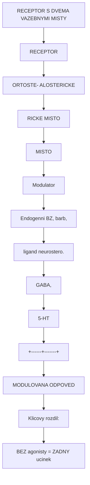
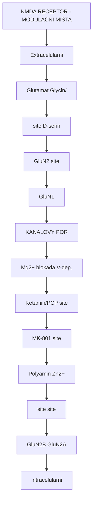
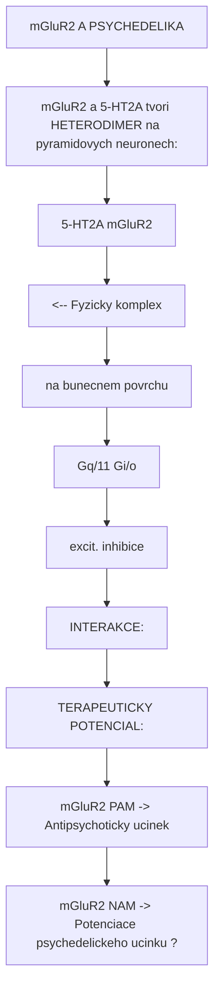

+++
title = "Alostericka modulace"
description = "Pozitivni a negativni alostericke modulatory, alostericke vazebne mista, kooperativni kinetika, modulace GABA-A, NMDA a mGluR"
weight = 3
insert_anchor_links = "right"

[taxonomies]
tags = ["alostericka-modulace", "PAM", "NAM", "benzodiazepiny", "kooperativita", "modulace"]
categories = ["farmakologie", "molekularni-biologie", "mechanismy"]
+++

# Alostericka modulace

**Alostericka modulace** je mechanismus, pri nemz se latka (modulator) vaze na **jine misto** nez endogenni ligand (ortostericke misto) a meni funkci receptoru. Alostericke modulatory nemohou receptor aktivovat samy, ale **zesilují** nebo **oslabují** odpoved na endogenni ligand. Tento mechanismus je klicovy pro pochopeni ucinku **benzodiazepinu**, **barbiturátu**, **neurosteroidů** a nekterych novych terapeutik.

---

## Zakladni pojmy

### Ortostericke vs alostericke vazebne misto



<details>
<summary>ASCII verze diagramu</summary>

```
RECEPTOR S DVEMA VAZEBNYMI MISTY

    ┌──────────────────────────────────┐
    │         RECEPTOR                  │
    │                                   │
    │  ┌──────────┐  ┌──────────────┐  │
    │  │ORTOSTE-  │  │ ALOSTERICKE  │  │
    │  │RICKE     │  │    MISTO     │  │
    │  │MISTO     │  │              │  │
    │  │          │  │  Modulator   │  │
    │  │ Endogenni│  │  (BZ, barb,  │  │
    │  │ ligand   │  │  neurostero.)│  │
    │  │ (GABA,   │  │              │  │
    │  │  5-HT)   │  │              │  │
    │  └──────────┘  └──────────────┘  │
    │         |              |          │
    │         +------+-------+          │
    │                |                  │
    │                v                  │
    │     MODULOVANA ODPOVED            │
    └──────────────────────────────────┘

Klicovy rozdil:
- AGONISTA (ortostericke): Aktivuje receptor SAM
- PAM (alostericke): Zesiluje odpoved na agonismu
                     BEZ agonisty = ZADNY ucinek
```

</details>

### Typy alosterickych modulatoru

| Typ | Zkratka | Efekt | Priklad | Receptor |
|-----|---------|-------|---------|----------|
| **Pozitivni alostericky modulator** | PAM | Zvysuje afinitu a/nebo eficacii | Diazepam | [GABA-A](@/receptors/gaba-a.md) |
| **Negativni alostericky modulator** | NAM | Snizuje afinitu a/nebo eficacii | DMCM | [GABA-A](@/receptors/gaba-a.md) |
| **Tichy alostericky modulator** | SAM | Zabira misto bez efektu | Flumazenil | [GABA-A](@/receptors/gaba-a.md) |
| **Alostericky agonista** | Ago-PAM | Aktivuje receptor + potenciace | THIP (delta) | [GABA-A](@/receptors/gaba-a.md) |
| **Bitopicky ligand** | - | Vaze ortostericke + alostericke | Experimentalni | mGluR |

---

## GABA-A receptor: Model alostericke modulace

[GABA-A receptor](@/receptors/gaba-a.md) je **paradigmaticky** priklad alostericke modulace. Pentamerny komplex obsahuje mnozstvi farmakologicky distinktních vazebnych mist.

### Vazebna mista na GABA-A receptoru

```mermaid
flowchart TD
    node_GABAARECEPTORPOHLEDS["GABA-A RECEPTOR - POHLED SHORA"]
    node_alpha1["alpha1"]
    node_3f34161c["/        \"]
    node_BZsiteGABAsite["BZ site           GABA site"]
    node_alphagammaalphabeta["alpha/gamma     alpha/beta"]
    node_gamma2beta2["gamma2           beta2"]
    node_beta2["beta2"]
    node_4037099c["+-----+-----+"]
    node_alpha1Barbiturtov["alpha1      Barbiturátové"]
    node_siteTM["site TM"]
    node_Neurosteroid["Neurosteroid"]
    node_Etanolov["Etanolové"]
    node_GABAsites2alphabetai["GABA sites: 2 alpha/beta interfaces"]
    node_BZsite1alphagammaint["BZ site: 1 alpha/gamma interface"]
    node_Barbiturt2TMdomnybet["Barbiturát: 2+ TM domény beta"]
    node_Neurosteroid2TMalpha["Neurosteroid: 2+ TM alpha/beta"]
    node_Pikrotoxin1vkanlovmp["Pikrotoxin: 1 v kanálovém póru"]

    node_GABAARECEPTORPOHLEDS --> node_alpha1
    node_alpha1 --> node_3f34161c
    node_3f34161c --> node_BZsiteGABAsite
    node_BZsiteGABAsite --> node_alphagammaalphabeta
    node_alphagammaalphabeta --> node_gamma2beta2
    node_gamma2beta2 --> node_beta2
    node_beta2 --> node_4037099c
    node_4037099c --> node_alpha1Barbiturtov
    node_alpha1Barbiturtov --> node_siteTM
    node_siteTM --> node_Neurosteroid
    node_Neurosteroid --> node_Etanolov
    node_Etanolov --> node_GABAsites2alphabetai
    node_GABAsites2alphabetai --> node_BZsite1alphagammaint
    node_BZsite1alphagammaint --> node_Barbiturt2TMdomnybet
    node_Barbiturt2TMdomnybet --> node_Neurosteroid2TMalpha
    node_Neurosteroid2TMalpha --> node_Pikrotoxin1vkanlovmp

    click node_GABAARECEPTORPOHLEDS "/receptors/gaba-a/" "GABA-A RECEPTOR - POHLED SHORA"
```



<details>
<summary>ASCII verze diagramu</summary>

```
GABA-A RECEPTOR - POHLED SHORA

              alpha1
            /        \
    BZ site           GABA site
    (alpha/gamma)     (alpha/beta)
           |               |
         gamma2           beta2
           |               |
    --------+-------+------+
                    |
                  beta2
                    |
              +-----+-----+
              |           |
         alpha1      Barbiturátové
                     site (TM)
                          |
                     Neurosteroid
                     site (TM)
                          |
                     Etanolové
                     site (TM)

GABA sites: 2 (alpha/beta interfaces)
BZ site: 1 (alpha/gamma interface)
Barbiturát: 2+ (TM domény beta)
Neurosteroid: 2+ (TM alpha/beta)
Pikrotoxin: 1 (v kanálovém póru)
```

</details>

### Benzodiazepiny - PAM

```
MECHANISMUS BENZODIAZEPINOVE MODULACE

BEZ BENZODIAZEPINU:
==================
GABA + Receptor
    |
    v
Otevření kanálu: frekvence = f0
Cl- proud: I = I0
Doba otevreni: t = t0

Odpoved: BAZALNI

S BENZODIAZEPINEM (Diazepam):
==============================
GABA + BZ + Receptor
    |
    v
BZ vaze na alpha/gamma interface
    |
    v
Konformacni zmena -> zvysena afinita GABA site
    |
    v
Otevření kanálu: frekvence = 3-5x f0 (!)
Cl- proud: I = 3-5x I0
Doba otevreni: t = t0 (BEZ ZMENY)

Odpoved: POTENCIOVANA (3-5x)

DULEZITE:
- BZ zvysují FREKVENCI otevirání (NE dobu)
- BZ NEMĚNÍ maximální odpoved na GABA
- BZ BEZ GABA = ZADNY ucinek (bezpecnost!)
- Existuje "ceiling efekt" = limitovana toxicita
```

### Barbituráty vs Benzodiazepiny

| Vlastnost | Benzodiazepiny | Barbituráty |
|-----------|---------------|-------------|
| **Vazebne misto** | alpha/gamma interface | TM domena beta |
| **Mechanismus** | Zvysena frekvence otevirani | Prodlouzena doba otevreni |
| **Ucinek bez GABA** | ZADNY | ANO (pri vysokych davkach) |
| **Maximalni potenciace** | ~200-300% GABA | >1000% + primy ucinek |
| **Ceiling efekt** | ANO | NE |
| **Letalni predavkovani** | Vzacne (bez koingestace) | Mozne (respiracni deprese) |
| **Antidotum** | Flumazenil | Zadne specifické |
| **Terapeuticky index** | Vysoky (~100) | Nizky (~5-10) |

### Subtypova selektivita

Alostericke modulatory mohou byt **subtypove selektivni** na zaklade podjednotkove kompozice:

| Modulator | alpha1 | alpha2 | alpha3 | alpha4 | alpha5 | alpha6 | Klinicky profil |
|-----------|--------|--------|--------|--------|--------|--------|-----------------|
| **Diazepam** | +++ | +++ | +++ | - | +++ | - | Neselektivni, sedace |
| **Zolpidem** | +++ | + | + | - | + | - | alpha1 preferujici, hypnotikum |
| **TPA023** | - | +++ | + | - | + | - | alpha2 selektivni, anxiolytikum |
| **Bretazenil** | ++ | ++ | ++ | - | ++ | - | Parcial. ag., nizka zavislost |
| **alpha5IA** | - | - | - | - | --- | - | alpha5 inv. ag., prokognitivni |
| **Gaboxadol** | ++ | ++ | ++ | +++ | ++ | +++ | delta-preferujici, spanek |

**Legenda**: +++ silna PAM, ++ stredni, + slaba, - zadna, --- NAM/inv. agonista

### Farmakologicky vyznam subtypove selektivity

```
IDEALNI ANXIOLYTIKUM: alpha2/3 selektivni PAM
========================================
alpha1: VYHNOUT SE -> Sedace, amnezie, zavislost
alpha2: CILOVY      -> Anxiolyza (limbicky system)
alpha3: PODPORNY    -> Myorelaxace (mirna)
alpha5: VYHNOUT SE  -> Amnezie (hippocampus)

IDEALNI HYPNOTIKUM: alpha1 selektivni PAM
========================================
alpha1: CILOVY -> Sedace, spankova indukce
alpha2/3: NIZKA -> Minimalni anxiolyza
alpha5: NIZKA -> Minimalni amnezie

Soucasny vyzkum: nove alpha-subtypove selektivni BZ
-> Anxiolytika bez sedace
-> Hypnotika bez zavislosti
-> Prokognitiva (alpha5 NAM)
```

---

## NMDA receptor: Modulacni mista

[NMDA receptor](@/receptors/nmda.md) ma rovnez vice alosterickych modulacnich mist:

### Modulacni mista NMDA receptoru



<details>
<summary>ASCII verze diagramu</summary>

```
NMDA RECEPTOR - MODULACNI MISTA

         Extracelularni
              |
    ┌─────────┴─────────────────────┐
    │  ┌─────────┐    ┌──────────┐  │
    │  │Glutamat │    │ Glycin/  │  │
    │  │ site    │    │ D-serin  │  │
    │  │(GluN2)  │    │  site    │  │
    │  │         │    │ (GluN1)  │  │
    │  └────┬────┘    └────┬─────┘  │
    │       │              │        │
    │  ┌────┴──────────────┴────┐   │
    │  │    KANALOVY POR        │   │
    │  │                        │   │
    │  │  Mg2+ blokada (V-dep.) │   │
    │  │  Ketamin/PCP site      │   │
    │  │  MK-801 site           │   │
    │  │                        │   │
    │  └───────────────────────-┘   │
    │       │              │        │
    │  ┌────┴────┐    ┌────┴────┐   │
    │  │Polyamin │    │  Zn2+   │   │
    │  │ site    │    │  site   │   │
    │  │(GluN2B) │    │(GluN2A) │   │
    │  └─────────┘    └─────────┘   │
    └───────────────────────────────┘
         Intracelularni
```

</details>

### NMDA modulatory

| Misto | Agonista/PAM | Antagonista/NAM | Klinicky vyznam |
|-------|-------------|-----------------|-----------------|
| **Glutamátové** | Glutamat, NMDA | AP5, CPP | Zakladni aktivace |
| **Glycinove** | Glycin, D-serin | 7-Cl-kynurenát | Koagonista, potencial |
| **Kanálové** | - | Ketamin, PCP, MK-801, Memantine | Disociace, antideprese, Alzheimer |
| **Mg2+ site** | - | Mg2+ (voltaz-zavisle) | Fyziologicka regulace |
| **Polyaminove** | Spermin (PAM, GluN2B) | Ifenprodil (NAM, GluN2B) | GluN2B-selektivni modulace |
| **Zn2+ site** | - | Zn2+ (NAM, GluN2A) | GluN2A-selektivni inhibice |
| **Redoxni** | DTT (redukovany) | DTNB (oxidovany) | Oxidativni stres |

### GluN2B-selektivni modulace

GluN2B subjednotka je cilena novymi antidepresivy:

| Modulator | Mechanismus | Ki/IC50 (nM) | Status |
|-----------|-------------|-------------|--------|
| **Ifenprodil** | GluN2B NAM | 10-30 | Vyzkum |
| **Ro 25-6981** | GluN2B NAM | 5-10 | Vyzkum |
| **CP-101,606 (Traxoprodil)** | GluN2B NAM | 10 | Phase II (deprese) |
| **EVT-101** | GluN2B NAM | 12 | Phase I |

---

## Metabotropni glutamatove receptory (mGluR)

### Alostericka modulace mGluR

mGluR rodina (skupina I: mGluR1/5; skupina II: mGluR2/3; skupina III: mGluR4/6/7/8) je predmetem intenzivniho vyzkumu novych anxiolytik a antipsychotik:



<details>
<summary>ASCII verze diagramu</summary>

```
mGluR2 A PSYCHEDELIKA
=====================

mGluR2 a 5-HT2A tvori HETERODIMER na pyramidovych neuronech:

    5-HT2A    mGluR2
      |          |
      v          v
   ┌──────┐  ┌──────┐
   │      │──│      │  <-- Fyzicky komplex
   └──────┘  └──────┘      na bunecnem povrchu
      |          |
      v          v
    Gq/11      Gi/o
    (excit.)   (inhibice)

INTERAKCE:
- 5-HT2A aktivace ZVYSUJE glutamat uvolneni
- mGluR2 aktivace SNIZUJE glutamat uvolneni
- mGluR2 aktivace PROTIVADUJE psychedelickemu ucinku
- mGluR2 KO mysi: Zvysena odpoved na psychedelika

TERAPEUTICKY POTENCIAL:
mGluR2 PAM -> Antipsychoticky ucinek
mGluR2 NAM -> Potenciace psychedelickeho ucinku (?)
```

</details>

### mGluR modulatory ve vyzkumu

| Target | Typ | Latka | Indikace | Status |
|--------|-----|-------|----------|--------|
| mGluR2 | PAM | ADX71149 | Schizofrenie | Phase II |
| mGluR2 | PAM | AZD8529 | Schizofrenie | Phase II |
| mGluR5 | NAM | Basimglurant | Deprese | Phase II |
| mGluR5 | PAM | CDPPB | Schizofrenie | Preklinicka |
| mGluR2/3 | Agonista | Pomaglumetad | Schizofrenie | Phase III (failed) |

---

## Alostericka modulace 5-HT receptoru

### 5-HT2A: Potencialni alostericke modulatory

Ackoliv psychedelika pusobi primarne na ortosterickem miste [5-HT2A receptoru](@/receptors/5-ht2a.md), existuji dukazy pro alostericke modulacni mechanismy:

| Mechanismus | Modulator | Efekt | Reference |
|-------------|-----------|-------|-----------|
| **Oleamid** | Endogenni lipid | PAM na 5-HT2A/2C | Huidobro-Toro et al. |
| **Na+ ionty** | Fyziologicky | Modulace konformace | Kristalove struktury |
| **Cholesterol** | Membranovy | Ovlivnuje fluiditu | MD simulace |
| **5-HT2A-mGluR2 heterodimer** | mGluR2 aktivace | Modulace 5-HT2A signalizace | Gonzalez-Maeso 2008 |

### 5-HT1A: Alostericke modulatory

| Modulator | Typ | Efekt |
|-----------|-----|-------|
| **CPPG** | PAM | Zvysuje 5-HT1A odpoved |
| **Zn2+** | NAM | Snizuje afinitu agonistů |

---

## Sigma-1 receptor: Alostericke chaperon funkce

[Sigma-1 receptor](@/receptors/sigma-1.md) je unikatni intracelularni chaperon ovlivneny [DMT](@/alkaloids/dmt.md):

```mermaid
flowchart TD
    node_SIGMA1RECEPTORCHAPER["SIGMA-1 RECEPTOR - CHAPERON MECHANISMUS"]
    node_Sigma1receptorjeloka["Sigma-1 receptor je lokalizovan na ER-mitochondrialni membrane:"]
    node_ERMEMBRANA["ER MEMBRANA"]
    node_Sigma1receptor["Sigma-1 receptor"]
    node_bezligandu["bez ligandu:"]
    node_BiPvazeinaktivni["BiP vaze inaktivni"]
    node_SDMTagonistou["S DMT/agonistou:"]
    node_BiPseuvolni["BiP se uvolni"]
    node_Sigma1seoligom["Sigma-1 se oligom."]
    node_CHAPERONfunkce["CHAPERON funkce:"]
    node_IP3Rstabilizace["- IP3R stabilizace"]
    node_Ca2signalizace["- Ca2+ signalizace"]
    node_Neuroprotekce["- Neuroprotekce"]
    node_Antiapoptoticke["- Antiapoptoticke"]
    node_MAMERmitojunkce["MAM ER-mito junkce"]

    node_SIGMA1RECEPTORCHAPER --> node_Sigma1receptorjeloka
    node_Sigma1receptorjeloka --> node_ERMEMBRANA
    node_ERMEMBRANA --> node_Sigma1receptor
    node_Sigma1receptor --> node_bezligandu
    node_bezligandu --> node_BiPvazeinaktivni
    node_BiPvazeinaktivni --> node_SDMTagonistou
    node_SDMTagonistou --> node_BiPseuvolni
    node_BiPseuvolni --> node_Sigma1seoligom
    node_Sigma1seoligom --> node_CHAPERONfunkce
    node_CHAPERONfunkce --> node_IP3Rstabilizace
    node_IP3Rstabilizace --> node_Ca2signalizace
    node_Ca2signalizace --> node_Neuroprotekce
    node_Neuroprotekce --> node_Antiapoptoticke
    node_Antiapoptoticke --> node_MAMERmitojunkce

    click node_SIGMA1RECEPTORCHAPER "/receptors/sigma-1/" "SIGMA-1 RECEPTOR - CHAPERON MECHANISMUS"
    click node_Sigma1receptorjeloka "/receptors/sigma-1/" "Sigma-1 receptor je lokalizovan na ER-mitochondrialni membrane:"
    click node_Sigma1receptor "/receptors/sigma-1/" "Sigma-1 receptor"
    click node_SDMTagonistou "/alkaloids/dmt/" "S DMT/agonistou:"
```



<details>
<summary>ASCII verze diagramu</summary>

```
SIGMA-1 RECEPTOR - CHAPERON MECHANISMUS

Sigma-1 receptor je lokalizovan na ER-mitochondrialni membrane:

    ┌─────────────────────────────────┐
    │   ER MEMBRANA                    │
    │                                  │
    │   ┌──────────────────────┐      │
    │   │ Sigma-1 receptor     │      │
    │   │                      │      │
    │   │ bez ligandu:         │      │
    │   │ BiP vaze (inaktivni) │      │
    │   │                      │      │
    │   │ S DMT/agonistou:     │      │
    │   │ BiP se uvolni        │      │
    │   │ Sigma-1 se oligom.   │      │
    │   │ CHAPERON funkce:     │      │
    │   │ - IP3R stabilizace   │      │
    │   │ - Ca2+ signalizace   │      │
    │   │ - Neuroprotekce      │      │
    │   │ - Antiapoptoticke    │      │
    │   └──────────────────────┘      │
    │                                  │
    │   MAM (ER-mito junkce)          │
    └─────────────────────────────────┘
```

</details>

| Sigma-1 ligand | Ki (nM) | Typ | Zdroj |
|---------------|---------|-----|-------|
| **DMT** | 14750 | Agonista | Endogenni/rostliny |
| **Cocaine** | 2000 | Agonista | Coca |
| **Ketamin** | 50-100 | Agonista | Synteticky |
| **Fluvoxamin** | 36 | Agonista | SSRI |
| **Haloperidol** | 3 | Antagonista | Antipsychotikum |
| **NE-100** | 1 | Antagonista | Vyzkum |

---

## Kooperativita a alostericke modely

### Monod-Wyman-Changeux (MWC) model

```
MWC MODEL PRO GABA-A RECEPTOR

Receptor existuje v rovnovaze mezi R (relaxed, aktivni)
a T (tense, inaktivni) stavy:

T (inaktivni) <=====> R (aktivni)
      L0 = [T]/[R] (alostericka konstanta)

GABA (agonista):
    Preferuje R stav -> Posunuje rovnovahu k R
    -> Otevreni kanalu

BZ (PAM):
    Snizuje L0 -> Vice R stavů
    -> Zvysena pravdepodobnost, ze GABA otevre kanal
    -> Zvysena FREKVENCE otevirani

Barbiturát (PAM/agonista):
    Snizuje L0 VYRAZNE
    Pri vysokych davkach: Stabilizuje R bez GABA
    -> Prodlouzena doba otevreni
    -> PRIMY ucinek (nebezpecne)

Inverzni agonista (NAM):
    Zvysuje L0 -> Vice T stavu
    -> Snizena bazalni aktivita
    -> Anxiogenni ucinek
```

### Alostericka doza-odpoved

```mermaid
flowchart TD
    node_EFEKTALOSTERICKEHOMO["EFEKT ALOSTERICKEHO MODULATORU NA DOZA-ODPOVED KRIVKU"]
    node_Odpoved["Odpoved"]
    node_100PAMAgonistasamNAM["100 |          PAM              Agonista sam     NAM"]
    node_1ea903a7["/.           .-----.             ."]
    node_4a23495e["/ .          /       \           ."]
    node_80["80 |        /   .        /         \         ."]
    node_585d763e["/     .      /           \       ."]
    node_60["60 |      /       .    /             \     ."]
    node_21fda6a7["/         .  /               \   ."]
    node_40["40 |    /           ./                 \ ."]
    node_198c25d2["/            /                   ."]
    node_20["20 |  /           ./                   /."]
    node_d77ab9c0["/          . /                  ./"]
    node_0["0 |/        .  /                 ./"]
    node_9822c9d2["+----+----+----+----+----+----+----&gt;"]
    node_PAMPosunujekrivkuDOL["PAM: Posunuje krivku DOLEVA zvysena citlivost"]
    node_MuzezvysitEmaxnekter["Muze zvysit Emax nekterych agonistů"]
    node_NAMPosunujekrivkuDOP["NAM: Posunuje krivku DOPRAVA snizena citlivost"]
    node_MuzesnizitEmax["Muze snizit Emax"]

    node_EFEKTALOSTERICKEHOMO --> node_Odpoved
    node_Odpoved --> node_100PAMAgonistasamNAM
    node_100PAMAgonistasamNAM --> node_1ea903a7
    node_1ea903a7 --> node_4a23495e
    node_4a23495e --> node_80
    node_80 --> node_585d763e
    node_585d763e --> node_60
    node_60 --> node_21fda6a7
    node_21fda6a7 --> node_40
    node_40 --> node_198c25d2
    node_198c25d2 --> node_20
    node_20 --> node_d77ab9c0
    node_d77ab9c0 --> node_0
    node_0 --> node_9822c9d2
    node_9822c9d2 --> node_PAMPosunujekrivkuDOL
    node_PAMPosunujekrivkuDOL --> node_MuzezvysitEmaxnekter
    node_MuzezvysitEmaxnekter --> node_NAMPosunujekrivkuDOP
    node_NAMPosunujekrivkuDOP --> node_MuzesnizitEmax
```



<details>
<summary>ASCII verze diagramu</summary>

```
EFEKT ALOSTERICKEHO MODULATORU NA DOZA-ODPOVED KRIVKU

Odpoved
(%)
100 |          PAM              Agonista sam     NAM
    |          /.           .-----.             .
    |         / .          /       \           .
 80 |        /   .        /         \         .
    |       /     .      /           \       .
 60 |      /       .    /             \     .
    |     /         .  /               \   .
 40 |    /           ./                 \ .
    |   /            /                   .
 20 |  /           ./                   /.
    | /          . /                  ./
  0 |/        .  /                 ./
    +----+----+----+----+----+----+---->
    -9   -8   -7   -6   -5   -4   -3   log[GABA]

PAM: Posunuje krivku DOLEVA (zvysena citlivost)
     Muze zvysit Emax (nekterych agonistů)
NAM: Posunuje krivku DOPRAVA (snizena citlivost)
     Muze snizit Emax
```

</details>

---

## Terapeuticky potencial alostericke modulace

### Vyhody alosterickych modulatoru

| Vyhoda | Mechanismus | Klinicky vyznam |
|--------|-------------|-----------------|
| **Ceiling efekt** | Limitovana modulace | Nizsi riziko predavkovani |
| **Zachovani casoprostorove dynamiky** | Potenciace pouze pri endogennim signalu | Fyziologictejsi odpoved |
| **Subtypova selektivita** | Variabilnejsi alost. mista | Cilenj ucinky |
| **Satura bilisticka kinetika** | Plata saturacni | Bezpecnostni strop |

### Budouci smerovani

| Cilovy receptor | Typ modulatoru | Indikace | Stadium |
|-----------------|---------------|----------|---------|
| GABA-A alpha2/3 | Selektivni PAM | Uzkost bez sedace | Phase II/III |
| GABA-A alpha5 | NAM/inv. agon. | Kognitivni deficit | Phase II |
| mGluR2 | PAM | Schizofrenie | Phase II |
| mGluR5 | NAM | Deprese | Phase II |
| NMDA GluN2B | NAM | Deprese | Phase II |
| 5-HT2A | PAM/NAM | Modulace psychedel. | Preklinicka |

---

## Reference

1. Sieghart, W. (2015). *Allosteric modulation of GABA-A receptors via multiple drug-binding sites*. Advances in Pharmacology, 72, 53-96.
2. Rudolph, U. & Knoflach, F. (2011). *Beyond classical benzodiazepines: novel therapeutic potential of GABA-A receptor subtypes*. Nature Reviews Drug Discovery, 10(9), 685-697.
3. Conn, P.J. et al. (2009). *Allosteric modulators of GPCRs: a novel approach for the treatment of CNS disorders*. Nature Reviews Drug Discovery, 8(1), 41-54.
4. Christopoulos, A. (2002). *Allosteric binding sites on cell-surface receptors*. Nature Reviews Drug Discovery, 1(3), 198-210.
5. Gonzalez-Maeso, J. et al. (2008). *Identification of a serotonin/glutamate receptor complex implicated in psychosis*. Nature, 452(7183), 93-97.
6. Changeux, J.P. (2012). *The nicotinic acetylcholine receptor: a typical allosteric machine*. Philosophical Transactions of the Royal Society B, 367(1607), 3403-3420.

---

Viz take:
- [GABA-A receptor](@/receptors/gaba-a.md) - Hlavni alostericky modulovany receptor
- [NMDA receptor](@/receptors/nmda.md) - Glutamatovy receptor s modulacnimi misty
- [Receptorova kinetika](@/mechanisms/receptor-binding.md) - Vazebne parametry
- [Signalni transdukce](@/mechanisms/signal-transduction.md) - Downstream efekty

<- Zpet na [Mechanismy ucinku](@/mechanisms/_index.md)
