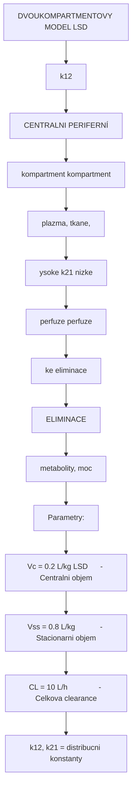

+++
title = "Farmakokinetiko-farmakodynamicke vztahy"
description = "PK-PD modelovani, doza-odpoved, hystereze, kompartmentove modely, populacni PK, farmakogenetika, lekove interakce psychoaktivnich latek"
weight = 4
insert_anchor_links = "right"

[taxonomies]
tags = ["farmakokinetika", "farmakodynamika", "PK-PD", "ADME", "doza-odpoved", "metabolismus", "interakce"]
categories = ["farmakologie", "klinicka-farmakologie", "mechanismy"]
+++

# Farmakokinetiko-farmakodynamicke vztahy

**Farmakokinetika** (PK) studuje, co **telo dela s latkou** (ADME: absorpce, distribuce, metabolismus, eliminace). **Farmakodynamika** (PD) studuje, co **latka dela s telem** (receptor occupancy, signalizace, ucinek). **PK-PD modelovani** spojuje oba pristupy do integrovaneho popisu casoveho prubehu ucinku.

---

## Farmakokinetika (ADME)

### Absorpce

#### Oralni podani (nejcastejsi pro psychedelika)

```
ORALNI ABSORPCE PSYCHEDELIK

Poziti
  |
  v
Zaludek (pH 1-3)
  | Rozpad tablety/kapsle
  | Stabilita v kyselem prostredi
  v
Tenke strevo (pH 6-7)
  | Hlavni misto absorpce
  | Pasivni difuze (log P zavislost)
  | Aktivni transport (?)
  v
Portalni zila
  | First-pass metabolismus
  v
Jatra
  | CYP enzymy
  | Konjugacni enzymy
  | Defosforylace (psilocybin -> psilocin)
  v
Systemova cirkulace
  | Biologicka dostupnost (F)
  v
Hematoencefalicka bariera (HEB)
  | Prostup: log P, MW, PSA
  | Efflux: P-gp, BCRP
  v
CNS (cilovy kompartment)
```

#### Farmakokinetické parametry absorpce

| Latka | Cesta | F (%) | Tmax (h) | Faktory ovlivnujici |
|-------|-------|-------|----------|---------------------|
| [Psilocybin](@/alkaloids/psilocybin.md) | p.o. | 52.7 | 1.0-1.5 | Jidlo zpomaluje Tmax |
| [Psilocin](@/alkaloids/psilocin.md) | p.o. | ~50 | 0.5-1.0 | Oxidace v GIT |
| [LSD](@/alkaloids/lsd.md) | p.o./s.l. | ~71 | 1.5-2.5 | Sublingual: rychlejsi |
| [DMT](@/alkaloids/dmt.md) (inh.) | Inh. | ~100 | 0.03 | Rychla absorpce pres plice |
| [DMT](@/alkaloids/dmt.md) (oral) | p.o. | <5 | - | MAO-A degradace v GIT/jatrech |
| [DMT](@/alkaloids/dmt.md) + MAOI | p.o. | ~50 | 1.0-2.0 | MAOI inhibuje first-pass |
| [Meskalin](@/alkaloids/mescaline.md) | p.o. | ~100 | 2.0-3.0 | Pomala absorpce |
| Ketamin | i.v. | 100 | Okamzite | - |
| Ketamin | i.n. | ~45 | 0.3-0.5 | Spravato (esketamin) |
| Ketamin | p.o. | ~17 | 0.5-1.0 | Vysoky first-pass |
| MDMA | p.o. | ~70 | 1.5-2.0 | CYP2D6 zavisle |

### Distribuce

#### Kompartmentove modely



<details>
<summary>ASCII verze diagramu</summary>

```
DVOUKOMPARTMENTOVY MODEL (LSD)

┌───────────────┐    k12    ┌───────────────┐
│  CENTRALNI    │ ──────→  │  PERIFERNÍ    │
│  kompartment  │          │  kompartment  │
│  (plazma,     │ ←──────  │  (tkane,      │
│   vysoke      │    k21   │   nizke       │
│   perfuze)    │          │   perfuze)    │
└───────┬───────┘          └───────────────┘
        │
        │ ke (eliminace)
        v
    ELIMINACE
    (metabolity, moc)

Parametry:
Vc = 0.2 L/kg (LSD)      - Centralni objem
Vss = 0.8 L/kg            - Stacionarni objem
CL = 10 L/h               - Celkova clearance
k12, k21 = distribucni konstanty
```

</details>

#### Distribucni objemy psychedelik

| Latka | Vd (L/kg) | Vazba na proteiny (%) | Prostup HEB | CNS distribuce |
|-------|-----------|----------------------|-------------|----------------|
| [Psilocin](@/alkaloids/psilocin.md) | ~4.0 | ~70 | Ano (volny) | Vysoky (kortex, hippocampus) |
| [LSD](@/alkaloids/lsd.md) | ~0.8 | ~80 | Ano | Vysoky (kortex, raphe) |
| [DMT](@/alkaloids/dmt.md) | ~0.5 | ~60 | Ano | Vysoky (kratky) |
| [Meskalin](@/alkaloids/mescaline.md) | ~2.0 | ~30 | Ano (pomale) | Stredni |
| Ketamin | ~3.0 | ~47 | Ano (rychle) | Vysoky (redistribuce) |
| MDMA | ~5.0 | ~34 | Ano | Vysoky |

### Metabolismus

#### Metabolicke drahy psychedelik

```mermaid
flowchart TD
    node_METABOLISMUSPSILOCYB["METABOLISMUS PSILOCYBINU/PSILOCINU"]
    node_Psilocybinprodrug["Psilocybin prodrug"]
    node_AlkalickafosfatazaGI["Alkalicka fosfataza - GIT, jatra"]
    node_Faze0Hydrolza["Faze 0: Hydrolza"]
    node_Psilocinaktivni["Psilocin aktivni"]
    node_MAOA4HOIAAneaktivni["+---&gt; MAO-A --&gt; 4-HO-IAA neaktivni"]
    node_FazeIOxidativnideami["Faze I: Oxidativni deaminace"]
    node_UGT1A91A10Psilocin4O["+---&gt; UGT1A9/1A10 --&gt; Psilocin-4-O-glukuronid neaktivni"]
    node_FazeIIKonjugace["Faze II: Konjugace"]
    node_ALDH4HOIAcAneaktivni["+---&gt; ALDH --&gt; 4-HO-IAcA neaktivni"]
    node_FazeIOxidace["Faze I: Oxidace"]
    node_ADH4HOTryptofolneakt["+---&gt; ADH --&gt; 4-HO-Tryptofol neaktivni"]
    node_FazeIRedukce["Faze I: Redukce"]
    node_METABOLISMUSLSD["METABOLISMUS LSD"]
    node_LSDaktivni["LSD aktivni"]
    node_CYP3A42oxoLSDhlavnin["+---&gt; CYP3A4 --&gt; 2-oxo-LSD hlavni, neaktivni"]
    node_CYP3A42oxo3OHLSDOHLS["+---&gt; CYP3A4 --&gt; 2-oxo-3-OH-LSD O-H-LSD, neaktivni"]
    node_CYP2D6NdemethylLSDmi["+---&gt; CYP2D6 --&gt; N-demethyl-LSD minoritni"]
    node_CYP2C9Hydroxymetabol["+---&gt; CYP2C9 --&gt; Hydroxy-metabolity minoritni"]
    node_Nezmenenvmoci1["+---&gt; Nezmenen v moci ~1%"]
    node_METABOLISMUSDMT["METABOLISMUS DMT"]
    node_DMTaktivni["DMT aktivni"]
    node_MAOAIAAindol3octovky["+---&gt; MAO-A --&gt; IAA indol-3-octová kyselina, hlavni"]
    node_VelmirychleT1215min["Velmi rychle! T1/2 &lt; 15 min"]
    node_CYP2D6DMTNoxidminori["+---&gt; CYP2D6 --&gt; DMT-N-oxid minoritni"]
    node_INMTNMTdemetylacemin["+---&gt; INMT? --&gt; NMT demetylace, minoritni"]
    node_SMAOIayahuascaMAOAIN["S MAOI ayahuasca: MAO-A INHIBOVANO"]

    node_METABOLISMUSPSILOCYB --> node_Psilocybinprodrug
    node_Psilocybinprodrug --> node_AlkalickafosfatazaGI
    node_AlkalickafosfatazaGI --> node_Faze0Hydrolza
    node_Faze0Hydrolza --> node_Psilocinaktivni
    node_Psilocinaktivni --> node_MAOA4HOIAAneaktivni
    node_MAOA4HOIAAneaktivni --> node_FazeIOxidativnideami
    node_FazeIOxidativnideami --> node_UGT1A91A10Psilocin4O
    node_UGT1A91A10Psilocin4O --> node_FazeIIKonjugace
    node_FazeIIKonjugace --> node_ALDH4HOIAcAneaktivni
    node_ALDH4HOIAcAneaktivni --> node_FazeIOxidace
    node_FazeIOxidace --> node_ADH4HOTryptofolneakt
    node_ADH4HOTryptofolneakt --> node_FazeIRedukce
    node_FazeIRedukce --> node_METABOLISMUSLSD
    node_METABOLISMUSLSD --> node_LSDaktivni
    node_LSDaktivni --> node_CYP3A42oxoLSDhlavnin
    node_CYP3A42oxoLSDhlavnin --> node_CYP3A42oxo3OHLSDOHLS
    node_CYP3A42oxo3OHLSDOHLS --> node_CYP2D6NdemethylLSDmi
    node_CYP2D6NdemethylLSDmi --> node_CYP2C9Hydroxymetabol
    node_CYP2C9Hydroxymetabol --> node_Nezmenenvmoci1
    node_Nezmenenvmoci1 --> node_METABOLISMUSDMT
    node_METABOLISMUSDMT --> node_DMTaktivni
    node_DMTaktivni --> node_MAOAIAAindol3octovky
    node_MAOAIAAindol3octovky --> node_VelmirychleT1215min
    node_VelmirychleT1215min --> node_CYP2D6DMTNoxidminori
    node_CYP2D6DMTNoxidminori --> node_INMTNMTdemetylacemin
    node_INMTNMTdemetylacemin --> node_SMAOIayahuascaMAOAIN

    click node_METABOLISMUSPSILOCYB "/alkaloids/psilocybin/" "METABOLISMUS PSILOCYBINU/PSILOCINU"
    click node_Psilocybinprodrug "/alkaloids/psilocybin/" "Psilocybin prodrug"
    click node_Psilocinaktivni "/alkaloids/psilocin/" "Psilocin aktivni"
    click node_UGT1A91A10Psilocin4O "/alkaloids/psilocin/" "+---> UGT1A9/1A10 --> Psilocin-4-O-glukuronid neaktivni"
    click node_METABOLISMUSLSD "/alkaloids/lsd/" "METABOLISMUS LSD"
    click node_LSDaktivni "/alkaloids/lsd/" "LSD aktivni"
    click node_CYP3A42oxoLSDhlavnin "/alkaloids/lsd/" "+---> CYP3A4 --> 2-oxo-LSD hlavni, neaktivni"
    click node_CYP3A42oxo3OHLSDOHLS "/alkaloids/lsd/" "+---> CYP3A4 --> 2-oxo-3-OH-LSD O-H-LSD, neaktivni"
    click node_CYP2D6NdemethylLSDmi "/alkaloids/lsd/" "+---> CYP2D6 --> N-demethyl-LSD minoritni"
    click node_METABOLISMUSDMT "/alkaloids/dmt/" "METABOLISMUS DMT"
    click node_DMTaktivni "/alkaloids/dmt/" "DMT aktivni"
    click node_CYP2D6DMTNoxidminori "/alkaloids/dmt/" "+---> CYP2D6 --> DMT-N-oxid minoritni"
    click node_SMAOIayahuascaMAOAIN "/pharmacology/maoi/" "S MAOI ayahuasca: MAO-A INHIBOVANO"
```



<details>
<summary>ASCII verze diagramu</summary>

```
METABOLISMUS PSILOCYBINU/PSILOCINU

Psilocybin (prodrug)
    |
    | [Alkalicka fosfataza - GIT, jatra]
    | (Faze 0: Hydrolza)
    v
Psilocin (aktivni)
    |
    +---> [MAO-A] --> 4-HO-IAA (neaktivni)
    |     (Faze I: Oxidativni deaminace)
    |
    +---> [UGT1A9/1A10] --> Psilocin-4-O-glukuronid (neaktivni)
    |     (Faze II: Konjugace)
    |
    +---> [ALDH] --> 4-HO-IAcA (neaktivni)
    |     (Faze I: Oxidace)
    |
    +---> [ADH] --> 4-HO-Tryptofol (neaktivni)
          (Faze I: Redukce)


METABOLISMUS LSD

LSD (aktivni)
    |
    +---> [CYP3A4] --> 2-oxo-LSD (hlavni, neaktivni)
    |
    +---> [CYP3A4] --> 2-oxo-3-OH-LSD (O-H-LSD, neaktivni)
    |
    +---> [CYP2D6] --> N-demethyl-LSD (minoritni)
    |
    +---> [CYP2C9] --> Hydroxy-metabolity (minoritni)
    |
    +---> Nezmenen v moci (~1%)


METABOLISMUS DMT

DMT (aktivni)
    |
    +---> [MAO-A] --> IAA (indol-3-octová kyselina, hlavni)
    |     (Velmi rychle! T1/2 < 15 min)
    |
    +---> [CYP2D6] --> DMT-N-oxid (minoritni)
    |
    +---> [INMT?] --> NMT (demetylace, minoritni)

S MAOI (ayahuasca): MAO-A INHIBOVANO
    -> Snizena IAA produkce
    -> Zvysena plazmatická hladina DMT
    -> Prodlouzeny T1/2 na 1-2 hodiny
    -> ORALNI AKTIVITA
```

</details>

#### Enzymy metabolismu: srovnání

| Latka | Hlavni enzym | Minoritni | Aktivni metabolity | T1/2 (h) |
|-------|-------------|-----------|-------------------|----------|
| Psilocybin | ALP (fosfataza) | - | **Psilocin** | 0.3-0.5 |
| Psilocin | UGT1A9, MAO-A | ALDH, ADH | Zadne | 2.5-3.5 |
| LSD | CYP3A4 | CYP2D6, 2C9 | Zadne | 3.0-5.0 |
| DMT | MAO-A | CYP2D6 | Zadne | 0.15-0.25 |
| DMT (+ MAOI) | Inhibovano | CYP2D6 | Zadne | 1.0-2.0 |
| Meskalin | DAO, CYP | - | Zadne | 6.0-8.0 |
| Ketamin | CYP3A4, CYP2B6 | CYP2C9 | **Norketamin** (30%) | 2.5-3.0 |
| MDMA | CYP2D6 | CYP3A4 | **MDA** (aktivni) | 6.0-9.0 |

### Eliminace

```mermaid
flowchart TD
    node_ELIMINACNIPROFILY["ELIMINACNI PROFILY"]
    node_Plazmakonc["Plazma konc."]
    node_logscale["log scale"]
    node_DMTT1215min["\\    DMT T1/2 = 15 min"]
    node_208d9728["\ \"]
    node_PsilocinT123h["\  \     Psilocin T1/2 = 3h"]
    node_46ea3048["\   \\"]
    node_d5ca3e02["\    \\"]
    node_LSDT124h["\     \\    LSD T1/2 = 4h"]
    node_e6bb6f2c["\      \\"]
    node_MeskalinT126h["\       \\     Meskalin T1/2 = 6h"]
    node_4c4c76fc["\        \\"]
    node_MDMAT128h["\         \\      MDMA T1/2 = 8h"]
    node_55e5b87d["\          \\"]
    node_49720d39["\           \\"]
    node_1f4286a3["+----+----+----+----+----+----+----+----&gt;"]
    node_024681012h["0    2    4    6    8   10   12  h"]

    node_ELIMINACNIPROFILY --> node_Plazmakonc
    node_Plazmakonc --> node_logscale
    node_logscale --> node_DMTT1215min
    node_DMTT1215min --> node_208d9728
    node_208d9728 --> node_PsilocinT123h
    node_PsilocinT123h --> node_46ea3048
    node_46ea3048 --> node_d5ca3e02
    node_d5ca3e02 --> node_LSDT124h
    node_LSDT124h --> node_e6bb6f2c
    node_e6bb6f2c --> node_MeskalinT126h
    node_MeskalinT126h --> node_4c4c76fc
    node_4c4c76fc --> node_MDMAT128h
    node_MDMAT128h --> node_55e5b87d
    node_55e5b87d --> node_49720d39
    node_49720d39 --> node_1f4286a3
    node_1f4286a3 --> node_024681012h

    click node_DMTT1215min "/alkaloids/dmt/" "\\    DMT T1/2 = 15 min"
    click node_PsilocinT123h "/alkaloids/psilocin/" "\  \     Psilocin T1/2 = 3h"
    click node_LSDT124h "/alkaloids/lsd/" "\     \\    LSD T1/2 = 4h"
    click node_MeskalinT126h "/alkaloids/mescaline/" "\       \\     Meskalin T1/2 = 6h"
```



<details>
<summary>ASCII verze diagramu</summary>

```
ELIMINACNI PROFILY

Plazma konc.
(log scale)
    ^
    |\
    | \\    DMT (T1/2 = 15 min)
    |  \ \
    |   \  \     Psilocin (T1/2 = 3h)
    |    \   \\
    |     \    \\
    |      \     \\    LSD (T1/2 = 4h)
    |       \      \\
    |        \       \\     Meskalin (T1/2 = 6h)
    |         \        \\
    |          \         \\      MDMA (T1/2 = 8h)
    |           \          \\
    |            \           \\
    +----+----+----+----+----+----+----+---->
    0    2    4    6    8   10   12  (h)
```

</details>

---

## Farmakodynamicke modely

### Doza-odpoved (Emax model)

```
E = Emax * C^gamma / (EC50^gamma + C^gamma)

kde:
E = ucinek
Emax = maximalni ucinek
C = koncentrace na receptoru
EC50 = koncentrace pro 50% Emax
gamma = Hilluv koeficient (strmost)
```

### Doza-odpoved parametry psychedelik

| Latka | ED50 (subjektivni) | Emax (VAS 0-100) | gamma | Prah | Saturace |
|-------|---------------------|-------------------|-------|------|----------|
| LSD | 0.075 mg (75 ug) | 85-95 | 1.8-2.5 | 25 ug | 200+ ug |
| Psilocybin | 15-20 mg | 80-90 | 1.5-2.0 | 5 mg | 40+ mg |
| DMT (inh.) | 20-25 mg | 85-95 | 2.0-3.0 | 10 mg | 60+ mg |
| Meskalin | 250-300 mg | 70-80 | 1.2-1.5 | 100 mg | 500+ mg |
| Ketamin (i.v.) | 0.3 mg/kg | 75-85 | 1.5-2.0 | 0.1 mg/kg | 1+ mg/kg |

### Krivky doza-odpoved

```
SROVNANI DOZA-ODPOVED KRIVEK

Subjektivni intenzita (%)
100 |                  .../LSD
    |               ../    ./Psilocybin
 80 |            ../      ./
    |          ./         /   ./DMT
 60 |        ./         ./  ./
    |      ./         ./  ./      ./Meskalin
 40 |    ./         ./  ./      ./
    |  ./         ./  ./      ./
 20 |./         ./  ./      ./
    |         ./  ./      ./
  0 |_______./_./_______./________
    0.01   0.1   1    10   100  1000 mg
                               (log scale)

Strmejsi krivka (vyssi gamma) = uzsi terapeuticke okno
LSD a DMT: strmejsi (rychlejsi prechod prah -> silny ucinek)
Meskalin: plochejsi (sirsí dávkovací okno)
```

---

## PK-PD modelovani

### Casova hystereze

U psychedelik existuje **casova hystereze** mezi plazmatickou koncentraci a subjektivnim ucinkem:

```
HYSTEREZNI SMYCKA (psilocybin/psilocin)

Ucinek (VAS)
  100 |
      |         B (peak ucinek)
   80 |        *
      |       * *
   60 |      *   *   C (odezn.)
      |     *     *
   40 |    *       *
      |   * A       *
   20 |  * (nastup)  *  D
      | *              *
    0 |*________________*___
      0    20    40    60    80   100
          Plazma psilocin (ng/mL)

A -> B: Nastup (counter-clockwise hystereze)
        Ucinek zaostava za koncentraci
        Duvod: Penetrace HEB, receptor binding

B -> C: Peak a ustupne
        Koncentrace klesa, ucinek zustava

C -> D: Odeznivani
        Oba klesaji

Hystereze = ZPOZDEN mezi PK a PD
Priciny:
1. Distribuce do CNS (effect-site delay)
2. Receptor trapping (LSD specificke)
3. Downstream signalizace (hodiny)
4. Neuroplasticita (dny)
```

### Effect-compartment model

```mermaid
flowchart TD
    node_EFFECTCOMPARTMENTMOD["EFFECT-COMPARTMENT MODEL ke0"]
    node_Plazmake0Effectsitem["Plazma       ke0      Effect site mozek"]
    node_CpCe["Cp   Ce"]
    node_UcinekfCe["Ucinek = fCe"]
    node_ke0rychlostnikonstan["ke0 = rychlostni konstanta prenosu do efektoveho kompartmentu"]
    node_t12ke0ln2ke0casequil["t1/2,ke0 = ln2/ke0 = cas equilibrace"]
    node_Latkat12ke0minInterp["Latka         t1/2,ke0 min    Interpretace"]
    node_LSD1530Stredniequili["LSD           15-30             Stredni equilibrace"]
    node_Psilocin1020Rychlaeq["Psilocin      10-20             Rychla equilibrace"]
    node_DMTinh13Velmirychla["DMT inh.    1-3               Velmi rychla"]
    node_Ketaminiv25Rychlavys["Ketamin i.v. 2-5              Rychla vysoka lipofilita"]
    node_Meskalin3060Pomalani["Meskalin      30-60             Pomala nizka lipofilita"]

    node_EFFECTCOMPARTMENTMOD --> node_Plazmake0Effectsitem
    node_Plazmake0Effectsitem --> node_CpCe
    node_CpCe --> node_UcinekfCe
    node_UcinekfCe --> node_ke0rychlostnikonstan
    node_ke0rychlostnikonstan --> node_t12ke0ln2ke0casequil
    node_t12ke0ln2ke0casequil --> node_Latkat12ke0minInterp
    node_Latkat12ke0minInterp --> node_LSD1530Stredniequili
    node_LSD1530Stredniequili --> node_Psilocin1020Rychlaeq
    node_Psilocin1020Rychlaeq --> node_DMTinh13Velmirychla
    node_DMTinh13Velmirychla --> node_Ketaminiv25Rychlavys
    node_Ketaminiv25Rychlavys --> node_Meskalin3060Pomalani

    click node_LSD1530Stredniequili "/alkaloids/lsd/" "LSD           15-30             Stredni equilibrace"
    click node_Psilocin1020Rychlaeq "/alkaloids/psilocin/" "Psilocin      10-20             Rychla equilibrace"
    click node_DMTinh13Velmirychla "/alkaloids/dmt/" "DMT inh.    1-3               Velmi rychla"
    click node_Meskalin3060Pomalani "/alkaloids/mescaline/" "Meskalin      30-60             Pomala nizka lipofilita"
```



<details>
<summary>ASCII verze diagramu</summary>

```
EFFECT-COMPARTMENT MODEL (ke0)

Plazma       ke0      Effect site (mozek)
[Cp] ───────────→  [Ce]
                      │
                      v
                 Ucinek = f(Ce)

ke0 = rychlostni konstanta prenosu do efektoveho kompartmentu
t1/2,ke0 = ln(2)/ke0 = cas equilibrace

Latka         t1/2,ke0 (min)    Interpretace
-------------------------------------------------
LSD           15-30             Stredni equilibrace
Psilocin      10-20             Rychla equilibrace
DMT (inh.)    1-3               Velmi rychla
Ketamin (i.v.) 2-5              Rychla (vysoka lipofilita)
Meskalin      30-60             Pomala (nizka lipofilita)
```

</details>

---

## Farmakogenetika

### Geneticke varianty ovlivnujici PK/PD psychedelik

| Gen | Polymorfismus | Latka | Efekt | Klinicky vyznam |
|-----|---------------|-------|-------|-----------------|
| **CYP2D6** | PM/IM/EM/UM | MDMA, DXM | Zmeneny metabolismus | MDMA: PM = vyssi riziko toxicity |
| **CYP3A4** | *22 (snizena) | LSD | Prodlouzeny T1/2 | Potencialne silnejsi ucinek |
| **UGT1A9** | *3, *5 | Psilocin | Snizena glukuronidace | Prodlouzeny ucinek |
| **MAO-A** | VNTR | DMT, serotonin | Zmenena aktivita MAO | Variabilni odpoved na ayahuascu |
| **HTR2A** | T102C (rs6313) | Vsechna psychedelika | Zmenena exprese 5-HT2A | Variabilni subjektivni odpoved |
| **HTR2A** | His452Tyr (rs6314) | Vsechna psychedelika | Snizena signalizace | Snizena odpoved na psilocybin |
| **COMT** | Val158Met | MDMA | Zmeneny DA metabolismus | Met/Met: silnejsi odpoved |
| **ABCB1** | C3435T | Mnozstvi latek | P-gp aktivita | Zmeneny CNS prostup |

### CYP2D6 fenotypy a MDMA

```
CYP2D6 FENOTYPY A MDMA EXPOZICE

MDMA davka 100 mg p.o.:

                PM        IM        EM        UM
                (3-5%)    (10-15%)  (70-80%)  (5-10%)
AUC MDMA:       ██████    ████      ██        █
Peak MDMA:      ████      ███       ██        █
AUC MDA:        █         ██        ███       ████
Riziko toxicity: VYSOKE   STREDNI   NIZKE     NIZKE

PM = Poor Metabolizer (zádná CYP2D6 aktivita)
-> 3-5x vyssi expozice MDMA
-> Vyssi riziko serotonin toxicity
-> Potreba nizsi davky

MDMA INHIBUJE CYP2D6 (mechanism-based inhibice)
-> Pri opakovanem davkovani se VSICHNI chovaji jako PM!
-> Proto je redosing MDMA nebezpecny
```

---

## Lekove interakce - PK aspekty

### Interakce ovlivnujici metabolismus

| Komedikace | Ovlivnena latka | Mechanismus | Klinicky efekt |
|------------|----------------|-------------|----------------|
| **SSRI** (fluoxetin) | Psilocybin, LSD | CYP2D6 inhibice + 5-HT2A downregulace | Snizeny ucinek psychedelik |
| **MAOI** (harmin) | DMT | MAO-A inhibice | Oralni aktivita DMT (ayahuasca) |
| **MAOI** + SSRI | - | Dvojita serotoninova potenciace | **SEROTONIN SYNDROM** (smrtelne!) |
| **Grapefruitovy dzus** | LSD | CYP3A4 inhibice | Potencialne zvysena expozice |
| **Rifampicin** | LSD | CYP3A4 indukce | Snizena expozice |
| **CYP2D6 inhibitory** | MDMA | Metabolicka inhibice | Zvysena MDMA toxicita |

### Interakce na urovni receptoru (PD)

| Komedikace | Psychedelikum | Mechanismus PD | Efekt |
|------------|--------------|----------------|-------|
| **Antipsychotika** (risperidon) | Vsechna | 5-HT2A antagonismus | **Blokada ucinku** |
| **Benzodiazepiny** | Vsechna | GABA-A PAM | Tlumeni uzkosti, snizeni intenzity |
| **Lithium** | LSD, psilocybin | Neznamy (? neurotoxicky) | **ZAUCHVATY** (kontraindikace!) |
| **SSRI** (chronicky) | Psilocybin, LSD | 5-HT2A downregulace | Snizena odpoved (50-70%) |
| **Tramadol** | + MAOI | SERT inhibice + MAO inhibice | **SEROTONIN SYNDROM** |

### Casove ramce wash-out pred psychedelickou terapii

```mermaid
flowchart TD
    node_WASHOUTPERIODY["WASH-OUT PERIODY"]
    node_LatkaPotrebnapauzaDu["Latka               Potrebna pauza    Duvod"]
    node_FluoxetinProzac56tyd["Fluoxetin Prozac   5-6 tydnů        Dlouhy T1/2 1-6 dní"]
    node_aktivnmetabolit["+ aktivní metabolit"]
    node_Paroxetin23tydnyCYP2["Paroxetin            2-3 tydny        CYP2D6 inhibice"]
    node_Sertralin23tydnyStan["Sertralin            2-3 tydny        Standardni T1/2"]
    node_Citalopram23tydnySta["Citalopram           2-3 tydny        Standardni T1/2"]
    node_Venlafaxin23tydnySNR["Venlafaxin           2-3 tydny        SNRI ucinek"]
    node_Duloxetin23tydnySNRI["Duloxetin            2-3 tydny        SNRI ucinek"]
    node_Tramadol12tydnySERTi["Tramadol             1-2 tydny        SERT inhibice"]
    node_Lithium12tydnyKONTRA["Lithium              1-2 tydny        KONTRAINDIKACE zauchvaty"]
    node_5HTP1tyden5HTprekurz["5-HTP                1 tyden          5-HT prekurzor"]
    node_StJohnswort2tydnyMAO["St. John's wort      2 tydny         MAOI + CYP indukce"]
    node_CannabisIdealne2tydn["Cannabis             Idealne 2 tydny  Nepredvidatelna interakce"]

    node_WASHOUTPERIODY --> node_LatkaPotrebnapauzaDu
    node_LatkaPotrebnapauzaDu --> node_FluoxetinProzac56tyd
    node_FluoxetinProzac56tyd --> node_aktivnmetabolit
    node_aktivnmetabolit --> node_Paroxetin23tydnyCYP2
    node_Paroxetin23tydnyCYP2 --> node_Sertralin23tydnyStan
    node_Sertralin23tydnyStan --> node_Citalopram23tydnySta
    node_Citalopram23tydnySta --> node_Venlafaxin23tydnySNR
    node_Venlafaxin23tydnySNR --> node_Duloxetin23tydnySNRI
    node_Duloxetin23tydnySNRI --> node_Tramadol12tydnySERTi
    node_Tramadol12tydnySERTi --> node_Lithium12tydnyKONTRA
    node_Lithium12tydnyKONTRA --> node_5HTP1tyden5HTprekurz
    node_5HTP1tyden5HTprekurz --> node_StJohnswort2tydnyMAO
    node_StJohnswort2tydnyMAO --> node_CannabisIdealne2tydn

    click node_StJohnswort2tydnyMAO "/pharmacology/maoi/" "St. John's wort      2 tydny         MAOI + CYP indukce"
```



<details>
<summary>ASCII verze diagramu</summary>

```
WASH-OUT PERIODY

Latka               Potrebna pauza    Duvod
-----------------------------------------------------------------
Fluoxetin (Prozac)   5-6 tydnů        Dlouhy T1/2 (1-6 dní)
                                       + aktivní metabolit
Paroxetin            2-3 tydny        CYP2D6 inhibice
Sertralin            2-3 tydny        Standardni T1/2
Citalopram           2-3 tydny        Standardni T1/2
Venlafaxin           2-3 tydny        SNRI ucinek
Duloxetin            2-3 tydny        SNRI ucinek
Tramadol             1-2 tydny        SERT inhibice
Lithium              1-2 tydny        KONTRAINDIKACE (zauchvaty)
5-HTP                1 tyden          5-HT prekurzor
St. John's wort      2 tydny         MAOI + CYP indukce
Cannabis             Idealne 2 tydny  Nepredvidatelna interakce
```

</details>

---

## Populacni farmakokinetika

### Meziindividualni variabilita

| Parametr | CV (%) | Hlavni zdroje variability |
|----------|--------|--------------------------|
| Biologicka dostupnost | 20-40 | GIT motilita, pH, enzymy |
| Distribucni objem | 15-30 | Telesna hmotnost, slozeni |
| Clearance | 25-50 | CYP aktivita, genetika |
| Tmax | 30-50 | Absorpce, jidlo |
| Subjektivni ucinek | 40-60 | Genetika, set & setting |

### Faktory ovlivnujici odpoved

```mermaid
flowchart TD
    node_VARIABILITAVODPOVEDI["VARIABILITA V ODPOVEDI NA PSYCHEDELIKA"]
    node_FARMAKOKINETCIKEFAKT["FARMAKOKINETCIKE FAKTORY 40%:"]
    node_53e1b860["+----------------------------------+"]
    node_GenetikaCYPUGTMAOABC["Genetika CYP, UGT, MAO, ABCB1"]
    node_Veksnizenahepatalnif["Vek snizena hepatalni funkce"]
    node_Jidlozpomaleniabsorp["Jidlo zpomaleni absorpce"]
    node_PohlavCYProzdly["Pohlaví CYP rozdíly"]
    node_Telesnahmotnost["Telesna hmotnost"]
    node_Komedikaceinhibicein["Komedikace inhibice/indukce"]
    node_FARMAKODYNAMICKEFAKT["FARMAKODYNAMICKE FAKTORY 60%:"]
    node_HTR2AgenotypT102CHis["HTR2A genotyp T102C, His452Tyr"]
    node_5HT2Areceptordenzita["5-HT2A receptor denzita vek"]
    node_Predchoziexpozicetol["Predchozi expozice tolerance"]
    node_Setpsychologickysta["Set psychologicky sta"]
    node_Settingprostredi["Setting prostredi"]
    node_OsobnostnirysyOpenne["Osobnostni rysy Openness"]
    node_Psychiatrickaanamnez["Psychiatricka anamneza"]

    node_VARIABILITAVODPOVEDI --> node_FARMAKOKINETCIKEFAKT
    node_FARMAKOKINETCIKEFAKT --> node_53e1b860
    node_53e1b860 --> node_GenetikaCYPUGTMAOABC
    node_GenetikaCYPUGTMAOABC --> node_Veksnizenahepatalnif
    node_Veksnizenahepatalnif --> node_Jidlozpomaleniabsorp
    node_Jidlozpomaleniabsorp --> node_PohlavCYProzdly
    node_PohlavCYProzdly --> node_Telesnahmotnost
    node_Telesnahmotnost --> node_Komedikaceinhibicein
    node_Komedikaceinhibicein --> node_FARMAKODYNAMICKEFAKT
    node_FARMAKODYNAMICKEFAKT --> node_HTR2AgenotypT102CHis
    node_HTR2AgenotypT102CHis --> node_5HT2Areceptordenzita
    node_5HT2Areceptordenzita --> node_Predchoziexpozicetol
    node_Predchoziexpozicetol --> node_Setpsychologickysta
    node_Setpsychologickysta --> node_Settingprostredi
    node_Settingprostredi --> node_OsobnostnirysyOpenne
    node_OsobnostnirysyOpenne --> node_Psychiatrickaanamnez
```



<details>
<summary>ASCII verze diagramu</summary>

```
VARIABILITA V ODPOVEDI NA PSYCHEDELIKA

FARMAKOKINETCIKE FAKTORY (40%):
+----------------------------------+
| Genetika (CYP, UGT, MAO, ABCB1) |
| Vek (snizena hepatalni funkce)   |
| Jidlo (zpomaleni absorpce)       |
| Pohlaví (CYP rozdíly)            |
| Telesna hmotnost                  |
| Komedikace (inhibice/indukce)    |
+----------------------------------+

FARMAKODYNAMICKE FAKTORY (60%):
+----------------------------------+
| HTR2A genotyp (T102C, His452Tyr) |
| 5-HT2A receptor denzita (vek)    |
| Predchozi expozice (tolerance)   |
| Set (psychologicky stav)         |
| Setting (prostredi)               |
| Osobnostni rysy (Openness)       |
| Psychiatricka anamneza            |
+----------------------------------+
```

</details>

---

## Terapeuticke implikace PK-PD

### Optimalizace dávkovani

| Indikace | Latka | Optimalni davka | PK-PD zaklad |
|----------|-------|-----------------|--------------|
| Rezistent. deprese | Psilocybin | 25 mg | ~70% 5-HT2A occupancy |
| MDD | Psilocybin | 25 mg | Phase III data |
| Rez. deprese | Ketamin | 0.5 mg/kg i.v. | AMPA burst threshold |
| Rez. deprese | Esketamin | 56-84 mg i.n. | Approx. 0.5 mg/kg equiv. |
| Alkoholismus | Psilocybin | 25 mg | Mysticky zazitek koreluje |
| PTSD | MDMA | 80-120 mg | Optimalni empathogenni |
| Uzkost (terminalni) | Psilocybin | 0.3 mg/kg | Individualizovane |

### Biomarkery PK-PD

| Biomarker | Typ | Metoda | Korelace s ucinkem |
|-----------|-----|--------|--------------------|
| Plazma psilocin | PK | LC-MS/MS | Stredni (hystereze) |
| 5-HT2A occupancy | PK-PD link | [11C]Cimbi-36 PET | Vysoka |
| Pupilometrie | PD surrogate | Infrared pupilometry | Vysoka (r>0.8) |
| VAS subjektivni | PD | Self-report | Primarni endpoint |
| DMN konektivita | PD mechanisticke | rs-fMRI | Vysoka |
| Plasma BDNF | PD downstream | ELISA | Stredni |
| 5D-ASC skore | PD fenomenologicke | Dotaznik | Vysoka |

---

## Reference

1. Holze, F. et al. (2021). *Acute dose-dependent effects of lysergic acid diethylamide in a double-blind placebo-controlled study*. Neuropsychopharmacology, 46(3), 537-544.
2. Brown, R.T. et al. (2017). *Pharmacokinetics of escalating doses of oral psilocybin in healthy adults*. Clinical Pharmacokinetics, 56(12), 1543-1554.
3. Madsen, M.K. et al. (2019). *Psychedelic effects of psilocybin correlate with serotonin 2A receptor occupancy and plasma psilocin levels*. Neuropsychopharmacology, 44(7), 1328-1334.
4. Liechti, M.E. (2017). *Modern clinical research on LSD*. Neuropsychopharmacology, 42(11), 2114-2127.
5. Riba, J. et al. (2003). *Human pharmacology of ayahuasca*. Journal of Pharmacology and Experimental Therapeutics, 306(1), 73-83.
6. Dolder, P.C. et al. (2016). *Pharmacokinetics and pharmacodynamics of lysergic acid diethylamide in healthy subjects*. Clinical Pharmacokinetics, 56(10), 1219-1230.
7. de la Torre, R. et al. (2000). *Non-linear pharmacokinetics of MDMA ('ecstasy') in humans*. British Journal of Clinical Pharmacology, 49(2), 104-109.
8. Passie, T. et al. (2008). *The pharmacology of lysergic acid diethylamide: a review*. CNS Neuroscience & Therapeutics, 14(4), 295-314.

---

Viz take:
- [Receptorova kinetika](@/mechanisms/receptor-binding.md) - Vazebne parametry
- [Signalni transdukce](@/mechanisms/signal-transduction.md) - Downstream efekty
- [Alostericka modulace](@/mechanisms/allosteric-modulation.md) - PAM/NAM
- [MAOI](@/pharmacology/maoi.md) - Inhibitory monoaminooxidazy
- [Serotonin syndrom](@/conditions/serotonin-syndrome.md) - Nebezpecna interakce
- [Farmakokinetika (glosar)](@/glossary/farmakokinetika.md) - Zakladni definice

<- Zpet na [Mechanismy ucinku](@/mechanisms/_index.md)
