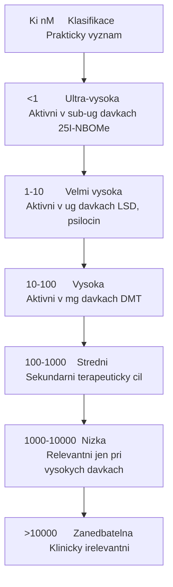
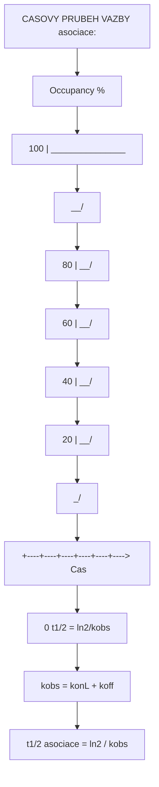
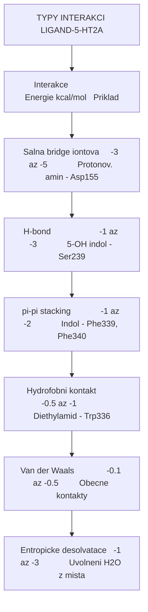
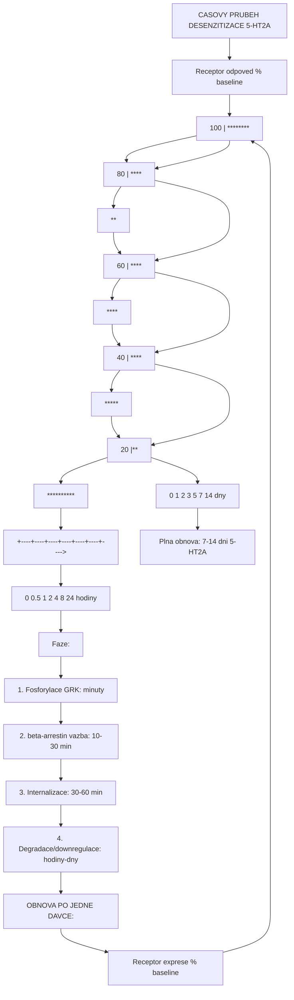

+++
title = "Receptorova kinetika a termodynamika"
description = "Receptorova vazba psychoaktivnich latek - kinetika, termodynamika, Ki/Kd/EC50, SAR, receptor occupancy, rezidencni cas"
weight = 1
insert_anchor_links = "right"

[taxonomies]
tags = ["kinetika", "termodynamika", "Ki", "Kd", "EC50", "receptor-occupancy", "rezidencni-cas"]
categories = ["farmakologie", "molekularni-biologie", "mechanismy"]
+++

# Receptorova kinetika a termodynamika

Interakce **ligandu** (latky) s **receptorem** je zakladnim molekularnim udalosti, ktera determinuje veskere farmakologicke ucinky. Tato stranka pokryva **kinetiku vazby** (jak rychle se ligand vaze a uvolnuje), **termodynamiku** (energeticke aspekty vazby) a **kvantitativni parametry** nezbytne pro pochopeni potence, selektivity a trvani ucinku psychoaktivnich latek.

---

## Zakladni rovnovazne parametry

### Disociacni konstanta (Kd)

Kd popisuje **rovnovaznou afinitu** ligandu k receptoru:

```
kon
L + R  <=======>  LR
koff

Kd = koff / kon = [L][R] / [LR]

kde:
L = volny ligand (koncentrace)
R = volny receptor (koncentrace)
LR = komplex ligand-receptor
kon = asociacni rychlostni konstanta (M-1.s-1)
koff = disociacni rychlostni konstanta (s-1)
```

| Parametr | Definice | Typicke hodnoty | Interpretace |
|----------|----------|-----------------|--------------|
| **Kd** | Disociacni konstanta | 0.1 nM - 10 uM | Nizsi = vyssi afinita |
| **kon** | Asociacni rychlost | 10^5 - 10^8 M-1.s-1 | Limitovano difuzi |
| **koff** | Disociacni rychlost | 10^-4 - 10^1 s-1 | Determinuje rezidencni cas |

### Inhibicni konstanta (Ki)

Ki se meri v **kompetitivnich vazebnych esejich** s referencnim radioligandem:

```
Ki = IC50 / (1 + [L*]/Kd*)

Cheng-Prusoff rovnice:
kde:
IC50 = koncentrace vytesnujici 50% radioligandu
[L*] = koncentrace radioligandu
Kd* = Kd radioligandu
```

### Ki hodnoty psychoaktivnich latek na 5-HT2A receptoru

| Latka | Ki 5-HT2A (nM) | Ki 5-HT1A (nM) | Ki 5-HT2C (nM) | Ki D2 (nM) | Selektivita |
|-------|----------------|----------------|----------------|-----------|-------------|
| **[LSD](@/alkaloids/lsd.md)** | 1-2 | 2-10 | 5-10 | 10-50 | Nizka (polyreceptor) |
| **[Psilocin](@/alkaloids/psilocin.md)** | 6-15 | 190-600 | 40-100 | >10000 | 5-HT2A > 5-HT2C |
| **[DMT](@/alkaloids/dmt.md)** | 75-130 | >1000 | 360 | >10000 | Stredni |
| **[5-MeO-DMT](@/alkaloids/5-meo-dmt.md)** | 3-10 | 2-5 | 50 | >10000 | 5-HT1A = 5-HT2A |
| **[Meskalin](@/alkaloids/mescaline.md)** | 5000+ | >10000 | 2000+ | >10000 | Nizka afinita |
| **DOI** | 0.6 | 800 | 2 | >10000 | 5-HT2A/2C |
| **25I-NBOMe** | 0.04 | >1000 | 2 | >10000 | Extr. vysoka 5-HT2A |
| **Serotonin** | 300-500 | 3-5 | 10-15 | >10000 | 5-HT1A preferenční |

### Interpretace Ki hodnot



<details>
<summary>ASCII verze diagramu</summary>

```
Ki (nM)     Klasifikace         Prakticky vyznam
-----------------------------------------------------------------
<1          Ultra-vysoka        Aktivni v sub-ug davkach (25I-NBOMe)
1-10        Velmi vysoka        Aktivni v ug davkach (LSD, psilocin)
10-100      Vysoka              Aktivni v mg davkach (DMT)
100-1000    Stredni             Sekundarni terapeuticky cil
1000-10000  Nizka               Relevantni jen pri vysokych davkach
>10000      Zanedbatelna        Klinicky irelevantni
```

</details>

---

## Vazebna kinetika

### Asociacni a disociacni rychlosti

Kineticke parametry urcuji **dynamiku vazby** ligandu:



<details>
<summary>ASCII verze diagramu</summary>

```
CASOVY PRUBEH VAZBY (asociace):

Occupancy (%)
100 |                          _______________
    |                       __/
 80 |                    __/
    |                 __/
 60 |              __/
    |           __/
 40 |        __/
    |     __/
 20 |  __/
    |_/
  0 |
    +----+----+----+----+----+---->  Cas
    0   t1/2                        (= ln2/kobs)

kobs = kon[L] + koff
t1/2 asociace = ln(2) / kobs
```

</details>

### Kinetika LSD vs serotonin na 5-HT2A

```mermaid
flowchart TD
    node_REZIDENCNICAStau1kof["REZIDENCNI CAS tau = 1/koff"]
    node_Serotonintau110msryc["Serotonin:     tau ~ 1-10 ms    rychla disociace"]
    node_LSDtau1060minpomalad["LSD:           tau ~ 10-60 min  pomala disociace, 'lid'"]
    node_Psilocintau15sstredn["Psilocin:      tau ~ 1-5 s     stredni"]
    node_DMTtau052sstredni["DMT:           tau ~ 0.5-2 s   stredni"]
    node_Meskalintau15sstredn["Meskalin:      tau ~ 1-5 s     stredni, ale nizka afinita"]
    node_DISOCIACNIKRIVKY["DISOCIACNI KRIVKY:"]
    node_Vazby["% Vazby"]
    node_100["100 |\ \"]
    node_DMTPsilocin["\ \ \__  DMT, Psilocin"]
    node_80["80 | \ \    \___"]
    node_aca8e91d["\ \       \____"]
    node_60["60 |   \ \            \____"]
    node_Serotonin["\ \                \____  Serotonin"]
    node_40["40 |     \ \"]
    node_17c2178b["\  \"]
    node_20LSD["20 |       \   \_____________________  LSD"]
    node_0["0 |         \___________________________"]
    node_ab39b5f0["+----+----+----+----+----+----+----+--&gt;"]
    node_01101001k10k100ks["0    1    10  100  1k   10k  100k  s"]
    node_logscale["log scale"]

    node_REZIDENCNICAStau1kof --> node_Serotonintau110msryc
    node_Serotonintau110msryc --> node_LSDtau1060minpomalad
    node_LSDtau1060minpomalad --> node_Psilocintau15sstredn
    node_Psilocintau15sstredn --> node_DMTtau052sstredni
    node_DMTtau052sstredni --> node_Meskalintau15sstredn
    node_Meskalintau15sstredn --> node_DISOCIACNIKRIVKY
    node_DISOCIACNIKRIVKY --> node_Vazby
    node_Vazby --> node_100
    node_100 --> node_DMTPsilocin
    node_DMTPsilocin --> node_80
    node_80 --> node_aca8e91d
    node_aca8e91d --> node_60
    node_60 --> node_Serotonin
    node_Serotonin --> node_40
    node_40 --> node_17c2178b
    node_17c2178b --> node_20LSD
    node_20LSD --> node_0
    node_0 --> node_ab39b5f0
    node_ab39b5f0 --> node_01101001k10k100ks
    node_01101001k10k100ks --> node_logscale

    click node_LSDtau1060minpomalad "/alkaloids/lsd/" "LSD:           tau ~ 10-60 min  pomala disociace, "lid""
    click node_Psilocintau15sstredn "/alkaloids/psilocin/" "Psilocin:      tau ~ 1-5 s     stredni"
    click node_DMTtau052sstredni "/alkaloids/dmt/" "DMT:           tau ~ 0.5-2 s   stredni"
    click node_Meskalintau15sstredn "/alkaloids/mescaline/" "Meskalin:      tau ~ 1-5 s     stredni, ale nizka afinita"
    click node_DMTPsilocin "/alkaloids/psilocin/" "\ \ \__  DMT, Psilocin"
    click node_20LSD "/alkaloids/lsd/" "20 |       \   \_____________________  LSD"
```

<details>
<summary>ASCII verze diagramu</summary>

```
REZIDENCNI CAS (tau = 1/koff)

Serotonin:     tau ~ 1-10 ms    (rychla disociace)
LSD:           tau ~ 10-60 min  (pomala disociace, "lid")
Psilocin:      tau ~ 1-5 s     (stredni)
DMT:           tau ~ 0.5-2 s   (stredni)
Meskalin:      tau ~ 1-5 s     (stredni, ale nizka afinita)

DISOCIACNI KRIVKY:

% Vazby
100 |\ \
    |\ \ \__  DMT, Psilocin
 80 | \ \    \___
    |  \ \       \____
 60 |   \ \            \____
    |    \ \                \____  Serotonin
 40 |     \ \
    |      \  \
 20 |       \   \_____________________  LSD
    |        \
  0 |         \___________________________
    +----+----+----+----+----+----+----+-->
    0    1    10  100  1k   10k  100k  (s)
                                      (log scale)
```

</details>

### Mechanismus prodlouzene vazby LSD ("Lid" hypoteza)

Krystalova struktura (Wacker et al., Cell 2017) odhalila unikatni mechanismus:

```mermaid
flowchart TD
    node_STRUKTURALNIZAKLADPR["STRUKTURALNI ZAKLAD PRODLOUZENE VAZBY LSD"]
    node_1LSDvstupujedovazebn["1. LSD vstupuje do vazebneho mista receptoru"]
    node_5HT2Areceptor["5-HT2A receptor"]
    node_Extracelulsmycka2EL2["Extracelul. smycka 2 EL2"]
    node_OTEVRENE["OTEVRENE"]
    node_azebnemistoLSD["azebne misto   &lt;-- LSD"]
    node_2PovazbeseEL2zavrena["2. Po vazbe se EL2 'zavre' nad LSD"]
    node_EL2lid["EL2 'lid'"]
    node_ZAVRENE["ZAVRENE"]
    node_LSD["LSD"]
    node_uveznno["uvezněno"]
    node_Klicoveaminokyseliny["Klicove aminokyseliny 'lid':"]
    node_MutaceL229A10xrychle["Mutace L229A: 10x rychlejsi disociace LSD"]

    node_STRUKTURALNIZAKLADPR --> node_1LSDvstupujedovazebn
    node_1LSDvstupujedovazebn --> node_5HT2Areceptor
    node_5HT2Areceptor --> node_Extracelulsmycka2EL2
    node_Extracelulsmycka2EL2 --> node_OTEVRENE
    node_OTEVRENE --> node_azebnemistoLSD
    node_azebnemistoLSD --> node_2PovazbeseEL2zavrena
    node_2PovazbeseEL2zavrena --> node_EL2lid
    node_EL2lid --> node_ZAVRENE
    node_ZAVRENE --> node_LSD
    node_LSD --> node_uveznno
    node_uveznno --> node_Klicoveaminokyseliny
    node_Klicoveaminokyseliny --> node_MutaceL229A10xrychle

    click node_STRUKTURALNIZAKLADPR "/alkaloids/lsd/" "STRUKTURALNI ZAKLAD PRODLOUZENE VAZBY LSD"
    click node_1LSDvstupujedovazebn "/alkaloids/lsd/" "1. LSD vstupuje do vazebneho mista receptoru"
    click node_5HT2Areceptor "/receptors/5-ht2a/" "5-HT2A receptor"
    click node_azebnemistoLSD "/alkaloids/lsd/" "azebne misto   <-- LSD"
    click node_2PovazbeseEL2zavrena "/alkaloids/lsd/" "2. Po vazbe se EL2 "zavre" nad LSD"
    click node_LSD "/alkaloids/lsd/" "LSD"
    click node_MutaceL229A10xrychle "/alkaloids/lsd/" "Mutace L229A: 10x rychlejsi disociace LSD"
```

<details>
<summary>ASCII verze diagramu</summary>

```
STRUKTURALNI ZAKLAD PRODLOUZENE VAZBY LSD

1. LSD vstupuje do vazebneho mista receptoru
   ┌─────────────────────────────────┐
   │  5-HT2A receptor                │
   │                                 │
   │     Extracelul. smycka 2 (EL2) │
   │     |                          │
   │     v                          │
   │  ┌──────────────────┐          │
   │  │   OTEVRENE        │          │
   │  │   vazebne misto   │<-- LSD  │
   │  └──────────────────┘          │
   └─────────────────────────────────┘

2. Po vazbe se EL2 "zavre" nad LSD
   ┌─────────────────────────────────┐
   │  5-HT2A receptor                │
   │                                 │
   │     ┌── EL2 ("lid") ──┐       │
   │     │  ZAVRENE          │       │
   │     │  ╔══════════════╗ │       │
   │     │  ║   LSD        ║ │       │
   │     │  ║  uvezněno    ║ │       │
   │     │  ╚══════════════╝ │       │
   │     └───────────────────┘       │
   └─────────────────────────────────┘

Klicove aminokyseliny "lid":
- Leu229 (EL2)
- Ile230 (EL2)

Mutace L229A: 10x rychlejsi disociace LSD
-> Potvrzuje "lid" mechanismus
```

</details>

### Kvantitativni kineticke parametry

| Latka | kon (M-1.s-1) | koff (s-1) | Kd (nM) | tau (s) | t1/2 off (s) |
|-------|---------------|------------|---------|---------|---------------|
| **Serotonin** | ~10^7 | ~100 | ~300 | 0.01 | 0.007 |
| **LSD** | ~10^7 | ~0.001 | ~1 | ~1000 | ~700 |
| **Psilocin** | ~10^7 | ~0.1 | ~10 | ~10 | ~7 |
| **DMT** | ~10^7 | ~1 | ~100 | ~1 | ~0.7 |
| **DOI** | ~10^7 | ~0.01 | ~0.6 | ~100 | ~70 |
| **Meskalin** | ~10^6 | ~5 | ~5000 | ~0.2 | ~0.14 |

---

## Termodynamika vazby

### Volna Gibbsova energie

```
deltaG = -RT ln(1/Kd)

kde:
R = 8.314 J/(mol.K) (plynova konstanta)
T = 310 K (37 C, fyziologicka teplota)
Kd v mol/L

Pro LSD na 5-HT2A (Kd = 2 nM):
deltaG = -8.314 * 310 * ln(1 / 2*10^-9)
deltaG = -51.6 kJ/mol = -12.3 kcal/mol
```

### Termodynamicke parametry vazby

| Latka | deltaG (kcal/mol) | deltaH (kcal/mol) | -TdeltaS (kcal/mol) | Typ vazby |
|-------|-------------------|--------------------|----------------------|-----------|
| **LSD** | -12.3 | -8.5 | -3.8 | Entalpicka + entropicka |
| **Psilocin** | -10.8 | -7.2 | -3.6 | Entalpicka + entropicka |
| **DMT** | -9.5 | -6.0 | -3.5 | Vyrovnana |
| **Meskalin** | -7.2 | -4.0 | -3.2 | Entropicka dominance |
| **Serotonin** | -8.8 | -5.5 | -3.3 | Vyrovnana |

### Entalpicke kontribuce (molekularni interakce)



<details>
<summary>ASCII verze diagramu</summary>

```
TYPY INTERAKCI LIGAND-5-HT2A

Interakce                  Energie (kcal/mol)   Priklad
-----------------------------------------------------------------
Salna bridge (iontova)     -3 az -5             Protonov. amin - Asp155
H-bond                     -1 az -3             5-OH indol - Ser239
pi-pi stacking             -1 az -2             Indol - Phe339, Phe340
Hydrofobni kontakt         -0.5 az -1           Diethylamid - Trp336
Van der Waals              -0.1 az -0.5         Obecne kontakty
Entropicke (desolvatace)   -1 az -3             Uvolneni H2O z mista
```

</details>

### Vazebne misto 5-HT2A receptoru - klicove interakce

| Pozice receptoru | Typ interakce | Ligand (LSD) | Ligand (Psilocin) | Ligand (DMT) |
|-----------------|---------------|--------------|-------------------|--------------|
| **Asp155 (TM3)** | Iontova/H-bond | Protonov. amin | Protonov. amin | Protonov. amin |
| **Ser239 (TM5)** | H-bond | C-9 amid | 4-OH | - |
| **Phe339 (TM6)** | pi-pi | Indolove jadro | Indolove jadro | Indolove jadro |
| **Phe340 (TM6)** | pi-pi | Kruh D | Indolove jadro | Indolove jadro |
| **Trp336 (TM6)** | Hydrofobni | Diethylamid | N,N-dimethyl | N,N-dimethyl |
| **Leu229 (EL2)** | Lid kontakt | Van der Waals | Minimalni | Minimalni |
| **Ile230 (EL2)** | Lid kontakt | Van der Waals | Minimalni | Minimalni |

---

## Receptor occupancy modely

### Jednoduchy occupancy model

```
Occupancy = [L] / ([L] + Kd)

Pro 50% occupancy: [L] = Kd
Pro 90% occupancy: [L] = 9 * Kd
Pro 99% occupancy: [L] = 99 * Kd
```

### Casovy prubeh receptor occupancy

```mermaid
flowchart TD
    node_PSILOCYBINPlazmatick["PSILOCYBIN: Plazmaticky profil a receptor occupancy"]
    node_PlazmapsilocinngmL5H["Plazma psilocin ng/mL        5-HT2A occupancy %"]
    node_6080["60  |    *                     80    |    *****"]
    node_c38f3924["* *                          |   *     *"]
    node_4060["40  |  *   *                   60    |  *       *"]
    node_b344fdc2["*     *                        | *         **"]
    node_2040["20  |*       **                40    |*            ***"]
    node_13aebd70["***                   |                ****"]
    node_00["0  |             ****          0    |                    *****"]
    node_bd92bfe3["+----+----+----+----+            +----+----+----+----+----&gt;"]
    node_01234h01234h["0    1    2    3    4   h        0    1    2    3    4   h"]
    node_Tmax1hT1225hPeak70tr["Tmax=1h, T1/2=2.5h              Peak ~70%, trvani 4-6h"]
    node_LSDPlazmatickyprofil["LSD: Plazmaticky profil a receptor occupancy"]
    node_PlazmaLSDngmL5HT2Aoc["Plazma LSD ng/mL            5-HT2A occupancy %"]
    node_380["3   |     *                    80    |    ****************"]
    node_283ba078["* *                         |   *                ***"]
    node_260["2   |   *   **                 60    |  *                    **"]
    node_121d2598["*      ***                    | *                       *"]
    node_140["1   | *          *****         40    |*                         **"]
    node_13f0972c["*                ****           |                            **"]
    node_00["0  |                     *** 0     |                              ***"]
    node_5be565e8["+----+----+----+----+----+      +----+----+----+----+----+----+-&gt;"]
    node_0246810h024681012h["0    2    4    6    8   10 h    0    2    4    6    8   10  12 h"]
    node_Tmax2hT1235hPeak75tr["Tmax=2h, T1/2=3.5h             Peak ~75%, trvani 8-12h"]
    node_receptortrapping["receptor trapping!"]

    node_PSILOCYBINPlazmatick --> node_PlazmapsilocinngmL5H
    node_PlazmapsilocinngmL5H --> node_6080
    node_6080 --> node_c38f3924
    node_c38f3924 --> node_4060
    node_4060 --> node_b344fdc2
    node_b344fdc2 --> node_2040
    node_2040 --> node_13aebd70
    node_13aebd70 --> node_00
    node_00 --> node_bd92bfe3
    node_bd92bfe3 --> node_01234h01234h
    node_01234h01234h --> node_Tmax1hT1225hPeak70tr
    node_Tmax1hT1225hPeak70tr --> node_LSDPlazmatickyprofil
    node_LSDPlazmatickyprofil --> node_PlazmaLSDngmL5HT2Aoc
    node_PlazmaLSDngmL5HT2Aoc --> node_380
    node_380 --> node_283ba078
    node_283ba078 --> node_260
    node_260 --> node_121d2598
    node_121d2598 --> node_140
    node_140 --> node_13f0972c
    node_13f0972c --> node_00
    node_00 --> node_5be565e8
    node_5be565e8 --> node_0246810h024681012h
    node_0246810h024681012h --> node_Tmax2hT1235hPeak75tr
    node_Tmax2hT1235hPeak75tr --> node_receptortrapping

    click node_PlazmapsilocinngmL5H "/alkaloids/psilocin/" "Plazma psilocin ng/mL        5-HT2A occupancy %"
    click node_LSDPlazmatickyprofil "/alkaloids/lsd/" "LSD: Plazmaticky profil a receptor occupancy"
    click node_PlazmaLSDngmL5HT2Aoc "/alkaloids/lsd/" "Plazma LSD ng/mL            5-HT2A occupancy %"
```



<details>
<summary>ASCII verze diagramu</summary>

```
PSILOCYBIN: Plazmaticky profil a receptor occupancy

Plazma psilocin (ng/mL)        5-HT2A occupancy (%)
    ^                                ^
60  |    *                     80    |    *****
    |   * *                          |   *     *
40  |  *   *                   60    |  *       *
    | *     *                        | *         **
20  |*       **                40    |*            ***
    |          ***                   |                ****
 0  |             ****          0    |                    *****
    +----+----+----+----+            +----+----+----+----+---->
    0    1    2    3    4   h        0    1    2    3    4   h
    Tmax=1h, T1/2=2.5h              Peak ~70%, trvani 4-6h

LSD: Plazmaticky profil a receptor occupancy

Plazma LSD (ng/mL)            5-HT2A occupancy (%)
    ^                                ^
3   |     *                    80    |    ****************
    |    * *                         |   *                ***
2   |   *   **                 60    |  *                    **
    |  *      ***                    | *                       *
1   | *          *****         40    |*                         **
    |*                ****           |                            **
 0  |                     *** 0     |                              ***
    +----+----+----+----+----+      +----+----+----+----+----+----+->
    0    2    4    6    8   10 h    0    2    4    6    8   10  12 h
    Tmax=2h, T1/2=3.5h             Peak ~75%, trvani 8-12h
                                    (receptor trapping!)
```

</details>

### PET receptor occupancy studie

| Latka | Davka | Peak occupancy (%) | Cas peaku | Reference |
|-------|-------|--------------------|-----------|-----------|
| Psilocybin | 25 mg p.o. | 72 +/- 8 | 80-100 min | Madsen et al. 2019 |
| Psilocybin | 10 mg p.o. | 43 +/- 12 | 80 min | Madsen et al. 2019 |
| LSD | 100 ug p.o. | 67 +/- 10 | 120-180 min | Holze et al. 2021 |
| LSD | 200 ug p.o. | 78 +/- 7 | 120-180 min | Odhad z PK modelu |

---

## Struktura-aktivitni vztahy (SAR)

### Tryptaminovy scaffold: kriticke modifikace

```mermaid
flowchart TD
    node_VLIVSUBSTITUCINAAFIN["VLIV SUBSTITUCI NA AFINITU K 5-HT2A"]
    node_ZakladnitryptaminKi1["Zakladni tryptamin Ki &gt; 10000 nM - neaktivni"]
    node_NNdimethylaceDMTKi75["+-- N,N-dimethylace: DMT Ki = 75-130 nM"]
    node_4OHPsilocinKi615nM10["+-- 4-OH: Psilocin Ki = 6-15 nM +10x"]
    node_4OPO3H2Psilocybinpro["+-- 4-OPO3H2: Psilocybin prodrug"]
    node_5MeO5MeODMTKi310nM20["+-- 5-MeO: 5-MeO-DMT Ki = 3-10 nM +20x"]
    node_5OHBufoteninKi300nM1["+-- 5-OH: Bufotenin Ki = 300 nM ~1x"]
    node_NmethylaceNMTKi5000n["+-- N-methylace: NMT Ki &gt; 5000 nM - nizka"]
    node_ZadnaNalkylaceTrypta["+-- Zadna N-alkylace: Tryptamin neaktivni"]
    node_PRAVIDLA["PRAVIDLA:"]
    node_1NNdimethyljeminimal["1. N,N-dimethyl je minimalni pro plnou aktivitu"]
    node_24substituceOHOPO3zv["2. 4-substituce OH, OPO3 zvysuje 5-HT2A afinitu 5-20x"]
    node_35methoxyzvysujeafin["3. 5-methoxy zvysuje afinitu 10-40x"]
    node_45hydroxysnizujeBBBp["4. 5-hydroxy snizuje BBB penetraci"]
    node_54fosforylacestabiln["5. 4-fosforylace = stabilni prodrug oralni dostupnost"]

    node_VLIVSUBSTITUCINAAFIN --> node_ZakladnitryptaminKi1
    node_ZakladnitryptaminKi1 --> node_NNdimethylaceDMTKi75
    node_NNdimethylaceDMTKi75 --> node_4OHPsilocinKi615nM10
    node_4OHPsilocinKi615nM10 --> node_4OPO3H2Psilocybinpro
    node_4OPO3H2Psilocybinpro --> node_5MeO5MeODMTKi310nM20
    node_5MeO5MeODMTKi310nM20 --> node_5OHBufoteninKi300nM1
    node_5OHBufoteninKi300nM1 --> node_NmethylaceNMTKi5000n
    node_NmethylaceNMTKi5000n --> node_ZadnaNalkylaceTrypta
    node_ZadnaNalkylaceTrypta --> node_PRAVIDLA
    node_PRAVIDLA --> node_1NNdimethyljeminimal
    node_1NNdimethyljeminimal --> node_24substituceOHOPO3zv
    node_24substituceOHOPO3zv --> node_35methoxyzvysujeafin
    node_35methoxyzvysujeafin --> node_45hydroxysnizujeBBBp
    node_45hydroxysnizujeBBBp --> node_54fosforylacestabiln

    click node_VLIVSUBSTITUCINAAFIN "/receptors/5-ht2a/" "VLIV SUBSTITUCI NA AFINITU K 5-HT2A"
    click node_NNdimethylaceDMTKi75 "/alkaloids/dmt/" "+-- N,N-dimethylace: DMT Ki = 75-130 nM"
    click node_4OHPsilocinKi615nM10 "/alkaloids/psilocin/" "+-- 4-OH: Psilocin Ki = 6-15 nM +10x"
    click node_5MeO5MeODMTKi310nM20 "/alkaloids/dmt/" "+-- 5-MeO: 5-MeO-DMT Ki = 3-10 nM +20x"
    click node_24substituceOHOPO3zv "/receptors/5-ht2a/" "2. 4-substituce OH, OPO3 zvysuje 5-HT2A afinitu 5-20x"
```



<details>
<summary>ASCII verze diagramu</summary>

```
VLIV SUBSTITUCI NA AFINITU K 5-HT2A

Zakladni tryptamin (Ki > 10000 nM - neaktivni)
        |
        +-- N,N-dimethylace: DMT (Ki = 75-130 nM)
        |       |
        |       +-- 4-OH: Psilocin (Ki = 6-15 nM) [+10x]
        |       |       |
        |       |       +-- 4-OPO3H2: Psilocybin (prodrug)
        |       |
        |       +-- 5-MeO: 5-MeO-DMT (Ki = 3-10 nM) [+20x]
        |       |
        |       +-- 5-OH: Bufotenin (Ki = 300 nM) [~1x]
        |
        +-- N-methylace: NMT (Ki > 5000 nM - nizka)
        |
        +-- Zadna N-alkylace: Tryptamin (neaktivni)

PRAVIDLA:
1. N,N-dimethyl je minimalni pro plnou aktivitu
2. 4-substituce (OH, OPO3) zvysuje 5-HT2A afinitu 5-20x
3. 5-methoxy zvysuje afinitu 10-40x
4. 5-hydroxy snizuje BBB penetraci
5. 4-fosforylace = stabilni prodrug (oralni dostupnost)
```

</details>

### Selektivita determinanty

| Strukturni motiv | 5-HT2A preference | 5-HT1A preference | Priklad |
|------------------|-------------------|-------------------|---------|
| 4-OH + N,N-diMe | +++ | + | Psilocin |
| 5-MeO + N,N-diMe | ++ | +++ | 5-MeO-DMT |
| N,N-diMe (nesubst.) | ++ | + | DMT |
| Ergoline scaffold | +++ | ++ | LSD |
| 3,4,5-triMeO-PEA | ++ | - | Meskalin |

---

## Funkcionalni parametry

### Eficacia (ucinnost)

Eficacia je **maximalni odpoved**, kterou ligand vyvolava:

| Latka | Gq Emax (% 5-HT) | beta-arr Emax (% 5-HT) | Bias faktor | Klasifikace |
|-------|-------------------|------------------------|-------------|-------------|
| **Serotonin** | 100% | 100% | 1.0 (ref.) | Plny agonista |
| **LSD** | 85-95% | 15-25% | 5-10 (Gq) | Biased plny ag. |
| **Psilocin** | 60-75% | 50-65% | 1.2-1.5 | Parcialn agonista |
| **DMT** | 50-70% | 30-50% | 1.5-2.0 | Parcialni ag. |
| **DOI** | 90-100% | 60-80% | 1.5-2.0 | Plny agonista |
| **Lisurid** | 15-30% | 55-70% | 0.2-0.3 (beta-arr) | Biased (ne-halucinogen) |
| **Ketanserin** | 0% | 0% | - | Antagonista |

### EC50 (koncentrace pro 50% max. odpoved)

| Latka | EC50 Gq (nM) | EC50 beta-arr (nM) | Hillova koef. |
|-------|-------------|--------------------|----|
| Serotonin | 3-10 | 30-100 | 1.0-1.2 |
| LSD | 0.5-2 | 50-200 | 1.5-2.0 |
| Psilocin | 10-30 | 30-100 | 1.0-1.5 |
| DMT | 50-200 | 200-500 | 1.0-1.2 |
| DOI | 1-5 | 10-50 | 1.2-1.8 |

---

## Kooperativita a Hillova rovnice

### Hilluv model

Pro receptory s vice vazebnymi misty (GABA-A, NMDA):

```
Odpoved = Emax * [L]^n / (EC50^n + [L]^n)

kde n = Hilluv koeficient:
n = 1: Zadna kooperativita (hyperbolicka krivka)
n > 1: Pozitivni kooperativita (sigmoidni krivka)
n < 1: Negativni kooperativita (plochejsi krivka)
```

| Receptor | Ligand | Hilluv n | Interpretace |
|----------|--------|----------|--------------|
| [5-HT2A](@/receptors/5-ht2a.md) | Psilocin | 1.0-1.3 | Minimalni kooperativita |
| [GABA-A](@/receptors/gaba-a.md) | Muscimol | 1.5-2.0 | Pozitivni (2 GABA sites) |
| [GABA-A](@/receptors/gaba-a.md) | GABA | 1.8-2.2 | Silna pozitivni |
| [NMDA](@/receptors/nmda.md) | Glutamat | 1.2-1.5 | Mirna pozitivni |
| [NMDA](@/receptors/nmda.md) | Ketamin | 1.0-1.2 | Minimalni |

---

## Desenzitizace a tolerance

### Kineticke modely tolerance



<details>
<summary>ASCII verze diagramu</summary>

```
CASOVY PRUBEH DESENZITIZACE 5-HT2A

Receptor odpoved (% baseline)
100 |*
    | *
 80 |  *
    |   **
 60 |     ***
    |        ****
 40 |            ****
    |                *****
 20 |                     *****
    |                          **********
  0 |
    +----+----+----+----+----+----+---->
    0   0.5   1    2    4    8   24  (hodiny)

Faze:
1. Fosforylace (GRK): minuty
2. beta-arrestin vazba: 10-30 min
3. Internalizace: 30-60 min
4. Degradace/downregulace: hodiny-dny

OBNOVA PO JEDNE DAVCE:
Receptor exprese (% baseline)
100 |                               ********
    |                          ****
 80 |                     ****
    |                 ****
 60 |             ****
    |         ****
 40 |     ****
    | ****
 20 |**
    |
  0 |
    +----+----+----+----+----+----+---->
    0    1    2    3    5    7   14  (dny)

Plna obnova: 7-14 dni (5-HT2A)
```

</details>

---

## Reference

1. Wacker, D. et al. (2017). *Crystal Structure of an LSD-Bound Human Serotonin Receptor*. Cell, 168(3), 377-389.
2. Kim, K. et al. (2020). *Structure of a Hallucinogen-Activated Gq-Coupled 5-HT2A Serotonin Receptor*. Cell, 182(6), 1574-1588.
3. Madsen, M.K. et al. (2019). *Psychedelic effects of psilocybin correlate with serotonin 2A receptor occupancy and plasma psilocin levels*. Neuropsychopharmacology, 44(7), 1328-1334.
4. Copeland, R.A. et al. (2006). *Drug-target residence time and its implications for lead optimization*. Nature Reviews Drug Discovery, 5(9), 730-739.
5. Cheng, Y.C. & Prusoff, W.H. (1973). *Relationship between the inhibition constant (Ki) and the concentration of inhibitor which causes 50 per cent inhibition*. Biochemical Pharmacology, 22(23), 3099-3108.
6. Roth, B.L. (2011). *Irving Page Lecture: 5-HT2A serotonin receptor biology*. Molecular Pharmacology, 79(4), 563-571.

---

Viz take:
- [5-HT2A receptor](@/receptors/5-ht2a.md) - Hlavni cil psychedelik
- [Alkaloidy](@/alkaloids/_index.md) - Struktury a SAR
- [Signalni transdukce](@/mechanisms/signal-transduction.md) - Downstream efekty
- PK-PD vztahy - Farmakokinetika (pripravujeme)

<- Zpet na [Mechanismy ucinku](@/mechanisms/_index.md)
