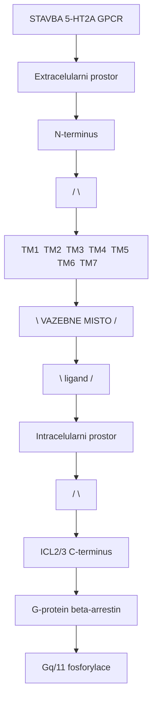
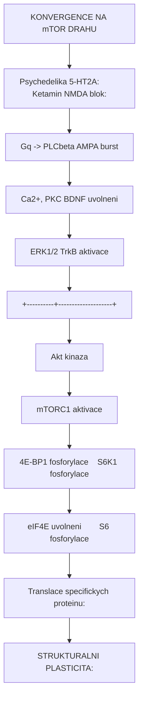
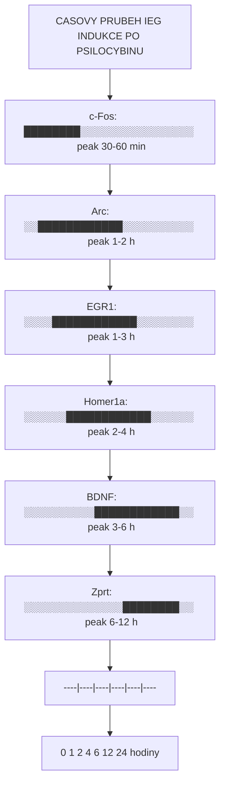

+++
title = "Signalni transdukce"
description = "GPCR signalizace, ionotropni mechanismy, beta-arrestin drahy, biased agonismus, downstream efektory psychoaktivnich latek"
weight = 2
insert_anchor_links = "right"

[taxonomies]
tags = ["signalni-transdukce", "GPCR", "G-protein", "ionotropni", "beta-arrestin", "biased-agonismus", "second-messenger"]
categories = ["farmakologie", "molekularni-biologie", "mechanismy"]
+++

# Signalni transdukce psychoaktivnich latek

**Signalni transdukce** je proces, jimz se extracelularni signal (vazba ligandu na receptor) prevadi na intracelularni odpoved (zmena bunecne aktivity). Psychoaktivni latky vyuzivaji tri hlavni typy signalnich drah: **GPCR signalizaci** (psychedelika), **ionotropni signalizaci** (muscimol, ketamin) a **transporterove mechanismy** (MDMA).

---

## GPCR signalizace - Zaklad ucinku psychedelik

### Architektura GPCR

G-protein coupled receptory (GPCR) jsou **7-transmembranove** receptory, ktere konvertuji extracelularni signaly prostrednictvim heterotrimernich G-proteinu:



<details>
<summary>ASCII verze diagramu</summary>

```
STAVBA 5-HT2A GPCR

    Extracelularni prostor
    ===========================
           N-terminus
          /          \
    ┌────────────────────────────┐
    │ TM1  TM2  TM3  TM4  TM5  TM6  TM7 │
    │  │    │    │    │    │    │    │    │
    │  │    │    │    │    │    │    │    │
    └────────────────────────────┘
          \  VAZEBNE MISTO  /
           \  (ligand)     /
            └──────────────
    ===========================
    Intracelularni prostor
          /            \
     ICL2/3           C-terminus
      │                    │
      v                    v
    G-protein          beta-arrestin
    (Gq/11)           fosforylace
```

</details>

### Typy G-proteinu a jejich signalni drahy

| G-protein | Efektor | Second messenger | Bunecni ucinek | Psychoaktivni latky |
|-----------|---------|-----------------|----------------|---------------------|
| **Gq/11** | PLCbeta | IP3 + DAG | Ca2+ release, PKC | [Psilocin](@/alkaloids/psilocin.md), [LSD](@/alkaloids/lsd.md), [DMT](@/alkaloids/dmt.md) |
| **Gi/o** | Adenylyl cyklaza (inhibice) | cAMP snizeni | PKA inhibice | 5-MeO-DMT (via 5-HT1A), opiaty |
| **Gs** | Adenylyl cyklaza (aktivace) | cAMP zvyseni | PKA aktivace | (Dopamin D1) |
| **G12/13** | RhoGEF | Rho aktivace | Cytoskeletalni zmeny | (Sekundarni 5-HT2A) |

---

## Gq/11 signalni kaskada (detailne)

### Primy retezec udalosti

Toto je **dominantni draha** pro ucinky klasickych psychedelik:

```mermaid
flowchart TD
    node_KOMPLETNIGqKASKADA5H["KOMPLETNI Gq KASKADA 5-HT2A"]
    node_1AKTIVACERECEPTORUmi["1 AKTIVACE RECEPTORU milisekundy"]
    node_PsilocinLSDDMT5HT2A["Psilocin/LSD/DMT + 5-HT2A"]
    node_KonformacnizmenaTM3T["Konformacni zmena TM3, TM5, TM6"]
    node_otevreniintracelular["otevreni intracelulariho prostoru"]
    node_2GPROTEINAKTIVACE100["2 G-PROTEIN AKTIVACE 100-500 ms"]
    node_Gqalfapodjednotka["Gq alfa podjednotka"]
    node_GDPGTPvymena["GDP -&gt; GTP vymena"]
    node_GqalfaGTPseoddelujeo["Gqalfa-GTP se oddeluje od beta-gamma"]
    node_3EFEKTORAKTIVACEseku["3 EFEKTOR AKTIVACE sekundy"]
    node_PLCbetafosfolipazaCb["PLCbeta fosfolipaza C-beta"]
    node_aktivovanaGqalfaGTP["aktivovana Gqalfa-GTP"]
    node_PIP2IP3DAG["PIP2 -&gt; IP3 + DAG"]
    node_hydrolzamembranoveho["hydrolza membranoveho fosfolipidu"]
    node_4SECONDMESSENGERSsek["4 SECOND MESSENGERS sekundy-minuty"]
    node_IP3DAG["IP3                   DAG"]
    node_IP3receptorPKC["IP3 receptor          PKC"]
    node_naER["na ER"]
    node_Fosforylace["Fosforylace:"]
    node_Ca2uvolneniIonkanaly["Ca2+ uvolneni  - Ion kanaly"]
    node_zERReceptory["z ER            - Receptory"]
    node_Transkrfaktory["- Transkr. faktory"]
    node_Ca2transient["Ca2+ transient"]
    node_100nM500nM["100 nM -&gt; 500 nM"]
    node_5DOWNSTREAMEFEKTORYm["5 DOWNSTREAM EFEKTORY minuty-hodiny"]
    node_CalmodulinPKCsubstra["Calmodulin            PKC substraty"]
    node_CaMKIIERK12["CaMKII               ERK1/2"]
    node_CREBfosfolELK1["CREB fosfol.          ELK-1"]
    node_Genovaexprese["Genova exprese:"]
    node_BDNFArccFosEGR1Homer["BDNF, Arc, c-Fos, EGR1, Homer1a"]
    node_6NEUROPLASTICITAhodi["6 NEUROPLASTICITA hodiny-dny"]
    node_BDNFTrkBAktmTORC1["BDNF -&gt; TrkB -&gt; Akt -&gt; mTORC1"]
    node_Syntezaproteinu["Synteza proteinu"]
    node_Dendritickyrust1015["Dendriticky rust +10-15%"]
    node_Spinedensita2030["Spine densita +20-30%"]
    node_Synaptogeneze["Synaptogeneze"]

    node_KOMPLETNIGqKASKADA5H --> node_1AKTIVACERECEPTORUmi
    node_1AKTIVACERECEPTORUmi --> node_PsilocinLSDDMT5HT2A
    node_PsilocinLSDDMT5HT2A --> node_KonformacnizmenaTM3T
    node_KonformacnizmenaTM3T --> node_otevreniintracelular
    node_otevreniintracelular --> node_2GPROTEINAKTIVACE100
    node_2GPROTEINAKTIVACE100 --> node_Gqalfapodjednotka
    node_Gqalfapodjednotka --> node_GDPGTPvymena
    node_GDPGTPvymena --> node_GqalfaGTPseoddelujeo
    node_GqalfaGTPseoddelujeo --> node_3EFEKTORAKTIVACEseku
    node_3EFEKTORAKTIVACEseku --> node_PLCbetafosfolipazaCb
    node_PLCbetafosfolipazaCb --> node_aktivovanaGqalfaGTP
    node_aktivovanaGqalfaGTP --> node_PIP2IP3DAG
    node_PIP2IP3DAG --> node_hydrolzamembranoveho
    node_hydrolzamembranoveho --> node_4SECONDMESSENGERSsek
    node_4SECONDMESSENGERSsek --> node_IP3DAG
    node_IP3DAG --> node_IP3receptorPKC
    node_IP3receptorPKC --> node_naER
    node_naER --> node_Fosforylace
    node_Fosforylace --> node_Ca2uvolneniIonkanaly
    node_Ca2uvolneniIonkanaly --> node_zERReceptory
    node_zERReceptory --> node_Transkrfaktory
    node_Transkrfaktory --> node_Ca2transient
    node_Ca2transient --> node_100nM500nM
    node_100nM500nM --> node_5DOWNSTREAMEFEKTORYm
    node_5DOWNSTREAMEFEKTORYm --> node_CalmodulinPKCsubstra
    node_CalmodulinPKCsubstra --> node_CaMKIIERK12
    node_CaMKIIERK12 --> node_CREBfosfolELK1
    node_CREBfosfolELK1 --> node_Genovaexprese
    node_Genovaexprese --> node_BDNFArccFosEGR1Homer
    node_BDNFArccFosEGR1Homer --> node_6NEUROPLASTICITAhodi
    node_6NEUROPLASTICITAhodi --> node_BDNFTrkBAktmTORC1
    node_BDNFTrkBAktmTORC1 --> node_Syntezaproteinu
    node_Syntezaproteinu --> node_Dendritickyrust1015
    node_Dendritickyrust1015 --> node_Spinedensita2030
    node_Spinedensita2030 --> node_Synaptogeneze

    click node_PsilocinLSDDMT5HT2A "/alkaloids/psilocin/" "Psilocin/LSD/DMT + 5-HT2A"
    click node_6NEUROPLASTICITAhodi "/glossary/neuroplasticita/" "6 NEUROPLASTICITA hodiny-dny"
```



<details>
<summary>ASCII verze diagramu</summary>

```
KOMPLETNI Gq KASKADA (5-HT2A)
================================

[1] AKTIVACE RECEPTORU (milisekundy)
    Psilocin/LSD/DMT + 5-HT2A
              |
              v
    Konformacni zmena TM3, TM5, TM6
    (otevreni intracelulariho prostoru)

[2] G-PROTEIN AKTIVACE (100-500 ms)
              |
              v
    Gq alfa podjednotka
    GDP -> GTP vymena
              |
              v
    Gq(alfa-GTP) se oddeluje od beta-gamma

[3] EFEKTOR AKTIVACE (sekundy)
              |
              v
    PLCbeta (fosfolipaza C-beta)
    aktivovana Gq(alfa-GTP)
              |
              v
    PIP2 -> IP3 + DAG
    (hydrolza membranoveho fosfolipidu)

[4] SECOND MESSENGERS (sekundy-minuty)
    ┌─────────┴──────────┐
    |                     |
    v                     v
   IP3                   DAG
    |                     |
    v                     v
   IP3 receptor          PKC
   na ER                  |
    |                     v
    v              Fosforylace:
   Ca2+ uvolneni  - Ion kanaly
   z ER            - Receptory
    |              - Transkr. faktory
    v
   Ca2+ transient
   [100 nM -> 500 nM]

[5] DOWNSTREAM EFEKTORY (minuty-hodiny)
    ┌─────────┴──────────┐
    |                     |
    v                     v
   Calmodulin            PKC substraty
    |                     |
    v                     v
   CaMKII               ERK1/2
    |                     |
    v                     v
   CREB fosfol.          ELK-1
    |                     |
    v                     v
   Genova exprese:
   BDNF, Arc, c-Fos, EGR1, Homer1a

[6] NEUROPLASTICITA (hodiny-dny)
              |
              v
    BDNF -> TrkB -> Akt -> mTORC1
              |
              v
    Synteza proteinu
    Dendriticky rust (+10-15%)
    Spine densita (+20-30%)
    Synaptogeneze
```

</details>

### Kvantitativni parametry Gq kaskady

| Udalost | Casovy ramec | Amplituda | Metoda |
|---------|-------------|-----------|--------|
| Konformacni zmena receptoru | 1-10 ms | - | FRET, cryo-EM |
| GDP->GTP vymena na Gq | 50-200 ms | - | BRET senzory |
| PLCbeta aktivace | 200-500 ms | 5-50x bazal | IP1 akumulace |
| IP3 generace | 0.5-2 s | 10-100 nM peak | LC-MS |
| Ca2+ transient | 1-5 s (peak) | 200-500 nM | Fura-2, GCaMP |
| PKC translokace | 10-30 s | - | GFP-PKC imaging |
| ERK1/2 fosforylace | 5-15 min (peak) | 2-10x bazal | Western blot |
| CREB fosforylace | 15-60 min | 3-8x bazal | Immunostaining |
| c-Fos mRNA | 30-60 min | 5-20x bazal | RT-qPCR |
| BDNF mRNA | 1-3 h | 3-10x bazal | RT-qPCR |
| BDNF protein | 6-24 h | 2-4x bazal | ELISA |
| Dendriticke zmeny | 24-72 h | +10-15% | Golgi, 2-foton |
| Synaptogeneze | 24-72 h | +20-30% spines | Electron. mikr. |

---

## beta-arrestin signalizace

### beta-arrestin draha

```mermaid
flowchart TD
    node_BETAARRESTINSIGNALIZ["BETA-ARRESTIN SIGNALIZACE 5-HT2A"]
    node_1GRKfosforylacerecep["1 GRK fosforylace receptoru"]
    node_Aktivovany5HT2A["Aktivovany 5-HT2A"]
    node_GRK23Gproteinrecepto["GRK2/3 G-protein receptor kinaza"]
    node_FosforylaceCterminal["Fosforylace C-terminalu Ser/Thr"]
    node_2betaarrestin2rekrut["2 beta-arrestin 2 rekrutace"]
    node_betaarr2sevazenafosf["beta-arr2 se vaze na fosforyl. receptor"]
    node_SterickyblokujeGqint["Stericky blokuje Gq interakci"]
    node_3Internalizace["3 Internalizace"]
    node_Clathrincoatedpits["Clathrin-coated pits"]
    node_Endocytozadoendozomu["Endocytoza do endozomu"]
    node_RECYKLACEDEGRADACE["RECYKLACE           DEGRADACE"]
    node_minhhdny["min-h             h-dny"]
    node_povrchDownregulace["povrch           -&gt; Downregulace"]
    node_4Signalizacezendozom["4 Signalizace z endozomu"]
    node_ERK12prolongovana301["ERK1/2 prolongovana, 30-120 min"]
    node_Srckinazy["Src kinazy"]
    node_p38MAPK["p38 MAPK"]

    node_BETAARRESTINSIGNALIZ --> node_1GRKfosforylacerecep
    node_1GRKfosforylacerecep --> node_Aktivovany5HT2A
    node_Aktivovany5HT2A --> node_GRK23Gproteinrecepto
    node_GRK23Gproteinrecepto --> node_FosforylaceCterminal
    node_FosforylaceCterminal --> node_2betaarrestin2rekrut
    node_2betaarrestin2rekrut --> node_betaarr2sevazenafosf
    node_betaarr2sevazenafosf --> node_SterickyblokujeGqint
    node_SterickyblokujeGqint --> node_3Internalizace
    node_3Internalizace --> node_Clathrincoatedpits
    node_Clathrincoatedpits --> node_Endocytozadoendozomu
    node_Endocytozadoendozomu --> node_RECYKLACEDEGRADACE
    node_RECYKLACEDEGRADACE --> node_minhhdny
    node_minhhdny --> node_povrchDownregulace
    node_povrchDownregulace --> node_4Signalizacezendozom
    node_4Signalizacezendozom --> node_ERK12prolongovana301
    node_ERK12prolongovana301 --> node_Srckinazy
    node_Srckinazy --> node_p38MAPK
```



<details>
<summary>ASCII verze diagramu</summary>

```
BETA-ARRESTIN SIGNALIZACE (5-HT2A)

[1] GRK fosforylace receptoru
    Aktivovany 5-HT2A
              |
              v
    GRK2/3 (G-protein receptor kinaza)
              |
              v
    Fosforylace C-terminalu (Ser/Thr)

[2] beta-arrestin 2 rekrutace
              |
              v
    beta-arr2 se vaze na fosforyl. receptor
              |
              v
    Stericky blokuje Gq interakci
    = DESENZITIZACE

[3] Internalizace
              |
              v
    Clathrin-coated pits
              |
              v
    Endocytoza do endozomu
              |
    ┌─────────┴──────────┐
    v                     v
  RECYKLACE           DEGRADACE
  (min-h)             (h-dny)
  -> Navrat na        -> Lysosom
     povrch           -> Downregulace
                      -> TOLERANCE

[4] Signalizace z endozomu
              |
              v
    ERK1/2 (prolongovana, 30-120 min)
    Src kinazy
    p38 MAPK
```

</details>

### Kvantitativni parametry beta-arrestin drahy

| Udalost | Casovy ramec | Latka-specificke |
|---------|-------------|------------------|
| GRK fosforylace | 30 s - 2 min | Podobne pro vsechny agonisty |
| beta-arr2 rekrutace | 1-5 min | LSD: slaba; Psilocin: stredni |
| Internalizace (50%) | 10-30 min | LSD: pomala; Serotonin: rychla |
| Recyklace (50%) | 30-60 min | Zavisi na ligandu |
| Downregulace (50%) | 4-12 h | Pri prolongovane expozici |

---

## Funkcionalni selektivita (Biased agonismus)

### Koncept biased agonismu

Ruzne ligandy **aktivuji ruzne signalni drahy** na **stejnem receptoru**. Toto je klicovy princip pro pochopeni, proc ruzna psychedelika maji odlisne fenomenologie:

```
BIASED AGONISMUS NA 5-HT2A

SEROTONIN (endogenni, vyvazeny):
    5-HT2A -> Gq/11 ████████████ (100%)
    5-HT2A -> beta-arr ████████████ (100%)
    Bias faktor = 1.0

LSD (silne Gq-biased):
    5-HT2A -> Gq/11 █████████░░ (85-95%)
    5-HT2A -> beta-arr ██░░░░░░░░ (15-25%)
    Bias faktor = 5-10 (smer Gq)
    -> SILNA halucinogenni aktivita
    -> SLABA desenzitizace (dlouhy ucinek)

PSILOCIN (mirne Gq-biased):
    5-HT2A -> Gq/11 ██████░░░░ (60-75%)
    5-HT2A -> beta-arr █████░░░░░ (50-65%)
    Bias faktor = 1.2-1.5
    -> Stredni halucinace
    -> Stredni desenzitizace

LISURID (beta-arr-biased, NE-halucinogen):
    5-HT2A -> Gq/11 ██░░░░░░░░ (15-30%)
    5-HT2A -> beta-arr ██████░░░░ (55-70%)
    Bias faktor = 0.2-0.3 (smer beta-arr)
    -> ZADNE halucinace
    -> SILNA desenzitizace
```

### Kvantifikace biasu

```
Bias faktor (beta) = log(Emax_A/EC50_A) draha 1
                     - log(Emax_A/EC50_A) draha 2
                     - [log(Emax_ref/EC50_ref) draha 1
                     - log(Emax_ref/EC50_ref) draha 2]

Reference = serotonin (beta = 0 definicne)
Pozitivni = preference drahy 1 (napr. Gq)
Negativni = preference drahy 2 (napr. beta-arr)
```

| Ligand | Bias faktor (Gq vs beta-arr) | Halucinogenni? | Desenzitizace |
|--------|------------------------------|----------------|---------------|
| Serotonin | 0 (ref.) | Ne | Stredni |
| **LSD** | +0.7 az +1.0 | **Ano** | Nizka |
| **DOI** | +0.3 az +0.5 | **Ano** | Stredni |
| **Psilocin** | +0.1 az +0.3 | **Ano** | Stredni |
| **DMT** | +0.2 az +0.4 | **Ano** | Nizka |
| **Lisurid** | -0.5 az -0.8 | **Ne** | Vysoka |
| **Ergotamin** | -0.3 az -0.5 | **Ne** | Vysoka |

---

## Ionotropni signalizace


```
GABA-A SIGNALIZACE - PRIMY IONOVY MECHANISMUS

[1] VAZBA LIGANDU
    Muscimol/GABA vaze na alpha/beta interface
              |
              v
    Konformacni zmena TM2 helixu
    (rotace 15-20 stupnu)

[2] OTEVRENI KANALU
              |
              v
    Chloridovy por: 5 A prumer -> 6-7 A
    Vodivost: 25-30 pS
    Selektivita: Cl- >> Na+ (>10:1)

[3] IONTOVY FLUX
              |
              v
    Cl- influx: 10-50 pA proud
    Membranovy potencial: -70 -> -80 az -90 mV
    Cas: 1-50 ms (fazicka)
         kontinualni (tonicka, delta subtypy)

[4] NEURONALNI INHIBICE
              |
              v
    Snizeni excitability
    Zvyseni prahu akcniho potencialu
    Shunting inhibice (snizeni vstupniho odporu)

[5] SITOVY EFEKT
              |
              v
    Kortikalni: Sedace, zmenene vedomi
    Thalamicka: Senzoricky gate
    Limbicka: Anxiolyza
    Cerebellum: Ataxie
```

### NMDA receptor (Ketamin, PCP)

```
NMDA SIGNALIZACE - USE-DEPENDENT ANTAGONISMUS

NORMALNI AKTIVACE:
[1] Presynapticky glutamat + Glycin (astrocyty)
              |
              v
[2] Membránová depolarizace (AMPA receptor)
              |
              v
[3] Mg2+ vystupuje z poru
              |
              v
[4] NMDA kanal otevren
    Ca2+ + Na+ influx
              |
              v
[5] Ca2+-zavisle signalizace:
    CaMKII -> LTP
    Calcineurin -> LTD
    -> PAMET, UCENI

S KETAMINEM (use-dependent block):
[1] NMDA kanal se otevre (jako normalne)
              |
              v
[2] Ketamin vstupuje do otevrenecho kanalu
    (proto "use-dependent" - vyzaduje otevreni)
              |
              v
[3] Blokuje Ca2+ influx
              |
              v
[4] Preferenčně blokuje GABA interneurony
    (vyssi bazalni aktivita -> vice "use")
              |
              v
[5] DEZINHIBICE pyramidovych neuronu
              |
              v
[6] Paradoxni glutamatovy burst
              |
              v
[7] AMPA receptor aktivace (na pyramidalnich neuronech)
              |
              v
[8] BDNF uvolneni
              |
              v
[9] TrkB -> mTORC1 -> Synaptogeneze
              |
              v
    ANTIDEPRESIVNI UCINEK (24-72 h)
    + DISOCIACE (akutni)
```

---

## Downstream efektory a neuroplasticita

### mTOR draha (spolecna pro psychedelika i ketamin)



<details>
<summary>ASCII verze diagramu</summary>

```
KONVERGENCE NA mTOR DRAHU

Psychedelika (5-HT2A):         Ketamin (NMDA blok):
    |                               |
    v                               v
Gq -> PLCbeta                  AMPA burst
    |                               |
    v                               v
Ca2+, PKC                     BDNF uvolneni
    |                               |
    v                               v
ERK1/2                         TrkB aktivace
    |                               |
    +----------+--------------------+
               |
               v
           Akt kinaza
               |
               v
           mTORC1 aktivace
               |
               v
    ┌──────────┴───────────┐
    |                       |
    v                       v
4E-BP1 fosforylace    S6K1 fosforylace
    |                       |
    v                       v
eIF4E uvolneni        S6 fosforylace
    |                       |
    v                       v
Translace specifickych proteinu:
- PSD-95 (postsynapticky)
- GluA1 (AMPA subunit)
- Synaptofyzin (presynapticky)
- Arc (plasticita)
    |
    v
STRUKTURALNI PLASTICITA:
- Dendriticky rust (+10-15%)
- Spinogeneze (+20-30%)
- Synaptogeneze
- Zvysena konektivita
```

</details>

### BDNF-TrkB signalizace

| Parametr | Po psilocybinu | Po ketaminu | Po LSD |
|----------|---------------|-------------|--------|
| BDNF mRNA peak | 1-3 h | 30-60 min | 1-3 h |
| BDNF protein peak | 6-24 h | 2-6 h | 6-24 h |
| BDNF fold-change | 2-4x | 1.5-3x | 2-4x |
| TrkB fosforylace | 1-6 h | 30 min - 2 h | 1-6 h |
| Oblast | PFC, hippocampus | PFC, hippocampus | PFC, hippocampus |
| Trvani elevace | 24-72 h | 12-48 h | 24-72 h |

### Genova exprese - Immediate Early Genes (IEGs)



<details>
<summary>ASCII verze diagramu</summary>

```
CASOVY PRUBEH IEG INDUKCE PO PSILOCYBINU

c-Fos:     ████████░░░░░░░░░░░░░░░░  (peak 30-60 min)
Arc:       ░░████████████░░░░░░░░░░  (peak 1-2 h)
EGR1:      ░░░░████████████░░░░░░░░  (peak 1-3 h)
Homer1a:   ░░░░░░████████████░░░░░░  (peak 2-4 h)
BDNF:      ░░░░░░░░░░████████████░░  (peak 3-6 h)
Zprt:      ░░░░░░░░░░░░░░████████░░  (peak 6-12 h)
           |----|----|----|----|----|----|
           0    1    2    4    6   12   24  hodiny
```

</details>

---

## Tabulka signalnich drah podle latky

| Latka | Primarn draha | Sekundarni drahy | Unikatni aspekt |
|-------|---------------|------------------|-----------------|
| [Psilocybin](@/alkaloids/psilocybin.md) | Gq -> PLCb -> Ca2+ -> CREB | beta-arr, ERK, mTOR | Prodrug, cleaner profil |
| [LSD](@/alkaloids/lsd.md) | Gq -> PLCb (biased) | D2 (Gi), TAAR1 | Lid/trapping, polyfarm. |
| [DMT](@/alkaloids/dmt.md) | Gq -> PLCb | Sigma-1 (chaperon) | Endogenni, Sigma-1 |
| [5-MeO-DMT](@/alkaloids/5-meo-dmt.md) | Gq + Gi (5-HT1A) | PLCb + cAMP inhibice | Dual 5-HT2A/1A |
| [Meskalin](@/alkaloids/mescaline.md) | Gq -> PLCb (nizka potence) | 5-HT2C, adrenergni | Pomaly nastup |
| Ketamin | NMDA blok -> AMPA burst | Sigma, opioid | Use-dependent |
| MDMA | SERT reversal -> 5-HT flood | 5-HT2A, oxytocin | Empathogenni |
| [Ibogain](@/alkaloids/ibogaine.md) | kappa-opioid, NMDA, 5-HT2A | Sigma-2, SERT | Multipocilový |
| [Salvinorin A](@/alkaloids/salvinorin.md) | kappa-opioid (Gi) | - | Unikatni KOR selektivita |

---

## Casova integrace signalnich drah

```
CASOVA OSA UCINKU PSILOCYBINU

0 min    Poziti psilocybinu
         |
15 min   Defosforylace -> Psilocin
         |
30 min   5-HT2A vazba, Gq aktivace
         Ca2+ transient, PKC
         |
45 min   ERK1/2 fosforylace
         Neuronalni excitabilita
         SUBJEKTIVNI NASTUP
         |
60-90 min CREB fosforylace
         IEG indukce (c-Fos, Arc)
         DMN suprese
         PEAK SUBJEKTIVNICH UCINKU
         |
2-3 h    BDNF mRNA indukce
         Homer1a, EGR1
         Plny psychedelicky stav
         |
4-6 h    Receptor internalizace
         beta-arr signalizace
         ODEZNIVANI SUBJEKTIVNICH UCINKU
         |
6-24 h   BDNF protein synteza
         mTORC1 aktivace
         Dendriticky rust
         AFTERGLOW
         |
24-72 h  Synaptogeneze
         Spine densita
         Funkcni konektivita
         TERAPEUTICKE OKNO
         |
1-4 tydny Receptor resynpteza
         Normalizace signalizace
         TRVALÉ ZMENY KONEKTIVITY
```

---

## Reference

1. Wettschureck, N. & Offermanns, S. (2005). *Mammalian G proteins and their cell type specific functions*. Physiological Reviews, 85(4), 1159-1204.
2. Ly, C. et al. (2018). *Psychedelics Promote Structural and Functional Neural Plasticity*. Cell Reports, 23(11), 3170-3182.
3. Gonzalez-Maeso, J. et al. (2007). *Hallucinogens recruit specific cortical 5-HT2A receptor-mediated signaling pathways*. Neuron, 53(3), 439-452.
4. Schmid, C.L. et al. (2008). *Agonist-directed signaling of the serotonin 2A receptor depends on beta-arrestin-2 interactions in vivo*. PNAS, 105(3), 1079-1084.
5. Kim, K. et al. (2020). *Structure of a Hallucinogen-Activated Gq-Coupled 5-HT2A Serotonin Receptor*. Cell, 182(6), 1574-1588.
6. Zanos, P. et al. (2016). *NMDA receptor inhibition-independent antidepressant actions of ketamine metabolites*. Nature, 533(7604), 481-486.
7. Li, N. et al. (2010). *mTOR-dependent synapse formation underlies the rapid antidepressant effects of NMDA antagonists*. Science, 329(5994), 959-964.

---

Viz take:
- [Receptorova kinetika](@/mechanisms/receptor-binding.md) - Vazebne parametry
- [Alostericka modulace](@/mechanisms/allosteric-modulation.md) - PAM, NAM
- PK-PD vztahy - Farmakokinetika (pripravujeme)
- [5-HT2A receptor](@/receptors/5-ht2a.md) - Hlavni cil psychedelik
- [Neuroplasticita](@/glossary/neuroplasticita.md) - Adaptivni zmeny

<- Zpet na [Mechanismy ucinku](@/mechanisms/_index.md)
