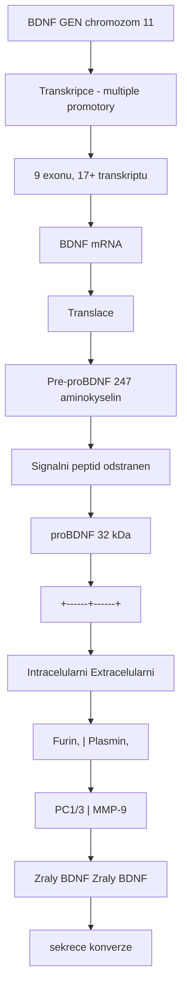
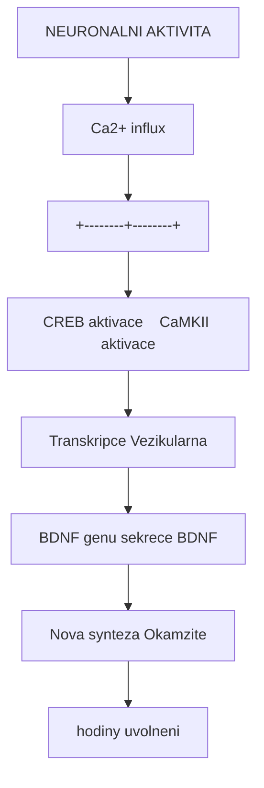
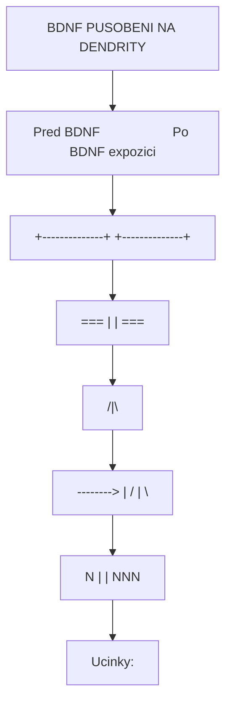
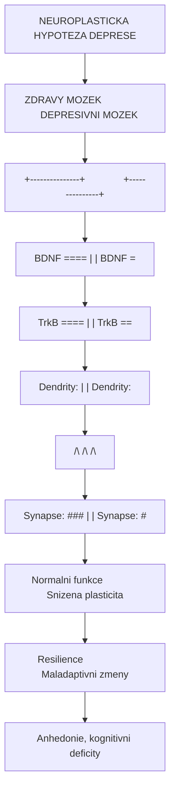

+++
title = "BDNF - Brain-Derived Neurotrophic Factor"
description = "Mozkovy neurotrofni faktor - klicovy protein pro neuroplasticitu, uceni, pamet a antidepresivni ucinky psychedelik a ketaminu"
weight = 1
insert_anchor_links = "right"

[taxonomies]
categories = ["neuroveda", "molekuly", "biochemie"]
tags = ["BDNF", "neuroplasticita", "neurotrofiny", "deprese", "psychedelika", "ketamin", "uceni", "pamet", "synaptogeneze"]
+++

# BDNF - Brain-Derived Neurotrophic Factor

**BDNF** (Brain-Derived Neurotrophic Factor, mozkovy neurotrofni faktor) je klicovy protein z rodiny **neurotrofinu**, ktery hraje centralni roli v [neuroplasticite](@/glossary/neuroplasticita.md), preziti neuronu, synaptogenezi a kognitivnich funkcich. Je povazovan za jeden z nejvyznamnejsich molekularnich mediatoru terapeutickych ucinku psychedelik, [ketaminu](@/alkaloids/ketamin.md) a antidepresiv.

Snizene hladiny BDNF jsou konzistentne spojovany s [depresí](@/conditions/depression.md), zatimco zvyseni BDNF predstavuje spolecny mechanismus ucinku prakticky vsech efektivnich antidepresivnich terapii.

---

## Zakladni charakteristika

### Molekularni vlastnosti

| Vlastnost | Hodnota |
|-----------|---------|
| **Gen** | BDNF (chromozom 11p14.1) |
| **Protein** | Neurotrofin, dimer |
| **Molekularni hmotnost** | 27 kDa (zraly), 32 kDa (proBDNF) |
| **Struktura** | Cystinovy uzel |
| **Receptor** | TrkB (vysokoafinitni), p75NTR (nizkoafinitni) |
| **Lokalizace** | Hippocampus, kortex, amygdala, hypothalamus |
| **Sekrece** | Aktivitne-zavisla |

### Formy BDNF

| Forma | Velikost | Receptor | Funkce |
|-------|----------|----------|--------|
| **proBDNF** | 32 kDa | p75NTR | Apoptoza, LTD |
| **Zraly BDNF** | 14 kDa (monomer) | TrkB | Preziti, LTP, plasticita |
| **BDNF dimer** | 27 kDa | TrkB | Aktivni forma |
| **Val66Met varianta** | - | Snizena sekrece | Geneticky rizikovy faktor |

---

## Biosynteza a sekrece

### Transkripce a processing



<details>
<summary>ASCII verze diagramu</summary>

```
BDNF GEN (chromozom 11)
    |
    | [Transkripce - multiple promotory]
    | 9 exonu, 17+ transkriptu
    v
BDNF mRNA
    |
    | [Translace]
    v
Pre-proBDNF (247 aminokyselin)
    |
    | [Signalni peptid odstranen]
    v
proBDNF (32 kDa)
    |
    +------+------+
    |             |
    v             v
Intracelularni   Extracelularni
    |             |
    | [Furin,     | [Plasmin,
    | PC1/3]      | MMP-9]
    v             v
Zraly BDNF    Zraly BDNF
(sekrece)     (konverze)
```

</details>

### Regulace exprese BDNF

| Faktor | Vliv na BDNF | Mechanismus |
|--------|--------------|-------------|
| **Neuronalni aktivita** | Silne zvyseni | Ca2+/CREB aktivace |
| **[Psychedelika](@/alkaloids/_index.md)** | Silne zvyseni | [5-HT2A](@/receptors/5-ht2a.md) aktivace |
| **[Ketamin](@/alkaloids/ketamin.md)** | Rychle zvyseni | mTORC1 aktivace |
| **Fyzicke cviceni** | Zvyseni | Metabolicka aktivace |
| **SSRI (chronicka)** | Postupne zvyseni | 5-HT elevace |
| **Uceni** | Zvyseni | Synaptická aktivita |
| **Chronicky stres** | Snizeni | Glukokortikoidy |
| **Deprese** | Snizeni | Komplexni dysregulace |
| **Starnuti** | Postupne snizeni | Progresivni pokles |
| **Spanek** | Nutny pro udrzeni | Konsolidace |

### Aktivitne-zavisla sekrece



<details>
<summary>ASCII verze diagramu</summary>

```
NEURONALNI AKTIVITA
        |
        v
    Ca2+ influx
        |
        +--------+--------+
        |                 |
        v                 v
   CREB aktivace    CaMKII aktivace
        |                 |
        v                 v
   Transkripce      Vezikularna
   BDNF genu        sekrece BDNF
        |                 |
        v                 v
   Nova synteza     Okamzite
   (hodiny)         uvolneni
```

</details>

---

## TrkB receptor a signalizace

### Struktura TrkB receptoru

| Domena | Funkce |
|--------|--------|
| **Extracelularni** | Vazba BDNF (Ig-like domeny) |
| **Transmembranova** | Ukotveni v membrane |
| **Intracelularni** | Tyrozin kinazova aktivita |

### Signalni kaskady

```mermaid
flowchart TD
    node_BDNFdimer["BDNF dimer"]
    node_c9470ff3["+--------------+"]
    node_TrkB["TrkB"]
    node_dimerizace["dimerizace"]
    node_Autofosforylace["Autofosforylace"]
    node_a8510f68["+-----------+-----------+"]
    node_4fd5b7a0["+-------+   +-------+   +-------+"]
    node_PI3KPLCgRas["PI3K  |   |  PLCg |   |  Ras"]
    node_8c4dee88["+---+---+   +---+---+   +---+---+"]
    node_AktCa2Raf["Akt  |   | Ca2+  |   |  Raf"]
    node_mTORCaMKIIMEK["mTOR  |   |CaMKII |   |  MEK"]
    node_ERK12["ERK1/2"]
    node_CREB["CREB"]
    node_34959a3e["+------------------------+"]
    node_Genovaexprese["Genova exprese"]
    node_ArccfosSynapsin["Arc, c-fos, Synapsin"]
    node_egr1Homer1a["egr1, Homer1a"]
    node_SynaptogenezeLTPNeur["Synaptogeneze  LTP     Neuronalni"]
    node_zeslenipreziti["zesíleni  preziti"]

    node_BDNFdimer --> node_c9470ff3
    node_c9470ff3 --> node_TrkB
    node_TrkB --> node_dimerizace
    node_dimerizace --> node_Autofosforylace
    node_Autofosforylace --> node_a8510f68
    node_a8510f68 --> node_4fd5b7a0
    node_4fd5b7a0 --> node_PI3KPLCgRas
    node_PI3KPLCgRas --> node_8c4dee88
    node_8c4dee88 --> node_AktCa2Raf
    node_AktCa2Raf --> node_mTORCaMKIIMEK
    node_mTORCaMKIIMEK --> node_ERK12
    node_ERK12 --> node_CREB
    node_CREB --> node_34959a3e
    node_34959a3e --> node_Genovaexprese
    node_Genovaexprese --> node_ArccfosSynapsin
    node_ArccfosSynapsin --> node_egr1Homer1a
    node_egr1Homer1a --> node_SynaptogenezeLTPNeur
    node_SynaptogenezeLTPNeur --> node_zeslenipreziti
```



<details>
<summary>ASCII verze diagramu</summary>

```
           BDNF (dimer)
                |
                v
        +--------------+
        |    TrkB      |
        |  (dimerizace)|
        +--------------+
                |
                | Autofosforylace
                |
    +-----------+-----------+
    |           |           |
    v           v           v
+-------+   +-------+   +-------+
| PI3K  |   |  PLCg |   |  Ras  |
+---+---+   +---+---+   +---+---+
    |           |           |
    v           v           v
+-------+   +-------+   +-------+
|  Akt  |   | Ca2+  |   |  Raf  |
+---+---+   +---+---+   +---+---+
    |           |           |
    v           v           v
+-------+   +-------+   +-------+
| mTOR  |   |CaMKII |   |  MEK  |
+---+---+   +---+---+   +---+---+
    |           |           |
    +-----------+-----------+
                |
                v
            ERK1/2
                |
                v
             CREB
                |
                v
    +------------------------+
    |   Genova exprese       |
    |   (Arc, c-fos, Synapsin|
    |    egr1, Homer1a)      |
    +------------------------+
                |
    +-----------+-----------+
    |           |           |
    v           v           v
Synaptogeneze  LTP     Neuronalni
               zesíleni  preziti
```

</details>

### Tri hlavni drahy

| Draha | Klicove molekuly | Funkce |
|-------|-----------------|--------|
| **PI3K/Akt/mTOR** | PI3K, Akt, mTORC1, S6K | Preziti, syntezy proteinu, synaptogeneze |
| **PLCgamma/Ca2+/CaMKII** | PLCgamma, IP3, Ca2+, CaMKII | Synaptická plasticita, LTP |
| **Ras/MAPK/ERK** | Ras, Raf, MEK, ERK1/2, CREB | Genova exprese, neurogeneze |

---

## BDNF a neuroplasticita

### Synaptická plasticita

| Proces | Role BDNF | Mechanismus |
|--------|-----------|-------------|
| **LTP** | Nezbytny | Facilitace, udrzeni |
| **LTD** | Modulace (proBDNF) | p75NTR signalizace |
| **Synaptogeneze** | Induktor | Dendriticky rust, spine formace |
| **Pruning** | Selektivni | Aktivitne-zavisly |

### Dendriticka plasticita



<details>
<summary>ASCII verze diagramu</summary>

```
BDNF PUSOBENI NA DENDRITY

Pred BDNF                    Po BDNF expozici
+--------------+             +--------------+
|              |             |              |
|    [===]     |             |   [===]      |
|     |        |             |   /|\        |
|     |        |  -------->  |  / | \       |
|    [N]       |             | [N][N][N]    |
|              |             |     |        |
+--------------+             +--------------+

Ucinky:
- Zvysena dendriticka arborizace (+20-40%)
- Zvyseny pocet spinu (+15-30%)
- Zvysena synaptická hustota
- Zlepsena konektivita
```

</details>

### Neurogeneze

| Oblast | BDNF funkce | Casovy ramec |
|--------|-------------|--------------|
| **Subgranularni zona (SGZ)** | Proliferace, diferenciace progenitoru | Dny-tydny |
| **Hippocampus** | Integrace novych neuronu | Tydny |
| **Cichovy bulbus** | Migrace, preziti | Dny |

---

## BDNF a psychicke poruchy

### Deprese - neuroplasticka hypoteza



<details>
<summary>ASCII verze diagramu</summary>

```
NEUROPLASTICKA HYPOTEZA DEPRESE

    ZDRAVY MOZEK                   DEPRESIVNI MOZEK
    +---------------+              +---------------+
    |               |              |               |
    |  BDNF [====]  |              |  BDNF [=]     |
    |  TrkB [====]  |              |  TrkB [==]    |
    |               |              |               |
    |  Dendrity:    |              |  Dendrity:    |
    |  /\  /\  /\   |              |  |   |   |    |
    |               |              |               |
    |  Synapse: ### |              |  Synapse: #   |
    |               |              |               |
    +---------------+              +---------------+
           |                              |
           v                              v
    Normalni funkce             Snizena plasticita
    Resilience                  Maladaptivni zmeny
                                Anhedonie, kognitivni deficity
```

</details>

### Dukazy pro BDNF hypotezu deprese

| Zjisteni | Zdroj | Vyznam |
|----------|-------|--------|
| **Snizeny BDNF v seru** | Meta-analyzy | Biomarker |
| **Snizeny BDNF v hippocampu** | Postmortem studie | Patofyziologie |
| **Val66Met polymorfismus** | Geneticke studie | Rizikovy faktor |
| **Normalizace po lecbe** | Klinicke studie | Mechanismus ucinku |
| **Antidepresiva zvysuji BDNF** | Preklinicke studie | Terapeuticky cil |
| **BDNF knockout = depresivni fenotyp** | Zvíreci modely | Kauzalita |

### Val66Met polymorfismus

| Genotyp | Frekvence | Vliv na BDNF | Klinicke asociace |
|---------|-----------|--------------|-------------------|
| **Val/Val** | 65-70% | Normalni sekrece | Reference |
| **Val/Met** | 25-30% | Snizena sekrece | Mirne zvysene riziko |
| **Met/Met** | 3-5% | Vyrazne snizena | Vyssi riziko deprese, mensi hippocampus |

---

## BDNF a terapeuticke intervence

### Psychedelika a BDNF

```
PSYCHEDELIKA --> BDNF INDUKCE

[Psilocybin/LSD/DMT]
        |
        v
    5-HT2A receptor
    (prefrontalni kortex)
        |
        v
    Gq/11 --> PLCbeta --> IP3/DAG
        |
        v
    Ca2+ --> CaMKII
        |
        v
    ERK1/2 aktivace
        |
        v
    CREB fosforylace
        |
        v
    BDNF genova exprese
        |
        v
    TrkB aktivace
        |
        v
    mTORC1 --> Synaptogeneze
        |
        v
    NEUROPLASTICITA
    (dendriticky rust, nove synapse)
```

### Srovnani terapeutickych pristupu

| Intervence | Zvyseni BDNF | Casovy nastup | Trvani | Mechanismus |
|------------|--------------|---------------|--------|-------------|
| **[Psilocybin](@/alkaloids/psilocybin.md)** | +200-400% | Hodiny | Tydny-mesice | 5-HT2A --> CREB |
| **[Ketamin](@/alkaloids/ketamin.md)** | +100-200% | Hodiny | Dny-tydny | NMDA blokada --> mTOR |
| **SSRI** | +50-100% | Tydny | Pri lecbe | Chronicka 5-HT |
| **ECT** | +200-300% | Okamzite | Dny | Masivni aktivace |
| **Cviceni** | +30-50% | Tydny | Pri aktivite | VEGF, metabolismus |
| **Meditace** | +20-30% | Tydny | Pri praxi | Stresova redukce |

### Ketamin a BDNF

```
KETAMIN --> RYCHLA BDNF INDUKCE

Ketamin
    |
    v
NMDA blokada (extrasynapticky)
    |
    v
Disinhibice pyramidalnich neuronu
    |
    v
Glutamatovy "burst"
    |
    v
AMPA receptor aktivace
    |
    v
Depolarizace --> Ca2+ influx
    |
    v
BDNF uvolneni (aktivitne-zavisla sekrece)
    |
    v
TrkB --> mTORC1
    |
    v
SYNAPTOGENEZE (hodiny-dny)
    |
    v
ANTIDEPRESIVNI UCINEK
```

---

## Mereni BDNF

### Klinicke markery

| Metoda | Material | Norma | Interpretace |
|--------|----------|-------|--------------|
| **Serove BDNF** | Krev | 20-30 ng/mL | Snizene u deprese |
| **Plazmove BDNF** | Krev | 0.5-2 ng/mL | Nizsi variabilita |
| **Trombocytarni** | Krev | - | Zasobarna 5-HT |
| **CSF BDNF** | Likvor | 1-10 pg/mL | Invazivni |

### Metodologie

| Metoda | Citlivost | Vyuziti |
|--------|-----------|---------|
| **ELISA** | ng/mL | Klinicka praxe |
| **Luminex** | pg/mL | Vyzkum |
| **Western blot** | Semikvantitativni | Tkanove analyzy |
| **qPCR** | mRNA hladiny | Exprese |
| **Imunohistochemie** | Lokalizace | Morfologie |

### Limitace serovych mereni

| Faktor | Vliv |
|--------|------|
| **Trombocyty** | 99% serovych BDNF z trombocytu |
| **Koagulace** | Ovlivnuje uvolneni |
| **Cirkadianní rytmus** | Denni variace |
| **Jidlo** | Postprandialni zmeny |
| **Cviceni** | Akutni elevace |

---

## Terapeuticky potencial

### Strategie zvyseni BDNF

| Pristup | Efektivita | Dostupnost | Bezpecnost |
|---------|------------|------------|------------|
| **Fyzicke cviceni** | Stredni | Vysoká | Velmi vysoka |
| **Meditace/mindfulness** | Mirna | Vysoká | Velmi vysoka |
| **Zdravá dieta** | Mirna | Vysoká | Vysoka |
| **Spánková hygiena** | Mirna | Vysoká | Vysoka |
| **SSRI/SNRI** | Stredni | Predpis | Stredni |
| **Psychedelika** | Vysoka | Limitovana | Stredni |
| **Ketamin** | Vysoka | Klinicka | Stredni |
| **ECT** | Velmi vysoka | Specializovana | Stredni |

### Budouci smery

| Oblast | Status | Potencial |
|--------|--------|-----------|
| **TrkB agoniste** | Vyzkum | Vysoky |
| **BDNF mimetika** | Preklinicka | Stredni |
| **Geny terapie** | Experimentalni | Dlouhodoby |
| **Intranosalni BDNF** | Testovani | Nejasny |
| **Kombinovane terapie** | Aktivni | Vysoky |

---

## Ostatni neurotrofiny

### Rodina neurotrofinu

| Neurotrofin | Receptor | Hlavni funkce |
|-------------|----------|---------------|
| **NGF** | TrkA, p75NTR | Sympaticke neurony, basal forebrain |
| **BDNF** | TrkB, p75NTR | Hipokampus, kortex, plasticita |
| **NT-3** | TrkC, p75NTR | Proprioceptivni neurony |
| **NT-4/5** | TrkB | Motoricke neurony |

### Dalsi neurotrofni faktory

| Faktor | Zkratka | Funkce |
|--------|---------|--------|
| **Glial-Derived Neurotrophic Factor** | GDNF | Dopaminergni neurony |
| **Ciliary Neurotrophic Factor** | CNTF | Motoricke neurony |
| **Vascular Endothelial Growth Factor** | VEGF | Angiogeneze, neurogeneze |
| **Insulin-like Growth Factor 1** | IGF-1 | Rust, metabolismus |

---

## Reference

### Zakladni literatura

1. Barde, Y.A., Edgar, D., & Thoenen, H. (1982). *Purification of a new neurotrophic factor from mammalian brain*. EMBO Journal.

2. Duman, R.S., & Monteggia, L.M. (2006). *A neurotrophic model for stress-related mood disorders*. Biological Psychiatry.

3. Castren, E., & Antila, H. (2017). *Neuronal plasticity and neurotrophic factors in drug responses*. Molecular Psychiatry.

### BDNF a deprese

4. Karege, F. et al. (2002). *Decreased serum brain-derived neurotrophic factor levels in major depressed patients*. Psychiatry Research.

5. Chen, B. et al. (2001). *Increased hippocampal BDNF immunoreactivity in subjects treated with antidepressant medication*. Biological Psychiatry.

6. Duman, R.S. & Li, N. (2012). *A neurotrophic hypothesis of depression: role of synaptogenesis in the actions of NMDA receptor antagonists*. Philosophical Transactions B.

### Psychedelika a BDNF

7. Ly, C. et al. (2018). *Psychedelics Promote Structural and Functional Neural Plasticity*. Cell Reports.

8. Shao, L.X. et al. (2021). *Psilocybin induces rapid and persistent growth of dendritic spines in frontal cortex in vivo*. Neuron.

### Ketamin a BDNF

9. Zanos, P. et al. (2016). *NMDAR inhibition-independent antidepressant actions of ketamine metabolites*. Nature.

10. Autry, A.E. et al. (2011). *NMDA receptor blockade at rest triggers rapid behavioural antidepressant responses*. Nature.

---

## Viz take

### Neuroplasticita
- [Neuroplasticita](@/glossary/neuroplasticita.md) - Zakladni koncept
- [Uceni](@/glossary/uceni.md) - Kognitivni aspekty

### Receptory
- [5-HT2A receptor](@/receptors/5-ht2a.md) - Psychedelicky cil
- [NMDA receptor](@/receptors/nmda.md) - Ketaminovy cil
- [AMPA receptor](@/receptors/ampa.md) - Rychla excitace

### Psychoaktivni latky
- [Psilocybin](@/alkaloids/psilocybin.md) - Psychedelicky induktor BDNF
- [Ketamin](@/alkaloids/ketamin.md) - Rychly antidepresivni ucinek
- [LSD](@/alkaloids/lsd.md) - Silny neuroplastogen
- [DMT](@/alkaloids/dmt.md) - Endogenni psychoplastogen

### Souvisejici temata
- [Deprese](@/conditions/depression.md) - Klinicka indikace
- [Serotonin](@/glossary/serotonin.md) - Neurotransmiter

### Mozkove struktury
- [Hippocampus](@/brain/hippocampus.md) - Hlavni misto exprese
- [Prefrontalni kortex](@/brain/prefrontal-cortex.md) - Kognitivni funkce

---

<- Zpet na [Molekuly](@/molecules/_index.md)
