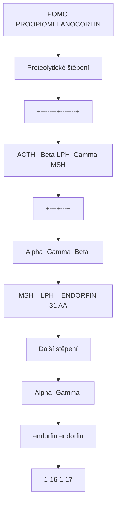
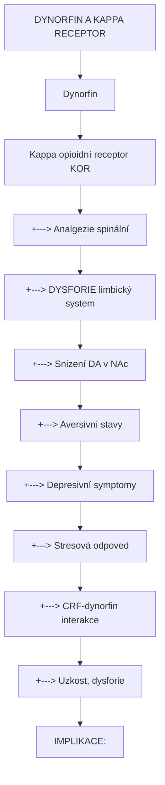
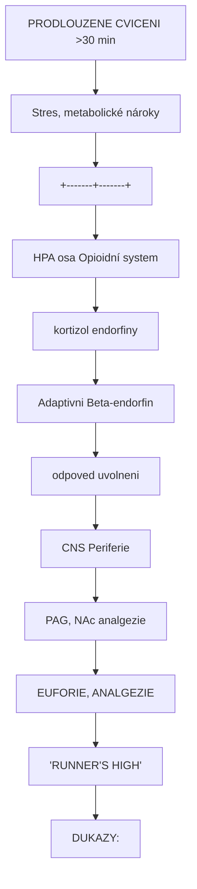

+++
title = "Endorfiny"
description = "Endogenni opioidni peptidy - beta-endorfin, enkefaliny, dynorfiny a jejich role v analgezii a euforii"
weight = 2
insert_anchor_links = "right"

[taxonomies]
categories = ["neuroveda", "molekuly", "biochemie"]
tags = ["endorfiny", "opioidy", "analgezie", "euforie", "runners-high", "beta-endorfin", "enkefaliny"]
+++

# Endorfiny - Endogenni opioidni system

**Endorfiny** (endogenní morfiny) jsou skupina neuropeptidu produkovaných lidským tělem, které pusobi na opioidní receptory. Jsou zodpovedne za přirozenou analgezii, euforii ("runner's high"), a hraji klicovou roli v reward systemu. Termín "endorfin" zahrnuje sirsi rodinu **endogenních opioidních peptidů** vcetne beta-endorfinu, enkefalinu a dynorfinu.

---

## Prehled endogenních opioidů

### Tri hlavni rodiny

| Rodina | Prekurzor | Hlavni peptidy | Primarni receptor |
|--------|-----------|----------------|-------------------|
| **Endorfiny** | Proopiomelanocortin (POMC) | Beta-endorfin | Mu (MOR) |
| **Enkefaliny** | Proenkefalin (PENK) | Met-enkefalin, Leu-enkefalin | Delta (DOR) |
| **Dynorfiny** | Prodynorfin (PDYN) | Dynorfin A, B | Kappa (KOR) |
| **Nociceptin** | Pronociceptin | Nociceptin/OFQ | NOP |

### Opioidní receptory

| Receptor | Typ | Hlavni ucinek | Endogenni ligand |
|----------|-----|---------------|------------------|
| **Mu (MOR)** | GPCR (Gi/o) | Analgezie, euforie, závislost | Beta-endorfin |
| **Delta (DOR)** | GPCR (Gi/o) | Analgezie, antidepresivni | Enkefaliny |
| **Kappa (KOR)** | GPCR (Gi/o) | Analgezie, dysforie | Dynorfiny |
| **NOP** | GPCR (Gi/o) | Anxiogenni, anti-opioidní | Nociceptin |

---

## Beta-endorfin

### Charakteristika

| Vlastnost | Hodnota |
|-----------|---------|
| **Sekvence** | Tyr-Gly-Gly-Phe-Met-Thr-Ser-Glu-Lys-Ser-Gln-Thr-Pro-Leu-Val-Thr-Leu-Phe-Lys-Asn-Ala-Ile-Ile-Lys-Asn-Ala-Tyr-Lys-Lys-Gly-Glu (31 AA) |
| **Prekurzor** | POMC (proopiomelanocortin) |
| **Lokalizace** | Hypothalamus (arkuatní jadro), hypofýza |
| **Receptor** | Mu >> Delta |
| **Potence** | 18-33x morfin |

### Biosynteza



<details>
<summary>ASCII verze diagramu</summary>

```
POMC (PROOPIOMELANOCORTIN)
            |
            | [Proteolytické štěpení]
            |
    +-------+-------+
    |       |       |
    v       v       v
  ACTH   Beta-LPH  Gamma-MSH
    |       |
    |       |
    |   +---+---+
    |   |       |
    v   v       v
Alpha- Gamma-  Beta-
MSH    LPH    ENDORFIN (31 AA)
                |
                v
          [Další štěpení]
                |
        +-------+-------+
        |               |
        v               v
    Alpha-          Gamma-
    endorfin        endorfin
    (1-16)          (1-17)
```

</details>

### Funkce beta-endorfinu

| Funkce | Mechanismus | Dusledek |
|--------|-------------|----------|
| **Analgezie** | Mu aktivace v PAG, RVM | Snizení vnímání bolesti |
| **Euforie** | Mu aktivace v NAc | Pozitivni afekt |
| **Reward** | Modulace DA v NAc | Posilování chovani |
| **Stresová odpoved** | Uvolnění pri stresu | Adaptivni |
| **Imunní modulace** | Opioidní receptory na imunitních b. | Imunomodulace |

---

## Enkefaliny

### Charakteristika

| Vlastnost | Met-enkefalin | Leu-enkefalin |
|-----------|---------------|---------------|
| **Sekvence** | Tyr-Gly-Gly-Phe-**Met** | Tyr-Gly-Gly-Phe-**Leu** |
| **Délka** | 5 aminokyselin | 5 aminokyselin |
| **Prekurzor** | Proenkefalin (PENK) | Proenkefalin (PENK) |
| **Receptor** | Delta > Mu | Delta > Mu |
| **Distribuce** | Siroke v CNS | Siroke v CNS |

### Funkce enkefalinu

| Funkce | Popis |
|--------|-------|
| **Lokalni analgezie** | Micha, PAG |
| **Reward modulace** | VTA, NAc |
| **Gastrointestinalni** | Motilita |
| **Kardiovaskulárni** | Bradykardie, vazodilatace |

---

## Dynorfiny

### Charakteristika

| Vlastnost | Hodnota |
|-----------|---------|
| **Hlavni peptidy** | Dynorfin A (1-17), Dynorfin B (1-13) |
| **Prekurzor** | Prodynorfin (PDYN) |
| **Receptor** | Kappa >> Mu, Delta |
| **Efekt** | Analgezie, ale DYSFORIE |

### Paradoxni efekty dynorfinu



<details>
<summary>ASCII verze diagramu</summary>

```
DYNORFIN A KAPPA RECEPTOR

Dynorfin
    |
    v
Kappa opioidní receptor (KOR)
    |
    +---> Analgezie (spinální)
    |
    +---> DYSFORIE (limbický system)
    |         |
    |         +---> Snizení DA v NAc
    |         +---> Aversivní stavy
    |         +---> Depresivní symptomy
    |
    +---> Stresová odpoved
              |
              +---> CRF-dynorfin interakce
              +---> Uzkost, dysforie

IMPLIKACE:
- Kappa agoniste (salvinorin A) = dysforické
- Kappa antagoniste = potencialni antidepresiva
```

</details>

---

## Runner's high a endorfiny

### Fenomen

"Runner's high" je stav euforie, snizené uzkosti a analgezie vznikajici pri prodlouzenem aerobním cviceni.

### Mechanismus



<details>
<summary>ASCII verze diagramu</summary>

```
PRODLOUZENE CVICENI (>30 min)
            |
            v
Stres, metabolické nároky
            |
    +-------+-------+
    |               |
    v               v
HPA osa         Opioidní system
(kortizol)      (endorfiny)
    |               |
    v               v
Adaptivni       Beta-endorfin
odpoved         uvolneni
                    |
            +-------+-------+
            |               |
            v               v
        CNS             Periferie
        (PAG, NAc)      (analgezie)
            |
            v
    EUFORIE, ANALGEZIE
    "RUNNER'S HIGH"

DUKAZY:
- Naloxon (opioidní antagonista) blokuje runner's high
- PET studie: Zvysená opioidní vazba po cviceni
- Plasmaticke endorfiny koreguji s intenzitou
```

</details>

### Endokanabinoidy vs. endorfiny

Soucasny vyzkum ukazuje, ze **endokanabinoidy** (anandamid) mohou byt stejne dulezite jako endorfiny:

| System | Evidence | Role |
|--------|----------|------|
| **Endorfinový** | Naloxon studie, PET | Analgezie, euforie |
| **Endokanabinoidní** | CB1 studie, anandamid | Anxiolytický, euforicky |

---

## Interakce s psychoaktivními latkami

### Psychedelika a endorfiny

| Latka | Interakce | Poznamka |
|-------|-----------|----------|
| **Psilocybin** | Minimalni prima | 5-HT2A, ne opioidní |
| **LSD** | Minimalni prima | 5-HT2A, ne opioidní |
| **MDMA** | Mozna modulace | Serotonin → endorfiny? |
| **Ibogain** | Kappa agonismus | Dysforie, ale anti-zavislostni |
| **Salvinorin A** | Silny kappa agonismus | Dysforie, halucinace |
| **Ketamin** | Neprime (mu, kappa) | Slaba opioidni aktivita |

### Opioidy a závislost

```mermaid
flowchart TD
    node_OPIOIDNIZAVISLOSTAEN["OPIOIDNI ZAVISLOST A ENDORFINY"]
    node_AKUTNIUZITIOPIOIDU["AKUTNI UZITI OPIOIDU:"]
    node_MorfinHeroin["Morfin/Heroin"]
    node_Exogennimuaktivace["Exogenni mu aktivace"]
    node_MasivniDAuvolnenNAc["Masivni DA uvolnení NAc"]
    node_EUFORIE["EUFORIE"]
    node_CHRONICKEUZITI["CHRONICKE UZITI:"]
    node_Downregulaceendogenn["Downregulace endogenního systemu"]
    node_SnizenPOMCexprese["+---&gt; Snizená POMC exprese"]
    node_Receptordownregulace["+---&gt; Receptor downregulace"]
    node_Snizenbazlnendorfino["+---&gt; Snizená bazální endorfinová aktivita"]
    node_TOLERANCEZAVISLOST["TOLERANCE, ZAVISLOST"]
    node_ABSTINENCE["ABSTINENCE:"]
    node_Deficitendogennchopi["Deficit endogenních opioidů"]
    node_DYSFORIECRAVINGABSTI["DYSFORIE, CRAVING, ABSTINENČNÍ SYNDROM"]
    node_IMPLIKACEPROLECBU["IMPLIKACE PRO LECBU:"]

    node_OPIOIDNIZAVISLOSTAEN --> node_AKUTNIUZITIOPIOIDU
    node_AKUTNIUZITIOPIOIDU --> node_MorfinHeroin
    node_MorfinHeroin --> node_Exogennimuaktivace
    node_Exogennimuaktivace --> node_MasivniDAuvolnenNAc
    node_MasivniDAuvolnenNAc --> node_EUFORIE
    node_EUFORIE --> node_CHRONICKEUZITI
    node_CHRONICKEUZITI --> node_Downregulaceendogenn
    node_Downregulaceendogenn --> node_SnizenPOMCexprese
    node_SnizenPOMCexprese --> node_Receptordownregulace
    node_Receptordownregulace --> node_Snizenbazlnendorfino
    node_Snizenbazlnendorfino --> node_TOLERANCEZAVISLOST
    node_TOLERANCEZAVISLOST --> node_ABSTINENCE
    node_ABSTINENCE --> node_Deficitendogennchopi
    node_Deficitendogennchopi --> node_DYSFORIECRAVINGABSTI
    node_DYSFORIECRAVINGABSTI --> node_IMPLIKACEPROLECBU

    click node_OPIOIDNIZAVISLOSTAEN "/conditions/addiction/" "OPIOIDNI ZAVISLOST A ENDORFINY"
    click node_TOLERANCEZAVISLOST "/conditions/addiction/" "TOLERANCE, ZAVISLOST"
```



<details>
<summary>ASCII verze diagramu</summary>

```
OPIOIDNI ZAVISLOST A ENDORFINY

AKUTNI UZITI OPIOIDU:
Morfin/Heroin
    |
    v
Exogenni mu aktivace
    |
    v
Masivni DA uvolnení (NAc)
    |
    v
EUFORIE

CHRONICKE UZITI:
    |
    v
Downregulace endogenního systemu
    |
    +---> Snizená POMC exprese
    +---> Receptor downregulace
    +---> Snizená bazální endorfinová aktivita
    |
    v
TOLERANCE, ZAVISLOST

ABSTINENCE:
    |
    v
Deficit endogenních opioidů
    |
    v
DYSFORIE, CRAVING, ABSTINENČNÍ SYNDROM

IMPLIKACE PRO LECBU:
- Ibogain: "Reset" opioidního systemu?
- Psilocybin: Neuroplasticita, ne prima modulace
```

</details>

---

## Klinické implikace

### Opioidní analgetika

| Lek | Mechanismus | Indikace |
|-----|-------------|----------|
| **Morfin** | Mu agonista | Silna bolest |
| **Fentanyl** | Mu agonista | Anestezie, chronicka |
| **Buprenorfin** | Parcialni mu agonista | Závislost, bolest |
| **Naloxon** | Mu antagonista | Predavkovani |

### Endorfiny a deprese

| Zjisteni | Implikace |
|----------|-----------|
| **Snizené endorfiny u deprese** | Anhedonie |
| **Cviceni zvysuje endorfiny** | Antidepresivní ucinek |
| **Kappa aktivace = dysforicky** | Kappa antagoniste jako AD? |

### Placebo efekt a endorfiny

```
PLACEBO ANALGEZIE A ENDORFINY

Ocekavani ulevi od bolesti
        |
        v
Aktivace descendentních drah
        |
        v
Endogenni opioidní uvolneni
        |
        v
Mu receptor aktivace (PAG, RVM)
        |
        v
ANALGEZIE

EVIDENCE:
- Naloxon blokuje placebo analgezii
- PET: Opioidní aktivace pri placebu
- Genetické varianty OPRM1 ovlivnují odpoved
```

---

## Reference

### Zakladni literatura

1. Akil, H. et al. (1984). *Endogenous opioids: biology and function*. Annual Review of Neuroscience.

2. Bodnar, R.J. (2018). *Endogenous opiates and behavior*. Peptides.

### Runner's high

3. Boecker, H. et al. (2008). *The runner's high: opioidergic mechanisms in the human brain*. Cerebral Cortex.

4. Fuss, J. et al. (2015). *A runner's high depends on cannabinoid receptors in mice*. PNAS.

### Klinicke aplikace

5. Zubieta, J.K. et al. (2005). *Placebo effects mediated by endogenous opioid activity on mu-opioid receptors*. Journal of Neuroscience.

---

## Viz take

### Receptory
- [Opioidni receptory](@/receptors/opioid.md) - Mu, Delta, Kappa
- [Sigma-1 receptor](@/receptors/sigma-1.md) - Neprime interakce

### Souvisejici latky
- [Ibogain](@/alkaloids/ibogaine.md) - Kappa aktivita
- [Salvinorin A](@/alkaloids/salvinorin.md) - Silny kappa agonista
- [Ketamin](@/alkaloids/ketamin.md) - Slaba opioidni aktivita

### Stavy
- [Bolest](@/conditions/pain.md) - Analgeticka funkce
- [Zavislost](@/conditions/addiction.md) - Reward system

---

<- Zpet na [Molekuly](@/molecules/_index.md)
