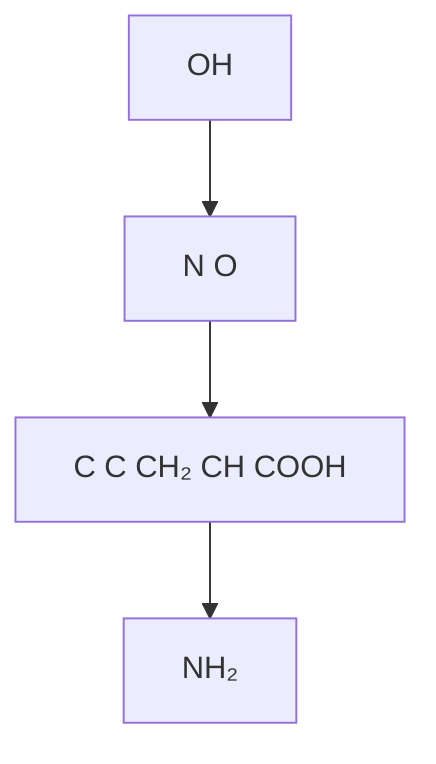
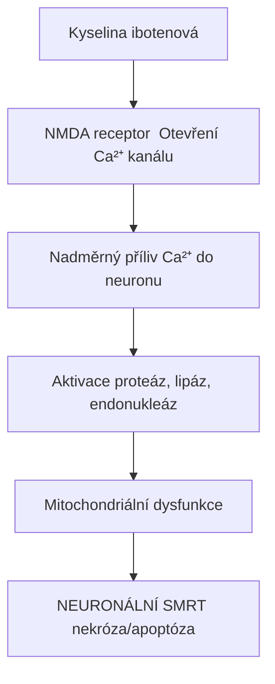
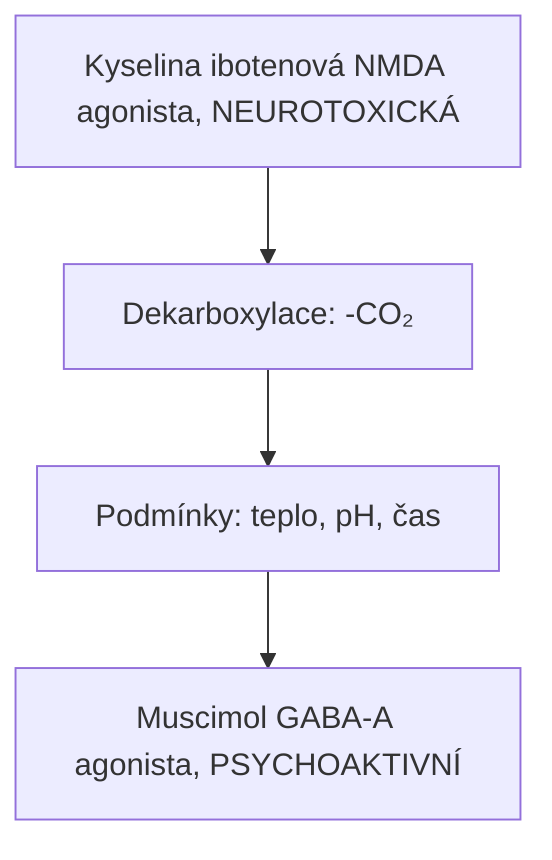

+++
title = "Kyselina ibotenová"
description = "Neurotoxický NMDA agonista z Amanita muscaria - prekurzor muscimolu"
weight = 1
insert_anchor_links = "right"
+++

# Kyselina ibotenová - Neurotoxin


---

## Chemická struktura

### Základní parametry

| Vlastnost | Hodnota |
|-----------|---------|
| **Chemický název** | Kyselina α-amino-3-hydroxy-5-isoxazoloctová |
| **IUPAC** | (S)-2-Amino-2-(3-hydroxy-1,2-oxazol-5-yl)acetic acid |
| **Molekulární vzorec** | C₅H₆N₂O₄ |
| **Molekulární hmotnost** | 158,11 g/mol |
| **CAS číslo** | 2552-55-8 |

### Strukturní klasifikace

| Kategorie | Zařazení |
|-----------|----------|
| **Třída** | Aminokyseliny |
| **Podtřída** | Isoxazolové aminokyseliny |
| **Chirálnost** | L-forma (aktivní) |
| **Strukturní analog** | Glutamát (excitační neurotransmiter) |

### Struktura



<details>
<summary>ASCII verze diagramu</summary>

```
         OH
          |
    N ─── O
    ‖     |
    C ═══ C ── CH₂ ── CH ── COOH
              |       |
              ═       NH₂
```

</details>

Kyselina ibotenová je strukturálně podobná **glutamátu** - hlavnímu excitačnímu neurotransmiteru v mozku. Tato podobnost je základem její neurotoxicity.

---

## Přírodní zdroje

### Houby rodu Amanita

| Druh | Obsah | Poznámka |
|------|-------|----------|
| [**Amanita muscaria**](@/shrooms/amanita-muscaria.md) | 0,03-0,10% | Čerstvá houba |
| **Amanita pantherina** | 0,05-0,15% | Silnější |
| **Amanita cothurnata** | Variabilní | Severní Amerika |
| **Amanita gemmata** | Nízký | Vzácně |

### Obsah v různých částech houby

| Část | Relativní obsah |
|------|-----------------|
| **Klobouk (pokožka)** | Nejvyšší |
| **Klobouk (dužnina)** | Střední |
| **Lupeny** | Střední |
| **Třeň** | Nejnižší |

---

## Farmakologie

### Mechanismus účinku

Kyselina ibotenová je **excitotoxin** působící primárně na glutamátové receptory:

| Receptor | Účinek | Důsledek |
|----------|--------|----------|
| **NMDA** | Agonista | Excitotoxicita |
| **Metabotropní (mGluR)** | Agonista | Modulace Ca²⁺ |
| **AMPA** | Slabý agonista | Depolarizace |
| **Kainátové** | Slabý agonista | Excitace |

### Excitotoxický mechanismus



<details>
<summary>ASCII verze diagramu</summary>

```
Kyselina ibotenová
        ↓
NMDA receptor → Otevření Ca²⁺ kanálu
        ↓
Nadměrný příliv Ca²⁺ do neuronu
        ↓
Aktivace proteáz, lipáz, endonukleáz
        ↓
Mitochondriální dysfunkce
        ↓
NEURONÁLNÍ SMRT (nekróza/apoptóza)
```

</details>

### Srovnání s glutamátem

| Vlastnost | Kyselina ibotenová | Glutamát |
|-----------|-------------------|----------|
| Afinita k NMDA | Vyšší | Nižší |
| Metabolismus | Pomalý | Rychlý (uptake) |
| Neurotoxicita | **VYSOKÁ** | Nízká (fyziologicky) |
| Přirozený výskyt | Houby | Endogenní |

---

## Konverze na muscimol

### Dekarboxylační reakce



<details>
<summary>ASCII verze diagramu</summary>

```
Kyselina ibotenová (NMDA agonista, NEUROTOXICKÁ)
           ↓ [Dekarboxylace: -CO₂]
           ↓ [Podmínky: teplo, pH, čas]
Muscimol (GABA-A agonista, PSYCHOAKTIVNÍ)
```

</details>

### Faktory ovlivňující konverzi

| Faktor | Vliv na konverzi | Optimum |
|--------|------------------|---------|
| **Teplota** | Vyšší = rychlejší | 80-90°C |
| **pH** | Kyselé urychluje | pH 2,5-3,0 |
| **Čas** | Delší = více konverze | 2-4 hodiny |
| **Vlhkost** | Sušení podporuje | Nízká |
| **Světlo** | Minimální vliv | - |

### Efektivita různých metod

| Metoda | Konverze | Čas | Riziko |
|--------|----------|-----|--------|
| **Čerstvé houby** | 0% | - | **VYSOKÉ** |
| Sušení na vzduchu | ~30-50% | Dny | Střední |
| Sušení teplem (80°C) | ~70% | 3-4 h | Nízké |
| Kyselá extrakce | ~85% | 2-3 h | Nízké |
| **Průmyslová konverze** | >95% | - | Minimální |

---

## Toxikologie

### Akutní toxicita

| Parametr | Hodnota |
|----------|---------|
| **LD50 (myš, i.p.)** | 38 mg/kg |
| **LD50 (myš, p.o.)** | 129 mg/kg |
| **LD50 (krysa, i.p.)** | 42 mg/kg |
| **Minimální toxická dávka (člověk)** | ~30-50 mg |

### Příznaky intoxikace

| Fáze | Čas | Příznaky |
|------|-----|----------|
| **Časná** | 30-90 min | Nauzea, zvracení, slinění |
| **Střední** | 1-3 h | Zmatenost, agitace, ataxie |
| **Pozdní** | 3-6 h | Křeče (možné), myoklonus |
| **Zotavení** | 12-24 h | Únava, amnézie |

### Neurologické poškození

Při opakované expozici nebo vysokých dávkách:

| Typ poškození | Oblast | Reverzibilita |
|---------------|--------|---------------|
| **Léziony hipokampu** | Paměť | Ireverzibilní |
| **Poškození mozečku** | Koordinace | Částečně |
| **Kortikální atrofie** | Kognitivní funkce | Ireverzibilní |
| **Excitotoxická nekróza** | Různé | Ireverzibilní |

---

## Využití ve výzkumu

### Neurovědecké aplikace

Kyselina ibotenová se používá v neurovědách pro **selektivní lézování** mozkových struktur:

| Aplikace | Účel |
|----------|------|
| **Lézování hipokampu** | Modely amnézie |
| **Lézování bazálních ganglií** | Modely Parkinsonovy choroby |
| **Lézování nucleus basalis** | Modely Alzheimerovy choroby |
| **Mapování funkcí** | Funkční neuroanatomie |

### Proč kyselina ibotenová?

| Výhoda | Popis |
|--------|-------|
| **Selektivita** | Ničí těla neuronů, šetří axony |
| **Reprodukovatelnost** | Konzistentní lézování |
| **Absence gliové reakce** | Čisté lézování |
| **Lokalizovaný účinek** | Přesné cílení |

### Alternativní excitotoxiny

| Látka | Receptor | Použití |
|-------|----------|---------|
| **Kyselina ibotenová** | NMDA, mGluR | Obecné lézování |
| Kyselina kainová | Kainátové | Epilepsie modely |
| NMDA | NMDA | Specifické lézování |
| Kyselina quisqual | AMPA | Méně časté |

---

## Srovnání: Kyselina ibotenová vs Muscimol

|-----------|-------------------|----------|
| **Mechanismus** | NMDA agonista | GABA-A agonista |
| **Typ účinku** | Excitační | Inhibiční |
| **Neurotoxicita** | **VYSOKÁ** | Nízká |
| **Psychoaktivita** | Minimální (toxické dávky) | Hlavní účinek |
| **Nástup** | Rychlý (30 min) | Pomalejší (1-2 h) |
| **Bezpečnost** | Nebezpečná | Bezpečnější (po konverzi) |
| **Metabolismus** | Dekarboxylace na muscimol | Nezměněný (moč) |

---

## Bezpečnost a prevence

### Rizikové situace

| Situace | Riziko | Prevence |
|---------|--------|----------|
| **Konzumace čerstvých Amanita** | VYSOKÉ | Vždy sušit/připravovat |
| **Nedostatečná příprava** | VYSOKÉ | Dodržet protokol |
| **Neznámá dávka** | VYSOKÉ | Začít nízko |
| **Opakované užívání** | KUMULATIVNÍ | Dlouhé pauzy |

### Příznaky vyžadující lékařskou pomoc

- **Opakované zvracení** (riziko dehydratace)
- **Křeče** (neurotoxicita)
- **Silná zmatenost** (excitotoxicita)
- **Ztráta vědomí** (urgentní)
- **Poruchy dýchání** (urgentní)

### První pomoc

1. **Přerušit expozici**
2. **Volat 155** (záchranná služba)
3. Monitorovat životní funkce
4. Laterální poloha (riziko aspirace)
5. **NEVYVOLÁVAT zvracení** (riziko křečí)
6. Identifikovat zdroj houby

---

## Právní status

| Jurisdikce | Status |
|------------|--------|
| **ČR** | Nekontrolovaná |
| **USA** | Nekontrolovaná |
| **UK** | Nekontrolovaná |
| **Austrálie** | Schedule 9 (muscimol, ne kyselina ibotenová) |

**Poznámka**: Kyselina ibotenová není samostatně regulována, ale je přítomna v houbách, které mohou být v některých jurisdikcích kontrolovány.

---

## Reference

1. Olney, J.W. et al. (1971). *Brain lesions, obesity, and other disturbances in mice treated with monosodium glutamate*. Science.
2. Schwarcz, R. et al. (1979). *Ibotenic acid-induced neuronal degeneration: a morphological and neurochemical study*. Experimental Brain Research.
3. Michelot, D. & Melendez-Howell, L. (2003). *Amanita muscaria: chemistry, biology, toxicology, and ethnomycology*. Mycological Research.
4. Coyle, J.T. & Schwarcz, R. (2000). *Lesion of striatal neurons with kainic acid provides a model for Huntington's chorea*. Nature.

---

Viz také:
- [Amanita muscaria](@/shrooms/amanita-muscaria.md) - Přírodní zdroj
- [Neurotoxiny](@/neurotoxins/_index.md) - Přehled neurotoxinů
- [GABA](@/glossary/gaba.md) - Inhibiční neurotransmiter

