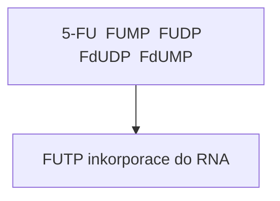

+++
title = "TMP"
description = "Thimidinmonofosfat - klicovy nukleotid pro syntézu DNA a cíl protinadorove terapie"
keywords = ["TMP", "dTMP", "thymidylatsyntetaza", "folat", "methotrexat", "5-fluorouracil", "DNA synteza"]
category = "nukleotidy"
+++

## Thimidinmonofosfát (TMP) - Úvod

Thimidinmonofosfát (TMP), presneji deoxythimidinmonofosfát (dTMP), je pyrimidinový
nukleotid, který predstavuje jeden z nejdulezitejsích metabolických uzlu v bunecné
biochemii. Na rozdíl od ostatních nukleotidu je thymidin výhradne soucástí DNA
(nikoliv RNA), což ciní jeho biosyntézu jedinecným a strategicky dulezitým cílem
pro farmakologické intervence.

TMP se skládá ze trí základních komponent:
- **Thymin** - pyrimidinová báze (5-methyluracil)
- **Deoxyribóza** - pentiuhlíkatý cukr bez hydroxylové skupiny na pozici 2'
- **Fosfátová skupina** - esterifikovaná na 5' pozici deoxyribózy

---

## Chemická struktura a nomenklatura

### Strukturní vzorec

```
        O
        ||
    HN--C--CH3
    |      |
    C      CH
    ||     ||
    O--N---CH
       |
       |
    [Deoxyribóza-5'-fosfát]
```

### Nomenklatura a zkratky

| Zkratka | Plný název | Kontext |
|---------|------------|---------|
| TMP | Thymidinmonofosfát | Obecné oznacení |
| dTMP | Deoxythimidinmonofosfát | Presný biochemický název |
| TDP | Thymidindifosfát | Fosforylovaný intermediát |
| dTDP | Deoxythimidindifosfát | Presný název |
| TTP | Thymidintrifosfát | Substrat pro DNA polymerázu |
| dTTP | Deoxythymidintrifosfát | Presný název |

**Dulezitá poznámka**: V biochemické literature se casto používá TMP jako synonymum
pro dTMP, protoze thymidin se vyskytuje prakticky výhradne v deoxyribonukleotidech.
Ribothymidin (rT) je extrémne vzácný a vyskytuje se pouze v nekterých tRNA.

### Molekulární vlastnosti

- **Molekulová hmotnost**: 322.21 g/mol
- **Sumární vzorec**: C10H15N2O8P
- **pKa hodnoty**: ~1.0 (fosfát), ~9.8 (N3-H)
- **Rozpustnost**: Dobre rozpustný ve vode

---

## Biosyntéza dTMP

### De novo syntéza

Biosyntéza dTMP predstavuje jedinecný proces v metabolismu nukleotidu, protoze
vyžaduje methylaci uracilu. Klícovým enzymem je **thymidylátsyntetáza** (TS),
která katalyzuje prenos methylové skupiny z N5,N10-methylentetrahydrofolátu
(CH2-THF) na dUMP za vzniku dTMP.

#### Reakce thymidylátsyntetázy

```
dUMP + CH2-THF → dTMP + DHF

kde:
- dUMP = deoxyuridinmonofosfát
- CH2-THF = N5,N10-methylentetrahydrofolát
- DHF = dihydrofolát
```

### Mechanismus reakce

1. **Nukleofilní atak**: Cysteinový zbytek enzymu atakuje C6 pozici uracilu
2. **Adicní reakce**: CH2-THF se váže na C5 pozici
3. **Redukce a eliminace**: Prenos hydridového iontu z THF, vznik methylové skupiny
4. **Uvolnení produktu**: dTMP a DHF se uvolní z aktivního místa

Tento mechanismus je unikátní tím, že THF slouží jako donor jednouhíkové
jednotky i jako redukcní cinidlo soucasne.

### Regenerace tetrahydrofolátu

DHF vznikající pri syntéze dTMP musí být regenerován zpet na THF, aby mohl
pokracovat folátový cyklus:

```
DHF + NADPH + H+ → THF + NADP+

Enzym: Dihydrofolátreduktáza (DHFR)
```

THF je poté konvertován na CH2-THF:

```
THF + serin → CH2-THF + glycin

Enzym: Serinhydroxymethyltransferáza (SHMT)
```

### Salvage pathway (záchranná cesta)

Bunky mohou také recyklovat thymidin z degradace DNA:

```
Thymidin + ATP → dTMP + ADP

Enzym: Thymidinkináza (TK)
```

Thymidinkináza má dva izoformy:
- **TK1** - cytosolová, exprimovaná v S-fázi bunecného cyklu
- **TK2** - mitochondriální, konstitutivne exprimovaná

---

## Folátový metabolismus a dTMP

### Folátový cyklus

Folátový metabolismus je úzce propojen se syntézou dTMP. Folát (vitamin B9)
je esenciální koenzym, který prenáší jednouhíkové jednotky v ruzných
oxidacních stavech.

```
                    NADPH
                      |
                      v
Folát → DHF → THF → CH2-THF → CH3-THF
         ^            |
         |            v
        DHFR        dTMP syntéza
```

### Formy folátu

| Forma | Oxidacní stav C1 | Funkce |
|-------|------------------|--------|
| THF | - | Akceptor C1 jednotek |
| CH2-THF | Methylen (-CH2-) | Donor pro dTMP syntézu |
| CH3-THF | Methyl (-CH3) | Remetylace homocysteinu |
| CHO-THF | Formyl (-CHO) | Purinová syntéza |
| CH=THF | Methenyl (=CH-) | Intermediát |

### Propojení s metabolismem aminokyselin

Syntéza dTMP je metabolicky propojena s:

1. **Serinem/Glycinem**: Serin poskytuje jednouhíkovou jednotku
2. **Methioninem**: Cyklus methioninu regeneruje THF
3. **Homocysteinem**: CH3-THF remetyluje homocystein na methionin

---

## Regulace syntézy dTMP

### Transkripční regulace

Gen pro thymidylátsyntetázu (TYMS) je regulován:
- **E2F transkripční faktory** - aktivace v S-fázi
- **p53** - represe pri poškození DNA
- **Promotorový polymorfismus** - variabilní pocet tandemových repetic

### Post-translacní regulace

- **Autoregulace mRNA**: TS váže vlastní mRNA a inhibuje translaci
- **Fosforylace**: Moduluje aktivitu a stabilitu
- **Ubikvitinace**: Kontroluje proteinový obrat

### Alosterická regulace

dTTP inhibuje ribonukleotidreduktázu, která produkuje dUDP/dUMP,
címž neprímo reguluje dostupnost substrátu pro TS.

---

## dTMP v syntéze DNA

### Fosforylace na dTTP

```
dTMP → dTDP → dTTP

Enzymy:
1. Thymidylátkinasa: dTMP + ATP → dTDP + ADP
2. Nukleosiddifosfátkinasa: dTDP + ATP → dTTP + ADP
```

### Inkorporace do DNA

dTTP je substrátem pro DNA polymerázy. Páruje se s adeninem
prostrednictvím dvou vodíkových vazeb:

```
    Thymin                     Adenin
      O···H-N                    N
      ||    |                    ||
   H3C-C    N-H···N              C-H
      |     ||     |            /
      N-H···N      C-N
      |            ||
      C            N
```

### Kontrola kvality

DNA polymerázy mají 3'→5' exonukleázovou aktivitu, která odstraňuje
chybne zabudované nukleotidy. Nesprávne párování thyminu (napr. T-G)
je efektivne opravováno.

---

## Antifolátová léčiva

### Methotrexát (MTX)

**Mechanismus**: Kompetitivní inhibitor dihydrofolátreduktázy (DHFR)

```
Methotrexát + DHFR ⟷ [MTX-DHFR] (Ki ~ 5 pM)

Dusledek: Deplece THF → snížení CH2-THF → inhibice syntézy dTMP
```

**Klinické použití**:
- Akutní lymfoblastická leukémie
- Revmatoidní artritida
- Psoriáza
- Ektopické tehotenství

**Toxicita**:
- Myelosuprese
- Mukozitida
- Hepatotoxicita
- Nefrotoxicita (pri vysokých dávkách)

**Rescue terapie**: Leukovorin (folinová kyselina) - bypassuje blokádu DHFR

### 5-Fluorouracil (5-FU)

**Mechanismus**: Ireverzibilní inhibitor thymidylátsyntetázy

```
5-FU → FdUMP (aktivní metabolit)

FdUMP + CH2-THF + TS → Kovalentní ternární komplex

Dusledek: Permanentní inaktivace TS
```

**Aktivace 5-FU**:


<details>
<summary>ASCII verze diagramu</summary>

```
5-FU → FUMP → FUDP → FdUDP → FdUMP
              ↓
            FUTP → inkorporace do RNA
```

</details>

**Klinické použití**:
- Kolorektální karcinom
- Karcinom prsu
- Karcinom hlavy a krku
- Karcinom žaludku

**Modulace úcinnosti**:
- **Leukovorin**: Zvyšuje stabilitu ternárního komplexu
- **Methotrexát**: Synergický úcinek (pretreatment)

### Pemetrexed

**Mechanismus**: Multitarget antifolát

Inhibuje:
1. Thymidylátsyntetázu (TS)
2. Dihydrofolátreduktázu (DHFR)
3. Glycinamid ribonukleotid formyltransferázu (GARFT)

**Klinické použití**:
- Maligní mezoteliom
- Nemalobuneční karcinom plic

### Raltitrexed

**Mechanismus**: Specifický inhibitor TS

**Klinické použití**: Pokrocilý kolorektální karcinom

---

## Rezistence na antifolátová léčiva

### Mechanismy rezistence

1. **Amplifikace cílového genu**
   - Zvýšená exprese DHFR nebo TS
   - Genová amplifikace (double minutes, HSR)

2. **Mutace v cílovém enzymu**
   - Snížená afinita pro inhibitor
   - Zachovaná katalytická aktivita

3. **Snížený príjem léčiva**
   - Mutace v RFC (reduced folate carrier)
   - Snížená polyglutamylace

4. **Zvýšený eflux**
   - Overexprese ABC transportéru
   - MRP (multidrug resistance protein)

5. **Alterace metabolických cest**
   - Zvýšená aktivita salvage pathway
   - Bypass mechanismy

---

## Klinický význam dTMP

### Biomarkery

**Thymidinkináza 1 (TK1)**:
- Sérová hladina koreluje s proliferací nádoru
- Prognostický marker u hematologických malignit
- Monitoring odpovedi na léčbu

**Expresia TS**:
- Prediktivní marker odpovedi na 5-FU
- Vysoká exprese → rezistence
- Genetický polymorfismus TYMS

### Terapeutické cíle

| Cíl | Léčivo | Indikace |
|-----|--------|----------|
| DHFR | Methotrexát | ALL, RA, psoriáza |
| TS | 5-FU, Raltitrexed | Solidní nádory |
| Multitarget | Pemetrexed | Mezoteliom, NSCLC |
| TK | Trifluridin | Kolorektální karcinom |

---

## Experimentální prístupy

### CRISPR/Cas9 studie

Knockout genu TYMS je letální, což potvrzuje esencialitu dTMP syntézy.
Heterozygotní delece zvyšuje senzitivitu na antifoláty.

### Strukturální biologie

Krystalové struktury TS s ruznými inhibitory umožnují:
- Racionální design nových léčiv
- Pochopení mechanismu rezistence
- Predikci úcinnosti

### Metabolomické prístupy

LC-MS/MS kvantifikace nukleotidových poolů:
- Detekce dysbalance dNTP
- Monitoring úcinnosti léčby
- Identifikace rezistenčních mechanismu

---

## Fyziologické funkce TMP

### Prekurzor pro TDP a TTP

TMP je klícovým meziproduktem v syntéze deoxythimidinových nukleotidu.
Pri metabolismu se TMP nejprve fosforyluje na deoxythimidindifosfát (TDP)
a následne na TTP, který je základním stavebním blokem pro syntézu DNA.

### Syntéza DNA

TMP se podílí na biosyntéze DNA jako stavební blok pro inkorporaci
do nove syntetizovaných DNA retezcu. Behem replikace DNA se TMP
(ve forme dTTP) páruje s adeninovými bázemi, což zajištuje stabilní
strukturu DNA.

### Metabolismus nukleotidu

TMP je dulezitý pro udržení rovnováhy mezi ruznými typy nukleotidu
v bunkách. Tímto zpusobem TMP prispívá k regulaci bunecných procesu,
které jsou závislé na syntéze DNA.

---

## Vznik a degradace

### Biosyntéza

Hlavní cesta vzniku dTMP je de novo syntéza katalyzovaná thymidylátsyntetázou:

```
dUMP + CH2-THF → dTMP + DHF
```

Alternativne muže být dTMP syntetizován salvage pathway z thymidinu.

### Katabolismus

Po splnení svých funkcí muže být TMP degradován:

```
dTMP → Thymidin → Thymin → Dihydrothymin →
β-ureidoisobutyrát → β-aminoisobutyrát + CO2 + NH3
```

Koncový produkt β-aminoisobutyrát je vylucován mocí a slouží
jako marker obratu DNA (zvýšen pri chemoterapii).

---

## Patologie spojené s dTMP metabolismem

### Mitochondriální deplecní syndrom

Mutace v genech pro:
- **TK2** - myopatická forma
- **DGUOK** - hepatocerebrální forma
- **TYMP** (thymidinfosforylasa) - MNGIE syndrom

### Nádorová onemocnení

Dysregulace syntézy dTMP je charakteristická pro nádorové bunky:
- Zvýšená aktivita TS
- Overexprese TK1
- Alterace folátového metabolismu

### Megaloblastová anémie

Deficit folátu nebo vitaminu B12 vede k:
- Snížené syntéze dTMP
- Neefektivní erytropoéze
- Hypersegmentovaným neutrofilum

---

## Shrnutí

Deoxythimidinmonofosfát (dTMP) predstavuje kritický metabolický uzel,
kde se protínají folátový metabolismus, syntéza DNA a protinádorová terapie.
Jeho biosyntéza thymidylátsyntetázou vyžaduje tetrahydrofolát jako kofaktor,
což ciní tuto cestu zranitelnou vuci antifolátovým léčivum.

Pochopení biochemie dTMP má zásadní klinický význam pro:
- Vývoj nových protinádorových léčiv
- Prekonání rezistence na chemoterapii
- Diagnostiku a monitoring nádorových onemocnení
- Pochopení vzácných metabolických poruch

Pokracující výzkum v této oblasti prináší nové terapeutické strategie
a diagnostické nástroje pro klinickou praxi.

---

## Reference

1. Carreras CW, Santi DV. The catalytic mechanism and structure of thymidylate synthase. Annu Rev Biochem. 1995;64:721-62.
2. Heidelberger C, et al. Fluorinated pyrimidines, a new class of tumour-inhibitory compounds. Nature. 1957;179:663-6.
3. Longley DB, et al. 5-fluorouracil: mechanisms of action and clinical strategies. Nat Rev Cancer. 2003;3:330-8.
4. Matherly LH, et al. Human reduced folate carrier: translation of basic biology to cancer etiology and therapy. Cancer Metastasis Rev. 2007;26:111-28.
5. Wilson PM, et al. Standing the test of time: targeting thymidylate biosynthesis in cancer therapy. Nat Rev Clin Oncol. 2014;11:282-98.
