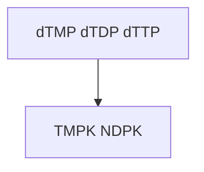
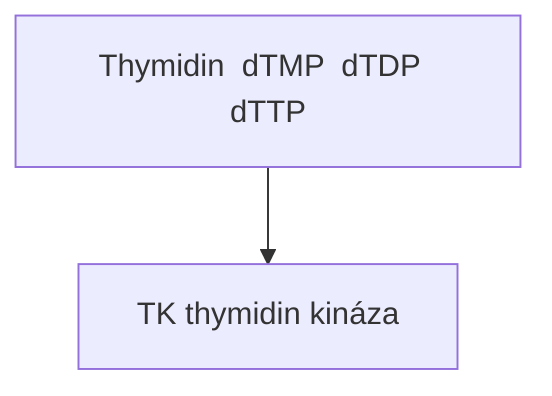
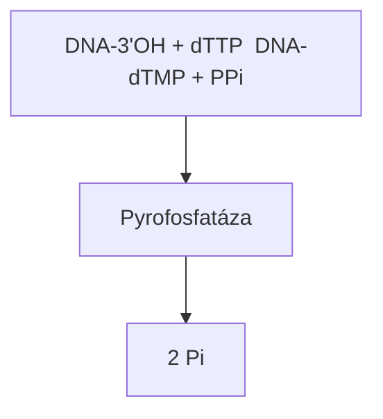
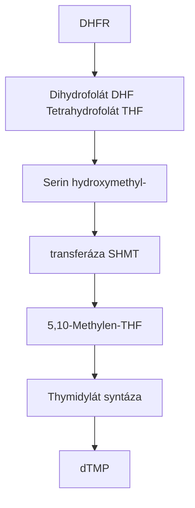
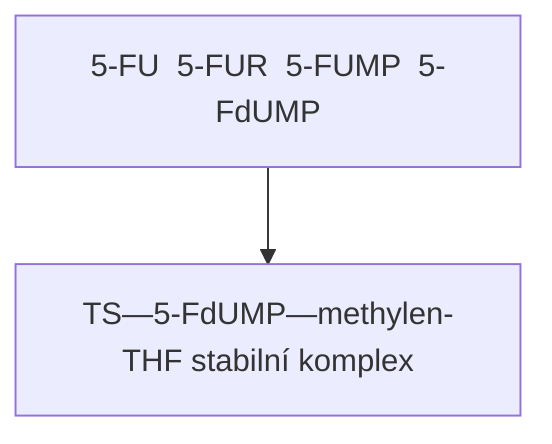

+++
title = "TTP / dTTP - Thymidin trifosfát"
description = "Kompletní přehled thymidintrifosfátu - klíčového nukleotidu pro syntézu DNA, jeho biosyntézy, regulace a významu v medicíně"
keywords = ["dTTP", "thymidin trifosfát", "DNA syntéza", "nukleotidy", "thymidylát syntáza", "antifoláty", "chemoterapie"]
category = "nukleotidy"
date = "2024-01-15"
+++

# Thymidin trifosfát (dTTP)

## Úvod a terminologické rozlišení

Thymidin trifosfát existuje ve dvou formách, které je nutné důsledně rozlišovat:

**dTTP (deoxythymidin trifosfát)** je nukleotid obsahující deoxyribózu,
který slouží jako jeden ze čtyř základních stavebních kamenů pro syntézu DNA.
Tato forma je předmětem tohoto dokumentu a má klíčový význam v molekulární
biologii a medicíně.

**TTP (thymidin trifosfát)** s ribózou teoreticky existuje, ale v přírodě
se prakticky nevyskytuje. Thymin je téměř výhradně součástí DNA, nikoliv RNA.
V RNA je místo thyminu přítomen uracil (jako UTP).

**Poznámka k terminologii:** V biochemické literatuře se často používá
zkratka "TTP" jako synonymum pro "dTTP", protože thymin je přítomen
prakticky pouze v DNA. Tato konvence však může být matoucí a doporučuje
se používat explicitní označení "dTTP" pro jednoznačnost.

---

## Chemická struktura a vlastnosti

### Molekulární složení

dTTP (deoxythymidin-5'-trifosfát) se skládá ze tří komponent:

1. **Thymin (5-methyluracil)** - pyrimidinová báze
   - Sumární vzorec báze: C5H6N2O2
   - Methylová skupina na pozici C5 odlišuje thymin od uracilu
   - Tvoří vodíkové vazby s adeninem (A=T párování)

2. **2'-Deoxyribóza** - pětiuhlíkatý cukr
   - Chybí hydroxylová skupina na pozici 2'
   - Tato modifikace je klíčová pro stabilitu DNA
   - Poskytuje strukturní páteř molekuly

3. **Trifosfátová skupina** - tři fosfátové zbytky
   - Alfa (α), beta (β) a gama (γ) fosfát
   - Vysokoenergetické vazby mezi fosfáty
   - Uvolnění pyrofosfátu (PPi) pohání inkorporaci do DNA

### Fyzikálně-chemické parametry

| Parametr | Hodnota |
|----------|---------|
| Molekulová hmotnost | 482,17 g/mol |
| Sumární vzorec | C10H17N2O14P3 |
| pKa (primární fosfát) | ~1,0 |
| pKa (sekundární fosfát) | ~6,5 |
| Absorpční maximum (UV) | 267 nm |
| Rozpustnost ve vodě | vysoká |

### Strukturní vzorec

```
           O
           ‖
     H₃C—C     NH
          \   /
           C=C
          /   \
    HN—C       C—H
        ‖     |
        O     |
              |
         O    |  O    O    O
         ‖    |  ‖    ‖    ‖
    HO—P—O—P—O—P—O—CH₂
         |    |    |      \
        O⁻   O⁻   O⁻      O
                          |  \
                         H    H
                          \  /
                           C
                          / \
                         H   OH (chybí u deoxyribózy)
```

---

## Biosyntéza dTTP

### De novo syntéza

Biosyntéza dTTP probíhá komplexním metabolickým dráhou zahrnující
několik klíčových enzymů a meziproduktů:

#### Fáze 1: Syntéza dUMP

1. **Výchozí substrát**: UDP (uridin difosfát)
2. **Redukce**: Ribonukleotid reduktáza (RNR) konvertuje UDP na dUDP
3. **Defosforylace**: dUDP → dUMP (deoxuridin monofosfát)

Alternativní cesta:
- dCTP → dCMP → dUMP (přes dCMP deaminázu)

#### Fáze 2: Thymidylát syntáza - klíčový krok

**Thymidylát syntáza (TS, EC 2.1.1.45)** katalyzuje kritickou reakci:

```
dUMP + 5,10-methylentetrahydrofolát → dTMP + dihydrofolát
```

Tato reakce zahrnuje:
- Přenos methylové skupiny na pozici C5 uracilu
- Redukci methylenové skupiny na methylovou
- Oxidaci tetrahydrofolátu na dihydrofolát

**Mechanismus reakce:**

1. Kovalentní vazba dUMP na aktivní místo enzymu (Cys residuum)
2. Nukleofilní atak methylentetrahydrofolátu
3. Přenos hydridu z folátu na methylenou skupinu
4. Uvolnění produktů dTMP a dihydrofolát

#### Fáze 3: Fosforylace na dTTP



<details>
<summary>ASCII verze diagramu</summary>

```
dTMP → dTDP → dTTP
       ↑        ↑
      TMPK    NDPK
```

</details>

- **Thymidylát kináza (TMPK)**: dTMP + ATP → dTDP + ADP
- **Nukleosid difosfát kináza (NDPK)**: dTDP + ATP → dTTP + ADP

### Záchranná (salvage) dráha

Buňky mohou také recyklovat thymidin z degradovaných nukleových kyselin:



<details>
<summary>ASCII verze diagramu</summary>

```
Thymidin → dTMP → dTDP → dTTP
           ↑
          TK (thymidin kináza)
```

</details>

**Thymidin kináza (TK)** existuje ve dvou izoformách:
- **TK1**: Cytosolická, exprese závislá na buněčném cyklu (S fáze)
- **TK2**: Mitochondriální, konstitutivní exprese

---

## Regulace biosyntézy dTTP

### Alosterická regulace

#### Ribonukleotid reduktáza (RNR)

RNR je hlavním regulačním bodem syntézy všech dNTP:

| Efektor | Vazebné místo | Účinek na dTTP syntézu |
|---------|---------------|------------------------|
| ATP | Aktivní místo | Stimulace |
| dATP | Aktivní místo | Inhibice |
| dTTP | Specifické místo | Negativní zpětná vazba |
| dGTP | Specifické místo | Přepnutí substrátu |

#### Thymidylát syntáza

- Produkt dTMP neinhibuje přímo
- Regulace hlavně na úrovni transkripce a degradace mRNA
- Vazba TS na vlastní mRNA (autoregulace)

### Buněčný cyklus a regulace

Syntéza dTTP je přísně koordinována s replikací DNA:

**G1 fáze:**
- Nízká aktivita TK1 a TS
- Minimální hladiny dTTP

**S fáze:**
- Dramatický nárůst TK1 (10-20x)
- Vysoká aktivita TS
- Maximální produkce dTTP

**G2/M fáze:**
- Degradace TK1 (ubikvitin-proteazomová dráha)
- Pokles hladin dTTP

### Intracelulární koncentrace

| Typ buňky | Koncentrace dTTP |
|-----------|------------------|
| Proliferující buňky | 20-40 μM |
| Klidové buňky | 1-5 μM |
| Nádorové buňky | 30-100 μM |

---

## Role dTTP v syntéze DNA

### DNA polymerázy a inkorporace dTTP

dTTP je substrátem pro všechny DNA polymerázy:

**Replikativní polymerázy:**
- DNA polymeráza α (iniciace)
- DNA polymeráza δ (lagging strand)
- DNA polymeráza ε (leading strand)

**Opravné polymerázy:**
- DNA polymeráza β (BER - base excision repair)
- DNA polymeráza η, κ, ι (translesion synthesis)

### Mechanismus inkorporace



<details>
<summary>ASCII verze diagramu</summary>

```
DNA-3'OH + dTTP → DNA-dTMP + PPi
                        ↓
                   Pyrofosfatáza
                        ↓
                      2 Pi
```

</details>

Hydrolýza pyrofosfátu (PPi) na anorganický fosfát (Pi) činí
reakci prakticky nevratnou (ΔG << 0).

### Párování s adeninem

Thymin tvoří s adeninem **dva vodíkové můstky**:

```
      Thymin                 Adenin
         O···H—N
        /         \
   H₃C—C           N
        \\        //
         N—H···N
        /         \
   Deoxyribóza    Deoxyribóza
```

Toto A=T párování je o ~2,5 kJ/mol slabší než G≡C párování
(tři vodíkové vazby), což má důsledky pro:
- Stabilitu dvoušroubovice
- Teplotu tání DNA (Tm)
- Denaturační vlastnosti sekvencí bohatých na A/T

---

## Thymidylát syntázová dráha a folátový cyklus

### Propojení s folátovým metabolismem

Syntéza dTTP je úzce propojena s metabolismem folátů:



<details>
<summary>ASCII verze diagramu</summary>

```
                    DHFR
Dihydrofolát (DHF) ────→ Tetrahydrofolát (THF)
       ↑                         ↓
       |                    Serin hydroxymethyl-
       |                    transferáza (SHMT)
       |                         ↓
       |                5,10-Methylen-THF
       |                         ↓
       └─────────── Thymidylát syntáza
                         ↓
                       dTMP
```

</details>

### Klíčové enzymy folátového cyklu

**1. Dihydrofolát reduktáza (DHFR)**
- EC 1.5.1.3
- Regeneruje THF z DHF
- Esenciální pro udržení folátového poolu
- Hlavní cíl antifolátů (methotrexát)

**2. Serin hydroxymethyltransferáza (SHMT)**
- EC 2.1.2.1
- Konvertuje serin + THF → glycin + 5,10-methylen-THF
- Poskytuje jednouhlíkové jednotky pro syntézu

**3. Methylentetrahydrofolát reduktáza (MTHFR)**
- EC 1.5.1.20
- 5,10-methylen-THF → 5-methyl-THF
- Polymorfismy (C677T, A1298C) ovlivňují aktivitu

---

## Farmakologické cíle a inhibitory

### Inhibitory thymidylát syntázy

**5-Fluorouracil (5-FU)**
- Konvertován na 5-FdUMP
- Kovalentní inhibitor TS
- Tvoří stabilní ternární komplex s TS a folátovým kofaktorem
- Širokospektrý chemoterapeutický účinek

**Mechanismus 5-FU:**


<details>
<summary>ASCII verze diagramu</summary>

```
5-FU → 5-FUR → 5-FUMP → 5-FdUMP
                              ↓
              TS—5-FdUMP—methylen-THF (stabilní komplex)
```

</details>

**Raltitrexed (Tomudex)**
- Přímý inhibitor TS
- Analog folátu
- Selektivnější než 5-FU

**Pemetrexed (Alimta)**
- Multitargetový antifolát
- Inhibuje TS, DHFR a GARFT
- Používán u mezoteliomu a NSCLC

### Inhibitory dihydrofolát reduktázy

**Methotrexát (MTX)**
- Klasický antifolát
- Ki = 5 pM (extrémně silná vazba)
- Polyglutamylace zvyšuje retenci v buňce
- Používán u leukémií, lymfomů, revmatoidní artritidy

**Trimetrexát**
- Lipofililnější analog MTX
- Nepotřebuje folátový transportér

**Pralatrexát (Folotyn)**
- Novější antifolát
- Schválen pro periferní T-buněčný lymfom

### Nukleosidové analogy

**Zidovudin (AZT)**
- 3'-azido-3'-deoxythymidin
- Fosforylován na AZT-TP
- Terminuje syntézu virové DNA (HIV)
- Chain terminator - chybí 3'-OH

**Stavudin (d4T)**
- 2',3'-didehydro-3'-deoxythymidin
- Podobný mechanismus jako AZT
- Používán v kombinační terapii HIV

---

## Klinický význam

### Onkologie a chemoterapie

Inhibice syntézy dTTP je základem mnoha chemoterapeutických režimů:

**Kolorektální karcinom:**
- 5-FU + leukovorin (zvyšuje účinek 5-FU)
- FOLFOX: 5-FU + leukovorin + oxaliplatina
- FOLFIRI: 5-FU + leukovorin + irinotekan

**Karcinom prsu:**
- Kapecitabin (perorální proléčivo 5-FU)
- CMF režim (cyklofosfamid, methotrexát, 5-FU)

**Hematologické malignity:**
- Vysokodávkovaný methotrexát
- Cytarabin kombinace

### Mechanismy rezistence

Nádorové buňky mohou vyvinout rezistenci vůči inhibitorům dTTP syntézy:

| Mechanismus | Příklad | Klinický dopad |
|-------------|---------|----------------|
| Amplifikace TS genu | ↑ exprese TS | Rezistence na 5-FU |
| Mutace TS | Změna vazebného místa | Snížená afinita inhibitoru |
| ↑ DHFR exprese | Amplifikace genu | Rezistence na MTX |
| ↓ Folátový transport | Mutace RFC | Snížený uptake antifolátů |
| ↑ Thymidinkináza | Salvage pathway | Bypass de novo syntézy |

### Prediktivní biomarkery

**Exprese TS:**
- Nízká exprese → lepší odpověď na 5-FU
- Vysoká exprese → horší prognóza

**TYMS polymorfismy:**
- 2R/2R, 2R/3R, 3R/3R varianty
- Ovlivňují expresi TS a odpověď na terapii

**DPD (dihydropyrimidin dehydrogenáza):**
- Metabolizuje 5-FU
- Deficit → těžká toxicita

---

## Experimentální a výzkumné aplikace

### Značení DNA

dTTP analogy se používají pro sledování replikace DNA:

**BrdU (bromodeoxyuridin):**
- Inkorporuje se místo thymidinu
- Detekce protilátkami (anti-BrdU)
- Standardní metoda pro analýzu S-fáze

**EdU (5-ethynyl-2'-deoxyuridin):**
- Click chemie detekce
- Rychlejší a citlivější než BrdU
- Nevyžaduje denaturaci DNA

**³H-thymidin:**
- Radioaktivní značení
- Autoradiografie
- Kvantifikace proliferace

### Strukturní studie

Radioaktivně nebo fluorescenčně značený dTTP se používá pro:
- Krystalografii DNA polymeráz
- Kinetické studie inkorporace
- Single-molecule experimenty

---

## Evoluční aspekty

### Proč thymin místo uracilu v DNA?

Evoluce preferovala thymin v DNA z několika důvodů:

1. **Rozpoznání poškození:**
   - Spontánní deaminace cytosinu → uracil
   - Pokud by DNA obsahovala uracil, nelze rozlišit od poškození
   - Methylová skupina thyminu = "značka" správné báze

2. **Stabilita:**
   - DNA je dlouhodobé úložiště informace
   - Thymin poskytuje dodatečnou stabilitu

3. **Opravné mechanismy:**
   - Uracil-DNA glykosyláza odstraňuje uracil z DNA
   - Tento systém by nefungoval, kdyby DNA obsahovala uracil normálně

### Výjimky v přírodě

Některé bakteriofágy obsahují modifikované báze:
- Fág T4: hydroxymethylcytosin místo cytosinu
- Fág PBS1: uracil místo thyminu

---

## Souhrn a závěr

Deoxythymidin trifosfát (dTTP) představuje jeden ze čtyř fundamentálních
stavebních bloků DNA. Jeho biosyntéza přes thymidylát syntázovou dráhu
je kritickým metabolickým uzlem, který je intenzivně využíván v protinádorové
terapii.

Klíčové body:

1. **Struktura:** dTTP = thymin + deoxyribóza + trifosfát

2. **Syntéza:** De novo dráha přes thymidylát syntázu vyžaduje
   folátové kofaktory; alternativou je salvage dráha

3. **Regulace:** Přísná kontrola v buněčném cyklu, alosterická
   regulace RNR, zpětnovazebná inhibice

4. **Klinický význam:** Cíl antifolátů (5-FU, MTX, pemetrexed)
   v onkologii; nukleosidové analogy (AZT) v antivirové terapii

5. **Rezistence:** Amplifikace genů, mutace cílových enzymů,
   aktivace salvage pathway

Pochopení metabolismu dTTP je zásadní pro:
- Racionální design nových chemoterapeutik
- Predikci odpovědi na léčbu
- Překonání lékové rezistence
- Vývoj personalizované medicíny v onkologii

---

## Reference a doporučená literatura

1. Carreras CW, Santi DV. The catalytic mechanism and structure of
   thymidylate synthase. Annu Rev Biochem. 1995;64:721-762.

2. Mathews CK. DNA precursor metabolism and genomic stability.
   FASEB J. 2006;20(9):1300-1314.

3. Longley DB, Harkin DP, Johnston PG. 5-Fluorouracil: mechanisms
   of action and clinical strategies. Nat Rev Cancer. 2003;3(5):330-338.

4. Wilson PM, Danenberg PV, Johnston PG, et al. Standing the test of
   time: targeting thymidylate biosynthesis in cancer therapy.
   Nat Rev Clin Oncol. 2014;11(5):282-298.

5. Reichard P. Interactions between deoxyribonucleotide and DNA
   synthesis. Annu Rev Biochem. 1988;57:349-374.

---

*Dokument vytvořen pro vzdělávací účely v oblasti biochemie a molekulární biologie.*
*Poslední aktualizace: 2024*
