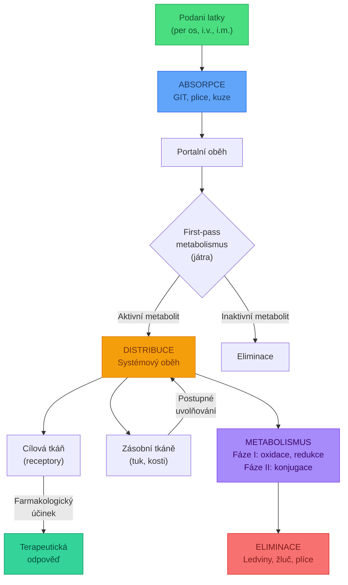
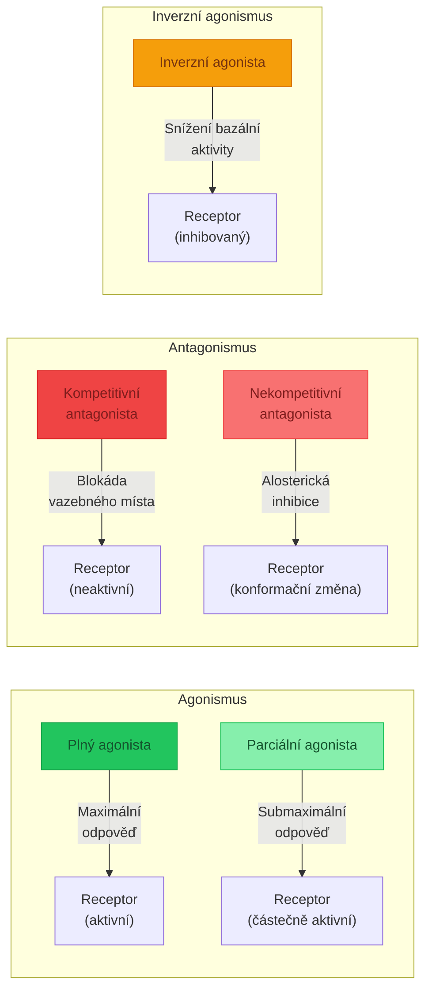
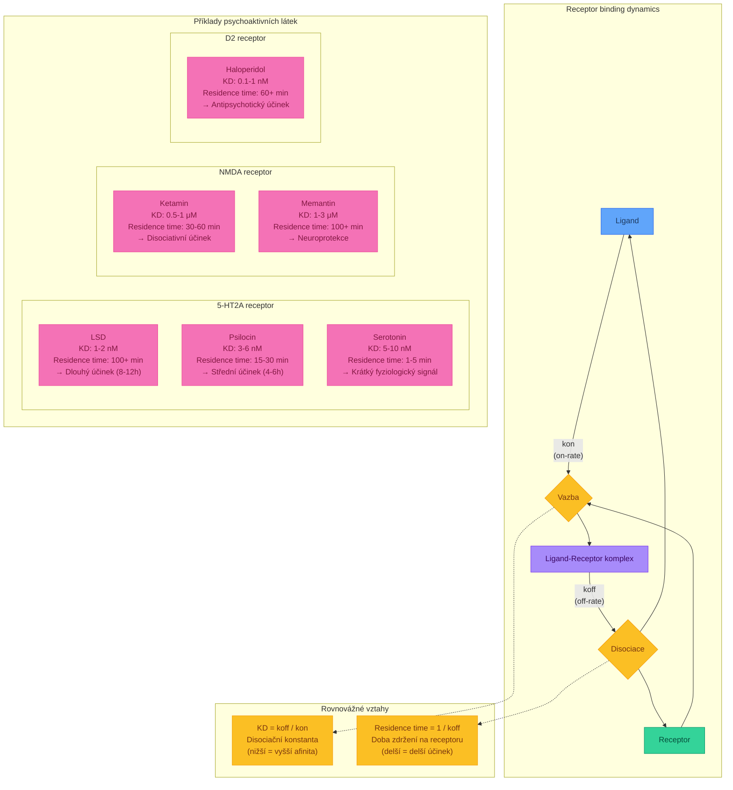
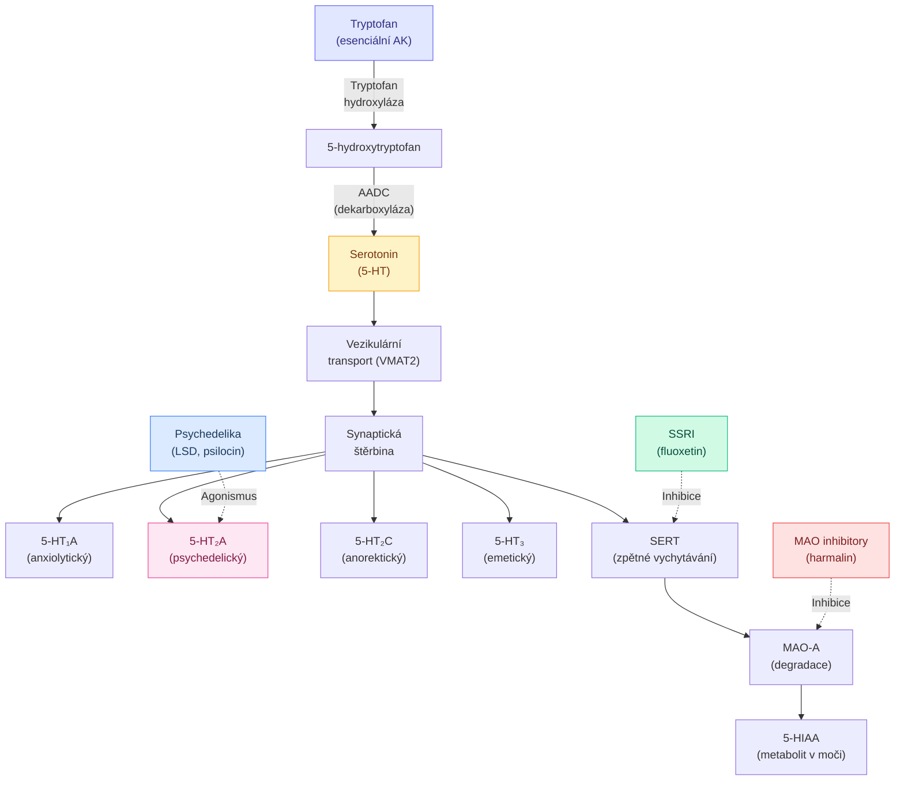
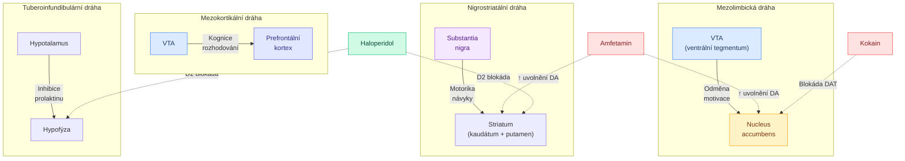
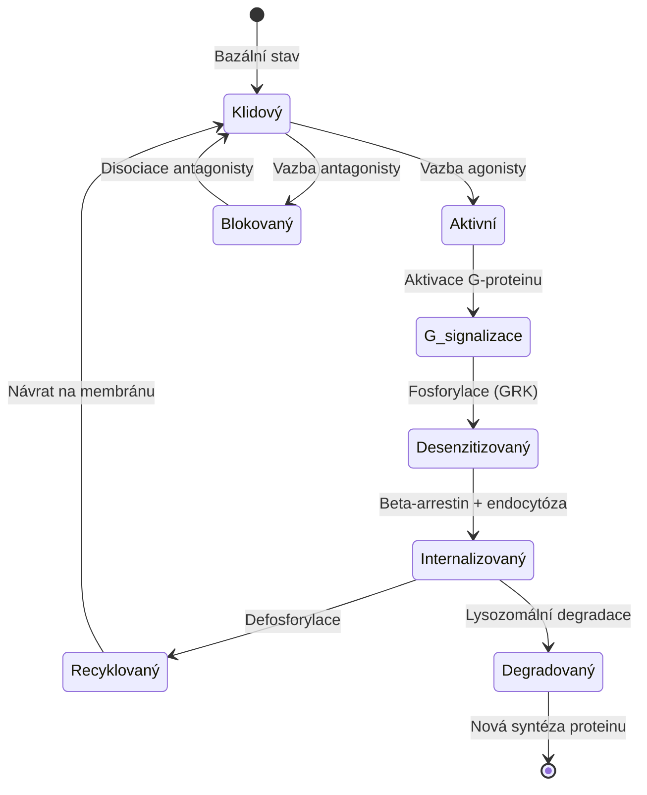
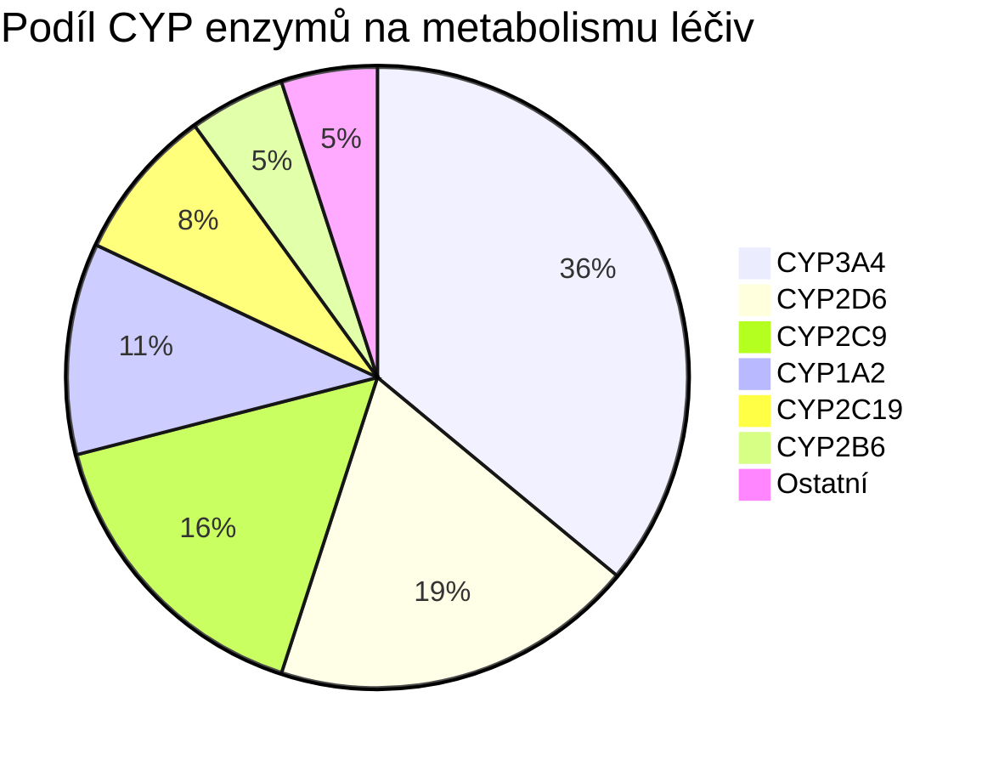
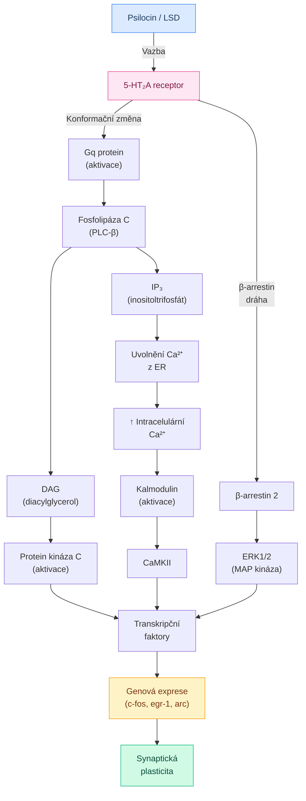

+++
title = "Farmakokinetika - interaktivni diagramy"
description = "Vizualni pruvodce farmakokinetikou: ADME procesy, metabolicke drahy a receptorove interakce zobrazene pomoci interaktivnich diagramu"
date = 2026-01-30
updated = 2026-01-30
weight = 10
draft = false

[taxonomies]
categories = ["farmakologie", "farmakokinetika"]
tags = ["ADME", "metabolismus", "absorpce", "distribuce", "eliminace", "receptory", "diagramy"]

[extra]
toc = true
mermaid = true
scientific_level = "intermediate"
+++

# Farmakokinetika - interaktivni diagramy

Farmakokinetika zkouma osud lecive latky v organismu. Tato stranka prezentuje klicove
farmakokineticky procesy pomoci interaktivnich diagramu, ktere lze exportovat jako PNG
pro dalsi pouziti.

## ADME procesy

Zakladni farmakokineticky model popisuje ctyri hlavni faze: **Absorpce**, **Distribuce**,
**Metabolismus** a **Eliminace** (ADME).

## Receptor-ligand interakce

Zakladni typy receptor-ligand interakci v neurofarmakologii:

## Receptor binding kinetics

Model asociace a disociace ligandy z receptoru s ukazkou residence time pro vybrane psychoaktivni latky:

## Serotoninova draha

Serotoninergni system a jeho klicove komponenty pri pusobeni psychedelik:

## Dopaminergni draha

Klicove dopaminergni drahy mozku a jejich funkce:

## Farmakokineticky profil - casova osa

Typicky farmakokineticky profil latky po peroralni podani:

```mermaid
gantt
    title Farmakokinetický profil (perorální podání)
    dateFormat HH:mm
    axisFormat %H:%M

    section Absorpce
    Rozpuštění v GIT        :a1, 00:00, 30m
    Absorpce ze střeva      :a2, 00:15, 60m
    First-pass metabolismus :a3, 00:30, 30m

    section Distribuce
    Systémový oběh          :d1, 00:45, 120m
    Tkáňová distribuce      :d2, 01:00, 180m
    Cmax dosažena            :milestone, m1, 01:30, 0m

    section Účinek
    Nástup účinku            :e1, 01:00, 30m
    Plný farmakologický efekt:e2, 01:30, 240m
    Odeznění účinku          :e3, 05:30, 120m

    section Eliminace
    Hepatální metabolismus   :el1, 02:00, 360m
    Renální exkrece          :el2, 03:00, 480m
```

## Stavovy diagram - stav receptoru

Zivotni cyklus GPCR (receptor sprazeny s G-proteinem):

## Metabolismus CYP450

Hlavni enzymy systemu cytochromu P450 a jejich substrat ve farmakologii:

## Signalni kaskada 5-HT2A

Intracelularni signalni kaskada po aktivaci 5-HT2A receptoru psychedelikem:

## Pouziti diagramu

Vsechny diagramy na teto strance jsou interaktivni:

- **Export PNG**: Najedte na diagram a kliknete na tlacitko "PNG" pro stazeni obrazku ve vysokem rozliseni
- **Cela obrazovka**: Tlacitko se sipkami pro zobrazeni diagramu na celou obrazovku (zavreni klastesou Escape)
- **Tmave/svetle tema**: Diagramy se automaticky prizpusobi zvolenemu tematu stranek

Diagramy jsou vytvoreny pomoci knihovny [Mermaid.js](https://mermaid.js.org/) a vykresluji
se primo v prohlizeci. V pripade, ze se diagram nezobrazí spravne, zobrazi se zdrojovy kod
diagramu jako fallback.
