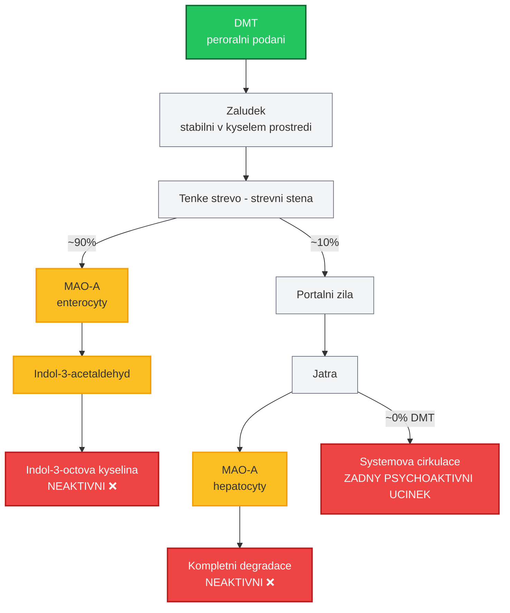
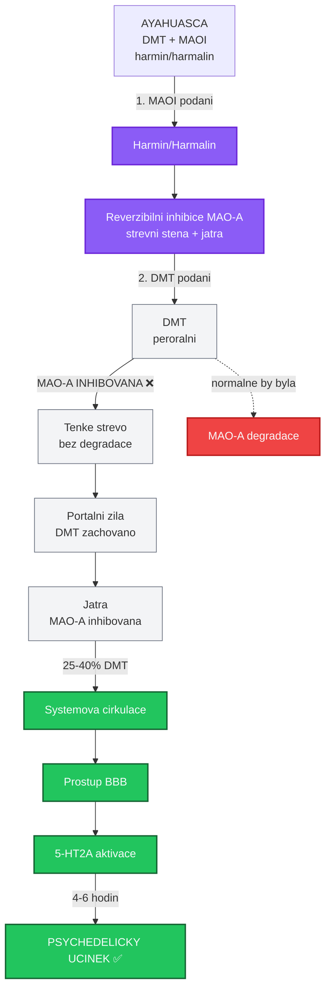

+++
title = "First-pass metabolismus"
description = "Presystemovy metabolismus psychoaktivnich latek - first-pass efekt, biodostupnost, enzymaticke systemy, klinicke dusledky pro davkovani"
date = 2026-01-30
updated = 2026-01-30
draft = false
weight = 2

[taxonomies]
categories = ["farmakologie", "farmakokinetika"]
tags = ["first-pass", "metabolismus", "biodostupnost", "CYP450", "MAO", "UGT", "presystemovy-metabolismus", "jatra", "psychedelika"]

[extra]
lead = "First-pass metabolismus (presystemovy metabolismus) je enzymatická premena latky pred dosazenim systemove cirkulace. Tento proces zasadne ovlivnuje biodostupnost psychoaktivnich latek a determinuje, zda a v jake forme se ucinná latka dostane do centralniho nervoveho systemu."
complexity = "pokrocila"
reading_time = "25 min"
+++

# First-pass metabolismus

**First-pass metabolismus** (presystemovy metabolismus, efekt prvniho pruchodu) je souhrn enzymatickych premen, kterym latka podleha mezi podanim a dosazenim systemove cirkulace. Tento fenomen je jednim z nejvyznamnejsich farmakokinetickych determinantu ucinnosti peroralne podavanych psychoaktivnich latek.

Pochopeni first-pass efektu je klicove pro:
- Predikci peroralni biodostupnosti
- Volbu optimalni cesty podani
- Vysvetleni rozdilu v ucinku pri ruznych zpusobech aplikace
- Pochopeni role [MAOI](@/pharmacology/maoi.md) v kontextu [ayahuascy](@/preparations/ayahuasca.md)

---

## Anatomie first-pass efektu

### Tri urovne presystemoveho metabolismu

First-pass metabolismus neni jediny proces, ale soustava enzymatickych bariér na ceste od gastrointestinalniho traktu (GIT) do systemove cirkulace.

```mermaid
graph TD
    PO[Peroralni podani] --> L1{Uroven 1: Luminalni metabolismus}

    L1 --> |Misto: Lumen GIT<br/>Enzymy:<br/>• Strevni bakterie<br/>• Kyselá hydrolýza<br/>• Beta-glukuronidazy<br/>• Peptidazy| L2{Uroven 2: Enterocytarni metabolismus}

    L2 --> |Misto: Strevni stena<br/>Enzymy:<br/>• CYP3A4 (80% strevniho CYP)<br/>• UGT (glukuronidace)<br/>• Alkalicka fosfataza<br/>• MAO-A<br/>• P-glykoprotein| PV[Portalni zila]

    PV --> L3{Uroven 3: Hepatalni metabolismus}

    L3 --> |Misto: Jatra<br/>Enzymy:<br/>• CYP450 (50+ izoforem)<br/>• UGT, SULT, NAT, COMT<br/>• MAO-A, MAO-B<br/>• Aldehyd oxidaza<br/>• Esterazy| SC[Systemova cirkulace<br/>Biodostupnost = F]

    classDef metabolism fill:#dcfce7,stroke:#16a34a,stroke-width:2px
    classDef transport fill:#f0fdf4,stroke:#86efac,stroke-width:1px

    class L1,L2,L3 metabolism
    class PO,PV,SC transport
```

### Kvantitativni model

Celkova biodostupnost po peroralnim podani je soucinem dílcich faktoru:

```
F = f_abs x f_GIT x f_hepat

Kde:
  F        = celkova biodostupnost (0-1)
  f_abs    = frakce absorbovana ze strevniho lumenu (0-1)
  f_GIT    = frakce prezivajici strevni metabolismus (0-1)
  f_hepat  = frakce prezivajici hepatalni metabolismus (0-1)

Priklad - THC:
  f_abs   = 0.90 (90% se vstrebava)
  f_GIT   = 0.40 (40% prezije strevni stenu)
  f_hepat = 0.30 (30% prezije jatra)
  F       = 0.90 x 0.40 x 0.30 = 0.108 = ~11%

Priklad - LSD:
  f_abs   = 0.95 (95% se vstrebava)
  f_GIT   = 0.85 (85% prezije strevni stenu)
  f_hepat = 0.87 (87% prezije jatra)
  F       = 0.95 x 0.85 x 0.87 = 0.70 = ~70%
```

---

## First-pass metabolismus psychoaktivnich latek

### Kompletni srovnavaci tabulka

| Latka | Biodostupnost (p.o.) | First-pass efekt | Hlavni enzymy | Aktivni metabolity | Klinicky vyznam |
|-------|---------------------|------------------|---------------|-------------------|-----------------|
| **[DMT](@/alkaloids/dmt.md)** | **~0%** (bez [MAOI](@/pharmacology/maoi.md)) | **Extremni** (MAO) | MAO-A (strevní, hepatalni) | Zadne (kompletni degradace) | Vyžaduje MAOI pro peroralni aktivitu |
| **Morfin** | **20-40%** | **Vysoky** (glukuronidace) | UGT2B7, CYP3A4 | Morfin-6-glukuronid (M6G) | Aktivni metabolit M6G |
| **[Psilocybin](@/alkaloids/psilocybin.md)** | **~50%** | **Stredni** | Alkalicka fosfataza, UGT | [Psilocin](@/alkaloids/psilocin.md) (aktivni) | Prodrug, aktivace na psilocin |
| **[LSD](@/alkaloids/lsd.md)** | **~70%** | **Nizky** | CYP3A4, CYP2D6, CYP1A2 | Zadne vyznamne | Vysoka potence kompenzuje |
| **[MDMA](@/alkaloids/mdma.md)** | **~70%** | **Stredni** (CYP2D6) | CYP2D6, CYP3A4, COMT | MDA (aktivni) | Variabilita dle genotypu |
| **THC** | **6-20%** | **Vysoky** (CYP2C9, 3A4) | CYP2C9, CYP3A4 | 11-OH-THC (aktivni) | 11-OH-THC je aktivni |
| **[Ketamin](@/alkaloids/ketamin.md)** | **17-29%** | **Vysoky** (CYP3A4, 2B6) | CYP3A4, CYP2B6 | Norketamin, HNK (aktivni) | Norketamin je aktivni |

---

### Detailni profily

#### DMT - Extremni first-pass (biodostupnost ~0%)

[DMT](@/alkaloids/dmt.md) predstavuje nejdramatictejsi priklad first-pass metabolismu mezi psychoaktivnimi latkami. Monoaminooxidaza A ([MAO-A](@/glossary/mao.md)) ve strevni stene a jatrech degraduje DMT behem minut na neaktivni metabolity.



**Reseni - MAO inhibice ([ayahuasca](@/preparations/ayahuasca.md)):**



**Farmakologicky vyznam:**

| Parametr | DMT bez MAOI | DMT s MAOI (ayahuasca) |
|----------|-------------|------------------------|
| Biodostupnost | ~0% | ~25-40% |
| Tmax | - | 60-120 min |
| Trvani ucinku | Zadny | 4-6 hodin |
| Intenzita | Zadna | Silna |
| Klinicky ekvivalent | - | Stredne silna davka vaporizovaneho DMT |

---

#### Morfin - Vysoky first-pass (biodostupnost 20-40%)

Morfin je referentni opioidni analgetikum s vyznamnym first-pass metabolismem. Zajimave je, ze jeden z jeho metabolitu je farmakologicky silnejsi nez mateřska latka.

```
MORFIN (peroralni podani)
     |
     v
STREVNI STENA
     |
     +---> UGT2B7 (10-15% podane davky)
     |         |
     |         v
     |    Morfin-3-glukuronid (M3G) [neaktivni, prokonvulzivni]
     |    Morfin-6-glukuronid (M6G) [AKTIVNI, 6-200x silnejsi]
     |
     v
PORTALNI ZILA
     |
     v
JATRA (hlavni misto metabolismu)
     |
     +---> UGT2B7 (40-70% podane davky)
     |         |
     |         ├── M3G (~60% metabolismu) [neaktivni]
     |         └── M6G (~10% metabolismu) [AKTIVNI]
     |
     +---> CYP3A4 (~5%)
     |         |
     |         v
     |    Normorfin (N-demethylace) [slabe aktivni]
     |
     +---> CYP2D6 (~1-2%)
     |         |
     |         v
     |    Hydromorfon [silne aktivni]
     |
     v
SYSTEMOVA CIRKULACE: 20-40% morfinu + M6G + M3G

KLINICKY VYZNAM M6G:
- 6-200x vyssi afinita k mu-opioidnimu receptoru nez morfin
- Prodlouzeny T1/2 (delsi analgezie po p.o. nez po i.v.)
- Akumulace u renalni insuficience → riziko predavkovani
```

**Klinicky dulezite poznatky:**

| Aspekt | Detail |
|--------|--------|
| Peroralni davka vs i.v. | 3:1 (30 mg p.o. = 10 mg i.v.) |
| M6G u renalniho selhani | Akumulace → prolongovana deprese dychani |
| Geneticka variabilita | UGT2B7 polymorfismy meni pomer M3G/M6G |
| Interindividualni variabilita | 4-nasobny rozdil v biodostupnosti |

---

#### Psilocybin - Produktivni first-pass (biodostupnost ~50%)

[Psilocybin](@/alkaloids/psilocybin.md) je unikatni pripad, kdy first-pass metabolismus latku **aktivuje** namisto inaktivace. Psilocybin je prodrug, ktery se premeni na aktivni [psilocin](@/alkaloids/psilocin.md) defosforylaci.

```
PSILOCYBIN (prodrug, peroralni podani)
     |
     v
ZALUDEK (pH 1-3)
     |  (castecna kyselá defosforylace)
     v
TENKE STREVO
     |
     +---> Alkalicka fosfataza (strevni stena)
     |         |
     |         v
     |    PSILOCIN (4-HO-DMT) [AKTIVNI FORMA]
     |         |
     |         +---> UGT (enterocytarni glukuronidace)
     |         |         |
     |         |         v
     |         |    Psilocin-O-glukuronid [neaktivni]
     |         |
     |         +---> MAO-A (castecna degradace)
     |                   |
     |                   v
     |              4-HO-IAA [neaktivni]
     |
     v (nekonvertovany psilocybin + psilocin)
PORTALNI ZILA
     |
     v
JATRA
     |
     +---> Alkalicka fosfataza (dalsi konverze)
     |         |
     |         v
     |    Psilocin [AKTIVNI]
     |
     +---> UGT1A10 (glukuronidace psilocinu)
     |         |
     |         v
     |    Psilocin-O-glukuronid (~70% exkrece)
     |
     +---> MAO-A (oxidativni deaminace)
               |
               v
          4-hydroxyindol-3-octova kyselina
          [neaktivni]

BILANCE:
- ~50% psilocybinu se dostane do systemove cirkulace jako psilocin
- Tmax psilocinu: 60-90 minut
- T1/2 psilocinu: 2-3 hodiny
```

**Srovnani s primym podanim psilocinu:**

| Parametr | Psilocybin (p.o.) | Psilocin (p.o.) |
|----------|-------------------|-----------------|
| Stabilita | Vyssi (fosforylovan) | Nizsi (oxidace) |
| Biodostupnost | ~50% (jako psilocin) | ~50% (prima glukuronidace) |
| Tmax | 60-90 min | 40-60 min |
| Reprodukovatelnost | Vyssi | Nizsi |
| Klinicke pouziti | Standardni | Zkoumany |

---

#### LSD - Nizky first-pass (biodostupnost ~70%)

[LSD](@/alkaloids/lsd.md) vykazuje relativne nizky first-pass metabolismus, coz v kombinaci s jeho extremne vysokou potenci (aktivni v mikrogramovych davkach) zajistuje spolehlivy peroralni ucinek.

```
LSD (peroralni/sublingualni podani)
     |
     ├── Sublingualni absorpce (20-30%)
     |         |
     |         v
     |    Systemova cirkulace (obchazi first-pass)
     |
     └── Peroralni absorpce (70-80%)
               |
               v
          STREVNI STENA
               |
               +---> CYP3A4 (minimalní aktivita)
               |
               v
          JATRA
               |
               +---> CYP3A4 → 2-oxo-3-hydroxy-LSD (O-H-LSD)
               |                   [neaktivni, hlavni metabolit v moci]
               |
               +---> CYP2D6 → Nor-LSD (N-demethylace)
               |                   [neaktivni]
               |
               +---> CYP1A2 → N-desmethyl-LSD
               |
               +---> Glukuronidace
               |
               v
          SYSTEMOVA CIRKULACE: ~70% LSD

DUVODY NIZKEHO FIRST-PASS:
1. Vysoka lipofilita (log P 2.9) → rychly prostup strevni stenou
2. Maly first-pass metabolismus → vetsi frakce prezije jatra
3. Extremni potence (Ki 1-2 nM u 5-HT2A) → i mala frakce staci
```

**Receptor residence time:**

LSD vykazuje prodlouzeny ucinek (8-12 hodin), ktery neodpovida jeho farmakokinetickemu polocasu (3-5 hodin). Vysvetlenim je prolongovana vazba na [5-HT2A receptor](@/receptors/5-ht2a.md):

```
LSD + 5-HT2A receptor
     |
     v
Vazba do ortosterickeho mista
     |
     v
Extracellularni "viko" (EL2 loop)
uzavre LSD v receptoru
     |
     v
Prolongovana aktivace
(cas disociace >> nez u serotoninu)
     |
     v
Ucinek trva 8-12 hodin
(presto ze T1/2 = 3-5 h)
```

---

#### MDMA - Stredni first-pass s autoinhibici (biodostupnost ~70%)

[MDMA](@/alkaloids/mdma.md) prochazi strednim first-pass metabolismem primarne pres CYP2D6, pricemz sama MDMA tento enzym inhibuje, coz vede k nelinearni kinetice.

```
MDMA (peroralni podani)
     |
     v
STREVNI STENA
     |
     +---> CYP2D6 (casecny metabolismus)
     |
     v
JATRA
     |
     +---> CYP2D6 (hlavni cesta)
     |         |
     |         ├── MDA (N-demethylace) [AKTIVNI - psychedelicka slozka]
     |         |
     |         └── HHMA (3,4-dihydroxymetamfetamin)
     |                   |
     |                   v [COMT]
     |              HMMA (4-hydroxy-3-methoxymetamfetamin)
     |
     +---> CYP3A4 (alternativni cesta)
     |         |
     |         v
     |    N-demethylace → MDA
     |
     +---> COMT, UGT (konjugace)
     |
     v
SYSTEMOVA CIRKULACE: ~70% MDMA

AUTOINHIBICE CYP2D6:
====================
MDMA je mechanismus-zalozeny inhibitor CYP2D6
("suicide substrate")

Davka:    75 mg    100 mg    125 mg    150 mg
Cmax:     1x       1.5x      2.3x      3.5x
AUC:      1x       1.7x      3.0x      5.0x+

→ Neproporcionalni narust expozice s davkou!
→ Vyssi davky = disproportionalne vyssi riziko toxicity
```

**CYP2D6 geneticke polymorfismy a MDMA:**

| Fenotyp | Prevalence | Dopad na MDMA | Riziko |
|---------|------------|---------------|--------|
| **Ultra-rychly metabolizer (UM)** | 5-10% | Rychlejsi konverze na MDA | Zvysena psychedelicka slozka |
| **Extenzivni metabolizer (EM)** | 65-80% | Standardni | Referencni |
| **Intermediarni metabolizer (IM)** | 10-15% | Mirne zvysene hladiny | Zvysene |
| **Pomaly metabolizer (PM)** | 5-10% | 5-10x vyssi plazmaticke hladiny | **VYSOKE - neurotoxicita** |

---

#### THC - Vysoky first-pass s aktivnim metabolitem (biodostupnost 6-20%)

THC (delta-9-tetrahydrocannabinol) je vyrazne ovlivnen first-pass metabolismem, pricemz vznikajici metabolit 11-OH-THC je farmakologicky aktivnejsi nez mateřska latka.

```
THC (peroralni podani, napr. edibles)
     |
     v
ZALUDEK
     |  (lipofilni, absorpce s tuky)
     v
TENKE STREVO
     |
     +---> CYP3A4 (enterocytarni - vyznamny podil)
     |         |
     |         v
     |    11-OH-THC (hydroxylace) [AKTIVNI, SILNEJSI]
     |         |
     |         v
     |    11-nor-9-COOH-THC (THC-COOH) [neaktivni]
     |
     v
JATRA
     |
     +---> CYP2C9 (hlavni)
     |         |
     |         v
     |    11-OH-THC [AKTIVNI]
     |         |
     |         v
     |    THC-COOH [neaktivni, detekce v moci]
     |
     +---> CYP3A4 (sekundarni)
     |
     +---> UGT (glukuronidace metabolitu)
     |
     v
SYSTEMOVA CIRKULACE:
  6-20% THC
  + 11-OH-THC (AKTIVNI METABOLIT)

SROVNANI INHALACE vs PERORALNI PODANI:
=======================================
              INHALACE        PERORALNI
THC v plazmě  Vysoke           Nizke
11-OH-THC     Nizke            Vysoke (az 3x THC)
Celkový efekt Rychlý nastup    Silnejsi, delsi
Tmax          5-10 min         1-3 hodiny
Trvani        2-4 h            4-8 h
Subjektivne   Kontrolovatelne  Mene predvidatelne
```

**Proc jsou "edibles" nepredvidatelne:**

| Faktor | Vliv na variabilitu |
|--------|---------------------|
| Obsah tuku v potrave | Zvysuje absorpci 2-5x |
| CYP2C9 polymorfismy | *3/*3 genotyp: 3x nizsi clearance |
| Jaterni funkce | Cirhoza: 2-3x vyssi biodostupnost |
| Gastricky pH | Ovlivnuje rozpustnost |
| First-pass variabilita | 6-20% rozmezi = 3-nasobny rozdil |

---

#### Ketamin - Vysoky first-pass s bioaktivnimi metabolity (biodostupnost 17-29%)

[Ketamin](@/alkaloids/ketamin.md) prochazi intenzivnim first-pass metabolismem, pricemz jeho metabolity (norketamin, hydroxynorketamin) maji vlastni farmakologickou aktivitu.

```
KETAMIN (peroralni podani)
     |
     v
STREVNI STENA
     |
     +---> CYP3A4 (vyznamny strevni metabolismus)
     |         |
     |         v
     |    NORKETAMIN (N-demethylace)
     |
     v
JATRA (hlavni metabolicke misto)
     |
     +---> CYP3A4 (hlavni)
     |         |
     |         v
     |    NORKETAMIN [AKTIVNI, ~30% potence ketaminu]
     |         |
     |         +---> CYP2A6, CYP2B6 (hydroxylace)
     |                   |
     |                   v
     |              HYDROXYNORKETAMIN (HNK)
     |              [ANTIDEPRESIVNI - AMPA mechanismus]
     |
     +---> CYP2B6 (alternativni cesta)
     |         |
     |         v
     |    5-OH-ketamin → dalsi metabolity
     |
     +---> Glukuronidace
     |
     v
SYSTEMOVA CIRKULACE:
  17-29% ketaminu
  + Norketamin (stredne aktivni)
  + HNK (antidepresivne aktivni)

SROVNANI CEST PODANI:
=====================
              IV      IM       IN       PERORALNI
Biodostupnost 100%    93%      45-50%   17-29%
Ketamin       +++     +++      ++       +
Norketamin    +       +        ++       +++
HNK           +       +        ++       +++
Disociace     Silna   Silna    Stredni  Mirna
Antideprese   Ano     Ano      Ano      Ano (jiny profil)
```

**Dulezity poznatek o (2R,6R)-HNK:**

| Vlastnost | (2R,6R)-HNK |
|-----------|-------------|
| NMDA aktivita | Minimalni (Ki >100 uM) |
| AMPA potenciace | Ano (prime i neprime) |
| Antidepresivni ucinek | Ano (zviri modely) |
| Disociativni ucinky | Minimalni/zadne |
| Zavislostni potencial | Nizky |
| Klinicky potencial | Vysoky (bez disociace) |

---

## Enzymy first-pass metabolismu

### CYP450 system

Cytochrom P450 je rodina hem-obsahujicich oxidaz zodpovednych za metabolismus >75% vsech leciv.

| Izoforma | Podil na metabolismu leciv | Substráty (psychoaktivni) | Lokalizace |
|----------|---------------------------|---------------------------|------------|
| **CYP3A4** | ~50% | [Ketamin](@/alkaloids/ketamin.md), THC, alprazolam, midazolam | Jatra, strevo |
| **CYP2D6** | ~25% | [MDMA](@/alkaloids/mdma.md), DXM, kodein, amfetaminy | Jatra |
| **CYP2C9** | ~10% | THC, ibuprofen | Jatra |
| **CYP2C19** | ~5% | Diazepam | Jatra |
| **CYP1A2** | ~5% | Kofein, [LSD](@/alkaloids/lsd.md) (castecne) | Jatra |
| **CYP2B6** | ~5% | [Ketamin](@/alkaloids/ketamin.md), metadon | Jatra |

### MAO (monoaminooxidaza)

| Izoforma | Lokalizace | Substráty | Vyznam pro first-pass |
|----------|------------|-----------|----------------------|
| **MAO-A** | GIT, jatra, mozek | [Serotonin](@/glossary/serotonin.md), noradrenalin, [DMT](@/alkaloids/dmt.md), tyramin | **Kriticka** - kompletne degraduje DMT |
| **MAO-B** | Mozek, trombocyty | Dopamin, fenylethylamin | Nizsi vyznam pro first-pass |

### UGT (UDP-glukuronosyltransferaza)

| Izoforma | Substráty | Vyznam |
|----------|-----------|--------|
| **UGT2B7** | Morfin → M3G, M6G | Hlavni metabolicka cesta morfinu |
| **UGT1A10** | [Psilocin](@/alkaloids/psilocin.md) → glukuronid | Hlavni eliminacni cesta psilocinu |
| **UGT1A1** | Bilirubin, mnohe fenoly | Siroky substratovy profil |

### Alkalicka fosfataza

| Lokalizace | Substráty | Vyznam |
|------------|-----------|--------|
| Strevni stena (brush border) | [Psilocybin](@/alkaloids/psilocybin.md) → [psilocin](@/alkaloids/psilocin.md) | Aktivace prodrug psilocybinu |
| Jatra, kosti | Fosfoestery obecne | Obecna defosforylace |

---

## Strategie obejiti first-pass efektu

### Alternativni cesty podani

Nekteré cesty podani castecne nebo zcela obchazeji first-pass metabolismus:

| Cesta podani | First-pass | Mechanismus obejiti | Priklady |
|--------------|------------|---------------------|----------|
| **Intravnozni (i.v.)** | Zadny (0%) | Prima do systemove cirkulace | Ketamin, DMT |
| **Intramuskulari (i.m.)** | Zadny (0%) | Absorpce do kapilár, ne portalni zila | Ketamin |
| **Sublingualni (s.l.)** | Castecny | Absorpce do v. jugularis → v. cava | [LSD](@/alkaloids/lsd.md) blottery |
| **Intranazalni (i.n.)** | Castecny | Absorpce pres nosni sliznici | Esketamin (Spravato) |
| **Inhalacni** | Zadny (0%) | Plicni absorpce → plicni zily → srdce | DMT, THC (vaporizace) |
| **Rektalni** | Castecny (50%) | Dolni rektalni zily obchazeji portalni oběh | Nektera psychedelika |
| **Transdermalní** | Zadny (0%) | Prima do kapilár | Fentanyl nalepky |
| **Bukalni** | Castecny | Absorpce pres ustnl sliznici | Nektera sublingualni |

### Farmakologicka modulace

| Strategie | Mechanismus | Priklad |
|-----------|-------------|---------|
| **[MAOI](@/pharmacology/maoi.md)** | Inhibice MAO-A ve strevu a jatrech | Harmala alkaloidy + [DMT](@/alkaloids/dmt.md) = ayahuasca |
| **CYP inhibice** | Inhibice hepatalnich CYP enzymů | Grapefruitovy dzus (CYP3A4) |
| **Formulace** | Liposomy, nanočástice, entericky obal | Experimentální |
| **Prodrug design** | Stabilni forma, aktivace po absorpci | [Psilocybin](@/alkaloids/psilocybin.md) (fosfatovy ester psilocinu) |

---

## Geneticke polymorfismy a first-pass variabilita

### CYP2D6 polymorfismy

CYP2D6 je nejvice polymorfni z klinicky vyznamnych CYP enzymu s vice nez 100 alelickymi variantami.

```
CYP2D6 FENOTYPY A DOPAD NA PSYCHOAKTIVNI LATKY

ULTRA-RYCHLI METABOLIZERI (UM) - 5-10% populace
+--------------------------------------------------+
| Genotyp: Duplikace/multiplikace CYP2D6            |
| Prevalence: 1-2% Kavkazci, 10-29% Etiopie/Arabi  |
|                                                    |
| Dopad:                                             |
| - MDMA: Rychla konverze na MDA → vice psychedelicka|
| - Kodein: Rychla konverze na morfin → predavkovani |
| - DXM: Rychly metabolismus → nizsi ucinek          |
+--------------------------------------------------+

POMALI METABOLIZERI (PM) - 5-10% kavkazske populace
+--------------------------------------------------+
| Genotyp: *3/*4, *4/*4, *5/*5 (nefunkcni alely)    |
| Prevalence: 6-10% Kavkazci, 1-2% Asiate           |
|                                                    |
| Dopad:                                             |
| - MDMA: 5-10x vyssi hladiny → NEUROTOXICITA       |
| - DXM: Intenzivni disociace i pri nizkych davkach  |
| - Kodein: Zadny analgeticky ucinek (ne → morfin)   |
+--------------------------------------------------+
```

### CYP2C9 polymorfismy (THC)

| Genotyp | Prevalence (Kavkazci) | Dopad na THC |
|---------|----------------------|--------------|
| *1/*1 (EM) | 65% | Normalni metabolismus |
| *1/*3 (IM) | 25% | 1.5x vyssi AUC |
| *3/*3 (PM) | 5% | 3x vyssi AUC, prodlouzeny ucinek |

---

## Klinicke dusledky

### Davkovani pri ruznych cestach podani

| Latka | p.o. | i.v./i.m. | Pomeer p.o./parenteral |
|-------|------|-----------|------------------------|
| Morfin | 30 mg | 10 mg | 3:1 |
| [Ketamin](@/alkaloids/ketamin.md) | 200-400 mg | 0.5 mg/kg (~35 mg) | 6-10:1 |
| THC | 10 mg (edible) | - | - |
| DMT | Neaktivni | 15-30 mg (i.m.) | neaplikovatelne |

### Interindividualni variabilita

```
FAKTORY OVLIVNUJICI FIRST-PASS

GENETICKE:
├── CYP450 polymorfismy (CYP2D6, CYP2C9, CYP2C19)
├── UGT polymorfismy
├── MAO expresni varianty
└── Transporterove polymorfismy (P-gp, OATP)

FYZIOLOGICKE:
├── Vek (snizena CYP aktivita u senioru)
├── Pohlavi (mirne rozdily v CYP aktivite)
├── Jaterni funkce (cirhoza = snizeny first-pass)
├── Jaterni prutok (srdecni selhani = snizeny)
└── GIT motilita (ovlivnuje absorpci)

VNEJSI:
├── Potrava (tukova strava zvysuje absorpci lipofilnich latek)
├── Lekove interakce (CYP inhibice/indukce)
├── Koureni (indukce CYP1A2)
├── Alkohol (chronicke uzivani indukuje CYP2E1)
└── Grapefruit (inhibice CYP3A4)
```

### Bezpecnostni implikace

| Situace | Riziko | Doporuceni |
|---------|--------|------------|
| CYP2D6 PM + MDMA | 5-10x vyssi expozice | Nizsi davka nebo vyhnouti se |
| Jaterni cirhoza + libovolna latka | Zvysena biodostupnost | Vyznamna redukce davky |
| CYP3A4 inhibitor + ketamin | Zvyseny ucinek | Snizit davku ketaminu |
| Grapefruit + alprazolam | Zvysene hladiny BZ | Vyhnouti se kombinaci |
| MAOI + tyramin (potrava) | Hypertenzni krize | Striktnl dieta |

---

## Reference

### Ucebnice a prehledove clanky

1. Rowland, M. & Tozer, T.N. (2011). *Clinical Pharmacokinetics and Pharmacodynamics: Concepts and Applications*. Lippincott Williams & Wilkins. 4th ed.
2. Brunton, L.L., Hilal-Dandan, R. & Knollmann, B.C. (2018). *Goodman and Gilman's: The Pharmacological Basis of Therapeutics*. McGraw-Hill. 13th ed.
3. Thummel, K.E. et al. (1997). *Oral first-pass elimination of midazolam involves both gastrointestinal and hepatic CYP3A-mediated metabolism*. Clinical Pharmacology & Therapeutics, 62(3), 248-260.

### Psychoaktivni latky

4. Brown, R.T. et al. (2017). *Pharmacokinetics of Escalating Doses of Oral Psilocybin in Healthy Adults*. Clinical Pharmacology & Therapeutics.
5. Holze, F. et al. (2019). *Pharmacokinetics and Pharmacodynamics of Lysergic Acid Diethylamide Microdoses in Healthy Participants*. Clinical Pharmacology & Therapeutics.
6. Dinis-Oliveira, R.J. (2017). *Metabolism of psilocybin and psilocin: clinical and forensic toxicological relevance*. Drug Metabolism Reviews.
7. Riba, J. et al. (2003). *Human pharmacology of ayahuasca: subjective and cardiovascular effects, monoamine metabolite excretion, and pharmacokinetics*. Journal of Pharmacology and Experimental Therapeutics.
8. de la Torre, R. et al. (2004). *Non-linear pharmacokinetics of MDMA ('ecstasy') in humans*. British Journal of Clinical Pharmacology, 57(2), 159-169.
9. Huestis, M.A. (2007). *Human cannabinoid pharmacokinetics*. Chemistry & Biodiversity, 4(8), 1770-1804.
10. Zanos, P. et al. (2016). *NMDAR inhibition-independent antidepressant actions of ketamine metabolites*. Nature, 533(7604), 481-486.

### Geneticke polymorfismy

11. Zanger, U.M. & Schwab, M. (2013). *Cytochrome P450 enzymes in drug metabolism: regulation of gene expression, enzyme activities, and impact of genetic variation*. Pharmacology & Therapeutics, 138(1), 103-141.
12. Zhou, S.F. (2009). *Polymorphism of human cytochrome P450 2D6 and its clinical significance*. Clinical Pharmacokinetics, 48(12), 761-804.

---

## Krizove odkazy

### Farmakologie

- [Farmakokinetika](@/glossary/farmakokinetika.md) - Kompletni ADME pruvodce
- [MAOI](@/pharmacology/maoi.md) - Inhibitory monoaminooxidazy
- [Membranovy prostup](@/pharmacology/membrane-permeability.md) - BBB, placenta, testikulrani bariera

### Enzymy a receptory

- [MAO](@/glossary/mao.md) - Monoaminooxidaza
- [5-HT2A receptor](@/receptors/5-ht2a.md) - Cil psychedelik
- [NMDA receptor](@/receptors/nmda.md) - Cil disociativ

### Psychoaktivni latky

- [DMT](@/alkaloids/dmt.md) - Extremni first-pass (MAO degradace)
- [Psilocybin](@/alkaloids/psilocybin.md) - Prodrug (aktivace first-passem)
- [LSD](@/alkaloids/lsd.md) - Nizky first-pass
- [MDMA](@/alkaloids/mdma.md) - CYP2D6 autoinhibice
- [Ketamin](@/alkaloids/ketamin.md) - Bioaktivni metabolity
- [Meskalin](@/alkaloids/mescaline.md) - Fenethylaminove psychedelikum

### Bezpecnost

- [Harm Reduction](@/harm-reduction/_index.md) - Zasady bezpecneho uzivani
- [Ayahuasca](@/preparations/ayahuasca.md) - MAOI + DMT pripravek

---

Zpet na [Farmakologie](@/pharmacology/_index.md) | [Farmakokinetika](@/glossary/farmakokinetika.md) | [MAOI](@/pharmacology/maoi.md)

---

*Tento text slouzi k edukacnim ucelum. Informace zde obsazene nejsou urceny jako lekarska ci farmakologicka rada.*
