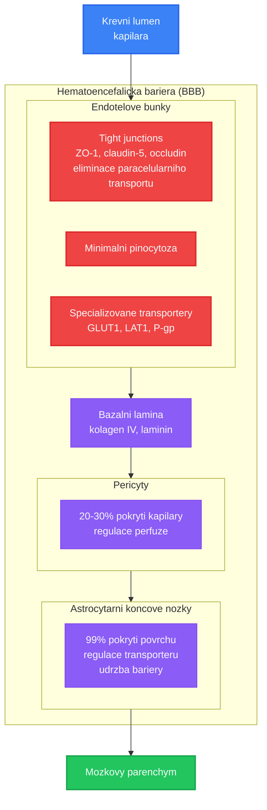

+++
title = "Membranovy prostup"
description = "Hematoencefalicka bariera, placentarni bariera a testikulrani bariera - mechanismy prostupu psychoaktivnich latek pres biologicke membrany"
date = 2026-01-30
updated = 2026-01-30
draft = false
weight = 3

[taxonomies]
categories = ["farmakologie", "farmakokinetika"]
tags = ["BBB", "hematoencefalicka-bariera", "placenta", "testikulrani-bariera", "membranovy-prostup", "distribuce", "lipofilita", "P-glykoprotein"]

[extra]
lead = "Prostup biologickymi membranami je kritickym determinantem ucinnosti psychoaktivnich latek. Hematoencefalicka bariera (BBB) rozhoduje o tom, zda se latka dostane do mozku. Placentarni a testikulrani bariera maji zasadni vyznam pro reprodukcni bezpecnost."
complexity = "pokrocila"
reading_time = "30 min"
+++

# Membranovy prostup psychoaktivnich latek

Biologicke membrany slouzi jako selektivni bariery mezi kompartmenty organismu. Pro psychoaktivni latky jsou tri bariery zvlaste vyznamne:

1. **Hematoencefalicka bariera (BBB)** - urcuje, zda latka vyvolá ucinek na CNS
2. **Placentarni bariera** - urcuje expozici plodu
3. **Testikulrani bariera (BTB)** - chrání spermatogenezi

Pochopeni mechanismu prostupu techto bariér je zakladem pro predikci farmakokinetickych vlastnosti a bezpecnostniho profilu psychoaktivnich latek.

---

## Obecne principy membranoveho prostupu

### Mechanismy transportu pres membrany

```mermaid
graph LR
    subgraph "Membranove transportni mechanismy"
        L[Luminalní<br/>kompartment]

        subgraph M[Membrana]
            subgraph "1. Pasivni transcelularni difuze"
                TC[Lipofilni molekuly<br/>DMT, LSD, THC]
            end

            subgraph "2. Paracelularni transport"
                PC[Male hydrofilni<br/>limitovano u BBB]
            end

            subgraph "3. Aktivni influx"
                INF[GLUT1/LAT1<br/>glukoza, aminokyseliny<br/>ATP/gradient]
            end

            subgraph "4. Efflux transport"
                EFF[P-gp/BCRP<br/>xenobiotika ven<br/>ATP]
            end

            subgraph "5. Transcytoza"
                TR[Receptorem zprostredkovana<br/>transferin, insulin]
            end
        end

        A[Abluminalní<br/>kompartment]

        L -->|prostup| TC --> A
        L -.->|omezeno| PC -.-> A
        L -->|import| INF --> A
        L <--|export| EFF
        L -->|vezikuly| TR --> A
    end

    classDef passive fill:#e5e7eb,stroke:#6b7280,stroke-width:1px
    classDef active fill:#fbbf24,stroke:#f59e0b,stroke-width:2px
    classDef efflux fill:#ef4444,stroke:#dc2626,stroke-width:2px
    classDef compartment fill:#dbeafe,stroke:#2563eb,stroke-width:2px

    class TC,PC passive
    class INF,TR active
    class EFF efflux
    class L,A compartment
```

### Faktory ovlivnujici membranovy prostup

| Faktor | Optimalni pro prostup | Snizujici prostup |
|--------|----------------------|-------------------|
| **Lipofilita (log P)** | log P 1-3 | log P <0 (hydrofilni) nebo >5 (zachyceni v membranach) |
| **Molekulova hmotnost** | MW <400-500 Da | MW >500 Da |
| **Ionizace** | Neionizovana forma (pKa daleko od fyziologickeho pH) | Plne ionizovana |
| **Vodikove vazby** | <10 donoru+akceptoru | Nadmerny pocet H-vazeb |
| **Polarna plocha (PSA)** | PSA <90 A^2 | PSA >120 A^2 |
| **P-gp substrat** | Ne | Ano (aktivni efflux) |
| **Vazba na proteiny** | Nizka-stredni | Extremne vysoka (>99%) |

### Lipinskeho pravidlo peti (Rule of Five)

Latka bude mit pravdepodobne dobrou peroralni biodostupnost a membranovy prostup, pokud splnuje:

```
LIPINSKEHO PRAVIDLO PETI

1. MW     <= 500 Da
2. log P  <= 5
3. H-donory  <= 5
4. H-akceptory <= 10

Psychoaktivni latky vs pravidlo:

Latka        MW    logP   H-don  H-akc  Splnuje?
----------------------------------------------------
DMT          188   1.3    1      1      ANO (vse)
Psilocin     204   1.2    2      2      ANO (vse)
LSD          323   2.9    1      4      ANO (vse)
Mescalin     211   0.7    1      4      ANO (vse)
MDMA         193   1.8    1      3      ANO (vse)
Ketamin      238   2.2    0      2      ANO (vse)
THC          314   6.9    1      2      NE (log P)
Morfin       285   0.9    2      4      ANO (vse)
```

---

## Hematoencefalicka bariera (BBB)

### Struktura BBB

Hematoencefalicka bariera je specializovana struktura mozkových kapilár, ktera chrání CNS pred potencialne skodlivymi latkami z krve.



### Srovnani BBB s periferni kapilarou

| Vlastnost | Mozková kapilara (BBB) | Periferni kapilara |
|-----------|----------------------|-------------------|
| **Tight junctions** | Kompletni (TEER >1500 ohm*cm2) | Fenestrované (TEER ~10) |
| **Pinocytoza** | Minimalni | Aktivni |
| **Paracelularni prostup** | Zanedbatelny | Vyznamny |
| **Efflux pumpy** | Vysoka exprese (P-gp, BCRP, MRP) | Nizka |
| **Enzymy** | CYP, MAO, COMT, peptidazy | Nizsi aktivita |
| **Astrocyty** | 99% pokryti (endfeet) | Zadne |
| **Pericyty** | Vysoka hustota | Nizka |

### Detailni srovnani membran

| Membrána | Charakteristika | Latky s dobrým prostupem |
|----------|------------------|-------------------------|
| **Kapilary (obecně)** | Fenestracije, mezery | Většina látek |
| **Hematoencefalická bariéra** | Tight junctions | Lipofilní, malé |
| **Placenta** | Selektivní | Závisí na MW, lipofilité |
| **Testikulární bariéra** | Tight junctions | Lipofilní |

### Transportery na BBB

```
TRANSPORTERY NA HEMATOENCEFALICKE BARIERE

LUMINALNI STRANA (krev):

EFFLUX (zpet do krve):
├── P-glykoprotein (P-gp/ABCB1) - nejdulezitejsi
│   Substráty: mnohe lipofilni latky, digoxin, vincristin
│   Inhibitory: verapamil, cyklosporin A
│
├── BCRP (ABCG2) - breast cancer resistance protein
│   Substráty: nektera cytostatika, sulfat konjugaty
│
└── MRP1-5 (ABCC1-5) - multidrug resistance protein
    Substráty: glukuronidove konjugaty, anionty

INFLUX (do mozku):
├── GLUT1 (SLC2A1) - glukoza
│   Kapacita: ~0.4 mg/min/g mozku
│
├── LAT1 (SLC7A5) - velke neutralni aminokyseliny
│   Substráty: L-DOPA, gabapentin, melphalan
│
├── CAT1 (SLC7A1) - kationicke aminokyseliny
│   Substráty: arginin, lysin
│
├── MCT1 (SLC16A1) - monokarboxylaty
│   Substráty: laktat, pyruvat, valproat
│
└── OAT/OCT - organicke anionty/kationty
    Substráty: nektera leciva

ABLUMINALNI STRANA (mozek):
└── Dalsi sada transporteru pro odstranovani
    metabolitu z mozku
```

### Prostup BBB u psychoaktivnich latek

| Latka | MW (Da) | log P | PSA (A2) | P-gp substrat | Prostup BBB | Poznamka |
|-------|---------|-------|----------|---------------|-------------|----------|
| **[LSD](@/alkaloids/lsd.md)** | 323 | 2.9 | 49 | Castecny | **Vyborny** | Vysoka lipofilita, aktivni v ng/ml |
| **[Psilocin](@/alkaloids/psilocin.md)** | 204 | 1.2 | 54 | Ne | **Dobry** | Aktivni forma [psilocybinu](@/alkaloids/psilocybin.md) |
| **[DMT](@/alkaloids/dmt.md)** | 188 | 1.3 | 16 | Ne | **Dobry** | Maly, lipofilni, ale rychla degradace |
| **[5-MeO-DMT](@/alkaloids/5-meo-dmt.md)** | 218 | 1.7 | 25 | Ne | **Dobry** | Mírne vyssi lipofilita nez DMT |
| **[Meskalin](@/alkaloids/mescaline.md)** | 211 | 0.7 | 50 | Ne | **Stredni** | Nizsi lipofilita, vyssi davky potrebne |
| **MDMA** | 193 | 1.8 | 30 | Ne | **Dobry** | Rychly prostup |
| **[Ketamin](@/alkaloids/ketamin.md)** | 238 | 2.2 | 29 | Ne | **Dobry** | Rychly nastup ucinku |
| **THC** | 314 | 6.9 | 29 | Castecny | **Vyborny** | Extremni lipofilita → sekvrestrace |
| **Morfin** | 285 | 0.9 | 52 | **Ano** | **Nizsi** | P-gp efflux omezuje prostup |
| **GABA** | 103 | -1.4 | 63 | Ne | **Spatny** | Ionizovana, hydrofilni |
| **[Muscimol](@/alkaloids/muscimol.md)** | 114 | -0.1 | 70 | Ne | **Dobry** | Navzdory nizke lipofilite (transportery?) |
| **Diazepam** | 285 | 2.8 | 32 | Ne | **Vyborny** | Referencni BBB prostupna latka |

### Faktory ovlivnujici BBB prostup psychoaktivnich latek

```
ROZHODOVACI STROM BBB PROSTUPU

Latka
  |
  +---> MW > 500 Da?
  |        |
  |        ANO → Spatny prostup (vyjimky: transcytoza)
  |        |
  |        NE ↓
  |
  +---> log P < 0?
  |        |
  |        ANO → Spatny prostup (prilis hydrofilni)
  |        |     Vyjimky: Transporterove substráty
  |        |
  |        NE ↓
  |
  +---> log P > 5?
  |        |
  |        ANO → Sekvrestrace v membranach
  |        |     (THC: log P 6.9 → pomaly onset po p.o.)
  |        |
  |        NE ↓
  |
  +---> P-gp substrat?
  |        |
  |        ANO → Snizeny prostup (efflux)
  |        |     (Morfin: omezeny BBB prostup)
  |        |
  |        NE ↓
  |
  +---> PSA > 120 A2?
  |        |
  |        ANO → Spatny prostup
  |        |
  |        NE ↓
  |
  └──→ DOBRY BBB PROSTUP
       (vetsina klasickych psychoaktivnich latek)
```

### Specialni pripady

#### THC - paradox extremni lipofility

```
THC: log P = 6.9 (extremne lipofilni)

INHALACE:
THC → plice → krev → rychle do mozku
Tmax mozkove koncentrace: 2-5 minut
Duvod: Vysoka krevni perfuze mozku + okamzity BBB prostup

PERORALNI:
THC → GIT → jatra (high first-pass) → krev
Tmax mozkove koncentrace: 60-120 minut
Duvod: Pomala absorpce z GIT + sekvrestrace v adipozni tkani

PARADOX:
- Extremni lipofilita = vyborny BBB prostup
- ALE take = rozsahla distribuce do tukove tkane
- = Dlouhy terminalni T1/2 (20-30 hodin)
- = Pomala redistribuce zpet z tkani
- = Detekce v moci az 30+ dni
```

#### Morfin vs heroin - P-gp a BBB

```
MORFIN:
MW = 285, log P = 0.9
P-gp substrat: ANO
BBB prostup: OMEZENY (P-gp efflux)
Nastup ucinku (i.v.): 15-20 minut

HEROIN (diacetylmorfin):
MW = 369, log P = 1.6
P-gp substrat: NE (diacetylova skupina)
BBB prostup: DOBRY (obchazi P-gp)
Nastup ucinku (i.v.): 7-8 sekund (!!)

MECHANISMUS:
Heroin → prostup BBB (rychly, bez P-gp effluxu)
         |
         v
    V mozku: Esterazy
         |
         v
    6-monoacetylmorfin → MORFIN
    (v mozku, za BBB)

Heroin je de facto "BBB-prostupny" prodrug morfinu
```

#### Muscimol - transport navzdory fyzikalne-chemickym vlastnostem

[Muscimol](@/alkaloids/muscimol.md) z [Amanita muscaria](@/shrooms/amanita-muscaria.md) vykazuje dobry BBB prostup navzdory nepriznivym fyzikalne-chemickym vlastnostem (log P -0.1, polarni):

| Parametr | Hodnota | Predikce prostupu |
|----------|---------|-------------------|
| log P | -0.1 | Spatny |
| PSA | 70 A2 | Stredni |
| MW | 114 | Dobry |
| **Skutecny prostup** | **Dobry** | - |

Mozne vysvetleni: Strukturni podobnost s GABA umoznnuje vyuziti aminokyselinovych transporteru (LAT, GAT) na BBB.

---

## Placentarni bariera

### Struktura

Placentarni bariera oddeluje materskou a fetalni cirkulaci. Je mene restriktivni nez BBB, ale stale predstavuje vyznamnou barieru.

```
ARCHITEKTURA PLACENTARNI BARIERY

MATERNALNI KREV (intervilozni prostor)
              |
    ┌─────────┴─────────┐
    |                     |
    |  SYNCYTIOTROFOBLAST |  ← Kontinualni syncytium (bez mezer)
    |  - Tight junctions  |     Hlavni bariera
    |  - CYP19 (aromataza)|     Enzymaticka aktivita
    |  - P-gp, BCRP       |     Efflux pumpy
    |  - MAO              |
    |                     |
    ├─────────────────────┤
    |                     |
    |  CYTOTROFOBLAST     |  ← Zanikajici v pozni gravidite
    |  (casna gravidita)  |     → Bariera se ztenčuje
    |                     |
    ├─────────────────────┤
    |                     |
    |  BAZALNI MEMBRÁNA   |
    |                     |
    ├─────────────────────┤
    |                     |
    |  FETALNI ENDOTEL    |  ← Fenestrovaný
    |                     |     (ne tak tesny jako BBB)
    |                     |
    └─────────┬───────────┘
              |
    FETALNI KREV (pupecnikove cevy)
```

### Zmeny v prubehu gravidity

| Parametr | 1. trimestr | 2. trimestr | 3. trimestr |
|----------|-------------|-------------|-------------|
| **Tloustka bariery** | ~25 um | ~10 um | ~2-4 um |
| **Cytotrofoblast** | Pritomen | Redukovan | Prakticky chybi |
| **Prostupnost** | Nizsi | Stredni | Vyssi |
| **Plocha** | ~5 m2 | ~10 m2 | ~12-14 m2 |
| **Prutek krve** | Nizky | Stredni | Vysoky (~600 ml/min) |

### Prostup psychoaktivnich latek pres placentu

Většina psychoaktivnich latek prostupuje placentou do ruzne miry:

| Latka | Placentarni prostup | F/M pomer | Teratogenni potencial | Kategorie rizika |
|-------|--------------------|-----------|-----------------------|-----------------|
| **Alkohol (ethanol)** | **Volny** | ~1.0 | **PROKAZANY** (FAS) | X |
| **THC** | **Vysoky** | 0.1-0.4 | Neurorazvojove zmeny | C |
| **Kokain** | **Vysoky** | ~0.5-0.8 | Vaskulární, neurovyvoj | X |
| **MDMA** | **Predpokladany vysoky** | Nezname | Zvířecí data - kardialne | X |
| **[LSD](@/alkaloids/lsd.md)** | **Predpokladany stredni** | Nezname | Nejasne (starsi zvíreci data) | X |
| **[Psilocybin](@/alkaloids/psilocybin.md)** | **Pravdepodobny** | Nezname | Nedostatek dat | Nezname |
| **[Ketamin](@/alkaloids/ketamin.md)** | **Vysoky** | ~0.7-1.0 | Apoptoza neuronu (zvířecí) | B (kratkodobe) |
| **Benzodiazepiny** | **Vysoky** | 0.6-1.3 | Oralni stery? (kontroverzni) | D |
| **Opioidní** | **Vysoky** | Variabilni | NAS (neonatal abstinence) | C/D |
| **Kofein** | **Volny** | ~1.0 | Nizke davky bezpecne | B |
| **Nikotin** | **Vysoky** | ~0.9 | IUGR, predcasny porod | D |

*F/M pomer = fetalni/maternalni koncentracni pomer*

### Teratogenni obavy u psychoaktivnich latek

#### Alkohol - Fetalni alkoholovy syndrom (FAS)

```
FETALNI ALKOHOLOVY SYNDROM (FAS)

Ethanol → volny prostup placentou → fetalni krev
     |
     v
MECHANISMY POSKOZENI:
├── Prima cytotoxicita (ethanol + acetaldehyd)
├── Oxidativni stres (mitochondrialni dysfunkce)
├── Inhibice migrace neuronu (NCN-M)
├── Apoptoza neuronalnich progenitoru
├── Epigeneticke zmeny (methylace, histony)
└── Disrupce signalnich drah (Shh, Wnt, RA)

SPEKTRUM POSKOZENI (FASD):
├── FAS (plny syndrom)
│   ├── Obliccejova dysmorfie (tenke rty, hladke filtrum)
│   ├── Rust retardace
│   └── CNS dysfunkce (IQ 60-75)
│
├── pFAS (partialny FAS)
│   └── Nektera obliccejova + CNS
│
├── ARND (Alcohol-Related Neurodevelopmental Disorder)
│   └── Bez obliccejovych zmen, kognitivni deficity
│
└── ARBD (Alcohol-Related Birth Defects)
    └── Srdecni, renalni, kostni defekty

BEZPECNA DAVKA: NEEXISTUJE
(neni stanovena bezpecna hladina alkoholu v tehotenstvi)
```

#### THC a prenatalni expozice

| Parametr | Evidence |
|----------|----------|
| Porodni hmotnost | Mirne snizena (meta-analyza) |
| Predcasny porod | Zvysene riziko |
| Neurovyvoj | Zmeny v exekutivnich funkcich (longitudinalni studie) |
| Kanabinoidy a vyvoj | CB1 receptory dulezite pro neuronalni migraci |
| Bezpecnost | **Nedoporuceno v tehotenstvi** |

#### Ketamin a neurodevelopmentalni toxicita

```
KETAMIN A VYVOJOVY MOZEK

Zvířecí data (primaty, hlodavci):
├── NMDA blokada v kritickych periodach vyvoje
│   → Zvysena apoptoza neuronu
│
├── Dosavedka citlivost:
│   3. trimestr (ekvivalent) = nejvyssi riziko
│
├── Davkova zavislost:
│   Jednorazove anestetické davky - mozne bezpecne
│   Opakované expozice - neurotoxické
│
└── Klinicky vyznam:
    - Kratke chirurgicke vykony: Pravdepodobne bezpecne
    - Opakované podani: Nedoporuceno
    - FDA warning: "Prolongovana nebo opakovana anestezie"
```

### Ochranne mechanismy placenty

| Mechanismus | Funkce | Priklad |
|-------------|--------|---------|
| **P-gp (ABCB1)** | Efflux xenobiotik zpet do matky | Omezuje prostup digoxinu, nekterych cytostatik |
| **BCRP (ABCG2)** | Efflux | Doplnkovy k P-gp |
| **CYP19 (aromataza)** | Steroidni metabolismus | Ochrana pred androgenizaci |
| **MAO** | Degradace monoaminu | Castecna degradace DMT (teoreticky) |
| **11beta-HSD2** | Inaktivace kortizolu | Ochrana plodu pred stresem |

---

## Testikulrani bariera (BTB)

### Struktura a funkce

Testikulrani bariera (Blood-Testis Barrier) chrání vyvijejici se zarodecke bunky pred imunitnim systemem a toxickymi latkami.

```
ARCHITEKTURA TESTIKULRANI BARIERY

KREVNI KAPILARA (fenestrována)
         |
         v
INTERSTICIALNI PROSTOR
  (Leydigovy bunky - testosteron)
         |
         v
┌────────────────────────────────────────┐
│                                         │
│  BAZALNI KOMPARTMENT                    │
│  (spermatogonie, primární spermatocyty) │
│                                         │
│═══════════════════════════════════════│ ← TIGHT JUNCTIONS
│  SERTOLIHO BUNKY                       │   (claudin-11, occludin,
│  (tvorí vlastni barieru)               │    ZO-1, N-cadherin)
│═══════════════════════════════════════│
│                                         │
│  ADLUMINALNI KOMPARTMENT               │
│  (sekundarni spermatocyty,              │
│   spermatidy, spermie)                  │
│  → IMUNOLOGICKY PRIVILEGOVANE MISTO     │
│                                         │
└──────────────────────┬──────────────────┘
                       |
                  LUMEN TUBULU
                  (spermie)
```

### Srovnani BTB s BBB

| Vlastnost | BBB | BTB |
|-----------|-----|-----|
| **Typ bunek** | Endotelove | Sertoliho |
| **Tight junctions** | Kontinualni, stabilni | Dynamicke (remodelace) |
| **Hlavni claudin** | Claudin-5 | Claudin-11 |
| **Remodelace** | Minimalni | Pravidelna (spermatogeneze) |
| **Efflux pumpy** | P-gp, BCRP, MRP | P-gp (nizsi exprese) |
| **Enzymy** | Extenzivni | Stredni |
| **Prostupnost** | Velmi nizka | Nizka, ale dynamicka |

### Prostup psychoaktivnich latek pres BTB

| Latka | Predpokladany prostup | Evidence | Dopad na reprodukci |
|-------|-----------------------|----------|---------------------|
| **Alkohol** | **Vysoky** | Dobra | Teratospermie, snizena motilita |
| **THC** | **Vysoky** (lipofilni) | Stredni | Snizena motilita, akrozomalni reakce |
| **[MDMA](@/alkaloids/mdma.md)** | **Pravdepodobny** | Zvířecí | Oxidativni stres v testes |
| **Opioidy** | **Stredni** | Dobra | Hypogonadismus, snizena fertilita |
| **Anabolika** | **Vysoky** | Vyborny | Azoospermie, atrofie testes |
| **Kofein** | **Vysoky** | Stredni | Mozne zvyseni motility (mirne davky) |
| **[Ketamin](@/alkaloids/ketamin.md)** | **Pravdepodobny** | Omezena | Nezname dlouhodobe ucinky |

### Klinicke dusledky prostupu BTB

```
DOPAD PSYCHOAKTIVNICH LATEK NA MUŽSKOU REPRODUKCI

ALKOHOL (chronicky):
├── Prima gonadotoxicita
├── Sertoliho bunky: Snizena funkce
├── Leydigovy bunky: Snizeny testosteron
├── Spermatogeneze: Narušena
└── Vysledek: Oligoasthenoteratospermie

THC (chronicky):
├── CB1/CB2 receptory v testes
├── Snizeny testosteron (centralni + periferni)
├── Narušeni akrozomalni reakce
├── Abnormalni morfologie spermii
└── Reverzibilita: Castecna (mesice po vysazeni)

MDMA:
├── Oxidativni stres (5-HT deplece → ROS)
├── Apoptoza zarodeckych bunek (zvířecí data)
├── Histopatologicke zmeny (zvířecí modely)
└── Lidska data: Omezena, ale varovne signaly

OPIOIDNI ANALGETIKA (chronicky):
├── Centralni suprese GnRH → LH, FSH
├── Hypogonadismus (40-90% pacientu)
├── Snizeny testosteron
├── Oligospermie
└── Reverzibilita: Variabilni
```

---

## Farmakologicke modulace bariérovych funkci

### Modulace BBB prostupnosti

| Strategie | Mechanismus | Priklad | Status |
|-----------|-------------|---------|--------|
| **P-gp inhibice** | Blokada effluxu | Verapamil, elacridar | Klinicky (onkologie) |
| **Osmoticky skok** | Otevreni tight junctions | Manitol i.v. | Klinicky |
| **Ultrazvuk + mikrobublinky** | Mechanicke otevreni | Focused ultrasound | Klinicky trial |
| **Nanočástice** | Trojansky kon | PEG-PLGA nanočástice | Preklinicka |
| **Liposomy** | Enkapsulace | Liposomalni doxorubicin | Schvaleno |
| **Receptor-mediated transport** | Transcytoza | Transferin receptor Ab | Klinicky trial |

### Modulace placentarniho prostupu

| Strategie | Cil | Priklad |
|-----------|-----|---------|
| **Zvyseni P-gp** | Omezeni fetalni expozice | Rifampicin (induktor P-gp) |
| **Nanomedicina** | Cilena maternalni terapie | Placentou nepronikajici formulace |
| **Timing terapie** | Minimalizace expozice v kritickem obdobi | 1. trimestr = nejcitlivejsi |

---

## Klinicke doporuceni

### Tehotenstvi a psychoaktivni latky

| Kategorie | Doporuceni |
|-----------|------------|
| **Absolutne kontraindikovane** | Alkohol (jakekoli mnozstvi), kokain, amfetaminy, heroin |
| **Vysoke riziko** | THC, [MDMA](@/alkaloids/mdma.md), [LSD](@/alkaloids/lsd.md), [psilocybin](@/alkaloids/psilocybin.md) (nedostatek dat) |
| **Zvazit risk/benefit** | [Ketamin](@/alkaloids/ketamin.md) (jednorazova anestezie), benzodiazepiny (krize) |
| **Nizke riziko (mirne davky)** | Kofein (<200 mg/den) |
| **Bezpecne** | - |

### Muzska reprodukce

| Latka | Doporuceni pro planovani tehotenstvi |
|-------|--------------------------------------|
| **Alkohol** | Abstinence 3+ mesice pred koncepcí |
| **THC** | Vysazeni 3+ mesice pred koncepcí |
| **Anabolika** | Vysazeni 6-12 mesicu + endokrinologicky monitoring |
| **Opioidy** | Redukce/vysazeni + kontrola spermiogramu |
| **MDMA** | Vysazeni 3+ mesice pred koncepcí |

---

## Reference

### Hematoencefalicka bariera

1. Abbott, N.J. et al. (2010). *Structure and function of the blood-brain barrier*. Neurobiology of Disease, 37(1), 13-25.
2. Pardridge, W.M. (2005). *The blood-brain barrier: bottleneck in brain drug development*. NeuroRx, 2(1), 3-14.
3. Daneman, R. & Prat, A. (2015). *The blood-brain barrier*. Cold Spring Harbor Perspectives in Biology, 7(1), a020412.

### Placentarni bariera

4. Griffiths, S.K. & Campbell, J.P. (2015). *Placental structure, function and drug transfer*. Continuing Education in Anaesthesia Critical Care & Pain, 15(2), 84-89.
5. Myllynen, P. et al. (2005). *Human placenta: a human organ for developmental toxicology research and biomonitoring*. Placenta, 26(5), 361-371.

### Teratogeneze

6. Hoyme, H.E. et al. (2016). *Updated Clinical Guidelines for Diagnosing Fetal Alcohol Spectrum Disorders*. Pediatrics, 138(2), e20154256.
7. Gunn, J.K.L. et al. (2016). *Prenatal exposure to cannabis and maternal and child health outcomes*. BMJ Open, 6(4), e009986.

### Testikulrani bariera

8. Mruk, D.D. & Cheng, C.Y. (2015). *The Mammalian Blood-Testis Barrier: Its Biology and Regulation*. Endocrine Reviews, 36(5), 564-591.
9. Duca, Y. et al. (2019). *Substance Abuse and Male Hypogonadism*. Journal of Clinical Medicine, 8(5), 732.

### Farmakologie

10. Lipinski, C.A. et al. (2001). *Experimental and computational approaches to estimate solubility and permeability in drug discovery and development settings*. Advanced Drug Delivery Reviews, 46(1-3), 3-26.
11. Nichols, D.E. (2016). *Psychedelics*. Pharmacological Reviews, 68(2), 264-355.

---

## Krizove odkazy

### Farmakologie

- [First-pass metabolismus](@/pharmacology/first-pass-metabolism.md) - Presystemovy metabolismus
- [Farmakokinetika](@/glossary/farmakokinetika.md) - Kompletni ADME pruvodce
- [MAOI](@/pharmacology/maoi.md) - MAO inhibitory a interakce

### Receptory

- [5-HT2A receptor](@/receptors/5-ht2a.md) - Hlavni cil psychedelik
- [GABA-A receptor](@/receptors/gaba-a.md) - Cil muscimolu a sedativ
- [NMDA receptor](@/receptors/nmda.md) - Cil disociativ

### Psychoaktivni latky

- [LSD](@/alkaloids/lsd.md) - Vyborny BBB prostup
- THC - Extremni lipofilita, sekvrestrace (pripravujeme)
- Morfin - P-gp substrat, omezeny BBB prostup (pripravujeme)
- [Muscimol](@/alkaloids/muscimol.md) - Prostup navzdory nizke lipofilite
- [DMT](@/alkaloids/dmt.md) - Dobry BBB prostup, ale MAO degradace

### Bezpecnost

- [Harm Reduction](@/harm-reduction/_index.md) - Zasady bezpecneho uzivani

---

Zpet na [Farmakologie](@/pharmacology/_index.md) | [Farmakokinetika](@/glossary/farmakokinetika.md) | [First-pass metabolismus](@/pharmacology/first-pass-metabolism.md)

---

*Tento text slouzi k edukacnim ucelum. Informace zde obsazene nejsou urceny jako lekarska ci farmakologicka rada. V pripade tehotenstvi nebo reprodukcnich otazek konzultujte lekare.*
