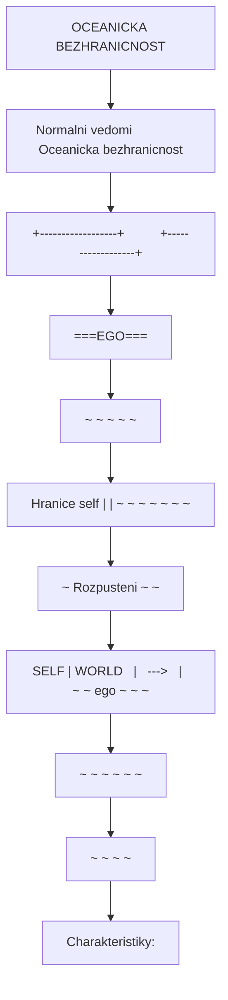

+++
title = "Mysticke zkusenosti"
description = "Fenomenologie mystickych zazitku - ego disoluce, oceanicka bezhranicnost, MEQ30 a terapeuticky vyznam v psychedelicke terapii"
weight = 1
insert_anchor_links = "right"

[taxonomies]
categories = ["fenomenologie", "psychologie", "terapie"]
tags = ["mysticka zkusenost", "ego disoluce", "oceanic boundlessness", "MEQ30", "psilocybin", "psychedelika", "spiritualita", "terapie", "DMN"]
+++

# Mysticke zkusenosti - Fenomenologie a terapeuticky vyznam

**Mysticka zkusenost** (mystical experience) predstavuje specificky stav zmenenêho vedomi charakterizovany pocity **jednoty**, **transcendence**, **noeticity** a hlubokého **vyznamu**. V kontextu psychedelicke terapie jsou tyto zazitky konzistentne spojovany s lepsimi terapeutickymi vysledky u [deprese](@/conditions/depression.md), zavislosti a existenciální úzkosti.

Historicky popisovane v nabozenských a spiritualnich tradicich vsech kultur, dnes jsou tyto stavy predmetem rigorozního vedeckeho vyzkumu s vyuzitim standardizovanych mericich nastroju jako **MEQ30** (Mystical Experience Questionnaire).

---

## Zakladni charakteristika

### Definice a klicove rysy

| Rys | Popis |
|-----|-------|
| **Jednota (Unity)** | Pocit splynutí se vším, co existuje |
| **Transcendence casu a prostoru** | Ztrata obvyklého vnímání času a místa |
| **Noetická kvalita** | Pocit hlubokého pochopení "pravdy" |
| **Posvátnost** | Úcta, bázeň, posvátný charakter zážitku |
| **Pozitivní nálada** | Extáze, klid, radost, láska |
| **Nepopsatelnost** | Obtížnost verbalizace zážitku |
| **Paradoxnost** | Pocit pochopení protikladu |

### Historicky kontext

| Tradice | Termín | Charakteristika |
|---------|--------|-----------------|
| **Křesťanská mystika** | Unio mystica | Sjednocení s Bohem |
| **Hinduismus** | Samadhi | Stav absolutní koncentrace |
| **Buddhismus** | Satori, Nirvána | Osvícení, vyhasnutí |
| **Súfismus** | Fana | Anihilace ega |
| **Taoismus** | Wu wei | Splynutí s Tao |
| **Filozofie** | Numinózní (Otto), Peak experience (Maslow) | Sekulární popisy |

---

## Fenomenologické dimenze

### Oceánická bezhraničnost (Oceanic Boundlessness)



<details>
<summary>ASCII verze diagramu</summary>

```
OCEANICKA BEZHRANICNOST

Normalni vedomi               Oceanicka bezhranicnost
+------------------+          +------------------+
|                  |          |                  |
|    [===EGO===]   |          |                  |
|        |         |          |    ~ ~ ~ ~ ~     |
|   Hranice self   |          |  ~ ~ ~ ~ ~ ~ ~   |
|        |         |          | ~ Rozpusteni ~ ~ |
|   SELF | WORLD   |   --->   |  ~ ~ ego ~ ~ ~   |
|        |         |          |   ~ ~ ~ ~ ~ ~    |
|                  |          |     ~ ~ ~ ~      |
+------------------+          +------------------+

Charakteristiky:
- Bezhranicnost
- Jednota se vsim
- Blazenost
- Transcendence
- Pozitivni zmena vnimania
```

</details>

### Ego disoluce (Ego Dissolution)

| Stupen | Popis | Fenomenologie |
|--------|-------|---------------|
| **Mirna** | Snizeny self-focus | Zmensena ruminace, vetsi openness |
| **Stredni** | Rozmlzene hranice | Nejista identita, plynutí |
| **Silna** | Ego disoluce | Ztrata pocitu "ja" |
| **Uplna** | Ego smrt | Zadne vnimaní self, jednota |

### Altered States of Consciousness (ASC) dimenze

| Dimenze | Popis | Valencea |
|---------|-------|----------|
| **Oceanic Boundlessness (OBN)** | Bezhranicnost, extaze, jednota | Pozitivni |
| **Anxious Ego Dissolution (AED)** | Uzkostná ztrata kontroly | Negativni |
| **Visionary Restructuralization (VRS)** | Halucinace, vize | Neutralni |

---

## Merici nastroje

### Mystical Experience Questionnaire (MEQ30)

**30 polozek** merících sedm faktoru:

| Faktor | Pocet položek | Priklad |
|--------|---------------|---------|
| **Internal unity** | 6 | Svoboda od omezeni osobniho self |
| **External unity** | 6 | Splynutí s okolím, "vse je jedno" |
| **Noetic quality** | 6 | Jistota pochopení ultimatni reality |
| **Sacredness** | 4 | Zazitek posvátnosti |
| **Positive mood** | 4 | Hluboký klid a mír |
| **Transcendence** | 3 | Ztrata obvykleho vnimani casu/prostoru |
| **Ineffability** | 3 | Neschopnost popsat zazítek slovy |

### Scoring a interpretace

| Skore | Interpretace |
|-------|--------------|
| **0-0.3** | Minimální mystická kvalita |
| **0.3-0.5** | Mírné mystické prvky |
| **0.5-0.7** | Významná mystická zkušenost |
| **0.7-0.85** | Silná mystická zkušenost |
| **>0.85** | "Complete" mystická zkušenost |

### Dalsi nastroje

| Nastroj | Zamereni | Pocet polozek |
|---------|----------|---------------|
| **5D-ASC** | Altered states komplexne | 94 |
| **11D-ASC** | Rozsirena verze | 42 |
| **EDI** | Ego dissolution inventory | 8 |
| **NADA** | Non-dual awareness | 10 |
| **AWE** | Awe experience | 6 |
| **Challenging Experience Q.** | Obtizne zazitky | 26 |

---

## Neurobiologicke koreláty

### 5-HT2A receptor a mystické zážitky

```mermaid
flowchart TD
    node_5HT2AAKTIVACEAMYSTIC["5-HT2A AKTIVACE A MYSTICKE ZAZITKY"]
    node_PsilocybinLSDDMT["Psilocybin/LSD/DMT"]
    node_5HT2Areceptor["5-HT2A receptor"]
    node_pyramidalnineurony["pyramidalni neurony"]
    node_0cb77c9d["+--------+--------+"]
    node_KortikalniKlaustrum["Kortikalni         Klaustrum"]
    node_dezintegraceinhibice["dezintegrace       inhibice"]
    node_DMNdezintegraceCondu["DMN dezintegrace   'Conductor'"]
    node_Entropiedysfunkce["Entropie          dysfunkce"]
    node_PREDIKTIVNIMODEL["PREDIKTIVNI MODEL"]
    node_NARUEN["NARUŠEN"]
    node_Priorbeliefsoslabeny["Prior beliefs oslabeny"]
    node_Bottomupzeslen["Bottom-up zesílen"]
    node_EGODISOLUCE["EGO DISOLUCE"]
    node_MYSTICKAZKUSENOST["MYSTICKA ZKUSENOST"]

    node_5HT2AAKTIVACEAMYSTIC --> node_PsilocybinLSDDMT
    node_PsilocybinLSDDMT --> node_5HT2Areceptor
    node_5HT2Areceptor --> node_pyramidalnineurony
    node_pyramidalnineurony --> node_0cb77c9d
    node_0cb77c9d --> node_KortikalniKlaustrum
    node_KortikalniKlaustrum --> node_dezintegraceinhibice
    node_dezintegraceinhibice --> node_DMNdezintegraceCondu
    node_DMNdezintegraceCondu --> node_Entropiedysfunkce
    node_Entropiedysfunkce --> node_PREDIKTIVNIMODEL
    node_PREDIKTIVNIMODEL --> node_NARUEN
    node_NARUEN --> node_Priorbeliefsoslabeny
    node_Priorbeliefsoslabeny --> node_Bottomupzeslen
    node_Bottomupzeslen --> node_EGODISOLUCE
    node_EGODISOLUCE --> node_MYSTICKAZKUSENOST

    click node_PsilocybinLSDDMT "/alkaloids/psilocybin/" "Psilocybin/LSD/DMT"
    click node_5HT2Areceptor "/receptors/5-ht2a/" "5-HT2A receptor"
    click node_DMNdezintegraceCondu "/circuits/dmn/" "DMN dezintegrace   "Conductor""
```

<details>
<summary>ASCII verze diagramu</summary>

```
5-HT2A AKTIVACE A MYSTICKE ZAZITKY

[Psilocybin/LSD/DMT]
        |
        v
    5-HT2A receptor
    (pyramidalni neurony)
        |
        +--------+--------+
        |                 |
        v                 v
   Kortikalni         Klaustrum
   dezintegrace       inhibice
        |                 |
        v                 v
   DMN dezintegrace   "Conductor"
   Entropie ↑         dysfunkce
        |                 |
        +--------+--------+
                 |
                 v
        PREDIKTIVNI MODEL
        NARUŠEN
                 |
                 v
        Prior beliefs oslabeny
        Bottom-up zesílen
                 |
                 v
        EGO DISOLUCE
        MYSTICKA ZKUSENOST
```

</details>

### Default Mode Network (DMN)

| Normalni stav | Psychedelicky stav |
|---------------|-------------------|
| DMN aktivni | DMN dezintegrovana |
| Self-referential thinking | Snizený self-focus |
| Čas-kontext integrace | Casová dezorientace |
| Ego-boundaries jasne | Ego disoluce |
| Autobiograficke narativi | Ztrata životního příběhu |

Viz detailne: [DMN](@/circuits/dmn.md)

### Klicove mozkove oblasti

| Oblast | Role v mystice |
|--------|----------------|
| **[Claustrum](@/brain/claustrum.md)** | "Conductor" - integrace vedomi |
| **Posteriori cingulate cortex (PCC)** | Self-reference, DMN hub |
| **Medial prefrontal cortex (mPFC)** | Self-processing |
| **[Thalamus](@/brain/thalamus.md)** | Gating of perception |
| **Insular cortex** | Interoception, self |

---

## Terapeuticky vyznam

### Mysticka zkusenost jako prediktor

```
KORELACE: MYSTICKA ZKUSENOST <-> TERAPEUTICKY VYSLEDEK

MEQ30 skore
    ^
100%|         *
    |       *   *
    |     *       *
    |   *           *
    |  *              *
    | *                 *
  0 +------------------------->
                  Snizeni deprese/úzkosti/zavislosti

Meta-analyticka data: r = 0.4-0.6
```

### Dukazy z klinickych studii

| Studie | Populace | Korelace MEQ-outcome | p-hodnota |
|--------|----------|----------------------|-----------|
| **Griffiths 2016** | Rakovina + distres | r = 0.48 | <0.001 |
| **Ross 2016** | Rakovina + úzkost | r = 0.42 | <0.01 |
| **Garcia-Romeu 2014** | Odvykani nikotinu | r = 0.55 | <0.01 |
| **Bogenschutz 2015** | Alkoholismus | r = 0.44 | <0.05 |
| **Carhart-Harris 2018** | TRD | Mediace insighty | <0.05 |

### Mechanismy terapeutickeho ucinku

| Mechanismus | Popis | Dukaz |
|-------------|-------|-------|
| **Psychological insight** | Nove pochopení self/situace | Kvalitativni studie |
| **Emotional breakthrough** | Zpracovani potlacených emoci | Mediace analyzy |
| **Meaning-making** | Novy smysl a ucel | Koreláce s wellbeing |
| **Connectedness** | Pocit propojení s ostatními | Skaly mezilidské blízkosti |
| **Neuroplastické změny** | Strukturální mozkové zmeny | fMRI, [BDNF](@/molecules/bdnf.md) |
| **Cognitive flexibility** | Snížená rigidita myšlení | Kognitivní testy |

---

## Fenomenologicke popisy

### Typicke popisy mystickych zazitku

> "Nespoutal jsem se pouze do svého tela, ale stal se vsim - kazdym atomem vesmiru. Nebyl jsem nikdy tak jisty necim jako tím, ze toto je pravda o realite."
> - Ucastnik studie, Johns Hopkins

> "Pocit absolutni lasky - ne pouze k lidem, ale ke vsemu co existuje. Jako bych pochopil, proc vubec neco je."
> - Ucastnik studie, Imperial College

### Spektrum zazitku

```mermaid
flowchart TD
    node_SPEKTRUMPSYCHEDELICK["SPEKTRUM PSYCHEDELICKYCH ZAZITKU"]
    node_PozitivnipolNegativn["Pozitivni pol                              Negativni pol"]
    node_c58d3610["+---------------+                          +---------------+"]
    node_OCENICKANXIOZNIEGO["OCEÁNICKÁ     |                          | ANXIOZNI EGO"]
    node_BEZHRANICNOSTDISOLUC["BEZHRANICNOST |                          | DISOLUCE"]
    node_ExtazePanika["- Extaze      |                          | - Panika"]
    node_JednotaZtrata["- Jednota     |                          | - Ztrata"]
    node_Laskakontroly["- Laska       |                          |   kontroly"]
    node_KlidTerror["- Klid        |                          | - Terror"]
    node_72a19e7d["+-------+-------+                          +-------+-------+"]
    node_c9470ff3["+--------------+"]
    node_INTEGRATION["+---------&gt;| INTEGRATION  |&lt;---------------+"]
    node_Terapeut["Terapeut"]
    node_Support["Support"]
    node_Setsetting["Set/setting"]
    node_TERAPEUTICKY["TERAPEUTICKY"]
    node_OUTCOME["OUTCOME"]

    node_SPEKTRUMPSYCHEDELICK --> node_PozitivnipolNegativn
    node_PozitivnipolNegativn --> node_c58d3610
    node_c58d3610 --> node_OCENICKANXIOZNIEGO
    node_OCENICKANXIOZNIEGO --> node_BEZHRANICNOSTDISOLUC
    node_BEZHRANICNOSTDISOLUC --> node_ExtazePanika
    node_ExtazePanika --> node_JednotaZtrata
    node_JednotaZtrata --> node_Laskakontroly
    node_Laskakontroly --> node_KlidTerror
    node_KlidTerror --> node_72a19e7d
    node_72a19e7d --> node_c9470ff3
    node_c9470ff3 --> node_INTEGRATION
    node_INTEGRATION --> node_Terapeut
    node_Terapeut --> node_Support
    node_Support --> node_Setsetting
    node_Setsetting --> node_TERAPEUTICKY
    node_TERAPEUTICKY --> node_OUTCOME
```



<details>
<summary>ASCII verze diagramu</summary>

```
SPEKTRUM PSYCHEDELICKYCH ZAZITKU

Pozitivni pol                              Negativni pol
+---------------+                          +---------------+
|               |                          |               |
| OCEÁNICKÁ     |                          | ANXIOZNI EGO  |
| BEZHRANICNOST |                          | DISOLUCE      |
|               |                          |               |
| - Extaze      |                          | - Panika      |
| - Jednota     |                          | - Ztrata      |
| - Laska       |                          |   kontroly    |
| - Klid        |                          | - Terror      |
|               |                          |               |
+-------+-------+                          +-------+-------+
        |                                          |
        |          +--------------+                |
        +--------->| INTEGRATION  |<---------------+
                   | Terapeut     |
                   | Support      |
                   | Set/setting  |
                   +--------------+
                          |
                          v
                   TERAPEUTICKY
                   OUTCOME
```

</details>

---

## Set and setting

### Optimalizace pro mysticke zazitky

| Faktor | Optimalizace |
|--------|--------------|
| **Intence** | Jasne formulovana, otevrena |
| **Priprava** | Psychoedukace, ocekavání |
| **Prostredi** | Bezpecne, klidne, estetické |
| **Hudba** | Specificke playlisty (klasika, ambient) |
| **Terapeuti** | Zkuseni, duveryhodní |
| **"Surrender"** | Schopnost pustit kontrolu |
| **Dávka** | Dostatecne vysoka pro mystiku |

### Doporuceni protokolu

```mermaid
flowchart TD
    node_PROTOKOLOPTIMALIZUJI["PROTOKOL OPTIMALIZUJICI MYSTICKE ZAZITKY"]
    node_PREDSEZENM["PRED SEZENÍM:"]
    node_20a73e10["+-----------------------------------+"]
    node_1Psychologickyscreen["1. Psychologicky screening"]
    node_2Budovaniterapeutick["2. Budovani terapeutickeho vztahu"]
    node_3Psychoedukaceozazit["3. Psychoedukace o zazitku"]
    node_4Formulaceintence["4. Formulace intence"]
    node_5Breathingmeditation["5. Breathing/meditation training"]
    node_BEHEMSEZEN["BEHEM SEZENÍ:"]
    node_1Klidneestetickprost["1. Klidne, estetické prostredi"]
    node_2Kvasetkyshubou["2. Kvasetky s hubou"]
    node_3Kvalitnihudba["3. Kvalitni hudba"]
    node_4Minimalniverbalniin["4. Minimalni verbalni intervence"]
    node_5Trustletgobeopen["5. 'Trust, let go, be open'"]
    node_6Kontinulnterapeutic["6. Kontinuální terapeutická"]
    node_ptomnost["přítomnost"]
    node_POSEZEN["PO SEZENÍ:"]
    node_1Imeditndebriefing["1. Imediátní debriefing"]
    node_2Integracnisezeni14x["2. Integracni sezeni 1-4x"]
    node_3Journalingumeni["3. Journaling, umeni"]
    node_4Komunitapodpora["4. Komunita/podpora"]
    node_5Implementaceinsight["5. Implementace insights"]

    node_PROTOKOLOPTIMALIZUJI --> node_PREDSEZENM
    node_PREDSEZENM --> node_20a73e10
    node_20a73e10 --> node_1Psychologickyscreen
    node_1Psychologickyscreen --> node_2Budovaniterapeutick
    node_2Budovaniterapeutick --> node_3Psychoedukaceozazit
    node_3Psychoedukaceozazit --> node_4Formulaceintence
    node_4Formulaceintence --> node_5Breathingmeditation
    node_5Breathingmeditation --> node_BEHEMSEZEN
    node_BEHEMSEZEN --> node_1Klidneestetickprost
    node_1Klidneestetickprost --> node_2Kvasetkyshubou
    node_2Kvasetkyshubou --> node_3Kvalitnihudba
    node_3Kvalitnihudba --> node_4Minimalniverbalniin
    node_4Minimalniverbalniin --> node_5Trustletgobeopen
    node_5Trustletgobeopen --> node_6Kontinulnterapeutic
    node_6Kontinulnterapeutic --> node_ptomnost
    node_ptomnost --> node_POSEZEN
    node_POSEZEN --> node_1Imeditndebriefing
    node_1Imeditndebriefing --> node_2Integracnisezeni14x
    node_2Integracnisezeni14x --> node_3Journalingumeni
    node_3Journalingumeni --> node_4Komunitapodpora
    node_4Komunitapodpora --> node_5Implementaceinsight
```



<details>
<summary>ASCII verze diagramu</summary>

```
PROTOKOL OPTIMALIZUJICI MYSTICKE ZAZITKY

PRED SEZENÍM:
+-----------------------------------+
| 1. Psychologicky screening        |
| 2. Budovani terapeutickeho vztahu |
| 3. Psychoedukace o zazitku        |
| 4. Formulace intence              |
| 5. Breathing/meditation training  |
+-----------------------------------+

BEHEM SEZENÍ:
+-----------------------------------+
| 1. Klidne, estetické prostredi    |
| 2. Kvasetky s hubou               |
| 3. Kvalitni hudba                 |
| 4. Minimalni verbalni intervence  |
| 5. "Trust, let go, be open"       |
| 6. Kontinuální terapeutická       |
|    přítomnost                     |
+-----------------------------------+

PO SEZENÍ:
+-----------------------------------+
| 1. Imediátní debriefing           |
| 2. Integracni sezeni (1-4x)       |
| 3. Journaling, umeni              |
| 4. Komunita/podpora               |
| 5. Implementace insights          |
+-----------------------------------+
```

</details>

---

## Challenging experiences

### "Bad trips" vs. difficultní zážitky

| "Bad trip" | Difficultní zazitek |
|------------|---------------------|
| Negativni terminologie | Neutralni terminologie |
| Vnímáno jako selhani | Cast procesu |
| Potlacovano | Integrovano |
| Trauma riziko | Rust potential |

### Challenging Experience Questionnaire (CEQ)

| Dimenze | Příklady |
|---------|----------|
| **Strach** | Teror, panika, paranoia |
| **Smutek** | Zal, ztráta, samota |
| **Fyzicka distres** | Nausea, tenze, bolest |
| **Insanita** | Strach z permanentniho poškození |
| **Smrt** | Pocit umirání |
| **Izolace** | Odosobneni, cizost |
| **Paranoia** | Neduvera, konspirace |

### Management obtížných zážitků

| Strategie | Aplikace |
|-----------|----------|
| **Reassurance** | "Jsi v bezpeci, toto mine" |
| **Grounding** | Kontakt, dech, reality check |
| **Surrender guidance** | "Nech to projit, nekontroluj" |
| **Hudba** | Uklidnujici playlisty |
| **Prostorova zmena** | Jiná místnost, venku |
| **Benzodiazepiny** | Rescue medication (raritne) |

---

## Vedecka debata

### Otevřené otázky

1. **Jsou mystické zážitky nutné?**
   - Data: Korelace, ne kauzace
   - Ketamin: Účinek bez plné mystiky
   - (2R,6R)-HNK: Bez subjektivních efektů

2. **Mechanismus vazby mystika-outcome?**
   - Psychologicke (insight)
   - Neurologicke (neuroplasticita)
   - Kombinace

3. **Individualni rozdily?**
   - Genetika (5-HT2A polymorfismy)
   - Osobnost (openness, absorption)
   - Připrava a setting

4. **Je možné "non-hallucinogenic" psychoplastogen?**
   - Tabernanthalog
   - ISRIB
   - Výzkum pokračuje

---

## Reference

### Fenomenologie a mereni

1. Stace, W.T. (1960). *Mysticism and Philosophy*. Macmillan.

2. Hood, R.W. (1975). *The construction and preliminary validation of a measure of reported mystical experience*. Journal for the Scientific Study of Religion.

3. Barrett, F.S. et al. (2015). *The Challenging Experience Questionnaire: Characterization of challenging experiences with psilocybin mushrooms*. Journal of Psychopharmacology.

4. Nour, M.M. et al. (2016). *Ego-dissolution and psychedelics: validation of the Ego-Dissolution Inventory (EDI)*. Frontiers in Human Neuroscience.

### Neurobiologie

5. Carhart-Harris, R.L. et al. (2012). *Neural correlates of the psychedelic state as determined by fMRI studies with psilocybin*. PNAS.

6. Smigielski, L. et al. (2019). *Psilocybin-assisted mindfulness training modulates self-consciousness and brain default mode network connectivity*. NeuroImage.

### Terapeuticky vyznam

7. Griffiths, R.R. et al. (2006). *Psilocybin can occasion mystical-type experiences having substantial and sustained personal meaning and spiritual significance*. Psychopharmacology.

8. Griffiths, R.R. et al. (2016). *Psilocybin produces substantial and sustained decreases in depression and anxiety in patients with life-threatening cancer*. Journal of Psychopharmacology.

9. Roseman, L. et al. (2018). *Quality of acute psychedelic experience predicts therapeutic efficacy of psilocybin for treatment-resistant depression*. Frontiers in Pharmacology.

10. Yaden, D.B. & Griffiths, R.R. (2021). *The Subjective Effects of Psychedelics Are Necessary for Their Enduring Therapeutic Effects*. ACS Pharmacology & Translational Science.

---

## Viz také

### Psychoaktivní látky
- [Psilocybin](@/alkaloids/psilocybin.md) - Nejzkoumanejsi psychedelikum
- [LSD](@/alkaloids/lsd.md) - Klasicke psychedelikum
- [DMT](@/alkaloids/dmt.md) - "Spirit molecule"
- [5-MeO-DMT](@/alkaloids/5-meo-dmt.md) - "God molecule"

### Receptory a neurotransmitery
- [5-HT2A receptor](@/receptors/5-ht2a.md) - Primární cíl
- [Serotonin](@/glossary/serotonin.md) - Neurotransmiter

### Neurální sítě a struktury
- [DMN](@/circuits/dmn.md) - Default mode network
- [Claustrum](@/brain/claustrum.md) - Integrace vědomí
- [Thalamus](@/brain/thalamus.md) - Gating

### Molekuly a mechanismy
- [BDNF](@/molecules/bdnf.md) - Neuroplasticita
- [Neuroplasticita](@/glossary/neuroplasticita.md) - Strukturalni zmeny

### Terapeutické aplikace
- [Deprese](@/conditions/depression.md) - Hlavni indikace
- [Set and setting](@/glossary/set-and-setting.md) - Optimalizace

---

<- Zpět na [Fenomenologie](@/phenomenology/_index.md)
