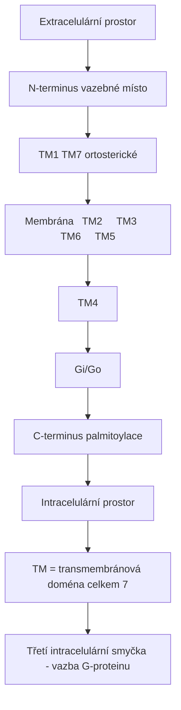
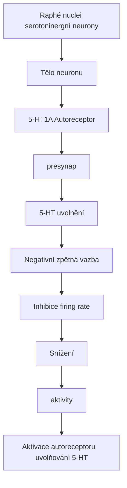
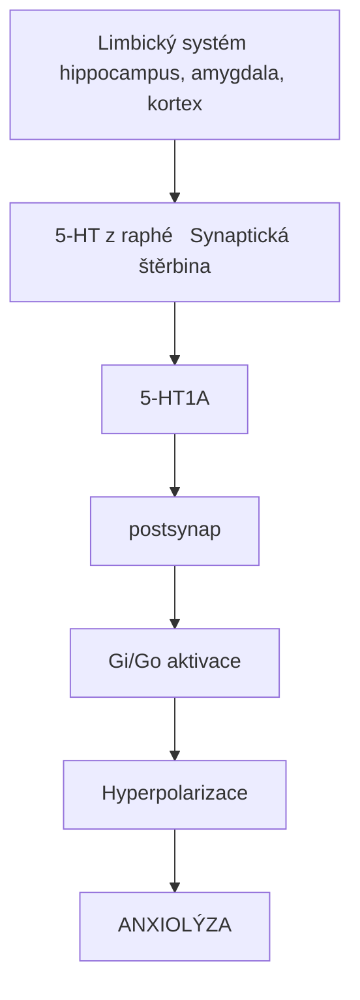
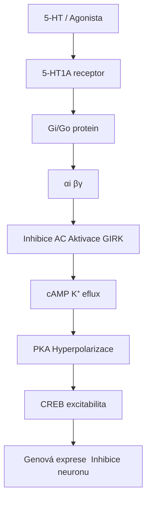
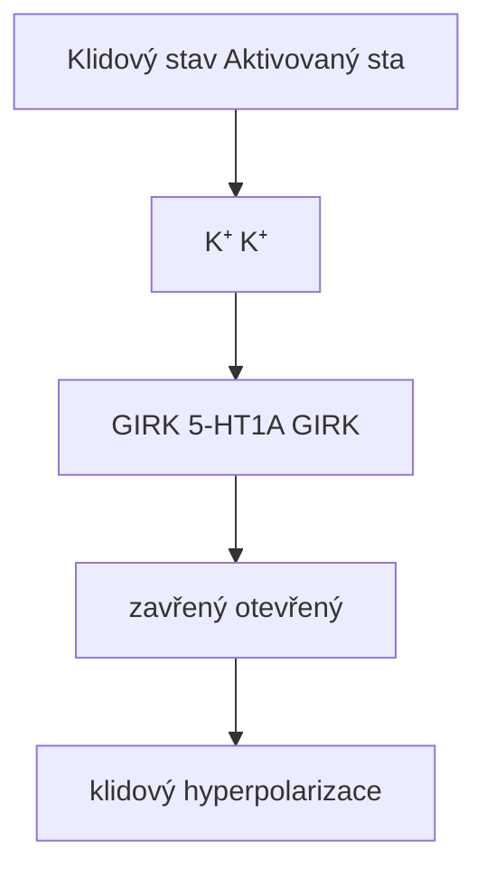
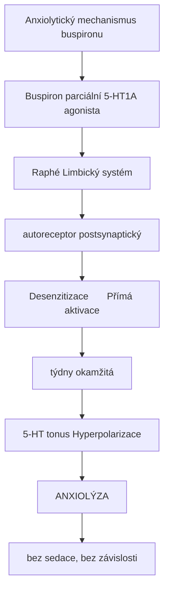
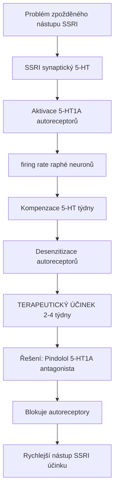
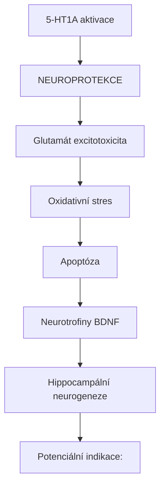
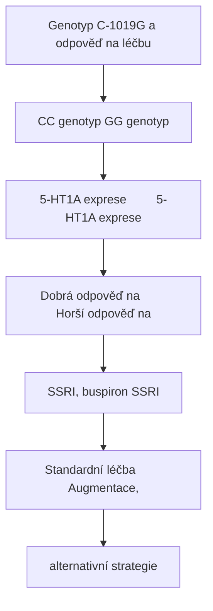
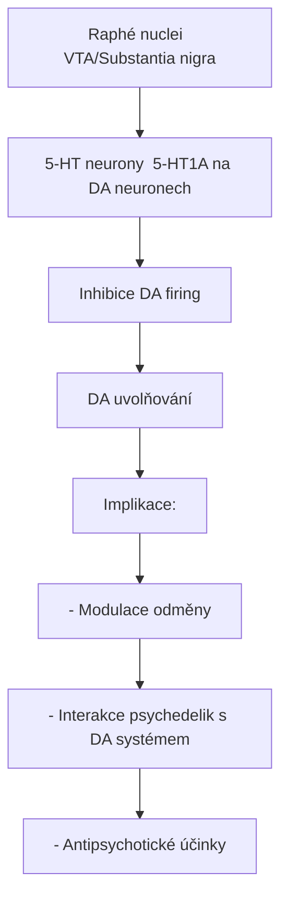

+++
title = "5-HT1A receptor"
description = "Serotoninový receptor 1A - anxiolytický autoreceptor a cíl antidepresiv"
weight = 4
insert_anchor_links = "right"

[taxonomies]
categories = ["receptory", "serotonin", "GPCR"]
tags = ["5-HT1A", "anxiolytika", "autoreceptor", "buspiron", "antidepresiva"]
+++

# 5-HT1A receptor - Strážce serotoninové rovnováhy

**5-HT1A receptor** (5-hydroxytryptamin receptor 1A) je **serotoninový receptor** patřící do rodiny G-protein spřažených receptorů (GPCR). Funguje jako **klíčový autoreceptor** regulující uvolňování serotoninu a jako **postsynaptický receptor** zprostředkovávající anxiolytické a antidepresivní účinky.

---

## Základní charakteristika

### Klasifikace

| Vlastnost | Hodnota |
|-----------|---------|
| **Rodina** | G-protein spřažené receptory (GPCR) |
| **Podrodina** | Serotoninové receptory (5-HT1) |
| **Gen** | HTR1A |
| **Chromozom** | 5q12.3 |
| **Délka** | 422 aminokyselin |
| **G-protein** | Gi/Go (inhibiční) |

### Struktura



<details>
<summary>ASCII verze diagramu</summary>

```
                    Extracelulární prostor
                           │
    N-terminus ───┬────────┼────────┬─── vazebné místo
                  │   TM1  │  TM7   │    (ortosterické)
         ┌────────┼────────┼────────┼────────┐
Membrána │  TM2   │  TM3   │  TM6   │  TM5   │
         └────────┼────────┼────────┼────────┘
                  │   TM4  │        │
                  │        │ Gi/Go  │
    C-terminus ───┴────────┴────────┴─── palmitoylace
                    Intracelulární prostor

TM = transmembránová doména (celkem 7)
Třetí intracelulární smyčka - vazba G-proteinu
```

</details>

---

## Duální funkce: Autoreceptor vs postsynaptický

### Somatodendritický autoreceptor (presynaptický)



<details>
<summary>ASCII verze diagramu</summary>

```
Raphé nuclei (serotoninergní neurony)
┌─────────────────────────────────────────────────┐
│                                                 │
│   Tělo neuronu                                  │
│        │                                        │
│   ┌────┴────┐                                   │
│   │ 5-HT1A  │ ← Autoreceptor                   │
│   │(presynap)│                                  │
│   └────┬────┘                                   │
│        │                                        │
│        ↓ 5-HT uvolnění                         │
│        │                                        │
│   ┌────┴────┐    Negativní zpětná vazba        │
│   │ ↓↓↓↓↓↓  │ ← Inhibice firing rate           │
│   │ Snížení │                                   │
│   │ aktivity│                                   │
│   └─────────┘                                   │
│                                                 │
└─────────────────────────────────────────────────┘

Aktivace autoreceptoru → ↓ uvolňování 5-HT
```

</details>

### Postsynaptický receptor



<details>
<summary>ASCII verze diagramu</summary>

```
Limbický systém (hippocampus, amygdala, kortex)
┌─────────────────────────────────────────────────┐
│                                                 │
│   5-HT z raphé →  Synaptická štěrbina          │
│                          │                      │
│                          ↓                      │
│                   ┌──────┴──────┐               │
│                   │   5-HT1A    │               │
│                   │ (postsynap) │               │
│                   └──────┬──────┘               │
│                          │                      │
│                          ↓                      │
│                   Gi/Go aktivace                │
│                          │                      │
│                          ↓                      │
│                   Hyperpolarizace               │
│                          │                      │
│                          ↓                      │
│                   ANXIOLÝZA                     │
│                                                 │
└─────────────────────────────────────────────────┘
```

</details>

---

## Distribuce v mozku

### Regionální exprese

| Oblast | Typ receptoru | Hustota | Funkce |
|--------|---------------|---------|--------|
| **Raphé nuclei** | Autoreceptor | Velmi vysoká | Regulace 5-HT uvolňování |
| **Hippocampus** | Postsynaptický | Velmi vysoká | Paměť, anxiolýza |
| **Amygdala** | Postsynaptický | Vysoká | Strach, úzkost |
| **Prefrontální kortex** | Postsynaptický | Vysoká | Kognice, nálada |
| **Entorhinal cortex** | Postsynaptický | Vysoká | Paměť |
| **Septum** | Postsynaptický | Střední | Emoce |
| **Hypothalamus** | Postsynaptický | Střední | Neuroendokrinní regulace |

### Buněčná lokalizace

| Typ neuronu | Lokalizace | Role |
|-------------|------------|------|
| **Serotoninergní (raphé)** | Soma, dendrity | Autoinhibice |
| **Pyramidové neurony** | Dendrity | Excitabilita |
| **GABAergní interneurony** | Postsynapticky | Modulace inhibice |
| **Astrocyty** | Glie | Neuromodulace |

---

## Signální dráhy

### Primární kaskáda (Gi/Go)



<details>
<summary>ASCII verze diagramu</summary>

```
5-HT / Agonista
        ↓
   5-HT1A receptor
        ↓
    Gi/Go protein
        ↓
┌───────┴───────┐
↓               ↓
αi              βγ
↓               ↓
Inhibice AC     Aktivace GIRK
↓               ↓
↓ cAMP          K⁺ eflux
↓               ↓
↓ PKA           Hyperpolarizace
↓               ↓
↓ CREB          ↓ excitabilita
↓               ↓
Genová exprese  Inhibice neuronu
```

</details>

### Sekundární dráhy

| Dráha | Mediátor | Efekt |
|-------|----------|-------|
| **GIRK kanály** | Gβγ | K⁺ proud, hyperpolarizace |
| **Ca²⁺ kanály** | Gαi | Inhibice Ca²⁺ influxu |
| **ERK/MAPK** | β-arrestin | Neuroplasticita |
| **Akt/GSK-3β** | PI3K | Neuroprotekce |

### GIRK (G-protein-gated Inwardly Rectifying K⁺) kanály



<details>
<summary>ASCII verze diagramu</summary>

```
Klidový stav              Aktivovaný stav

    K⁺                        K⁺
     ✗                         ↑
     │                         │
┌────┴────┐              ┌────┴────┐
│  GIRK   │    5-HT1A    │  GIRK   │
│ zavřený │ ──────────→  │ otevřený│
└─────────┘              └─────────┘
     │                         │
  -65 mV      →             -80 mV
(klidový)              (hyperpolarizace)
```

</details>

---

## Farmakologie

### Agonisté

| Látka | Typ | Ki (nM) | Použití |
|-------|-----|---------|---------|
| **Serotonin (5-HT)** | Plný agonista | 1-10 | Endogenní |
| **8-OH-DPAT** | Plný agonista | 0.5-2 | Výzkum |
| **Buspiron** | Parciální agonista | 20-40 | Anxiolytikum |
| **Gepiron** | Parciální agonista | 10-20 | Antidepresivum |
| **Tandospiron** | Parciální agonista | 15-30 | Anxiolytikum (Japonsko) |
| **Flesinoxan** | Plný agonista | 1-5 | Experimentální |
| **Ipsapiron** | Parciální agonista | 3-10 | Experimentální |

### Antagonisté

| Látka | Ki (nM) | Použití |
|-------|---------|---------|
| **WAY-100635** | 0.3-1 | Výzkum, PET ligand |
| **Lecozotan** | 1-3 | Experimentální (kognice) |
| **NAD-299** | 0.5-2 | Výzkum |
| **Pindolol** | 10-30 | Augmentace SSRI |

### Interakce s psychedeliky

| Látka | Aktivita na 5-HT1A | Klinický význam |
|-------|-------------------|-----------------|
| [**LSD**](@/alkaloids/lsd.md) | Parciální agonista | Anxiolytická komponenta |
| [**Psilocin**](@/alkaloids/psilocin.md) | Agonista | Snížení úzkosti |
| [**DMT**](@/alkaloids/dmt.md) | Agonista | Modulace psychedelického účinku |
| **Ayahuasca** | Agonista | Dlouhodobé anxiolytické účinky |

---

## Klinické aplikace

### Úzkostné poruchy



<details>
<summary>ASCII verze diagramu</summary>

```
Anxiolytický mechanismus buspironu
┌─────────────────────────────────────────────────┐
│                                                 │
│   Buspiron (parciální 5-HT1A agonista)         │
│              │                                  │
│   ┌──────────┴──────────┐                      │
│   ↓                     ↓                      │
│ Raphé               Limbický systém            │
│ (autoreceptor)      (postsynaptický)           │
│   │                     │                      │
│   ↓                     ↓                      │
│ Desenzitizace       Přímá aktivace            │
│ (týdny)             (okamžitá)                │
│   │                     │                      │
│   ↓                     ↓                      │
│ ↑ 5-HT tonus        Hyperpolarizace           │
│   │                     │                      │
│   └─────────┬───────────┘                      │
│             ↓                                  │
│        ANXIOLÝZA                               │
│   (bez sedace, bez závislosti)                 │
│                                                 │
└─────────────────────────────────────────────────┘
```

</details>

### Srovnání anxiolytik

| Vlastnost | Buspiron (5-HT1A) | Benzodiazepiny (GABA-A) |
|-----------|-------------------|-------------------------|
| Nástup účinku | 2-4 týdny | Minuty |
| Sedace | Minimální | Výrazná |
| Závislost | Ne | Ano |
| Tolerance | Minimální | Ano |
| Kognitivní efekty | Neutrální/pozitivní | Negativní |
| Interakce s alkoholem | Minimální | Nebezpečná |

### Deprese a SSRI augmentace



<details>
<summary>ASCII verze diagramu</summary>

```
Problém zpožděného nástupu SSRI
┌─────────────────────────────────────────────────┐
│                                                 │
│   SSRI → ↑ synaptický 5-HT                     │
│              │                                  │
│              ↓                                  │
│   Aktivace 5-HT1A autoreceptorů               │
│              │                                  │
│              ↓                                  │
│   ↓ firing rate raphé neuronů                  │
│              │                                  │
│              ↓                                  │
│   Kompenzace ↑ 5-HT (týdny)                   │
│              │                                  │
│              ↓                                  │
│   Desenzitizace autoreceptorů                 │
│              │                                  │
│              ↓                                  │
│   TERAPEUTICKÝ ÚČINEK (2-4 týdny)             │
│                                                 │
└─────────────────────────────────────────────────┘

Řešení: Pindolol (5-HT1A antagonista)
        → Blokuje autoreceptory
        → Rychlejší nástup SSRI účinku
```

</details>

---

## Neuroplasticita a neuroprotekce

### Neurotrofické účinky

| Mechanismus | Mediátor | Efekt |
|-------------|----------|-------|
| **BDNF indukce** | CREB aktivace | Neurogeneze |
| **Akt aktivace** | PI3K | Buněčné přežití |
| **GSK-3β inhibice** | Akt | Antiapoptotický |
| **Hippocampální neurogeneze** | BDNF, 5-HT | Antidepresivní |

### Neuroprotekce



<details>
<summary>ASCII verze diagramu</summary>

```
5-HT1A aktivace
      │
      ↓
┌─────────────────────────────────────────┐
│           NEUROPROTEKCE                  │
│                                          │
│   ↓ Glutamát excitotoxicita             │
│   ↓ Oxidativní stres                    │
│   ↓ Apoptóza                            │
│   ↑ Neurotrofiny (BDNF)                 │
│   ↑ Hippocampální neurogeneze           │
│                                          │
└─────────────────────────────────────────┘

Potenciální indikace:
- Ischemická mrtvice
- Neurodegenerativní onemocnění
- Traumatické poškození mozku
```

</details>

---

## Genetické varianty

### Polymorfismy HTR1A

| SNP | Pozice | Funkční efekt |
|-----|--------|---------------|
| **C-1019G** | rs6295 (promotor) | ↓ exprese (G alela) |
| **Ile28Val** | rs1799921 | Změněná funkce |
| **Arg219Leu** | rs1800044 | Změněná signalizace |

### Klinické asociace

| Varianta | Asociace |
|----------|----------|
| **C-1019G (GG)** | ↑ riziko deprese, ↓ odpověď na SSRI |
| **C-1019G (CC)** | Lepší odpověď na antidepresiva |
| **Haplotypy** | Úzkostné poruchy, sebevražedné chování |

### Implikace pro farmakogenetiku



<details>
<summary>ASCII verze diagramu</summary>

```
Genotyp C-1019G a odpověď na léčbu

CC genotyp              GG genotyp
    │                       │
    ↓                       ↓
↑ 5-HT1A exprese        ↓ 5-HT1A exprese
    │                       │
    ↓                       ↓
Dobrá odpověď na        Horší odpověď na
SSRI, buspiron          SSRI
    │                       │
    ↓                       ↓
Standardní léčba        Augmentace,
                        alternativní strategie
```

</details>

---

## Výzkumné nástroje

### Radioligandy pro PET/SPECT

| Ligand | Typ | Vlastnosti |
|--------|-----|------------|
| **[11C]WAY-100635** | Antagonista | Zlatý standard PET |
| **[18F]MPPF** | Antagonista | Delší poločas |
| **[11C]CUMI-101** | Agonista | Detekuje funkční receptory |
| **[18F]F15599** | Agonista | Vysoká selektivita |

### In vivo markery

| Metoda | Aplikace |
|--------|----------|
| **Neuroendokrinní testy** | Odpověď prolaktinu, kortizolu na 8-OH-DPAT |
| **Hypotermie** | Aktivace presynaptických 5-HT1A |
| **fMRI** | Funkční aktivace po agonistech |

---

## Interakce s jinými systémy

### 5-HT1A a dopamin



<details>
<summary>ASCII verze diagramu</summary>

```
Raphé nuclei → VTA/Substantia nigra
┌─────────────────────────────────────────────────┐
│                                                 │
│   5-HT neurony → 5-HT1A na DA neuronech        │
│                       │                         │
│                       ↓                         │
│              Inhibice DA firing                │
│                       │                         │
│                       ↓                         │
│              ↓ DA uvolňování                   │
│                                                 │
│   Implikace:                                   │
│   - Modulace odměny                            │
│   - Interakce psychedelik s DA systémem       │
│   - Antipsychotické účinky                     │
│                                                 │
└─────────────────────────────────────────────────┘
```

</details>

### 5-HT1A a HPA osa

| Efekt | Mechanismus | Klinický význam |
|-------|-------------|-----------------|
| ↓ CRH | Hypothalamická 5-HT1A | Snížení stresu |
| ↓ ACTH | Hypofyzární regulace | Anxiolýza |
| ↓ Kortizol | Adrenální regulace | Antidepresivní |

---

## Srovnání serotoninových receptorů

| Receptor | G-protein | Efekt | Hlavní funkce |
|----------|-----------|-------|---------------|
| **5-HT1A** | Gi/Go | Inhibiční | Anxiolýza, autoreceptor |
| **5-HT1B** | Gi/Go | Inhibiční | Vazokonstrikce, autoreceptor |
| [**5-HT2A**](@/receptors/5-ht2a.md) | Gq/11 | Excitační | Halucinace, plasticita |
| [**5-HT2B**](@/receptors/5-ht2b.md) | Gq/11 | Excitační | Kardiovaskulární |
| [**5-HT2C**](@/receptors/5-ht2c.md) | Gq/11 | Excitační | Apetit, nálada |

---

## Terapeutický potenciál

### Současné indikace

| Indikace | Látka | Status |
|----------|-------|--------|
| **GAD** | Buspiron | Schváleno |
| **Deprese (augmentace)** | Pindolol | Off-label |
| **Úzkost u deprese** | Vilazodone | Schváleno |

### Vyvíjené terapie

| Indikace | Přístup | Fáze |
|----------|---------|------|
| **Alzheimerova choroba** | 5-HT1A agonisté | II |
| **Parkinsonova choroba** | 5-HT1A pro dyskineze | II |
| **Neuroprotekce** | Selektivní agonisté | Preklinická |
| **Psychedelická terapie** | Kombinace s 5-HT2A | Výzkum |

---

## Reference

1. Albert, P.R. & Bhatt, S. (2015). *Serotonin-1A Receptor Regulation of G Protein-Coupled Signaling*. Handbook of Behavioral Neuroscience.
2. Garcia-Garcia, A.L. et al. (2014). *Serotonin-1A Receptors in the Brain: Beyond Anxiety*. Neuroscience.
3. Blier, P. & Ward, N.M. (2003). *Is there a role for 5-HT1A agonists in the treatment of depression?* Biological Psychiatry.
4. Newman-Tancredi, A. (2011). *Biased agonism at serotonin 5-HT1A receptors: Preferential postsynaptic activity for improved therapy of CNS disorders*. Neuropsychiatry.

---

Viz také:
- [5-HT2A receptor](@/receptors/5-ht2a.md) - Primární cíl psychedelik
- [5-HT2C receptor](@/receptors/5-ht2c.md) - Modulace apetitu a nálady
- [GABA-A receptor](@/receptors/gaba-a.md) - Alternativní anxiolytický cíl
- [LSD](@/alkaloids/lsd.md) - Parciální 5-HT1A agonista
- [Psilocybin](@/alkaloids/psilocybin.md) - Anxiolytické účinky via 5-HT1A
- [Glosář](@/glossary/_index.md) - Definice pojmů

<- Zpět na [Receptory](@/receptors/_index.md) | [5-HT2A receptor](@/receptors/5-ht2a.md) ->
