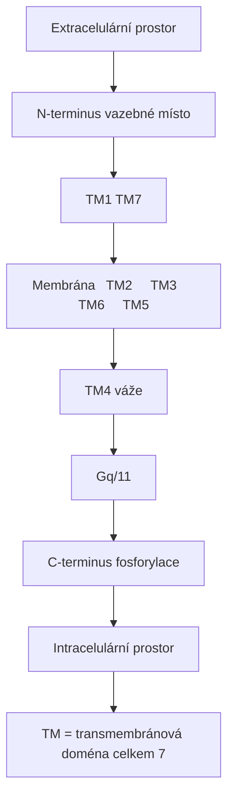
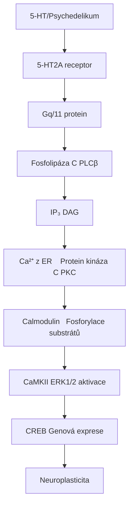
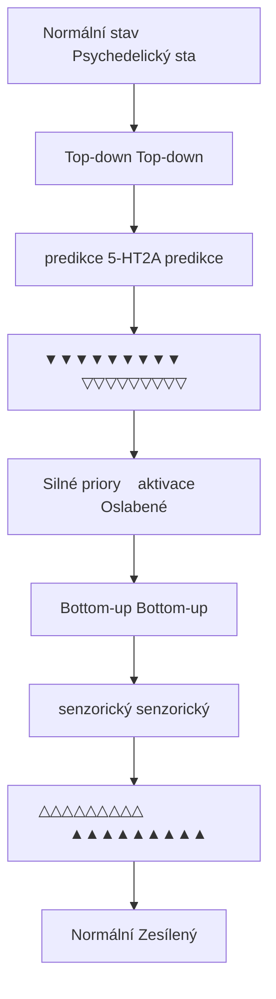
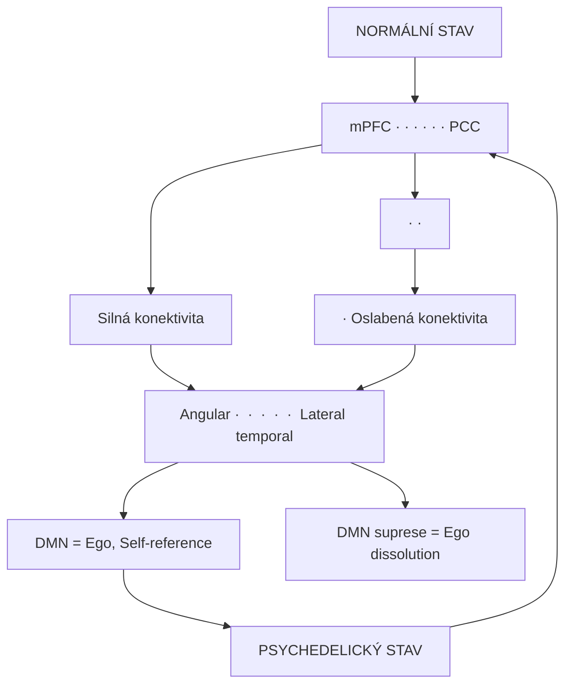
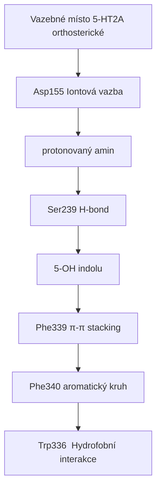
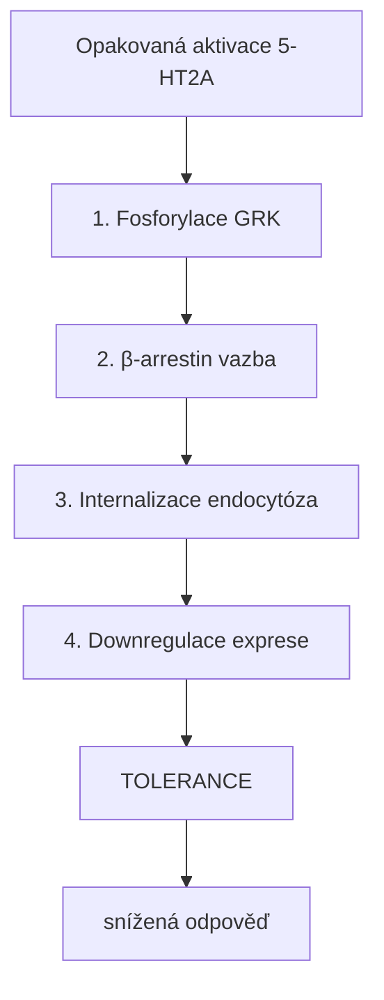

+++
title = "5-HT2A receptor"
description = "Serotoninový receptor 2A - primární cíl klasických psychedelik"
weight = 1
insert_anchor_links = "right"
+++

# 5-HT2A receptor - Brána do psychedelického stavu

**5-HT2A receptor** (5-hydroxytryptamin receptor 2A) je **[serotoninový receptor](@/glossary/serotonin.md)** patřící do rodiny G-protein spřažených [receptorů](@/glossary/receptor.md) (GPCR). Je **primárním molekulárním cílem** klasických [psychedelik](@/glossary/psychedelikum.md) jako [LSD](@/alkaloids/lsd.md), [psilocybin](@/alkaloids/psilocybin.md) a [DMT](@/alkaloids/dmt.md), které mají strukturní podobnost s endogenním neurotransmiterem [serotoninem](@/glossary/serotonin.md).

---

## Základní charakteristika

### Klasifikace

| Vlastnost | Hodnota |
|-----------|---------|
| **Rodina** | G-protein spřažené receptory (GPCR) |
| **Podrodina** | Serotoninové receptory |
| **Gen** | HTR2A |
| **Chromozom** | 13q14.2 |
| **Délka** | 471 aminokyselin |
| **G-protein** | Gq/11 |

### Struktura



<details>
<summary>ASCII verze diagramu</summary>

```
                    Extracelulární prostor
                           │
    N-terminus ───┬────────┼────────┬─── vazebné místo
                  │   TM1  │  TM7   │
         ┌────────┼────────┼────────┼────────┐
Membrána │  TM2   │  TM3   │  TM6   │  TM5   │
         └────────┼────────┼────────┼────────┘
                  │   TM4  │  váže  │
                  │        │ Gq/11  │
    C-terminus ───┴────────┴────────┴─── fosforylace
                    Intracelulární prostor

TM = transmembránová doména (celkem 7)
```

</details>

---

## Distribuce v mozku

### Hustota exprese

| Oblast | Relativní hustota | Funkce | Psychedelický efekt |
|--------|-------------------|--------|-------------------|
| **[Prefrontální kortex](@/brain/prefrontal-cortex.md)** | Velmi vysoká | Kognice, rozhodování | [REBUS efekt](@/brain/prefrontal-cortex.md#rebus-model), ego dissoluce |
| **[Vizuální kortex](@/brain/visual-cortex.md)** | Velmi vysoká | Vizuální zpracování | Vizuální halucinace, pattern enhancement |
| **[Claustrum](@/brain/claustrum.md)** | Vysoká | Integrace vědomí | Změna vnímání reality |
| **[Hippocampus](@/brain/hippocampus.md)** | Střední | Paměť, navigace | Neuroplasticita, [léčba deprese](@/conditions/depression.md) |
| **[Amygdala](@/brain/amygdala.md)** | Střední | Emoce, strach | Snížená aktivita, anxiolýza |
| **Nucleus accumbens** | Nízká | Odměna | Změněné reward processing |
| **[Raphe nuclei](@/brain/raphe-nuclei.md)** | Nízká | Regulace serotoninu | Feedback inhibice |

### Buněčná lokalizace

| Typ neuronu | Vrstva kortexu | Role |
|-------------|----------------|------|
| **Pyramidové neurony** | Vrstva V | Výstupní signály |
| **Interneurony** | Vrstva II/III | Lokální inhibice |
| **Apikální dendrity** | Vrstva I | Integrace signálů |

---

## Signální dráhy

### Primární kaskáda (Gq/11)



<details>
<summary>ASCII verze diagramu</summary>

```
5-HT/Psychedelikum
        ↓
   5-HT2A receptor
        ↓
    Gq/11 protein
        ↓
   Fosfolipáza C (PLCβ)
        ↓
┌───────┴───────┐
↓               ↓
IP₃             DAG
↓               ↓
Ca²⁺ z ER    Protein kináza C (PKC)
↓               ↓
Calmodulin   Fosforylace substrátů
↓               ↓
CaMKII       ERK1/2 aktivace
↓               ↓
CREB         Genová exprese
↓               ↓
Neuroplasticita
```

</details>

### Sekundární dráhy

| Dráha | Mediátor | Efekt |
|-------|----------|-------|
| **β-arrestin 2** | Internalizace | Desenzitizace receptoru |
| **Src kináza** | ERK aktivace | Synaptická plasticita |
| **Akt/GSK-3β** | Metabolismus | Buněčné přežití |
| **PLA₂** | Kyselina arachidonová | Neuromodulace |

### Funkční selektivita (Biased agonism)

Různé ligandy aktivují různé signální dráhy:

| Ligand | Gq/11 | β-arrestin | Klinický profil |
|--------|-------|------------|-----------------|
| **Serotonin** | +++ | +++ | Endogenní |
| **LSD** | +++ | + | Dlouhé trvání |
| **Psilocin** | ++ | ++ | Kratší účinek |
| **DOI** | +++ | ++ | Výzkumný nástroj |
| **Lisurid** | + | ++ | Bez halucinací |

---

## Psychedelický mechanismus

### Hypotéza REBUS

**REBUS** (Relaxed Beliefs Under Psychedelics) model:



<details>
<summary>ASCII verze diagramu</summary>

```
Normální stav                    Psychedelický stav
┌─────────────────┐              ┌─────────────────┐
│   Top-down      │              │   Top-down      │
│   predikce      │   5-HT2A     │   predikce      │
│   ▼▼▼▼▼▼▼▼▼     │ ──────────→ │   ▽▽▽▽▽▽▽▽▽     │
│   Silné priory  │  aktivace    │   Oslabené      │
└─────────────────┘              └─────────────────┘
        │                                │
        ↓                                ↓
┌─────────────────┐              ┌─────────────────┐
│   Bottom-up     │              │   Bottom-up     │
│   senzorický    │              │   senzorický    │
│   △△△△△△△△△     │              │   ▲▲▲▲▲▲▲▲▲     │
│   Normální      │              │   Zesílený      │
└─────────────────┘              └─────────────────┘
```

</details>

### Neuronální efekty

| Efekt | Mechanismus | Důsledek |
|-------|-------------|----------|
| **Zvýšená excitabilita** | Depolarizace pyramidových neuronů | Zvýšená aktivita |
| **Desynchronizace** | Narušení alfa oscilací | Změněné vědomí |
| **Zvýšená entropie** | Snížení hierarchické organizace | Kreativita |
| **DMN suprese** | Snížení connectivity | Ego-dissoluce |

### Default Mode Network (DMN)



<details>
<summary>ASCII verze diagramu</summary>

```
┌─────────────────────────────────────────────────┐
│               NORMÁLNÍ STAV                      │
│                                                  │
│    mPFC ←──────────────→ PCC                    │
│      ↑                     ↑                     │
│      │    Silná konektivita│                    │
│      ↓                     ↓                     │
│   Angular ←─────────────→ Lateral temporal      │
│                                                  │
│          DMN = Ego, Self-reference              │
└─────────────────────────────────────────────────┘

┌─────────────────────────────────────────────────┐
│            PSYCHEDELICKÝ STAV                    │
│                                                  │
│    mPFC ·  ·  ·  ·  ·  ·  PCC                   │
│      ·                     ·                     │
│      ·   Oslabená konektivita                   │
│      ·                     ·                     │
│   Angular ·  ·  ·  ·  ·  Lateral temporal       │
│                                                  │
│        DMN suprese = Ego dissolution            │
└─────────────────────────────────────────────────┘
```

</details>

---

## Ligandy 5-HT2A receptoru

### Agonisté (psychedelika)

| Látka | Ki (nM) | Eficacia | Trvání | Zdroj | Terapeutické použití |
|-------|---------|----------|--------|-------|---------------------|
| [**LSD**](@/alkaloids/lsd.md) | 1-2 | Vysoká | 8-12 h | Syntetický | Experimentální ([deprese](@/conditions/depression.md), úzkost) |
| [**Psilocin**](@/alkaloids/psilocin.md) | 6-15 | Střední | 4-6 h | [Psilocybinové houby](@/shrooms/psilocybes/_index.md) | [Rezistentní deprese](@/conditions/depression.md), [závislosti](@/conditions/addiction.md) |
| [**Psilocybin**](@/alkaloids/psilocybin.md) | 25-50 (prodrug) | Střední | 4-6 h | [Psilocybe species](@/shrooms/psilocybes/_index.md) | FDA Breakthrough ([deprese](@/conditions/depression.md)) |
| [**DMT**](@/alkaloids/dmt.md) | 75-130 | Střední | 15-60 min | Endogenní, [Ayahuasca](@/preparations/ayahuasca.md) | Experimentální (deprese, PTSD) |
| [**Meskalin**](@/alkaloids/mescaline.md) | 5000+ | Nízká | 8-12 h | Kaktusy | Tradiční ceremonální |
| [**5-MeO-DMT**](@/alkaloids/5-meo-dmt.md) | 180-250 | Střední | 30-60 min | Endogenní, žáby | Experimentální ([deprese](@/conditions/depression.md)) |
| **DOI** | 0.6 | Vysoká | 12-24 h | Syntetický | Výzkumný nástroj |
| **25I-NBOMe** | 0.04 | Velmi vysoká | 6-10 h | Syntetický | Nebezpečný (kardiotoxicita) |

### Antagonisté

| Látka | Ki (nM) | Použití |
|-------|---------|---------|
| **Ketanserin** | 2 | Výzkum, antihypertenzivum |
| **Risperidon** | 0.5 | Antipsychotikum |
| **Olanzapin** | 4 | Antipsychotikum |
| **Cyproheptadin** | 2 | Antihistaminikum |

### Inverzní agonisté

| Látka | Účinek |
|-------|--------|
| **Pimavanserin** | Léčba Parkinsonovy psychózy |
| **Nelotanserin** | Výzkum spánku |

---

## Struktura vazebného místa

### Klíčové aminokyseliny



<details>
<summary>ASCII verze diagramu</summary>

```
Vazebné místo 5-HT2A (orthosterické)
┌────────────────────────────────────┐
│                                    │
│   Asp155 ─── Iontová vazba         │
│      │       (protonovaný amin)    │
│      │                             │
│   Ser239 ─── H-bond                │
│      │       (5-OH indolu)         │
│      │                             │
│   Phe339 ─── π-π stacking          │
│   Phe340     (aromatický kruh)     │
│                                    │
│   Trp336 ─── Hydrofobní interakce  │
│                                    │
└────────────────────────────────────┘
```

</details>

### Konformační stavy

| Stav | Ligand | Signalizace |
|------|--------|-------------|
| **R (aktivní)** | Agonista | Plná Gq aktivace |
| **R* (částečně aktivní)** | Parciální agonista | Částečná aktivace |
| **R⁰ (bazální)** | Bez ligandu | Konstitutivní aktivita |
| **R' (inaktivní)** | Antagonista | Žádná aktivace |
| **R'' (inverzní)** | Inverzní agonista | Snížená bazální aktivita |

---

## Regulace a desenzitizace

### Mechanismy tolerance



<details>
<summary>ASCII verze diagramu</summary>

```
Opakovaná aktivace 5-HT2A
           ↓
┌──────────────────────────────────┐
│  1. Fosforylace (GRK)            │
│           ↓                      │
│  2. β-arrestin vazba             │
│           ↓                      │
│  3. Internalizace (endocytóza)   │
│           ↓                      │
│  4. Downregulace exprese         │
└──────────────────────────────────┘
           ↓
      TOLERANCE
   (snížená odpověď)
```

</details>

### Časový průběh tolerance

| Fáze | Čas | Mechanismus |
|------|-----|-------------|
| **Akutní** | Minuty | Fosforylace |
| **Krátkodobá** | Hodiny | Internalizace |
| **Dlouhodobá** | Dny | Downregulace |
| **Zotavení** | 1-2 týdny | Resyntéza receptorů |

---

## Genetické varianty

### Polymorfismy HTR2A

| SNP | Pozice | Efekt |
|-----|--------|-------|
| **His452Tyr** | rs6314 | Snížená signalizace |
| **T102C** | rs6313 | Změněná exprese |
| **A-1438G** | rs6311 | Promotorová aktivita |

### Klinické asociace

| Varianta | Asociace |
|----------|----------|
| His452Tyr | Odpověď na antipsychotika |
| T102C | Riziko schizofrenie |
| A-1438G | Odpověď na SSRI |

---

## Terapeutické aplikace

### Psychedeliky asistovaná psychoterapie

| Indikace | Látka | Mechanismus | Klinický status |
|----------|-------|-------------|-----------------|
| **[Deprese](@/conditions/depression.md)** | [Psilocybin](@/alkaloids/psilocybin.md) | Neuroplasticita, [DMN](@/circuits/dmn.md) reset | FDA Breakthrough, Phase III |
| **PTSD** | [MDMA](@/alkaloids/mdma.md) (+ 5-HT2A) | Emoční zpracování | Schváleno FDA 2024 |
| **[Závislosti](@/conditions/addiction.md)** | [Psilocybin](@/alkaloids/psilocybin.md) | Narušení habituálních vzorců | Phase II studie |
| **OCD** | [Psilocybin](@/alkaloids/psilocybin.md) | Snížení rigidity | Preklinické |
| **Existenciální úzkost** | [Psilocybin](@/alkaloids/psilocybin.md) | [Mystické zážitky](@/phenomenology/mystical-experiences.md) | Phase II |
| **[Chronická bolest](@/conditions/pain.md)** | [LSD](@/alkaloids/lsd.md) | Modulace nociceptivních drah | Experimentální |

### Fáze klinických studií

| Látka | Indikace | Fáze | Status |
|-------|----------|------|--------|
| Psilocybin | Rezistentní deprese | III | Pokračuje |
| Psilocybin | Alkoholismus | II | Pozitivní výsledky |
| LSD | Úzkost | II | Pokračuje |
| DMT | Deprese | I/II | Začíná |

---

## Výzkumné nástroje

### Radioligandy pro PET

| Ligand | Vlastnosti |
|--------|------------|
| **[¹¹C]MDL 100907** | Vysoká selektivita |
| **[¹⁸F]Altanserin** | Delší poločas |
| **[¹¹C]Cimbi-36** | Agonistický radioligand |

### In vitro metody

| Metoda | Využití |
|--------|---------|
| Vazebné eseje | Afinita ligandů |
| Funkční eseje (Ca²⁺, IP₃) | Eficacia |
| BRET/FRET | Konformační změny |
| Cryo-EM | Strukturní biologie |

---

## Srovnání se serotoninovou rodinou

| Receptor | G-protein | Funkce | Ligandy |
|----------|-----------|--------|---------|
| **5-HT1A** | Gi/o | Anxiolýza, autoreceptor | Buspiron |
| **5-HT2A** | Gq/11 | Halucinace, plasticita | Psychedelika |
| **5-HT2B** | Gq/11 | Kardiovaskulární | (Problematický) |
| **5-HT2C** | Gq/11 | Apetit, nálada | Lorcaserin |
| **5-HT3** | Iontový kanál | Nauzea | Ondansetron |

---

## Reference

1. Nichols, D.E. (2016). *Psychedelics*. Pharmacological Reviews.
2. Carhart-Harris, R.L. & Friston, K.J. (2019). *REBUS and the anarchic brain: Toward a unified model of the brain action of psychedelics*. Pharmacological Reviews.
3. Wacker, D. et al. (2017). *Crystal structure of an LSD-bound human serotonin receptor*. Cell.
4. Vollenweider, F.X. & Preller, K.H. (2020). *Psychedelic drugs: neurobiology and potential for treatment of psychiatric disorders*. Nature Reviews Neuroscience.

---

## Detailni signalni kaskady a kinetika

Pro kompletni kvantitativni analyzu 5-HT2A signalizace viz sekce [Mechanismy ucinku](@/mechanisms/_index.md):

### Kvantitativni vazebna kinetika vsech ligandu

| Ligand | Ki (nM) | kon (M^-1 s^-1) | koff (s^-1) | Rezid. cas (s) | deltaG (kJ/mol) |
|--------|---------|-----------------|-------------|-----------------|-----------------|
| **LSD** | 1-2 | ~10^7 | ~10^-4 | >1000 | -53 |
| **Psilocin** | 6-20 | ~10^6 | ~10^-2 | ~100 | -44 |
| **DMT** | 75-130 | ~10^5 | ~10^-1 | ~10 | -40 |
| **Meskalin** | 5000+ | ~10^4 | ~1 | ~1 | -30 |
| **DOI** | 0.6 | ~10^7 | ~10^-5 | >10000 | -56 |
| **Serotonin** | 100-300 | ~10^7 | ~10^-1 | ~10 | -37 |

Podrobnosti: [Receptorova kinetika](@/mechanisms/receptor-binding.md) -- termodynamika, SAR, Hill rovnice, receptor occupancy modely

### Kompletni signalni kaskada s casovym prubehem

```
CASOVY PRUBEH 5-HT2A SIGNALIZACE

Cas:        ms      s       min      h        dny
            |       |       |        |        |
Gq/11:     [====]   |       |        |        |
PLCbeta:    [=====]  |       |        |        |
Ca2+:        [========]      |        |        |
PKC:          [=========]   |        |        |
ERK1/2:                [========]     |        |
CREB:                     [========]  |        |
IEG (c-Fos):                 [=======]|        |
BDNF mRNA:                      [=========]   |
BDNF protein:                         [=========]
Dendrit. zmeny:                              [========]
```

Podrobnosti: [Signalni transdukce](@/mechanisms/signal-transduction.md) -- biased agonismus, beta-arrestin, mTOR, BDNF-TrkB

### Alostericka modulace 5-HT2A

5-HT2A je soucasti heterodimeru s mGluR2, coz moduluje signalizaci psychedelik:

- mGluR2 aktivace **snizuje** psychedelicky ucinek (Gq antagonismus pres Gi)
- mGluR2 antagonismus **potencuje** 5-HT2A signalizaci
- Terapeuticke implikace: mGluR2 PAM jako adjuvantni terapie

Podrobnosti: [Alostericka modulace](@/mechanisms/allosteric-modulation.md) -- heterodimer, PAM/NAM, MWC model

---

## Viz také

### Alkaloid agonisté 5-HT2A
- [Psilocybin](@/alkaloids/psilocybin.md) - Terapeuticky nejslibnejši psychedelikum
- [LSD](@/alkaloids/lsd.md) - Nejvíce prostudovaný 5-HT2A agonista
- [DMT](@/alkaloids/dmt.md) - Endogenní psychedelikum
- [5-MeO-DMT](@/alkaloids/5-meo-dmt.md) - Silné mystické efekty
- [Psilocin](@/alkaloids/psilocin.md) - Aktivní metabolit psilocybinu
- [Meskalin](@/alkaloids/mescaline.md) - Nejstarší známé psychedelikum

### Cílové mozkové oblasti
- [Prefrontální kortex](@/brain/prefrontal-cortex.md) - Centrum REBUS efektu
- [Vizuální kortex](@/brain/visual-cortex.md) - Zdroj vizuálních halucinací
- [Claustrum](@/brain/claustrum.md) - Integrace vědomí
- [Hippocampus](@/brain/hippocampus.md) - Neuroplasticita, paměť
- [Amygdala](@/brain/amygdala.md) - Emoční modulace

### Terapeutické indikace
- [Deprese](@/conditions/depression.md) - Hlavní klinická aplikace
- [Závislosti](@/conditions/addiction.md) - Narušení habituálních vzorců
- [Chronická bolest](@/conditions/pain.md) - Experimentální léčba

### Mechanismy a fenomenologie
- [DMN](@/circuits/dmn.md) - Default Mode Network dysregulace
- [Mystické zážitky](@/phenomenology/mystical-experiences.md) - Prediktor terapeutického efektu
- [Neuroplasticita](@/glossary/neuroplasticita.md) - Základ dlouhodobých efektů
- [Set and setting](@/glossary/set-and-setting.md) - Optimalizace účinku

### Serotonin systém
- [5-HT1A receptor](@/receptors/5-ht1a.md) - Anxiolytický serotoninový receptor
- [5-HT2C receptor](@/receptors/5-ht2c.md) - Modulační receptor
- [Serotonin](@/glossary/serotonin.md) - Neurotransmiter
- [Raphe nuclei](@/brain/raphe-nuclei.md) - Centrum serotoninu

### Mechanismy účinku
- [Mechanismy účinku](@/mechanisms/_index.md) - Kompletní přehled
- [Receptorová kinetika](@/mechanisms/receptor-binding.md) - Ki, Kd, vazebná termodynamika
- [Signální transdukce](@/mechanisms/signal-transduction.md) - Gq, β-arrestin, mTOR dráhy
- [Alosterická modulace](@/mechanisms/allosteric-modulation.md) - mGluR2-5-HT2A heterodimer
- [PK-PD vztahy](@/mechanisms/pharmacokinetic-pharmacodynamic.md) - Receptor occupancy a klinický účinek

<- Zpet na [Receptory](@/receptors/_index.md) | [GABA-A receptor](@/receptors/gaba-a.md) ->
