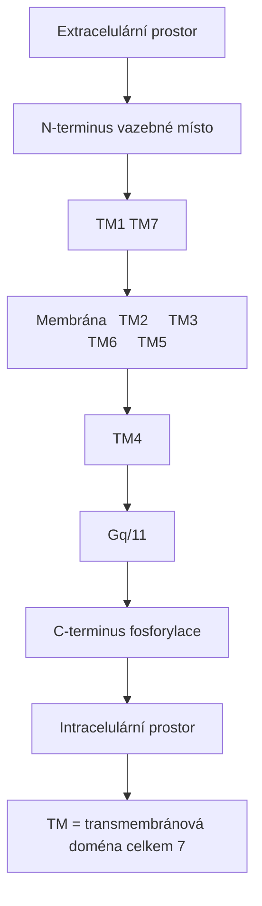
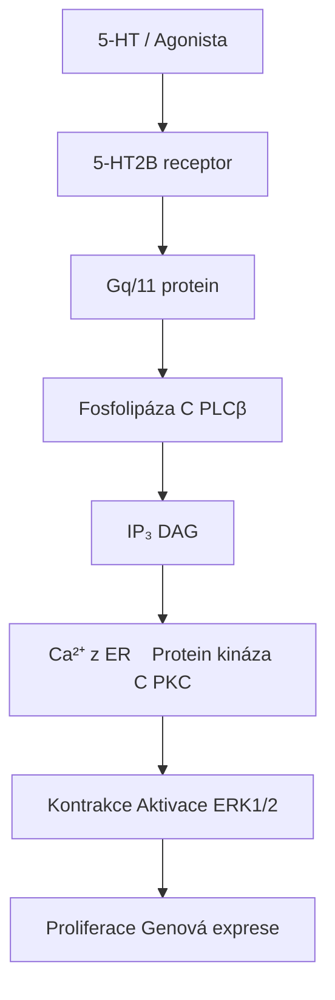
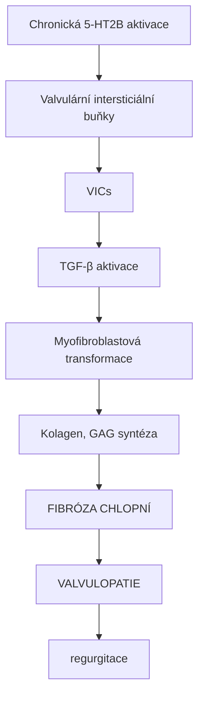
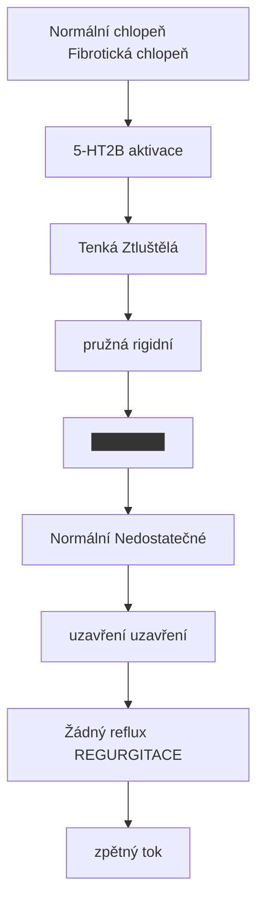
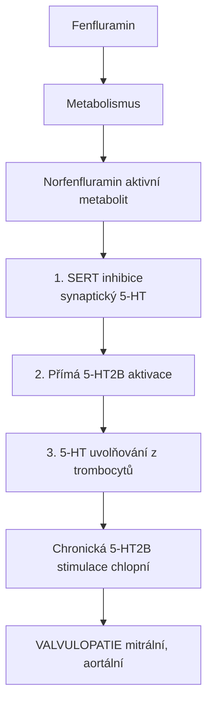
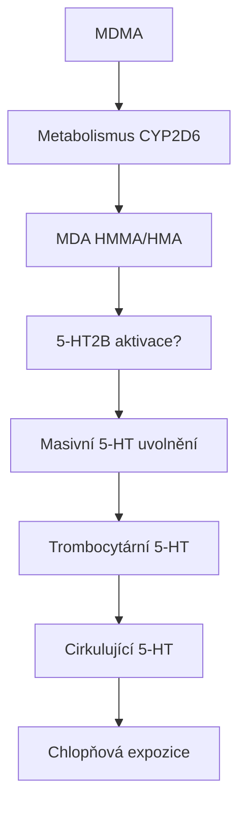
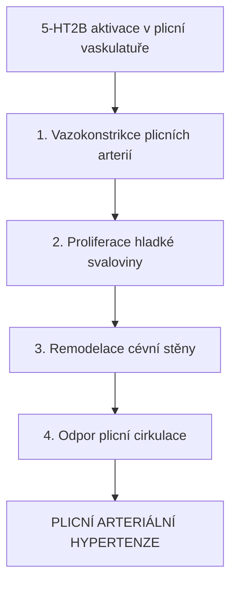
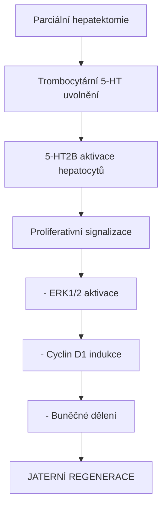
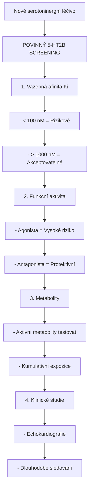

+++
title = "5-HT2B receptor"
description = "Serotoninový receptor 2B - kardiovaskulární regulace a riziko valvulopatie"
weight = 5
insert_anchor_links = "right"

[taxonomies]
categories = ["receptory", "serotonin", "GPCR"]
tags = ["5-HT2B", "kardiotoxicita", "valvulopatie", "fenfluramin", "MDMA"]
+++

# 5-HT2B receptor - Kardiovaskulární strážce a rizikový faktor

**5-HT2B receptor** je serotoninový receptor z rodiny GPCR, který hraje klíčovou roli v **kardiovaskulárním systému**, zejména v regulaci srdečních chlopní. Jeho aktivace je spojena s **valvulopatií** (poškozením srdečních chlopní), což vedlo ke stažení několika léčiv z trhu. Pochopení tohoto receptoru je zásadní pro bezpečnost serotoninergních látek.

---

## Základní charakteristika

### Klasifikace

| Vlastnost | Hodnota |
|-----------|---------|
| **Rodina** | G-protein spřažené receptory (GPCR) |
| **Podrodina** | Serotoninové receptory (5-HT2) |
| **Gen** | HTR2B |
| **Chromozom** | 2q37.1 |
| **Délka** | 481 aminokyselin |
| **G-protein** | Gq/11 (excitační) |

### Struktura



<details>
<summary>ASCII verze diagramu</summary>

```
                    Extracelulární prostor
                           │
    N-terminus ───┬────────┼────────┬─── vazebné místo
                  │   TM1  │  TM7   │
         ┌────────┼────────┼────────┼────────┐
Membrána │  TM2   │  TM3   │  TM6   │  TM5   │
         └────────┼────────┼────────┼────────┘
                  │   TM4  │        │
                  │        │ Gq/11  │
    C-terminus ───┴────────┴────────┴─── fosforylace
                    Intracelulární prostor

TM = transmembránová doména (celkem 7)
```

</details>

---

## Distribuce v organismu

### Periferní exprese (primární)

| Tkáň | Exprese | Funkce |
|------|---------|--------|
| **Srdeční chlopně** | Velmi vysoká | Proliferace fibroblastů |
| **Myokard** | Vysoká | Kontraktilita, hypertrofie |
| **Plicní vaskulatura** | Vysoká | Vasokonstrikce |
| **Střevo** | Vysoká | Motilita, sekrece |
| **Endotel** | Střední | Vazodilatace (NO) |
| **Játra** | Střední | Regenerace |

### Centrální exprese (sekundární)

| Oblast | Exprese | Funkce |
|--------|---------|--------|
| **Cerebellum** | Nízká-střední | Neuromodulace |
| **Amygdala** | Nízká | Emoce |
| **Hypothalamus** | Nízká | Neuroendokrinní |
| **Dorsální raphé** | Nízká | Serotoninová regulace |

---

## Signální dráhy

### Primární kaskáda (Gq/11)



<details>
<summary>ASCII verze diagramu</summary>

```
5-HT / Agonista
        ↓
   5-HT2B receptor
        ↓
    Gq/11 protein
        ↓
   Fosfolipáza C (PLCβ)
        ↓
┌───────┴───────┐
↓               ↓
IP₃             DAG
↓               ↓
Ca²⁺ z ER    Protein kináza C (PKC)
↓               ↓
Kontrakce    Aktivace ERK1/2
↓               ↓
Proliferace  Genová exprese
```

</details>

### Patologická signalizace (valvulopatie)



<details>
<summary>ASCII verze diagramu</summary>

```
Chronická 5-HT2B aktivace
           │
           ↓
┌─────────────────────────────────────────┐
│    Valvulární intersticiální buňky      │
│              (VICs)                      │
│                 │                        │
│                 ↓                        │
│    TGF-β aktivace                       │
│                 │                        │
│                 ↓                        │
│    Myofibroblastová transformace        │
│                 │                        │
│                 ↓                        │
│    ↑ Kolagen, ↑ GAG syntéza            │
│                 │                        │
│                 ↓                        │
│    FIBRÓZA CHLOPNÍ                      │
│                 │                        │
│                 ↓                        │
│    VALVULOPATIE                         │
│    (regurgitace)                        │
│                                          │
└─────────────────────────────────────────┘
```

</details>

---

## Kardiovaskulární účinky

### Srdeční chlopně



<details>
<summary>ASCII verze diagramu</summary>

```
Normální chlopeň          Fibrotická chlopeň
                          (5-HT2B aktivace)

    ┌─────────┐              ┌─────────┐
    │ Tenká   │              │ Ztluštělá│
    │ pružná  │    →         │ rigidní │
    │         │              │ ███████ │
    └────┬────┘              └────┬────┘
         │                        │
    Normální               Nedostatečné
    uzavření               uzavření
         │                        │
         ↓                        ↓
    Žádný reflux           REGURGITACE
                           (zpětný tok)
```

</details>

### Mechanismus valvulopatie

| Fáze | Proces | Mediátory |
|------|--------|-----------|
| **1. Aktivace** | 5-HT2B stimulace VICs | Gq → Ca²⁺ → PKC |
| **2. Transformace** | VIC → myofibroblast | TGF-β, CTGF |
| **3. Proliferace** | Buněčné dělení | ERK1/2, PDGF |
| **4. Syntéza ECM** | Kolagen, GAG | TGF-β signalizace |
| **5. Remodelace** | Fibróza, kalcifikace | MMP dysregulace |

### Klinická manifestace

| Typ postižení | Chlopeň | Prevalence |
|---------------|---------|------------|
| **Regurgitace** | Mitrální, aortální | Nejčastější |
| **Stenóza** | Aortální | Méně častá |
| **Kombinované** | Více chlopní | Variabilní |

---

## Farmakologie

### Agonisté (rizikové látky)

| Látka | Ki (nM) | Eficacia | Kardiotoxicita |
|-------|---------|----------|----------------|
| **Serotonin** | 10-30 | Plná | Endogenní |
| **Fenfluramin** | 5-20 | Plná | **STAŽEN** |
| **Norfenfluramin** | 2-10 | Plná | Aktivní metabolit |
| **MDMA (metabolity)** | 20-50 | Parciální | Potenciální |
| **Ergotamin** | 1-5 | Parciální | Dlouhodobé riziko |
| **Cabergolin** | 1-3 | Parciální | Monitorování |
| **Pergolid** | 0.5-2 | Vysoká | **STAŽEN** |

### Antagonisté (protektivní)

| Látka | Ki (nM) | Použití |
|-------|---------|---------|
| **SB-204741** | 10-30 | Výzkum |
| **SB-206553** | 5-15 | Výzkum |
| **RS-127445** | 1-5 | Výzkum |
| **Cyproheptadin** | 2-10 | Neselektivní, klinický |
| **Lisurid** | 50-100 | 5-HT2B antagonista (klinický) |

### Tabulka rizikových léčiv

| Léčivo | Indikace | 5-HT2B aktivita | Status |
|--------|----------|-----------------|--------|
| **Fenfluramin** | Obezita | Vysoká | Staženo (1997) |
| **Dexfenfluramin** | Obezita | Vysoká | Staženo (1997) |
| **Pergolid** | Parkinson | Vysoká | Staženo (2007) |
| **Cabergolin** | Parkinson, prolaktinom | Střední | Omezeno |
| **Bromocriptin** | Parkinson | Nízká | Monitorování |
| **Ergotamin** | Migréna | Střední | Omezeno |

---

## Případová studie: Fen-Phen krize

### Chronologie

```
1973: Fenfluramin schválen (anorektikum)
1992: Kombinace fen-phen populární
1996: První zprávy o valvulopatii
1997: Stažení fenfluraminu a dexfenfluraminu
       (odhadovaně 6 milionů uživatelů v USA)

Prevalence valvulopatie:
- Echokardiografické abnormality: 30%
- Klinicky významné: 5-10%
- Chirurgické zákroky: 0.1-0.5%
```

### Mechanismus fen-phen valvulopatie



<details>
<summary>ASCII verze diagramu</summary>

```
Fenfluramin
     │
     ↓ Metabolismus
     │
Norfenfluramin (aktivní metabolit)
     │
     ↓
┌────────────────────────────────────────┐
│                                        │
│  1. SERT inhibice → ↑ synaptický 5-HT │
│                                        │
│  2. Přímá 5-HT2B aktivace             │
│                                        │
│  3. 5-HT uvolňování z trombocytů      │
│                                        │
└────────────────────────────────────────┘
     │
     ↓
Chronická 5-HT2B stimulace chlopní
     │
     ↓
VALVULOPATIE (mitrální, aortální)
```

</details>

---

## MDMA a 5-HT2B

### Potenciální kardiotoxicita



<details>
<summary>ASCII verze diagramu</summary>

```
MDMA
  │
  ↓ Metabolismus (CYP2D6)
  │
┌─┴─┐
│   │
MDA  HMMA/HMA
│   │
│   └─→ 5-HT2B aktivace?
│
└─→ Masivní 5-HT uvolnění
         │
         ↓
    Trombocytární 5-HT
         │
         ↓
    Cirkulující 5-HT
         │
         ↓
    Chlopňová expozice
```

</details>

### Současný stav znalostí

| Faktor | Riziko | Evidence |
|--------|--------|----------|
| **Rekreační užívání** | Nízké-střední | Kazuistiky |
| **Časté užívání** | Zvýšené | Případové studie |
| **MDMA-asistovaná terapie** | Velmi nízké | Klinické studie (limitované dávky) |
| **Dlouhodobé užívání** | Potenciálně významné | Nedostatečná data |

### Doporučení pro MDMA terapii

| Opatření | Důvod |
|----------|-------|
| **Echokardiografie baseline** | Výchozí stav chlopní |
| **Limitovaný počet sezení** | Minimalizace kumulativní expozice |
| **Screening kardiovaskulárních RF** | Identifikace rizikových pacientů |
| **Follow-up monitorování** | Detekce časných změn |

---

## Plicní hypertenze

### 5-HT2B a PAH (Pulmonální arteriální hypertenze)



<details>
<summary>ASCII verze diagramu</summary>

```
5-HT2B aktivace v plicní vaskulatuře
              │
              ↓
┌─────────────────────────────────────────┐
│                                         │
│   1. Vazokonstrikce plicních arterií   │
│                                         │
│   2. Proliferace hladké svaloviny      │
│                                         │
│   3. Remodelace cévní stěny            │
│                                         │
│   4. ↑ Odpor plicní cirkulace          │
│                                         │
└─────────────────────────────────────────┘
              │
              ↓
    PLICNÍ ARTERIÁLNÍ HYPERTENZE
```

</details>

### Látky asociované s PAH

| Látka | 5-HT2B aktivita | PAH riziko |
|-------|-----------------|------------|
| **Aminorex** | Ano | **Stažen** (1968) |
| **Fenfluramin** | Ano | **Stažen** (1997) |
| **Benfluorex** | Ano | **Stažen** (2009) |
| **Dasatinib** | Nepřímé | Varování |

---

## Extrakardiální funkce

### Gastrointestinální systém

| Funkce | Mechanismus | Klinický význam |
|--------|-------------|-----------------|
| **Motilita** | Kontrakce hladké svaloviny | IBS |
| **Sekrece** | Chloridová sekrece | Průjem |
| **Senzorické vnímání** | Viscerální nocicepce | Bolest břicha |

### Jaterní regenerace



<details>
<summary>ASCII verze diagramu</summary>

```
Parciální hepatektomie
         │
         ↓
    Trombocytární 5-HT uvolnění
         │
         ↓
    5-HT2B aktivace hepatocytů
         │
         ↓
┌────────────────────────────────────┐
│                                    │
│   Proliferativní signalizace      │
│   - ERK1/2 aktivace               │
│   - Cyclin D1 indukce             │
│   - Buněčné dělení                │
│                                    │
└────────────────────────────────────┘
         │
         ↓
    JATERNÍ REGENERACE
```

</details>

### Vývojová role

| Období | Funkce |
|--------|--------|
| **Embryonální** | Kardiogeneze, neurální vývoj |
| **Fetální** | Srdeční morfogeneze |
| **Neonatální** | Myokardiální dozrávání |

---

## Genetické varianty

### Polymorfismy HTR2B

| SNP | Efekt | Asociace |
|-----|-------|----------|
| **Gln20*** (stop kodon) | Ztráta funkce | Ochrana před impulzivitou |
| **R393H** | Snížená signalizace | Kardiovaskulární riziko |
| **Promotorové varianty** | Změněná exprese | Variabilní |

### HTR2B knockout studie

| Fenotyp | Efekt | Implikace |
|---------|-------|-----------|
| **Kardiální** | Dilatační kardiomyopatie | Fyziologická role |
| **Chlopně** | Normální vývoj | Aktivace = patologie |
| **Behaviorální** | Zvýšená impulzivita | CNS funkce |

---

## Screeningové strategie

### Pro vývoj léčiv



<details>
<summary>ASCII verze diagramu</summary>

```
Nové serotoninergní léčivo
            │
            ↓
┌───────────────────────────────────────────┐
│     POVINNÝ 5-HT2B SCREENING              │
│                                           │
│   1. Vazebná afinita (Ki)                │
│      - < 100 nM = Rizikové               │
│      - > 1000 nM = Akceptovatelné        │
│                                           │
│   2. Funkční aktivita                     │
│      - Agonista = Vysoké riziko          │
│      - Antagonista = Protektivní         │
│                                           │
│   3. Metabolity                           │
│      - Aktivní metabolity testovat       │
│      - Kumulativní expozice              │
│                                           │
│   4. Klinické studie                      │
│      - Echokardiografie                   │
│      - Dlouhodobé sledování              │
│                                           │
└───────────────────────────────────────────┘
```

</details>

### Regulatorní požadavky (FDA/EMA)

| Požadavek | Fáze | Metoda |
|-----------|------|--------|
| **In vitro afinita** | Preklinická | Radioligand binding |
| **Funkční eseje** | Preklinická | Ca²⁺ flux, IP akkumulace |
| **Metabolitový profil** | Fáze I | LC-MS/MS |
| **Echokardiografie** | Fáze II/III | Baseline + follow-up |
| **Postmarketingové studie** | Fáze IV | Dlouhodobé sledování |

---

## Srovnání 5-HT2 receptorů

| Vlastnost | 5-HT2A | **5-HT2B** | 5-HT2C |
|-----------|--------|------------|--------|
| **G-protein** | Gq/11 | Gq/11 | Gq/11 |
| **Hlavní lokalizace** | CNS | Srdce, GIT | CNS |
| **Psychoaktivní role** | Halucinace | Minimální | Modulace |
| **Kardiovaskulární** | Minimální | **Valvulopatie** | Minimální |
| **Terapeutický cíl** | Psychedelická terapie | Vyhýbat se | Obezita |

---

## Reference

1. Rothman, R.B. et al. (2000). *Evidence for possible involvement of 5-HT2B receptors in the cardiac valvulopathy associated with fenfluramine*. Circulation.
2. Roth, B.L. (2007). *Drugs and valvular heart disease*. N Engl J Med.
3. Elangbam, C.S. (2010). *Drug-induced valvulopathy: an update*. Toxicologic Pathology.
4. Hutcheson, J.D. et al. (2011). *Serotonin receptors and heart valve disease*. Pharmacology & Therapeutics.
5. Droogmans, S. et al. (2007). *Possible association between 5-HT2B receptor agonists and drug-induced valvular heart disease*. Expert Opinion on Drug Safety.

---

Viz také:
- [5-HT2A receptor](@/receptors/5-ht2a.md) - Primární psychedelický cíl
- [5-HT2C receptor](@/receptors/5-ht2c.md) - Modulace apetitu
- [5-HT1A receptor](@/receptors/5-ht1a.md) - Anxiolytický receptor
- [MDMA](@/alkaloids/mdma.md) - Potenciální 5-HT2B aktivátor
- [Glosář](@/glossary/_index.md) - Definice pojmů

<- Zpět na [Receptory](@/receptors/_index.md) | [5-HT2C receptor](@/receptors/5-ht2c.md) ->
