+++
title = "5-HT2C receptor"
description = "Serotoninový receptor 2C - regulace apetitu, nálady a jedinečný RNA editing"
weight = 6
insert_anchor_links = "right"

[taxonomies]
categories = ["receptory", "serotonin", "GPCR"]
tags = ["5-HT2C", "apetit", "obezita", "RNA-editing", "lorcaserin", "psychedelika"]
+++

# 5-HT2C receptor - Regulátor metabolismu a nálady

**5-HT2C receptor** je serotoninový receptor z rodiny GPCR, který hraje klíčovou roli v regulaci **apetitu**, **nálady** a **úzkosti**. Je unikátní svou schopností podléhat **RNA editingu**, což vytváří funkčně odlišné varianty receptoru. Je cílem antiobezitních léčiv a modulátorem účinků psychedelik.

---

## Základní charakteristika

### Klasifikace

| Vlastnost | Hodnota |
|-----------|---------|
| **Rodina** | G-protein spřažené receptory (GPCR) |
| **Podrodina** | Serotoninové receptory (5-HT2) |
| **Gen** | HTR2C |
| **Chromozom** | Xq23 (X-vázaný) |
| **Délka** | 458 aminokyselin (needitovaná forma) |
| **G-protein** | Gq/11 (excitační) |

### Struktura

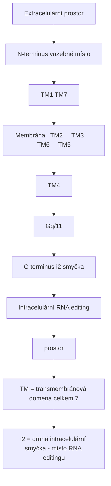

<details>
<summary>ASCII verze diagramu</summary>

```
                    Extracelulární prostor
                           │
    N-terminus ───┬────────┼────────┬─── vazebné místo
                  │   TM1  │  TM7   │
         ┌────────┼────────┼────────┼────────┐
Membrána │  TM2   │  TM3   │  TM6   │  TM5   │
         └────────┼────────┼────────┼────────┘
                  │   TM4  │        │
                  │        │ Gq/11  │
    C-terminus ───┴────────┴────────┴─── i2 smyčka
                    Intracelulární      (RNA editing)
                        prostor

TM = transmembránová doména (celkem 7)
i2 = druhá intracelulární smyčka - místo RNA editingu
```

</details>

---

## RNA editing - Jedinečná vlastnost

### Mechanismus

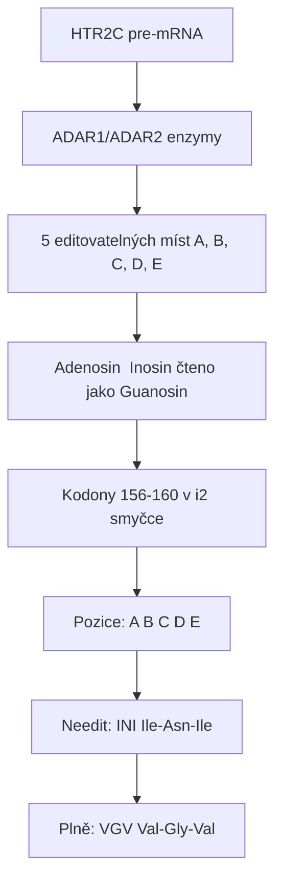

<details>
<summary>ASCII verze diagramu</summary>

```
HTR2C pre-mRNA
      │
      ↓ ADAR1/ADAR2 enzymy
      │
┌─────────────────────────────────────────────────┐
│                                                 │
│   5 editovatelných míst (A, B, C, D, E)        │
│                                                 │
│   Adenosin → Inosin (čteno jako Guanosin)     │
│                                                 │
│   Kodony 156-160 v i2 smyčce                   │
│                                                 │
│   Pozice:  A    B    C    D    E              │
│            │    │    │    │    │              │
│            ↓    ↓    ↓    ↓    ↓              │
│   Needit: INI  (Ile-Asn-Ile)                  │
│   Plně:   VGV  (Val-Gly-Val)                  │
│                                                 │
└─────────────────────────────────────────────────┘
```

</details>

### Varianty receptoru

| Varianta | Editovaná místa | Aminokyseliny | Konstitutivní aktivita | Signalizace |
|----------|-----------------|---------------|------------------------|-------------|
| **INI** (needitovaná) | Žádná | Ile-Asn-Ile | Vysoká | Silná |
| **INV** | E | Ile-Asn-Val | Střední | Střední |
| **ISV** | C, E | Ile-Ser-Val | Střední | Střední |
| **VSV** | A, C, E | Val-Ser-Val | Nízká | Nízká |
| **VNV** | A, E | Val-Asn-Val | Nízká | Nízká |
| **VGV** (plně editovaná) | A, B, C, D, E | Val-Gly-Val | Minimální | Velmi nízká |

### Funkční důsledky editingu

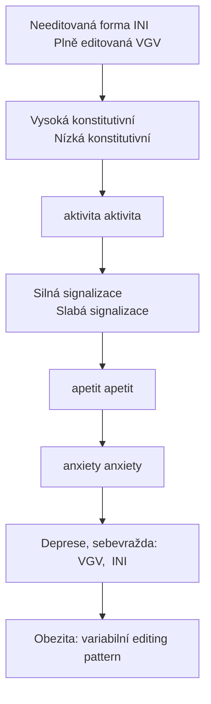

<details>
<summary>ASCII verze diagramu</summary>

```
Needitovaná forma (INI)           Plně editovaná (VGV)
┌────────────────────┐            ┌────────────────────┐
│                    │            │                    │
│  Vysoká konstitutivní          │  Nízká konstitutivní
│  aktivita           │            │  aktivita           │
│       │            │            │       │            │
│       ↓            │            │       ↓            │
│  Silná signalizace │            │  Slabá signalizace │
│       │            │            │       │            │
│       ↓            │            │       ↓            │
│  ↓ apetit          │            │  ↑ apetit          │
│  ↑ anxiety         │            │  ↓ anxiety         │
│                    │            │                    │
└────────────────────┘            └────────────────────┘

Deprese, sebevražda: ↑ VGV, ↓ INI
Obezita: variabilní editing pattern
```

</details>

### Regulace editingu

| Faktor | Efekt na editing | Důsledek |
|--------|------------------|----------|
| **Chronický stres** | ↑ editing | ↓ signalizace, deprese |
| **SSRI** | ↓ editing | Normalizace funkce |
| **Interferon-α** | ↑ editing | Psychiatrické NÚ |
| **Alkohol** | Změněný vzorec | Behaviorální změny |

---

## Distribuce v mozku

### Regionální exprese

| Oblast | Exprese | Funkce |
|--------|---------|--------|
| **Choroid plexus** | Velmi vysoká | CSF produkce |
| **Nucleus accumbens** | Vysoká | Odměna, motivace |
| **Prefrontální kortex** | Vysoká | Kognice, impulzivita |
| **Hypothalamus** | Vysoká | Apetit, metabolismus |
| **Amygdala** | Střední | Úzkost, strach |
| **Hippocampus** | Střední | Paměť, nálada |
| **VTA** | Střední | Dopaminová regulace |
| **Substantia nigra** | Nízká | Motorika |

### Buněčná lokalizace

| Typ neuronu | Role |
|-------------|------|
| **POMC neurony** | Anorexigenní signalizace |
| **GABAergní interneurony** | Inhibice DA neuronů |
| **Pyramidové neurony** | Kortikální signalizace |
| **Dopaminergní neurony** | Modulace DA uvolňování |

---

## Signální dráhy

### Primární kaskáda (Gq/11)

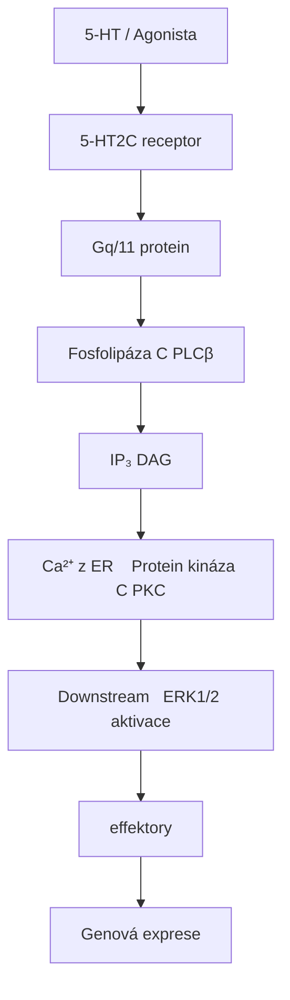

<details>
<summary>ASCII verze diagramu</summary>

```
5-HT / Agonista
        ↓
   5-HT2C receptor
        ↓
    Gq/11 protein
        ↓
   Fosfolipáza C (PLCβ)
        ↓
┌───────┴───────┐
↓               ↓
IP₃             DAG
↓               ↓
Ca²⁺ z ER    Protein kináza C (PKC)
↓               ↓
Downstream   ERK1/2 aktivace
effektory    ↓
             Genová exprese
```

</details>

### Sekundární dráhy

| Dráha | Mediátor | Funkce |
|-------|----------|--------|
| **β-arrestin** | Desenzitizace | Internalizace receptoru |
| **PLA₂** | Kyselina arachidonová | Neuromodulace |
| **ERK/MAPK** | Proliferace | Neuroplasticita |

### Konstitutivní aktivita

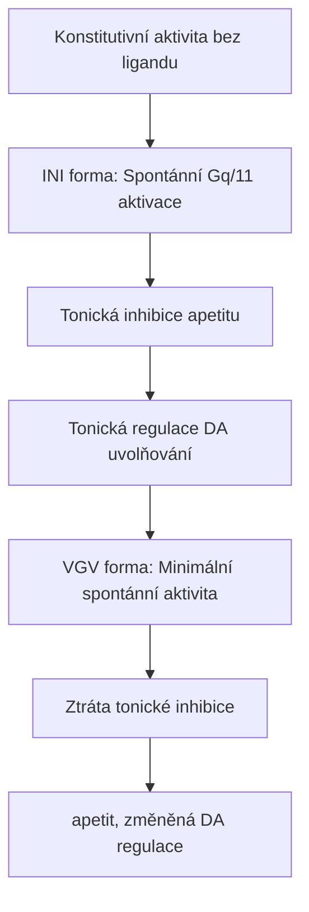

<details>
<summary>ASCII verze diagramu</summary>

```
Konstitutivní aktivita (bez ligandu)
┌─────────────────────────────────────────────────┐
│                                                 │
│   INI forma: Spontánní Gq/11 aktivace          │
│              │                                  │
│              ↓                                  │
│   Tonická inhibice apetitu                     │
│   Tonická regulace DA uvolňování               │
│                                                 │
│   VGV forma: Minimální spontánní aktivita      │
│              │                                  │
│              ↓                                  │
│   Ztráta tonické inhibice                      │
│   ↑ apetit, změněná DA regulace               │
│                                                 │
└─────────────────────────────────────────────────┘
```

</details>

---

## Regulace apetitu

### POMC/AgRP systém

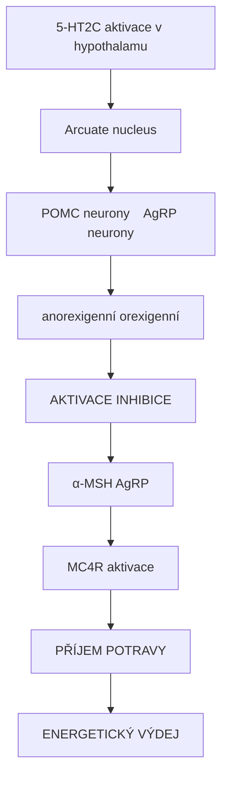

<details>
<summary>ASCII verze diagramu</summary>

```
5-HT2C aktivace v hypothalamu
              │
              ↓
┌─────────────────────────────────────────────────┐
│                                                 │
│   Arcuate nucleus                               │
│        │                                        │
│   ┌────┴────────────┐                          │
│   ↓                 ↓                          │
│ POMC neurony    AgRP neurony                   │
│ (anorexigenní)  (orexigenní)                   │
│   │                 │                          │
│   ↓                 ↓                          │
│ AKTIVACE       INHIBICE                        │
│   │                 │                          │
│   ↓                 ↓                          │
│ α-MSH ↑         AgRP ↓                         │
│   │                 │                          │
│   └────────┬────────┘                          │
│            ↓                                    │
│       MC4R aktivace                            │
│            ↓                                    │
│       ↓ PŘÍJEM POTRAVY                         │
│       ↑ ENERGETICKÝ VÝDEJ                      │
│                                                 │
└─────────────────────────────────────────────────┘
```

</details>

### Klinická relevance

| Stav | 5-HT2C aktivita | Důsledek |
|------|-----------------|----------|
| **Obezita** | Snížená/dysfunkční | Zvýšený apetit |
| **Anorexie** | Zvýšená | Snížený apetit |
| **Antipsychotika** | Blokáda | Váhový přírůstek |
| **SSRI** | Nepřímá aktivace | Variabilní efekt na váhu |

---

## Farmakologie

### Agonisté

| Látka | Ki (nM) | Selektivita | Použití |
|-------|---------|-------------|---------|
| **Lorcaserin** | 15-30 | 5-HT2C >> 2A, 2B | Obezita (stažen 2020) |
| **mCPP** | 10-50 | Neselektivní | Výzkum, metabolit trazodonu |
| **WAY-161503** | 5-15 | Selektivní | Výzkum |
| **Ro60-0175** | 10-30 | Selektivní | Výzkum |
| **CP-809101** | 2-10 | Vysoce selektivní | Výzkum |

### Antagonisté/Inverzní agonisté

| Látka | Ki (nM) | Použití |
|-------|---------|---------|
| **SB-242084** | 1-5 | Selektivní, výzkum |
| **Agomelatine** | 50-100 | Antidepresivum |
| **Olanzapin** | 10-30 | Antipsychotikum |
| **Klozapin** | 5-20 | Antipsychotikum |
| **RS-102221** | 5-15 | Výzkum |

### Interakce s psychedeliky

| Látka | 5-HT2C aktivita | Modulace účinku |
|-------|-----------------|-----------------|
| [**LSD**](@/alkaloids/lsd.md) | Agonista | Částečně přes 5-HT2C |
| [**Psilocin**](@/alkaloids/psilocin.md) | Agonista | Modulace psychedelického zážitku |
| [**DMT**](@/alkaloids/dmt.md) | Agonista | Sekundární cíl |
| [**Meskalin**](@/alkaloids/mescaline.md) | Slabý agonista | Minimální přínos |

---

## Klinické aplikace

### Lorcaserin (Belviq) - Případová studie

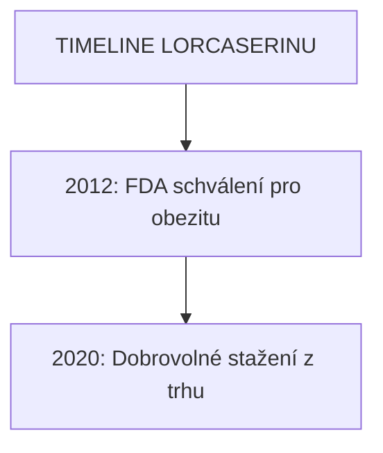

<details>
<summary>ASCII verze diagramu</summary>

```
TIMELINE LORCASERINU
────────────────────────────────────────────────────
2012: FDA schválení pro obezitu
      - Selektivní 5-HT2C agonista
      - Snížení chuti k jídlu
      - Bez kardiovaskulární toxicity (5-HT2B)

2020: Dobrovolné stažení z trhu
      - CAMELLIA-TIMI 61 studie
      - Numericky vyšší výskyt malignit
      - 7.7% vs 7.1% (3 roky)
      - Kauzalita nejistá
────────────────────────────────────────────────────
```

</details>

### Mechanismus antiobezitního účinku

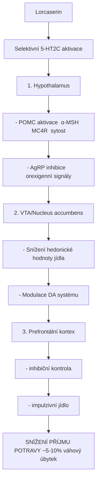

<details>
<summary>ASCII verze diagramu</summary>

```
Lorcaserin
    │
    ↓ Selektivní 5-HT2C aktivace
    │
┌───┴───────────────────────────────────────────────┐
│                                                   │
│   1. Hypothalamus                                 │
│      - POMC aktivace → α-MSH → MC4R → sytost    │
│      - AgRP inhibice → ↓ orexigenní signály     │
│                                                   │
│   2. VTA/Nucleus accumbens                       │
│      - Snížení hedonické hodnoty jídla          │
│      - Modulace DA systému                       │
│                                                   │
│   3. Prefrontální kortex                         │
│      - ↑ inhibiční kontrola                      │
│      - ↓ impulzivní jídlo                        │
│                                                   │
└───────────────────────────────────────────────────┘
    │
    ↓
SNÍŽENÍ PŘÍJMU POTRAVY (~5-10% váhový úbytek)
```

</details>

### Váhový přírůstek u antipsychotik

| Antipsychotikum | 5-HT2C antagonismus | Váhový přírůstek |
|-----------------|---------------------|------------------|
| **Klozapin** | Silný | +++ |
| **Olanzapin** | Silný | +++ |
| **Risperidon** | Střední | ++ |
| **Quetiapin** | Střední | ++ |
| **Aripiprazol** | Slabý | + |
| **Ziprasidon** | Slabý | + |

---

## Role v psychiatrii

### Deprese a úzkost

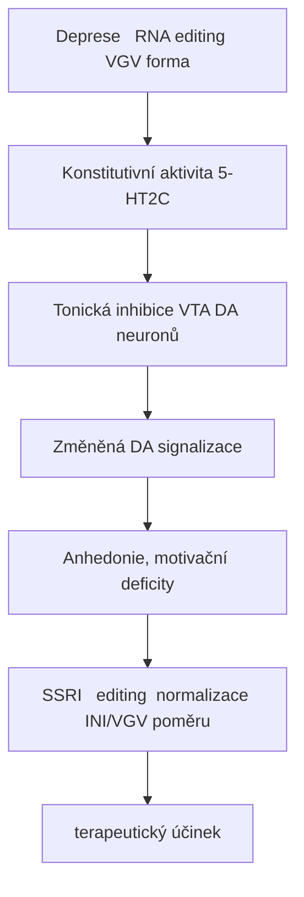

<details>
<summary>ASCII verze diagramu</summary>

```
Deprese → ↑ RNA editing → ↑ VGV forma
              │
              ↓
┌─────────────────────────────────────────────────┐
│                                                 │
│   ↓ Konstitutivní aktivita 5-HT2C              │
│              │                                  │
│              ↓                                  │
│   ↓ Tonická inhibice VTA DA neuronů            │
│              │                                  │
│              ↓                                  │
│   Změněná DA signalizace                       │
│              │                                  │
│              ↓                                  │
│   Anhedonie, motivační deficity                │
│                                                 │
└─────────────────────────────────────────────────┘

SSRI → ↓ editing → normalizace INI/VGV poměru
     → terapeutický účinek
```

</details>

### Impulzivita a sebevražedné chování

| Parametr | Asociace |
|----------|----------|
| **↑ VGV editovaná forma** | ↑ riziko sebevraždy |
| **↓ INI needitovaná forma** | Deprese, impulzivita |
| **HTR2C polymorfismy** | Variabilní odpověď na SSRI |

---

## Dopaminová regulace

### 5-HT2C inhibice DA systému

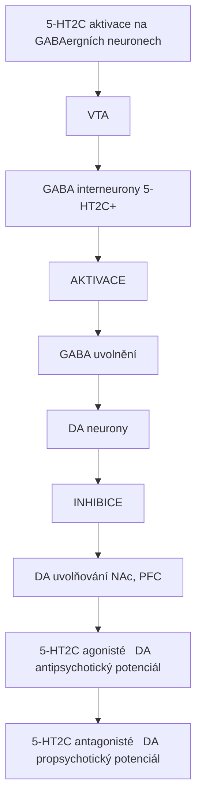

<details>
<summary>ASCII verze diagramu</summary>

```
5-HT2C aktivace na GABAergních neuronech
                │
                ↓
┌───────────────────────────────────────────────────┐
│                                                   │
│   VTA                                             │
│    │                                              │
│    ↓                                              │
│   GABA interneurony (5-HT2C+)                    │
│    │                                              │
│    ↓ AKTIVACE                                    │
│    │                                              │
│    ↓                                              │
│   ↑ GABA uvolnění                                │
│    │                                              │
│    ↓                                              │
│   DA neurony                                      │
│    │                                              │
│    ↓ INHIBICE                                    │
│    │                                              │
│    ↓                                              │
│   ↓ DA uvolňování (NAc, PFC)                    │
│                                                   │
└───────────────────────────────────────────────────┘

5-HT2C agonisté → ↓ DA → antipsychotický potenciál
5-HT2C antagonisté → ↑ DA → propsychotický potenciál
```

</details>

### Implikace pro závislosti

| Látka | 5-HT2C mechanismus | Efekt |
|-------|-------------------|-------|
| **Kokain** | 5-HT2C aktivace snižuje reward | Potenciální cíl léčby |
| **Amfetaminy** | 5-HT2C modulace DA | Snížení závislostního potenciálu |
| **Nikotin** | 5-HT2C agonisté snižují seeking | Experimentální terapie |

---

## Genetické varianty

### Polymorfismy HTR2C

| SNP | Efekt | Klinická asociace |
|-----|-------|-------------------|
| **Cys23Ser** | rs6318 | Obezita, deprese |
| **-759C/T** | Promotor | Váhový přírůstek na AP |
| **-697G/C** | Promotor | Odpověď na klozapin |

### X-vázaná dědičnost

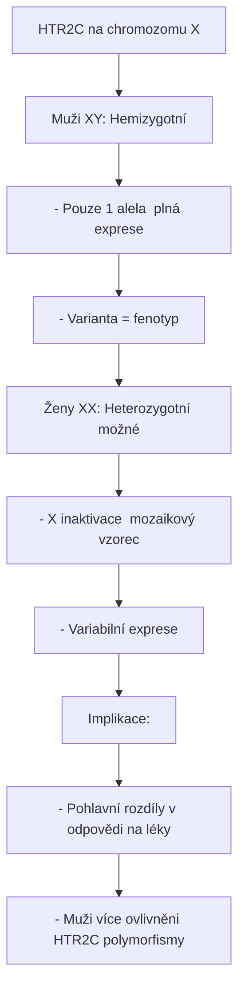

<details>
<summary>ASCII verze diagramu</summary>

```
HTR2C na chromozomu X
┌─────────────────────────────────────────────────┐
│                                                 │
│   Muži (XY): Hemizygotní                       │
│   - Pouze 1 alela → plná exprese              │
│   - Varianta = fenotyp                         │
│                                                 │
│   Ženy (XX): Heterozygotní možné               │
│   - X inaktivace → mozaikový vzorec           │
│   - Variabilní exprese                         │
│                                                 │
│   Implikace:                                    │
│   - Pohlavní rozdíly v odpovědi na léky       │
│   - Muži více ovlivněni HTR2C polymorfismy    │
│                                                 │
└─────────────────────────────────────────────────┘
```

</details>

---

## Srovnání 5-HT2 receptorů

| Vlastnost | 5-HT2A | 5-HT2B | **5-HT2C** |
|-----------|--------|--------|------------|
| **G-protein** | Gq/11 | Gq/11 | Gq/11 |
| **Lokalizace** | Kortex | Srdce | Limbický systém |
| **RNA editing** | Ne | Ne | **Ano** |
| **Konstitutivní aktivita** | Nízká | Nízká | **Vysoká** |
| **Hlavní funkce** | Halucinace | Kardiovaskulární | Apetit, nálada |
| **Terapeutický cíl** | Psychedelika | Vyhýbat se | Obezita |

---

## Výzkumné nástroje

### Radioligandy

| Ligand | Typ | Použití |
|--------|-----|---------|
| **[3H]mesulergine** | Antagonista | In vitro vazba |
| **[125I]DOI** | Agonista | Neselektivní 5-HT2 |

### Selektivní nástroje

| Nástroj | Typ | Selektivita |
|---------|-----|-------------|
| **SB-242084** | Antagonista | 100x vs 5-HT2A |
| **WAY-163909** | Agonista | >100x vs 5-HT2A, 5-HT2B |
| **5-HT2C KO myši** | Genetický | Absolutní |

---

## Reference

1. Werry, T.D. et al. (2008). *RNA editing of the serotonin 5HT2C receptor and its effects on cell signalling, pharmacology and brain function*. Pharmacology & Therapeutics.
2. Higgins, G.A. et al. (2020). *Serotonin 5-HT2C receptor-mediated hypophagia*. ACS Chemical Neuroscience.
3. Di Giovanni, G. & De Deurwaerdere, P. (2016). *5-HT2C receptors in neurodegenerative diseases*. Behavioural Brain Research.
4. Martin, C.B. et al. (2014). *RNA splicing and editing modulation of 5-HT2C receptor function*. Neuropharmacology.
5. Heisler, L.K. et al. (2006). *Serotonin reciprocally regulates melanocortin neurons to modulate food intake*. Neuron.

---

Viz také:
- [5-HT2A receptor](@/receptors/5-ht2a.md) - Primární psychedelický cíl
- [5-HT2B receptor](@/receptors/5-ht2b.md) - Kardiovaskulární riziko
- [5-HT1A receptor](@/receptors/5-ht1a.md) - Anxiolytický receptor
- [D2 receptor](@/receptors/d2.md) - Dopaminová regulace
- [Psilocybin](@/alkaloids/psilocybin.md) - 5-HT2C agonista
- [Glosář](@/glossary/_index.md) - Definice pojmů

<- Zpět na [Receptory](@/receptors/_index.md) | [GABA-B receptor](@/receptors/gaba-b.md) ->
