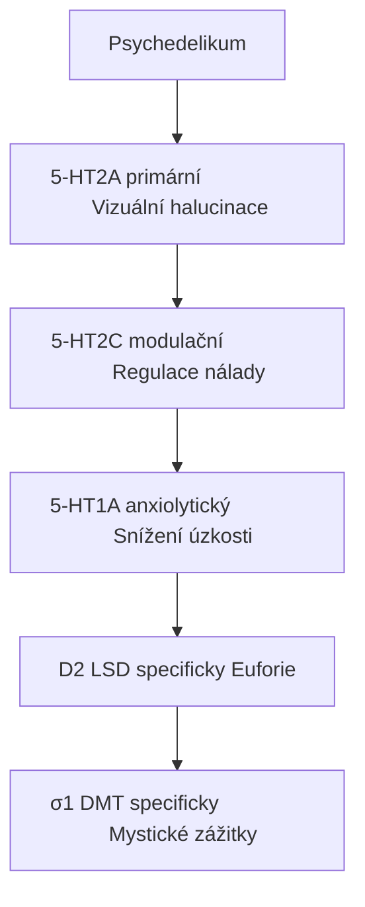
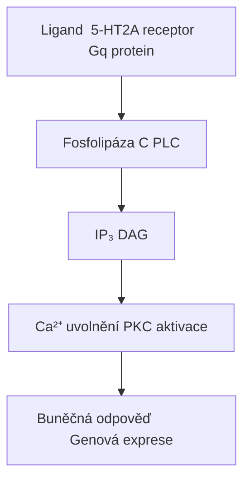
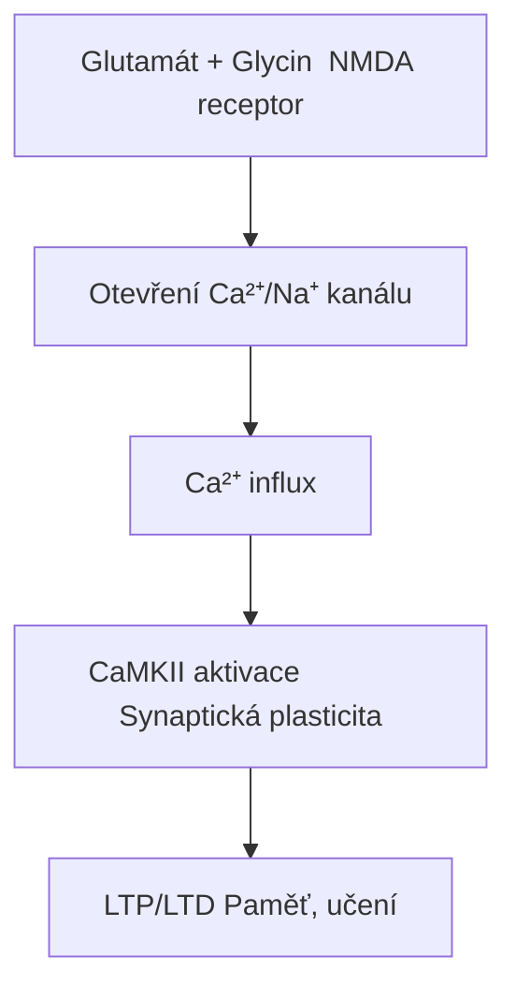

+++
title = "Receptory"
description = "Kompletní přehled neurotransmiterových receptorů relevantních pro psychoaktivní látky"
weight = 5
sort_by = "weight"
insert_anchor_links = "right"
+++

# Neurotransmiterové receptory

**Receptory** jsou bílkovinné struktury na povrchu nebo uvnitř buněk, které rozpoznávají a váží specifické molekuly (**ligandy**) - neurotransmitery, hormony nebo léčiva. Vazba ligandu spouští kaskádu intracelulárních signálů vedoucí k biologické odpovědi.

---

## Klasifikace receptorů

### Podle mechanismu

| Typ | Mechanismus | Rychlost | Příklady |
|-----|-------------|----------|----------|
| **Ionotropní** | Ligandem řízený iontový kanál | ms | [GABA-A](@/receptors/gaba-a.md), [NMDA](@/receptors/nmda.md), [AMPA](@/receptors/ampa.md) |
| **Metabotropní** | G-protein spřažené (GPCR) | s-min | [5-HT2A](@/receptors/5-ht2a.md), [D2](@/receptors/d2.md), [mGluR](@/receptors/mglur.md) |
| **Tyrosin kinázové** | Enzymatická aktivita | min-h | Inzulinový, růstové faktory |
| **Intracelulární** | Jaderné receptory | h-dny | Steroidní hormony |

### Podle neurotransmiteru

| Systém | Receptory | Funkce |
|--------|-----------|--------|
| **Serotonergní** | [5-HT1A](@/receptors/5-ht1a.md), [5-HT2A](@/receptors/5-ht2a.md), [5-HT2B](@/receptors/5-ht2b.md), [5-HT2C](@/receptors/5-ht2c.md) | Nálada, percepce, kognice |
| **Dopaminergní** | [D1](@/receptors/d1.md), [D2](@/receptors/d2.md) | Odměna, motivace, motorika |
| **Glutamátový** | [NMDA](@/receptors/nmda.md), [AMPA](@/receptors/ampa.md), [mGluR](@/receptors/mglur.md) | Excitace, plasticita, paměť |
| **GABAergní** | [GABA-A](@/receptors/gaba-a.md), [GABA-B](@/receptors/gaba-b.md) | Inhibice, anxiolýza, sedace |
| **Sigma** | [σ1](@/receptors/sigma-1.md), [σ2](@/receptors/sigma-2.md) | Neuromodulace, neuroprotekce |

---

## Receptory psychedelik

### Primární cíl: 5-HT2A

| Látka | Ki (nM) | Aktivita | Zdroj |
|-------|---------|----------|-------|
| [LSD](@/alkaloids/lsd.md) | **1-2** | Plný agonista | Syntetický |
| [Psilocin](@/alkaloids/psilocin.md) | 6-15 | Parciální agonista | [Psilocybe](@/shrooms/psilocybes/_index.md) |
| [DMT](@/alkaloids/dmt.md) | 75-130 | Parciální agonista | Endogenní/Rostliny |
| [Meskalin](@/alkaloids/mescaline.md) | 5000+ | Parciální agonista | Kaktusy |

### Sekundární cíle



<details>
<summary>ASCII verze diagramu</summary>

```
Psychedelikum
     ↓
┌────────────────────────────────────┐
│  5-HT2A (primární)                 │ → Vizuální halucinace
│  5-HT2C (modulační)                │ → Regulace nálady
│  5-HT1A (anxiolytický)             │ → Snížení úzkosti
│  D2 (LSD specificky)               │ → Euforie
│  σ1 (DMT specificky)               │ → Mystické zážitky
└────────────────────────────────────┘
```

</details>

---

## Receptory disociativ

### Primární cíl: NMDA

| Látka | Mechanismus | Účinek |
|-------|-------------|--------|
| Ketamin | NMDA antagonista | Disociace, analgezie |
| PCP | NMDA antagonista | Silná disociace |
| [Kyselina ibotenová](@/neurotoxins/ibotenic-acid.md) | NMDA agonista | Excitotoxicita |

---

## Receptory GABAergních látek

### Primární cíl: GABA-A

| Látka | Vazebné místo | Účinek |
|-------|---------------|--------|
| Benzodiazepiny | BZ site | Pozitivní modulátor |
| Barbituráty | Barbiturátové | Pozitivní modulátor |
| Alkohol | Více míst | Pozitivní modulátor |

---

## Signální kaskády

### GPCR signalizace (5-HT2A)



<details>
<summary>ASCII verze diagramu</summary>

```
Ligand → 5-HT2A receptor → Gq protein
                              ↓
                    Fosfolipáza C (PLC)
                              ↓
              ┌───────────────┴───────────────┐
              ↓                               ↓
         IP₃                              DAG
              ↓                               ↓
    Ca²⁺ uvolnění                    PKC aktivace
              ↓                               ↓
    Buněčná odpověď              Genová exprese
```

</details>

### Ionotropní signalizace (NMDA)



<details>
<summary>ASCII verze diagramu</summary>

```
Glutamát + Glycin → NMDA receptor
                         ↓
          Otevření Ca²⁺/Na⁺ kanálu
                         ↓
               Ca²⁺ influx
                         ↓
         ┌───────────────┴───────────────┐
         ↓                               ↓
   CaMKII aktivace              Synaptická plasticita
         ↓                               ↓
      LTP/LTD                    Paměť, učení
```

</details>

---

## Receptorové interakce s psychoaktivními látkami

### Srovnávací tabulka

| Látka | 5-HT2A | 5-HT1A | D2 | GABA-A | NMDA | σ1 |
|-------|--------|--------|----|---------|----|-----|
| [LSD](@/alkaloids/lsd.md) | +++ | + | ++ | - | - | + |
| [Psilocybin](@/alkaloids/psilocybin.md) | +++ | ++ | - | - | - | - |
| [DMT](@/alkaloids/dmt.md) | +++ | + | - | - | - | +++ |
| Ketamin | - | - | - | - | --- | ++ |
| [Meskalin](@/alkaloids/mescaline.md) | ++ | + | + | - | - | - |

**Legenda**: +++ silný agonista, ++ střední, + slabý, - žádný, --- antagonista

---

## Terapeutický potenciál

### Receptor-specifické terapie

| Receptor | Potenciál | Indikace |
|----------|-----------|----------|
| **5-HT2A** | Psychedeliky asistovaná terapie | Deprese, PTSD, závislosti |
| **NMDA** | Ketaminová terapie | Rezistentní deprese |
| **GABA-A** | Anxiolytika, hypnotika | Úzkost, nespavost |
| **D2** | Antipsychotika | Schizofrenie |

---

## Reference

1. Nichols, D.E. (2016). *Psychedelics*. Pharmacological Reviews.
2. Roth, B.L. et al. (2002). *Salvinorin A: A potent naturally occurring nonnitrogenous kappa opioid selective agonist*. PNAS.
3. Nutt, D. et al. (2020). *Psychedelic Psychiatry's Brave New World*. Cell.

---

Viz take:
- [5-HT2A receptor](@/receptors/5-ht2a.md) - Primarni cil psychedelik
- [GABA-A receptor](@/receptors/gaba-a.md) - Cil GABAergnich latek
- [NMDA receptor](@/receptors/nmda.md) - Cil disociativ
- [Glosar](@/glossary/_index.md) - Definice pojmu
- [Mechanismy ucinku](@/mechanisms/_index.md) - Signalni kaskady, kinetika, modulace
- [Receptorova kinetika](@/mechanisms/receptor-binding.md) - Ki, Kd, vazebna termodynamika
- [Signalni transdukce](@/mechanisms/signal-transduction.md) - GPCR a ionotropni signalizace
- [Alostericka modulace](@/mechanisms/allosteric-modulation.md) - PAM, NAM, subtypova selektivita

<- Zpet na [Hlavni stranku](@/_index.md)
