+++
title = "AMPA receptor"
description = "Ionotropní glutamátový receptor - mediátor rychlé excitační transmise a synaptické plasticity"
weight = 8
insert_anchor_links = "right"

[taxonomies]
categories = ["receptory", "glutamát", "ionotropní"]
tags = ["AMPA", "glutamát", "LTP", "synaptická-plasticita", "excitace", "paměť"]
+++

# AMPA receptor - Motor rychlé synaptické transmise

**AMPA receptor** (α-amino-3-hydroxy-5-methyl-4-isoxazoleproprionátový receptor) je **ionotropní glutamátový receptor** zodpovědný za většinu **rychlé excitační synaptické transmise** v centrálním nervovém systému. Je klíčovým mediátorem **synaptické plasticity**, **učení** a **paměti**, a představuje atraktivní terapeutický cíl pro kognitivní poruchy.

---

## Základní charakteristika

### Klasifikace

| Vlastnost | Hodnota |
|-----------|---------|
| **Typ** | Ionotropní (ligandem řízený) |
| **Rodina** | Glutamátové receptory |
| **Iony** | Na⁺ (influx), K⁺ (eflux), (Ca²⁺ u GluA2-lacking) |
| **Struktura** | Tetramer |
| **Endogenní ligand** | Glutamát |
| **Rychlost** | Velmi rychlá kinetika (ms) |

### Podjednotky

| Podjednotka | Gen | Charakteristika |
|-------------|-----|-----------------|
| **GluA1 (GluR1)** | GRIA1 | Ca²⁺ propustná (Q/R needitovaná) |
| **GluA2 (GluR2)** | GRIA2 | Určuje Ca²⁺ impermeabilitu (Q/R editovaná) |
| **GluA3 (GluR3)** | GRIA3 | Konstitutivní trafficking |
| **GluA4 (GluR4)** | GRIA4 | Rychlá desenzitizace |

---

## Struktura receptoru

### Architektura tetrameru

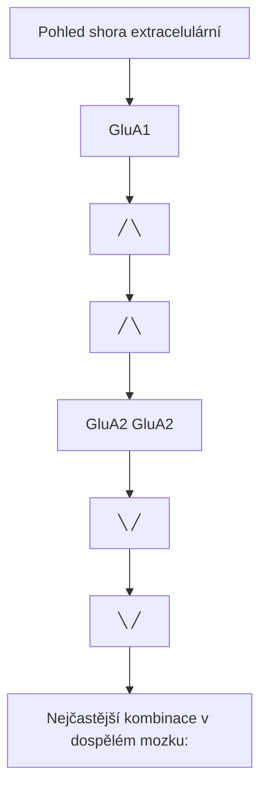

<details>
<summary>ASCII verze diagramu</summary>

```
         Pohled shora (extracelulární)

              GluA1
             ╱    ╲
           ╱        ╲
        GluA2 ──── GluA2
           ╲        ╱
             ╲    ╱
              GluA1

Nejčastější kombinace v dospělém mozku:
- GluA1/GluA2 (heteromer) - hlavní typ
- GluA2/GluA3 (heteromer) - konstitutivní
- GluA1 homomery - plasticita (GluA2-lacking)
```

</details>

### Doménová organizace

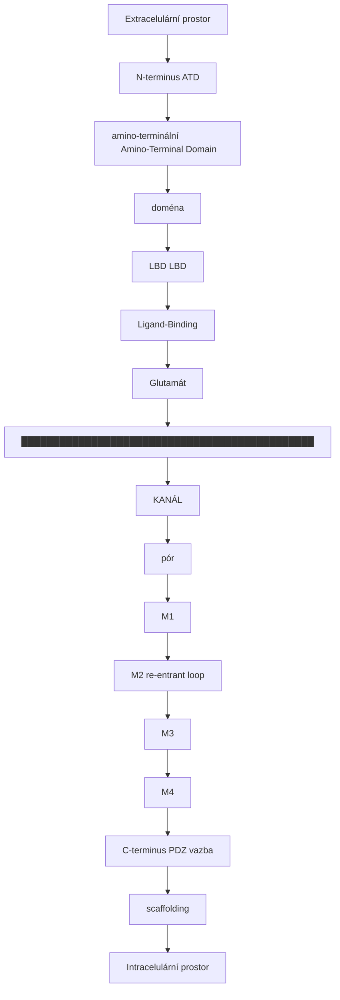

<details>
<summary>ASCII verze diagramu</summary>

```
                    Extracelulární prostor
                           │
    N-terminus ────────────┼──────────── ATD
    (amino-terminální      │             (Amino-Terminal Domain)
     doména)               │
                           │
    ┌──────────────────────┼──────────────────────┐
    │        LBD           │          LBD         │
    │  (Ligand-Binding)    │                      │
    │        ↓             │                      │
    │   Glutamát           │                      │
    └──────────┬───────────┼──────────────────────┘
               │           │
    ███████████│███████████│████████████████████████
               │   KANÁL   │
               │   (pór)   │
               │    M1     │
               │    M2     │ ← re-entrant loop
               │    M3     │
               │    M4     │
    ███████████│███████████│████████████████████████
               │           │
    C-terminus ────────────┴──────────── PDZ vazba
                                         (scaffolding)

               Intracelulární prostor
```

</details>

### Iontový pór a Q/R editing

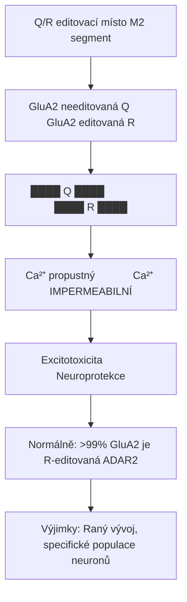

<details>
<summary>ASCII verze diagramu</summary>

```
Q/R editovací místo (M2 segment)

GluA2 needitovaná (Q)        GluA2 editovaná (R)
┌─────────────────────┐      ┌─────────────────────┐
│                     │      │                     │
│   ████ Q ████       │      │   ████ R ████       │
│        │            │      │        │            │
│        ↓            │      │        ↓            │
│   Ca²⁺ propustný    │      │   Ca²⁺ IMPERMEABILNÍ│
│        │            │      │        │            │
│        ↓            │      │        ↓            │
│   Excitotoxicita    │      │   Neuroprotekce    │
│                     │      │                     │
└─────────────────────┘      └─────────────────────┘

Normálně: >99% GluA2 je R-editovaná (ADAR2)
Výjimky: Raný vývoj, specifické populace neuronů
```

</details>

---

## Distribuce v mozku

### Regionální exprese

| Oblast | Hlavní podjednotky | Funkce |
|--------|-------------------|--------|
| **Hippocampus** | GluA1, GluA2, GluA3 | Paměť, LTP |
| **Kortex** | GluA1, GluA2 | Kognice |
| **Cerebellum** | GluA2, GluA3, GluA4 | Motorika |
| **Amygdala** | GluA1, GluA2 | Emoční paměť |
| **Striatum** | GluA1, GluA2 | Motorika, odměna |
| **Mícha** | GluA1-4 | Senzorická/motorická |

### Synaptická vs extrasynaptická lokalizace

| Lokalizace | Kompozice | Funkce |
|------------|-----------|--------|
| **Synaptická** | GluA1/A2, GluA2/A3 | Rychlá transmise |
| **Extrasynaptická** | Různé | Tonická excitace |
| **Perisynaptická** | GluA1 homomery | Rezervoár pro LTP |

---

## Kinetika a funkce

### Rychlá synaptická transmise

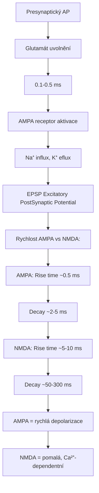

<details>
<summary>ASCII verze diagramu</summary>

```
Presynaptický AP
      │
      ↓
Glutamát uvolnění
      │
      ↓ (0.1-0.5 ms)
      │
AMPA receptor aktivace
      │
      ↓
Na⁺ influx, K⁺ eflux
      │
      ↓
EPSP (Excitatory PostSynaptic Potential)
      │
      ↓
┌─────────────────────────────────────────┐
│                                         │
│   Rychlost AMPA vs NMDA:               │
│                                         │
│   AMPA: Rise time ~0.5 ms              │
│         Decay ~2-5 ms                   │
│                                         │
│   NMDA: Rise time ~5-10 ms             │
│         Decay ~50-300 ms                │
│                                         │
│   AMPA = rychlá depolarizace           │
│   NMDA = pomalá, Ca²⁺-dependentní      │
│                                         │
└─────────────────────────────────────────┘
```

</details>

### AMPA-NMDA synergie

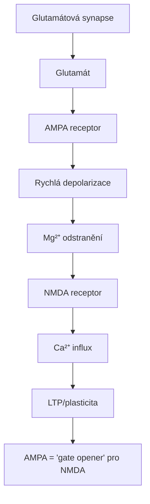

<details>
<summary>ASCII verze diagramu</summary>

```
Glutamátová synapse
┌─────────────────────────────────────────────────────┐
│                                                     │
│   Glutamát                                          │
│      │                                              │
│      ├──────────→ AMPA receptor                    │
│      │                  │                          │
│      │                  ↓                          │
│      │             Rychlá depolarizace             │
│      │                  │                          │
│      │                  ↓                          │
│      │             Mg²⁺ odstranění                │
│      │                  │                          │
│      └──────────→ NMDA receptor                    │
│                         │                          │
│                         ↓                          │
│                    Ca²⁺ influx                     │
│                         │                          │
│                         ↓                          │
│                    LTP/plasticita                   │
│                                                     │
└─────────────────────────────────────────────────────┘

AMPA = "gate opener" pro NMDA
```

</details>

---

## Synaptická plasticita

### LTP (Long-Term Potentiation)

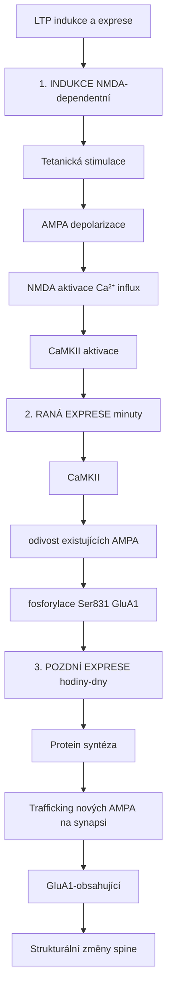

<details>
<summary>ASCII verze diagramu</summary>

```
LTP indukce a exprese
┌─────────────────────────────────────────────────────┐
│                                                     │
│   1. INDUKCE (NMDA-dependentní)                    │
│      Tetanická stimulace                           │
│           ↓                                        │
│      AMPA depolarizace                             │
│           ↓                                        │
│      NMDA aktivace → Ca²⁺ influx                  │
│           ↓                                        │
│      CaMKII aktivace                               │
│                                                     │
│   2. RANÁ EXPRESE (minuty)                         │
│      CaMKII                                         │
│           ↓                                        │
│      ↑ vodivost existujících AMPA                 │
│      (fosforylace Ser831 GluA1)                    │
│                                                     │
│   3. POZDNÍ EXPRESE (hodiny-dny)                   │
│      Protein syntéza                               │
│           ↓                                        │
│      Trafficking nových AMPA na synapsi            │
│      (GluA1-obsahující)                            │
│           ↓                                        │
│      Strukturální změny spine                      │
│                                                     │
└─────────────────────────────────────────────────────┘
```

</details>

### LTD (Long-Term Depression)

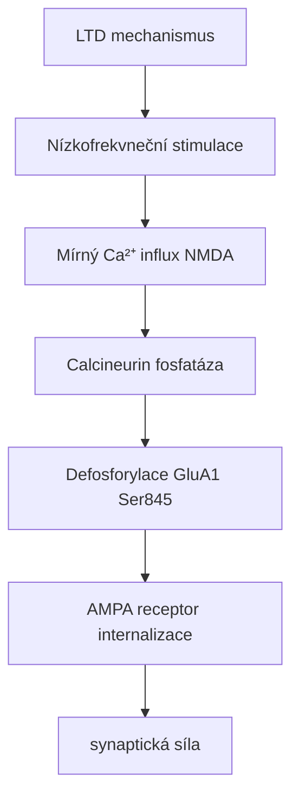

<details>
<summary>ASCII verze diagramu</summary>

```
LTD mechanismus
┌─────────────────────────────────────────────────────┐
│                                                     │
│   Nízkofrekvneční stimulace                        │
│           ↓                                        │
│   Mírný Ca²⁺ influx (NMDA)                        │
│           ↓                                        │
│   Calcineurin (fosfatáza)                          │
│           ↓                                        │
│   Defosforylace GluA1 (Ser845)                     │
│           ↓                                        │
│   AMPA receptor internalizace                      │
│           ↓                                        │
│   ↓ synaptická síla                               │
│                                                     │
└─────────────────────────────────────────────────────┘
```

</details>

### AMPA trafficking

| Proces | Podjednotka | Regulace |
|--------|-------------|----------|
| **Konstitutivní cycling** | GluA2/A3 | Kontinuální |
| **Activity-dependent insertion** | GluA1 | CaMKII, LTP |
| **Internalizace (LTD)** | GluA1, GluA2 | Calcineurin |

---

## Farmakologie

### Agonisté

| Látka | Ki (nM) | Selektivita | Použití |
|-------|---------|-------------|---------|
| **Glutamát** | 100-500 | Neselektivní | Endogenní |
| **AMPA** | 50-200 | AMPA selektivní | Výzkum |
| **Kainát** | 200-500 | Kainát > AMPA | Výzkum |
| **Willardiine** | 10-100 | AMPA | Výzkum |

### Antagonisté

| Látka | Typ | Ki (nM) | Použití |
|-------|-----|---------|---------|
| **NBQX** | Kompetitivní | 0.2-0.5 | Výzkum |
| **CNQX** | Kompetitivní | 1-3 | Výzkum |
| **GYKI 52466** | Nekompetitivní | 10-30 | Výzkum |
| **Perampanel** | Nekompetitivní | 60-100 | Epilepsie (schváleno) |

### Pozitivní alosterické modulátory (PAM) - "AMPAkiny"

| Látka | Typ | Mechanismus | Potenciál |
|-------|-----|-------------|-----------|
| **CX516** | Ampakine | ↓ desenzitizace | Kognice (fáze II fail) |
| **CX717** | Ampakine | ↓ desenzitizace | Kognice |
| **LY404187** | TARP-dependentní | ↑ proud | Výzkum |
| **S18986** | Ampakine | ↓ desenzitizace | Výzkum |

---

## Klinické aplikace

### Perampanel - Epilepsie

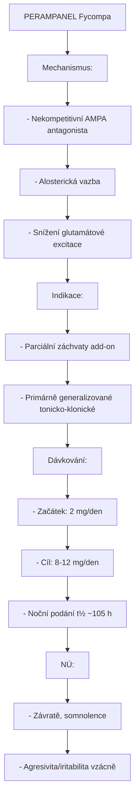

<details>
<summary>ASCII verze diagramu</summary>

```
PERAMPANEL (Fycompa)
┌─────────────────────────────────────────────────────┐
│                                                     │
│   Mechanismus:                                      │
│   - Nekompetitivní AMPA antagonista                │
│   - Alosterická vazba                               │
│   - Snížení glutamátové excitace                   │
│                                                     │
│   Indikace:                                         │
│   - Parciální záchvaty (add-on)                    │
│   - Primárně generalizované tonicko-klonické       │
│                                                     │
│   Dávkování:                                        │
│   - Začátek: 2 mg/den                              │
│   - Cíl: 8-12 mg/den                               │
│   - Noční podání (t½ ~105 h)                       │
│                                                     │
│   NÚ:                                               │
│   - Závratě, somnolence                            │
│   - Agresivita/iritabilita (vzácně)               │
│                                                     │
└─────────────────────────────────────────────────────┘
```

</details>

### Kognitivní enhancement

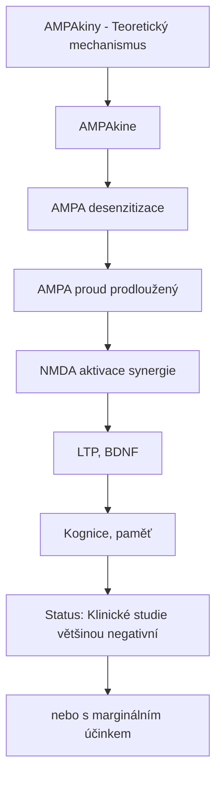

<details>
<summary>ASCII verze diagramu</summary>

```
AMPAkiny - Teoretický mechanismus
┌─────────────────────────────────────────────────────┐
│                                                     │
│   AMPAkine                                          │
│        │                                            │
│        ↓                                            │
│   ↓ AMPA desenzitizace                             │
│        │                                            │
│        ↓                                            │
│   ↑ AMPA proud (prodloužený)                       │
│        │                                            │
│        ↓                                            │
│   ↑ NMDA aktivace (synergie)                       │
│        │                                            │
│        ↓                                            │
│   ↑ LTP, ↑ BDNF                                    │
│        │                                            │
│        ↓                                            │
│   ↑ Kognice, paměť                                 │
│                                                     │
│   Status: Klinické studie většinou negativní       │
│   nebo s marginálním účinkem                        │
│                                                     │
└─────────────────────────────────────────────────────┘
```

</details>

### Potenciální indikace

| Indikace | Přístup | Status |
|----------|---------|--------|
| **Kognitivní deficit (schizofrenie)** | AMPAkiny | Fáze II |
| **Alzheimerova choroba** | AMPAkiny | Preklinická |
| **Deprese** | AMPA potentiace | Výzkum |
| **ADHD** | AMPAkiny | Preklinická |
| **Respirační deprese** | AMPAkiny | Fáze II (narkotika) |

---

## AMPA a onemocnění

### Excitotoxicita

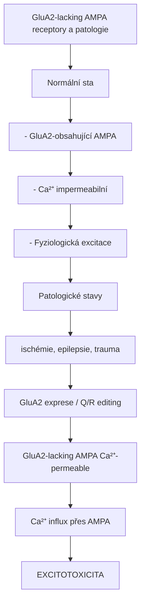

<details>
<summary>ASCII verze diagramu</summary>

```
GluA2-lacking AMPA receptory a patologie
┌─────────────────────────────────────────────────────┐
│                                                     │
│   Normální stav                                     │
│   - GluA2-obsahující AMPA                          │
│   - Ca²⁺ impermeabilní                             │
│   - Fyziologická excitace                          │
│                                                     │
│   Patologické stavy                                 │
│   (ischémie, epilepsie, trauma)                    │
│        │                                            │
│        ↓                                            │
│   ↓ GluA2 exprese / ↓ Q/R editing                 │
│        │                                            │
│        ↓                                            │
│   GluA2-lacking AMPA (Ca²⁺-permeable)              │
│        │                                            │
│        ↓                                            │
│   Ca²⁺ influx přes AMPA                            │
│        │                                            │
│        ↓                                            │
│   EXCITOTOXICITA                                    │
│                                                     │
└─────────────────────────────────────────────────────┘
```

</details>

### Asociace s nemocemi

| Onemocnění | AMPA změna | Důsledek |
|------------|------------|----------|
| **Epilepsie** | ↑ GluA1 | Hyperexcitabilita |
| **Ischémie** | ↓ GluA2 | Excitotoxicita |
| **ALS** | ↓ GluA2 editing | Motoneuronová smrt |
| **Rasmussen encefalitida** | Anti-GluA3 Ab | Autoimunita |
| **Limbická encefalitida** | Anti-AMPA Ab | Autoimunita |

---

## Auxiliární proteiny - TARPs

### TARP funkce

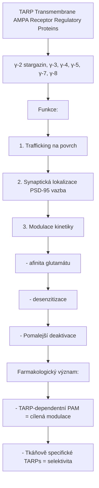

<details>
<summary>ASCII verze diagramu</summary>

```
TARP (Transmembrane AMPA Receptor Regulatory Proteins)
┌─────────────────────────────────────────────────────┐
│                                                     │
│   γ-2 (stargazin), γ-3, γ-4, γ-5, γ-7, γ-8        │
│                                                     │
│   Funkce:                                           │
│   1. Trafficking na povrch                          │
│   2. Synaptická lokalizace (PSD-95 vazba)          │
│   3. Modulace kinetiky                              │
│      - ↑ afinita glutamátu                         │
│      - ↓ desenzitizace                             │
│      - Pomalejší deaktivace                        │
│                                                     │
│   Farmakologický význam:                            │
│   - TARP-dependentní PAM = cílená modulace         │
│   - Tkáňově specifické TARPs = selektivita         │
│                                                     │
└─────────────────────────────────────────────────────┘
```

</details>

---

## Srovnání glutamátových receptorů

| Vlastnost | **AMPA** | NMDA | Kainát | mGluR |
|-----------|----------|------|--------|-------|
| **Typ** | Ionotropní | Ionotropní | Ionotropní | Metabotropní |
| **Hlavní ion** | Na⁺ | Ca²⁺, Na⁺ | Na⁺ | G-protein |
| **Rychlost** | Velmi rychlá | Pomalá | Rychlá | Pomalá |
| **Funkce** | Rychlá EPSP | Plasticita | Modulace | Neuromodulace |
| **Mg²⁺ blok** | Ne | Ano | Ne | N/A |

---

## Výzkumné nástroje

### Farmakologické nástroje

| Nástroj | Typ | Použití |
|---------|-----|---------|
| **NBQX** | Antagonista | Blokáda AMPA |
| **Spermine** | Vnitřní blokátor | Ca²⁺-perm. AMPA |
| **Cyclothiazide** | PAM | Blok desenzitizace |
| **NASPM** | Selektivní blokátor | GluA2-lacking |

### Genetické nástroje

| Nástroj | Aplikace |
|---------|----------|
| **GluA1 KO** | LTP, paměť |
| **GluA2 KO** | Ca²⁺ permeabilita |
| **Conditional KO** | Regionálně specifické |

---

## Reference

1. Traynelis, S.F. et al. (2010). *Glutamate receptor ion channels: structure, regulation, and function*. Pharmacological Reviews.
2. Henley, J.M. & Wilkinson, K.A. (2016). *Synaptic AMPA receptor composition in development, plasticity and disease*. Nature Reviews Neuroscience.
3. Rogawski, M.A. (2011). *Revisiting AMPA receptors as an antiepileptic drug target*. Epilepsy Currents.
4. Kessels, H.W. & Malinow, R. (2009). *Synaptic AMPA receptor plasticity and behavior*. Neuron.
5. Huganir, R.L. & Nicoll, R.A. (2013). *AMPARs and synaptic plasticity: The last 25 years*. Neuron.

---

Viz také:
- [NMDA receptor](@/receptors/nmda.md) - Partner pro synaptickou plasticitu
- [mGluR](@/receptors/mglur.md) - Metabotropní glutamátové receptory
- [Glutamát](@/glossary/glutamate.md) - Hlavní excitační neurotransmiter
- [Glosář](@/glossary/_index.md) - Definice pojmů

<- Zpět na [Receptory](@/receptors/_index.md) | [mGluR](@/receptors/mglur.md) ->
