+++
title = "Dopamin D1 receptor"
description = "Dopaminový D1 receptor - klíčový pro odměnu, motoriku a kognitivní funkce"
weight = 10
insert_anchor_links = "right"

[taxonomies]
categories = ["receptory", "dopamin", "GPCR"]
tags = ["D1", "dopamin", "odměna", "motorika", "kognice", "stimulanty"]
+++

# Dopamin D1 receptor - Orchestrátor odměny a pohybu

**Dopamin D1 receptor** (DRD1) je **G-protein spřažený receptor** patřící do D1-like rodiny dopaminových receptorů. Je klíčový pro **motivaci**, **odměnu**, **motorické funkce** a **pracovní paměť**. Představuje primární cíl pro pochopení závislosti, Parkinsonovy choroby a kognitivních funkcí.

---

## Základní charakteristika

### Klasifikace

| Vlastnost | Hodnota |
|-----------|---------|
| **Rodina** | G-protein spřažené receptory (GPCR) |
| **Podrodina** | D1-like (D1, D5) |
| **Gen** | DRD1 |
| **Chromozom** | 5q35.2 |
| **Délka** | 446 aminokyselin |
| **G-protein** | Gs/Golf (stimulační) |

### Dopaminová rodina

| Rodina | Receptory | G-protein | Efekt na cAMP |
|--------|-----------|-----------|---------------|
| **D1-like** | **D1**, D5 | Gs/Golf | ↑ cAMP |
| **D2-like** | D2, D3, D4 | Gi/Go | ↓ cAMP |

### Struktura

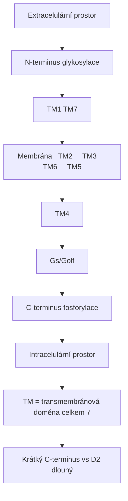

<details>
<summary>ASCII verze diagramu</summary>

```
                    Extracelulární prostor
                           │
    N-terminus ───┬────────┼────────┬─── glykosylace
                  │   TM1  │  TM7   │
         ┌────────┼────────┼────────┼────────┐
Membrána │  TM2   │  TM3   │  TM6   │  TM5   │
         └────────┼────────┼────────┼────────┘
                  │   TM4  │        │
                  │        │ Gs/Golf│
    C-terminus ───┴────────┴────────┴─── fosforylace
                    Intracelulární prostor

TM = transmembránová doména (celkem 7)
Krátký C-terminus (vs D2 dlouhý)
```

</details>

---

## Distribuce v mozku

### Regionální exprese

| Oblast | Exprese | Funkce |
|--------|---------|--------|
| **Striatum (kaudát, putamen)** | Velmi vysoká | Motorika, habity |
| **Nucleus accumbens** | Velmi vysoká | Odměna, motivace |
| **Prefrontální kortex** | Střední | Pracovní paměť, kognice |
| **Amygdala** | Střední | Emoční zpracování |
| **Hippocampus** | Nízká-střední | Paměťová konsolidace |
| **Substantia nigra** | Nízká | Modulace |
| **Olfactory tubercle** | Vysoká | Čichová odměna |

### Buněčná lokalizace ve striatu

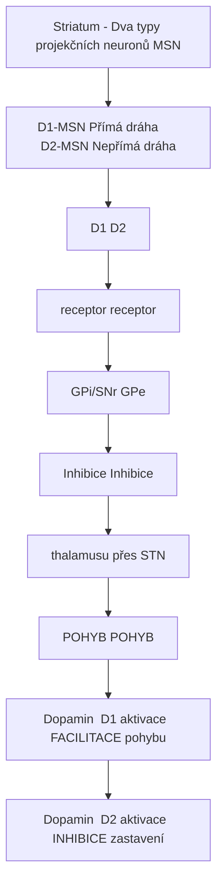

<details>
<summary>ASCII verze diagramu</summary>

```
Striatum - Dva typy projekčních neuronů (MSN)
┌─────────────────────────────────────────────────────┐
│                                                     │
│   D1-MSN (Přímá dráha)      D2-MSN (Nepřímá dráha)│
│         │                          │               │
│         ↓                          ↓               │
│   ┌─────┴─────┐              ┌─────┴─────┐        │
│   │    D1     │              │    D2     │        │
│   │ receptor  │              │ receptor  │        │
│   └─────┬─────┘              └─────┬─────┘        │
│         │                          │               │
│         ↓                          ↓               │
│   → GPi/SNr                  → GPe                │
│         │                          │               │
│         ↓                          ↓               │
│   ↓ Inhibice                 ↑ Inhibice           │
│   thalamusu                  (přes STN)           │
│         │                          │               │
│         ↓                          ↓               │
│   ↑ POHYB                    ↓ POHYB              │
│                                                     │
│   Dopamin → D1 aktivace → FACILITACE pohybu       │
│   Dopamin → D2 aktivace → INHIBICE zastavení      │
│                                                     │
└─────────────────────────────────────────────────────┘
```

</details>

---

## Signální dráhy

### Primární kaskáda (Gs/Golf)

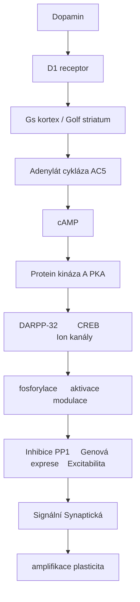

<details>
<summary>ASCII verze diagramu</summary>

```
Dopamin
    ↓
D1 receptor
    ↓
Gs (kortex) / Golf (striatum)
    ↓
Adenylát cykláza (AC5)
    ↓
↑ cAMP
    ↓
Protein kináza A (PKA)
    ↓
┌───────────────────┬───────────────────┐
↓                   ↓                   ↓
DARPP-32         CREB              Ion kanály
fosforylace      aktivace          modulace
    │               │                   │
    ↓               │                   ↓
Inhibice PP1     Genová exprese    Excitabilita
    │               │
    ↓               ↓
Signální         Synaptická
amplifikace      plasticita
```

</details>

### DARPP-32 - Signální integrátor

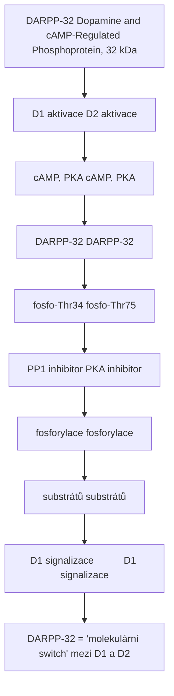

<details>
<summary>ASCII verze diagramu</summary>

```
DARPP-32 (Dopamine and cAMP-Regulated Phosphoprotein, 32 kDa)
┌─────────────────────────────────────────────────────┐
│                                                     │
│   D1 aktivace                D2 aktivace           │
│        │                          │                 │
│        ↓                          ↓                 │
│   ↑ cAMP, ↑ PKA              ↓ cAMP, ↓ PKA        │
│        │                          │                 │
│        ↓                          ↓                 │
│   DARPP-32                   DARPP-32              │
│   fosfo-Thr34                fosfo-Thr75           │
│   (PP1 inhibitor)            (PKA inhibitor)       │
│        │                          │                 │
│        ↓                          ↓                 │
│   ↑ fosforylace             ↓ fosforylace          │
│   substrátů                 substrátů              │
│        │                          │                 │
│        ↓                          ↓                 │
│   D1 signalizace ↑          D1 signalizace ↓      │
│                                                     │
│   DARPP-32 = "molekulární switch" mezi D1 a D2    │
│                                                     │
└─────────────────────────────────────────────────────┘
```

</details>

### Sekundární dráhy

| Dráha | Mechanismus | Funkce |
|-------|-------------|--------|
| **ERK/MAPK** | PKA → Ras → ERK | Plasticita, učení |
| **NMDA potenciace** | PKA → GluN1 fosforylace | Synaptická posílení |
| **L-type Ca²⁺** | PKA → Cav1.2 | Excitabilita |
| **β-arrestin** | Desenzitizace | Internalizace |

---

## Funkce

### Odměna a motivace

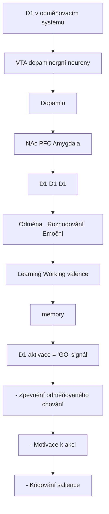

<details>
<summary>ASCII verze diagramu</summary>

```
D1 v odměňovacím systému
┌─────────────────────────────────────────────────────┐
│                                                     │
│   VTA (dopaminergní neurony)                       │
│              │                                      │
│              ↓ Dopamin                             │
│              │                                      │
│   ┌──────────┼──────────┐                          │
│   ↓          ↓          ↓                          │
│  NAc        PFC       Amygdala                     │
│   │          │          │                          │
│   ↓          ↓          ↓                          │
│  D1         D1         D1                          │
│   │          │          │                          │
│   ↓          ↓          ↓                          │
│ Odměna   Rozhodování  Emoční                      │
│ Learning  Working    valence                       │
│           memory                                    │
│                                                     │
│   D1 aktivace = "GO" signál                        │
│   - Zpevnění odměňovaného chování                  │
│   - Motivace k akci                                │
│   - Kódování salience                              │
│                                                     │
└─────────────────────────────────────────────────────┘
```

</details>

### Motorické funkce

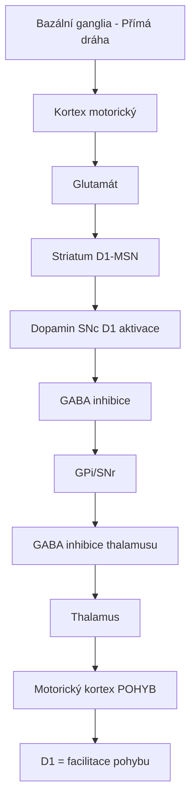

<details>
<summary>ASCII verze diagramu</summary>

```
Bazální ganglia - Přímá dráha
┌─────────────────────────────────────────────────────┐
│                                                     │
│   Kortex (motorický)                               │
│         │                                          │
│         ↓ Glutamát                                 │
│         │                                          │
│   Striatum (D1-MSN)                                │
│         │                                          │
│         │ ← Dopamin (SNc) → D1 aktivace           │
│         │                                          │
│         ↓ GABA (↑ inhibice)                       │
│         │                                          │
│   GPi/SNr                                          │
│         │                                          │
│         ↓ GABA (↓ inhibice thalamusu)             │
│         │                                          │
│   Thalamus                                         │
│         │                                          │
│         ↓ Glutamát (↑)                            │
│         │                                          │
│   Motorický kortex → POHYB ↑                      │
│                                                     │
│   D1 = facilitace pohybu                           │
│                                                     │
└─────────────────────────────────────────────────────┘
```

</details>

### Pracovní paměť (PFC)

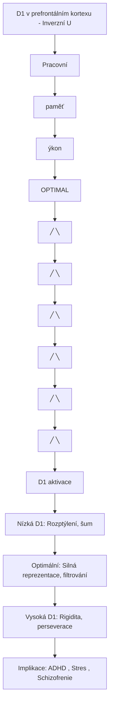

<details>
<summary>ASCII verze diagramu</summary>

```
D1 v prefrontálním kortexu - Inverzní U
┌─────────────────────────────────────────────────────┐
│                                                     │
│   Pracovní                                          │
│   paměť                                             │
│   výkon    ┌──────────────────┐                    │
│     │      │     OPTIMAL      │                    │
│     │     ╱│                  │╲                   │
│     │    ╱ │                  │ ╲                  │
│     │   ╱  │                  │  ╲                 │
│     │  ╱   │                  │   ╲                │
│     │ ╱    │                  │    ╲               │
│     │╱     │                  │     ╲              │
│     └──────┴──────────────────┴──────────→         │
│           D1 aktivace                               │
│                                                     │
│   Nízká D1:  Rozptýlení, šum                       │
│   Optimální: Silná reprezentace, filtrování        │
│   Vysoká D1: Rigidita, perseverace                 │
│                                                     │
│   Implikace: ADHD (↓), Stres (↑), Schizofrenie    │
│                                                     │
└─────────────────────────────────────────────────────┘
```

</details>

---

## Farmakologie

### Agonisté

| Látka | Selektivita | Ki (nM) | Použití |
|-------|-------------|---------|---------|
| **Dopamin** | D1 = D2 | 1-10 | Endogenní |
| **SKF-81297** | D1 selektivní | 0.2-1 | Výzkum |
| **SKF-38393** | D1 parciální | 10-50 | Výzkum |
| **A-68930** | D1 selektivní | 2-10 | Výzkum |
| **Dihydrexidine** | D1/D5 | 10-50 | Kognice (výzkum) |
| **Fenoldopam** | D1-like | 5-20 | Hypertenzní krize |

### Antagonisté

| Látka | Selektivita | Ki (nM) | Použití |
|-------|-------------|---------|---------|
| **SCH-23390** | D1 selektivní | 0.1-0.5 | Výzkum |
| **SCH-39166** | D1 selektivní | 0.5-2 | Výzkum |
| **Haloperidol** | D2 >> D1 | 100 (D1) | Antipsychotikum |

### Nepřímé modulátory

| Látka | Mechanismus | D1 efekt |
|-------|-------------|----------|
| **Amfetamin** | ↑ DA uvolnění | ↑↑ D1 aktivace |
| **Kokain** | DAT blokáda | ↑ D1 aktivace |
| **Methylfenidát** | DAT blokáda | ↑ D1 aktivace |
| **L-DOPA** | DA prekurzor | ↑ D1 aktivace |

---

## Klinické aplikace

### Parkinsonova choroba

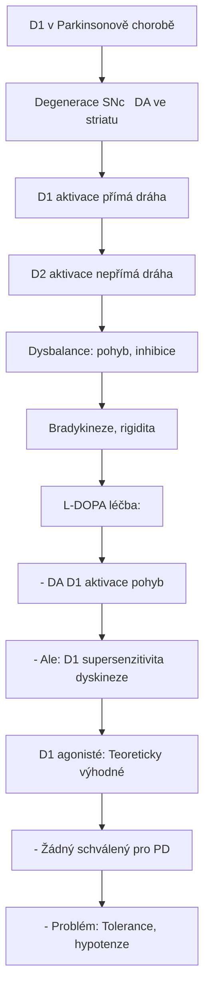

<details>
<summary>ASCII verze diagramu</summary>

```
D1 v Parkinsonově chorobě
┌─────────────────────────────────────────────────────┐
│                                                     │
│   Degenerace SNc → ↓ DA ve striatu                │
│              │                                      │
│              ↓                                      │
│   ↓ D1 aktivace (přímá dráha)                     │
│   ↓ D2 aktivace (nepřímá dráha)                   │
│              │                                      │
│              ↓                                      │
│   Dysbalance: ↓ pohyb, ↑ inhibice                 │
│              │                                      │
│              ↓                                      │
│   Bradykineze, rigidita                            │
│                                                     │
│   L-DOPA léčba:                                    │
│   - ↑ DA → ↑ D1 aktivace → ↑ pohyb               │
│   - Ale: D1 supersenzitivita → dyskineze          │
│                                                     │
│   D1 agonisté: Teoreticky výhodné                 │
│   - Žádný schválený pro PD                        │
│   - Problém: Tolerance, hypotenze                  │
│                                                     │
└─────────────────────────────────────────────────────┘
```

</details>

### L-DOPA indukované dyskineze (LID)

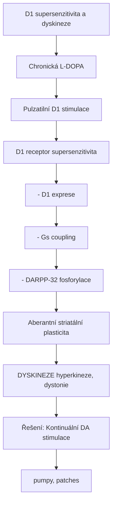

<details>
<summary>ASCII verze diagramu</summary>

```
D1 supersenzitivita a dyskineze
┌─────────────────────────────────────────────────────┐
│                                                     │
│   Chronická L-DOPA                                 │
│              │                                      │
│              ↓                                      │
│   Pulzatilní D1 stimulace                          │
│              │                                      │
│              ↓                                      │
│   D1 receptor supersenzitivita                     │
│   - ↑ D1 exprese                                   │
│   - ↑ Gs coupling                                  │
│   - ↑ DARPP-32 fosforylace                        │
│              │                                      │
│              ↓                                      │
│   Aberantní striatální plasticita                  │
│              │                                      │
│              ↓                                      │
│   DYSKINEZE (hyperkineze, dystonie)               │
│                                                     │
│   Řešení: Kontinuální DA stimulace                │
│           (pumpy, patches)                         │
│                                                     │
└─────────────────────────────────────────────────────┘
```

</details>

### Závislost

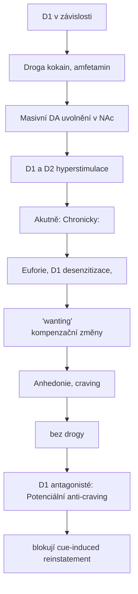

<details>
<summary>ASCII verze diagramu</summary>

```
D1 v závislosti
┌─────────────────────────────────────────────────────┐
│                                                     │
│   Droga (kokain, amfetamin)                        │
│              │                                      │
│              ↓                                      │
│   Masivní DA uvolnění v NAc                        │
│              │                                      │
│              ↓                                      │
│   D1 (a D2) hyperstimulace                         │
│              │                                      │
│              ↓                                      │
│   ┌──────────┴──────────┐                          │
│   ↓                     ↓                          │
│ Akutně:           Chronicky:                       │
│ Euforie,          D1 desenzitizace,               │
│ "wanting"         kompenzační změny               │
│                         │                          │
│                         ↓                          │
│                   Anhedonie, craving               │
│                   (bez drogy)                      │
│                                                     │
│   D1 antagonisté: Potenciální anti-craving        │
│   (blokují cue-induced reinstatement)             │
│                                                     │
└─────────────────────────────────────────────────────┘
```

</details>

### Kognitivní enhancement

| Indikace | D1 přístup | Status |
|----------|------------|--------|
| **ADHD** | D1 agonisté | Preklinická |
| **Schizofrenie (kognice)** | D1 agonisté | Fáze II |
| **Stárnoucí mozek** | D1 agonisté | Výzkum |
| **Pracovní paměť** | D1 PAM | Výzkum |

---

## Synaptická plasticita

### D1-NMDA synergie

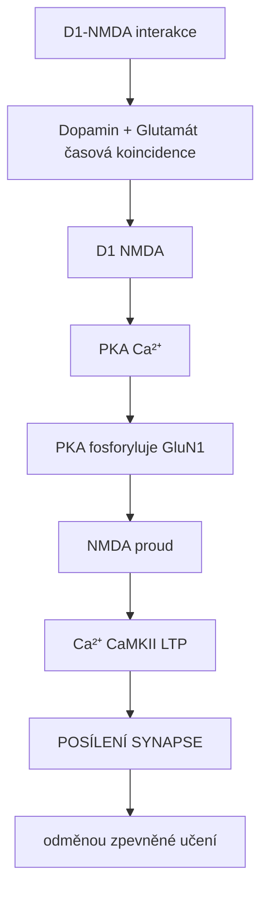

<details>
<summary>ASCII verze diagramu</summary>

```
D1-NMDA interakce
┌─────────────────────────────────────────────────────┐
│                                                     │
│   Dopamin + Glutamát (časová koincidence)         │
│              │                                      │
│   ┌──────────┼──────────┐                          │
│   ↓          │          ↓                          │
│  D1          │        NMDA                         │
│   │          │          │                          │
│   ↓          │          ↓                          │
│ PKA          │        Ca²⁺                        │
│   │          │          │                          │
│   └──────────┼──────────┘                          │
│              ↓                                      │
│   PKA fosforyluje GluN1                            │
│   (↑ NMDA proud)                                   │
│              │                                      │
│              ↓                                      │
│   ↑ Ca²⁺ → ↑ CaMKII → ↑ LTP                      │
│              │                                      │
│              ↓                                      │
│   POSÍLENÍ SYNAPSE                                 │
│   (odměnou zpevněné učení)                         │
│                                                     │
└─────────────────────────────────────────────────────┘
```

</details>

### Spike-timing dependent plasticity

| Podmínka | D1 stav | Plasticita |
|----------|---------|------------|
| **Pre před post + DA** | Aktivní | LTP |
| **Post před pre + DA** | Aktivní | LTD |
| **Bez DA** | Neaktivní | Žádná změna |

---

## Genetické varianty

### Polymorfismy DRD1

| SNP | Pozice | Asociace |
|-----|--------|----------|
| **rs4532** | 5' UTR | ADHD, závislosti |
| **rs686** | 3' UTR | Schizofrenie |
| **rs5326** | Promotor | Nikotinová závislost |

### Klinické implikace

| Varianta | Fenotyp |
|----------|---------|
| **↓ D1 exprese** | ↑ riziko závislosti |
| **Promotorové varianty** | Odpověď na léčbu |
| **3' UTR varianty** | mRNA stabilita |

---

## Srovnání D1 vs D2

| Vlastnost | **D1** | D2 |
|-----------|--------|-----|
| **G-protein** | Gs/Golf | Gi/Go |
| **cAMP** | ↑ | ↓ |
| **Striatální MSN** | Přímá dráha | Nepřímá dráha |
| **Motorika** | Facilitace | Inhibice stop |
| **Odměna** | "GO" signál | Modulace |
| **Antipsychotika** | Sekundární cíl | Primární cíl |
| **Parkinson** | Hypoaktivní | Hypoaktivní |

---

## Reference

1. Beaulieu, J.M. & Bhargava, A. (2020). *D1 dopamine receptors*. In The Dopamine Receptors. Humana Press.
2. Calabresi, P. et al. (2014). *Direct and indirect pathways of basal ganglia: a critical reappraisal*. Nature Neuroscience.
3. Shen, W. et al. (2008). *Dichotomous dopaminergic control of striatal synaptic plasticity*. Science.
4. Goldman-Rakic, P.S. et al. (2004). *D1 receptors in prefrontal cells and circuits*. Brain Research Reviews.

---

Viz také:
- [D2 receptor](@/receptors/d2.md) - Komplementární dopaminový receptor
- [5-HT2A receptor](@/receptors/5-ht2a.md) - Interakce s dopaminem
- [NMDA receptor](@/receptors/nmda.md) - D1-NMDA synergie
- [Amfetaminy](@/alkaloids/_index.md) - Nepřímí D1 agonisté
- [Glosář](@/glossary/_index.md) - Definice pojmů

<- Zpět na [Receptory](@/receptors/_index.md) | [D2 receptor](@/receptors/d2.md) ->
