+++
title = "Dopamin D2 receptor"
description = "Dopaminový D2 receptor - primární cíl antipsychotik a klíčový modulátor závislosti"
weight = 11
insert_anchor_links = "right"

[taxonomies]
categories = ["receptory", "dopamin", "GPCR"]
tags = ["D2", "dopamin", "antipsychotika", "závislost", "schizofrenie", "prolaktin"]
+++

# Dopamin D2 receptor - Centrální hráč v psychiatrii

**Dopamin D2 receptor** (DRD2) je **G-protein spřažený receptor** patřící do D2-like rodiny. Je **primárním cílem antipsychotik**, klíčovým regulátorem **motoriky**, **odměny** a **prolaktinu**. Pochopení D2 receptoru je zásadní pro psychiatrii, neurologii a výzkum závislostí.

---

## Základní charakteristika

### Klasifikace

| Vlastnost | Hodnota |
|-----------|---------|
| **Rodina** | G-protein spřažené receptory (GPCR) |
| **Podrodina** | D2-like (D2, D3, D4) |
| **Gen** | DRD2 |
| **Chromozom** | 11q23.2 |
| **Délka** | D2L: 443 aa, D2S: 414 aa |
| **G-protein** | Gi/Go (inhibiční) |

### Isoformy (alternativní splicing)

| Isoforma | Délka | Lokalizace | Funkce |
|----------|-------|------------|--------|
| **D2L (Long)** | 443 aa | Postsynaptická | Postsynaptická signalizace |
| **D2S (Short)** | 414 aa | Presynaptická | Autoreceptor |

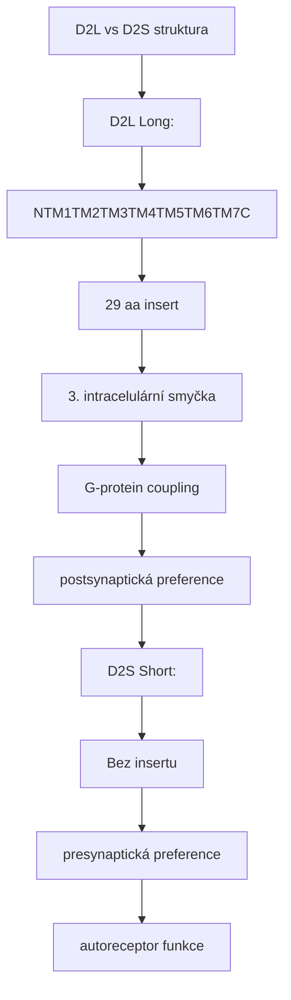

<details>
<summary>ASCII verze diagramu</summary>

```
D2L vs D2S struktura
┌─────────────────────────────────────────────────────┐
│                                                     │
│   D2L (Long):                                       │
│   N──TM1─TM2─TM3─TM4─TM5─TM6─TM7──C               │
│              ↑                                      │
│         29 aa insert                               │
│         (3. intracelulární smyčka)                │
│         → ↑ G-protein coupling                    │
│         → postsynaptická preference               │
│                                                     │
│   D2S (Short):                                     │
│   N──TM1─TM2─TM3─TM4─TM5─TM6─TM7──C               │
│              ↑                                      │
│         Bez insertu                                │
│         → presynaptická preference                │
│         → autoreceptor funkce                     │
│                                                     │
└─────────────────────────────────────────────────────┘
```

</details>

---

## Distribuce v mozku

### Regionální exprese

| Oblast | Exprese | Funkce |
|--------|---------|--------|
| **Striatum** | Velmi vysoká | Motorika, habity |
| **Nucleus accumbens** | Velmi vysoká | Odměna, motivace |
| **VTA** | Střední (autoreceptor) | DA regulace |
| **Substantia nigra** | Střední | DA regulace |
| **Prefrontální kortex** | Nízká | Kognice |
| **Hypofýza** | Vysoká | Prolaktin inhibice |
| **Hypothalamus** | Střední | Neuroendokrinní |

### Buněčná lokalizace

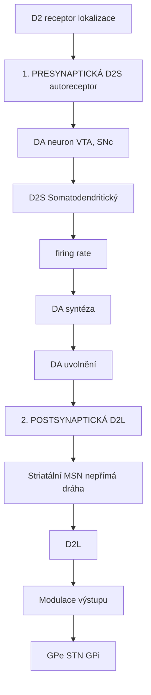

<details>
<summary>ASCII verze diagramu</summary>

```
D2 receptor lokalizace
┌─────────────────────────────────────────────────────┐
│                                                     │
│   1. PRESYNAPTICKÁ (D2S autoreceptor)             │
│                                                     │
│      DA neuron (VTA, SNc)                          │
│           │                                        │
│      ┌────┴────┐                                   │
│      │   D2S   │ ← Somatodendritický              │
│      └────┬────┘                                   │
│           │                                        │
│           ↓                                        │
│      ↓ firing rate                                │
│      ↓ DA syntéza                                 │
│      ↓ DA uvolnění                                │
│                                                     │
│   2. POSTSYNAPTICKÁ (D2L)                         │
│                                                     │
│      Striatální MSN (nepřímá dráha)               │
│           │                                        │
│      ┌────┴────┐                                   │
│      │   D2L   │                                   │
│      └────┬────┘                                   │
│           │                                        │
│           ↓                                        │
│      Modulace výstupu                             │
│      (→ GPe → STN → GPi)                         │
│                                                     │
└─────────────────────────────────────────────────────┘
```

</details>

---

## Signální dráhy

### Primární kaskáda (Gi/Go)

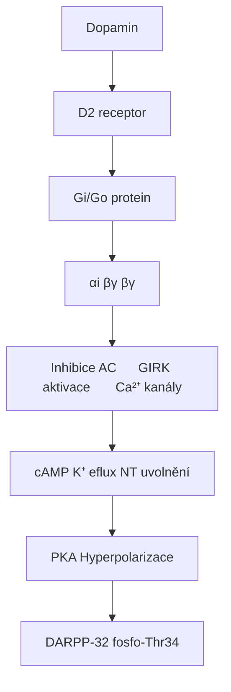

<details>
<summary>ASCII verze diagramu</summary>

```
Dopamin
    ↓
D2 receptor
    ↓
Gi/Go protein
    ↓
┌───────────────────┬───────────────────┐
↓                   ↓                   ↓
αi                  βγ                  βγ
↓                   ↓                   ↓
Inhibice AC      GIRK aktivace      ↓ Ca²⁺ kanály
↓                   ↓                   ↓
↓ cAMP           K⁺ eflux           ↓ NT uvolnění
↓                   ↓
↓ PKA            Hyperpolarizace
↓
↓ DARPP-32 fosfo-Thr34
```

</details>

### β-arrestin dráha

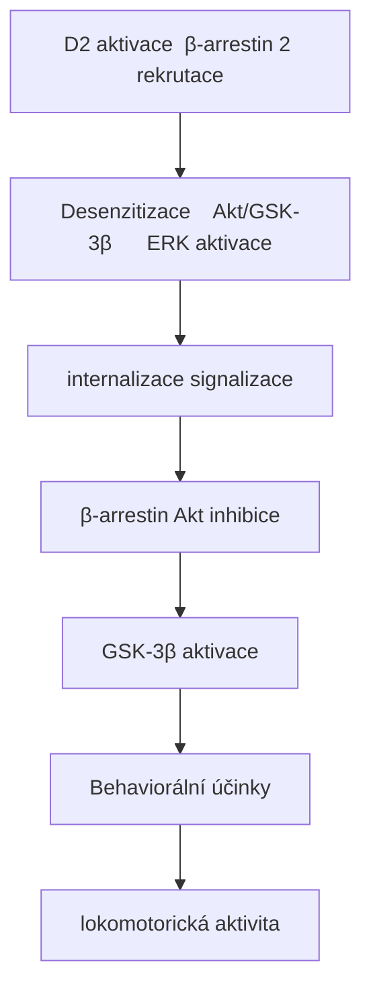

<details>
<summary>ASCII verze diagramu</summary>

```
D2 aktivace → β-arrestin 2 rekrutace
                    │
                    ↓
    ┌───────────────┼───────────────┐
    ↓               ↓               ↓
Desenzitizace    Akt/GSK-3β      ERK aktivace
(internalizace)  signalizace
                    │
                    ↓
              β-arrestin → Akt inhibice
                    │
                    ↓
              GSK-3β aktivace
                    │
                    ↓
              Behaviorální účinky
              (lokomotorická aktivita)
```

</details>

### Biased agonism na D2

| Ligand | G-protein | β-arrestin | Klinický profil |
|--------|-----------|------------|-----------------|
| **Dopamin** | +++ | +++ | Endogenní |
| **Aripiprazol** | ++ | + | Parciální, atypický |
| **Haloperidol** | 0 (antagonista) | 0 | Typický AP |
| **UNC9994** | 0 | +++ | β-arrestin biased |

---

## D2 jako autoreceptor

### Regulace dopaminové transmise

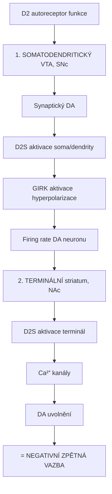

<details>
<summary>ASCII verze diagramu</summary>

```
D2 autoreceptor funkce
┌─────────────────────────────────────────────────────┐
│                                                     │
│   1. SOMATODENDRITICKÝ (VTA, SNc)                 │
│                                                     │
│      ↑ Synaptický DA                               │
│           │                                        │
│           ↓                                        │
│      D2S aktivace (soma/dendrity)                 │
│           │                                        │
│           ↓                                        │
│      GIRK aktivace → hyperpolarizace              │
│           │                                        │
│           ↓                                        │
│      ↓ Firing rate DA neuronu                     │
│                                                     │
│   2. TERMINÁLNÍ (striatum, NAc)                   │
│                                                     │
│      ↑ Synaptický DA                               │
│           │                                        │
│           ↓                                        │
│      D2S aktivace (terminál)                      │
│           │                                        │
│           ↓                                        │
│      ↓ Ca²⁺ kanály                                │
│           │                                        │
│           ↓                                        │
│      ↓ DA uvolnění                                │
│                                                     │
│   = NEGATIVNÍ ZPĚTNÁ VAZBA                        │
│                                                     │
└─────────────────────────────────────────────────────┘
```

</details>

### Farmakologické implikace

| Látka | D2 autoreceptor efekt | Klinický důsledek |
|-------|----------------------|-------------------|
| **Nízké dávky agonistů** | Preferenční aktivace | ↓ DA (paradoxní) |
| **Vysoké dávky agonistů** | Post + pre aktivace | ↑ DA signalizace |
| **Antagonisté** | Blokáda autoreceptoru | ↑ DA uvolnění |

---

## Antipsychotika a D2

### D2 hypotéza schizofrenie

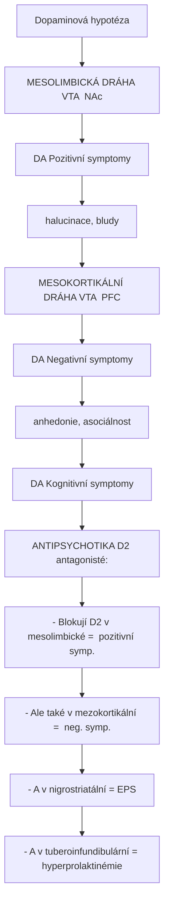

<details>
<summary>ASCII verze diagramu</summary>

```
Dopaminová hypotéza
┌─────────────────────────────────────────────────────┐
│                                                     │
│   MESOLIMBICKÁ DRÁHA (VTA → NAc)                  │
│   ───────────────────────────────                  │
│   ↑ DA → Pozitivní symptomy                        │
│   (halucinace, bludy)                              │
│                                                     │
│   MESOKORTIKÁLNÍ DRÁHA (VTA → PFC)                │
│   ─────────────────────────────────                │
│   ↓ DA → Negativní symptomy                        │
│   (anhedonie, asociálnost)                         │
│   ↓ DA → Kognitivní symptomy                       │
│                                                     │
│   ANTIPSYCHOTIKA (D2 antagonisté):                │
│   - Blokují D2 v mesolimbické = ↓ pozitivní symp. │
│   - Ale také v mezokortikální = ↑ neg. symp.      │
│   - A v nigrostriatální = EPS                     │
│   - A v tuberoinfundibulární = hyperprolaktinémie │
│                                                     │
└─────────────────────────────────────────────────────┘
```

</details>

### D2 okupace a klinický účinek

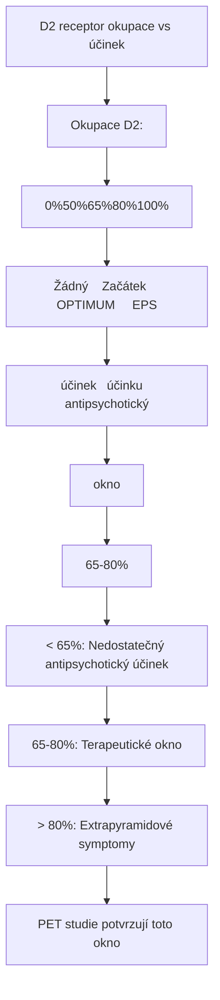

<details>
<summary>ASCII verze diagramu</summary>

```
D2 receptor okupace vs účinek
┌─────────────────────────────────────────────────────┐
│                                                     │
│   Okupace D2:                                       │
│                                                     │
│   0%────────50%────────65%────────80%────────100% │
│      │         │          │          │             │
│      │         │          │          │             │
│      ↓         ↓          ↓          ↓             │
│   Žádný    Začátek    OPTIMUM     EPS             │
│   účinek   účinku   antipsychotický               │
│                      okno                          │
│                    (65-80%)                        │
│                                                     │
│   < 65%: Nedostatečný antipsychotický účinek      │
│   65-80%: Terapeutické okno                       │
│   > 80%: Extrapyramidové symptomy                 │
│                                                     │
│   PET studie potvrzují toto okno                  │
│                                                     │
└─────────────────────────────────────────────────────┘
```

</details>

### Přehled antipsychotik

| Třída | Příklady | D2 afinita | Další cíle | Profil |
|-------|----------|------------|------------|--------|
| **Typická (FGA)** | Haloperidol, Chlorpromazin | Vysoká | Minimální | EPS, prolaktin |
| **Atypická (SGA)** | Risperidon, Olanzapin | Střední | 5-HT2A blok | Méně EPS, metabolické |
| **Parciální agonisté** | Aripiprazol, Brexpiprazol | Parciální | 5-HT1A | Nejméně EPS |

### Mechanismus atypických antipsychotik

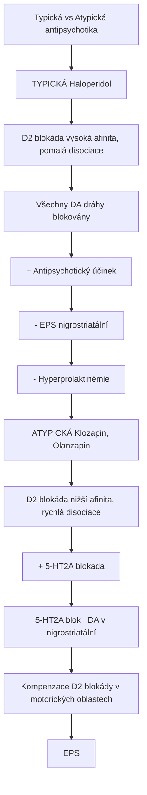

<details>
<summary>ASCII verze diagramu</summary>

```
Typická vs Atypická antipsychotika
┌─────────────────────────────────────────────────────┐
│                                                     │
│   TYPICKÁ (Haloperidol)                            │
│   ─────────────────────                            │
│   D2 blokáda (vysoká afinita, pomalá disociace)   │
│              │                                      │
│              ↓                                      │
│   Všechny DA dráhy blokovány                       │
│              │                                      │
│              ↓                                      │
│   + Antipsychotický účinek                         │
│   - EPS (nigrostriatální)                          │
│   - Hyperprolaktinémie                             │
│                                                     │
│   ATYPICKÁ (Klozapin, Olanzapin)                  │
│   ──────────────────────────────                   │
│   D2 blokáda (nižší afinita, rychlá disociace)    │
│   + 5-HT2A blokáda                                │
│              │                                      │
│              ↓                                      │
│   5-HT2A blok → ↑ DA v nigrostriatální            │
│              │                                      │
│              ↓                                      │
│   Kompenzace D2 blokády v motorických oblastech   │
│              │                                      │
│              ↓                                      │
│   ↓ EPS                                            │
│                                                     │
└─────────────────────────────────────────────────────┘
```

</details>

---

## D2 a závislost

### Reward deficiency syndrome

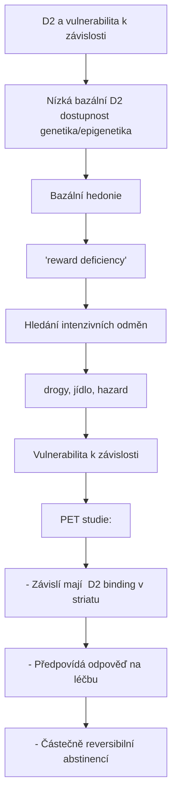

<details>
<summary>ASCII verze diagramu</summary>

```
D2 a vulnerabilita k závislosti
┌─────────────────────────────────────────────────────┐
│                                                     │
│   Nízká bazální D2 dostupnost (genetika/epigenetika)
│              │                                      │
│              ↓                                      │
│   ↓ Bazální hedonie                                │
│   ("reward deficiency")                            │
│              │                                      │
│              ↓                                      │
│   Hledání intenzivních odměn                       │
│   (drogy, jídlo, hazard)                           │
│              │                                      │
│              ↓                                      │
│   ↑ Vulnerabilita k závislosti                     │
│                                                     │
│   PET studie:                                      │
│   - Závislí mají ↓ D2 binding v striatu           │
│   - Předpovídá odpověď na léčbu                    │
│   - Částečně reversibilní abstinencí              │
│                                                     │
└─────────────────────────────────────────────────────┘
```

</details>

### D2 downregulace u závislosti

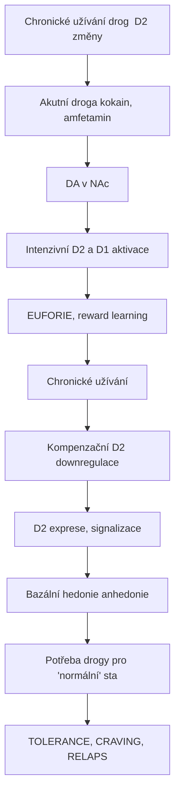

<details>
<summary>ASCII verze diagramu</summary>

```
Chronické užívání drog → D2 změny
┌─────────────────────────────────────────────────────┐
│                                                     │
│   Akutní droga (kokain, amfetamin)                │
│              │                                      │
│              ↓                                      │
│   ↑↑↑ DA v NAc                                    │
│              │                                      │
│              ↓                                      │
│   Intenzivní D2 (a D1) aktivace                   │
│              │                                      │
│              ↓                                      │
│   EUFORIE, reward learning                         │
│                                                     │
│   Chronické užívání                                │
│              │                                      │
│              ↓                                      │
│   Kompenzační D2 downregulace                      │
│   (↓ D2 exprese, ↓ signalizace)                   │
│              │                                      │
│              ↓                                      │
│   ↓ Bazální hedonie (anhedonie)                   │
│   ↑ Potřeba drogy pro "normální" stav            │
│              │                                      │
│              ↓                                      │
│   TOLERANCE, CRAVING, RELAPS                       │
│                                                     │
└─────────────────────────────────────────────────────┘
```

</details>

---

## D2 a prolaktin

### Tuberoinfundibulární dráha

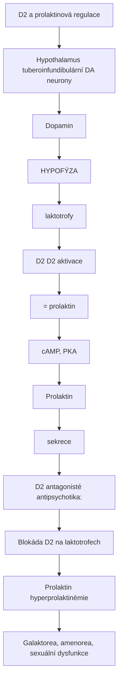

<details>
<summary>ASCII verze diagramu</summary>

```
D2 a prolaktinová regulace
┌─────────────────────────────────────────────────────┐
│                                                     │
│   Hypothalamus (tuberoinfundibulární DA neurony)  │
│              │                                      │
│              ↓ Dopamin                             │
│              │                                      │
│   ┌──────────┴──────────┐                          │
│   │      HYPOFÝZA       │                          │
│   │    (laktotrofy)     │                          │
│   │          │          │                          │
│   │     ┌────┴────┐     │                          │
│   │     │   D2    │     │ ← D2 aktivace           │
│   │     └────┬────┘     │   = ↓ prolaktin         │
│   │          │          │                          │
│   │          ↓          │                          │
│   │   ↓ cAMP, ↓ PKA    │                          │
│   │          ↓          │                          │
│   │   ↓ Prolaktin       │                          │
│   │     sekrece         │                          │
│   └─────────────────────┘                          │
│                                                     │
│   D2 antagonisté (antipsychotika):                │
│   → Blokáda D2 na laktotrofech                    │
│   → ↑ Prolaktin (hyperprolaktinémie)             │
│   → Galaktorea, amenorea, sexuální dysfunkce     │
│                                                     │
└─────────────────────────────────────────────────────┘
```

</details>

### Prolaktin-sparing antipsychotika

| Látka | Prolaktin efekt | Mechanismus |
|-------|-----------------|-------------|
| **Aripiprazol** | Minimální/↓ | Parciální agonismus |
| **Klozapin** | Minimální | Rychlá D2 disociace |
| **Quetiapin** | Minimální | Rychlá D2 disociace |
| **Risperidon** | ↑↑ | Silný D2 antagonismus |
| **Haloperidol** | ↑↑↑ | Silný D2 antagonismus |

---

## Motorické funkce

### Bazální ganglia - Nepřímá dráha

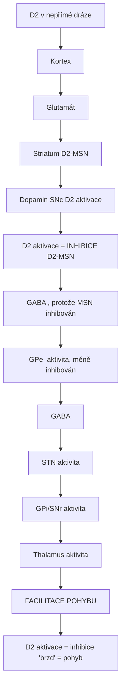

<details>
<summary>ASCII verze diagramu</summary>

```
D2 v nepřímé dráze
┌─────────────────────────────────────────────────────┐
│                                                     │
│   Kortex                                            │
│      │                                              │
│      ↓ Glutamát                                    │
│      │                                              │
│   Striatum (D2-MSN)                                │
│      │                                              │
│      │ ← Dopamin (SNc) → D2 aktivace              │
│      │                                              │
│      │   D2 aktivace = INHIBICE D2-MSN            │
│      │                                              │
│      ↓ GABA (↓, protože MSN inhibován)            │
│      │                                              │
│   GPe (↑ aktivita, méně inhibován)                │
│      │                                              │
│      ↓ GABA (↑)                                    │
│      │                                              │
│   STN (↓ aktivita)                                 │
│      │                                              │
│      ↓ Glutamát (↓)                               │
│      │                                              │
│   GPi/SNr (↓ aktivita)                            │
│      │                                              │
│      ↓ GABA (↓)                                    │
│      │                                              │
│   Thalamus (↑ aktivita)                            │
│      │                                              │
│      ↓ → FACILITACE POHYBU                        │
│                                                     │
│   D2 aktivace = inhibice "brzd" = pohyb           │
│                                                     │
└─────────────────────────────────────────────────────┘
```

</details>

### Extrapyramidové symptomy (EPS)

| Typ | Časový nástup | Mechanismus | Léčba |
|-----|---------------|-------------|-------|
| **Akutní dystonie** | Hodiny-dny | D2 blokáda > kompenzace | Anticholinergika |
| **Akathisie** | Dny-týdny | ↓ DA v motorických oblastech | β-blokátory, BZ |
| **Parkinsonismus** | Týdny | D2 blokáda v striatu | ↓ dávka, anticholinergika |
| **Tardivní dyskineze** | Měsíce-roky | D2 supersenzitivita | Valbenazin, změna AP |

---

## Genetické varianty

### Polymorfismy DRD2

| SNP | Lokalizace | Efekt | Asociace |
|-----|------------|-------|----------|
| **Taq1A (rs1800497)** | 3' (ANKK1 gen) | ↓ D2 exprese | Závislosti, obezita |
| **-141C Ins/Del (rs1799732)** | Promotor | ↓ exprese | Schizofrenie |
| **C957T (rs6277)** | Exon 7 | mRNA stabilita | Kognice, závislost |
| **Ser311Cys (rs1801028)** | Kodující | Změněná funkce | Schizofrenie |

### Taq1A a závislost

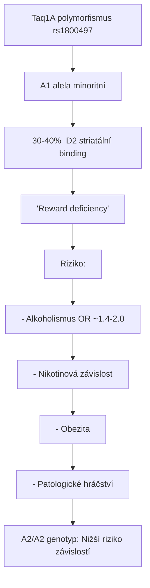

<details>
<summary>ASCII verze diagramu</summary>

```
Taq1A polymorfismus (rs1800497)
┌─────────────────────────────────────────────────────┐
│                                                     │
│   A1 alela (minoritní)                             │
│              │                                      │
│              ↓                                      │
│   30-40% ↓ D2 striatální binding                  │
│              │                                      │
│              ↓                                      │
│   "Reward deficiency"                              │
│              │                                      │
│              ↓                                      │
│   ↑ Riziko:                                        │
│   - Alkoholismus (OR ~1.4-2.0)                    │
│   - Nikotinová závislost                           │
│   - Obezita                                        │
│   - Patologické hráčství                           │
│                                                     │
│   A2/A2 genotyp: Nižší riziko závislostí          │
│                                                     │
└─────────────────────────────────────────────────────┘
```

</details>

---

## Výzkumné nástroje

### Radioligandy pro PET

| Ligand | Typ | Použití |
|--------|-----|---------|
| **[11C]Raclopride** | Antagonista | Striatální D2/D3 |
| **[18F]Fallypride** | Antagonista | Striatální + extrastriatální |
| **[11C]-(+)-PHNO** | Agonista | D2/D3, funkční stav |

### Farmakologické nástroje

| Nástroj | Typ | Selektivita |
|---------|-----|-------------|
| **Quinpirole** | Agonista | D2/D3 |
| **Sulpiride** | Antagonista | D2/D3 |
| **L-741,626** | Antagonista | D2 selektivní |
| **Raclopride** | Antagonista | D2/D3 |

---

## Srovnání D2-like receptorů

| Vlastnost | **D2** | D3 | D4 |
|-----------|--------|-----|-----|
| **Lokalizace** | Striatum, hypofýza | NAc, VTA | PFC, amygdala |
| **Afinita DA** | Střední | Vysoká | Vysoká |
| **Autoreceptor** | Ano | Ano | Ne |
| **Antipsychotika** | Primární cíl | Sekundární | Klozapin |
| **Exprese** | Vysoká | Nízká | Velmi nízká |

---

## Reference

1. Beaulieu, J.M. & Bhargava, A. (2020). *D2 dopamine receptors*. In The Dopamine Receptors. Humana Press.
2. Howes, O.D. & Kapur, S. (2009). *The dopamine hypothesis of schizophrenia: version III*. Schizophrenia Bulletin.
3. Seeman, P. (2010). *Dopamine D2 receptors as treatment targets in schizophrenia*. Clinical Schizophrenia & Related Psychoses.
4. Volkow, N.D. et al. (2009). *Imaging dopamine's role in drug abuse and addiction*. Neuropharmacology.
5. Kapur, S. & Mamo, D. (2003). *Half a century of antipsychotics and still a central role for dopamine D2 receptors*. Progress in Neuro-Psychopharmacology & Biological Psychiatry.

---

Viz také:
- [D1 receptor](@/receptors/d1.md) - Komplementární dopaminový receptor
- [5-HT2A receptor](@/receptors/5-ht2a.md) - Cíl atypických antipsychotik
- [Sigma-1 receptor](@/receptors/sigma-1.md) - Další cíl antipsychotik
- [Glosář](@/glossary/_index.md) - Definice pojmů

<- Zpět na [Receptory](@/receptors/_index.md) | [Sigma-1 receptor](@/receptors/sigma-1.md) ->
