+++
title = "GABA-B receptor"
description = "Metabotropní GABA receptor - cíl baklofenu, GHB a modulátor synaptické plasticity"
weight = 7
insert_anchor_links = "right"

[taxonomies]
categories = ["receptory", "GABA", "GPCR"]
tags = ["GABA-B", "baklofen", "GHB", "spasticita", "závislost", "metabotropní"]
+++

# GABA-B receptor - Metabotropní strážce inhibice

**GABA-B receptor** je **metabotropní** (G-protein spřažený) receptor pro kyselinu gama-aminomáselnou (GABA). Na rozdíl od ionotropního [GABA-A receptoru](@/receptors/gaba-a.md) zprostředkovává **pomalou, prolongovanou inhibici** prostřednictvím G-proteinové signalizace. Je cílem **baklofenu** (myorelaxans) a místem účinku **GHB** (kyseliny gama-hydroxybutyrové).

---

## Základní charakteristika

### Klasifikace

| Vlastnost | Hodnota |
|-----------|---------|
| **Typ** | Metabotropní (GPCR) |
| **Rodina** | Třída C GPCR (glutamátová rodina) |
| **Struktura** | Obligátní heterodimer (GABABR1 + GABABR2) |
| **G-protein** | Gi/Go (inhibiční) |
| **Endogenní ligand** | GABA |
| **Časový průběh** | Pomalý nástup, prolongovaný účinek |

### Podjednotky

| Podjednotka | Gen | Funkce |
|-------------|-----|--------|
| **GABABR1** | GABBR1 | Vazba GABA, ligandy |
| **GABABR2** | GABBR2 | G-protein coupling, trafficking |

---

## Struktura receptoru

### Heterodimérní architektura

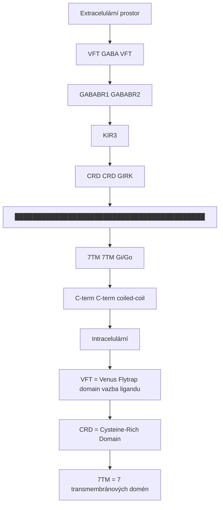

<details>
<summary>ASCII verze diagramu</summary>

```
              Extracelulární prostor
                      │
    ┌─────────────────┼─────────────────┐
    │                 │                 │
┌───┴───┐         ┌───┴───┐        ┌───┴───┐
│ VFT   │ ← GABA  │ VFT   │        │       │
│ GABABR1         │GABABR2│        │       │
└───┬───┘         └───┬───┘        │       │
    │                 │            │       │
┌───┴───┐         ┌───┴───┐        │ KIR3  │
│ CRD   │         │ CRD   │        │(GIRK) │
└───┬───┘         └───┬───┘        │       │
    │                 │            │       │
████████████████████████████████████│███████
    │                 │            │       │
┌───┴───┐         ┌───┴───┐        │       │
│ 7TM   │         │ 7TM   │ ← Gi/Go│       │
│       │         │       │        │       │
└───┬───┘         └───┬───┘        └───────┘
    │                 │
    C-term            C-term (coiled-coil)
                      │
                 Intracelulární

VFT = Venus Flytrap domain (vazba ligandu)
CRD = Cysteine-Rich Domain
7TM = 7 transmembránových domén
```

</details>

### Funkční uspořádání

| Doména | Podjednotka | Funkce |
|--------|-------------|--------|
| **VFT (GABABR1)** | R1 | Vazba GABA a agonistů |
| **VFT (GABABR2)** | R2 | Alosterická modulace |
| **7TM (GABABR2)** | R2 | G-protein aktivace |
| **C-terminus** | R1 + R2 | Heterodimerizace (coiled-coil) |

### Podmínka funkčnosti

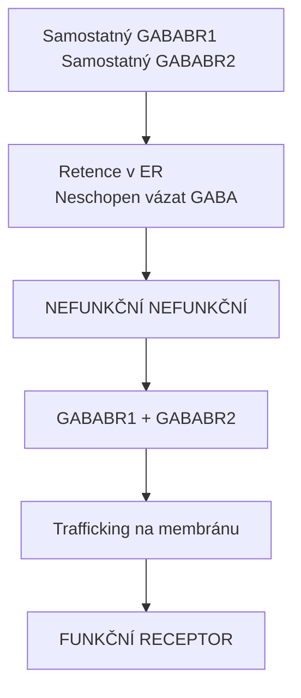

<details>
<summary>ASCII verze diagramu</summary>

```
Samostatný GABABR1        Samostatný GABABR2
     │                          │
     ↓                          ↓
Retence v ER               Neschopen vázat GABA
     │                          │
     ↓                          ↓
NEFUNKČNÍ                  NEFUNKČNÍ

        GABABR1 + GABABR2
               │
               ↓
    Trafficking na membránu
               │
               ↓
        FUNKČNÍ RECEPTOR
```

</details>

---

## Distribuce

### Centrální nervový systém

| Oblast | Lokalizace | Funkce |
|--------|------------|--------|
| **Thalamus** | Pre + postsynapticky | Senzorické zpracování |
| **Hippocampus** | Pre + postsynapticky | Paměť, LTP modulace |
| **Cerebellum** | Presynapticky | Motorická koordinace |
| **Kortex** | Pre + postsynapticky | Kognice |
| **Mícha** | Interneurony, aferenty | Spasticita, bolest |
| **Amygdala** | Postsynapticky | Úzkost |
| **VTA/NAc** | Presynapticky | Odměna, závislost |

### Periferní lokalizace

| Tkáň | Funkce |
|------|--------|
| **Střevo** | Motilita, sekrece |
| **Močový měchýř** | Kontraktilita |
| **Bronchy** | Relaxace |

---

## Signální dráhy

### Primární mechanismy

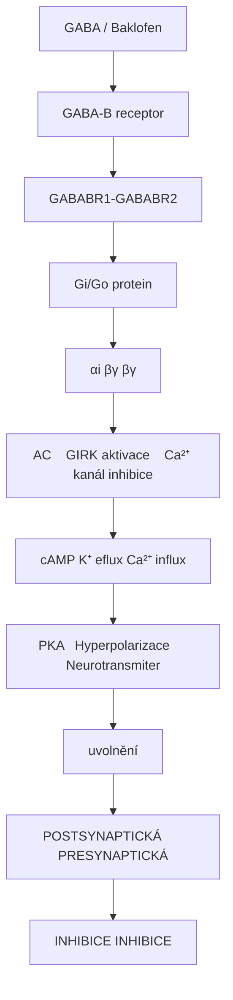

<details>
<summary>ASCII verze diagramu</summary>

```
GABA / Baklofen
        ↓
   GABA-B receptor
   (GABABR1-GABABR2)
        ↓
    Gi/Go protein
        ↓
┌───────┼───────────────────┐
↓       ↓                   ↓
αi      βγ                  βγ
↓       ↓                   ↓
↓ AC    GIRK aktivace    Ca²⁺ kanál inhibice
↓       ↓                   ↓
↓ cAMP  K⁺ eflux           ↓ Ca²⁺ influx
↓       ↓                   ↓
↓ PKA   Hyperpolarizace    ↓ Neurotransmiter
        ↓                   uvolnění
        POSTSYNAPTICKÁ      PRESYNAPTICKÁ
        INHIBICE            INHIBICE
```

</details>

### Presynaptický vs postsynaptický účinek

| Lokalizace | Mechanismus | Efekt | Časový průběh |
|------------|-------------|-------|---------------|
| **Presynaptická** | ↓ Ca²⁺ influx | ↓ Uvolnění NT | 50-100 ms |
| **Postsynaptická** | GIRK aktivace | Hyperpolarizace | 100-500 ms |
| **Extrasynaptická** | Tonická inhibice | Bazální excitabilita | Sekundy-minuty |

### Srovnání GABA-A vs GABA-B

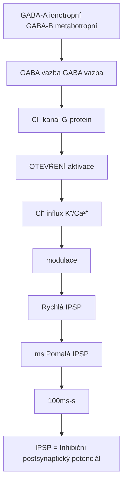

<details>
<summary>ASCII verze diagramu</summary>

```
GABA-A (ionotropní)           GABA-B (metabotropní)
┌─────────────────┐           ┌─────────────────┐
│                 │           │                 │
│ GABA vazba      │           │ GABA vazba      │
│      ↓          │           │      ↓          │
│ Cl⁻ kanál       │           │ G-protein       │
│ OTEVŘENÍ        │           │ aktivace        │
│      ↓          │           │      ↓          │
│ Cl⁻ influx      │           │ K⁺/Ca²⁺        │
│      ↓          │           │ modulace        │
│ Rychlá IPSP     │           │      ↓          │
│ (ms)            │           │ Pomalá IPSP     │
│                 │           │ (100ms-s)       │
└─────────────────┘           └─────────────────┘

IPSP = Inhibiční postsynaptický potenciál
```

</details>

---

## Farmakologie

### Agonisté

| Látka | Ki (nM) | Typ | Použití |
|-------|---------|-----|---------|
| **GABA** | 100-500 | Endogenní | Fyziologický |
| **Baklofen** | 10-75 | Selektivní | Spasticita, závislost |
| **GHB** | 1000-5000 | Slabý agonista | Narkolepsie, (rekreační) |
| **Phenibut** | 100-500 | Agonista | (Anxiolytikum - neschváleno) |
| **CGP44532** | 5-20 | Výzkumný | Preklinický |

### Antagonisté

| Látka | Ki (nM) | Použití |
|-------|---------|---------|
| **CGP55845** | 1-5 | Výzkum |
| **CGP54626** | 2-10 | Výzkum |
| **SCH50911** | 50-200 | Výzkum |
| **Saclofen** | 1000-5000 | Historický výzkum |

### Pozitivní alosterické modulátory (PAM)

| Látka | Mechanismus | Potenciál |
|-------|-------------|-----------|
| **CGP7930** | ↑ afinita GABA | Výzkum |
| **GS39783** | ↑ eficacia | Anxiolýza, závislost |
| **ADX71441** | Selektivní PAM | Klinický vývoj |

---

## Klinické aplikace

### Baklofen

```mermaid
flowchart TD
    node_INDIKACEBAKLOFENU["INDIKACE BAKLOFENU"]
    node_1SPASTICITA["1. SPASTICITA"]
    node_Roztrouensklerza["- Roztroušená skleróza"]
    node_Spinlnporann["- Spinální poranění"]
    node_Mozkovobrna["- Mozková obrna"]
    node_Mrtvice["- Mrtvice"]
    node_Mechanismus["Mechanismus:"]
    node_MnGABABaktivace["Míšní GABA-B aktivace"]
    node_Aferentnexcitace["Aferentní excitace"]
    node_Streovreflex["Strečový reflex"]
    node_SVALOVRELAXACE["SVALOVÁ RELAXACE"]
    node_2ALKOHOLOVZVISLOSTof["2. ALKOHOLOVÁ ZÁVISLOST off-label"]
    node_Snencravingu["- Snížení cravingu"]
    node_Podporaabstinence["- Podpora abstinence"]
    node_Ameisenprotokol["- 'Ameisen protokol'"]
    node_3INTRATEKLNPUMPA["3. INTRATEKÁLNÍ PUMPA"]
    node_Tkspasticita["- Těžká spasticita"]
    node_Nzksystmovdvky["- Nízké systémové dávky"]
    node_Direktnmninek["- Direktní míšní účinek"]

    node_INDIKACEBAKLOFENU --> node_1SPASTICITA
    node_1SPASTICITA --> node_Roztrouensklerza
    node_Roztrouensklerza --> node_Spinlnporann
    node_Spinlnporann --> node_Mozkovobrna
    node_Mozkovobrna --> node_Mrtvice
    node_Mrtvice --> node_Mechanismus
    node_Mechanismus --> node_MnGABABaktivace
    node_MnGABABaktivace --> node_Aferentnexcitace
    node_Aferentnexcitace --> node_Streovreflex
    node_Streovreflex --> node_SVALOVRELAXACE
    node_SVALOVRELAXACE --> node_2ALKOHOLOVZVISLOSTof
    node_2ALKOHOLOVZVISLOSTof --> node_Snencravingu
    node_Snencravingu --> node_Podporaabstinence
    node_Podporaabstinence --> node_Ameisenprotokol
    node_Ameisenprotokol --> node_3INTRATEKLNPUMPA
    node_3INTRATEKLNPUMPA --> node_Tkspasticita
    node_Tkspasticita --> node_Nzksystmovdvky
    node_Nzksystmovdvky --> node_Direktnmninek
```

<details>
<summary>ASCII verze diagramu</summary>

```
INDIKACE BAKLOFENU
┌─────────────────────────────────────────────────────┐
│                                                     │
│   1. SPASTICITA                                    │
│      - Roztroušená skleróza                        │
│      - Spinální poranění                           │
│      - Mozková obrna                               │
│      - Mrtvice                                     │
│                                                     │
│      Mechanismus:                                   │
│      Míšní GABA-B aktivace                         │
│           ↓                                        │
│      ↓ Aferentní excitace                         │
│           ↓                                        │
│      ↓ Strečový reflex                            │
│           ↓                                        │
│      SVALOVÁ RELAXACE                              │
│                                                     │
│   2. ALKOHOLOVÁ ZÁVISLOST (off-label)             │
│      - Snížení cravingu                            │
│      - Podpora abstinence                          │
│      - "Ameisen protokol"                          │
│                                                     │
│   3. INTRATEKÁLNÍ PUMPA                           │
│      - Těžká spasticita                            │
│      - Nízké systémové dávky                       │
│      - Direktní míšní účinek                       │
│                                                     │
└─────────────────────────────────────────────────────┘
```

</details>

### Mechanismus anticraving účinku

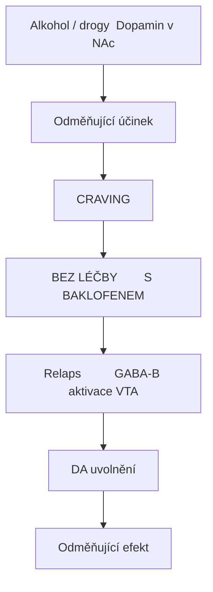

<details>
<summary>ASCII verze diagramu</summary>

```
Alkohol / drogy → Dopamin v NAc
                       │
                       ↓
              Odměňující účinek
                       │
                       ↓
                   CRAVING
                       │
              ┌────────┴────────┐
              │                 │
              ↓                 ↓
         BEZ LÉČBY        S BAKLOFENEM
              │                 │
              ↓                 ↓
         Relaps          GABA-B aktivace (VTA)
                               │
                               ↓
                        ↓ DA uvolnění
                               │
                               ↓
                        ↓ Odměňující efekt
                               │
                               ↓
                        ↓ CRAVING
```

</details>

### GHB (Xyrem) - Narkolepsie

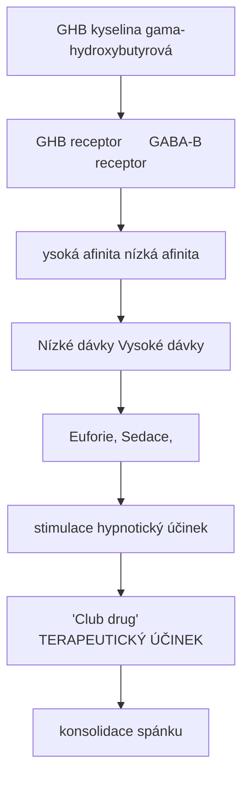

<details>
<summary>ASCII verze diagramu</summary>

```
GHB (kyselina gama-hydroxybutyrová)
              │
    ┌─────────┴─────────┐
    ↓                   ↓
GHB receptor       GABA-B receptor
(vysoká afinita)   (nízká afinita)
    │                   │
    ↓                   ↓
Nízké dávky        Vysoké dávky
    │                   │
    ↓                   ↓
Euforie,           Sedace,
stimulace          hypnotický účinek
    │                   │
    ↓                   ↓
"Club drug"        TERAPEUTICKÝ ÚČINEK
                   (konsolidace spánku)
```

</details>

### Terapeutické použití GHB

| Indikace | Dávka | Mechanismus |
|----------|-------|-------------|
| **Narkolepsie s kataplexií** | 4.5-9 g/noc | Konsolidace spánku |
| **Narkolepsie EDS** | Stejná | ↑ SWS, ↑ GH |
| **Fibromyalgie** | 4.5-6 g/noc | ↑ SWS (experimentální) |

---

## Synaptická plasticita

### Modulace LTP

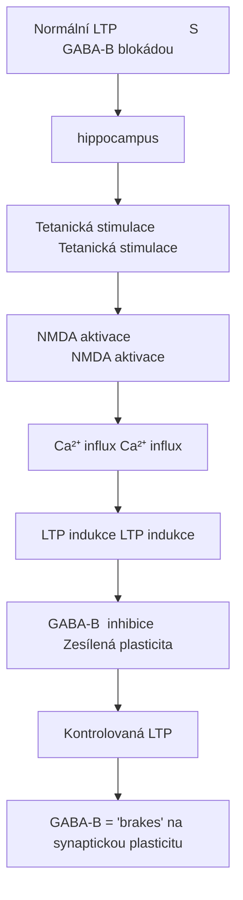

<details>
<summary>ASCII verze diagramu</summary>

```
Normální LTP                   S GABA-B blokádou
(hippocampus)

Tetanická stimulace            Tetanická stimulace
     │                              │
     ↓                              ↓
NMDA aktivace                  NMDA aktivace (↑)
     │                              │
     ↓                              ↓
Ca²⁺ influx                    Ca²⁺ influx (↑)
     │                              │
     ↓                              ↓
LTP indukce                    LTP indukce (↑)
     │                              │
     │                              ↓
GABA-B → inhibice         Zesílená plasticita
     │
     ↓
Kontrolovaná LTP

GABA-B = "brakes" na synaptickou plasticitu
```

</details>

### Presynaptická inhibice glutamátového uvolnění

| Synapse | GABA-B efekt | Důsledek |
|---------|--------------|----------|
| **Schaffer collaterals** | ↓ glutamát | Modulace CA1 |
| **Perforant path** | ↓ glutamát | Modulace DG |
| **Mossy fibers** | ↓ glutamát | Modulace CA3 |

---

## GHB farmakologie

### Dvojí receptor systém

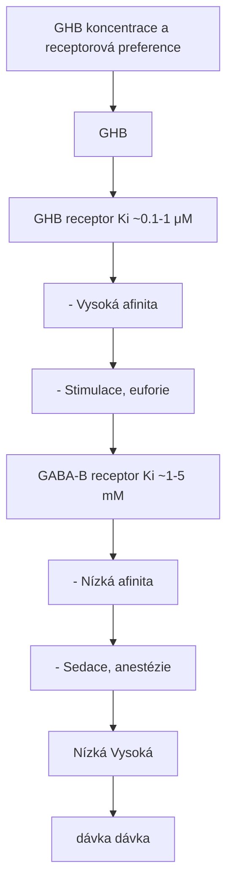

<details>
<summary>ASCII verze diagramu</summary>

```
GHB koncentrace a receptorová preference
┌─────────────────────────────────────────────────────┐
│                                                     │
│  [GHB]                                              │
│    │                                                │
│    │  ┌── GHB receptor (Ki ~0.1-1 μM)             │
│    │  │   - Vysoká afinita                         │
│    │  │   - Stimulace, euforie                     │
│    │  │                                            │
│    ├──┤                                            │
│    │  │                                            │
│    │  └── GABA-B receptor (Ki ~1-5 mM)            │
│    │      - Nízká afinita                          │
│    │      - Sedace, anestézie                      │
│    │                                                │
│  Nízká ─────────────────────────────── Vysoká      │
│  dávka                                 dávka       │
│                                                     │
└─────────────────────────────────────────────────────┘
```

</details>

### Metabolismus GHB

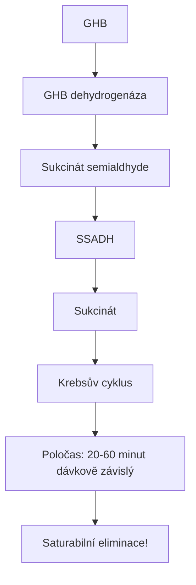

<details>
<summary>ASCII verze diagramu</summary>

```
GHB
 │
 ↓ GHB dehydrogenáza
 │
Sukcinát semialdhyde
 │
 ↓ SSADH
 │
Sukcinát
 │
 ↓
Krebsův cyklus

Poločas: 20-60 minut (dávkově závislý)
         Saturabilní eliminace!
```

</details>

### Bezpečnostní profil

| Dávka | Účinek | Riziko |
|-------|--------|--------|
| **Nízká (0.5-1.5 g)** | Euforie, relaxace | Nízké |
| **Střední (1.5-2.5 g)** | Sedace, motorické poruchy | Střední |
| **Vysoká (>3 g)** | Bezvědomí, respirační deprese | **VYSOKÉ** |
| **S alkoholem** | Synergismus | **ŽIVOT OHROŽUJÍCÍ** |

---

## Tolerance a závislost

### Mechanismy tolerance

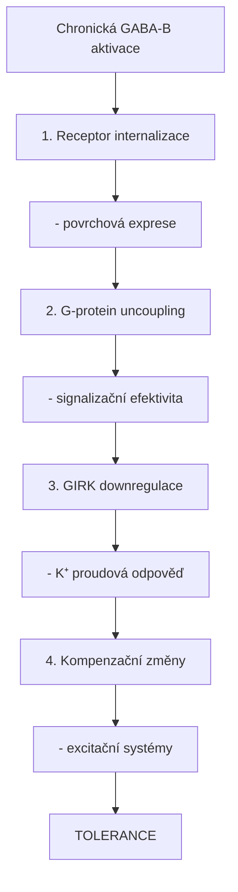

<details>
<summary>ASCII verze diagramu</summary>

```
Chronická GABA-B aktivace
           │
           ↓
┌─────────────────────────────────────────┐
│                                         │
│  1. Receptor internalizace             │
│     - ↓ povrchová exprese              │
│                                         │
│  2. G-protein uncoupling               │
│     - ↓ signalizační efektivita        │
│                                         │
│  3. GIRK downregulace                  │
│     - ↓ K⁺ proudová odpověď            │
│                                         │
│  4. Kompenzační změny                  │
│     - ↑ excitační systémy              │
│                                         │
└─────────────────────────────────────────┘
           │
           ↓
       TOLERANCE
```

</details>

### Abstinenční syndrom

| Fáze | Čas | Symptomy |
|------|-----|----------|
| **Časná** | 1-6 h | Úzkost, nespavost, třes |
| **Vrchol** | 24-72 h | Tachykardie, hypertenze, halucinace |
| **Protrahovaná** | Dny-týdny | Úzkost, nespavost, craving |

### GHB/Baklofen abstinence - srovnání

| Aspekt | GHB | Baklofen |
|--------|-----|----------|
| **Nástup** | 1-6 hodin | 12-72 hodin |
| **Trvání** | 3-14 dní | 1-4 týdny |
| **Závažnost** | Může být život ohrožující | Závažná |
| **Management** | Benzodiazepiny, baklofen | Pomalé snižování |

---

## Genetické varianty

### Polymorfismy GABBR1/GABBR2

| Gen | SNP | Asociace |
|-----|-----|----------|
| **GABBR1** | rs29259 | Nikotinová závislost |
| **GABBR1** | rs2267066 | Alkoholová závislost |
| **GABBR2** | rs3750344 | Odpověď na baklofen |
| **GABBR2** | rs967932 | Epilepsie |

### Klinické implikace

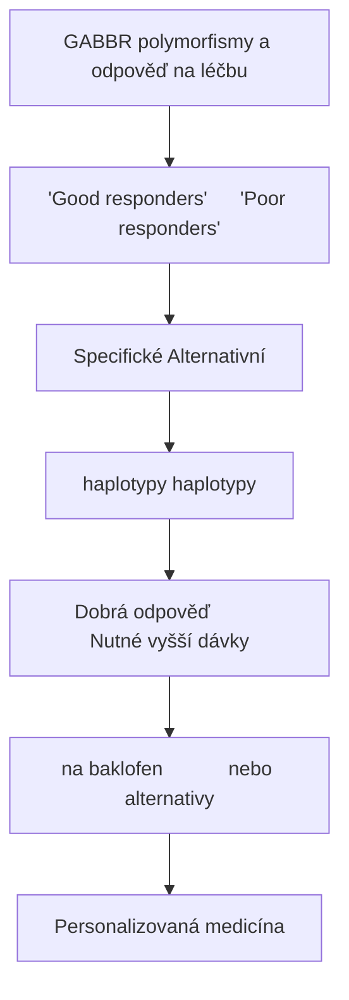

<details>
<summary>ASCII verze diagramu</summary>

```
GABBR polymorfismy a odpověď na léčbu
┌─────────────────────────────────────────────────────┐
│                                                     │
│   "Good responders"      "Poor responders"         │
│        │                      │                    │
│        ↓                      ↓                    │
│   Specifické             Alternativní             │
│   haplotypy              haplotypy                │
│        │                      │                    │
│        ↓                      ↓                    │
│   Dobrá odpověď          Nutné vyšší dávky       │
│   na baklofen            nebo alternativy         │
│                                                     │
│   → Personalizovaná medicína                       │
│                                                     │
└─────────────────────────────────────────────────────┘
```

</details>

---

## Výzkumné směry

### Pozitivní alosterické modulátory (PAM)

| Sloučenina | Status | Indikace |
|------------|--------|----------|
| **ADX71441** | Fáze I | Závislosti, úzkost |
| **CMPPE** | Preklinická | Spasticita |
| **ORM-27669** | Preklinická | Chronická bolest |

### Výhody PAM vs agonistů

| Aspekt | Agonista (baklofen) | PAM |
|--------|---------------------|-----|
| **Tolerance** | Ano | Potenciálně nižší |
| **Sedace** | Ano | Nižší |
| **Závislost** | Ano | Potenciálně nižší |
| **Fyziologická modulace** | Ne | Ano |

---

## Srovnání s GABA-A

| Vlastnost | GABA-A | **GABA-B** |
|-----------|--------|------------|
| **Typ** | Ionotropní | Metabotropní |
| **Struktura** | Pentamer | Heterodimer |
| **Ion/signál** | Cl⁻ kanál | G-protein |
| **Rychlost** | Rychlá (ms) | Pomalá (100ms-s) |
| **Inhibice** | Fázická | Tonická/pomalá |
| **Ligandy** | Muscimol, BZ | Baklofen, GHB |
| **Závislost** | Vysoká (BZ) | Střední |

---

## Reference

1. Bettler, B. et al. (2004). *Molecular structure and physiological functions of GABAB receptors*. Physiological Reviews.
2. Bowery, N.G. et al. (2002). *International Union of Pharmacology. XXXIII. Mammalian γ-aminobutyric acidB receptors*. Pharmacological Reviews.
3. Addolorato, G. et al. (2012). *Baclofen efficacy in reducing alcohol craving and intake*. Alcohol and Alcoholism.
4. Carter, L.P. et al. (2009). *Illicit gamma-hydroxybutyrate (GHB) and pharmaceutical sodium oxybate*. Drug and Alcohol Dependence.
5. Gassmann, M. & Bettler, B. (2012). *Regulation of neuronal GABAB receptor functions by subunit composition*. Nature Reviews Neuroscience.

---

Viz také:
- [GABA-A receptor](@/receptors/gaba-a.md) - Ionotropní GABA receptor
- [NMDA receptor](@/receptors/nmda.md) - Glutamátový receptor
- [Glosář](@/glossary/_index.md) - Definice pojmů

<- Zpět na [Receptory](@/receptors/_index.md) | [AMPA receptor](@/receptors/ampa.md) ->
