+++
title = "Metabotropní glutamátové receptory (mGluR)"
description = "mGluR1-8 - modulátory synaptické transmise, plasticity a neuroprotekce"
weight = 9
insert_anchor_links = "right"

[taxonomies]
categories = ["receptory", "glutamát", "GPCR"]
tags = ["mGluR", "glutamát", "neuromodulace", "plasticita", "neuroprotekce"]
+++

# Metabotropní glutamátové receptory (mGluR) - Orchestrátoři glutamátové signalizace

**Metabotropní glutamátové receptory (mGluR)** jsou rodinou osmi G-protein spřažených receptorů (mGluR1-8), které modulují glutamátovou neurotransmisi prostřednictvím **sekundárních poslů**. Regulují synaptickou plasticitu, excitabilitu a představují slibné cíle pro léčbu neurologických a psychiatrických onemocnění.

---

## Základní charakteristika

### Klasifikace

| Vlastnost | Hodnota |
|-----------|---------|
| **Typ** | Metabotropní (GPCR) |
| **Rodina** | Třída C GPCR |
| **Počet subtypů** | 8 (mGluR1-8) |
| **Endogenní ligand** | L-Glutamát |
| **Struktura** | Homodimery |

### Rozdělení do skupin

| Skupina | Receptory | G-protein | Efektory | Lokalizace |
|---------|-----------|-----------|----------|------------|
| **Skupina I** | mGluR1, mGluR5 | Gq/11 | ↑ PLC, ↑ Ca²⁺ | Postsynapticky |
| **Skupina II** | mGluR2, mGluR3 | Gi/Go | ↓ AC, ↓ cAMP | Pre/postsynapticky |
| **Skupina III** | mGluR4, 6, 7, 8 | Gi/Go | ↓ AC, ↓ cAMP | Presynapticky |

---

## Struktura receptoru

### Doménová architektura

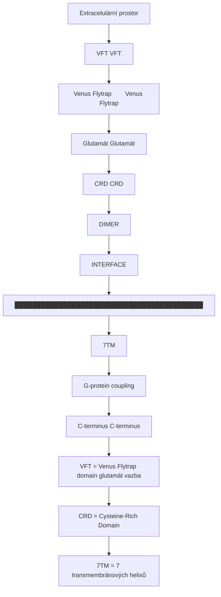

<details>
<summary>ASCII verze diagramu</summary>

```
                    Extracelulární prostor
                           │
    ┌──────────────────────┼──────────────────────┐
    │                      │                      │
    │        VFT           │          VFT         │
    │   (Venus Flytrap)    │    (Venus Flytrap)   │
    │        ↓             │          ↓           │
    │   Glutamát           │     Glutamát         │
    │        │             │          │           │
    │   ┌────┴────┐   ┌────┴────┐┌────┴────┐     │
    │   │   CRD   │   │         ││   CRD   │     │
    │   └────┬────┘   │  DIMER  │└────┬────┘     │
    │        │        │ INTERFACE│     │         │
    │        │        │         │     │         │
    └────────┼────────┴─────────┴─────┼─────────┘
             │                         │
    █████████│█████████████████████████│█████████
             │          7TM            │
             │                         │
             │    G-protein coupling   │
    █████████│█████████████████████████│█████████
             │                         │
        C-terminus                C-terminus

VFT = Venus Flytrap domain (glutamát vazba)
CRD = Cysteine-Rich Domain
7TM = 7 transmembránových helixů
```

</details>

### Aktivační mechanismus

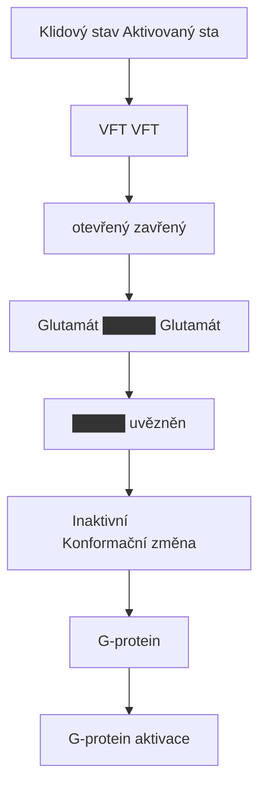

<details>
<summary>ASCII verze diagramu</summary>

```
Klidový stav              Aktivovaný stav

     VFT                       VFT
   otevřený                  zavřený
      │                         │
   ┌──┴──┐                  ┌──┴──┐
   │     │    Glutamát      │█████│ ← Glutamát
   │     │   ──────────→    │█████│   uvězněn
   └──┬──┘                  └──┬──┘
      │                        │
      ↓                        ↓
   Inaktivní              Konformační změna
   G-protein                   │
                               ↓
                          G-protein aktivace
```

</details>

---

## Skupina I (mGluR1, mGluR5)

### Charakteristika

| Vlastnost | mGluR1 | mGluR5 |
|-----------|--------|--------|
| **G-protein** | Gq/11 | Gq/11 |
| **Lokalizace** | Cerebellum, thalamus | Kortex, hippocampus, striatum |
| **Synaptická pozice** | Perisynaptická | Perisynaptická |
| **Funkce** | Motorika, LTD | Kognice, LTP, LTD |

### Signální kaskáda

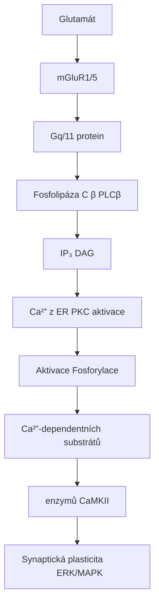

<details>
<summary>ASCII verze diagramu</summary>

```
Glutamát
    ↓
mGluR1/5
    ↓
Gq/11 protein
    ↓
Fosfolipáza C β (PLCβ)
    ↓
┌───┴───────────────┐
↓                   ↓
IP₃                 DAG
↓                   ↓
Ca²⁺ z ER          PKC aktivace
↓                   ↓
┌───────────────────┴───────────────────┐
↓                                       ↓
Aktivace                           Fosforylace
Ca²⁺-dependentních                 substrátů
enzymů (CaMKII)                        │
↓                                       ↓
Synaptická plasticita              ERK/MAPK
```

</details>

### Perisynaptická role

```mermaid
flowchart TD
    node_Glutamtovsynapse["Glutamátová synapse"]
    node_Presynaptickterminl["Presynaptický terminál"]
    node_Glutamtuvolnn["Glutamát uvolnění"]
    node_AMPANMDAmGluR15["AMPA  NMDA                    mGluR1/5"]
    node_perisynapticky["perisynapticky"]
    node_EPSPCa["EPSP  Ca²⁺"]
    node_Spillover["Spillover"]
    node_glutamt["glutamát"]
    node_LTP["LTP"]
    node_Modulace["Modulace"]
    node_PSDplasticity["PSD                       plasticity"]
    node_mGluR5sensorprovysok["mGluR5 = 'sensor' pro vysokou glutamátovou aktivitu"]

    node_Glutamtovsynapse --> node_Presynaptickterminl
    node_Presynaptickterminl --> node_Glutamtuvolnn
    node_Glutamtuvolnn --> node_AMPANMDAmGluR15
    node_AMPANMDAmGluR15 --> node_perisynapticky
    node_perisynapticky --> node_EPSPCa
    node_EPSPCa --> node_Spillover
    node_Spillover --> node_glutamt
    node_glutamt --> node_LTP
    node_LTP --> node_Modulace
    node_Modulace --> node_PSDplasticity
    node_PSDplasticity --> node_mGluR5sensorprovysok

    click node_Glutamtovsynapse "/glossary/glutamate/" "Glutamátová synapse"
    click node_Glutamtuvolnn "/glossary/glutamate/" "Glutamát uvolnění"
    click node_glutamt "/glossary/glutamate/" "glutamát"
    click node_mGluR5sensorprovysok "/glossary/glutamate/" "mGluR5 = "sensor" pro vysokou glutamátovou aktivitu"
```

<details>
<summary>ASCII verze diagramu</summary>

```
Glutamátová synapse
┌─────────────────────────────────────────────────────┐
│                                                     │
│   Presynaptický terminál                           │
│         │                                          │
│         ↓ Glutamát uvolnění                        │
│         │                                          │
│   ┌─────┼─────────────────────────┐               │
│   │     ↓                         │               │
│   │  AMPA  NMDA                   │ mGluR1/5      │
│   │   │     │                     │ (perisynapticky)
│   │   ↓     ↓                     │     │         │
│   │  EPSP  Ca²⁺                   │     ↓         │
│   │         │                     │  Spillover    │
│   │         ↓                     │  glutamát     │
│   │       LTP                     │     │         │
│   │                               │     ↓         │
│   │                               │  Modulace     │
│   │       PSD                     │  plasticity   │
│   └───────────────────────────────┘               │
│                                                     │
└─────────────────────────────────────────────────────┘

mGluR5 = "sensor" pro vysokou glutamátovou aktivitu
```

</details>

### mGluR5 a NMDA interakce

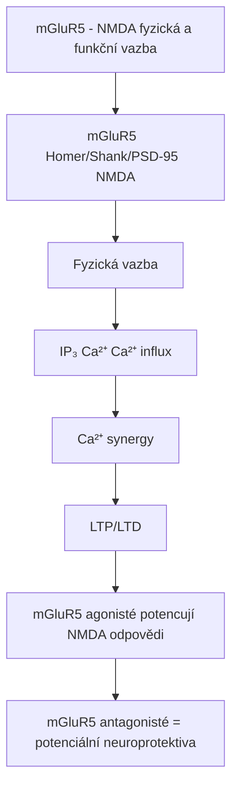

<details>
<summary>ASCII verze diagramu</summary>

```
mGluR5 - NMDA fyzická a funkční vazba
┌─────────────────────────────────────────────────────┐
│                                                     │
│   mGluR5 ←──── Homer/Shank/PSD-95 ────→ NMDA       │
│     │                                     │         │
│     │         Fyzická vazba               │         │
│     │                                     │         │
│     ↓                                     ↓         │
│   IP₃ → Ca²⁺                        Ca²⁺ influx   │
│     │                                     │         │
│     └─────────────┬───────────────────────┘         │
│                   ↓                                 │
│              Ca²⁺ synergy                          │
│                   │                                 │
│                   ↓                                 │
│              LTP/LTD                               │
│                                                     │
│   mGluR5 agonisté potencují NMDA odpovědi         │
│   mGluR5 antagonisté = potenciální neuroprotektiva│
│                                                     │
└─────────────────────────────────────────────────────┘
```

</details>

---

## Skupina II (mGluR2, mGluR3)

### Charakteristika

| Vlastnost | mGluR2 | mGluR3 |
|-----------|--------|--------|
| **G-protein** | Gi/Go | Gi/Go |
| **Lokalizace** | Kortex, hippocampus | Široká (včetně glie) |
| **Synaptická pozice** | Presynapticky | Pre- a postsynapticky, glie |
| **Funkce** | Autoreceptor, ↓ glutamát | Neuromodulace, glie |

### Signální kaskáda

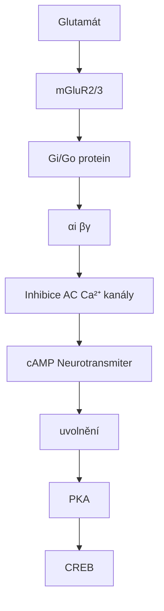

<details>
<summary>ASCII verze diagramu</summary>

```
Glutamát
    ↓
mGluR2/3
    ↓
Gi/Go protein
    ↓
┌───┴───────────────────────────┐
↓                               ↓
αi                              βγ
↓                               ↓
Inhibice AC                  ↓ Ca²⁺ kanály
↓                               ↓
↓ cAMP                       ↓ Neurotransmiter
↓                            uvolnění
↓ PKA
↓
↓ CREB
```

</details>

### Presynaptická autoreceptorová funkce

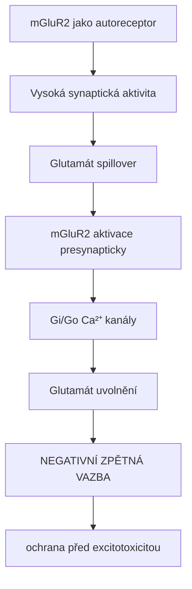

<details>
<summary>ASCII verze diagramu</summary>

```
mGluR2 jako autoreceptor
┌─────────────────────────────────────────────────────┐
│                                                     │
│   Vysoká synaptická aktivita                       │
│              │                                      │
│              ↓                                      │
│   Glutamát spillover                               │
│              │                                      │
│              ↓                                      │
│   mGluR2 aktivace (presynapticky)                  │
│              │                                      │
│              ↓                                      │
│   Gi/Go → ↓ Ca²⁺ kanály                           │
│              │                                      │
│              ↓                                      │
│   ↓ Glutamát uvolnění                             │
│              │                                      │
│              ↓                                      │
│   NEGATIVNÍ ZPĚTNÁ VAZBA                           │
│   (ochrana před excitotoxicitou)                   │
│                                                     │
└─────────────────────────────────────────────────────┘
```

</details>

### mGluR2/3 a psychedelika

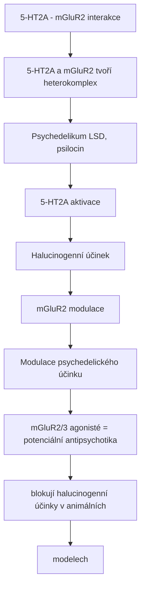

<details>
<summary>ASCII verze diagramu</summary>

```
5-HT2A - mGluR2 interakce
┌─────────────────────────────────────────────────────┐
│                                                     │
│   5-HT2A a mGluR2 tvoří heterokomplex              │
│                                                     │
│   Psychedelikum (LSD, psilocin)                    │
│              │                                      │
│              ↓                                      │
│   5-HT2A aktivace                                   │
│              │                                      │
│              ├──────→ Halucinogenní účinek         │
│              │                                      │
│              ↓                                      │
│   mGluR2 modulace                                   │
│              │                                      │
│              ↓                                      │
│   Modulace psychedelického účinku                  │
│                                                     │
│   mGluR2/3 agonisté = potenciální antipsychotika   │
│   (blokují halucinogenní účinky v animálních       │
│    modelech)                                        │
│                                                     │
└─────────────────────────────────────────────────────┘
```

</details>

---

## Skupina III (mGluR4, 6, 7, 8)

### Charakteristika

| Receptor | Lokalizace | Funkce |
|----------|------------|--------|
| **mGluR4** | Cerebellum, bazální ganglia | Motorika, neuroprotekce |
| **mGluR6** | Retina (ON bipolární buňky) | Zrakový přenos |
| **mGluR7** | Široká (presynapticky) | Synaptická modulace |
| **mGluR8** | Hippocampus, kortex | Anxiolýza, kognice |

### Signální kaskáda

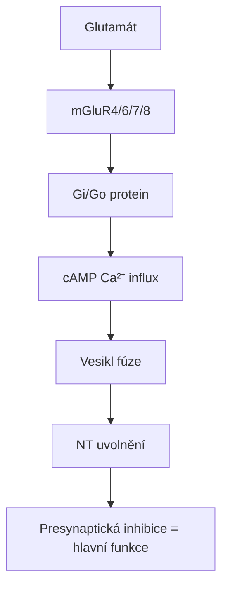

<details>
<summary>ASCII verze diagramu</summary>

```
Glutamát
    ↓
mGluR4/6/7/8
    ↓
Gi/Go protein
    ↓
┌───┴───────────────────────────┐
↓                               ↓
↓ cAMP                       ↓ Ca²⁺ influx
                                ↓
                          ↓ Vesikl fúze
                                ↓
                          ↓ NT uvolnění

Presynaptická inhibice = hlavní funkce
```

</details>

### mGluR7 - nízkoafinitní "emergency brake"

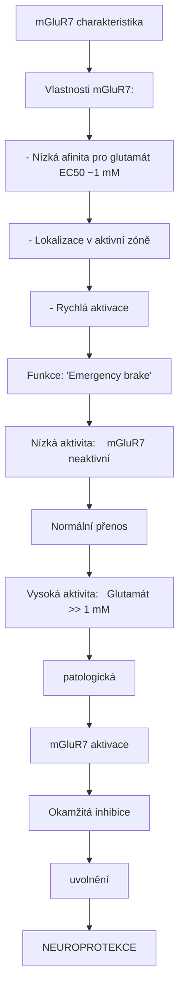

<details>
<summary>ASCII verze diagramu</summary>

```
mGluR7 charakteristika
┌─────────────────────────────────────────────────────┐
│                                                     │
│   Vlastnosti mGluR7:                               │
│   - Nízká afinita pro glutamát (EC50 ~1 mM)       │
│   - Lokalizace v aktivní zóně                      │
│   - Rychlá aktivace                                │
│                                                     │
│   Funkce: "Emergency brake"                        │
│                                                     │
│   Nízká aktivita:    mGluR7 neaktivní              │
│   Normální přenos    ↓                             │
│                                                     │
│   Vysoká aktivita:   Glutamát >> 1 mM             │
│   (patologická)      ↓                             │
│                      mGluR7 aktivace               │
│                      ↓                             │
│                      Okamžitá inhibice             │
│                      uvolnění                       │
│                      ↓                             │
│                      NEUROPROTEKCE                 │
│                                                     │
└─────────────────────────────────────────────────────┘
```

</details>

---

## Farmakologie

### Skupina I - mGluR1/5

| Typ | Látka | Selektivita | Použití/potenciál |
|-----|-------|-------------|-------------------|
| **Agonista** | DHPG | mGluR1/5 | Výzkum |
| **mGluR5 PAM** | VU0409551 | mGluR5 | Schizofrenie |
| **mGluR5 NAM** | MPEP | mGluR5 | Výzkum, anxiolýza |
| **mGluR5 NAM** | Basimglurant | mGluR5 | Deprese (fáze III fail) |
| **mGluR5 NAM** | Mavoglurant | mGluR5 | Fragile X (fáze III fail) |
| **mGluR1 antagonista** | JNJ16259685 | mGluR1 | Výzkum |

### Skupina II - mGluR2/3

| Typ | Látka | Selektivita | Použití/potenciál |
|-----|-------|-------------|-------------------|
| **Agonista** | LY354740 | mGluR2/3 | Anxiolýza, výzkum |
| **Agonista** | Pomaglumetad | mGluR2/3 | Schizofrenie (fáze III fail) |
| **mGluR2 PAM** | LY487379 | mGluR2 | Schizofrenie |
| **mGluR2 PAM** | AZD8529 | mGluR2 | Schizofrenie |
| **Antagonista** | LY341495 | mGluR2/3 | Výzkum |

### Skupina III - mGluR4/7/8

| Typ | Látka | Selektivita | Použití/potenciál |
|-----|-------|-------------|-------------------|
| **mGluR4 PAM** | Foliglurax | mGluR4 | Parkinson (fáze II) |
| **mGluR4 agonista** | LSP1-2111 | mGluR4 | Výzkum |
| **mGluR7 agonista** | AMN082 | mGluR7 | Anxiolýza, výzkum |
| **mGluR8 agonista** | (S)-3,4-DCPG | mGluR8 | Anxiolýza |

---

## Klinické aplikace

### Schizofrenie

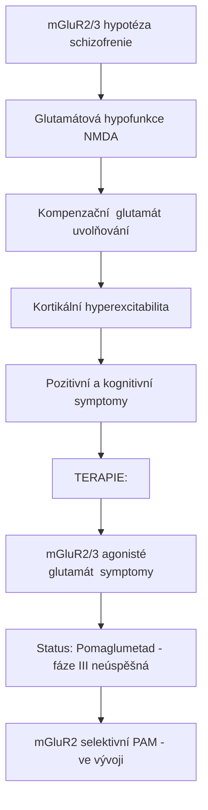

<details>
<summary>ASCII verze diagramu</summary>

```
mGluR2/3 hypotéza schizofrenie
┌─────────────────────────────────────────────────────┐
│                                                     │
│   Glutamátová hypofunkce (NMDA)                    │
│              │                                      │
│              ↓                                      │
│   Kompenzační ↑ glutamát uvolňování               │
│              │                                      │
│              ↓                                      │
│   Kortikální hyperexcitabilita                     │
│              │                                      │
│              ↓                                      │
│   Pozitivní a kognitivní symptomy                  │
│                                                     │
│   TERAPIE:                                         │
│   mGluR2/3 agonisté → ↓ glutamát → symptomy ↓     │
│                                                     │
│   Status: Pomaglumetad - fáze III neúspěšná       │
│           mGluR2 selektivní PAM - ve vývoji       │
│                                                     │
└─────────────────────────────────────────────────────┘
```

</details>

### Parkinsonova choroba

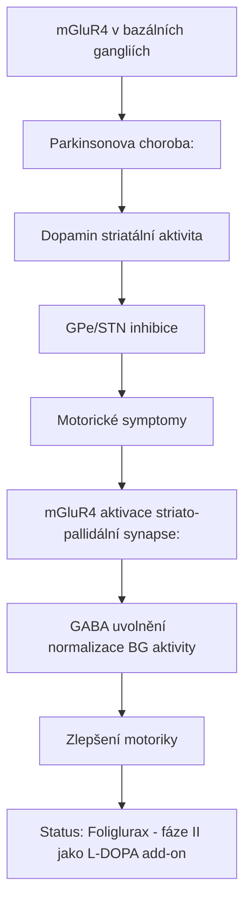

<details>
<summary>ASCII verze diagramu</summary>

```
mGluR4 v bazálních gangliích
┌─────────────────────────────────────────────────────┐
│                                                     │
│   Parkinsonova choroba:                            │
│   ↓ Dopamin → ↑ striatální aktivita               │
│              │                                      │
│              ↓                                      │
│   ↑ GPe/STN inhibice                              │
│              │                                      │
│              ↓                                      │
│   Motorické symptomy                               │
│                                                     │
│   mGluR4 aktivace (striato-pallidální synapse):   │
│   ↓ GABA uvolnění → normalizace BG aktivity       │
│              │                                      │
│              ↓                                      │
│   Zlepšení motoriky                                │
│                                                     │
│   Status: Foliglurax - fáze II (jako L-DOPA add-on)│
│                                                     │
└─────────────────────────────────────────────────────┘
```

</details>

### Fragile X syndrom

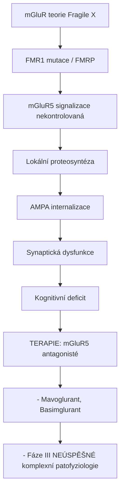

<details>
<summary>ASCII verze diagramu</summary>

```
mGluR teorie Fragile X
┌─────────────────────────────────────────────────────┐
│                                                     │
│   FMR1 mutace → ↓/↑ FMRP                          │
│              │                                      │
│              ↓                                      │
│   ↑ mGluR5 signalizace (nekontrolovaná)           │
│              │                                      │
│              ↓                                      │
│   ↑ Lokální proteosyntéza                          │
│   ↑ AMPA internalizace                             │
│              │                                      │
│              ↓                                      │
│   Synaptická dysfunkce                             │
│   Kognitivní deficit                               │
│                                                     │
│   TERAPIE: mGluR5 antagonisté                      │
│   - Mavoglurant, Basimglurant                      │
│   - Fáze III NEÚSPĚŠNÉ (komplexní patofyziologie) │
│                                                     │
└─────────────────────────────────────────────────────┘
```

</details>

### Úzkostné poruchy

| Cíl | Přístup | Mechanismus | Status |
|-----|---------|-------------|--------|
| **mGluR5** | NAM | ↓ amygdala excitabilita | Preklinická |
| **mGluR2/3** | Agonista | ↓ glutamát | Fáze II (anxiolýza) |
| **mGluR7** | Agonista | ↓ amygdala glutamát | Preklinická |
| **mGluR8** | Agonista | ↓ anxiogenní signály | Preklinická |

---

## Synaptická plasticita

### mGluR-dependentní LTD

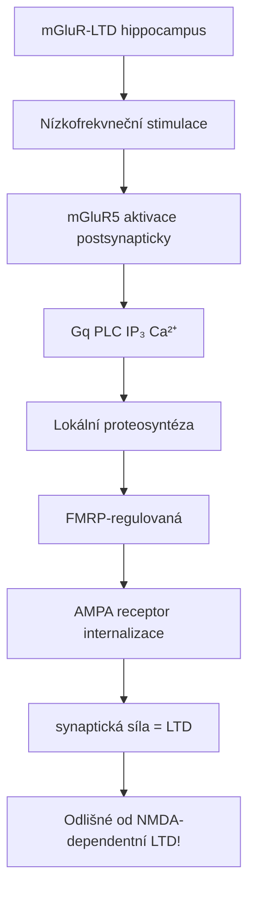

<details>
<summary>ASCII verze diagramu</summary>

```
mGluR-LTD (hippocampus)
┌─────────────────────────────────────────────────────┐
│                                                     │
│   Nízkofrekvneční stimulace                        │
│              │                                      │
│              ↓                                      │
│   mGluR5 aktivace (postsynapticky)                 │
│              │                                      │
│              ↓                                      │
│   Gq → PLC → IP₃ → Ca²⁺                           │
│              │                                      │
│              ↓                                      │
│   Lokální proteosyntéza                            │
│   (FMRP-regulovaná)                                │
│              │                                      │
│              ↓                                      │
│   AMPA receptor internalizace                      │
│              │                                      │
│              ↓                                      │
│   ↓ synaptická síla = LTD                         │
│                                                     │
│   Odlišné od NMDA-dependentní LTD!                │
│                                                     │
└─────────────────────────────────────────────────────┘
```

</details>

---

## Srovnání glutamátových receptorů

| Vlastnost | AMPA | NMDA | Kainát | **mGluR** |
|-----------|------|------|--------|-----------|
| **Typ** | Ionotropní | Ionotropní | Ionotropní | **Metabotropní** |
| **Rychlost** | ms | ms-s | ms | s-min |
| **Efekt** | Rychlá EPSP | Plasticita | Modulace | **Neuromodulace** |
| **Hlavní funkce** | Transmise | Ca²⁺/plasticita | Pre/post | **Modulace** |

---

## Reference

1. Niswender, C.M. & Conn, P.J. (2010). *Metabotropic glutamate receptors: physiology, pharmacology, and disease*. Annual Review of Pharmacology and Toxicology.
2. Nicoletti, F. et al. (2011). *Metabotropic glutamate receptors: from the workbench to the bedside*. Neuropharmacology.
3. Pin, J.P. & Bettler, B. (2016). *Organization and functions of mGlu and GABAB receptor complexes*. Nature.
4. Crupi, R. et al. (2019). *Role of metabotropic glutamate receptors in neurological disorders*. Frontiers in Molecular Neuroscience.

---

Viz také:
- [AMPA receptor](@/receptors/ampa.md) - Rychlá glutamátová transmise
- [NMDA receptor](@/receptors/nmda.md) - Plasticita a paměť
- [5-HT2A receptor](@/receptors/5-ht2a.md) - mGluR2 heterokomplex
- [Glutamát](@/glossary/glutamate.md) - Hlavní excitační neurotransmiter
- [Glosář](@/glossary/_index.md) - Definice pojmů

<- Zpět na [Receptory](@/receptors/_index.md) | [D1 receptor](@/receptors/d1.md) ->
