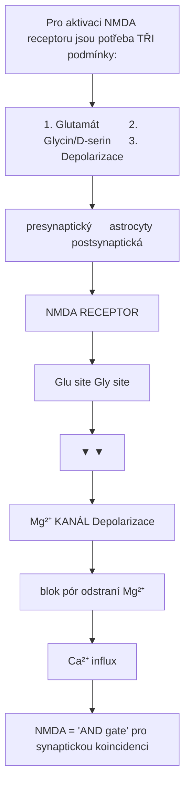
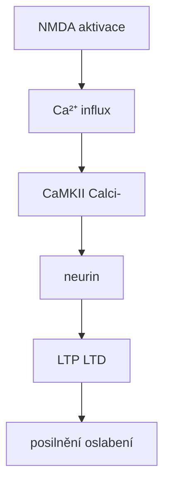
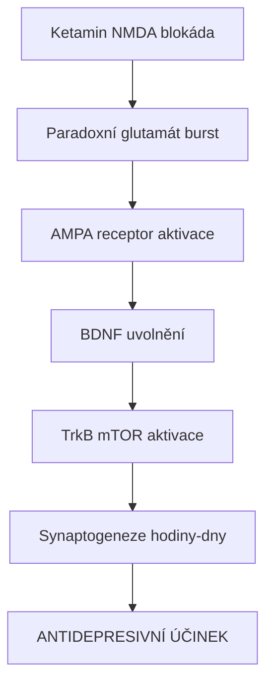
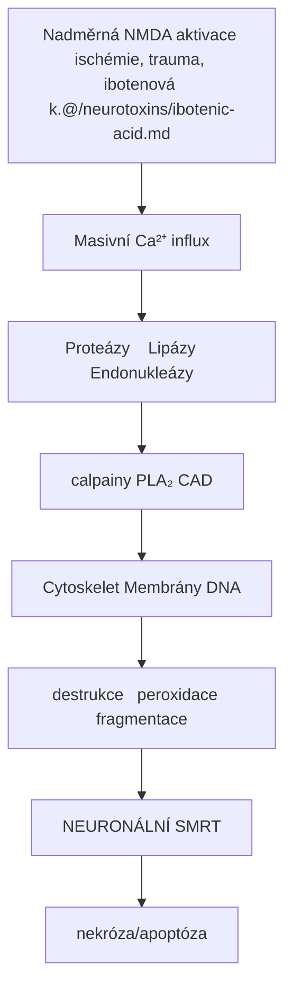
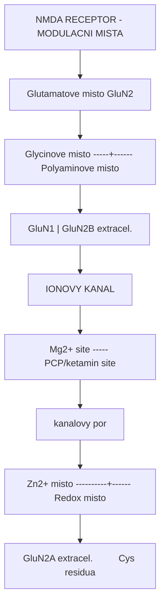
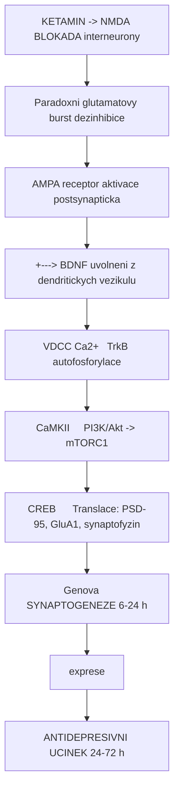

+++
title = "NMDA receptor"
description = "N-methyl-D-aspartátový receptor - klíčový pro paměť, plasticitu a cíl disociativ"
weight = 3
insert_anchor_links = "right"
+++

# NMDA receptor - Brána synaptické plasticity

**NMDA receptor** (N-methyl-D-aspartát receptor) je ionotropní **glutamátový receptor** klíčový pro **synaptickou plasticitu**, učení a paměť. Je cílem disociativních látek (ketamin, PCP) a prekurzorem excitotoxického poškození při nadměrné aktivaci ([kyselina ibotenová](@/neurotoxins/ibotenic-acid.md)).

---

## Základní charakteristika

| Vlastnost | Hodnota |
|-----------|---------|
| **Typ** | Ionotropní (ligandem řízený) |
| **Rodina** | Glutamátové receptory |
| **Iony** | Ca²⁺, Na⁺ (influx), K⁺ (eflux) |
| **Struktura** | Tetramer |
| **Koagonisté** | Glutamát + Glycin/D-serin |
| **Napěťová závislost** | Mg²⁺ blokáda při negativním potenciálu |

### Podjednotky

| Podjednotka | Gen | Funkce |
|-------------|-----|--------|
| **GluN1** | GRIN1 | Obligatorní, glycinové místo |
| **GluN2A** | GRIN2A | Synaptické, rychlá kinetika |
| **GluN2B** | GRIN2B | Extrasynaptické, plasticita |
| **GluN2C** | GRIN2C | Cerebellum |
| **GluN2D** | GRIN2D | Vývojové |
| **GluN3A/B** | GRIN3A/B | Modulační |

---

## Jedinečné vlastnosti

### Koincidentní detektor



<details>
<summary>ASCII verze diagramu</summary>

```
Pro aktivaci NMDA receptoru jsou potřeba TŘI podmínky:

1. Glutamát          2. Glycin/D-serin      3. Depolarizace
   (presynaptický)      (astrocyty)            (postsynaptická)
        │                    │                       │
        ↓                    ↓                       ↓
   ┌────────────────────────────────────────────────────┐
   │                  NMDA RECEPTOR                     │
   │                                                    │
   │  Glu site ────┐    ┌──── Gly site                 │
   │               │    │                               │
   │               ▼    ▼                               │
   │         ┌───────────────┐                         │
   │    Mg²⁺ │    KANÁL      │ ←── Depolarizace        │
   │   blok  │     (pór)     │     odstraní Mg²⁺       │
   │         └───────┬───────┘                         │
   │                 │                                  │
   │                 ↓                                  │
   │            Ca²⁺ influx                            │
   └────────────────────────────────────────────────────┘

NMDA = "AND gate" pro synaptickou koincidenci
```

</details>

### Mg²⁺ blokáda

| Membránový potenciál | Mg²⁺ stav | NMDA aktivita |
|---------------------|-----------|---------------|
| -70 mV (klid) | Blokuje pór | Minimální |
| -40 mV (EPSP) | Částečně | Částečná |
| -20 mV (AP) | Odstraněn | Plná |
| +20 mV | Odstraněn | Maximální |

---

## Signalizace

### Ca²⁺ dependentní kaskády



<details>
<summary>ASCII verze diagramu</summary>

```
NMDA aktivace
      │
      ↓
┌─────────────────┐
│  Ca²⁺ influx    │
└────────┬────────┘
         │
    ┌────┴────┐
    ↓         ↓
┌───────┐ ┌───────┐
│CaMKII │ │Calci- │
│       │ │neurin │
└───┬───┘ └───┬───┘
    │         │
    ↓         ↓
┌───────┐ ┌───────┐
│  LTP  │ │  LTD  │
│(posilnění) │(oslabení)
└───────┘ └───────┘
```

</details>

### LTP (Long-Term Potentiation)

| Fáze | Časový rámec | Mechanismus |
|------|--------------|-------------|
| **Raná** | Minuty | CaMKII fosforylace |
| **Pozdní** | Hodiny-dny | Genová exprese, syntéza proteinů |

---

## Farmakologie

### Antagonisté (disociativa)

| Látka | Ki (nM) | Mechanismus | Účinek |
|-------|---------|-------------|--------|
| **Ketamin** | 500-1000 | Kanálový blokátor | Disociace, analgezie |
| **PCP** | 50-100 | Kanálový blokátor | Silná disociace |
| **MK-801** | 2-5 | Kanálový blokátor | Výzkum |
| **Memantine** | 500-1000 | Nízkoafinitní | Alzheimerova choroba |
| **Dextrometorfan** | 1000+ | Neselektivní | Antitusikum |

### Agonisté (excitotoxiny)

| Látka | Efekt | Zdroj |
|-------|-------|-------|
| **Glutamát** | Endogenní agonista | Fyziologický |
| [**Kyselina ibotenová**](@/neurotoxins/ibotenic-acid.md) | Potentní agonista | [Amanita muscaria](@/shrooms/amanita-muscaria.md) |
| **NMDA** | Syntetický agonista | Výzkum |
| **Kyselina kainová** | Kainátový > NMDA | Mořské řasy |

### Modulátory koagonistů

| Místo | Agonista | Antagonista |
|-------|----------|-------------|
| **Glycinové** | Glycin, D-serin | 7-chlorokynurenát |
| **Polyaminové** | Spermin | Ifenprodil |

---

## Klinické aplikace

### Ketamin v psychiatrii

| Indikace | Dávka | Účinek |
|----------|-------|--------|
| **Rezistentní deprese** | 0.5 mg/kg IV | Rychlý antidepresivní efekt |
| **Suicidální ideace** | 0.5 mg/kg | Akutní snížení |
| **Chronická bolest** | Variabilní | Analgezie |
| **PTSD** | Experimentální | Extinkce strachu |

### Mechanismus antidepresivního účinku



<details>
<summary>ASCII verze diagramu</summary>

```
Ketamin → NMDA blokáda
              │
              ↓
     Paradoxní glutamát burst
              │
              ↓
     AMPA receptor aktivace
              │
              ↓
         BDNF uvolnění
              │
              ↓
      TrkB → mTOR aktivace
              │
              ↓
    Synaptogeneze (hodiny-dny)
              │
              ↓
    ANTIDEPRESIVNÍ ÚČINEK
```

</details>

---

## Excitotoxicita

### Mechanismus poškození



<details>
<summary>ASCII verze diagramu</summary>

```
Nadměrná NMDA aktivace (ischémie, trauma, [ibotenová k.](@/neurotoxins/ibotenic-acid.md))
                    │
                    ↓
           Masivní Ca²⁺ influx
                    │
        ┌───────────┼───────────┐
        ↓           ↓           ↓
   Proteázy    Lipázy     Endonukleázy
   (calpainy)   (PLA₂)    (CAD)
        │           │           │
        ↓           ↓           ↓
   Cytoskelet  Membrány      DNA
   destrukce   peroxidace   fragmentace
        │           │           │
        └───────────┼───────────┘
                    ↓
           NEURONÁLNÍ SMRT
           (nekróza/apoptóza)
```

</details>

### Neuroprotektivní strategie

| Přístup | Mechanismus | Status |
|---------|-------------|--------|
| NMDA antagonisté | Blokáda Ca²⁺ influxu | Limitovaný úspěch |
| Mg²⁺ suplementace | Fyziologická blokáda | Preventivní |
| Hypothermie | Snížení metabolismu | Standard v ischémii |
| GluN2B selektivní | Cílená blokáda | Ve vývoji |

---

## Vývojové aspekty

### Ontogeneze

| Období | Dominantní subtypy | Funkce |
|--------|-------------------|--------|
| **Fetální** | GluN2B, GluN2D | Migrace, diferenciace |
| **Postnatální** | GluN2B → GluN2A switch | Synaptická maturace |
| **Dospělý** | GluN2A dominance | Stabilní konektivita |
| **Stárnutí** | Snížená exprese | Kognitivní pokles |

---

## Srovnání glutamátových receptorů

| Receptor | Typ | Ion | Funkce |
|----------|-----|-----|--------|
| **NMDA** | Ionotropní | Ca²⁺, Na⁺ | Plasticita, paměť |
| **AMPA** | Ionotropní | Na⁺, (Ca²⁺) | Rychlá excitace |
| **Kainátový** | Ionotropní | Na⁺ | Modulace |
| **mGluR** | Metabotropní | G-protein | Neuromodulace |

---

## Reference

1. Traynelis, S.F. et al. (2010). *Glutamate receptor ion channels: structure, regulation, and function*. Pharmacological Reviews.
2. Krystal, J.H. et al. (2019). *Ketamine: A paradigm shift for depression research and treatment*. Neuron.
3. Bhargava, S. & Bhargava, S. (2018). *NMDA receptor antagonists: A review*. Asian Journal of Pharmacy.

---

## Detailni modulacni mechanismy

NMDA receptor ma **6+ odlisnych modulacnich mist** -- viz sekce [Mechanismy ucinku](@/mechanisms/_index.md):

### Modulacni mista a jejich farmakologie



<details>
<summary>ASCII verze diagramu</summary>

```
NMDA RECEPTOR - MODULACNI MISTA

                  Glutamatove misto (GluN2)
                         |
    Glycinove misto -----+------ Polyaminove misto
    (GluN1)              |       (GluN2B extracel.)
                         |
    ┌────────────────────┴────────────────────┐
    |            IONOVY KANAL                  |
    |    Mg2+ site ----- PCP/ketamin site     |
    |                    (kanalovy por)        |
    └────────────────────┬────────────────────┘
                         |
    Zn2+ misto ----------+------ Redox misto
    (GluN2A extracel.)          (Cys residua)
```

</details>

| Misto | Typ modulace | Farmakologicky priklad | Terapeuticke vyuziti |
|-------|-------------|------------------------|---------------------|
| **Glutamatove** | Agonismus | NMDA, kys. ibotenova | Vyzkum |
| **Glycinove** | Ko-agonismus | D-serin, D-cykloserin | Schizofrenie (adjuv.) |
| **Kanalove** | Blokada | Ketamin, memantine | Deprese, Alzheimer |
| **Mg2+** | Napetova zavislost | Mg2+ suplementace | Neuroprotekce |
| **Polyaminove** | Potenciace/blokada | Ifenprodil (GluN2B) | Bolest, deprese |
| **Zn2+** | Inhibice | Endogenni Zn2+ | Synaptická modulace |
| **Redox** | Modulace | Oxidanty/reduktanty | Neurodegenerace |

### Antidepresivni mechanismus ketaminu -- signalni kaskada



<details>
<summary>ASCII verze diagramu</summary>

```
KETAMIN -> NMDA BLOKADA (interneurony)
    |
    v
Paradoxni glutamatovy burst (dezinhibice)
    |
    v
AMPA receptor aktivace (postsynapticka)
    |
    +---> BDNF uvolneni z dendritickych vezikulu
    |          |
    v          v
VDCC Ca2+   TrkB autofosforylace
    |          |
    v          v
CaMKII     PI3K/Akt -> mTORC1
    |          |
    v          v
CREB      Translace: PSD-95, GluA1, synaptofyzin
    |          |
    v          v
Genova    SYNAPTOGENEZE (6-24 h)
exprese        |
               v
         ANTIDEPRESIVNI UCINEK (24-72 h)
```

</details>

Podrobnosti: [Signalni transdukce](@/mechanisms/signal-transduction.md) -- mTOR konvergence, BDNF-TrkB
Podrobnosti: [Alostericka modulace](@/mechanisms/allosteric-modulation.md) -- NMDA modulacni mista, GluN2B selektivita

---

Viz take:
- [Kyselina ibotenova](@/neurotoxins/ibotenic-acid.md) - NMDA agonista
- [AMPA receptor](@/receptors/ampa.md) - Rychly glutamatovy receptor
- [Glutamat](@/glossary/glutamate.md) - Hlavni excitacni neurotransmiter
- [Mechanismy ucinku](@/mechanisms/_index.md) - kompletni mechanismy
- [Alostericka modulace](@/mechanisms/allosteric-modulation.md) - NMDA modulacni mista
- [Signalni transdukce](@/mechanisms/signal-transduction.md) - NMDA -> mTOR -> synaptogeneze
- [Receptorova kinetika](@/mechanisms/receptor-binding.md) - vazebna kinetika kanalovych blokatoru

<- Zpet na [Receptory](@/receptors/_index.md)
