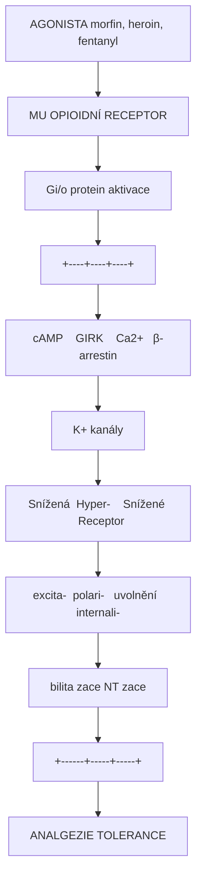
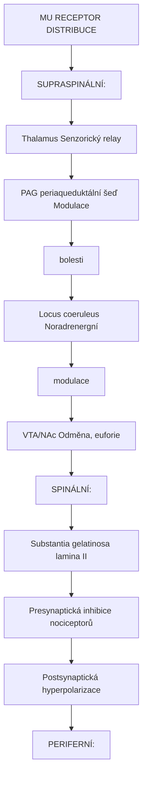
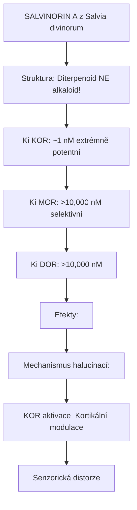
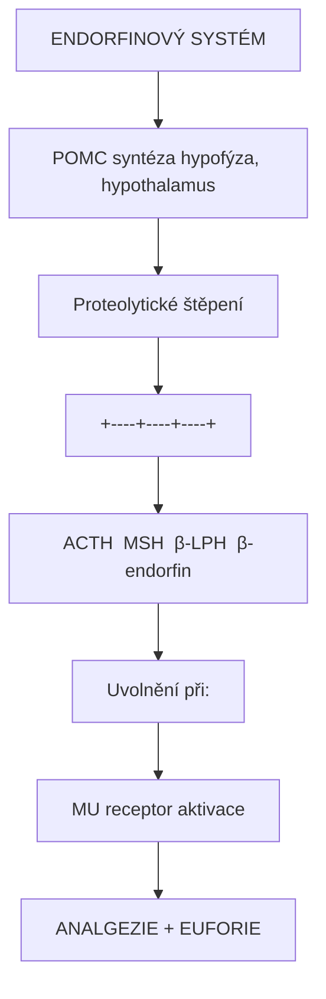
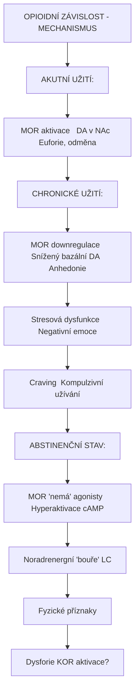

+++
title = "Opioidni receptory"
description = "Mu, delta a kappa opioidni receptory - regulace bolesti, odměny a cíl ibogainu"
weight = 15
insert_anchor_links = "right"

[taxonomies]
categories = ["receptory", "opioidni", "GPCR"]
tags = ["mu", "delta", "kappa", "endorfiny", "bolest", "ibogain", "zavislost"]
+++

# Opioidni receptory - Regulátory bolesti a odměny

**Opioidni receptory** jsou rodina G-protein spřažených receptorů (GPCR), ktere hrají klíčovou roli v **modulaci bolesti**, **odměně**, **emocích** a **homeostatických funkcích**. Zahrnují tri hlavní subtypy: **mu (MOR)**, **delta (DOR)** a **kappa (KOR)**. Jsou cílem endogenních opioidních peptidů (endorfiny, enkefaliny, dynorfiny) i exogenních látek (morfin, heroin, fentanyl). [Ibogain](@/alkaloids/ibogaine.md) interaguje s opioidním systémem, čož vysvětluje jeho potenciál v léčbě závislostí.

---

## Základní charakteristika

### Přehled opioidních receptorů

| Receptor | Gen | Endogenní ligand | Hlavní funkce |
|----------|-----|------------------|---------------|
| **Mu (MOR)** | OPRM1 | Beta-endorfin | Analgezie, euforie, závislost |
| **Delta (DOR)** | OPRD1 | Enkefaliny | Analgezie, anxiolýza |
| **Kappa (KOR)** | OPRK1 | Dynorfiny | Dysforie, analgezie, disociace |
| **Nociceptin (NOP)** | OPRL1 | Nociceptin/OFQ | Modulace bolesti, úzkost |

### Společné vlastnosti

| Vlastnost | Hodnota |
|-----------|---------|
| **Typ** | GPCR (G-protein coupled receptor) |
| **G-protein** | Gi/o (inhibiční) |
| **Efekt na cAMP** | Snížení |
| **Efekt na K+ kanály** | Aktivace (GIRK) |
| **Efekt na Ca2+ kanály** | Inhibice |
| **Lokalizace** | CNS, periferní nervy, GIT, imunitní buňky |

---

## Mu opioidní receptor (MOR)

### Charakteristika

| Vlastnost | Hodnota |
|-----------|---------|
| **Gen** | OPRM1 (chromozom 6q25) |
| **Délka** | 400 aminokyselin |
| **Varianty** | MOR-1 (hlavní), mnoho splice variant |
| **Exprese** | Thalamus, PAG, locus coeruleus, VTA, NAc |

### Funkce MOR

| Funkce | Mechanismus | Klinický význam |
|--------|-------------|-----------------|
| **Analgezie** | Supraspinální + spinální | Cíl opioidních analgetik |
| **Euforie** | Dopamin v NAc | Závislostní potenciál |
| **Respirační deprese** | Pre-Bötzinger komplex | Příčina úmrtí při předávkování |
| **Zácpa** | GIT motilita | Vedlejší účinek opioidů |
| **Mióza** | Edinger-Westphal jádro | Diagnostický znak |
| **Pruritus** | Centrální | Vedlejší účinek |

### Signalizace MOR



<details>
<summary>ASCII verze diagramu</summary>

```
AGONISTA (morfin, heroin, fentanyl)
         |
         v
    MU OPIOIDNÍ RECEPTOR
         |
         v
    Gi/o protein aktivace
         |
    +----+----+----+
    |    |    |    |
    v    v    v    v

↓ cAMP   ↑ GIRK   ↓ Ca2+   β-arrestin
    |      K+       kanály      |
    |      |           |        |
    v      v           v        v

Snížená  Hyper-    Snížené   Receptor
excita-  polari-   uvolnění  internali-
bilita   zace      NT        zace
    |      |           |        |
    +------+-----+-----+        |
                 |              |
                 v              v
           ANALGEZIE      TOLERANCE
```

</details>

### Distribuce v mozku



<details>
<summary>ASCII verze diagramu</summary>

```
MU RECEPTOR DISTRIBUCE

SUPRASPINÁLNÍ:
┌──────────────────────────────────────────┐
│                                          │
│  Thalamus ──────── Senzorický relay      │
│      ↑                                   │
│      │                                   │
│  PAG (periaqueduktální šeď) ── Modulace  │
│      |                          bolesti  │
│      │                                   │
│  Locus coeruleus ── Noradrenergní        │
│      |               modulace            │
│      │                                   │
│  VTA/NAc ─────────── Odměna, euforie     │
│                                          │
└──────────────────────────────────────────┘

SPINÁLNÍ:
┌──────────────────────────────────────────┐
│                                          │
│  Substantia gelatinosa (lamina II)       │
│      |                                   │
│      v                                   │
│  Presynaptická inhibice nociceptorů      │
│  Postsynaptická hyperpolarizace          │
│                                          │
└──────────────────────────────────────────┘

PERIFERNÍ:
- Kůže (zánět)
- GIT (plexus myentericus)
- Imunitní buňky
```

</details>

### Farmakologie MOR

| Agonisté | Ki (nM) | Klinické použití |
|----------|---------|------------------|
| **Morfin** | 1-2 | Reference, analgezie |
| **Fentanyl** | 0,5-1 | Anestezie, silná bolest |
| **Heroin** | 1,5 (metabolity) | Zneužívání |
| **Oxykodon** | 10-20 | Chronická bolest |
| **Metadon** | 3-5 | Substituční léčba |
| **Buprenorfin** | 0,2 (parciální) | Substituční léčba |

| Antagonisté | Ki (nM) | Klinické použití |
|-------------|---------|------------------|
| **Naloxon** | 0,3-1 | Antidotum předávkování |
| **Naltrexon** | 0,3 | Závislosti, alkoholismus |
| **Nalmefene** | 0,2 | Alkoholismus |

---

## Delta opioidní receptor (DOR)

### Charakteristika

| Vlastnost | Hodnota |
|-----------|---------|
| **Gen** | OPRD1 (chromozom 1p35) |
| **Délka** | 372 aminokyselin |
| **Exprese** | Kortex, amygdala, striatum, mícha |

### Funkce DOR

| Funkce | Mechanismus | Klinický význam |
|--------|-------------|-----------------|
| **Analgezie** | Spinální + supraspinální | Méně vedlejších účinků |
| **Anxiolýza** | Amygdala | Potenciální anxiolytika |
| **Antidepresivní** | Limbický systém | Výzkum |
| **Neuroprotekce** | Hypoxie | Preconditioning |
| **Kardioprotekce** | Ischemie | Preconditioning |

### Endogenní ligandy DOR

| Ligand | Sekvence | Selektivita |
|--------|----------|-------------|
| **Met-enkefalin** | Tyr-Gly-Gly-Phe-Met | DOR > MOR |
| **Leu-enkefalin** | Tyr-Gly-Gly-Phe-Leu | DOR > MOR |
| **Deltorfiny** | Variabilní | DOR selektivní |

### Farmakologie DOR

| Agonisté (selektivní) | Typ | Status |
|-----------------------|-----|--------|
| **SNC80** | Plný agonista | Výzkum |
| **DPDPE** | Peptid | Výzkum |
| **Deltorfin II** | Peptid | Výzkum |
| **TAN-67** | Nepeptid | Výzkum |

---

## Kappa opioidní receptor (KOR)

### Charakteristika

| Vlastnost | Hodnota |
|-----------|---------|
| **Gen** | OPRK1 (chromozom 8q11) |
| **Délka** | 380 aminokyselin |
| **Exprese** | Hypothalamus, striatum, amygdala, mícha |

### Funkce KOR - unikátní profil

| Funkce | Mechanismus | Subjektivní efekt |
|--------|-------------|-------------------|
| **Dysforie** | NAc inhibice dopaminu | "Anti-reward" |
| **Analgezie** | Spinální | Bez euforie |
| **Halucinace** | Kortikální | Disociativní |
| **Sedace** | Hypotalamická | Útlum |
| **Diuréza** | ADH inhibice | |
| **Antipruritický** | Centrální | Bez závislosti |

### Dysforie vs euforie - MOR vs KOR

```
MU RECEPTOR (MOR)              KAPPA RECEPTOR (KOR)
      |                              |
      v                              v
VTA → NAc dopamin                VTA → NAc dopamin
ZVÝŠENÍ                          SNÍŽENÍ
      |                              |
      v                              v
   EUFORIE                        DYSFORIE
   Odměna                         "Anti-reward"
   Závislost                      Averze
```

### Endogenní ligand - Dynorfin

| Dynorfin | Sekvence (N-terminus) | Funkce |
|----------|----------------------|--------|
| **Dynorfin A** | Tyr-Gly-Gly-Phe-Leu-Arg-Arg-Ile-Arg-Pro-Lys-Leu-Lys-Trp-Asp-Asn-Gln | Stresová odpověď |
| **Dynorfin B** | Tyr-Gly-Gly-Phe-Leu-Arg-Arg-Gln-Phe-Lys-Val-Val-Thr | Podobná |

### Farmakologie KOR

| Agonisté | Efekt | Klinický status |
|----------|-------|-----------------|
| **Salvinorin A** | Plný agonista, halucinace | Rituální, výzkum |
| **U-50,488** | Selektivní agonista | Výzkum |
| **Nalfurafine** | Částečný agonista | Schváleno (pruritus, Japonsko) |
| **Pentazocin** | Smíšený agonista | Analgezie (historicky) |

| Antagonisté | Použití |
|-------------|---------|
| **nor-BNI** | Výzkum (velmi dlouhý účinek) |
| **DIPPA** | Výzkum |
| **JDTic** | Výzkum (potenciální antidepresivum) |

### Salvinorin A - unikátní KOR agonista



<details>
<summary>ASCII verze diagramu</summary>

```
SALVINORIN A (z Salvia divinorum)

Struktura: Diterpenoid (NE alkaloid!)
          - Jediný známý non-nitrogenní opioid

Ki KOR: ~1 nM (extrémně potentní)
Ki MOR: >10,000 nM (selektivní)
Ki DOR: >10,000 nM

Efekty:
- Intenzivní disociace
- Halucinace (vizuální, proprioceptivní)
- Dysforie (často)
- Amnézie
- Trvání: 5-30 minut (kouření)

Mechanismus halucinací:
KOR aktivace → Kortikální modulace
              → Senzorická distorze
```

</details>

---

## Endogenní opioidní systém

### Endogenní opioidní peptidy

| Prekurzor | Peptidy | Preferenční receptor |
|-----------|---------|---------------------|
| **POMC** (proopiomelanocortin) | Beta-endorfin | MOR |
| **Proenkefalin** | Met/Leu-enkefalin | DOR > MOR |
| **Prodynorfin** | Dynorfiny A, B | KOR |
| **Pronociceptin** | Nociceptin/OFQ | NOP |

### Biosyntéza a uvolnění



<details>
<summary>ASCII verze diagramu</summary>

```
ENDORFINOVÝ SYSTÉM

POMC syntéza (hypofýza, hypothalamus)
         |
         v
Proteolytické štěpení
         |
    +----+----+----+
    |    |    |    |
    v    v    v    v
ACTH  MSH  β-LPH  β-endorfin
                       |
                       v
              Uvolnění při:
              - Bolest
              - Stres
              - Cvičení ("runner's high")
              - Akupunktura
              - Sociální interakce
                       |
                       v
              MU receptor aktivace
                       |
                       v
              ANALGEZIE + EUFORIE
```

</details>

### Fyziologické role

| Funkce | Opioidní systém | Mechanismus |
|--------|-----------------|-------------|
| **Endogenní analgezie** | Beta-endorfin, enkefaliny | MOR, DOR aktivace |
| **Stresová odpověď** | Dynorfiny | KOR aktivace |
| **Sociální vazba** | Endorfiny | MOR v NAc |
| **Regulace nálady** | Všechny | Komplexní interakce |
| **Apetit** | Beta-endorfin | Hypothalamická regulace |
| **Imunitní funkce** | Lokální opioidy | Modulace zánětu |

---

## Opioidní receptory a ibogain

### Ibogain - interakce s opioidním systémem

[Ibogain](@/alkaloids/ibogaine.md) je jedinečný alkaloid s komplexním farmakologickým profilem, který zahrnuje interakci s opioidním systémem:

| Receptor | Afinita | Efekt | Klinický význam |
|----------|---------|-------|-----------------|
| **MOR** | Ki ~2,000 nM | Slabý agonista | Zmírnění abstinenčních příznaků |
| **KOR** | Ki ~5,000 nM | Modulace | Vizuální efekty, dysforie |
| **NMDA** | Ki ~3,000 nM | Antagonista | Neuroplasticita |
| **SERT** | Ki ~500 nM | Inhibitor | Serotoninergní efekty |
| **nACh** | Ki ~20,000 nM | Antagonista | Nikotinové závislosti |

### Mechanismus anti-adiktivního účinku

```
IBOGAIN A OPIOIDNÍ ZÁVISLOST

AKUTNÍ FÁZE (během sezení):
Ibogain → MOR parciální agonismus
              |
              v
       Zmírnění abstinenčních
       příznaků (paradoxní)
              +
       Intenzivní introspekce
       (5-HT2A, NMDA)

SUBAKUTNÍ FÁZE (noribogain):
Noribogain → MOR parciální agonismus
                  (prolongovaný)
              |
              v
       Prodloužené zmírnění
       cravingu (dny-týdny)

DLOUHODOBÁ FÁZE:
GDNF upregulace
              |
              v
       Neuroplasticita v VTA
              |
              v
       "Reset" dopaminergního
       systému

KLINICKÝ VÝSLEDEK:
- Redukce abstinenčních příznaků
- Snížení cravingu
- Psychologický insight
- Potenciálně dlouhodobá abstinence
```

### Noribogain - aktivní metabolit

| Vlastnost | Noribogain |
|-----------|------------|
| **Poločas** | 24-48+ hodin |
| **MOR afinita** | Vyšší než ibogain |
| **Délka efektu** | Dny až týdny |
| **Mechanismus** | Prolongovaná MOR modulace |

### Srovnání s konvenční substituční léčbou

| Aspekt | Ibogain | Metadon | Buprenorfin |
|--------|---------|---------|-------------|
| **Mechanismus** | Multi-receptor | MOR plný agonista | MOR parciální |
| **Aplikace** | Jednorázová (sezení) | Denní | Denní/týdenní |
| **Substituční efekt** | Přechodný | Trvalý | Trvalý |
| **Psychoaktivita** | Silná (vize, introspekce) | Minimální | Minimální |
| **Legální status** | Většinou kontrolovaný | Rx | Rx |
| **Evidence** | Omezená (case series) | Robustní RCT | Robustní RCT |

---

## Opioidní tolerance a závislost

### Mechanismus tolerance

```
CHRONICKÁ MOR AKTIVACE
         |
         v
Beta-arrestin recruitment
         |
         v
Receptor internalizace
         |
         v
Downregulace MOR
         |
         v
Snížená citlivost
         |
         v
TOLERANCE

Adaptace:
- ↑ cAMP (rebound)
- ↓ GIRK funkce
- Změny v synaptické plasticitě
```

### Abstinenční syndrom

| Fáze | Časování | Příznaky |
|------|----------|----------|
| **Časná** | 6-12 h | Úzkost, pocení, rhinorrhea |
| **Peak** | 36-72 h | Křeče, průjem, zvracení, bolest |
| **Pozdní** | 5-7 dní | Nespavost, dysforie |
| **PAWS** | Týdny-měsíce | Anhedonie, craving, úzkost |

### Neurobiologie závislosti



<details>
<summary>ASCII verze diagramu</summary>

```
OPIOIDNÍ ZÁVISLOST - MECHANISMUS

AKUTNÍ UŽITÍ:
MOR aktivace → ↑ DA v NAc → Euforie, odměna

CHRONICKÉ UŽITÍ:
MOR downregulace → Snížený bazální DA → Anhedonie
                → Stresová dysfunkce → Negativní emoce
                → Craving → Kompulzivní užívání

ABSTINENČNÍ STAV:
MOR "nemá" agonisty → Hyperaktivace cAMP
                    → Noradrenergní "bouře" (LC)
                    → Fyzické příznaky
                    → Dysforie (KOR aktivace?)
```

</details>

---

## Klinické aplikace

### Analgezie

| Indikace | Preferovaný receptor | Příklad léčiva |
|----------|---------------------|----------------|
| **Akutní bolest** | MOR | Morfin, fentanyl |
| **Chronická bolest** | MOR (opatrně) | Oxykodon, tramadol |
| **Neuropatická** | MOR + DOR | Tapentadol |
| **Pruritus** | KOR | Nalfurafine |

### Závislosti

| Strategie | Mechanismus | Příklad |
|-----------|-------------|---------|
| **Substituční** | MOR agonismus | Metadon |
| **Parciální substituční** | MOR parciální agonismus | Buprenorfin |
| **Antagonistická** | MOR blokáda | Naltrexon |
| **"Reset"** | Multi-receptor | Ibogain (výzkum) |

### GIT poruchy

| Indikace | Receptor | Léčivo |
|----------|----------|--------|
| **Průjem** | MOR (periferní) | Loperamid |
| **Opioidní zácpa** | MOR antagonista (periferní) | Methylnaltrexon |

---

## Reference

### Základní farmakologie

1. Pasternak, G.W. & Pan, Y.X. (2013). *Mu opioids and their receptors: Evolution of a concept*. Pharmacological Reviews.

2. Stein, C. (2016). *Opioid receptors*. Annual Review of Medicine.

3. Chavkin, C. (2011). *The therapeutic potential of kappa-opioids for treatment of pain and addiction*. Neuropsychopharmacology.

### Ibogain a závislosti

4. Mash, D.C. et al. (2018). *Ibogaine in the treatment of heroin withdrawal*. Alkaloids: Chemistry and Biology.

5. Alper, K.R. (2001). *Ibogaine: A review*. Alkaloids: Chemistry and Biology.

### Tolerance a závislost

6. Kreek, M.J. et al. (2012). *Opiate addiction and cocaine addiction: Underlying molecular neurobiology and genetics*. Journal of Clinical Investigation.

7. Williams, J.T. et al. (2013). *Regulation of mu-opioid receptors: Desensitization, phosphorylation, internalization, and tolerance*. Pharmacological Reviews.

---

## Křížové odkazy

### Souvisejici receptory
- [NMDA receptor](@/receptors/nmda.md) - Interakce s ibogainem
- [Sigma-1 receptor](@/receptors/sigma-1.md) - Opioidní modulace
- [5-HT2A receptor](@/receptors/5-ht2a.md) - Psychedelická komponenta ibogainu

### Souvisejici látky
- [Ibogain](@/alkaloids/ibogaine.md) - Anti-adiktivní alkaloid
- [Ketamin](@/alkaloids/ketamin.md) - NMDA antagonista s opioidní aktivitou
- [Salvinorin A](@/alkaloids/salvinorin.md) - Selektivní KOR agonista

### Souvisejici témata
- [Bolest](@/conditions/pain.md) - Analgezie
- [Závislost](@/conditions/addiction.md) - Opioidní závislost
- [Endorfiny](@/molecules/endorphins.md) - Endogenní ligandy

---

<- Zpět na [Receptory](@/receptors/_index.md) | [NMDA receptor](@/receptors/nmda.md) ->
