+++
title = "Sigma-1 receptor"
description = "Sigma-1 receptor - chaperon, modulátor ER stresu a cíl DMT"
weight = 12
insert_anchor_links = "right"

[taxonomies]
categories = ["receptory", "sigma", "chaperon"]
tags = ["sigma-1", "DMT", "neuroprotekce", "ER-stres", "chaperon", "psychedelika"]
+++

# Sigma-1 receptor - Enigmatický strážce buněčné homeostázy

**Sigma-1 receptor** (S1R) je unikátní intracelulární protein fungující jako **chaperon** na rozhraní endoplazmatického retikula (ER) a mitochondrií. Není klasickým neurotransmiterovým receptorem, ale **modulátorem buněčné signalizace**. Je cílem **DMT** a dalších psychoaktivních látek a představuje slibný terapeutický cíl pro neurodegenerativní onemocnění.

---

## Základní charakteristika

### Unikátní povaha

| Vlastnost | Hodnota |
|-----------|---------|
| **Typ** | Intracelulární chaperon protein |
| **Rodina** | Sigma receptory (nepatří do GPCR ani jiné tradiční rodiny) |
| **Gen** | SIGMAR1 |
| **Chromozom** | 9p13.3 |
| **Délka** | 223 aminokyselin |
| **Lokalizace** | MAM (ER-mitochondrie interface) |

### Historický kontext

```mermaid
flowchart TD
    node_Historiesigmarecepto["Historie sigma receptorů"]
    node_1976Identifikacesigm["1976: Identifikace 'sigma opioidního receptoru'"]
    node_Martinetal["Martin et al."]
    node_SKF10047binding["- SKF-10,047 binding"]
    node_Povaovnzaopioidnsubt["- Považován za opioidní subtyp"]
    node_1980sRozpoznnjakonon["1980s: Rozpoznání jako non-opioidní"]
    node_Nereagujenanaloxon["- Nereaguje na naloxon"]
    node_VazbaPCPhaloperidol["- Vazba PCP, haloperidol"]
    node_1996Klonovnsigma1rec["1996: Klonování sigma-1 receptoru"]
    node_Hanneretal["Hanner et al."]
    node_dnhomologiesGPCR["- Žádná homologie s GPCR"]
    node_Uniktnsekvence["- Unikátní sekvence"]
    node_2007Krystalografiech["2007: Krystalografie - chaperon funkce"]
    node_HayashiSu["Hayashi & Su"]
    node_ERchaperon["- ER chaperon"]
    node_MAMlokalizace["- MAM lokalizace"]
    node_2016AtomovstrukturaS["2016: Atomová struktura Schmidt et al."]
    node_Trimer["- Trimer"]
    node_Jednodomnovchaperon["- Jednodoménový chaperon"]

    node_Historiesigmarecepto --> node_1976Identifikacesigm
    node_1976Identifikacesigm --> node_Martinetal
    node_Martinetal --> node_SKF10047binding
    node_SKF10047binding --> node_Povaovnzaopioidnsubt
    node_Povaovnzaopioidnsubt --> node_1980sRozpoznnjakonon
    node_1980sRozpoznnjakonon --> node_Nereagujenanaloxon
    node_Nereagujenanaloxon --> node_VazbaPCPhaloperidol
    node_VazbaPCPhaloperidol --> node_1996Klonovnsigma1rec
    node_1996Klonovnsigma1rec --> node_Hanneretal
    node_Hanneretal --> node_dnhomologiesGPCR
    node_dnhomologiesGPCR --> node_Uniktnsekvence
    node_Uniktnsekvence --> node_2007Krystalografiech
    node_2007Krystalografiech --> node_HayashiSu
    node_HayashiSu --> node_ERchaperon
    node_ERchaperon --> node_MAMlokalizace
    node_MAMlokalizace --> node_2016AtomovstrukturaS
    node_2016AtomovstrukturaS --> node_Trimer
    node_Trimer --> node_Jednodomnovchaperon
```

<details>
<summary>ASCII verze diagramu</summary>

```
Historie sigma receptorů
┌─────────────────────────────────────────────────────┐
│                                                     │
│   1976: Identifikace "sigma opioidního receptoru"  │
│         (Martin et al.)                             │
│         - SKF-10,047 binding                       │
│         - Považován za opioidní subtyp             │
│                                                     │
│   1980s: Rozpoznání jako non-opioidní              │
│         - Nereaguje na naloxon                     │
│         - Vazba PCP, haloperidol                   │
│                                                     │
│   1996: Klonování sigma-1 receptoru                │
│         (Hanner et al.)                             │
│         - Žádná homologie s GPCR                   │
│         - Unikátní sekvence                        │
│                                                     │
│   2007: Krystalografie - chaperon funkce           │
│         (Hayashi & Su)                             │
│         - ER chaperon                               │
│         - MAM lokalizace                            │
│                                                     │
│   2016: Atomová struktura (Schmidt et al.)         │
│         - Trimer                                    │
│         - Jednodoménový chaperon                   │
│                                                     │
└─────────────────────────────────────────────────────┘
```

</details>

---

## Struktura

### Molekulární architektura

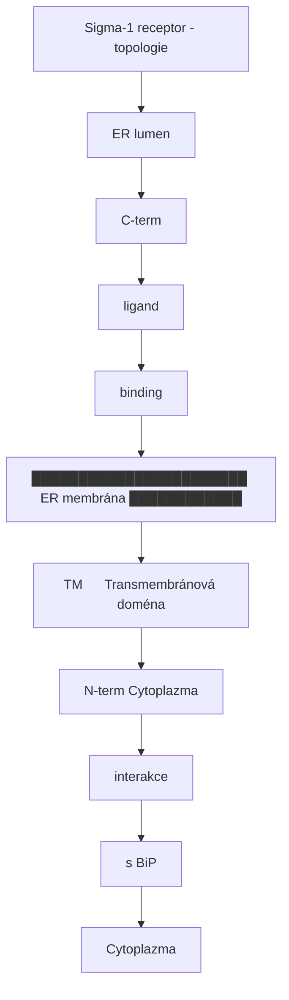

<details>
<summary>ASCII verze diagramu</summary>

```
Sigma-1 receptor - topologie
┌─────────────────────────────────────────────────────┐
│                                                     │
│   ER lumen                                          │
│        │                                            │
│   ┌────┴────┐                                       │
│   │   C-term│                                       │
│   │  (ligand│                                       │
│   │  binding)                                       │
│   └────┬────┘                                       │
│        │                                            │
│   █████│██████████████████ ER membrána ████████████ │
│        │                                            │
│   ┌────┴────┐                                       │
│   │   TM    │ ← Transmembránová doména             │
│   └────┬────┘                                       │
│        │                                            │
│   ┌────┴────┐                                       │
│   │  N-term │ ← Cytoplazma                         │
│   │ (interakce                                     │
│   │  s BiP) │                                       │
│   └─────────┘                                       │
│                                                     │
│   Cytoplazma                                        │
│                                                     │
└─────────────────────────────────────────────────────┘

- Jednoduchá TM topologie
- C-terminus v ER lumen (ligand binding)
- N-terminus v cytoplazmě (BiP interakce)
```

</details>

### Oligomerizace

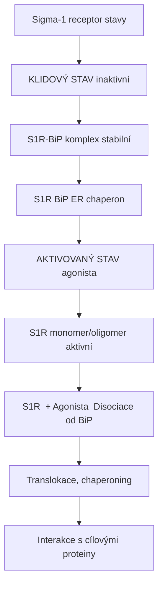

<details>
<summary>ASCII verze diagramu</summary>

```
Sigma-1 receptor stavy
┌─────────────────────────────────────────────────────┐
│                                                     │
│   KLIDOVÝ STAV (inaktivní)                         │
│                                                     │
│   S1R-BiP komplex (stabilní)                       │
│   ─────────────────────────                        │
│        ┌─────┐   ┌─────┐                           │
│        │ S1R │───│ BiP │ ← ER chaperon            │
│        └─────┘   └─────┘                           │
│                                                     │
│   AKTIVOVANÝ STAV (agonista)                       │
│                                                     │
│   S1R monomer/oligomer (aktivní)                   │
│   ──────────────────────────────                   │
│        ┌─────┐                                     │
│        │ S1R │ + Agonista → Disociace od BiP      │
│        └──┬──┘                                     │
│           │                                        │
│           ↓                                        │
│   Translokace, chaperoning                        │
│   Interakce s cílovými proteiny                   │
│                                                     │
└─────────────────────────────────────────────────────┘
```

</details>

---

## Lokalizace: MAM (Mitochondria-Associated ER Membrane)

### MAM funkce

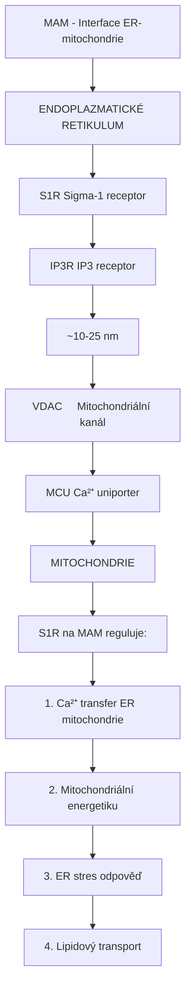

<details>
<summary>ASCII verze diagramu</summary>

```
MAM - Interface ER-mitochondrie
┌─────────────────────────────────────────────────────┐
│                                                     │
│   ENDOPLAZMATICKÉ RETIKULUM                        │
│   ═══════════════════════════                      │
│              │                                      │
│         ┌────┴────┐                                │
│         │  S1R    │ ← Sigma-1 receptor            │
│         │  │      │                                │
│         │  IP3R   │ ← IP3 receptor                │
│         └────┬────┘                                │
│              │                                      │
│         ~10-25 nm                                  │
│              │                                      │
│         ┌────┴────┐                                │
│         │  VDAC   │ ← Mitochondriální kanál       │
│         │  MCU    │ ← Ca²⁺ uniporter             │
│         └────┬────┘                                │
│              │                                      │
│   MITOCHONDRIE                                     │
│   ════════════                                     │
│                                                     │
│   S1R na MAM reguluje:                             │
│   1. Ca²⁺ transfer ER → mitochondrie              │
│   2. Mitochondriální energetiku                   │
│   3. ER stres odpověď                              │
│   4. Lipidový transport                            │
│                                                     │
└─────────────────────────────────────────────────────┘
```

</details>

### Ca²⁺ signalizace

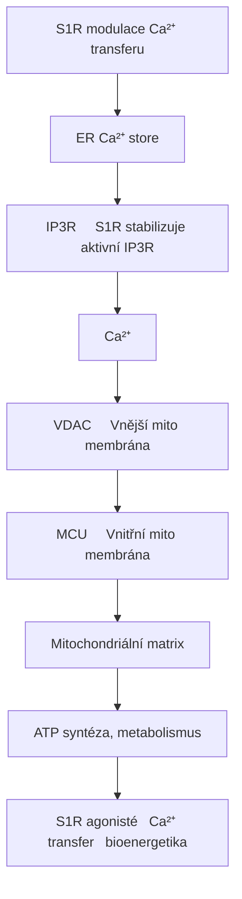

<details>
<summary>ASCII verze diagramu</summary>

```
S1R modulace Ca²⁺ transferu
┌─────────────────────────────────────────────────────┐
│                                                     │
│   ER (Ca²⁺ store)                                  │
│        │                                            │
│        ↓                                            │
│   ┌─────────┐                                       │
│   │  IP3R   │ ← S1R stabilizuje aktivní IP3R      │
│   └────┬────┘                                       │
│        │                                            │
│        ↓ Ca²⁺                                      │
│        │                                            │
│   ┌────┴────┐                                       │
│   │  VDAC   │ ← Vnější mito membrána              │
│   └────┬────┘                                       │
│        │                                            │
│        ↓                                            │
│   ┌────┴────┐                                       │
│   │   MCU   │ ← Vnitřní mito membrána             │
│   └────┬────┘                                       │
│        │                                            │
│        ↓                                            │
│   Mitochondriální matrix                           │
│        │                                            │
│        ↓                                            │
│   ATP syntéza, metabolismus                        │
│                                                     │
│   S1R agonisté → ↑ Ca²⁺ transfer → ↑ bioenergetika│
│                                                     │
└─────────────────────────────────────────────────────┘
```

</details>

---

## Chaperon funkce

### BiP interakce

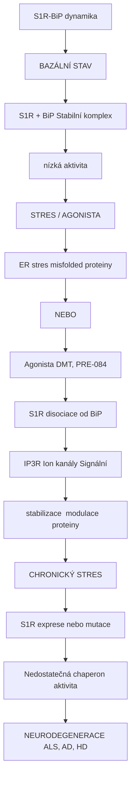

<details>
<summary>ASCII verze diagramu</summary>

```
S1R-BiP dynamika
┌─────────────────────────────────────────────────────┐
│                                                     │
│   BAZÁLNÍ STAV                                     │
│   ────────────                                     │
│   S1R + BiP → Stabilní komplex                    │
│   (nízká aktivita)                                 │
│                                                     │
│   STRES / AGONISTA                                 │
│   ────────────────                                 │
│   ER stres (misfolded proteiny)                   │
│   NEBO                                             │
│   Agonista (DMT, PRE-084)                         │
│              │                                      │
│              ↓                                      │
│   S1R disociace od BiP                            │
│              │                                      │
│              ↓                                      │
│   ┌──────────┼──────────┐                          │
│   ↓          ↓          ↓                          │
│ IP3R      Ion kanály  Signální                    │
│ stabilizace  modulace   proteiny                  │
│                                                     │
│   CHRONICKÝ STRES                                  │
│   ───────────────                                  │
│   ↓ S1R exprese nebo mutace                       │
│              │                                      │
│              ↓                                      │
│   Nedostatečná chaperon aktivita                  │
│              │                                      │
│              ↓                                      │
│   NEURODEGENERACE (ALS, AD, HD)                   │
│                                                     │
└─────────────────────────────────────────────────────┘
```

</details>

### Klientní proteiny

| Klient | Funkce | S1R efekt |
|--------|--------|-----------|
| **IP3R** | Ca²⁺ uvolnění | Stabilizace, ↑ aktivita |
| **BiP/GRP78** | ER chaperon | Regulace disociace |
| **IRE1** | UPR sensor | Modulace stresu |
| **Kv kanály** | K⁺ proudy | Modulace excitability |
| **NR1/NR2** | NMDA | Trafficking, funkce |

---

## Farmakologie

### Agonisté

| Látka | Ki (nM) | Zdroj | Použití |
|-------|---------|-------|---------|
| [**DMT**](@/alkaloids/dmt.md) | 14-50 | Endogenní/rostliny | Psychedelikum |
| **PRE-084** | 2-5 | Syntetický | Výzkum, neuroprotekce |
| **(+)-Pentazocin** | 5-10 | Syntetický | Výzkum |
| **Fluvoxamin** | 36 | SSRI | Antidepresivum |
| **Igmesine** | 20-40 | Syntetický | Antidepresivum (fáze III) |
| **SA4503** | 5-10 | Syntetický | Kognice, mrtvice |
| **Donepezil** | 14 | AChE inhibitor | Alzheimer |

### Antagonisté

| Látka | Ki (nM) | Použití |
|-------|---------|---------|
| **NE-100** | 1-5 | Výzkum |
| **BD1047** | 5-10 | Výzkum |
| **Haloperidol** | 2-5 | Antipsychotikum |
| **BD1063** | 10-20 | Výzkum |

---

## DMT a Sigma-1

### Endogenní DMT hypotéza

```mermaid
flowchart TD
    node_DMTSigma1interakce["DMT-Sigma-1 interakce"]
    node_DMTNNdimethyltryptam["DMT N,N-dimethyltryptamin"]
    node_EndogennsyntetizovnI["- Endogenně syntetizován INMT"]
    node_Ptomenvmozkukrvi["- Přítomen v mozku, krvi"]
    node_Zvenpistresuhypoxii["- Zvýšen při stresu, hypoxii?"]
    node_DMTSigma1receptor["DMT + Sigma-1 receptor"]
    node_1MAMfunkce["1. MAM funkce"]
    node_Catransfer["-  Ca²⁺ transfer"]
    node_ATPprodukce["-  ATP produkce"]
    node_2Antiapoptotickinky["2. Anti-apoptotické účinky"]
    node_ModulaceBcl2["- Modulace Bcl-2"]
    node_cytochromcrelease["-  cytochrom c release"]
    node_3Iontovkanly["3. Iontové kanály"]
    node_NMDAmodulace["- NMDA modulace"]
    node_Kvmodulace["- Kv modulace"]
    node_4Psychedelickinky["4. Psychedelické účinky?"]
    node_Kombinaces5HT2A["- Kombinace s 5-HT2A"]
    node_Mystickzitky["- Mystické zážitky"]
    node_HypotzaDMTendogennne["Hypotéza: DMT = endogenní neuroprotektant"]
    node_aktivujcS1Rpistresu["aktivující S1R při stresu"]

    node_DMTSigma1interakce --> node_DMTNNdimethyltryptam
    node_DMTNNdimethyltryptam --> node_EndogennsyntetizovnI
    node_EndogennsyntetizovnI --> node_Ptomenvmozkukrvi
    node_Ptomenvmozkukrvi --> node_Zvenpistresuhypoxii
    node_Zvenpistresuhypoxii --> node_DMTSigma1receptor
    node_DMTSigma1receptor --> node_1MAMfunkce
    node_1MAMfunkce --> node_Catransfer
    node_Catransfer --> node_ATPprodukce
    node_ATPprodukce --> node_2Antiapoptotickinky
    node_2Antiapoptotickinky --> node_ModulaceBcl2
    node_ModulaceBcl2 --> node_cytochromcrelease
    node_cytochromcrelease --> node_3Iontovkanly
    node_3Iontovkanly --> node_NMDAmodulace
    node_NMDAmodulace --> node_Kvmodulace
    node_Kvmodulace --> node_4Psychedelickinky
    node_4Psychedelickinky --> node_Kombinaces5HT2A
    node_Kombinaces5HT2A --> node_Mystickzitky
    node_Mystickzitky --> node_HypotzaDMTendogennne
    node_HypotzaDMTendogennne --> node_aktivujcS1Rpistresu

    click node_DMTSigma1interakce "/alkaloids/dmt/" "DMT-Sigma-1 interakce"
    click node_DMTNNdimethyltryptam "/alkaloids/dmt/" "DMT N,N-dimethyltryptamin"
    click node_DMTSigma1receptor "/alkaloids/dmt/" "DMT + Sigma-1 receptor"
    click node_HypotzaDMTendogennne "/alkaloids/dmt/" "Hypotéza: DMT = endogenní neuroprotektant"
```

<details>
<summary>ASCII verze diagramu</summary>

```
DMT-Sigma-1 interakce
┌─────────────────────────────────────────────────────┐
│                                                     │
│   DMT (N,N-dimethyltryptamin)                      │
│   ─────────────────────────                        │
│   - Endogenně syntetizován (INMT)                 │
│   - Přítomen v mozku, krvi                         │
│   - Zvýšen při stresu, hypoxii?                   │
│                                                     │
│   DMT + Sigma-1 receptor                           │
│              │                                      │
│              ↓                                      │
│   ┌──────────────────────────────┐                 │
│   │                              │                 │
│   │   1. MAM funkce             │                 │
│   │      - ↑ Ca²⁺ transfer      │                 │
│   │      - ↑ ATP produkce       │                 │
│   │                              │                 │
│   │   2. Anti-apoptotické účinky│                 │
│   │      - Modulace Bcl-2       │                 │
│   │      - ↓ cytochrom c release│                 │
│   │                              │                 │
│   │   3. Iontové kanály         │                 │
│   │      - NMDA modulace        │                 │
│   │      - Kv modulace          │                 │
│   │                              │                 │
│   │   4. Psychedelické účinky?  │                 │
│   │      - Kombinace s 5-HT2A   │                 │
│   │      - Mystické zážitky     │                 │
│   │                              │                 │
│   └──────────────────────────────┘                 │
│                                                     │
│   Hypotéza: DMT = endogenní neuroprotektant       │
│             aktivující S1R při stresu             │
│                                                     │
└─────────────────────────────────────────────────────┘
```

</details>

### Near-death experience spekulace

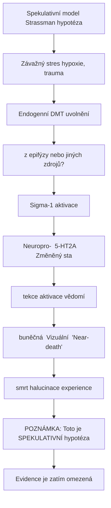

<details>
<summary>ASCII verze diagramu</summary>

```
Spekulativní model (Strassman hypotéza)
┌─────────────────────────────────────────────────────┐
│                                                     │
│   Závažný stres (hypoxie, trauma)                 │
│              │                                      │
│              ↓                                      │
│   ↑ Endogenní DMT uvolnění                        │
│   (z epifýzy nebo jiných zdrojů?)                 │
│              │                                      │
│              ↓                                      │
│   Sigma-1 aktivace                                 │
│              │                                      │
│   ┌──────────┼──────────┐                          │
│   ↓          ↓          ↓                          │
│ Neuropro-  5-HT2A     Změněný stav               │
│ tekce      aktivace   vědomí                      │
│   │          │          │                          │
│   ↓          ↓          ↓                          │
│ ↓ buněčná  Vizuální  "Near-death"                │
│ smrt       halucinace experience                  │
│                                                     │
│   POZNÁMKA: Toto je SPEKULATIVNÍ hypotéza         │
│   Evidence je zatím omezená                        │
│                                                     │
└─────────────────────────────────────────────────────┘
```

</details>

---

## Neuroprotekce

### Mechanismy

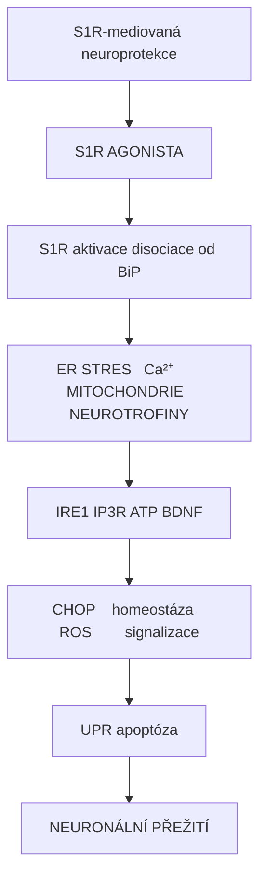

<details>
<summary>ASCII verze diagramu</summary>

```
S1R-mediovaná neuroprotekce
┌─────────────────────────────────────────────────────┐
│                                                     │
│   S1R AGONISTA                                     │
│        │                                            │
│        ↓                                            │
│   S1R aktivace (disociace od BiP)                 │
│        │                                            │
│   ┌────┴─────────────────────────────┐             │
│   ↓           ↓           ↓           ↓            │
│                                                     │
│ ER STRES   Ca²⁺       MITOCHONDRIE  NEUROTROFINY │
│ ────────   ────       ────────────  ───────────  │
│ ↓ IRE1    ↑ IP3R      ↑ ATP        ↑ BDNF       │
│ ↓ CHOP    homeostáza  ↓ ROS        signalizace  │
│ ↓ UPR                 ↓ apoptóza                  │
│   │           │           │           │            │
│   └───────────┴───────────┴───────────┘            │
│                   │                                 │
│                   ↓                                 │
│           NEURONÁLNÍ PŘEŽITÍ                       │
│                                                     │
└─────────────────────────────────────────────────────┘
```

</details>

### Preklinická evidence

| Model | S1R agonista | Efekt |
|-------|--------------|-------|
| **Mrtvice (MCAO)** | PRE-084, SA4503 | ↓ infarkt, ↑ funkce |
| **Parkinson (MPTP)** | PRE-084 | ↓ DA neuronální ztráta |
| **Alzheimer (Aβ)** | Donepezil | ↓ neurotoxicita |
| **ALS (SOD1)** | PRE-084 | ↑ přežití motoneuronů |

---

## Klinické aplikace

### Neurodegenerativní onemocnění

```mermaid
flowchart TD
    node_S1Raneurodegenerace["S1R a neurodegenerace"]
    node_ALSAmyotroficklaterl["ALS Amyotrofická laterální skleróza"]
    node_SIGMAR1mutaceufamili["- SIGMAR1 mutace u familiární ALS"]
    node_S1Rmotoneuronovochra["-  S1R =  motoneuronová ochrana"]
    node_S1Ragonistpotencilnt["- S1R agonisté = potenciální terapie"]
    node_ALZHEIMEROVACHOROBA["ALZHEIMEROVA CHOROBA"]
    node_S1Rvhippocampupacien["-  S1R v hippocampu pacientů"]
    node_DonepezilS1Ragonista["- Donepezil S1R agonista = klinicky účinný"]
    node_S1RmodulaceAtoxicity["- S1R modulace Aβ toxicity"]
    node_HUNTINGTONOVACHOROBA["HUNTINGTONOVA CHOROBA"]
    node_S1RuHDpacient["-  S1R u HD pacientů"]
    node_PridopidineS1Ragonis["- Pridopidine S1R agonista - fáze III"]
    node_PARKINSONOVACHOROBA["PARKINSONOVA CHOROBA"]
    node_S1Ragonistzlepujmoto["- S1R agonisté zlepšují motoriku v modelech"]

    node_S1Raneurodegenerace --> node_ALSAmyotroficklaterl
    node_ALSAmyotroficklaterl --> node_SIGMAR1mutaceufamili
    node_SIGMAR1mutaceufamili --> node_S1Rmotoneuronovochra
    node_S1Rmotoneuronovochra --> node_S1Ragonistpotencilnt
    node_S1Ragonistpotencilnt --> node_ALZHEIMEROVACHOROBA
    node_ALZHEIMEROVACHOROBA --> node_S1Rvhippocampupacien
    node_S1Rvhippocampupacien --> node_DonepezilS1Ragonista
    node_DonepezilS1Ragonista --> node_S1RmodulaceAtoxicity
    node_S1RmodulaceAtoxicity --> node_HUNTINGTONOVACHOROBA
    node_HUNTINGTONOVACHOROBA --> node_S1RuHDpacient
    node_S1RuHDpacient --> node_PridopidineS1Ragonis
    node_PridopidineS1Ragonis --> node_PARKINSONOVACHOROBA
    node_PARKINSONOVACHOROBA --> node_S1Ragonistzlepujmoto
```

<details>
<summary>ASCII verze diagramu</summary>

```
S1R a neurodegenerace
┌─────────────────────────────────────────────────────┐
│                                                     │
│   ALS (Amyotrofická laterální skleróza)           │
│   ─────────────────────────────────────           │
│   - SIGMAR1 mutace u familiární ALS               │
│   - ↓ S1R = ↓ motoneuronová ochrana              │
│   - S1R agonisté = potenciální terapie           │
│                                                     │
│   ALZHEIMEROVA CHOROBA                            │
│   ────────────────────                            │
│   - ↓ S1R v hippocampu pacientů                  │
│   - Donepezil (S1R agonista) = klinicky účinný   │
│   - S1R modulace Aβ toxicity                     │
│                                                     │
│   HUNTINGTONOVA CHOROBA                           │
│   ──────────────────────                          │
│   - ↓ S1R u HD pacientů                          │
│   - Pridopidine (S1R agonista) - fáze III        │
│                                                     │
│   PARKINSONOVA CHOROBA                            │
│   ────────────────────                            │
│   - S1R agonisté zlepšují motoriku v modelech    │
│                                                     │
└─────────────────────────────────────────────────────┘
```

</details>

### Psychiatrie

| Indikace | S1R mechanismus | Látka |
|----------|-----------------|-------|
| **Deprese** | Neuroplasticita, BDNF | Fluvoxamin, Igmesine |
| **Úzkost** | GABA/glutamát modulace | Agonisté |
| **Psychóza** | Komplexní | Haloperidol (antagonista) |
| **Závislost** | Dopaminová modulace | Ve výzkumu |

### Bolest

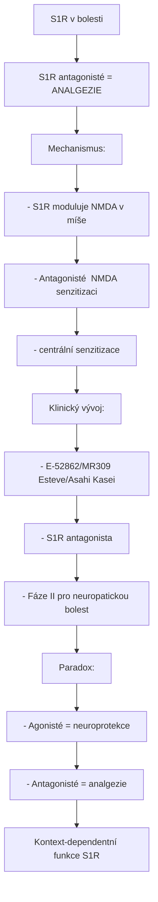

<details>
<summary>ASCII verze diagramu</summary>

```
S1R v bolesti
┌─────────────────────────────────────────────────────┐
│                                                     │
│   S1R antagonisté = ANALGEZIE                      │
│                                                     │
│   Mechanismus:                                      │
│   - S1R moduluje NMDA v míše                       │
│   - Antagonisté ↓ NMDA senzitizaci                │
│   - ↓ centrální senzitizace                       │
│                                                     │
│   Klinický vývoj:                                   │
│   - E-52862/MR309 (Esteve/Asahi Kasei)            │
│     - S1R antagonista                              │
│     - Fáze II pro neuropatickou bolest            │
│                                                     │
│   Paradox:                                          │
│   - Agonisté = neuroprotekce                       │
│   - Antagonisté = analgezie                        │
│   → Kontext-dependentní funkce S1R                │
│                                                     │
└─────────────────────────────────────────────────────┘
```

</details>

---

## Genetické mutace

### SIGMAR1 mutace a onemocnění

| Mutace | Onemocnění | Mechanismus |
|--------|------------|-------------|
| **E102Q** | Juvenilní ALS | ↓ chaperon funkce |
| **L95fs** | Distální myopatie | Ztráta funkce |
| **Δ31-50** | Neurodegenenerace | Misfolding |

---

## Srovnání Sigma-1 vs Sigma-2

| Vlastnost | **Sigma-1** | Sigma-2 |
|-----------|-------------|---------|
| **Gen** | SIGMAR1 | TMEM97 |
| **Velikost** | 223 aa | 176 aa |
| **Lokalizace** | MAM, ER | ER, lyzozomy |
| **Funkce** | Chaperon, Ca²⁺ | Buněčná proliferace |
| **Ligandy** | DMT, PRE-084 | CM398, PB28 |
| **Terapeutický potenciál** | Neuroprotekce | Onkologie |

---

## Reference

1. Hayashi, T. & Su, T.P. (2007). *Sigma-1 receptor chaperones at the ER-mitochondrion interface regulate Ca2+ signaling and cell survival*. Cell.
2. Su, T.P. et al. (2016). *The sigma-1 receptor as a pluripotent modulator in living systems*. Trends in Pharmacological Sciences.
3. Fontanilla, D. et al. (2009). *The hallucinogen N,N-dimethyltryptamine (DMT) is an endogenous sigma-1 receptor regulator*. Science.
4. Schmidt, H.R. et al. (2016). *Crystal structure of the human σ1 receptor*. Nature.
5. Penke, B. et al. (2018). *The role of sigma-1 receptor, an intracellular chaperone in neurodegenerative diseases*. Current Neuropharmacology.

---

Viz také:
- [Sigma-2 receptor](@/receptors/sigma-2.md) - Sesterský receptor
- [DMT](@/alkaloids/dmt.md) - Endogenní S1R agonista
- [5-HT2A receptor](@/receptors/5-ht2a.md) - Psychedelický partner
- [NMDA receptor](@/receptors/nmda.md) - S1R modulovaný
- [Glosář](@/glossary/_index.md) - Definice pojmů

<- Zpět na [Receptory](@/receptors/_index.md) | [Sigma-2 receptor](@/receptors/sigma-2.md) ->
