+++
title = "Sigma-2 receptor"
description = "Sigma-2 receptor (TMEM97) - regulátor buněčné proliferace a potenciální cíl v onkologii"
weight = 13
insert_anchor_links = "right"

[taxonomies]
categories = ["receptory", "sigma", "TMEM97"]
tags = ["sigma-2", "TMEM97", "proliferace", "onkologie", "cholesterol", "neuroprotekce"]
+++

# Sigma-2 receptor (TMEM97) - Tajemný regulátor buněčného osudu

**Sigma-2 receptor** (S2R), molekulárně identifikovaný jako **TMEM97** (Transmembrane Protein 97), je intracelulární protein s klíčovou rolí v **buněčné proliferaci**, **apoptóze** a **cholesterolovém metabolismu**. Na rozdíl od [Sigma-1 receptoru](@/receptors/sigma-1.md) byl jeho molekulární charakter objasněn teprve nedávno (2017) a představuje slibný cíl pro **onkologickou** terapii a **neurodegenerativní** onemocnění.

---

## Základní charakteristika

### Identifikace TMEM97

| Vlastnost | Hodnota |
|-----------|---------|
| **Typ** | Transmembránový protein |
| **Molekulární identita** | TMEM97 |
| **Gen** | TMEM97 |
| **Chromozom** | 17q11.2 |
| **Délka** | 176 aminokyselin |
| **Transmembránové domény** | 4 |
| **Lokalizace** | ER, lyzozomy, endozomy |

### Historický kontext

```mermaid
flowchart TD
    node_Sigma2receptorcestak["Sigma-2 receptor - cesta k identifikaci"]
    node_1990RozlienS1RvsS2R["1990: Rozlišení S1R vs S2R"]
    node_nazkladvazebnchvlast["na základě vazebných vlastností"]
    node_S1R25kDa["- S1R: 25 kDa"]
    node_S2R18215kDa["- S2R: 18-21.5 kDa"]
    node_19902016Orphanrecept["1990-2016: 'Orphan receptor'"]
    node_Znmligandyneznmident["- Známé ligandy, neznámá identita"]
    node_DTGsiramesinePB28vaz["- DTG, siramesine, PB28 vazba"]
    node_Asociacesrakovinou["- Asociace s rakovinou"]
    node_2017Molekulrnidentif["2017: Molekulární identifikace"]
    node_AlonetalPNAS["Alon et al., PNAS"]
    node_Fotoafinitnznaen["- Fotoafinitní značení"]
    node_Proteomickidentifika["- Proteomická identifikace"]
    node_S2RTMEM97["- S2R = TMEM97"]
    node_2017souasnostFunknch["2017-současnost: Funkční charakterizace"]
    node_Cholesteroltrafficki["- Cholesterol trafficking"]
    node_NPC1PGRMC1interakce["- NPC1/PGRMC1 interakce"]
    node_Terapeutickpotencil["- Terapeutický potenciál"]

    node_Sigma2receptorcestak --> node_1990RozlienS1RvsS2R
    node_1990RozlienS1RvsS2R --> node_nazkladvazebnchvlast
    node_nazkladvazebnchvlast --> node_S1R25kDa
    node_S1R25kDa --> node_S2R18215kDa
    node_S2R18215kDa --> node_19902016Orphanrecept
    node_19902016Orphanrecept --> node_Znmligandyneznmident
    node_Znmligandyneznmident --> node_DTGsiramesinePB28vaz
    node_DTGsiramesinePB28vaz --> node_Asociacesrakovinou
    node_Asociacesrakovinou --> node_2017Molekulrnidentif
    node_2017Molekulrnidentif --> node_AlonetalPNAS
    node_AlonetalPNAS --> node_Fotoafinitnznaen
    node_Fotoafinitnznaen --> node_Proteomickidentifika
    node_Proteomickidentifika --> node_S2RTMEM97
    node_S2RTMEM97 --> node_2017souasnostFunknch
    node_2017souasnostFunknch --> node_Cholesteroltrafficki
    node_Cholesteroltrafficki --> node_NPC1PGRMC1interakce
    node_NPC1PGRMC1interakce --> node_Terapeutickpotencil
```

<details>
<summary>ASCII verze diagramu</summary>

```
Sigma-2 receptor - cesta k identifikaci
┌─────────────────────────────────────────────────────┐
│                                                     │
│   1990: Rozlišení S1R vs S2R                       │
│         (na základě vazebných vlastností)          │
│         - S1R: 25 kDa                              │
│         - S2R: 18-21.5 kDa                         │
│                                                     │
│   1990-2016: "Orphan receptor"                     │
│         - Známé ligandy, neznámá identita         │
│         - DTG, siramesine, PB28 vazba             │
│         - Asociace s rakovinou                     │
│                                                     │
│   2017: Molekulární identifikace                   │
│         (Alon et al., PNAS)                        │
│         - Fotoafinitní značení                     │
│         - Proteomická identifikace                 │
│         - S2R = TMEM97                             │
│                                                     │
│   2017-současnost: Funkční charakterizace          │
│         - Cholesterol trafficking                  │
│         - NPC1/PGRMC1 interakce                   │
│         - Terapeutický potenciál                   │
│                                                     │
└─────────────────────────────────────────────────────┘
```

</details>

---

## Struktura TMEM97

### Topologie

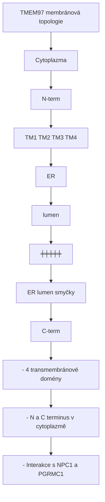

<details>
<summary>ASCII verze diagramu</summary>

```
TMEM97 membránová topologie
┌─────────────────────────────────────────────────────┐
│                                                     │
│   Cytoplazma                                        │
│        │                                            │
│   N-term                                           │
│        │                                            │
│   ═════╪═══════════════════════════════════════════│
│        │     TM1      TM2      TM3      TM4        │
│   ER   ├──────┬────────┬────────┬────────┤        │
│  lumen │      │        │        │        │        │
│        │      │        │        │        │        │
│   ═════╪══════╪════════╪════════╪════════╪════════│
│        │                                  │        │
│        │      ER lumen smyčky            │        │
│        │                                  │        │
│   ─────┴──────────────────────────────────┴─────   │
│                                            C-term  │
│   Cytoplazma                                        │
│                                                     │
│   - 4 transmembránové domény                       │
│   - N a C terminus v cytoplazmě                   │
│   - Interakce s NPC1 a PGRMC1                     │
│                                                     │
└─────────────────────────────────────────────────────┘
```

</details>

### Proteinové interakce

| Partner | Lokalizace | Funkce |
|---------|------------|--------|
| **NPC1** | Lyzozomální membrána | Cholesterol export |
| **PGRMC1** | ER, mitochondrie | Steroidní biosyntéza |
| **LDLR** | Plazmatická membrána | LDL uptake |
| **SREBP** | ER/Golgi | Lipidová homeostáza |

---

## Funkce

### Cholesterolová homeostáza

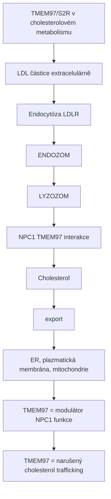

<details>
<summary>ASCII verze diagramu</summary>

```
TMEM97/S2R v cholesterolovém metabolismu
┌─────────────────────────────────────────────────────┐
│                                                     │
│   LDL částice (extracelulárně)                     │
│              │                                      │
│              ↓ Endocytóza (LDLR)                   │
│              │                                      │
│   ┌──────────┴──────────┐                          │
│   │     ENDOZOM         │                          │
│   │          │          │                          │
│   │          ↓          │                          │
│   │     LYZOZOM         │                          │
│   │          │          │                          │
│   │     ┌────┴────┐     │                          │
│   │     │  NPC1   │←────┼─── TMEM97 interakce     │
│   │     └────┬────┘     │                          │
│   │          │          │                          │
│   │          ↓          │                          │
│   │   Cholesterol       │                          │
│   │   export            │                          │
│   └──────────┬──────────┘                          │
│              │                                      │
│              ↓                                      │
│   ER, plazmatická membrána, mitochondrie          │
│                                                     │
│   TMEM97 = modulátor NPC1 funkce                  │
│   ↓ TMEM97 = narušený cholesterol trafficking     │
│                                                     │
└─────────────────────────────────────────────────────┘
```

</details>

### Niemann-Pick typu C (NPC) spojení

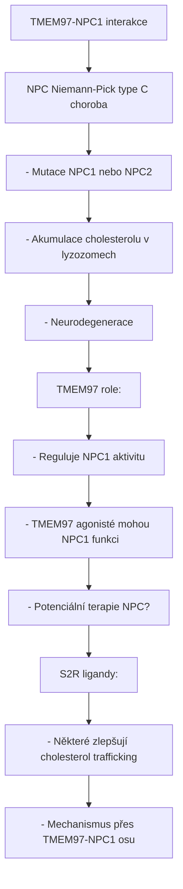

<details>
<summary>ASCII verze diagramu</summary>

```
TMEM97-NPC1 interakce
┌─────────────────────────────────────────────────────┐
│                                                     │
│   NPC (Niemann-Pick type C) choroba               │
│   ─────────────────────────────────               │
│   - Mutace NPC1 nebo NPC2                         │
│   - Akumulace cholesterolu v lyzozomech           │
│   - Neurodegenerace                               │
│                                                     │
│   TMEM97 role:                                     │
│   - Reguluje NPC1 aktivitu                        │
│   - TMEM97 agonisté mohou ↑ NPC1 funkci          │
│   - Potenciální terapie NPC?                      │
│                                                     │
│   S2R ligandy:                                     │
│   - Některé zlepšují cholesterol trafficking      │
│   - Mechanismus přes TMEM97-NPC1 osu             │
│                                                     │
└─────────────────────────────────────────────────────┘
```

</details>

### Buněčná proliferace a apoptóza

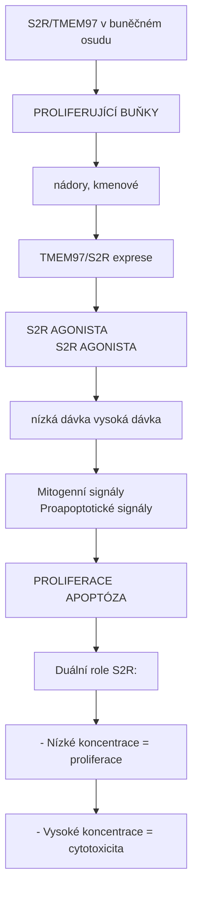

<details>
<summary>ASCII verze diagramu</summary>

```
S2R/TMEM97 v buněčném osudu
┌─────────────────────────────────────────────────────┐
│                                                     │
│   PROLIFERUJÍCÍ BUŇKY                              │
│   (nádory, kmenové)                                │
│        │                                            │
│        ↓                                            │
│   ↑ TMEM97/S2R exprese                            │
│        │                                            │
│        │                                            │
│   S2R AGONISTA                   S2R AGONISTA      │
│   (nízká dávka)                  (vysoká dávka)    │
│        │                              │            │
│        ↓                              ↓            │
│   Mitogenní signály          Proapoptotické signály│
│        │                              │            │
│        ↓                              ↓            │
│   ↑ PROLIFERACE              ↑ APOPTÓZA           │
│                                                     │
│   Duální role S2R:                                 │
│   - Nízké koncentrace = proliferace               │
│   - Vysoké koncentrace = cytotoxicita             │
│                                                     │
└─────────────────────────────────────────────────────┘
```

</details>

### Mechanismy cytotoxicity

| Mechanismus | Mediátory | Efekt |
|-------------|-----------|-------|
| **Ca²⁺ dysregulace** | ER stres | Apoptóza |
| **Kaspázy** | Kaspáza-3, -9 | Programovaná smrt |
| **Ceramid** | Sfingomyelináza | Proapoptotický signál |
| **Autofagie** | LC3, Beclin | Autofagická smrt |

---

## Farmakologie

### Agonisté

| Látka | Ki (nM) | Selektivita | Použití |
|-------|---------|-------------|---------|
| **DTG (1,3-di-o-tolylguanidine)** | 30-80 | S1R + S2R | Výzkum |
| **Siramesine** | 0.1-1 | S2R > S1R | Výzkum, onkologie |
| **PB28** | 1-5 | S2R selektivní | Výzkum |
| **RHM-1** | 5-15 | S2R selektivní | PET imaging |
| **SV119** | 10-30 | S2R selektivní | Onkologie |

### Antagonisté

| Látka | Ki (nM) | Použití |
|-------|---------|---------|
| **CM398** | 1-5 | Výzkum |
| **CM699** | 2-10 | Výzkum |
| **RHM-4** | 10-30 | Imaging |

### Radioligandy pro imaging

| Ligand | Typ | Aplikace |
|--------|-----|----------|
| **[18F]ISO-1** | PET | Nádorová detekce |
| **[11C]RHM-1** | PET | S2R occupancy |
| **[125I]RHM-4** | SPECT | Výzkum |

---

## Onkologické aplikace

### S2R jako biomarker

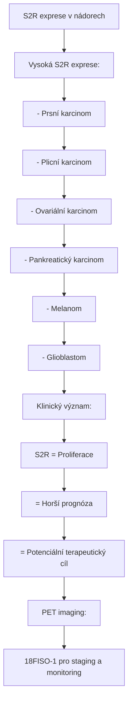

<details>
<summary>ASCII verze diagramu</summary>

```
S2R exprese v nádorech
┌─────────────────────────────────────────────────────┐
│                                                     │
│   Vysoká S2R exprese:                              │
│   ─────────────────────                            │
│   - Prsní karcinom                                 │
│   - Plicní karcinom                                │
│   - Ovariální karcinom                             │
│   - Pankreatický karcinom                          │
│   - Melanom                                         │
│   - Glioblastom                                    │
│                                                     │
│   Klinický význam:                                 │
│                                                     │
│   ↑ S2R = ↑ Proliferace                           │
│         = Horší prognóza                           │
│         = Potenciální terapeutický cíl            │
│                                                     │
│   PET imaging:                                      │
│   [18F]ISO-1 pro staging a monitoring             │
│                                                     │
└─────────────────────────────────────────────────────┘
```

</details>

### Terapeutické strategie

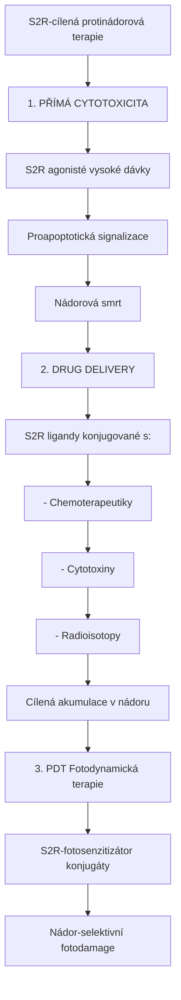

<details>
<summary>ASCII verze diagramu</summary>

```
S2R-cílená protinádorová terapie
┌─────────────────────────────────────────────────────┐
│                                                     │
│   1. PŘÍMÁ CYTOTOXICITA                            │
│      ───────────────────                           │
│      S2R agonisté (vysoké dávky)                   │
│              │                                      │
│              ↓                                      │
│      Proapoptotická signalizace                    │
│              │                                      │
│              ↓                                      │
│      Nádorová smrt                                 │
│                                                     │
│   2. DRUG DELIVERY                                 │
│      ─────────────                                 │
│      S2R ligandy konjugované s:                    │
│      - Chemoterapeutiky                            │
│      - Cytotoxiny                                  │
│      - Radioisotopy                                │
│              │                                      │
│              ↓                                      │
│      Cílená akumulace v nádoru                    │
│                                                     │
│   3. PDT (Fotodynamická terapie)                  │
│      ────────────────────────                      │
│      S2R-fotosenzitizátor konjugáty               │
│              │                                      │
│              ↓                                      │
│      Nádor-selektivní fotodamage                  │
│                                                     │
└─────────────────────────────────────────────────────┘
```

</details>

### Klinický vývoj

| Látka | Typ | Indikace | Status |
|-------|-----|----------|--------|
| **SV119** | Cytotoxický agonista | Solidní nádory | Preklinická |
| **SW43** | Agonista-konjugát | Pankreatický Ca | Preklinická |
| **[177Lu]DOTA-S2R** | Radioimunoterapie | Různé | Fáze I |

---

## Neurodegenerativní onemocnění

### Alzheimerova choroba

```mermaid
flowchart TD
    node_S2RTMEM97vAlzheimero["S2R/TMEM97 v Alzheimerově chorobě"]
    node_TMEM97aAbeta["TMEM97 a Abeta"]
    node_TMEM97interagujesAbe["- TMEM97 interaguje s Abeta oligomery"]
    node_MemodulovatAbetainte["- Může modulovat Abeta internalizaci"]
    node_RolevAbetaindukovant["- Role v Abeta-indukované toxicitě"]
    node_Cholesterolovhypotza["Cholesterolová hypotéza AD:"]
    node_CholesterolovlivujeA["- Cholesterol ovlivňuje APP processing"]
    node_TMEM97regulujecholes["- TMEM97 reguluje cholesterol homeostázu"]
    node_PotencilnlinkTMEM97c["- Potenciální link: TMEM97  cholesterol  AD"]
    node_Terapeutickpotencil["Terapeutický potenciál:"]
    node_S2Rligandyjakoneurop["- S2R ligandy jako neuroprotektiva"]
    node_CT1812CognitionThera["- CT1812 Cognition Therapeutics"]
    node_S2Rantagonista["- S2R antagonista"]
    node_FzeIIproAD["- Fáze II pro AD"]
    node_BlokujeAbetatoxicitu["- Blokuje Abeta toxicitu"]

    node_S2RTMEM97vAlzheimero --> node_TMEM97aAbeta
    node_TMEM97aAbeta --> node_TMEM97interagujesAbe
    node_TMEM97interagujesAbe --> node_MemodulovatAbetainte
    node_MemodulovatAbetainte --> node_RolevAbetaindukovant
    node_RolevAbetaindukovant --> node_Cholesterolovhypotza
    node_Cholesterolovhypotza --> node_CholesterolovlivujeA
    node_CholesterolovlivujeA --> node_TMEM97regulujecholes
    node_TMEM97regulujecholes --> node_PotencilnlinkTMEM97c
    node_PotencilnlinkTMEM97c --> node_Terapeutickpotencil
    node_Terapeutickpotencil --> node_S2Rligandyjakoneurop
    node_S2Rligandyjakoneurop --> node_CT1812CognitionThera
    node_CT1812CognitionThera --> node_S2Rantagonista
    node_S2Rantagonista --> node_FzeIIproAD
    node_FzeIIproAD --> node_BlokujeAbetatoxicitu
```

<details>
<summary>ASCII verze diagramu</summary>

```
S2R/TMEM97 v Alzheimerově chorobě
┌─────────────────────────────────────────────────────┐
│                                                     │
│   TMEM97 a Abeta                                   │
│   ──────────────                                   │
│   - TMEM97 interaguje s Abeta oligomery           │
│   - Může modulovat Abeta internalizaci            │
│   - Role v Abeta-indukované toxicitě              │
│                                                     │
│   Cholesterolová hypotéza AD:                      │
│   ──────────────────────────                       │
│   - Cholesterol ovlivňuje APP processing          │
│   - TMEM97 reguluje cholesterol homeostázu        │
│   - Potenciální link: TMEM97 → cholesterol → AD   │
│                                                     │
│   Terapeutický potenciál:                          │
│   ───────────────────────                          │
│   - S2R ligandy jako neuroprotektiva              │
│   - CT1812 (Cognition Therapeutics)               │
│     - S2R antagonista                              │
│     - Fáze II pro AD                               │
│     - Blokuje Abeta toxicitu                       │
│                                                     │
└─────────────────────────────────────────────────────┘
```

</details>

### CT1812 - Klinický vývoj

```mermaid
flowchart TD
    node_CT1812vAlzheimerovch["CT1812 v Alzheimerově chorobě"]
    node_CT1812CognitionThera["CT1812 Cognition Therapeutics"]
    node_S2Rantagonistamodult["- S2R antagonista/modulátor"]
    node_Orlnpodn["- Orální podání"]
    node_PekraujeBBB["- Překračuje BBB"]
    node_Mechanismus["Mechanismus:"]
    node_Abetaoligomery["Abeta oligomery"]
    node_Vazbananeuronlnrecep["Vazba na neuronální receptory"]
    node_etnTMEM97S2Rkomplexu["četně TMEM97/S2R komplexu"]
    node_Synaptickdysfunkce["Synaptická dysfunkce"]
    node_CT1812["CT1812:"]
    node_BlokujeAbetareceptor["- Blokuje Abeta-receptor interakci"]
    node_Chrnsynapse["- Chrání synapse"]
    node_Synaptickplasticita["-  Synaptická plasticita"]
    node_Klinickstatus["Klinický status:"]
    node_FzeIIIBezpendobetole["- Fáze I/II: Bezpečný, dobře tolerovaný"]
    node_FzeIISHINEstudieprob["- Fáze II: SHINE studie probíhá"]

    node_CT1812vAlzheimerovch --> node_CT1812CognitionThera
    node_CT1812CognitionThera --> node_S2Rantagonistamodult
    node_S2Rantagonistamodult --> node_Orlnpodn
    node_Orlnpodn --> node_PekraujeBBB
    node_PekraujeBBB --> node_Mechanismus
    node_Mechanismus --> node_Abetaoligomery
    node_Abetaoligomery --> node_Vazbananeuronlnrecep
    node_Vazbananeuronlnrecep --> node_etnTMEM97S2Rkomplexu
    node_etnTMEM97S2Rkomplexu --> node_Synaptickdysfunkce
    node_Synaptickdysfunkce --> node_CT1812
    node_CT1812 --> node_BlokujeAbetareceptor
    node_BlokujeAbetareceptor --> node_Chrnsynapse
    node_Chrnsynapse --> node_Synaptickplasticita
    node_Synaptickplasticita --> node_Klinickstatus
    node_Klinickstatus --> node_FzeIIIBezpendobetole
    node_FzeIIIBezpendobetole --> node_FzeIISHINEstudieprob

    click node_Vazbananeuronlnrecep "/receptors/_index/" "Vazba na neuronální receptory"
```

<details>
<summary>ASCII verze diagramu</summary>

```
CT1812 v Alzheimerově chorobě
┌─────────────────────────────────────────────────────┐
│                                                     │
│   CT1812 (Cognition Therapeutics)                  │
│   ───────────────────────────────                  │
│   - S2R antagonista/modulátor                      │
│   - Orální podání                                  │
│   - Překračuje BBB                                 │
│                                                     │
│   Mechanismus:                                      │
│   ────────────                                     │
│   Abeta oligomery                                  │
│        │                                            │
│        ↓                                            │
│   Vazba na neuronální receptory                   │
│   (včetně TMEM97/S2R komplexu)                    │
│        │                                            │
│        ↓                                            │
│   Synaptická dysfunkce                            │
│                                                     │
│   CT1812:                                          │
│   - Blokuje Abeta-receptor interakci              │
│   - Chrání synapse                                 │
│   - ↑ Synaptická plasticita                       │
│                                                     │
│   Klinický status:                                 │
│   - Fáze I/II: Bezpečný, dobře tolerovaný        │
│   - Fáze II: SHINE studie (probíhá)               │
│                                                     │
└─────────────────────────────────────────────────────┘
```

</details>

---

## PGRMC1 interakce

### TMEM97-PGRMC1 komplex

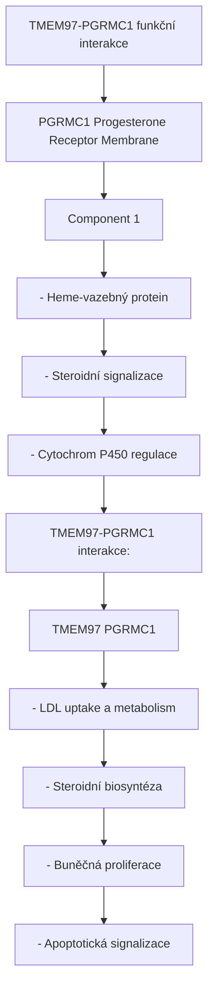

<details>
<summary>ASCII verze diagramu</summary>

```
TMEM97-PGRMC1 funkční interakce
┌─────────────────────────────────────────────────────┐
│                                                     │
│   PGRMC1 (Progesterone Receptor Membrane           │
│           Component 1)                              │
│   ───────────────────────────────────────────      │
│   - Heme-vazebný protein                           │
│   - Steroidní signalizace                          │
│   - Cytochrom P450 regulace                        │
│                                                     │
│   TMEM97-PGRMC1 interakce:                        │
│   ───────────────────────                          │
│        ┌─────────┐    ┌─────────┐                 │
│        │ TMEM97  │────│ PGRMC1  │                 │
│        └────┬────┘    └────┬────┘                 │
│             │              │                       │
│             └──────┬───────┘                       │
│                    │                               │
│                    ↓                               │
│   ┌────────────────────────────────────────┐      │
│   │                                        │      │
│   │   - LDL uptake a metabolism           │      │
│   │   - Steroidní biosyntéza              │      │
│   │   - Buněčná proliferace               │      │
│   │   - Apoptotická signalizace           │      │
│   │                                        │      │
│   └────────────────────────────────────────┘      │
│                                                     │
└─────────────────────────────────────────────────────┘
```

</details>

---

## Srovnání Sigma-1 vs Sigma-2

| Vlastnost | Sigma-1 | **Sigma-2 (TMEM97)** |
|-----------|---------|----------------------|
| **Identifikace** | 1996 | 2017 |
| **Gen** | SIGMAR1 | TMEM97 |
| **Velikost** | 223 aa | 176 aa |
| **TM domény** | 1-2 | 4 |
| **Lokalizace** | MAM, ER | ER, lyzozomy |
| **Chaperon** | Ano | Ne (trafficking) |
| **Funkce** | Ca²⁺, neuroprotekce | Cholesterol, proliferace |
| **Nádory** | Nízká relevance | Vysoká exprese |
| **Terapie** | Neuroprotekce | Onkologie, AD |

---

## Současné výzkumné směry

### Oblasti aktivního výzkumu

| Oblast | Focus | Potenciál |
|--------|-------|-----------|
| **Onkologie** | S2R-cílená terapie | Vysoký |
| **Alzheimerova choroba** | CT1812, Abeta modulace | Střední-vysoký |
| **NPC choroba** | Cholesterol mobilizace | Střední |
| **Metabolický syndrom** | Lipidová homeostáza | Exploratorní |
| **Imaging** | PET biomarkery | Klinické použití |

### Nevyřešené otázky

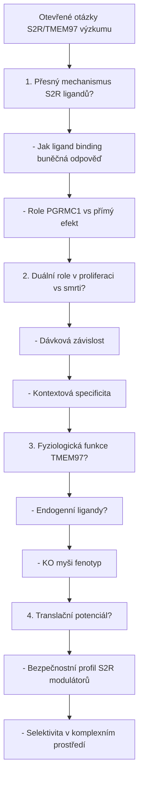

<details>
<summary>ASCII verze diagramu</summary>

```
Otevřené otázky S2R/TMEM97 výzkumu
┌─────────────────────────────────────────────────────┐
│                                                     │
│   1. Přesný mechanismus S2R ligandů?              │
│      - Jak ligand binding → buněčná odpověď       │
│      - Role PGRMC1 vs přímý efekt                 │
│                                                     │
│   2. Duální role v proliferaci vs smrti?          │
│      - Dávková závislost                           │
│      - Kontextová specificita                      │
│                                                     │
│   3. Fyziologická funkce TMEM97?                  │
│      - Endogenní ligandy?                          │
│      - KO myši fenotyp                            │
│                                                     │
│   4. Translační potenciál?                        │
│      - Bezpečnostní profil S2R modulátorů         │
│      - Selektivita v komplexním prostředí         │
│                                                     │
└─────────────────────────────────────────────────────┘
```

</details>

---

## Reference

1. Alon, A. et al. (2017). *Identification of the gene that codes for the σ2 receptor*. PNAS.
2. Riad, A. et al. (2018). *The sigma-2 receptor/TMEM97, PGRMC1, and LDL receptor complex are responsible for the cellular uptake of Aβ42 and its protein aggregates*. Molecular Neurobiology.
3. Yang, K. et al. (2020). *The TMEM97/sigma-2 receptor is a target for AD therapeutics*. Alzheimer's & Dementia.
4. Zeng, C. et al. (2017). *Sigma-2 receptor ligands as potential imaging probes and therapeutics for solid tumors*. Mol Imaging Biol.
5. Nicholson, H. et al. (2016). *Sigma-2 receptors play a role in cellular metabolism: stimulation of glycolytic hallmarks by CM764 in human tumour cell lines*. Journal of Pharmacological Sciences.

---

Viz také:
- [Sigma-1 receptor](@/receptors/sigma-1.md) - Sesterský receptor
- [DMT](@/alkaloids/dmt.md) - Sigma ligand
- [5-HT2A receptor](@/receptors/5-ht2a.md) - Psychedelický receptor
- [Glosář](@/glossary/_index.md) - Definice pojmů

<- Zpět na [Receptory](@/receptors/_index.md) | [TAAR1](@/receptors/taar1.md) ->
