+++
title = "TAAR1 receptor"
description = "Trace Amine-Associated Receptor 1 - modulátor monoaminové transmise a cíl psychostimulantů"
weight = 14
insert_anchor_links = "right"

[taxonomies]
categories = ["receptory", "TAAR", "GPCR"]
tags = ["TAAR1", "trace-aminy", "amfetamin", "dopamin", "schizofrenie", "závislost"]
+++

# TAAR1 receptor - Strážce monoaminové rovnováhy

**TAAR1** (Trace Amine-Associated Receptor 1) je **G-protein spřažený receptor** aktivovaný **stopovými aminy** (trace amines) a některými **psychostimulanty**. Funguje jako klíčový modulátor dopaminergní a serotoninergní neurotransmise. Představuje revoluční terapeutický cíl pro **schizofrenii**, **závislosti** a **metabolická onemocnění**.

---

## Základní charakteristika

### Klasifikace

| Vlastnost | Hodnota |
|-----------|---------|
| **Rodina** | G-protein spřažené receptory (GPCR) |
| **Podrodina** | Trace Amine-Associated Receptors (TAAR) |
| **Gen** | TAAR1 |
| **Chromozom** | 6q23.2 |
| **Délka** | 339 aminokyselin |
| **G-protein** | Gs (stimulační) |

### TAAR rodina

| Receptor | Exprese | Ligandy | Funkce |
|----------|---------|---------|--------|
| **TAAR1** | CNS, periferie | Trace aminy, psychostimulanty | Neuromodulace |
| **TAAR2** | Olfaktorní | Neznámé | Čich |
| **TAAR5** | Olfaktorní, CNS | Trimethylamin | Čich, sociální chování |
| **TAAR6** | Amygdala | Neznámé | Emoce? |
| **TAAR8** | Olfaktorní | Neznámé | Čich |
| **TAAR9** | Olfaktorní | Neznámé | Čich |

### Struktura

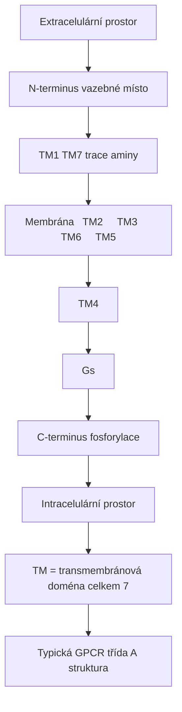

<details>
<summary>ASCII verze diagramu</summary>

```
                    Extracelulární prostor
                           │
    N-terminus ───┬────────┼────────┬─── vazebné místo
                  │   TM1  │  TM7   │   (trace aminy)
         ┌────────┼────────┼────────┼────────┐
Membrána │  TM2   │  TM3   │  TM6   │  TM5   │
         └────────┼────────┼────────┼────────┘
                  │   TM4  │        │
                  │        │   Gs   │
    C-terminus ───┴────────┴────────┴─── fosforylace
                    Intracelulární prostor

TM = transmembránová doména (celkem 7)
Typická GPCR třída A struktura
```

</details>

---

## Stopové aminy (Trace Amines)

### Endogenní ligandy

| Trace amin | Struktura | Biosyntéza | EC50 TAAR1 (nM) |
|------------|-----------|------------|-----------------|
| **β-Phenylethylamin (PEA)** | Bez OH | L-Phe → AADC | 100-300 |
| **p-Tyramin** | 4-OH | L-Tyr → AADC | 50-200 |
| **Tryptamin** | Indol | L-Trp → AADC | 200-500 |
| **Octopamin** | β-OH, 4-OH | Tyramin → DBH | 100-400 |
| **Synephrin** | β-OH, 4-OH, N-Me | Metabolit | 200-600 |

### Metabolismus stopových aminů

```mermaid
flowchart TD
    node_Biosyntzaadegradacet["Biosyntéza a degradace trace aminů"]
    node_BIOSYNTZA["BIOSYNTÉZA"]
    node_LPhenylalanin["L-Phenylalanin"]
    node_AADCaromatickLaminok["AADC aromatická L-aminokyselina"]
    node_dekarboxylza["dekarboxyláza"]
    node_PhenylethylaminPEA["β-Phenylethylamin PEA"]
    node_LTyrosin["L-Tyrosin"]
    node_AADC["AADC"]
    node_pTyramin["p-Tyramin"]
    node_DEGRADACE["DEGRADACE"]
    node_PEATyramin["PEA / Tyramin"]
    node_MAOBmonoaminoxidzaB["MAO-B monoamin oxidáza B"]
    node_FenylacetaldehydpHyd["Fenylacetaldehyd / p-Hydroxyfenylacetaldehyd"]
    node_ALDHaldehyddehydroge["ALDH aldehyd dehydrogenáza"]
    node_Fenyloctovkyselina["Fenyloctová kyselina"]
    node_Poloastraceamin30sek["Poločas trace aminů: ~30 sekund velmi rychlý"]
    node_Koncentracevmozkunan["Koncentrace v mozku: nanomolární vs µM pro DA"]

    node_Biosyntzaadegradacet --> node_BIOSYNTZA
    node_BIOSYNTZA --> node_LPhenylalanin
    node_LPhenylalanin --> node_AADCaromatickLaminok
    node_AADCaromatickLaminok --> node_dekarboxylza
    node_dekarboxylza --> node_PhenylethylaminPEA
    node_PhenylethylaminPEA --> node_LTyrosin
    node_LTyrosin --> node_AADC
    node_AADC --> node_pTyramin
    node_pTyramin --> node_DEGRADACE
    node_DEGRADACE --> node_PEATyramin
    node_PEATyramin --> node_MAOBmonoaminoxidzaB
    node_MAOBmonoaminoxidzaB --> node_FenylacetaldehydpHyd
    node_FenylacetaldehydpHyd --> node_ALDHaldehyddehydroge
    node_ALDHaldehyddehydroge --> node_Fenyloctovkyselina
    node_Fenyloctovkyselina --> node_Poloastraceamin30sek
    node_Poloastraceamin30sek --> node_Koncentracevmozkunan
```

<details>
<summary>ASCII verze diagramu</summary>

```
Biosyntéza a degradace trace aminů
┌─────────────────────────────────────────────────────┐
│                                                     │
│   BIOSYNTÉZA                                       │
│   ──────────                                       │
│   L-Phenylalanin                                   │
│        │                                            │
│        ↓ AADC (aromatická L-aminokyselina         │
│        │       dekarboxyláza)                      │
│        ↓                                            │
│   β-Phenylethylamin (PEA)                         │
│                                                     │
│   L-Tyrosin                                        │
│        │                                            │
│        ↓ AADC                                      │
│        ↓                                            │
│   p-Tyramin                                        │
│                                                     │
│   DEGRADACE                                        │
│   ─────────                                        │
│   PEA / Tyramin                                    │
│        │                                            │
│        ↓ MAO-B (monoamin oxidáza B)               │
│        ↓                                            │
│   Fenylacetaldehyd / p-Hydroxyfenylacetaldehyd    │
│        │                                            │
│        ↓ ALDH (aldehyd dehydrogenáza)             │
│        ↓                                            │
│   Fenyloctová kyselina                             │
│                                                     │
│   Poločas trace aminů: ~30 sekund (velmi rychlý)  │
│   Koncentrace v mozku: nanomolární (vs µM pro DA) │
│                                                     │
└─────────────────────────────────────────────────────┘
```

</details>

### "Neuromodulátory vs neurotransmitery"

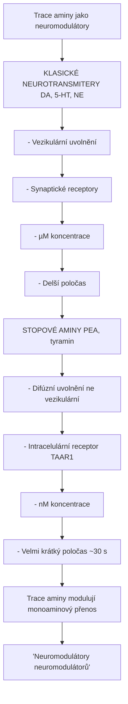

<details>
<summary>ASCII verze diagramu</summary>

```
Trace aminy jako neuromodulátory
┌─────────────────────────────────────────────────────┐
│                                                     │
│   KLASICKÉ NEUROTRANSMITERY (DA, 5-HT, NE)        │
│   ────────────────────────────────────────         │
│   - Vezikulární uvolnění                           │
│   - Synaptické receptory                           │
│   - µM koncentrace                                 │
│   - Delší poločas                                  │
│                                                     │
│   STOPOVÉ AMINY (PEA, tyramin)                    │
│   ────────────────────────────                     │
│   - Difúzní uvolnění (ne vezikulární)             │
│   - Intracelulární receptor (TAAR1)               │
│   - nM koncentrace                                 │
│   - Velmi krátký poločas (~30 s)                  │
│                                                     │
│   → Trace aminy modulují monoaminový přenos       │
│   → "Neuromodulátory neuromodulátorů"             │
│                                                     │
└─────────────────────────────────────────────────────┘
```

</details>

---

## Distribuce

### CNS exprese

| Oblast | Exprese | Funkce |
|--------|---------|--------|
| **VTA** | Vysoká | DA neuronová regulace |
| **Substantia nigra** | Vysoká | DA neuronová regulace |
| **Locus coeruleus** | Střední | NE modulace |
| **Raphe nuclei** | Střední | 5-HT modulace |
| **Striatum** | Nízká (presynapticky) | Modulace uvolnění |
| **Prefrontální kortex** | Nízká | Kognice |
| **Amygdala** | Střední | Emoce |

### Subcelulární lokalizace

```mermaid
flowchart TD
    node_TAAR1lokalizaceUnikt["TAAR1 lokalizace - Unikátní vlastnost"]
    node_TYPICKGPCRD25HT2A["TYPICKÉ GPCR D2, 5-HT2A"]
    node_Plazmatickmembrna["Plazmatická membrána"]
    node_Extracelulrnligandy["Extracelulární ligandy"]
    node_TAAR1ATYPICKLOKALIZA["TAAR1 - ATYPICKÁ LOKALIZACE"]
    node_PrimrnINTRACELULRN["Primárně INTRACELULÁRNÍ"]
    node_ERcytoplazma["ER, cytoplazma"]
    node_stenplazmatickmembrn["Částečně plazmatická membrána"]
    node_Dsledek["Důsledek:"]
    node_Traceaminyjsoulipofl["- Trace aminy jsou lipofílní  vstup do buňky"]
    node_AktivaceTAAR1zevnit["- Aktivace TAAR1 zevnitř"]
    node_Amfetaminyvstupujpes["- Amfetaminy vstupují přes DAT  TAAR1 aktivace"]
    node_Extracelulrn["Extracelulární"]
    node_Lipoflnamin["Lipofílní amin"]
    node_Membrna["Membrána"]
    node_TAAR1["TAAR1"]
    node_intracelul["intracelul."]
    node_Cytoplazma["Cytoplazma"]

    node_TAAR1lokalizaceUnikt --> node_TYPICKGPCRD25HT2A
    node_TYPICKGPCRD25HT2A --> node_Plazmatickmembrna
    node_Plazmatickmembrna --> node_Extracelulrnligandy
    node_Extracelulrnligandy --> node_TAAR1ATYPICKLOKALIZA
    node_TAAR1ATYPICKLOKALIZA --> node_PrimrnINTRACELULRN
    node_PrimrnINTRACELULRN --> node_ERcytoplazma
    node_ERcytoplazma --> node_stenplazmatickmembrn
    node_stenplazmatickmembrn --> node_Dsledek
    node_Dsledek --> node_Traceaminyjsoulipofl
    node_Traceaminyjsoulipofl --> node_AktivaceTAAR1zevnit
    node_AktivaceTAAR1zevnit --> node_Amfetaminyvstupujpes
    node_Amfetaminyvstupujpes --> node_Extracelulrn
    node_Extracelulrn --> node_Lipoflnamin
    node_Lipoflnamin --> node_Membrna
    node_Membrna --> node_TAAR1
    node_TAAR1 --> node_intracelul
    node_intracelul --> node_Cytoplazma
```

<details>
<summary>ASCII verze diagramu</summary>

```
TAAR1 lokalizace - Unikátní vlastnost
┌─────────────────────────────────────────────────────┐
│                                                     │
│   TYPICKÉ GPCR (D2, 5-HT2A)                       │
│   ─────────────────────────                        │
│   → Plazmatická membrána                           │
│   → Extracelulární ligandy                         │
│                                                     │
│   TAAR1 - ATYPICKÁ LOKALIZACE                     │
│   ────────────────────────────                     │
│   → Primárně INTRACELULÁRNÍ                       │
│     (ER, cytoplazma)                               │
│   → Částečně plazmatická membrána                 │
│                                                     │
│   Důsledek:                                         │
│   - Trace aminy jsou lipofílní → vstup do buňky   │
│   - Aktivace TAAR1 zevnitř                         │
│   - Amfetaminy vstupují přes DAT → TAAR1 aktivace │
│                                                     │
│   ┌─────────────────────────┐                      │
│   │     Extracelulární      │                      │
│   │          ↓              │                      │
│   │   [Lipofílní amin]     │                      │
│   │          ↓              │                      │
│   │ ─────Membrána──────     │                      │
│   │          ↓              │                      │
│   │   ┌──────────────┐      │                      │
│   │   │   TAAR1      │      │                      │
│   │   │ (intracelul.)│      │                      │
│   │   └──────────────┘      │                      │
│   │     Cytoplazma          │                      │
│   └─────────────────────────┘                      │
│                                                     │
└─────────────────────────────────────────────────────┘
```

</details>

---

## Signální dráhy

### Primární kaskáda (Gs)

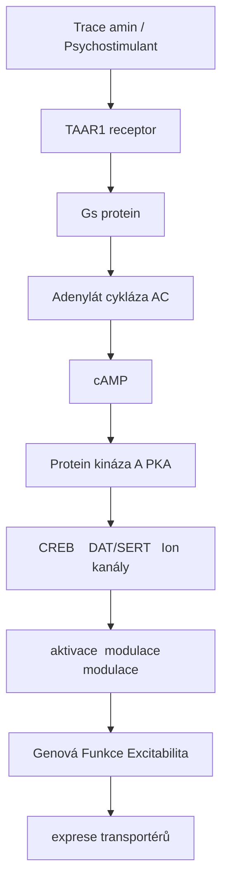

<details>
<summary>ASCII verze diagramu</summary>

```
Trace amin / Psychostimulant
           ↓
       TAAR1 receptor
           ↓
        Gs protein
           ↓
    Adenylát cykláza (AC)
           ↓
        ↑ cAMP
           ↓
    Protein kináza A (PKA)
           ↓
┌──────────┼──────────┐
↓          ↓          ↓
CREB    DAT/SERT   Ion kanály
aktivace  modulace   modulace
    │          │          │
    ↓          ↓          ↓
Genová   ↓ Funkce    Excitabilita
exprese  transportérů
```

</details>

### Modulace DAT (Dopamine Transporter)

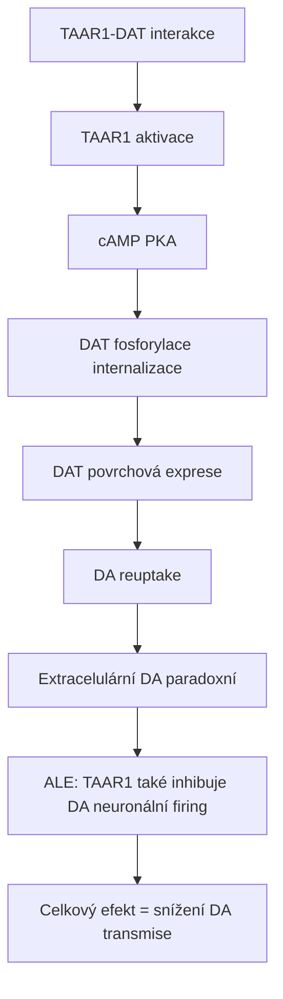

<details>
<summary>ASCII verze diagramu</summary>

```
TAAR1-DAT interakce
┌─────────────────────────────────────────────────────┐
│                                                     │
│   TAAR1 aktivace                                   │
│        │                                            │
│        ↓                                            │
│   ↑ cAMP → ↑ PKA                                  │
│        │                                            │
│        ↓                                            │
│   DAT fosforylace (internalizace)                 │
│        │                                            │
│        ↓                                            │
│   ↓ DAT povrchová exprese                         │
│        │                                            │
│        ↓                                            │
│   ↓ DA reuptake                                   │
│        │                                            │
│        ↓                                            │
│   ↑ Extracelulární DA (paradoxní)                 │
│                                                     │
│   ALE: TAAR1 také inhibuje DA neuronální firing   │
│        → Celkový efekt = snížení DA transmise     │
│                                                     │
└─────────────────────────────────────────────────────┘
```

</details>

### Regulace DA neuronů

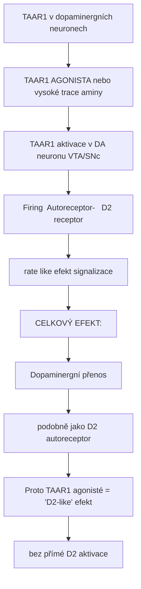

<details>
<summary>ASCII verze diagramu</summary>

```
TAAR1 v dopaminergních neuronech
┌─────────────────────────────────────────────────────┐
│                                                     │
│   TAAR1 AGONISTA (nebo vysoké trace aminy)        │
│              │                                      │
│              ↓                                      │
│   TAAR1 aktivace v DA neuronu (VTA/SNc)           │
│              │                                      │
│   ┌──────────┼──────────┐                          │
│   ↓          ↓          ↓                          │
│                                                     │
│ ↓ Firing  Autoreceptor-  ↑ D2 receptor           │
│   rate    like efekt     signalizace              │
│                                                     │
│   CELKOVÝ EFEKT:                                   │
│   ─────────────                                    │
│   ↓ Dopaminergní přenos                           │
│   (podobně jako D2 autoreceptor)                  │
│                                                     │
│   Proto TAAR1 agonisté = "D2-like" efekt          │
│   bez přímé D2 aktivace                           │
│                                                     │
└─────────────────────────────────────────────────────┘
```

</details>

---

## Farmakologie

### TAAR1 agonisté

| Látka | EC50 (nM) | Selektivita | Použití |
|-------|-----------|-------------|---------|
| **Amfetamin** | 200-500 | Neselektivní | Psychostimulant |
| **Metamfetamin** | 100-300 | Neselektivní | Psychostimulant |
| **MDMA** | 300-600 | Neselektivní | Psychostimulant |
| **Ulotaront (SEP-363856)** | 10-50 | Selektivní | Schizofrenie (schváleno 2024) |
| **Ralmitaront (RO6889450)** | 5-20 | Selektivní | Schizofrenie (fáze II) |
| **RO5166017** | 10-30 | Selektivní | Výzkum |
| **RO5263397** | 2-10 | Selektivní | Výzkum |

### TAAR1 antagonisté

| Látka | Použití |
|-------|---------|
| **EPPTB** | Výzkum |
| **RO5212773** | Výzkum (parciální agonista) |

### Psychostimulanty a TAAR1

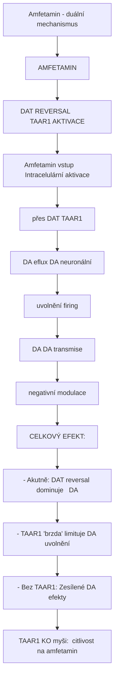

<details>
<summary>ASCII verze diagramu</summary>

```
Amfetamin - duální mechanismus
┌─────────────────────────────────────────────────────┐
│                                                     │
│   AMFETAMIN                                        │
│        │                                            │
│   ┌────┴────────────────────┐                      │
│   ↓                         ↓                      │
│                                                     │
│ DAT REVERSAL             TAAR1 AKTIVACE           │
│ ───────────             ───────────────           │
│                                                     │
│ Amfetamin vstup         Intracelulární aktivace   │
│ přes DAT                TAAR1                      │
│      │                       │                     │
│      ↓                       ↓                     │
│ DA eflux                ↓ DA neuronální           │
│ (uvolnění)              firing                    │
│      │                       │                     │
│      ↓                       ↓                     │
│ ↑↑↑ DA                  ↓ DA transmise           │
│                         (negativní modulace)      │
│                                                     │
│   CELKOVÝ EFEKT:                                   │
│   - Akutně: DAT reversal dominuje → ↑↑↑ DA       │
│   - TAAR1 "brzda" limituje DA uvolnění           │
│   - Bez TAAR1: Zesílené DA efekty                │
│                                                     │
│   TAAR1 KO myši: ↑ citlivost na amfetamin        │
│                                                     │
└─────────────────────────────────────────────────────┘
```

</details>

---

## Klinické aplikace

### Schizofrenie - Ulotaront

```mermaid
flowchart TD
    node_UlotarontSEP363856No["Ulotaront SEP-363856 - Nový mechanismus"]
    node_ULOTARONTTAAR15HT1Aa["ULOTARONT TAAR1 + 5-HT1A agonista"]
    node_Mechanismus["Mechanismus:"]
    node_TAAR1agonismusDAtran["- TAAR1 agonismus   DA transmise"]
    node_5HT1Aagonismusanxiol["- 5-HT1A agonismus  anxiolýza"]
    node_BezpmD2blokdy["- Bez přímé D2 blokády!"]
    node_VhodyoprotiD2antagon["Výhody oproti D2 antagonistům:"]
    node_BezEPSextrapyramidov["✓ Bez EPS extrapyramidových symptomů"]
    node_Bezprolaktinmie["✓ Bez prolaktinémie"]
    node_BezmetabolickchN["✓ Bez metabolických NÚ?"]
    node_Potencilnlepnegativn["✓ Potenciálně lepší negativní symptomy"]
    node_Klinickvvoj["Klinický vývoj:"]
    node_FzeIIPozitivn2020["- Fáze II: Pozitivní 2020"]
    node_FzeIIIDIAMOND12pozit["- Fáze III: DIAMOND 1 & 2 pozitivní 2024"]
    node_FDAschvlen2024Entera["- FDA schválení: 2024 Enteract"]
    node_Revolucevantipsychot["'Revoluce v antipsychotické léčbě'"]
    node_PrvnnonD2antipsychot["- První non-D2 antipsychotikum od objevu"]
    node_chlorpromazinu1952["chlorpromazinu 1952"]

    node_UlotarontSEP363856No --> node_ULOTARONTTAAR15HT1Aa
    node_ULOTARONTTAAR15HT1Aa --> node_Mechanismus
    node_Mechanismus --> node_TAAR1agonismusDAtran
    node_TAAR1agonismusDAtran --> node_5HT1Aagonismusanxiol
    node_5HT1Aagonismusanxiol --> node_BezpmD2blokdy
    node_BezpmD2blokdy --> node_VhodyoprotiD2antagon
    node_VhodyoprotiD2antagon --> node_BezEPSextrapyramidov
    node_BezEPSextrapyramidov --> node_Bezprolaktinmie
    node_Bezprolaktinmie --> node_BezmetabolickchN
    node_BezmetabolickchN --> node_Potencilnlepnegativn
    node_Potencilnlepnegativn --> node_Klinickvvoj
    node_Klinickvvoj --> node_FzeIIPozitivn2020
    node_FzeIIPozitivn2020 --> node_FzeIIIDIAMOND12pozit
    node_FzeIIIDIAMOND12pozit --> node_FDAschvlen2024Entera
    node_FDAschvlen2024Entera --> node_Revolucevantipsychot
    node_Revolucevantipsychot --> node_PrvnnonD2antipsychot
    node_PrvnnonD2antipsychot --> node_chlorpromazinu1952
```

<details>
<summary>ASCII verze diagramu</summary>

```
Ulotaront (SEP-363856) - Nový mechanismus
┌─────────────────────────────────────────────────────┐
│                                                     │
│   ULOTARONT (TAAR1 + 5-HT1A agonista)             │
│   ─────────────────────────────────────           │
│                                                     │
│   Mechanismus:                                      │
│   - TAAR1 agonismus → ↓ DA transmise             │
│   - 5-HT1A agonismus → anxiolýza                  │
│   - Bez přímé D2 blokády!                         │
│                                                     │
│   Výhody oproti D2 antagonistům:                  │
│   ──────────────────────────────                  │
│   ✓ Bez EPS (extrapyramidových symptomů)         │
│   ✓ Bez prolaktinémie                             │
│   ✓ Bez metabolických NÚ?                         │
│   ✓ Potenciálně lepší negativní symptomy          │
│                                                     │
│   Klinický vývoj:                                   │
│   - Fáze II: Pozitivní (2020)                     │
│   - Fáze III: DIAMOND 1 & 2 pozitivní (2024)     │
│   - FDA schválení: 2024 (Enteract)               │
│                                                     │
│   "Revoluce v antipsychotické léčbě"              │
│   - První non-D2 antipsychotikum od objevu        │
│     chlorpromazinu (1952)                          │
│                                                     │
└─────────────────────────────────────────────────────┘
```

</details>

### Závislosti

```mermaid
flowchart TD
    node_TAAR1vlbzvislost["TAAR1 v léčbě závislostí"]
    node_Hypotza["Hypotéza:"]
    node_TAAR1agonistmohousni["TAAR1 agonisté mohou snížit účinky"]
    node_psychostimulantbezbl["psychostimulantů bez blokády D2"]
    node_Preklinickevidence["Preklinická evidence:"]
    node_TAAR1agonist["TAAR1 agonisté:"]
    node_Kokainovselfadminist["-  Kokainová self-administrace"]
    node_Metamfetamineminduko["-  Metamfetaminem indukovaná hyperaktivita"]
    node_Relapsvmodelech["-  Relaps v modelech"]
    node_Wantingbezovlivnnlik["-  'Wanting' bez ovlivnění 'liking'"]
    node_TAAR1KOmyi["TAAR1 KO myši:"]
    node_Citlivostnapsychosti["-  Citlivost na psychostimulanty"]
    node_Selfadministrace["-  Self-administrace"]
    node_Klinickpotencil["Klinický potenciál:"]
    node_Kokainovzvislost["- Kokainová závislost"]
    node_Metamfetaminovzvislo["- Metamfetaminová závislost"]
    node_Alkoholovzvislost["- Alkoholová závislost?"]

    node_TAAR1vlbzvislost --> node_Hypotza
    node_Hypotza --> node_TAAR1agonistmohousni
    node_TAAR1agonistmohousni --> node_psychostimulantbezbl
    node_psychostimulantbezbl --> node_Preklinickevidence
    node_Preklinickevidence --> node_TAAR1agonist
    node_TAAR1agonist --> node_Kokainovselfadminist
    node_Kokainovselfadminist --> node_Metamfetamineminduko
    node_Metamfetamineminduko --> node_Relapsvmodelech
    node_Relapsvmodelech --> node_Wantingbezovlivnnlik
    node_Wantingbezovlivnnlik --> node_TAAR1KOmyi
    node_TAAR1KOmyi --> node_Citlivostnapsychosti
    node_Citlivostnapsychosti --> node_Selfadministrace
    node_Selfadministrace --> node_Klinickpotencil
    node_Klinickpotencil --> node_Kokainovzvislost
    node_Kokainovzvislost --> node_Metamfetaminovzvislo
    node_Metamfetaminovzvislo --> node_Alkoholovzvislost
```

<details>
<summary>ASCII verze diagramu</summary>

```
TAAR1 v léčbě závislostí
┌─────────────────────────────────────────────────────┐
│                                                     │
│   Hypotéza:                                        │
│   ─────────                                        │
│   TAAR1 agonisté mohou snížit účinky               │
│   psychostimulantů bez blokády D2                  │
│                                                     │
│   Preklinická evidence:                             │
│   ─────────────────────                            │
│   TAAR1 agonisté:                                  │
│   - ↓ Kokainová self-administrace                 │
│   - ↓ Metamfetaminem indukovaná hyperaktivita    │
│   - ↓ Relaps v modelech                           │
│   - ↓ "Wanting" bez ovlivnění "liking"           │
│                                                     │
│   TAAR1 KO myši:                                   │
│   - ↑ Citlivost na psychostimulanty              │
│   - ↑ Self-administrace                           │
│                                                     │
│   Klinický potenciál:                              │
│   ─────────────────                                │
│   - Kokainová závislost                            │
│   - Metamfetaminová závislost                      │
│   - Alkoholová závislost?                          │
│                                                     │
└─────────────────────────────────────────────────────┘
```

</details>

### Metabolická onemocnění

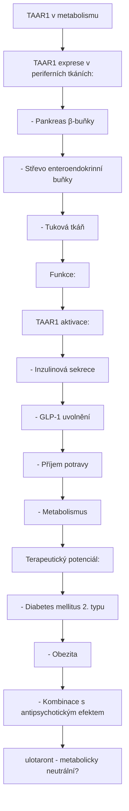

<details>
<summary>ASCII verze diagramu</summary>

```
TAAR1 v metabolismu
┌─────────────────────────────────────────────────────┐
│                                                     │
│   TAAR1 exprese v periferních tkáních:            │
│   ──────────────────────────────────              │
│   - Pankreas (β-buňky)                             │
│   - Střevo (enteroendokrinní buňky)               │
│   - Tuková tkáň                                    │
│                                                     │
│   Funkce:                                          │
│   ────────                                         │
│   TAAR1 aktivace:                                  │
│   - ↑ Inzulinová sekrece                          │
│   - ↑ GLP-1 uvolnění                              │
│   - ↓ Příjem potravy                              │
│   - ↑ Metabolismus                                │
│                                                     │
│   Terapeutický potenciál:                          │
│   ─────────────────────                            │
│   - Diabetes mellitus 2. typu                     │
│   - Obezita                                        │
│   - Kombinace s antipsychotickým efektem          │
│     (ulotaront - metabolicky neutrální?)          │
│                                                     │
└─────────────────────────────────────────────────────┘
```

</details>

---

## Genetické varianty

### Polymorfismy TAAR1

| Varianta | Efekt | Asociace |
|----------|-------|----------|
| **rs8192619 (C182F)** | ↓ funkce | Schizofrenie? |
| **rs2842899** | Promotor | Bipolární porucha |
| **Různé SNP** | Variabilní | Závislostní chování |

### Farmakogenetické implikace

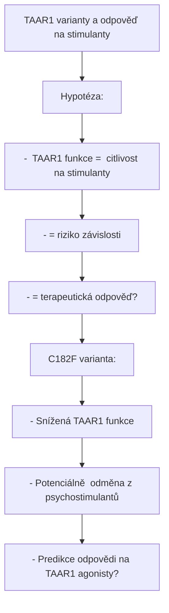

<details>
<summary>ASCII verze diagramu</summary>

```
TAAR1 varianty a odpověď na stimulanty
┌─────────────────────────────────────────────────────┐
│                                                     │
│   Hypotéza:                                        │
│   ─────────                                        │
│   - ↓ TAAR1 funkce = ↑ citlivost na stimulanty   │
│   - = ↑ riziko závislosti                         │
│   - = ↑ terapeutická odpověď?                     │
│                                                     │
│   C182F varianta:                                  │
│   ───────────────                                  │
│   - Snížená TAAR1 funkce                          │
│   - Potenciálně ↑ odměna z psychostimulantů      │
│   - Predikce odpovědi na TAAR1 agonisty?         │
│                                                     │
└─────────────────────────────────────────────────────┘
```

</details>

---

## Srovnání TAAR1 vs D2 terapie

| Aspekt | D2 antagonisté | **TAAR1 agonisté** |
|--------|----------------|---------------------|
| **Mechanismus** | D2 blokáda | Modulace DA neuronu |
| **Pozitivní symptomy** | +++ | ++ |
| **Negativní symptomy** | +/- | ++? |
| **EPS** | +++ | - |
| **Prolaktin** | ↑↑ | - |
| **Metabolické NÚ** | + až +++ | -/? |
| **Kognice** | 0 až - | +? |

---

## Reference

1. Gainetdinov, R.R. et al. (2018). *Trace Amines and Their Receptors*. Pharmacological Reviews.
2. Revel, F.G. et al. (2011). *TAAR1 activation modulates monoaminergic neurotransmission*. Neuropsychopharmacology.
3. Koblan, K.S. et al. (2020). *A Non–D2-Receptor-Binding Drug for the Treatment of Schizophrenia*. N Engl J Med.
4. Berry, M.D. et al. (2017). *Pharmacology of human trace amine-associated receptors*. Biochemical Journal.
5. Dedic, N. et al. (2021). *SEP-363856, a Novel Psychotropic Agent with a Unique, Non-D2 Receptor Mechanism of Action*. J Pharmacol Exp Ther.

---

Viz také:
- [D2 receptor](@/receptors/d2.md) - Tradiční antipsychotický cíl
- [D1 receptor](@/receptors/d1.md) - Dopaminový receptor
- [5-HT1A receptor](@/receptors/5-ht1a.md) - 5-HT1A komponenta ulotarontu
- [Glosář](@/glossary/_index.md) - Definice pojmů

<- Zpět na [Receptory](@/receptors/_index.md)
