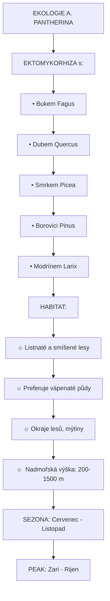
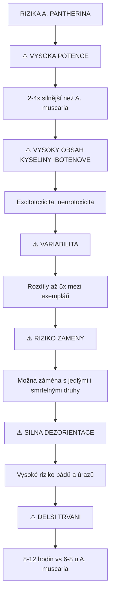
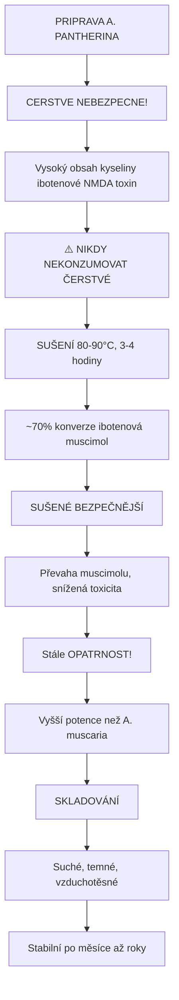

+++
title = "Amanita pantherina"
description = "Muchomurka tygrovaná - silnejsi varianta muchomurky cervene s vyssim obsahem kyseliny ibotenove a muscimolu"
weight = 11
insert_anchor_links = "right"

[taxonomies]
kategorie = ["houby", "GABAergni", "psychoaktivni"]
aktivni_latky = ["muscimol", "kyselina-ibotenova"]
receptory = ["GABA-A", "NMDA"]
+++

# Amanita pantherina - Muchomurka tygrovana


---

## Zakladni informace

| Parametr | Hodnota |
|----------|---------|
| **Latinsky nazev** | Amanita pantherina (DC.) Krombh. |
| **Ceske nazvy** | Muchomurka tygrovana, Pardali muchomurka |
| **Celed** | Amanitaceae |
| **Rod** | Amanita (Muchomurky) |
| **Typ psychoaktivity** | GABAergni (disociativni/deliriantni) |
| **Relativni potence** | 2-4x silnejsi nez A. muscaria |

---

## Identifikace

### Makroskopicke znaky

```mermaid
flowchart TD
    node_AMANITAPANTHERINAVZH["AMANITA PANTHERINA - VZHLED"]
    node_157e2e95["/  ●    ●    ●    \"]
    node_BILESKVRNYKlobouk512["/    BILE SKVRNY     \        Klobouk: 5-12 cm"]
    node_nahnedemBarvaHnedaaz["/      na hnedem       \       Barva: Hneda az sedo-hneda"]
    node_povrchuBilebradavkyz["/        povrchu         \      Bile bradavky zbytky vela"]
    node_LupenyBilevolne["Lupeny: Bile, volne"]
    node_PRSTENPrstenBlanityh["PRSTEN                Prsten: Blanity, hladky"]
    node_isiciDULEZITEHladkyo["isici,              DULEZITE: Hladky okraj"]
    node_hladkyuAmuscariaryho["hladky              u A. muscaria ryhovany"]
    node_TrenBily615cm["Tren: Bily, 6-15 cm"]
    node_BULVABulvaOkrajovana["BULVA                Bulva: Okrajovana"]
    node_okrajovana13zretelne["okrajovana            1-3 zretelne okraje"]
    node_olvaoprotiAmuscaria["olva                oproti A. muscaria"]

    node_AMANITAPANTHERINAVZH --> node_157e2e95
    node_157e2e95 --> node_BILESKVRNYKlobouk512
    node_BILESKVRNYKlobouk512 --> node_nahnedemBarvaHnedaaz
    node_nahnedemBarvaHnedaaz --> node_povrchuBilebradavkyz
    node_povrchuBilebradavkyz --> node_LupenyBilevolne
    node_LupenyBilevolne --> node_PRSTENPrstenBlanityh
    node_PRSTENPrstenBlanityh --> node_isiciDULEZITEHladkyo
    node_isiciDULEZITEHladkyo --> node_hladkyuAmuscariaryho
    node_hladkyuAmuscariaryho --> node_TrenBily615cm
    node_TrenBily615cm --> node_BULVABulvaOkrajovana
    node_BULVABulvaOkrajovana --> node_okrajovana13zretelne
    node_okrajovana13zretelne --> node_olvaoprotiAmuscaria

    click node_hladkyuAmuscariaryho "/shrooms/amanita-muscaria/" "hladky              u A. muscaria ryhovany"
    click node_olvaoprotiAmuscaria "/shrooms/amanita-muscaria/" "olva                oproti A. muscaria"
```



<details>
<summary>ASCII verze diagramu</summary>

```
    AMANITA PANTHERINA - VZHLED

                    ┌─────────────────┐
                   /  ●    ●    ●    \
                  /    BILE SKVRNY     \        Klobouk: 5-12 cm
                 /      na hnedem       \       Barva: Hneda az sedo-hneda
                /        povrchu         \      Bile bradavky (zbytky vela)
               └──────────────────────────┘
                           │
                           │  Lupeny: Bile, volne
                           │
                    ┌──────┴──────┐
                    │  PRSTEN     │           Prsten: Blanity, hladky
                    │  (visici,   │           DULEZITE: Hladky okraj
                    │   hladky)   │           (u A. muscaria ryhovany)
                    └──────┬──────┘
                           │
                           │  Tren: Bily, 6-15 cm
                           │
                    ┌──────┴──────┐
                    │   BULVA     │           Bulva: Okrajovana
                    │ (okrajovana │           1-3 zretelne okraje
                    │  volva)     │           (oproti A. muscaria)
                    └─────────────┘
```

</details>

### Detailni popis

| Znak | Popis | Diagnosticky vyznam |
|------|-------|---------------------|
| **Klobouk** | 5-12 cm, zprvu kulovity, pozdeji ploche rozlozeny | Mensi nez A. muscaria |
| **Barva klobouku** | Hneda, olivove-hneda, sedo-hneda | **KLICOVE** - odlisuje od A. muscaria |
| **Povrch** | Bile bradavicnate skvrny, snadno smyvatelne | Zbytky velum universale |
| **Okraj klobouku** | Radialne ryhovany (u zralych plodozel) | |
| **Lupeny** | Bile, volne, huste | Nemeni barvu |
| **Tren** | 6-15 cm, bily, k bazi ztlustly | |
| **Prsten** | Blanity, visici, **HLADKY** okraj | **KLICOVE** pro odliseni |
| **Volva** | Okrajovana (s 1-3 kruhy) | |
| **Vytruse** | Bile, siroke elipticke, 10-12 x 7-8 um | |
| **Zápach** | Slaby, nezretelny | |
| **Chut** | Mirne sladka (NEOCHUNAVAT) | |

### Rozlisovaci znaky od A. muscaria

```mermaid
flowchart TD
    node_APANTHERINAvsAMUSCAR["A. PANTHERINA vs A. MUSCARIA"]
    node_APANTHERINAAMUSCARIA["A. PANTHERINA                 A. MUSCARIA"]
    node_TygrovanaCervena["Tygrovana                   Cervena"]
    node_KLOBOUKKLOBOUK["KLOBOUK:                    KLOBOUK:"]
    node_51935b22["████████████████            ████████████████"]
    node_HNEDYCERVENY["HNEDY                       CERVENY"]
    node_PRSTENPRSTEN["PRSTEN:                     PRSTEN:"]
    node_36f90298["≈≈≈≈≈≈≈≈≈≈≈≈"]
    node_HLADKYokrajRYHOVANYo["HLADKY okraj                RYHOVANY okraj"]
    node_VOLVAVOLVA["VOLVA:                      VOLVA:"]
    node_f2072e58["~~~~~~~~"]
    node_OKRAJOVANASUPINOVITA["OKRAJOVANA                  SUPINOVITA"]
    node_13kruhyrozpadla["1-3 kruhy                 rozpadla"]
    node_POTENCEPOTENCE["POTENCE:                    POTENCE:"]
    node_4cb7ab33["████████████████████        ██████████"]
    node_24xSILNEJSISTANDARDN["2-4x SILNEJSI               STANDARDNI"]

    node_APANTHERINAvsAMUSCAR --> node_APANTHERINAAMUSCARIA
    node_APANTHERINAAMUSCARIA --> node_TygrovanaCervena
    node_TygrovanaCervena --> node_KLOBOUKKLOBOUK
    node_KLOBOUKKLOBOUK --> node_51935b22
    node_51935b22 --> node_HNEDYCERVENY
    node_HNEDYCERVENY --> node_PRSTENPRSTEN
    node_PRSTENPRSTEN --> node_36f90298
    node_36f90298 --> node_HLADKYokrajRYHOVANYo
    node_HLADKYokrajRYHOVANYo --> node_VOLVAVOLVA
    node_VOLVAVOLVA --> node_f2072e58
    node_f2072e58 --> node_OKRAJOVANASUPINOVITA
    node_OKRAJOVANASUPINOVITA --> node_13kruhyrozpadla
    node_13kruhyrozpadla --> node_POTENCEPOTENCE
    node_POTENCEPOTENCE --> node_4cb7ab33
    node_4cb7ab33 --> node_24xSILNEJSISTANDARDN

    click node_APANTHERINAvsAMUSCAR "/shrooms/amanita-muscaria/" "A. PANTHERINA vs A. MUSCARIA"
    click node_APANTHERINAAMUSCARIA "/shrooms/amanita-muscaria/" "A. PANTHERINA                 A. MUSCARIA"
```



<details>
<summary>ASCII verze diagramu</summary>

```
    A. PANTHERINA vs A. MUSCARIA

    ┌────────────────────────────┬────────────────────────────┐
    │    A. PANTHERINA           │      A. MUSCARIA           │
    │    (Tygrovana)             │      (Cervena)             │
    ├────────────────────────────┼────────────────────────────┤
    │                            │                            │
    │    KLOBOUK:                │    KLOBOUK:                │
    │    ████████████████        │    ████████████████        │
    │    HNEDY                   │    CERVENY                 │
    │                            │                            │
    │    PRSTEN:                 │    PRSTEN:                 │
    │    ════════════            │    ≈≈≈≈≈≈≈≈≈≈≈≈            │
    │    HLADKY okraj            │    RYHOVANY okraj          │
    │                            │                            │
    │    VOLVA:                  │    VOLVA:                  │
    │    ═══════════             │    ~~~~~~~~                │
    │    OKRAJOVANA              │    SUPINOVITA              │
    │    (1-3 kruhy)             │    (rozpadla)              │
    │                            │                            │
    │    POTENCE:                │    POTENCE:                │
    │    ████████████████████    │    ██████████              │
    │    2-4x SILNEJSI           │    STANDARDNI              │
    │                            │                            │
    └────────────────────────────┴────────────────────────────┘
```

</details>

### Mozne zameny

| Druh | Odliseni | Nebezpeci |
|------|----------|-----------|
| **A. muscaria** (Cervena) | Cerveny klobouk, ryhovany prsten | Psychoaktivni, mene potentni |
| **A. rubescens** (Ruzovejici) | Ruzovi pri poskozeni, ryhovany prsten | Jedla (varena) |
| **A. spissa** (Sirokoplasta) | Sedohneda, bulva bez okraju | Jedla |
| **A. phalloides** (Zelena) | Zelenozluta, sackovita volva | **SMRTELNA** |
| **A. excelsa** | Seda, bez tetrnek na klobouku | Jedla |

**VAROVANI**: Zamena s Amanita phalloides muze byt **SMRTELNA**! Pri nejistote NIKDY nekonzumovat.

---

## Chemie a alkaloidy

### Obsah aktivnich latek

| Latka | Obsah (susena) | Srovnani s A. muscaria |
|-------|----------------|------------------------|
| [**Kyselina ibotenova**](@/neurotoxins/ibotenic-acid.md) | 0,1-0,25% | **2-3x vyssi** |
| Muscazon | Trace | Podobny |

### Celkovy alkaloidovy obsah

```
    SROVNANI ALKALOIDOVEHO OBSAHU

    Kyselina ibotenova + Muscimol (susena houba):

    A. MUSCARIA:
    ████████████████████  0,1-0,2% celkem

    A. PANTHERINA:
    ████████████████████████████████████████  0,2-0,45% celkem
                                          2-3x VICE

    ⚠️ VYSSI OBSAH = VYSSI RIZIKO
    ⚠️ Davkovani musi byt proporcionalne SNIZENO
```

### Variabilita obsahu

| Faktor | Vliv na obsah |
|--------|---------------|
| **Cast houby** | Klobouk >> Tren |
| **Zralost** | Mlade > Prezrale |
| **Priprava** | Suseni zvysuje muscimol/ibotenova pomer |
| **Lokalita** | Vyrazne regionalni rozdily |
| **Sezona** | Podzim typicky vyssi obsah |
| **Ekologicke podminky** | Stres moze zvysit |

---

## Historie a etnobotanika

### Tradicni pouziti

Na rozdil od [A. muscaria](@/shrooms/amanita-muscaria.md), **A. pantherina** nema tak bohate zdokumentovanou historii tradicniho pouziti:

| Aspekt | Popis |
|--------|-------|
| **Dokumentace** | Omezena, vetsi opatrnost pro vyssi potenci |
| **Sibirske tradice** | Pravdepodobne pouzivana spolu s A. muscaria |
| **Evropska tradice** | Historicky povazovana predevsim za jedovatou |
| **Moderni pouziti** | Omezene, predevsim psychonautske komunity |

### Etymologie nazvu

- **Pantherina** - odvozeno od latinského "panthera" (levhart/panter)
- Odkazuje na "skvrnity" vzhled klobouku pripominajici skvrnity kozisin

---

## Rozsireni

### Globalni distribuce

| Region | Biotop | Sezona |
|--------|--------|--------|
| **Stredni Evropa** | Listnaté a smisene lesy | VII-XI |
| **Jizni Evropa** | Bukové lesy | VIII-X |
| **Zapadni Evropa** | Smisene lesy | VII-X |
| **Severni Amerika** | Jehlicnate lesy (zapad) | VIII-XI |
| **Asie** | Temperátni lesy | VII-X |

### Ekologie



<details>
<summary>ASCII verze diagramu</summary>

```
    EKOLOGIE A. PANTHERINA

    EKTOMYKORHIZA s:
    • Bukem (Fagus)
    • Dubem (Quercus)
    • Smrkem (Picea)
    • Borovici (Pinus)
    • Modrínem (Larix)

    HABITAT:
    ┌─────────────────────────────────────────┐
    │                                          │
    │    ☼  Listnaté a smíšené lesy           │
    │    ☼  Preferuje vápenaté půdy           │
    │    ☼  Okraje lesů, mýtiny               │
    │    ☼  Nadmořská výška: 200-1500 m       │
    │                                          │
    │    SEZONA: Cervenec - Listopad          │
    │    PEAK: Zari - Rijen                    │
    │                                          │
    └─────────────────────────────────────────┘
```

</details>

### Vyskyt v Ceske republice

| Lokalita | Typ lesa | Cetnost |
|----------|----------|---------|
| Jiznı Morava | Listnaté (dub, buk) | Bezna |
| Stredni Cechy | Smisene | Bezna |
| Sumava | Smisene | Castá |
| Cesky les | Jehličnate | Meně castá |
| Krkonose | Podhorske | Obcasna |

**Sezona v CR**: Cervenec - Listopad (peak: zari-rijen)

---

## Farmakologie

### Mechanismus ucinku

```mermaid
flowchart TD
    node_FARMAKOLOGIEAPANTHER["FARMAKOLOGIE A. PANTHERINA"]
    node_AKTIVNILATKY["AKTIVNI LATKY:"]
    node_KYSELINAIBOTENOVAMUS["KYSELINA IBOTENOVA          MUSCIMOL"]
    node_01025005020["0,1-0,25%                 0,05-0,20%"]
    node_a6b5b6fe["▼                           ▼"]
    node_NMDAGABAA["NMDA                    GABA-A"]
    node_AGONISTAAGONISTA["AGONISTA                AGONISTA"]
    node_d3617bbb["▼                         ▼"]
    node_EXCITOTOXICITAPSYCHO["EXCITOTOXICITA            PSYCHOAKTIVITA"]
    node_neurotoxicksedativni["neurotoxické            sedativni,"]
    node_disociativni["disociativni"]
    node_METABOLICKAKONVERZEi["METABOLICKA KONVERZE in vivo a pri priprave:"]
    node_Kyselinaibotenova["Kyselina ibotenova"]
    node_Dekarboxylace["Dekarboxylace"]
    node_teplopHmetabolismus["teplo, pH, metabolismus"]
    node_MuscimolGABAAaktivac["Muscimol ► GABA-A aktivace"]
    node_Daldegradace["Další degradace"]
    node_Muscazoninaktivn["Muscazon inaktivní"]

    node_FARMAKOLOGIEAPANTHER --> node_AKTIVNILATKY
    node_AKTIVNILATKY --> node_KYSELINAIBOTENOVAMUS
    node_KYSELINAIBOTENOVAMUS --> node_01025005020
    node_01025005020 --> node_a6b5b6fe
    node_a6b5b6fe --> node_NMDAGABAA
    node_NMDAGABAA --> node_AGONISTAAGONISTA
    node_AGONISTAAGONISTA --> node_d3617bbb
    node_d3617bbb --> node_EXCITOTOXICITAPSYCHO
    node_EXCITOTOXICITAPSYCHO --> node_neurotoxicksedativni
    node_neurotoxicksedativni --> node_disociativni
    node_disociativni --> node_METABOLICKAKONVERZEi
    node_METABOLICKAKONVERZEi --> node_Kyselinaibotenova
    node_Kyselinaibotenova --> node_Dekarboxylace
    node_Dekarboxylace --> node_teplopHmetabolismus
    node_teplopHmetabolismus --> node_MuscimolGABAAaktivac
    node_MuscimolGABAAaktivac --> node_Daldegradace
    node_Daldegradace --> node_Muscazoninaktivn

    click node_KYSELINAIBOTENOVAMUS "/alkaloids/muscimol/" "KYSELINA IBOTENOVA          MUSCIMOL"
    click node_NMDAGABAA "/glossary/gaba/" "NMDA                    GABA-A"
    click node_Kyselinaibotenova "/neurotoxins/ibotenic-acid/" "Kyselina ibotenova"
    click node_MuscimolGABAAaktivac "/alkaloids/muscimol/" "Muscimol ► GABA-A aktivace"
```



<details>
<summary>ASCII verze diagramu</summary>

```
    FARMAKOLOGIE A. PANTHERINA

    AKTIVNI LATKY:
    ┌────────────────────────────────────────────────────┐
    │                                                     │
    │   KYSELINA IBOTENOVA          MUSCIMOL             │
    │   (0,1-0,25%)                 (0,05-0,20%)         │
    │        │                           │               │
    │        ▼                           ▼               │
    │   ┌─────────────┐           ┌─────────────┐       │
    │   │   NMDA      │           │   GABA-A    │       │
    │   │   AGONISTA  │           │   AGONISTA  │       │
    │   └──────┬──────┘           └──────┬──────┘       │
    │          │                         │               │
    │          ▼                         ▼               │
    │   EXCITOTOXICITA            PSYCHOAKTIVITA        │
    │   (neurotoxické)            (sedativni,           │
    │                              disociativni)        │
    │                                                     │
    └────────────────────────────────────────────────────┘

    METABOLICKA KONVERZE (in vivo a pri priprave):

    Kyselina ibotenova
          │
          │  [Dekarboxylace]
          │  (teplo, pH, metabolismus)
          │
          ▼
       Muscimol ──────► GABA-A aktivace
          │
          │  [Další degradace]
          │
          ▼
       Muscazon (inaktivní)
```

</details>

### Srovnani potence s A. muscaria

| Parametr | A. muscaria | A. pantherina | Poznamka |
|----------|-------------|---------------|----------|
| **Kys. ibotenova** | 0,03-0,1% | 0,1-0,25% | 2-3x vice |
| **Muscimol** | 0,03-0,18% | 0,05-0,20% | 2-4x vice |
| **Celkova potence** | Standardni | **2-4x vyssi** | POZOR! |
| **Toxicke riziko** | Stredni | **VYSOKE** | Snizit davku |

---

## Davkovani

### Susene klobouky (po priprave)

**VAROVANI**: Vzhledem k vyssi potenci je nutne davkovat KONZERVATIVNE.

| Intenzita | A. muscaria | A. pantherina | Pomer |
|-----------|-------------|---------------|-------|
| **Mikrodavka** | 0,5-1 g | 0,25-0,5 g | 2:1 |
| **Mirna** | 1-5 g | 0,5-2 g | 2-3:1 |
| **Stredni** | 5-10 g | 2-4 g | 2-3:1 |
| **Silna** | 10-15 g | 4-7 g | 2:1 |
| **Extremni** | 15+ g | **NEDOPORUCENO** | - |

```
    DAVKOVACI STUPNICE (A. PANTHERINA - susená)

    ██░░░░░░░░░░░░░░░░░░  0,25-0,5 g  Mikrodávka
    ████░░░░░░░░░░░░░░░░  0,5-2 g     Mírná
    ████████░░░░░░░░░░░░  2-4 g       Střední
    ████████████░░░░░░░░  4-7 g       Silná ⚠️
    ████████████████████  7+ g        NEBEZPEČNÁ ⚠️⚠️⚠️

    ⚠️ VZDY ZACIT S NEJNIZSI DAVKOU
    ⚠️ VYSOKA VARIABILITA OBSAHU
    ⚠️ SILNEJSI NEZ A. MUSCARIA
```

### Dulezite upozorneni

| Faktor | Doporuceni |
|--------|------------|
| **Zacatecnici** | Zacat s 0,5 g nebo mene |
| **Variabilita** | Obsah se lisi 3-5x mezi exemplari |
| **Priprava** | Kvalitni suseni je KRITICKE |
| **Setting** | Pouze s triezlivym sitterem |
| **Castost** | Minimalne 2 tydny mezi davkami |

---

## Ucinky

### Faze

| Faze | Cas | Popis |
|------|-----|-------|
| **Nastup** | 30-90 min | Telesne pocity, mírná nevolnost |
| **Come-up** | 1-2 h | Narastajici sedace |
| **Peak** | 2-5 h | Maximum ucinku |
| **Plateau** | 5-8 h | Stabilni |
| **Come-down** | 8-12 h | Odeznivani, spanek |

### Typicke ucinky

#### Pozitivni (pri spravne davce)

- Hluboka svalova relaxace
- Euforie
- Snove/oneiricke stavy
- Intenzivni lucidni sny (po spanku)
- Spiritualni zazitky

#### Neutralni

- Silna sedace
- Ataxie (porucha koordinace)
- Zmeny vnimani velikosti (makro/mikropsie)
- Ztrata pojmu casu
- Amnezie

#### Negativni (casteji nez u A. muscaria)

- **Nauzea, zvraceni** (caste)
- **Silna dezorientace**
- **Svalove zaskuby** (myoklonus)
- Zavrate
- Halucinace (casejsi)
- **Panicke stavy** (vyssi riziko)

### Srovnani ucinku s A. muscaria

| Aspekt | A. muscaria | A. pantherina |
|--------|-------------|---------------|
| **Sedace** | Silna | **Velmi silna** |
| **Ataxie** | Casta | **Vyrazna** |
| **Nauzea** | Casta | **Velmi casta** |
| **Halucinace** | Mirne | **Intenzivnejsi** |
| **Amnezie** | Mozna | **Casta** |
| **Dezorientace** | Stredni | **Vyrazna** |
| **Riziko bad tripu** | Stredni | **Vysoke** |
| **Delka** | 6-8 h | **8-12 h** |

---

## Bezpecnost

### Rizika (VYSSI nez A. muscaria)



<details>
<summary>ASCII verze diagramu</summary>

```
    RIZIKA A. PANTHERINA

    ┌─────────────────────────────────────────────────────┐
    │                                                      │
    │   ⚠️ VYSOKA POTENCE                                 │
    │   └── 2-4x silnější než A. muscaria                │
    │                                                      │
    │   ⚠️ VYSOKY OBSAH KYSELINY IBOTENOVE               │
    │   └── Excitotoxicita, neurotoxicita                │
    │                                                      │
    │   ⚠️ VARIABILITA                                    │
    │   └── Rozdíly až 5x mezi exempláři                 │
    │                                                      │
    │   ⚠️ RIZIKO ZAMENY                                  │
    │   └── Možná záměna s jedlými i smrtelnými druhy    │
    │                                                      │
    │   ⚠️ SILNA DEZORIENTACE                             │
    │   └── Vysoké riziko pádů a úrazů                   │
    │                                                      │
    │   ⚠️ DELSI TRVANI                                   │
    │   └── 8-12 hodin (vs 6-8 u A. muscaria)            │
    │                                                      │
    └─────────────────────────────────────────────────────┘
```

</details>

### Kontraindikace

| Absolutni | Relativni |
|-----------|-----------|
| **Nejista identifikace** | Uzkostne poruchy |
| **Cerstve houby** | Srdecni onemocneni |
| Kombinace s alkoholem | Respiracni problemy |
| Kombinace s benzodiazepiny | Jaterni onemocneni |
| Epilepsie | Psychiatricka anamneza |
| Tehotenstvi | Uzivani jinych leku |

### Specificka rizika A. pantherina

| Riziko | Pricina | Prevence |
|--------|---------|----------|
| **Predavkovani** | Vyssi potence | Nizke davky |
| **Neurotoxicita** | Vyssi kys. ibotenova | Spravna priprava |
| **Pady** | Vyraznejsi ataxie | Sitter, bezpecne misto |
| **Aspirace** | Castejsi zvraceni | Lateralni poloha |
| **Panická reakce** | Intenzivnejsi ucinky | Set & setting |

### Prvni pomoc

Pri predavkovani nebo podezreni na intoxikaci:

1. **Zachovat klid** (panika zhorsuje stav)
2. **Zajistit dychaci cesty**
3. **Volat 155** (zachranna sluzba)
4. Lateralni stabilizovana poloha
5. **Identifikovat houbu** (zachovat vzorek)
6. **NEVYVOLAVAT zvraceni** (riziko aspirace, kreci)
7. Monitorovat vedomí, dychani

---

## Priprava

### Konverze kyseliny ibotenove



<details>
<summary>ASCII verze diagramu</summary>

```
    PRIPRAVA A. PANTHERINA

    CERSTVE (NEBEZPECNE!)
    Vysoký obsah kyseliny ibotenové (NMDA toxin)
           │
           │  ⚠️ NIKDY NEKONZUMOVAT ČERSTVÉ
           │
           ▼
    SUŠENÍ (80-90°C, 3-4 hodiny)
    ~70% konverze ibotenová → muscimol
           │
           │
           ▼
    SUŠENÉ (BEZPEČNĚJŠÍ)
    Převaha muscimolu, snížená toxicita
           │
           │  Stále OPATRNOST!
           │  Vyšší potence než A. muscaria
           │
           ▼
    SKLADOVÁNÍ
    Suché, temné, vzduchotěsné
    Stabilní po měsíce až roky
```

</details>

### Doporuceny postup

| Krok | Postup | Dulezitost |
|------|--------|------------|
| 1. **Sber** | POUZE 100% jista identifikace | KRITICKE |
| 2. **Cisteni** | Odstraneni pudy, hmyzu | Vysoka |
| 3. **Krajeni** | Tenke platky pro rychlejsi suseni | Stredni |
| 4. **Suseni** | 80-90°C, 3-4 hodiny | KRITICKE |
| 5. **Kontrola** | Uplne suche (praske mezi prsty) | Vysoka |
| 6. **Skladovani** | Suche, temne, vzduchotesne | Vysoka |

---

## Pravni status

### Mezinarodni

| Jurisdikce | Houba | Muscimol |
|------------|-------|----------|
| **CR** | Legalni | Legalni |
| **USA** | Legalni (většina) | Nezarazeno |
| **UK** | Legalni | Legalni |
| **Nemecko** | Legalni | Legalni |
| **Australie** | Legalni | Schedule 9 |

### Ceska republika

- **Amanita pantherina**: Legalni ke sberu, drzeni
- **Muscimol**: Neni na seznamu zakazanych latek
- **Poznamka**: Zadna specificka regulace psychoaktivnich hub

---

## Reference

1. Michelot, D. & Melendez-Howell, L. (2003). *Amanita muscaria: chemistry, biology, toxicology, and ethnomycology*. Mycological Research.

2. Satora, L. et al. (2005). *Fly agaric (Amanita muscaria) poisoning, case report and review*. Toxicon.

3. Beug, M.W. (2006). *Poisonous and hallucinogenic mushrooms*. McIlvainea.

4. Tsujikawa, K. et al. (2007). *Determination of muscimol and ibotenic acid in Amanita mushrooms by high-performance liquid chromatography and liquid chromatography-tandem mass spectrometry*. Journal of Chromatography B.

5. Catalfomo, P. & Eugster, C.H. (1970). *Amanita muscaria: present understanding of its chemistry*. Bulletin on Narcotics.

---

## Viz take

### Aktivni latky
- [Kyselina ibotenova](@/neurotoxins/ibotenic-acid.md) - Neurotoxicky prekurzor
- [GABA](@/glossary/gaba.md) - Inhibicni neurotransmiter

### Receptory
- [GABA-A receptor](@/receptors/gaba-a.md) - Cil muscimolu
- [NMDA receptor](@/receptors/nmda.md) - Cil kyseliny ibotenove
- [Glutamat](@/glossary/glutamat.md) - Excitacni neurotransmiter

### Pribuzne druhy
- [Amanita muscaria](@/shrooms/amanita-muscaria.md) - Muchomurka cervena
- [Amanita regalis](@/shrooms/amanita-regalis.md) - Muchomurka kralovska
- [Houby](@/shrooms/_index.md) - Prehled psychoaktivnich hub

### Dalsi zdroje
- [Psilocybe houby](@/shrooms/psilocybes/_index.md) - Alternativni psychoaktivni houby

---

<- Zpet na [Houby](@/shrooms/_index.md) | [Amanita muscaria](@/shrooms/amanita-muscaria.md) ->
