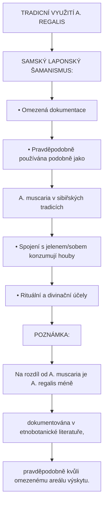

+++
title = "Amanita regalis"
description = "Muchomurka kralovska - vzacna severoevropska varianta s hnede-zlutym kloboukem, obsahujici muscimol a kyselinu ibotenovou"
weight = 12
insert_anchor_links = "right"

[taxonomies]
kategorie = ["houby", "GABAergni", "psychoaktivni"]
aktivni_latky = ["muscimol", "kyselina-ibotenova"]
receptory = ["GABA-A", "NMDA"]
+++

# Amanita regalis - Muchomurka kralovska


---

## Zakladni informace

| Parametr | Hodnota |
|----------|---------|
| **Latinsky nazev** | Amanita regalis (Fr.) Michael |
| **Synonyma** | Amanita muscaria var. regalis, A. umbrina |
| **Ceske nazvy** | Muchomurka kralovska, Kralovska muchotrávka |
| **Celed** | Amanitaceae |
| **Rod** | Amanita (Muchomurky) |
| **Typ psychoaktivity** | GABAergni (disociativni/deliriantni) |
| **Taxonomicky status** | Sporny (druh vs varieta) |

---

## Taxonomicka diskuse

### Druh nebo varieta?

```mermaid
flowchart TD
    node_TAXONOMICKYSTATUSARE["TAXONOMICKY STATUS A. REGALIS"]
    node_NAZOR1SAMOSTATNYDRUH["NAZOR 1: SAMOSTATNY DRUH"]
    node_Morfologickyodlisnab["• Morfologicky odlisna barva, velikost"]
    node_Odlisngeografickarel["• Odlisný geografický areál"]
    node_Ekologickpreferenceb["• Ekologické preference boreální lesy"]
    node_Nktermolekulrnstudie["• Některé molekulární studie podporují"]
    node_NAZOR2VARIETAAMUSCAR["NAZOR 2: VARIETA A. MUSCARIA"]
    node_Chemickyidentickmusc["• Chemicky identická muscimol, kys. ibotenová"]
    node_HybridizujesAmuscari["• Hybridizuje s A. muscaria"]
    node_Morfologickkontinuit["• Morfologická kontinuita"]
    node_SOUCASNYKONSENZUS["SOUCASNY KONSENZUS:"]
    node_Vtinasouasnchautoruz["Většina současných autorů uznává jako:"]
    node_Amanitaregalissamost["Amanita regalis samostatný druh"]
    node_Alternativnpojet["Alternativní pojetí:"]
    node_Amanitamuscariavarre["Amanita muscaria var. regalis"]

    node_TAXONOMICKYSTATUSARE --> node_NAZOR1SAMOSTATNYDRUH
    node_NAZOR1SAMOSTATNYDRUH --> node_Morfologickyodlisnab
    node_Morfologickyodlisnab --> node_Odlisngeografickarel
    node_Odlisngeografickarel --> node_Ekologickpreferenceb
    node_Ekologickpreferenceb --> node_Nktermolekulrnstudie
    node_Nktermolekulrnstudie --> node_NAZOR2VARIETAAMUSCAR
    node_NAZOR2VARIETAAMUSCAR --> node_Chemickyidentickmusc
    node_Chemickyidentickmusc --> node_HybridizujesAmuscari
    node_HybridizujesAmuscari --> node_Morfologickkontinuit
    node_Morfologickkontinuit --> node_SOUCASNYKONSENZUS
    node_SOUCASNYKONSENZUS --> node_Vtinasouasnchautoruz
    node_Vtinasouasnchautoruz --> node_Amanitaregalissamost
    node_Amanitaregalissamost --> node_Alternativnpojet
    node_Alternativnpojet --> node_Amanitamuscariavarre

    click node_NAZOR2VARIETAAMUSCAR "/shrooms/amanita-muscaria/" "NAZOR 2: VARIETA A. MUSCARIA"
    click node_Chemickyidentickmusc "/alkaloids/muscimol/" "• Chemicky identická muscimol, kys. ibotenová"
    click node_HybridizujesAmuscari "/shrooms/amanita-muscaria/" "• Hybridizuje s A. muscaria"
    click node_Amanitamuscariavarre "/shrooms/amanita-muscaria/" "Amanita muscaria var. regalis"
```



<details>
<summary>ASCII verze diagramu</summary>

```
    TAXONOMICKY STATUS A. REGALIS

    NAZOR 1: SAMOSTATNY DRUH
    ─────────────────────────────────────────────────
    • Morfologicky odlisna (barva, velikost)
    • Odlisný geografický areál
    • Ekologické preference (boreální lesy)
    • Některé molekulární studie podporují

    NAZOR 2: VARIETA A. MUSCARIA
    ─────────────────────────────────────────────────
    • Chemicky identická (muscimol, kys. ibotenová)
    • Hybridizuje s A. muscaria
    • Morfologická kontinuita
    • Některé molekulární studie podporují

    SOUCASNY KONSENZUS:
    ─────────────────────────────────────────────────
    Většina současných autorů uznává jako:
    Amanita regalis (samostatný druh)

    Alternativní pojetí:
    Amanita muscaria var. regalis
```

</details>

### Evolucni vztahy

| Taxon | Vztah k A. regalis |
|-------|-------------------|
| **A. muscaria** | Blizce pribuzna, mozny ancestral |
| **A. muscaria var. formosa** | Zlutava varieta, podobna ale odlisna |
| **A. pantherina** | Vzdaleneji pribuzna |
| **A. gemmata** | Vzdaleneji pribuzna |

---

## Identifikace

### Makroskopicke znaky

```mermaid
flowchart TD
    node_AMANITAREGALISVZHLED["AMANITA REGALIS - VZHLED"]
    node_157e2e95["/  ●    ●    ●    \"]
    node_ZLUTAVEBILEKlobouk82["/   ZLUTAVE/BILE    \        Klobouk: 8-20 cm"]
    node_BRADAVKYBarvaHnedozl["/     BRADAVKY        \       Barva: Hnedo-zluta az"]
    node_nazlutozlatohneda["/      na zluto-        \             zlato-hneda"]
    node_hnedempovrchu["/      hnedem povrchu     \"]
    node_LupenyBileazkremove["Lupeny: Bile az kremove"]
    node_PRSTENPrstenBlanity["PRSTEN                Prsten: Blanity"]
    node_masivniRyhovanyjakoA["masivni,             Ryhovany jako A. muscaria"]
    node_ryhovany["ryhovany"]
    node_TrenBily1025cm["Tren: Bily, 10-25 cm"]
    node_Robustni["Robustni"]
    node_BULVABulvaSupinovita["BULVA                Bulva: Supinovita"]
    node_supinovitaRozpadlado["supinovita            Rozpadla do kruhu"]
    node_olvajakoAmuscaria["olva                jako A. muscaria"]

    node_AMANITAREGALISVZHLED --> node_157e2e95
    node_157e2e95 --> node_ZLUTAVEBILEKlobouk82
    node_ZLUTAVEBILEKlobouk82 --> node_BRADAVKYBarvaHnedozl
    node_BRADAVKYBarvaHnedozl --> node_nazlutozlatohneda
    node_nazlutozlatohneda --> node_hnedempovrchu
    node_hnedempovrchu --> node_LupenyBileazkremove
    node_LupenyBileazkremove --> node_PRSTENPrstenBlanity
    node_PRSTENPrstenBlanity --> node_masivniRyhovanyjakoA
    node_masivniRyhovanyjakoA --> node_ryhovany
    node_ryhovany --> node_TrenBily1025cm
    node_TrenBily1025cm --> node_Robustni
    node_Robustni --> node_BULVABulvaSupinovita
    node_BULVABulvaSupinovita --> node_supinovitaRozpadlado
    node_supinovitaRozpadlado --> node_olvajakoAmuscaria

    click node_masivniRyhovanyjakoA "/shrooms/amanita-muscaria/" "masivni,             Ryhovany jako A. muscaria"
    click node_olvajakoAmuscaria "/shrooms/amanita-muscaria/" "olva                jako A. muscaria"
```



<details>
<summary>ASCII verze diagramu</summary>

```
    AMANITA REGALIS - VZHLED

                    ┌─────────────────┐
                   /  ●    ●    ●    \
                  /   ZLUTAVE/BILE    \        Klobouk: 8-20 cm
                 /     BRADAVKY        \       Barva: Hnedo-zluta az
                /      na zluto-        \             zlato-hneda
               /      hnedem povrchu     \
               └──────────────────────────┘
                           │
                           │  Lupeny: Bile az kremove
                           │
                    ┌──────┴──────┐
                    │  PRSTEN     │           Prsten: Blanity
                    │  (masivni,  │           Ryhovany (jako A. muscaria)
                    │  ryhovany)  │
                    └──────┬──────┘
                           │
                           │  Tren: Bily, 10-25 cm
                           │  Robustni
                           │
                    ┌──────┴──────┐
                    │   BULVA     │           Bulva: Supinovita
                    │ (supinovita │           Rozpadla do kruhu
                    │  volva)     │           (jako A. muscaria)
                    └─────────────┘
```

</details>

### Detailni popis

| Znak | Popis | Diagnosticky vyznam |
|------|-------|---------------------|
| **Klobouk** | 8-20 cm, kulovity → ploche rozlozeny | Velky, impozantni |
| **Barva klobouku** | Hnedo-zluta, zlato-hneda, umbra | **KLICOVE** - odlisuje od A. muscaria |
| **Povrch** | Zlutave az bile bradavicnate skvrny | Zbytky velum universale |
| **Okraj klobouku** | Radialne ryhovany | Jako u A. muscaria |
| **Lupeny** | Bile az kremove, volne | Nemeni barvu |
| **Tren** | 10-25 cm, bily, robustni, k bazi ztlustly | Mohutnejsi nez A. muscaria |
| **Prsten** | Blanity, visici, ryhovany | Jako u A. muscaria |
| **Volva** | Supinovita, rozpadla do kruhu | Jako u A. muscaria |
| **Vytruse** | Bile, siroke elipticke, 9-12 x 6,5-9 um | |
| **Velikost** | Obecne vetsi nez A. muscaria | |

### Srovnani s pribuznyni druhy

```mermaid
flowchart TD
    node_AREGALISvsAMUSCARIAv["A. REGALIS vs A. MUSCARIA vs A. PANTHERINA"]
    node_AREGALISAMUSCARIAAPA["A. REGALIS        A. MUSCARIA       A. PANTHERINA"]
    node_KralovskaCervenaTygr["Kralovska       Cervena         Tygrovana"]
    node_KLOBOUKKLOBOUKKLOBOU["KLOBOUK:          KLOBOUK:          KLOBOUK:"]
    node_3299fdcf["████████████      ████████████      ████████████"]
    node_ZLATOHNEDYCERVENYHNE["ZLATO-HNEDY       CERVENY           HNEDY"]
    node_PRSTENPRSTENPRSTEN["PRSTEN:           PRSTEN:           PRSTEN:"]
    node_8147d227["≈≈≈≈≈≈≈≈≈≈≈≈      ≈≈≈≈≈≈≈≈≈≈≈≈"]
    node_RYHOVANYRYHOVANYHLAD["RYHOVANY          RYHOVANY          HLADKY"]
    node_VOLVAVOLVAVOLVA["VOLVA:            VOLVA:            VOLVA:"]
    node_7c9f5d86["~~~~~~~~          ~~~~~~~~"]
    node_SUPINOVITASUPINOVITA["SUPINOVITA        SUPINOVITA        OKRAJOVANA"]
    node_AREALAREALAREAL["AREAL:            AREAL:            AREAL:"]
    node_SkandinavieCelysvetE["Skandinavie       Cely svet         Evropa, S. Am."]
    node_BorealnilesyTempertn["Borealni lesy     Temperátní        Listnaté lesy"]
    node_POTENCEPOTENCEPOTENC["POTENCE:          POTENCE:          POTENCE:"]
    node_PodobnaAmStandardni2["Podobna A.m.      Standardni        2-4x vyssi"]

    node_AREGALISvsAMUSCARIAv --> node_AREGALISAMUSCARIAAPA
    node_AREGALISAMUSCARIAAPA --> node_KralovskaCervenaTygr
    node_KralovskaCervenaTygr --> node_KLOBOUKKLOBOUKKLOBOU
    node_KLOBOUKKLOBOUKKLOBOU --> node_3299fdcf
    node_3299fdcf --> node_ZLATOHNEDYCERVENYHNE
    node_ZLATOHNEDYCERVENYHNE --> node_PRSTENPRSTENPRSTEN
    node_PRSTENPRSTENPRSTEN --> node_8147d227
    node_8147d227 --> node_RYHOVANYRYHOVANYHLAD
    node_RYHOVANYRYHOVANYHLAD --> node_VOLVAVOLVAVOLVA
    node_VOLVAVOLVAVOLVA --> node_7c9f5d86
    node_7c9f5d86 --> node_SUPINOVITASUPINOVITA
    node_SUPINOVITASUPINOVITA --> node_AREALAREALAREAL
    node_AREALAREALAREAL --> node_SkandinavieCelysvetE
    node_SkandinavieCelysvetE --> node_BorealnilesyTempertn
    node_BorealnilesyTempertn --> node_POTENCEPOTENCEPOTENC
    node_POTENCEPOTENCEPOTENC --> node_PodobnaAmStandardni2

    click node_AREGALISvsAMUSCARIAv "/shrooms/amanita-muscaria/" "A. REGALIS vs A. MUSCARIA vs A. PANTHERINA"
    click node_AREGALISAMUSCARIAAPA "/shrooms/amanita-muscaria/" "A. REGALIS        A. MUSCARIA       A. PANTHERINA"
```



<details>
<summary>ASCII verze diagramu</summary>

```
    A. REGALIS vs A. MUSCARIA vs A. PANTHERINA

    ┌──────────────────┬──────────────────┬──────────────────┐
    │   A. REGALIS     │   A. MUSCARIA    │   A. PANTHERINA  │
    │   (Kralovska)    │   (Cervena)      │   (Tygrovana)    │
    ├──────────────────┼──────────────────┼──────────────────┤
    │                  │                  │                  │
    │  KLOBOUK:        │  KLOBOUK:        │  KLOBOUK:        │
    │  ████████████    │  ████████████    │  ████████████    │
    │  ZLATO-HNEDY     │  CERVENY         │  HNEDY           │
    │                  │                  │                  │
    │  PRSTEN:         │  PRSTEN:         │  PRSTEN:         │
    │  ≈≈≈≈≈≈≈≈≈≈≈≈    │  ≈≈≈≈≈≈≈≈≈≈≈≈    │  ════════════    │
    │  RYHOVANY        │  RYHOVANY        │  HLADKY          │
    │                  │                  │                  │
    │  VOLVA:          │  VOLVA:          │  VOLVA:          │
    │  ~~~~~~~~        │  ~~~~~~~~        │  ═══════════     │
    │  SUPINOVITA      │  SUPINOVITA      │  OKRAJOVANA      │
    │                  │                  │                  │
    │  AREAL:          │  AREAL:          │  AREAL:          │
    │  Skandinavie     │  Cely svet       │  Evropa, S. Am.  │
    │  Borealni lesy   │  Temperátní      │  Listnaté lesy   │
    │                  │                  │                  │
    │  POTENCE:        │  POTENCE:        │  POTENCE:        │
    │  Podobna A.m.    │  Standardni      │  2-4x vyssi      │
    │                  │                  │                  │
    └──────────────────┴──────────────────┴──────────────────┘
```

</details>

### Mozne zameny

| Druh | Odliseni | Nebezpeci |
|------|----------|-----------|
| **A. muscaria var. formosa** | Zlutava, mensi, jiny areal | Psychoaktivni |
| **A. muscaria var. muscaria** | Cervena | Psychoaktivni |
| **A. pantherina** | Hneda, hladky prsten, okrajovana volva | Silneji psychoaktivni |
| **A. citrina** | Citronova, zadne skvrny, sackovita volva | Nejedovatá |
| **A. phalloides** | Zelenozluta, sackovita volva | **SMRTELNA** |

**VAROVANI**: Pri pochybnostech NIKDY nekonzumovat. Zamena muze byt smrtelna.

---

## Chemie a alkaloidy

### Obsah aktivnich latek

| Latka | Obsah (susena) | Srovnani s A. muscaria |
|-------|----------------|------------------------|
| [**Kyselina ibotenova**](@/neurotoxins/ibotenic-acid.md) | 0,03-0,1% | Podobny |
| Muscazon | Trace | Podobny |

### Chemicke srovnani

```
    CHEMICKE SROVNANI

    Celkový alkaloidový obsah (sušená houba):

    A. MUSCARIA:
    ████████████████████  ~0,1-0,2%

    A. REGALIS:
    ████████████████████  ~0,1-0,2%
                         PODOBNE

    A. PANTHERINA:
    ████████████████████████████████████████  ~0,2-0,45%
                                             2-3x VICE

    POZNAMKA:
    A. regalis má podobnou potenci jako A. muscaria,
    ale vysokou variabilitu dle lokality a podmínek.
```

### Variabilita obsahu

| Faktor | Vliv |
|--------|------|
| **Lokalita** | Vyrazne regionalni rozdily |
| **Nadmorska vyska** | Potencialne vyssi obsah ve vyssich polohach |
| **Sezona** | Pozdni leto - podzim nejlepsi |
| **Cast houby** | Klobouk > tren |
| **Priprava** | Suseni zvysuje muscimol/ibotenova pomer |

---

## Rozsireni

### Geograficka distribuce

```mermaid
flowchart TD
    node_AREALVYSKYTUAREGALIS["AREAL VYSKYTU A. REGALIS"]
    node_SKANDINAVIE["SKANDINAVIE"]
    node_hlavnarel["hlavní areál"]
    node_NORSKO["████  NORSKO"]
    node_borelnlesy["████  boreální lesy"]
    node_SVDSKO["████  SVÉDSKO"]
    node_stednasevern["████  střední a severní"]
    node_FINSKO["████  FINSKO"]
    node_jinastedn["████  jižní a střední"]
    node_POBALT["██    POBALTÍ"]
    node_zcn["zácně"]
    node_RUSKO["██    RUSKO"]
    node_severozpadKarlie["severozápad, Karélie"]
    node_NMECKO["█     NĚMECKO"]
    node_jimenAlpy["ýjimečně, Alpy"]
    node_POLSKO["█     POLSKO"]
    node_Veskrepublice["V České republice:"]
    node_VELMIVZCNneboNEPTOMN["VELMI VZÁCNÁ nebo NEPŘÍTOMNÁ"]
    node_pouzeojedinlnlezy["pouze ojedinělé nálezy"]

    node_AREALVYSKYTUAREGALIS --> node_SKANDINAVIE
    node_SKANDINAVIE --> node_hlavnarel
    node_hlavnarel --> node_NORSKO
    node_NORSKO --> node_borelnlesy
    node_borelnlesy --> node_SVDSKO
    node_SVDSKO --> node_stednasevern
    node_stednasevern --> node_FINSKO
    node_FINSKO --> node_jinastedn
    node_jinastedn --> node_POBALT
    node_POBALT --> node_zcn
    node_zcn --> node_RUSKO
    node_RUSKO --> node_severozpadKarlie
    node_severozpadKarlie --> node_NMECKO
    node_NMECKO --> node_jimenAlpy
    node_jimenAlpy --> node_POLSKO
    node_POLSKO --> node_Veskrepublice
    node_Veskrepublice --> node_VELMIVZCNneboNEPTOMN
    node_VELMIVZCNneboNEPTOMN --> node_pouzeojedinlnlezy
```



<details>
<summary>ASCII verze diagramu</summary>

```
    AREAL VYSKYTU A. REGALIS

    ┌─────────────────────────────────────────────────────┐
    │                                                      │
    │            SKANDINAVIE                               │
    │         (hlavní areál)                               │
    │                                                      │
    │    ┌─────────────────────────────────────────────┐  │
    │    │                                              │  │
    │    │    ████  NORSKO                             │  │
    │    │    ████  (boreální lesy)                    │  │
    │    │                                              │  │
    │    │    ████  SVÉDSKO                            │  │
    │    │    ████  (střední a severní)                │  │
    │    │                                              │  │
    │    │    ████  FINSKO                             │  │
    │    │    ████  (jižní a střední)                  │  │
    │    │                                              │  │
    │    │    ██    POBALTÍ                            │  │
    │    │          (vzácně)                           │  │
    │    │                                              │  │
    │    │    ██    RUSKO                              │  │
    │    │          (severozápad, Karélie)             │  │
    │    │                                              │  │
    │    │    █     NĚMECKO                            │  │
    │    │          (výjimečně, Alpy)                  │  │
    │    │                                              │  │
    │    │    █     POLSKO                             │  │
    │    │          (vzácně)                           │  │
    │    │                                              │  │
    │    └─────────────────────────────────────────────┘  │
    │                                                      │
    │    V České republice:                               │
    │    VELMI VZÁCNÁ nebo NEPŘÍTOMNÁ                     │
    │    (pouze ojedinělé nálezy)                         │
    │                                                      │
    └─────────────────────────────────────────────────────┘
```

</details>

### Ekologie

| Aspekt | Popis |
|--------|-------|
| **Biotop** | Borealni jehlic nate lesy (tajga) |
| **Ektomykorhiza** | Smrk (Picea), briza (Betula), borovice (Pinus) |
| **Puda** | Kyselé, podzolové půdy |
| **Nadmorska vyska** | Niziny az horské polohy (do 1500 m) |
| **Klima** | Chladné, kontinentální až subarktické |

### Sezona

| Region | Obdobi | Peak |
|--------|--------|------|
| Jizni Skandinavie | VIII-X | Zari |
| Severni Skandinavie | VII-IX | Srpen |
| Finsko | VII-IX | Srpen-Zari |

---

## Historie a etnobotanika

### Tradicni pouziti



<details>
<summary>ASCII verze diagramu</summary>

```
    TRADICNÍ VYUŽITÍ A. REGALIS

    SAMSKÝ (LAPONSKÝ) ŠAMANISMUS:
    ┌──────────────────────────────────────────────────┐
    │                                                   │
    │   • Omezená dokumentace                          │
    │   • Pravděpodobně používána podobně jako         │
    │     A. muscaria v sibiřských tradicích           │
    │   • Spojení s jelenem/sobem (konzumují houby)    │
    │   • Rituální a divinační účely                   │
    │                                                   │
    └──────────────────────────────────────────────────┘

    POZNÁMKA:
    Na rozdíl od A. muscaria je A. regalis méně
    dokumentována v etnobotanické literatuře,
    pravděpodobně kvůli omezenému areálu výskytu.
```

</details>

### Etymologie nazvu

- **Regalis** - z latiny "kralovsky" (rex = kral)
- Odkazuje na majestátní vzhled a velikost houby
- Někdy nazývána "King Fly Agaric" (Královská muchomůrka)

### Mythologie a kultura

| Aspekt | Popis |
|--------|-------|
| **Skandinavska mythologie** | Mozne spojeni s norskymi bohy |
| **Samska kultura** | Ceremonialní využití (omezené doklady) |
| **Moderna kultura** | Méně známá než A. muscaria |

---

## Farmakologie

### Mechanismus ucinku

Stejny jako u [Amanita muscaria](@/shrooms/amanita-muscaria.md):

```mermaid
flowchart TD
    node_FARMAKOLOGIEAREGALIS["FARMAKOLOGIE A. REGALIS"]
    node_AKTIVNILATKY["AKTIVNI LATKY:"]
    node_KYSELINAIBOTENOVAMUS["KYSELINA IBOTENOVA          MUSCIMOL"]
    node_a6b5b6fe["▼                           ▼"]
    node_NMDAGABAA["NMDA                    GABA-A"]
    node_AGONISTAAGONISTA["AGONISTA                AGONISTA"]
    node_d3617bbb["▼                         ▼"]
    node_EXCITOTOXICITAPSYCHO["EXCITOTOXICITA            PSYCHOAKTIVITA"]
    node_neurotoxicksedativn["neurotoxické            sedativní,"]
    node_disociativn["disociativní"]
    node_Viztak["Viz také:"]
    node_Muscimolalkaloidsmus["• Muscimol - /alkaloids/muscimol/"]
    node_Kyselinaibotenovneur["• Kyselina ibotenová - /neurotoxins/ibotenic-acid/"]
    node_GABAAreceptorrecepto["• GABA-A receptor - /receptors/gaba-a/"]

    node_FARMAKOLOGIEAREGALIS --> node_AKTIVNILATKY
    node_AKTIVNILATKY --> node_KYSELINAIBOTENOVAMUS
    node_KYSELINAIBOTENOVAMUS --> node_a6b5b6fe
    node_a6b5b6fe --> node_NMDAGABAA
    node_NMDAGABAA --> node_AGONISTAAGONISTA
    node_AGONISTAAGONISTA --> node_d3617bbb
    node_d3617bbb --> node_EXCITOTOXICITAPSYCHO
    node_EXCITOTOXICITAPSYCHO --> node_neurotoxicksedativn
    node_neurotoxicksedativn --> node_disociativn
    node_disociativn --> node_Viztak
    node_Viztak --> node_Muscimolalkaloidsmus
    node_Muscimolalkaloidsmus --> node_Kyselinaibotenovneur
    node_Kyselinaibotenovneur --> node_GABAAreceptorrecepto

    click node_KYSELINAIBOTENOVAMUS "/alkaloids/muscimol/" "KYSELINA IBOTENOVA          MUSCIMOL"
    click node_NMDAGABAA "/glossary/gaba/" "NMDA                    GABA-A"
    click node_Muscimolalkaloidsmus "/alkaloids/muscimol/" "• Muscimol - /alkaloids/muscimol/"
    click node_GABAAreceptorrecepto "/glossary/gaba/" "• GABA-A receptor - /receptors/gaba-a/"
```



<details>
<summary>ASCII verze diagramu</summary>

```
    FARMAKOLOGIE A. REGALIS

    AKTIVNI LATKY:
    ┌────────────────────────────────────────────────────┐
    │                                                     │
    │   KYSELINA IBOTENOVA          MUSCIMOL             │
    │        │                           │               │
    │        ▼                           ▼               │
    │   ┌─────────────┐           ┌─────────────┐       │
    │   │   NMDA      │           │   GABA-A    │       │
    │   │   AGONISTA  │           │   AGONISTA  │       │
    │   └──────┬──────┘           └──────┬──────┘       │
    │          │                         │               │
    │          ▼                         ▼               │
    │   EXCITOTOXICITA            PSYCHOAKTIVITA        │
    │   (neurotoxické)            (sedativní,           │
    │                              disociativní)        │
    │                                                     │
    └────────────────────────────────────────────────────┘

    Viz také:
    • Muscimol - /alkaloids/muscimol/
    • Kyselina ibotenová - /neurotoxins/ibotenic-acid/
    • GABA-A receptor - /receptors/gaba-a/
```

</details>

### Srovnani s ostatnimi druhy

| Parametr | A. regalis | A. muscaria | A. pantherina |
|----------|------------|-------------|---------------|
| **Potence** | Podobna | Standardni | 2-4x vyssi |
| **Nastup** | 30-90 min | 30-90 min | 30-60 min |
| **Trvani** | 6-8 h | 6-8 h | 8-12 h |
| **Toxicke riziko** | Stredni | Stredni | Vysoke |

---

## Davkovani

### Susene klobouky (po priprave)

**Stejne jako u A. muscaria:**

| Intenzita | Davka | Popis |
|-----------|-------|-------|
| **Mikrodavka** | 0,5-1 g | Sub-perceptuální |
| **Mirna** | 1-5 g | Relaxace, mírná euforie |
| **Stredni** | 5-10 g | Disociace, snové stavy |
| **Silna** | 10-15 g | Intenzivní |
| **Extremni** | 15+ g | Nedoporuceno |

### Upozorneni

| Faktor | Doporuceni |
|--------|------------|
| **Variabilita** | Obsah se lisi mezi exemplari |
| **Zacatecnici** | Zacat s 1-2 g |
| **Priprava** | Kvalitni suseni je nutne |
| **Setting** | S triezlivym sitterem |

---

## Ucinky

### Typicke ucinky

Podobne jako u [A. muscaria](@/shrooms/amanita-muscaria.md):

#### Pozitivni
- Hluboka relaxace
- Svalová relaxace
- Euforie
- Snove/oneiricke stavy
- Lucidní sny

#### Neutralni
- Sedace
- Zmeny vnimani velikosti (makro/mikropsie)
- Ztrata pojmu casu
- Amnézie

#### Negativni
- Ataxie (porucha koordinace)
- Nauzea, zvraceni
- Závratě
- Dezorientace
- Svalove zaskuby

---

## Bezpecnost

### Rizika

| Riziko | Zavaznost | Prevence |
|--------|-----------|----------|
| **Kyselina ibotenova** | Vysoka | Spravna priprava (suseni) |
| **Zamena s A. phalloides** | SMRTELNA | 100% identifikace |
| **Variabilni obsah** | Stredni | Nizke davky |
| **Pady (ataxie)** | Stredni | Sitter, bezpecne misto |
| **Aspirace** | Stredni | Lateralni poloha |

### Kontraindikace

Stejne jako u ostatních Amanita druhu:

- Nejista identifikace
- Cerstve houby (vysoká kys. ibotenová)
- Kombinace s alkoholem nebo sedativy
- Epilepsie
- Těhotenství
- Psychiatrická onemocnění

### Prvni pomoc

1. Zajistit dychaci cesty
2. Volat 155
3. Lateralni stabilizovana poloha
4. Identifikovat houbu
5. NEVYVOLAVAT zvraceni

---

## Priprava

### Konverze kyseliny ibotenove

Stejny postup jako u A. muscaria:

| Metoda | Efektivita | Cas |
|--------|------------|-----|
| Suseni na vzduchu | ~50% | Dny |
| Suseni teplem (80-90°C) | ~70% | 3-4 h |
| Citronova extrakce | ~85% | 2-3 h |

**NIKDY nekonzumovat cerstve houby!**

---

## Pravni status

### Mezinarodni

| Jurisdikce | Status |
|------------|--------|
| **Norsko** | Legalni |
| **Svedsko** | Legalni |
| **Finsko** | Legalni |
| **Nemecko** | Legalni |
| **USA** | Legalni |
| **UK** | Legalni |

### Ceska republika

- **Status**: Legální (pokud se vyskytuje)
- **Muscimol**: Není na seznamu zakázaných látek

---

## Reference

1. Bas, C. (1969). *Morphology and subdivision of Amanita and a monograph of its section Lepidella*. Persoonia.

2. Neville, P. & Poumarat, S. (2004). *Amaniteae: Amanita, Limacella and Torrendia*. Fungi Europaei.

3. Tulloss, R.E. & Yang, Z.L. (ongoing). *Studies in Amanita*. Amanitaceae.org.

4. Michelot, D. & Melendez-Howell, L. (2003). *Amanita muscaria: chemistry, biology, toxicology, and ethnomycology*. Mycological Research.

5. Sanmee, R. et al. (2008). *Molecular phylogeny of the genus Amanita*. Fungal Diversity.

---

## Viz take

### Aktivni latky
- [Kyselina ibotenova](@/neurotoxins/ibotenic-acid.md) - Neurotoxicky prekurzor
- [GABA](@/glossary/gaba.md) - Inhibicni neurotransmiter

### Receptory
- [GABA-A receptor](@/receptors/gaba-a.md) - Cil muscimolu
- [NMDA receptor](@/receptors/nmda.md) - Cil kyseliny ibotenove
- [Glutamat](@/glossary/glutamat.md) - Excitacni neurotransmiter

### Pribuzne druhy
- [Amanita muscaria](@/shrooms/amanita-muscaria.md) - Muchomurka cervena
- [Amanita pantherina](@/shrooms/amanita-pantherina.md) - Muchomurka tygrovana
- [Houby](@/shrooms/_index.md) - Prehled psychoaktivnich hub

### Dalsi zdroje
- [Psilocybe houby](@/shrooms/psilocybes/_index.md) - Alternativni psychoaktivni houby

---

<- Zpet na [Houby](@/shrooms/_index.md) | [Amanita muscaria](@/shrooms/amanita-muscaria.md) ->
