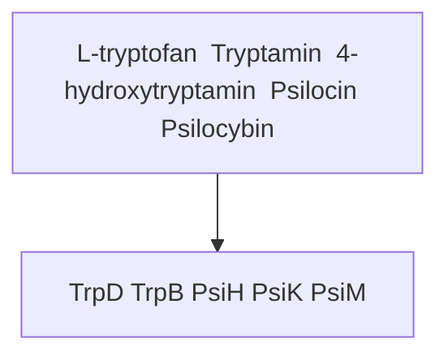
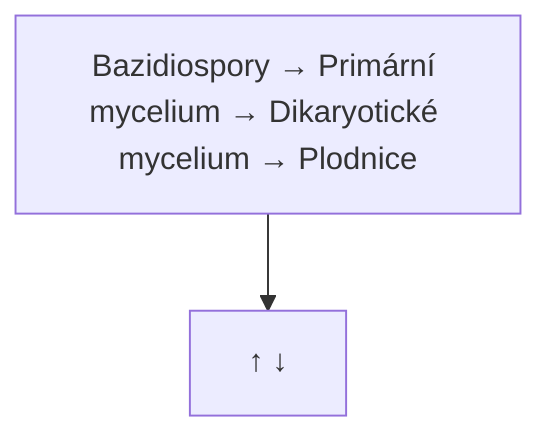
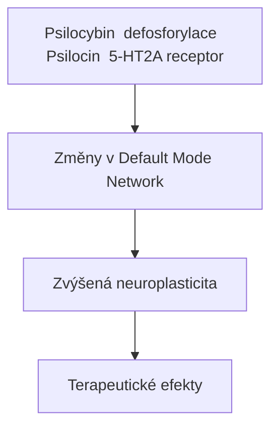

+++
title = "Psilocybes"
description = "Lysohlávky - houby obsahující psilocybin a psilocin"
sort_by = "weight"
weight = 1
insert_anchor_links = "right"
template = "section.html"
+++

# Psilocybes - Lysohlávky

**Psilocybes** (lysohlávky) jsou rodem hub obsahujících psychoaktivní tryptaminy [psilocybin](@/alkaloids/psilocybin.md) a [psilocin](@/alkaloids/psilocin.md). Rod zahrnuje přes 200 druhů rozšířených po celém světě.

---

## Obsah

1. [Taxonomie a fylogeneze](#taxonomie-a-fylogeneze)
2. [Globální rozšíření](#globalni-rozsireni)
3. [Identifikační průvodce](#identifikacni-pruvodce)
4. [Analýza potence](#analyza-potence)
5. [Kultivační metody](#kultivacni-metody)
6. [Ekologie](#ekologie)
7. [Chemická variabilita](#chemicka-variabilita)
8. [Bezpečnostní upozornění](#bezpecnostni-upozorneni)
9. [Přehled druhů](#kompletni-prehled-druhu)

---

## Taxonomie a fylogeneze

### Systematické zařazení

| Úroveň | Klasifikace |
|--------|-------------|
| **Říše** | Fungi (houby) |
| **Oddělení** | Basidiomycota |
| **Třída** | Agaricomycetes |
| **Řád** | Agaricales |
| **Čeleď** | Hymenogastraceae |
| **Rod** | *Psilocybe* (Fr.) P. Kumm. 1871 |

### Etymologie

Název *Psilocybe* pochází z řeckých slov:
- **psilos** (ψιλός) = holý, lysý
- **kybe** (κύβη) = hlava

České jméno "lysohlávka" je doslovným překladem vědeckého názvu.

### Fylogeneze a evoluce

Rod *Psilocybe* byl popsán Elias Magnus Friesem v roce 1818 a později revidován Paulem Kummerem v roce 1871. Molekulární analýzy ukázaly, že rod je polyfyletický - druhy bez psilocybinu byly přesunuty do rodu *Deconica*.

#### Evoluční větve rodu Psilocybe

| Větev | Charakteristika | Příklady druhů |
|-------|-----------------|----------------|
| **Clade Aztecorum** | Mezoamerické druhy, tradiční rituální použití | P. mexicana, P. aztecorum |
| **Clade Semilanceatae** | Travní druhy severní polokoule | P. semilanceata, P. strictipes |
| **Clade Cyanescens** | Dřevo-milující druhy, vysoká potence | P. cyanescens, P. azurescens, P. bohemica |
| **Clade Cubensis** | Tropické koprofily | P. cubensis, P. subcubensis |
| **Clade Stuntzii** | Pacifické druhy Severní Ameriky | P. stuntzii, P. pelliculosa |

### Biosyntéza psilocybinu

Psilocybin vzniká čtyřstupňovou enzymatickou dráhou z L-tryptofanu:



<details>
<summary>ASCII verze diagramu</summary>

```
L-tryptofan → Tryptamin → 4-hydroxytryptamin → Psilocin → Psilocybin
     ↓            ↓              ↓                ↓            ↓
  TrpD         TrpB           PsiH            PsiK         PsiM
```

</details>

| Enzym | Gen | Funkce |
|-------|-----|--------|
| Tryptofan dekarboxyláza | *psiD* | Dekarboxylace tryptofanu |
| Tryptamin hydroxyláza | *psiH* | 4-hydroxylace |
| Kináza | *psiK* | Fosforylace |
| N-methyltransferáza | *psiM* | N-metylace |

Horizontální genový transfer biosyntézy psilocybinu mezi nepříbuznými druhy hub byl zdokumentován, což naznačuje evoluční výhodu této cesty.

---

## Globální rozšíření

### Geografická distribuce

Rod *Psilocybe* je kosmopolitní, s nejvyšší druhovou diverzitou v:

| Region | Počet druhů | Klíčové druhy |
|--------|-------------|---------------|
| **Mezoamerika** | 65+ | P. mexicana, P. aztecorum, P. caerulescens |
| **Severní Amerika** | 45+ | P. azurescens, P. cyanescens, P. cubensis |
| **Evropa** | 25+ | P. semilanceata, P. bohemica, P. serbica |
| **Jižní Amerika** | 30+ | P. subcubensis, P. collybioides |
| **Austrálie/Oceánie** | 20+ | P. subaeruginosa, P. australiana |
| **Asie** | 15+ | P. samuiensis, P. natalensis |
| **Afrika** | 10+ | P. natalensis, P. cubensis |

### Klimatické preference

#### Mírné pásmo (P. semilanceata, P. bohemica, P. cyanescens)

| Faktor | Optimum |
|--------|---------|
| Teplota | 5-15°C |
| Vlhkost | 80-95% |
| Sezóna | Podzim (IX-XII) |
| Nadmořská výška | 200-1500 m |

#### Tropické/subtropické pásmo (P. cubensis)

| Faktor | Optimum |
|--------|---------|
| Teplota | 20-28°C |
| Vlhkost | 85-95% |
| Sezóna | Celoročně (po dešti) |
| Nadmořská výška | 0-1800 m |

#### Oceánické klima (P. azurescens)

| Faktor | Optimum |
|--------|---------|
| Teplota | 10-18°C |
| Vlhkost | 90%+ |
| Sezóna | Pozdní podzim (X-I) |
| Nadmořská výška | 0-100 m (pobřeží) |

### Rozšíření v Evropě

| Země | Běžné druhy | Biotop |
|------|-------------|--------|
| Česká republika | P. bohemica, P. semilanceata | Lesy, louky |
| Velká Británie | P. semilanceata, P. cyanescens | Louky, zahrady |
| Německo | P. semilanceata, P. cyanescens | Louky, parky |
| Nizozemí | P. semilanceata | Louky, duny |
| Skandinávie | P. semilanceata | Horské louky |
| Francie | P. semilanceata, P. cyanescens | Louky, lesy |
| Španělsko | P. gallaeciae, P. hispanica | Horské louky |

---

## Identifikační průvodce

### Klíčové morfologické znaky rodu Psilocybe

| Znak | Popis | Diagnostická hodnota |
|------|-------|---------------------|
| **Modření** | Modrozelené zbarvení při poškození tkáně | Vysoká (ale ne absolutní) |
| **Výtrusy** | Tmavě purpurově hnědé až černé | Vysoká |
| **Klobouk** | Hygrofánní (mění barvu při vysychání) | Střední |
| **Lupeny** | Přirostlé až sbíhavé k třeni | Střední |
| **Třen** | Často vláknitý, bez prstence | Střední |
| **Závoj** | Přítomen u mladých plodnic | Nízká |

### Anatomie plodnice

```
        Klobouk (pileus)
           /    \
          /      \
         /________\  ← Bradavka (umbo)
        |  Lupeny  |
        |  (lamely)|
        |__________|
             |
             |      ← Třen (stipes)
             |
           __|__
          /     \   ← Mycelium
```

### Determinační klíč pro střední Evropu

```
1a. Roste na dřevě, mulči nebo troskách → 2
1b. Roste na trávě nebo půdě → 4

2a. Klobouk vlnitě zvlněný → P. cyanescens
2b. Klobouk hladký nebo mírně zvlněný → 3

3a. Třen bílý, výskyt v listnatých lesích → P. bohemica
3b. Třen nahnědlý, výskyt blízko dřevěných konstrukcí → P. serbica

4a. Klobouk kuželovitý s výraznou bradavkou → P. semilanceata
4b. Klobouk polokulovitý bez bradavky → 5

5a. Spory >10 μm, roste na loukách → P. strictipes
5b. Spory <10 μm → jiný druh
```

### Mikroskopické znaky

| Druh | Velikost spor (μm) | Tvar spor | Cystidy |
|------|-------------------|-----------|---------|
| P. semilanceata | 10.5-15 x 6.5-8.5 | Eliptické | Přítomny |
| P. bohemica | 9-12 x 6-7 | Subelliptické | Přítomny |
| P. cyanescens | 9-12 x 5-7 | Subelliptické | Přítomny |
| P. cubensis | 11-17 x 7-12 | Subelliptické | Přítomny |
| P. azurescens | 10-13 x 6-8 | Subelliptické | Přítomny |

### Sběr výtrusového otisku

1. Odřízněte klobouk od třeně
2. Položte klobouk lupenami dolů na bílý/černý papír
3. Zakryjte sklenicí pro udržení vlhkosti
4. Nechte 4-12 hodin
5. Opatrně odstraňte klobouk
6. Výsledek: purpurově hnědý otisk = Psilocybe (pravděpodobně)

---

## Analýza potence

### Kompletní srovnání všech 7 dokumentovaných druhů

| Druh | Psilocybin | Psilocin | Baeocystin | Celkem | Relativní síla |
|------|-----------|----------|------------|--------|----------------|
| [P. azurescens](@/shrooms/psilocybes/azurescens.md) | 1.78% | 0.38% | 0.35% | **2.51%** | Extrémní |
| [P. semilanceata](@/shrooms/psilocybes/semilanceata.md) | 0.98% | 0.20% | 0.18% | **1.36%** | Velmi vysoká |
| [P. bohemica](@/shrooms/psilocybes/bohemica.md) | 1.02% | 0.17% | 0.15% | **1.34%** | Velmi vysoká |
| [P. cyanescens](@/shrooms/psilocybes/cyanescens.md) | 0.60% | 0.17% | 0.08% | **0.85%** | Vysoká |
| [P. cubensis](@/shrooms/psilocybes/cubensis.md) | 0.50% | 0.06% | 0.07% | **0.63%** | Střední |
| [P. tampanensis](@/shrooms/psilocybes/tampanensis.md) | 0.31% | 0.03% | 0.07% | **0.41%** | Nízká-střední |
| [P. mexicana](@/shrooms/psilocybes/mexicana.md) | 0.25% | 0.05% | 0.05% | **0.35%** | Nízká-střední |

### Ekvivalentní dávkování (sušená hmotnost)

Pro dosažení přibližně stejného efektu:

| Druh | Mikrodávka | Střední dávka | Silná dávka |
|------|------------|---------------|-------------|
| P. azurescens | 0.05-0.1 g | 0.5-1.0 g | 1.5-2.5 g |
| P. semilanceata | 0.1-0.2 g | 1.0-2.0 g | 3.0-4.0 g |
| P. bohemica | 0.1-0.2 g | 1.0-2.0 g | 3.0-4.0 g |
| P. cyanescens | 0.15-0.3 g | 1.5-2.5 g | 4.0-5.0 g |
| P. cubensis | 0.2-0.4 g | 2.0-3.5 g | 5.0-7.0 g |
| P. tampanensis (sclerotia) | 0.5-1.0 g | 5.0-10 g | 15-25 g |
| P. mexicana | 0.3-0.5 g | 3.0-5.0 g | 7.0-10 g |

### Potence podle části plodnice

| Část | Relativní potence |
|------|-------------------|
| Klobouk | 100% (referenční) |
| Třen | 60-80% |
| Spory | 0% |
| Mycelium | 10-30% |
| Sklerotia | 30-70% |

### Faktory ovlivňující potenci

| Faktor | Vliv na potenci |
|--------|-----------------|
| Stáří plodnice | Mladší = vyšší |
| Podmínky růstu | Stres = vyšší |
| Sušení | Rychlé sušení = zachování |
| Skladování | Světlo/teplo = degradace |
| Genetika | Variabilita 50-200% |

---

## Kultivační metody

### Přehled kultivovatelných druhů

| Druh | Obtížnost | Substráty | Speciální požadavky |
|------|-----------|-----------|---------------------|
| P. cubensis | Snadná | BRF, obilí, sláma | Žádné |
| P. tampanensis | Snadná | Obilí | Produkuje sklerotia |
| P. mexicana | Střední | Obilí | Produkuje sklerotia |
| P. cyanescens | Těžká | Dřevní štěpka | Venkovní, chlad |
| P. azurescens | Velmi těžká | Olšové třísky | Venkovní, pobřeží |
| P. bohemica | Experimentální | Listnatý mulč | Venkovní, neověřeno |
| P. semilanceata | Nemožná | N/A | Mykorrhiza? |

### Indoor kultivace (P. cubensis)

#### Metoda PF-Tek (Psilocybe Fanaticus Technique)

**Substrát BRF (Brown Rice Flour):**

| Ingredience | Poměr |
|-------------|-------|
| Hnědá rýžová mouka | 2 díly |
| Vermikulit | 2 díly |
| Voda | 1 díl |

**Postup:**

1. **Příprava substrátu** (den 1)
   - Smíchejte ingredience
   - Naplňte sterilní sklenice
   - Sterilizujte 90 min při 15 PSI

2. **Inokulace** (den 2)
   - Očkujte sporovým stříkem
   - 0.5-1 ml na sklenici
   - Sterilní technika!

3. **Inkubace** (dny 3-28)
   - Teplota: 24-27°C
   - Tma
   - Čekejte na plnou kolonizaci

4. **Fruiting** (dny 29-45)
   - Vlhkost: 90-95%
   - Teplota: 21-24°C
   - Světlo: 12h/den
   - FAE (fresh air exchange)

#### Bulk substráty (pokročilá kultivace)

| Substrát | Výtěžek | Obtížnost |
|----------|---------|-----------|
| CVG (kokos/vermikulit/sádra) | Vysoký | Střední |
| Pasterizovaná sláma | Střední | Snadná |
| Obilí (žito, pšenice) | Vysoký | Střední |
| Dřevní štěpka | Nízký | Těžká |

### Outdoor kultivace (wood-lovers)

#### P. cyanescens/azurescens outdoor bed

**Materiály:**
- Čerstvá dřevní štěpka (olše, vrba, topol)
- Spawn na obilí nebo dřevěných kolících
- Stinné místo s vysokou vlhkostí

**Postup:**

1. Připravte záhon 30 cm hluboký
2. Vrstva štěpky + spawn + štěpka
3. Zakryjte kartonem a listím
4. Udržujte vlhkost
5. Čekejte 6-18 měsíců
6. Fruiting po prvních mrazech

#### Klimatické požadavky outdoor

| Druh | Min. teplota fruiting | Optimum | Vlhkost |
|------|----------------------|---------|---------|
| P. cyanescens | 5°C | 10-15°C | 90%+ |
| P. azurescens | 2°C | 8-12°C | 95%+ |
| P. bohemica | 0°C | 5-12°C | 85%+ |

### Produkce sklerotií (P. tampanensis, P. mexicana)

| Fáze | Teplota | Doba |
|------|---------|------|
| Inokulace | 24-27°C | 2 týdny |
| Formace sklerotií | 20-24°C | 8-16 týdnů |
| Sklizeň | - | Po plné konsolidaci |

---

## Ekologie

### Ekologické strategie

| Strategie | Druhy | Charakteristika |
|-----------|-------|-----------------|
| **Saprotrofní** | P. cubensis, P. cyanescens | Rozklad organické hmoty |
| **Koprofily** | P. cubensis, P. semilanceata | Roste na trusu |
| **Lignikolní** | P. azurescens, P. bohemica | Rozklad dřeva |
| **Huminokolní** | P. semilanceata | Roste na půdě bohaté na humus |

### Habitaty

#### Travnaté biotopy

| Druh | Specifický habitat |
|------|-------------------|
| P. semilanceata | Nehnojené pastviny, horské louky, golfová hřiště |
| P. mexicana | Tropické louky, pastviny dobytka |

#### Lesní biotopy

| Druh | Specifický habitat |
|------|-------------------|
| P. bohemica | Listnaté lesy, břehy potoků, zahrady |
| P. serbica | Lužní lesy, parky |

#### Urbánní biotopy

| Druh | Specifický habitat |
|------|-------------------|
| P. cyanescens | Zahradní mulč, parky, okraje silnic |
| P. cubensis | Pastviny, travnaté plochy (tropy) |

### Životní cyklus



<details>
<summary>ASCII verze diagramu</summary>

```
Bazidiospory → Primární mycelium → Dikaryotické mycelium → Plodnice
     ↑                                                          ↓
     └──────────────────────────────────────────────────────────┘
```

</details>

| Fáze | Trvání | Podmínky |
|------|--------|----------|
| Germinace spor | 1-4 týdny | Vlhko, teplo |
| Vegetativní růst | měsíce-roky | Substrát, živiny |
| Primordia | 1-2 týdny | Pokles teploty, vlhkost |
| Plodnice | 5-10 dní | Vlhkost 90%+, FAE |
| Sporulace | 2-4 dny | Zralé plodnice |

### Fenologie (střední Evropa)

| Měsíc | P. semilanceata | P. bohemica | P. cyanescens |
|-------|-----------------|-------------|---------------|
| Leden | - | Vzácně | - |
| Únor | - | - | - |
| Březen | - | - | - |
| Duben | - | - | - |
| Květen | - | - | - |
| Červen | - | - | - |
| Červenec | - | - | - |
| Srpen | Vzácně | - | - |
| Září | Běžně | Začátek | Vzácně |
| Říjen | Peak | Peak | Běžně |
| Listopad | Konec | Běžně | Peak |
| Prosinec | - | Konec | Konec |

---

## Chemická variabilita

### Faktory ovlivňující obsah alkaloidů

#### Genetické faktory

| Faktor | Vliv |
|--------|------|
| Druh | Určuje základní rozsah |
| Kmen/variety | 50-200% variabilita |
| Individuální plodnice | 20-50% variabilita |

#### Environmentální faktory

| Faktor | Vliv na potenci |
|--------|-----------------|
| Substrát | Významný |
| Teplota | Nižší = vyšší potence |
| Vlhkost | Optimum = vyšší potence |
| Světlo | UV = mírně vyšší |
| Stres | Stres = vyšší potence |

#### Post-harvest faktory

| Faktor | Vliv |
|--------|------|
| Oxidace | Degradace psilocinu |
| Teplota sušení | >50°C = ztráty |
| Světlo při skladování | Degradace |
| Vlhkost při skladování | Plísně, degradace |

### Degradace alkaloidů

| Podmínka | Poločas psilocybinu |
|----------|---------------------|
| Čerstvé (20°C) | Dny |
| Sušené (pokojová teplota) | 6-12 měsíců |
| Sušené (mrazák, tma) | 2-4 roky |
| Sušené (pokojová teplota, světlo) | 3-6 měsíců |

### Ratio psilocybin/psilocin

| Druh | Psilocybin:Psilocin |
|------|---------------------|
| P. azurescens | 4.7:1 |
| P. semilanceata | 4.9:1 |
| P. bohemica | 6.0:1 |
| P. cyanescens | 3.5:1 |
| P. cubensis | 8.3:1 |

Vyšší poměr = lepší skladovatelnost (psilocin rychleji degraduje).

---

## Bezpečnostní upozornění

### Nebezpečné záměny

#### Smrtelně jedovaté druhy

| Druh | Habitat | Klíčové odlišnosti |
|------|---------|-------------------|
| **Galerina marginata** | Dřevo, mulč | Prstenec na třeni, rezavě hnědé výtrusy |
| **Conocybe filaris** | Trávníky, mulč | Prstenec, rezavě hnědé výtrusy |
| **Lepiota sp.** | Půda, trávníky | Bílé výtrusy, sukénka |
| **Inocybe sp.** | Lesy, parky | Hnědé výtrusy, žádné modření |

#### Nepříjemné/mírně toxické záměny

| Druh | Habitat | Klíčové odlišnosti |
|------|---------|-------------------|
| Hypholoma fasciculare | Dřevo | Žlutozelené lupeny, hořká chuť |
| Panaeolus sp. | Trus, louky | Černé výtrusy, žádné modření |
| Stropharia sp. | Dřevo, mulč | Prstenec, jiný tvar spor |

### Srovnávací tabulka kritických znaků

| Znak | Psilocybe | Galerina | Conocybe |
|------|-----------|----------|----------|
| Modření | ANO | NE | NE |
| Prstenec | NE | ANO | ANO |
| Barva výtrusů | Purpurově hnědá | Rezavě hnědá | Rezavě hnědá |
| Toxin | Psilocybin | Amanitiny | Amanitiny |
| Důsledek | Psychoaktivní | Smrtelné | Smrtelné |

### Pravidla bezpečné identifikace

1. **Nikdy nesbírejte bez 100% jistoty**
2. **Vždy pořiďte výtrusový otisk**
3. **Kontrolujte více znaků současně**
4. **Nesbírejte přezrálé nebo poškozené plodnice**
5. **Konzultujte s odborníkem při pochybnostech**
6. **Fotografujte in situ před sběrem**

### Identifikační checklist

```
[ ] Purpurově hnědý výtrusový otisk
[ ] Modření při poškození
[ ] Žádný prstenec na třeni
[ ] Hygrofánní klobouk
[ ] Odpovídající habitat a sezóna
[ ] Odpovídající velikost a tvar
[ ] Konzultace s odborníkem
```

### Zdravotní kontraindikace

| Stav | Riziko | Doporučení |
|------|--------|------------|
| Schizofrenie (osobní/rodinná) | Vysoké | Absolutní kontraindikace |
| Bipolární porucha | Vysoké | Kontraindikace |
| Těhotenství | Neznámé | Kontraindikace |
| Kardiovaskulární onemocnění | Střední | Opatrnost |
| SSRI/MAOI léčba | Interakce | Kontraindikace |
| Úzkostné poruchy | Střední | Kontrolované prostředí |

### Právní status

| Jurisdikce | Status psilocybinu | Status hub |
|------------|-------------------|------------|
| Česká republika | Nelegální | Nelegální |
| Nizozemí | Nelegální | Sklerotia legální |
| Portugalsko | Dekriminalizováno | Dekriminalizováno |
| Oregon (USA) | Terapeutické použití | Terapeutické |
| Kanada | Kontrolovaná látka | Výjimky možné |

---

## Kompletní přehled druhů

### Seřazeno podle potence

| Druh | České jméno | Celková potence | Region |
|------|-------------|-----------------|--------|
| [P. azurescens](@/shrooms/psilocybes/azurescens.md) | Lysohlávka azurová | **2.51%** | Pacifik USA |
| [P. semilanceata](@/shrooms/psilocybes/semilanceata.md) | Lysohlávka kopinatá | **1.36%** | Evropa |
| [P. bohemica](@/shrooms/psilocybes/bohemica.md) | Lysohlávka česká | **1.34%** | Střední Evropa |
| [P. cyanescens](@/shrooms/psilocybes/cyanescens.md) | Lysohlávka modravá | **0.85%** | Celosvětově |
| [P. cubensis](@/shrooms/psilocybes/cubensis.md) | Kubánská lysohlávka | **0.63%** | Tropy |
| [P. tampanensis](@/shrooms/psilocybes/tampanensis.md) | Philosopher's Stone | **0.41%** (sklerotia) | Florida |
| [P. mexicana](@/shrooms/psilocybes/mexicana.md) | Teonanácatl | **0.35%** | Mexiko |

### Podle biotopu

#### Travnaté louky

| Druh | Region | Klíčový znak |
|------|--------|--------------|
| [P. semilanceata](@/shrooms/psilocybes/semilanceata.md) | Evropa | Kuželovitý klobouk s bradavkou |
| [P. mexicana](@/shrooms/psilocybes/mexicana.md) | Mexiko | Menší, hnědý klobouk |

#### Dřevo/Mulč (Wood lovers)

| Druh | Region | Klíčový znak |
|------|--------|--------------|
| [P. azurescens](@/shrooms/psilocybes/azurescens.md) | Pacifik USA | Široký karamelový klobouk |
| [P. cyanescens](@/shrooms/psilocybes/cyanescens.md) | Celosvětově | Vlnitý okraj kloblouku |
| [P. bohemica](@/shrooms/psilocybes/bohemica.md) | Střední Evropa | Bílý třen |

#### Trus/Pastviny

| Druh | Region | Klíčový znak |
|------|--------|--------------|
| [P. cubensis](@/shrooms/psilocybes/cubensis.md) | Tropy | Zlatohnědý klobouk, závoj |

#### Sklerotia producenti

| Druh | Typ sklerotií | Poznámka |
|------|---------------|----------|
| [P. tampanensis](@/shrooms/psilocybes/tampanensis.md) | "Magic truffles" | Komerčně pěstované |
| [P. mexicana](@/shrooms/psilocybes/mexicana.md) | "Piedras" | Tradiční použití |

---

## Aktivní látky

| Alkaloid | Funkce | Více info |
|----------|--------|-----------|
| [Psilocybin](@/alkaloids/psilocybin.md) | Fosforylovaný prodrug | Hlavní alkaloid |
| [Psilocin](@/alkaloids/psilocin.md) | Aktivní metabolit | Přímý 5-HT2A agonista |
| [Baeocystin](@/alkaloids/baeocystin.md) | Minor alkaloid | Demetyl-psilocybin |
| Norbaeocystin | Trace alkaloid | Prekurzor |
| Aeruginascin | Trace alkaloid | Potencující efekt? |

---

## České druhy

V České republice se vyskytují:

| Druh | Výskyt | Sezóna | Biotop |
|------|--------|--------|--------|
| [P. bohemica](@/shrooms/psilocybes/bohemica.md) | Běžný | IX-XII | Listnaté lesy, zahrady |
| [P. semilanceata](@/shrooms/psilocybes/semilanceata.md) | Běžný | IX-XI | Horské louky |
| P. serbica | Vzácný | IX-XI | Jižní Morava, lužní lesy |
| P. cyanescens | Vzácný (introdukovaný) | X-XI | Zahradní mulč |

---

## Historie a kulturní význam

### Prehistorické použití

- **9000 BCE**: Skalní malby v Tassili n'Ajjer (Alžírsko) zobrazující houby
- **3000 BCE**: "Piedras hongo" (houbové kameny) v Guatemale a Mexiku

### Mezoamerické tradice

| Kultura | Termín | Význam |
|---------|--------|--------|
| Aztékové | Teonanácatl | "Maso bohů" |
| Mazatékové | Nti-si-tho | "Svaté děti" |
| Mixtékové | - | Rituální použití |

### Moderní historie

| Rok | Událost |
|-----|---------|
| 1957 | R. Gordon Wasson publikuje článek v Life Magazine |
| 1958 | Albert Hofmann izoluje psilocybin a psilocin |
| 1959 | Syntéza psilocybinu |
| 1960s | Výzkum na Harvardu (Timothy Leary) |
| 1971 | Konvence OSN - zákaz psilocybinu |
| 2006 | Johns Hopkins - renesance výzkumu |
| 2020 | Oregon legalizuje terapeutické použití |

---

## Výzkum a terapeutický potenciál

### Současné klinické studie

| Indikace | Fáze | Instituce |
|----------|------|-----------|
| Rezistentní deprese | III | COMPASS Pathways |
| PTSD | II | MAPS |
| Úzkost u terminálních pacientů | II | Johns Hopkins, NYU |
| Závislosti (alkohol, tabák) | II | Johns Hopkins |
| OCD | II | Yale |
| Anorexie | II | Imperial College |

### Mechanismus účinku



<details>
<summary>ASCII verze diagramu</summary>

```
Psilocybin → (defosforylace) → Psilocin → 5-HT2A receptor →
    → Změny v Default Mode Network →
    → Zvýšená neuroplasticita →
    → Terapeutické efekty
```

</details>

---

## Praktické informace

### Sušení a skladování

| Metoda sušení | Teplota | Doba | Ztráta potence |
|---------------|---------|------|----------------|
| Ventilátor | 20-25°C | 24-48h | Minimální |
| Vysoušedlo | 20-25°C | 12-24h | Minimální |
| Potravinový dehydrátor | <35°C | 6-12h | Minimální |
| Potravinový dehydrátor | >50°C | 4-8h | 10-20% |
| Sluneční světlo | Variabilní | Variabilní | 20-40% |
| Trouba | >60°C | 2-4h | 30-50% |

### Dlouhodobé skladování

| Metoda | Trvanlivost | Poznámka |
|--------|-------------|----------|
| Sušené + vakuově balené + mrazák | 2-4 roky | Optimální |
| Sušené + sklenice + tma + chlad | 1-2 roky | Dobrá |
| Sušené + pokojová teplota | 6-12 měsíců | Přijatelná |
| Med (honey tek) | 1-2 roky | Tradiční metoda |
| Čokoláda | 6-12 měsíců | Chutná varianta |

---

## Související

- [Alkaloidy](@/alkaloids/_index.md) - Aktivní látky
- [Psilocybin](@/alkaloids/psilocybin.md) - Hlavní alkaloid
- [Psilocin](@/alkaloids/psilocin.md) - Aktivní forma
- [Baeocystin](@/alkaloids/baeocystin.md) - Minor alkaloid
- [Amanita](@/shrooms/amanita-muscaria.md) - Jiný typ psychoaktivních hub
- [Houby](@/shrooms/_index.md) - Nadřazená sekce

---

## Reference

1. Stamets, P. (1996). *Psilocybin Mushrooms of the World*
2. Guzman, G. (2005). "Species diversity of the genus Psilocybe in the world"
3. Carhart-Harris, R. et al. (2016). "Psilocybin with psychological support for treatment-resistant depression"
4. Fricke, J. et al. (2017). "The biosynthetic pathway of psilocybin"
5. Guzman, G. et al. (1998). "An emendation of the genus Psilocybe"
