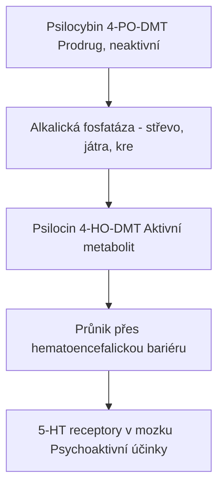

+++
title = "Psilocybe cubensis"
description = "Kubánská lysohlávka - nejrozšířenější kultivovaný druh psilocybinových hub, kompletní vědecký přehled"
weight = 1
insert_anchor_links = "right"
+++

# Psilocybe cubensis - Kubánská lysohlávka

**Psilocybe cubensis** (Earle) Singer je nejznámější a nejčastěji kultivovaný druh [psilocybinových hub](@/shrooms/psilocybes/_index.md). Tato tropická koprofylní houba obsahuje psychoaktivní tryptaminy [psilocybin](@/alkaloids/psilocybin.md) a [psilocin](@/alkaloids/psilocin.md), které působí jako agonisté serotoninových receptorů v mozku.

---

## Taxonomie a systematika

### Klasifikace

| Úroveň | Taxon |
|--------|-------|
| **Říše** | Fungi |
| **Oddělení** | Basidiomycota |
| **Pododdělení** | Agaricomycotina |
| **Třída** | Agaricomycetes |
| **Řád** | Agaricales |
| **Čeleď** | Hymenogastraceae (dříve Strophariaceae) |
| **Rod** | [Psilocybe](@/shrooms/psilocybes/_index.md) |
| **Druh** | P. cubensis (Earle) Singer 1948 |

### Synonyma

| Název | Autor | Rok |
|-------|-------|-----|
| *Stropharia cubensis* | Earle | 1906 (basionym) |
| *Stropharia cyanescens* | Murrill | 1941 |
| *Stropharia caerulescens* | (Pat.) Singer | 1948 |
| *Naematoloma caerulescens* | Patouillard | 1907 |

### Etymologie

- **Psilocybe**: z řeckého *psilos* (holý) + *kybē* (hlava) = "holá hlava"
- **cubensis**: z Kuby, kde byl druh poprvé popsán

---

## Morfologie

### Klobouk (Pileus)

| Parametr | Hodnota |
|----------|---------|
| **Průměr** | 2-8 cm (až 12 cm u některých kultivarů) |
| **Tvar (mladý)** | Konický až zvoncovitý |
| **Tvar (zralý)** | Konvexní až široce konvexní, někdy s umbo |
| **Barva** | Světle zlatohnědá → karamelová → bledá při vysychání |
| **Povrch** | Hladký, hygrofánní (mění barvu s vlhkostí) |
| **Okraj** | Rovný, někdy s přítomným zbytkem vela |

### Lupeny (Lamellae)

| Parametr | Hodnota |
|----------|---------|
| **Připojení** | Přirostlé až sbíhavé |
| **Barva (mladé)** | Šedofialová |
| **Barva (zralé)** | Tmavě purpurově hnědá až černá |
| **Hustota** | Střední až husté |
| **Okraj** | Bělší než plocha (lemované) |

### Třeň (Stipe)

| Parametr | Hodnota |
|----------|---------|
| **Výška** | 4-15 cm (až 20 cm) |
| **Průměr** | 0,5-1,5 cm |
| **Tvar** | Válcovitý, rovný nebo zakřivený |
| **Barva** | Bílá až nažloutlá |
| **Povrch** | Hladký, fibrilózní |
| **Vnitřek** | Dutý |
| **Báze** | Mírně zduřelá, s myceliem |
| **Prsten** | Blanitý, trvale přítomný, bílý až šedý |

### Modření (Bluing reaction)

| Místo | Intenzita |
|-------|-----------|
| **Třeň (poškození)** | Silné, rychlé |
| **Klobouk (poškození)** | Střední |
| **Báze třeně** | Velmi silné |
| **Mycélium** | Silné |

**Mechanismus**: Oxidace psilocinu na modrý chinon. Přítomnost modření je indikátorem obsahu psilocybinových alkaloidů.

### Spory (Basidiospory)

| Parametr | Hodnota |
|----------|---------|
| **Rozměry** | 11-17 × 7-12 μm |
| **Tvar** | Elipsoidní až subellipsoidní |
| **Barva** | Purpurově hnědá v mase |
| **Výtrusný prach** | Tmavě purpurově hnědý |
| **Ornamentace** | Hladké, s apikální zárodečnou pórou |
| **Stěna** | Silná |

---

## Chemické složení

### Aktivní alkaloidy

| Alkaloid | Koncentrace (% sušiny) | Poznámka |
|----------|------------------------|----------|
| [**Psilocybin**](@/alkaloids/psilocybin.md) | 0,14-0,42% (průměr 0,25%) | Hlavní alkaloid |
| [**Psilocin**](@/alkaloids/psilocin.md) | 0,01-0,17% (průměr 0,05%) | Aktivní forma |
| [**Baeocystin**](@/alkaloids/baeocystin.md) | 0,01-0,05% | Minor alkaloid |
| **Norbaeocystin** | Stopy | Prekurzor |
| **Aeruginascin** | Stopy (některé kmeny) | Modulátor |

### Celková potence

| Klasifikace | Hodnota |
|-------------|---------|
| **Celková potence** | 0,16-0,64% (průměr ~0,63%) |
| **Relativní potence** | Střední |
| **Srovnání s P. azurescens** | ~25% potence |
| **Srovnání s P. semilanceata** | ~46% potence |

### Variabilita obsahu

| Faktor | Vliv |
|--------|------|
| **Kultivar (strain)** | Významný (Penis Envy 2× potence) |
| **Substrát** | Střední |
| **Fáze růstu** | Mladé > staré |
| **Část plodnice** | Klobouk > třeň |
| **Flush (sklizeň)** | 1. > následující |
| **Sušení** | Rychlé sušení zachová více |

---

## Biotop a ekologie

### Přirozený biotop

| Parametr | Hodnota |
|----------|---------|
| **Substrát** | Trus býložravců (preferenčně hovězí) |
| **Klima** | Tropické a subtropické |
| **Teplota** | 20-30°C (optimum 24-27°C) |
| **Vlhkost** | 80-95% RH |
| **Světlo** | Polostín, nepřímé |

### Ekologická klasifikace

- **Koprofylní**: Roste na trusu
- **Saprotrofní**: Rozkládá organickou hmotu
- **Nemykorhizní**: Nevytváří symbiózu s rostlinami

### Geografické rozšíření

| Region | Země/oblasti |
|--------|--------------|
| **Střední Amerika** | Mexiko, Guatemala, Honduras, Belize |
| **Jižní Amerika** | Kolumbie, Venezuela, Brazílie, Argentina |
| **Severní Amerika** | Jižní USA (Florida, Texas, Louisian) |
| **Karibik** | Kuba, Jamajka, Portoriko |
| **Jihovýchodní Asie** | Thajsko, Vietnam, Kambodža, Indie |
| **Oceánie** | Austrálie (QLD, NSW), Papua Nová Guinea |
| **Afrika** | Jižní Afrika, Zimbabwe |

### Sezóna

| Region | Období |
|--------|--------|
| **Tropy** | Celoročně (po deštích) |
| **Subtropy** | Jaro-podzim |
| **Kultura** | Celoročně (kontrolované podmínky) |

---

## Kultivace

### Proč je P. cubensis nejkultivovanější?

| Výhoda | Popis |
|--------|-------|
| **Snadnost** | Tolerantní k široké škále podmínek |
| **Rychlost** | Od inokulace po sklizeň 4-6 týdnů |
| **Výnos** | Vysoký, více flushů |
| **Kontaminace** | Relativně odolný |
| **Dostupnost** | Sporangie široce dostupné |

### Kultivační metody

| Metoda | Náročnost | Výnos | Poznámka |
|--------|-----------|-------|----------|
| **PF Tek** | Nízká | Nízký | Začátečníci, BRF cakes |
| **Monotub** | Střední | Vysoký | Bulk substrát, standard |
| **Shoebox** | Střední | Střední | Menší monotub |
| **Martha tent** | Vysoká | Velmi vysoký | Automatizace, zkušení |
| **Agar culture** | Vysoká | N/A | Klonování, izolace |

### Základní parametry kultivace

| Fáze | Teplota | Vlhkost | Světlo | CO₂ |
|------|---------|---------|--------|-----|
| **Kolonizace** | 24-27°C | N/A | Tma | Vysoké OK |
| **Pinning** | 21-24°C | 95%+ | 12h cyklus | Nízké (<800 ppm) |
| **Plodění** | 21-24°C | 85-95% | 12h cyklus | Nízké |

### Substráty

| Substrát | Použití | Poznámka |
|----------|---------|----------|
| **BRF (Brown Rice Flour)** | PF Tek | Začátečníci |
| **Zrní (žito, pšenice)** | Spawn | Kolonizace |
| **Kokosový substrát (coir)** | Bulk | Neutrální pH |
| **Kompost** | Bulk | Živiny, riziko kontaminace |
| **Sláma** | Bulk | Levná, pasteurizace |
| **Hnůj** | Bulk | Přirozený, rizikovější |

---

## Odrůdy (Strains/Cultivars)

### Přehled hlavních kultivarů

| Odrůda | Potence | Růst | Charakteristika |
|--------|---------|------|-----------------|
| **Golden Teacher** | Střední | Střední | Vhodná pro začátečníky, spolehlivá |
| **B+** | Střední | Rychlý | Velké plodnice, robustní |
| **Penis Envy** | **Vysoká** (2×) | Pomalý | Mutantní morfologie, silná |
| **Albino A+** | Střední | Střední | Leucistická (bílá), atraktivní |
| **Ecuador** | Střední | Rychlý | Tropický původ, odolný |
| **Cambodian** | Střední-vysoká | Velmi rychlý | Agresivní kolonizace |
| **Mazatapec** | Střední | Střední | Tradiční mexická |
| **Thai** | Střední | Střední | Štíhlé, tropické |
| **Treasure Coast** | Střední | Rychlý | Florida, spolehlivá |
| **Z-strain** | Střední | Rychlý | Komerční, vysoký výnos |

### Penis Envy varianty

| Varianta | Charakteristika |
|----------|-----------------|
| **Penis Envy (original)** | Silná potence, pomalý růst |
| **Albino Penis Envy (APE)** | Leucistická, velmi silná |
| **Penis Envy Uncut** | Otevřený klobouk |
| **Penis Envy #6** | Hybridizovaná, rychlejší |
| **Melmak** | Mutace, vlnité |

### Poznámka k potenci kultivarů

Potence mezi kultivary se může lišit 2-3×. Penis Envy a jeho varianty jsou obecně považovány za nejsilnější kultivary P. cubensis.

---

## Biochemický mechanismus účinku

### Metabolismus psilocybinu



<details>
<summary>ASCII verze diagramu</summary>

```
Psilocybin (4-PO-DMT) [Prodrug, neaktivní]
         ↓
    [Alkalická fosfatáza - střevo, játra, krev]
         ↓
Psilocin (4-HO-DMT) [Aktivní metabolit]
         ↓
    [Průnik přes hematoencefalickou bariéru]
         ↓
5-HT receptory v mozku → Psychoaktivní účinky
```

</details>

### Cílové receptory

| Receptor | Afinita (Ki nM) | Účinek | Role |
|----------|-----------------|--------|------|
| **5-HT2A** | 6-15 | Agonista | **Primární** - vizuální, kognitivní |
| **5-HT2C** | 10-30 | Agonista | Modulace nálady |
| **5-HT2B** | 20-50 | Agonista | Periferní |
| **5-HT1A** | 100-300 | Parciální agonista | Anxiolytický |
| **5-HT1D** | 200+ | Slabý agonista | Minor |
| **D1** | 1000+ | Slabý | Minimální |

### Ovlivněné mozkové struktury

| Struktura | Funkce | Účinek psilocinu |
|-----------|--------|------------------|
| **Prefrontální kortex** | Exekutivní funkce, rozhodování | Dezorganizace, kreativita |
| **Vizuální kortex** | Zpracování zraku | Halucinace, geometrie |
| **Default Mode Network** | Sebereferenční myšlení | Rozpuštění, ego death |
| **Amygdala** | Emoce, strach | Snížená reaktivita |
| **Hipokampus** | Paměť | Zvýšená plastičnost |
| **Thalamus** | Senzorický filtering | Přetížení |
| **Claustrum** | Integrace vědomí | Dezintegrace |
| **Zadní cingulární kortex** | DMN hub | Snížená aktivita |

### Default Mode Network (DMN)

DMN je síť mozkových oblastí aktivních při introspekci a sebereferenčním myšlení:

```mermaid
flowchart TD
    node_Medilnprefrontlnkort["Mediální prefrontální kortex"]
    node_sebeuvdomn["sebeuvědomění"]
    node_df498a4e["▼                ▼                     ▼"]
    node_ZadnHipokampusLaterl["Zadní          Hipokampus     Laterální"]
    node_cingulrnpamtemporln["cingulární     paměť        temporální"]
    node_kortexkortex["kortex                        kortex"]
    node_PsilocinDezorganizac["Psilocin  Dezorganizace DMN  'Ego dissolution'"]

    node_Medilnprefrontlnkort --> node_sebeuvdomn
    node_sebeuvdomn --> node_df498a4e
    node_df498a4e --> node_ZadnHipokampusLaterl
    node_ZadnHipokampusLaterl --> node_cingulrnpamtemporln
    node_cingulrnpamtemporln --> node_kortexkortex
    node_kortexkortex --> node_PsilocinDezorganizac

    click node_PsilocinDezorganizac "/alkaloids/psilocin/" "Psilocin  Dezorganizace DMN  "Ego dissolution""
```

<details>
<summary>ASCII verze diagramu</summary>

```
       ┌──────────────────────────────────────┐
       │   Mediální prefrontální kortex       │
       │        (sebeuvědomění)               │
       └────────────────┬─────────────────────┘
                        │
       ┌────────────────┼─────────────────────┐
       ▼                ▼                     ▼
┌─────────────┐  ┌─────────────┐  ┌──────────────────┐
│ Zadní       │  │ Hipokampus  │  │ Laterální        │
│ cingulární  │  │ (paměť)     │  │ temporální       │
│ kortex      │  │             │  │ kortex           │
└─────────────┘  └─────────────┘  └──────────────────┘

Psilocin → Dezorganizace DMN → "Ego dissolution"
```

</details>

---

## Farmakokinetika

### Absorpce a distribuce

| Parametr | Hodnota |
|----------|---------|
| **Biologická dostupnost (p.o.)** | ~50-55% (psilocybin → psilocin) |
| **Tmax (vrchol)** | 80-105 minut |
| **T½ (poločas)** | 2,5-3 hodiny |
| **Trvání účinků** | 4-6 hodin |
| **Vazba na proteiny** | ~10-20% |
| **Průnik BBB** | Vysoký (lipofilní psilocin) |

### Metabolismus

| Fáze | Proces | Enzym |
|------|--------|-------|
| **I** | Defosforylace | Alkalická fosfatáza |
| **II** | Glukuronidace | UGT |
| **II** | Oxidace | MAO-A (minoritní) |

### Eliminace

- **Moč**: >90% (jako metabolity)
- **Nezměněný psilocin**: <5%
- **Detekční okno**: 24-48 hodin (moč)

---

## Fenomenologie účinků

### Fáze účinku

| Fáze | Čas | Charakteristika |
|------|-----|-----------------|
| **Latence** | 0-30 min | Minimální nebo žádné účinky |
| **Come-up** | 30-60 min | Tělesné sensace, úzkost/vzrušení |
| **Peak** | 60-120 min | Maximum účinků |
| **Plateau** | 2-4 h | Stabilní intenzita |
| **Come-down** | 4-5 h | Postupné odeznívání |
| **Afterglow** | 5-24 h | Reziduální účinky, reflexe |

### Vizuální efekty

| Typ | Popis |
|-----|-------|
| **Drifting** | Povrchy se pohybují, vlní |
| **Breathing** | Objekty expandují/kontrahují |
| **Tracers** | Vizuální stopy za pohybem |
| **Geometrie** | Fraktály, vzory, mandaly |
| **Color enhancement** | Intenzivnější barvy |
| **Pattern recognition** | Vidění vzorů všude |
| **Synestézie** | Vidění zvuků |

### Kognitivní efekty

- **Thought acceleration**: Rychlejší myšlení
- **Conceptual thinking**: Abstraktní úvahy
- **Creativity**: Nové spojení myšlenek
- **Introspection**: Sebeanalýza
- **Memory suppression/enhancement**: Variabilní
- **Ego dissolution**: Rozpuštění hranic já
- **Unity experience**: Pocit jednoty

### Emocionální efekty

- **Euphoria**: Intenzivní blaženost
- **Emotional enhancement**: Zesílené emoce
- **Anxiety**: Možná při come-up
- **Catharsis**: Emoční uvolnění
- **Love/empathy**: Zvýšená empatie
- **Awe**: Posvátný úžas

---

## Dávkování

### Orientační dávky (sušené houby)

| Intenzita | Dávka | Popis |
|-----------|-------|-------|
| **Mikrodávka** | 0,05-0,25 g | Sub-perceptuální, kognitivní benefity |
| **Nízká** | 0,25-1 g | Mírné účinky, enhanced mood |
| **Střední** | 1-2,5 g | Typický trip, vizuály |
| **Silná** | 2,5-5 g | Intenzivní, ego dissolution možné |
| **Heroická** | 5+ g | Extrémní, pouze zkušení |

### Přepočet na psilocybin

Při průměrné potenci 0,63%:
- 1 g sušených hub ≈ 6,3 mg psilocybinu
- 2 g sušených hub ≈ 12,6 mg psilocybinu
- 3,5 g sušených hub ≈ 22 mg psilocybinu

### Tolerance

| Den | Relativní účinek |
|-----|------------------|
| 1 | 100% |
| 2 | ~50% |
| 3 | ~30% |
| 7 | ~80% |
| 14 | 100% (reset) |

---

## Bezpečnost

### Fyziologická bezpečnost

| Parametr | Hodnota |
|----------|---------|
| **LD50 (člověk, odhad)** | ~6 g/kg (teoreticky, nedosažitelné) |
| **Terapeutický index** | >1000 |
| **Smrtelné předávkování** | Žádné potvrzené případy čistým psilocybinem |
| **Závislostní potenciál** | Žádný |
| **Fyzická toxicita** | Extrémně nízká |

### Psychologická rizika

| Riziko | Prevence |
|--------|----------|
| **Bad trip** | Set & setting, nízká dávka, sitter |
| **Psychóza** | Kontraindikace u predisponovaných |
| **HPPD** | Vzácné, častější při vysokých dávkách |
| **Úzkost** | Příprava, bezpečné prostředí |

### Kontraindikace

| Absolutní | Relativní |
|-----------|-----------|
| Schizofrenie | Úzkostné poruchy |
| Psychóza v anamnéze | Těžká deprese |
| Bipolární I | SSRI (snížený účinek) |
| | Srdeční onemocnění |

---

## Záměny a nebezpečné druhy

### Podobné jedovaté druhy

| Druh | Nebezpečí | Odlišení |
|------|-----------|----------|
| **Galerina marginata** | **SMRTELNÁ** (amatoxiny) | Rezavý výtrusný prach, prstenec |
| **Conocybe filaris** | **SMRTELNÁ** | Rezavý prach, tenčí |
| **Chlorophyllum molybdites** | Těžké GI potíže | Velká, bílá, zelený prach |

### Bezpečná identifikace

**Vždy ověřte**:
1. Purpurově hnědý výtrusný prach
2. Modření při poškození
3. Blanitý prsten na třeni
4. Absence rezavého zbarvení

---

## Právní status

### Mezinárodní

| Jurisdikce | Status |
|------------|--------|
| **OSN** | Schedule I (1971 Convention) |
| **USA** | Schedule I |
| **EU** | Zakázáno ve většině států |
| **Nizozemsko** | Sušené zakázány, čerstvé "truffles" tolerovány |
| **Jamajka** | Legální |
| **Brazílie** | Legální |
| **Bahamy** | Legální |

### Česká republika

- **Psilocybin/psilocin**: Zakázány (Nařízení vlády č. 463/2013 Sb.)
- **Houby obsahující**: Zakázány
- **Spory**: Šedá zóna (neobsahují psilocybin)
- **Trest**: Až 1-5 let (držení), 2-10 let (distribuce)

---

## Terapeutický výzkum

### Současné studie

| Instituce | Indikace | Status |
|-----------|----------|--------|
| **Johns Hopkins** | Deprese, závislost | Fáze II/III |
| **MAPS** | PTSD (s MDMA) | Fáze III |
| **Imperial College** | TRD | Fáze II |
| **Compass Pathways** | TRD | Fáze III (COMP360) |
| **Usona Institute** | MDD | Fáze II |

### Slibné indikace

- Treatment-resistant depression (TRD)
- Major depressive disorder (MDD)
- Alkoholismus
- Tabakismus
- Cluster headaches
- OCD
- Existenciální úzkost (terminální pacienti)

---

## Reference

1. Guzmán, G. (1983). *The Genus Psilocybe*. Beihefte zur Nova Hedwigia 74.
2. Stamets, P. (1996). *Psilocybin Mushrooms of the World*. Ten Speed Press.
3. Tsujikawa, K. et al. (2003). *Analysis of hallucinogenic constituents in Agaricales mushrooms*. Forensic Science International.
4. Carhart-Harris, R. et al. (2016). *Neural correlates of the psychedelic state*. PNAS.
5. Nichols, D.E. (2016). *Psychedelics*. Pharmacological Reviews.
6. Johnson, M.W. et al. (2018). *Classic psychedelics: An integrative review*. Pharmacology & Therapeutics.

---

## Krizové odkazy

### Aktivní alkaloidy
- [Psilocybin](@/alkaloids/psilocybin.md) - hlavní psychoaktivní složka (0,37-1,30% sušiny)
- [Psilocin](@/alkaloids/psilocin.md) - aktivní metabolit, 4-HO-DMT
- [Baeocystin](@/alkaloids/baeocystin.md) - minor alkaloid, 4-PO-NMT
- [Norbaeocystin](@/alkaloids/norbaeocystin.md) - prekurzor baeocystinu

### Biosyntéza a metabolismus
- [Biosyntéza psilocybinu](@/biosynthesis/psilocybin.md) - enzymatická dráha 4-PO-DMT syntézy
- [Serotonin](@/glossary/serotonin.md) - neurotransmiter, na který psilocybin působí
- [Tryptamin](@/glossary/tryptamin.md) - základní struktura všech alkaloidů

### Receptory a mechanismy
- [5-HT2A receptor](@/receptors/5-ht2a.md) - primární cíl psilocybinu v mozku
- [5-HT2C receptor](@/receptors/5-ht2c.md) - sekundární cíl
- [Default Mode Network](@/circuits/dmn.md) - mozkové sítě ovlivněné psychedeliky
- [Neuroplasticita](@/glossary/neuroplasticita.md) - dlouhodobé změny po psilocybinu

### Farmakokinetika a bezpečnost
- [Farmakokinetika](@/pharmacology/_index.md) - absorpce, metabolismus, eliminace
- [Set and Setting](@/glossary/set-and-setting.md) - faktory ovlivňující účinek
- [Tolerance](@/glossary/tolerance.md) - mechanismus snížené citlivosti
- [Harm Reduction](@/harm-reduction/_index.md) - bezpečné užívání

### Příbuzné druhy
- [Psilocybes](@/shrooms/psilocybes/_index.md) - celý rod obsahující psilocybin
- [P. semilanceata](@/shrooms/psilocybes/semilanceata.md) - evropský druh
- [P. azurescens](@/shrooms/psilocybes/azurescens.md) - nejsilnější druh
- [P. cyanescens](@/shrooms/psilocybes/cyanescens.md) - silný kultivovatelný druh

### Terapeutické aplikace
- [Deprese](@/conditions/depression.md) - hlavní terapeutické využití
- **PTSD** - trauma-focused terapie
- [Závislosti](@/conditions/addiction.md) - léčba alkoholismu a nikotinismu

← Zpět na [Psilocybes](@/shrooms/psilocybes/_index.md) | [P. semilanceata](@/shrooms/psilocybes/semilanceata.md) →
