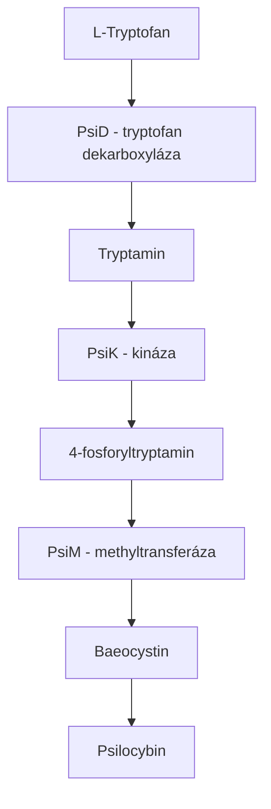

+++
title = "Psilocybe mexicana"
description = "Teonanacatl - posvátná houba Aztéků, zdroj první izolace psilocybinu, kulturní dědictví Mezoameriky"
weight = 6
+++

# Psilocybe mexicana - Teonanacatl

**Psilocybe mexicana** je historicky nejvýznamnější [psilocybinová houba](@/shrooms/psilocybes/_index.md) a jeden z nejdůležitějších druhů v celé historii etnomykologie. Aztékové ji nazývali **Teonanacatl** ("božské maso" nebo "tělo bohů") a používali ji v náboženských rituálech po tisíce let. Z této houby Albert Hofmann v roce 1958 poprvé izoloval [psilocybin](@/alkaloids/psilocybin.md) a [psilocin](@/alkaloids/psilocin.md), čímž zahájil moderní vědecký výzkum psychedelických látek.

P. mexicana představuje most mezi dávnou tradicí domorodých národů Mezoameriky a moderní psychedelickou vědou. Její význam přesahuje pouhou botaniku - je to kulturní artefakt, vědecký milník a symbol tisícileté spirituální praxe.

---

## Taxonomie

### Systematická klasifikace

| Klasifikace | Hodnota |
|-------------|---------|
| Říše | Fungi |
| Oddělení | Basidiomycota |
| Pododdělení | Agaricomycotina |
| Třída | Agaricomycetes |
| Podtřída | Agaricomycetidae |
| Řád | Agaricales |
| Čeleď | Hymenogastraceae |
| Rod | [Psilocybe](@/shrooms/psilocybes/_index.md) |
| Druh | P. mexicana |
| Binomické jméno | *Psilocybe mexicana* Heim |

### Historie taxonomie

| Rok | Událost | Autor |
|-----|---------|-------|
| 1956 | První vědecký popis | Roger Heim |
| 1958 | Potvrzení psychoaktivity | Albert Hofmann |
| 1983 | Revize rodu Psilocybe | Gastón Guzmán |
| 2000s | Molekulární fylogenetika | Různí autoři |

### Původní Heimova klasifikace

Roger Heim, přední francouzský mykolog a ředitel Národního přírodovědného muzea v Paříži, popsal P. mexicana v roce 1956 na základě vzorků získaných během expedice do mexického státu Oaxaca. Heim spolupracoval s R. Gordonem Wassonem a jeho manželkou Valentinou Pavlovnou Wassonovou při dokumentaci hub používaných v mazateckých rituálech.

Heimův popis zahrnoval:
- Detailní makroskopickou morfologii
- Mikroskopické charakteristiky výtrusů
- Ekologické poznámky k habitatu
- Dokumentaci tradičního použití

### Genetické studie

Moderní molekulární analýzy potvrdily jedinečné postavení P. mexicana v rámci rodu Psilocybe:

| Metoda | Zjištění |
|--------|----------|
| ITS sekvenování | Odlišná kladistická pozice od P. cubensis |
| Multilokusová analýza | Blízká příbuznost s P. tampanensis |
| Genomická analýza | Přítomnost genového klastru pro biosyntézu psilocybinu |

Fylogenetické studie ukazují, že P. mexicana patří do "Mexicanae" sekce rodu Psilocybe, která zahrnuje druhy schopné tvořit sklerotia.

---

## Etymologie a názvy

### Jazykové varianty

| Jazyk | Název | Význam | Kontext |
|-------|-------|--------|---------|
| Nahuatl | **Teonanacatl** | "Božské maso" / "Tělo bohů" | Aztécký rituální název |
| Nahuatl | **Xochitlnanacatl** | "Květinová houba" | Poetický název |
| Mazatec | **Nti-si-tho** | "Posvátná houba" | Mazatecké ceremonie |
| Mazatec | **Ndi-xi-tjo** | "Houba, která ukazuje" | Divinační kontext |
| Latina | *mexicana* | "Mexická" | Vědecký název |
| Angličtina | Mexican Liberty Cap | Podle tvaru klobouku | Populární název |
| Španělština | Hongo sagrado | "Posvátná houba" | Mexická španělština |
| Němčina | Mexikanischer Kahlkopf | "Mexická lysá hlava" | Vědecká literatura |

### Etymologický rozbor "Teonanacatl"

Nahuatlský termín **Teonanacatl** se skládá ze dvou částí:

| Složka | Význam | Kontext |
|--------|--------|---------|
| **Teotl** | Bůh, božský, posvátný | Označuje transcendentní povahu |
| **Nanacatl** | Houba, maso | Obecný termín pro houby |

Toto složené slovo odráží hluboký spirituální význam, který Aztékové přikládali těmto houbám - nebyly to pouze rostliny, ale prostředníci mezi lidským a božským světem.

---

## Etnobotanická historie

### Prehispánská éra

Archeologické důkazy naznačují, že psychoaktivní houby byly v Mezoamerice používány po tisíce let:

| Období | Důkazy | Lokalita |
|--------|--------|----------|
| 1500 př.n.l. | Houbové kameny | Guatemala |
| 500 př.n.l. | Keramické nádoby | Colima, Mexiko |
| 300 n.l. | Kodexové ilustrace | Centrální Mexiko |
| 1400 n.l. | Aztécké texty | Tenochtitlan |

### Aztécké rituální použití

Aztékové používali Teonanacatl při různých příležitostech:

| Příležitost | Účel | Účastníci |
|-------------|------|-----------|
| **Korunovace** | Komunikace s bohy | Tlatoani (vládce), kněží |
| **Náboženské svátky** | Kolektivní vize | Šlechta, kněží |
| **Věštění** | Divinace, orákula | Kněží, léčitelé |
| **Léčení** | Diagnostika nemocí | Ticitl (léčitel), pacient |
| **Pohřby** | Doprovod mrtvých | Rodina, kněží |

### Bernardino de Sahagún a první evropské záznamy

Františkánský mnich **Bernardino de Sahagún** (1499-1590) zanechal nejpodrobnější evropský záznam o aztéckém použití psychoaktivních hub ve svém díle "Historia general de las cosas de Nueva España" (Florentský kodex):

> *"Jsou houby v této zemi, které se nazývají teonanacatl, rostou pod travou na polích nebo na pastvinách. Jsou kulaté a mají vysoké stonky, tenké a kulaté. Požité způsobují opilost, vize a dokonce vilnost; vzrušují a unavují zároveň."*
> — Bernardino de Sahagún, 16. století

### Koloniální období a potlačení

Španělští kolonizátoři považovali užívání hub za ďábelský rituál a aktivně je pronásledovali:

| Rok | Událost |
|-----|---------|
| 1521 | Dobytí Tenochtitlanu |
| 1529 | První zákaz inkvizice |
| 1571 | Etablování inkvizice v Mexiku |
| 1620 | Oficiální zákaz "zámotky" (hub) |

Navzdory pronásledování přežilo tradiční užívání v odlehlých horských oblastech, zejména v Sierra Mazateca.

### Znovuobjevení pro Západ

#### Richard Evans Schultes (1938)

Americký botanik a "otec etnobotaniky" **Richard Evans Schultes** sbíral první vědecké vzorky psychoaktivních hub v Mexiku v roce 1938. Jeho práce položila základy pro pozdější výzkum.

#### R. Gordon Wasson (1955)

Bankéř a amatérský etnomykolog **Robert Gordon Wasson** a jeho žena **Valentina Pavlovna** byli prvními Evropany, kteří se v moderní době účastnili autentického mazateckého rituálu s houbami.

**Klíčová data Wassonovy expedice:**

| Datum | Událost |
|-------|---------|
| 29. června 1955 | První setkání s Maríou Sabinou |
| 29.-30. června 1955 | Účast na velada (noční ceremonii) |
| 1957 | Publikace v Life Magazine |

Wassonův článek "Seeking the Magic Mushroom" v časopise Life (13. května 1957) vyvolal obrovský zájem veřejnosti a odstartoval "houbovou horečku" na Západě.

---

## María Sabina a mazatecká tradice

### Životopis Maríi Sabiny (1894-1985)

**María Sabina Magdalena García** byla mazatecká curandera (léčitelka) z vesnice Huautla de Jiménez v mexickém státě Oaxaca. Stala se nejznámější praktikantkou tradičního houbového rituálu na světě.

| Období | Událost |
|--------|---------|
| 1894 | Narození v Huautla de Jiménez |
| 1901 | První zkušenost s houbami (věk 7 let) |
| 1930s | Etablování jako curandera |
| 1955 | Setkání s Wassonem |
| 1957 | Zveřejnění v Life Magazine |
| 1962 | Návštěva Timothy Learyho |
| 1970s | "Invaze" hippies do Huautly |
| 1985 | Smrt v chudobě |

### Filozofie Maríi Sabiny

María Sabina považovala houby za prostředníky mezi lidským a božským světem. Její přístup byl hluboce spirituální:

> *"Houby mají jazyk. A já jsem se naučila jejich jazyk. Houby mi říkají: 'Ty jsi svatá, ty jsi léčitelka.'"*
> — María Sabina

> *"Od té doby, co přišli cizinci, svaté děti ztratily svou sílu. Čistota byla porušena."*
> — María Sabina o důsledcích turistického zájmu

### Velada - noční ceremonie

**Velada** (z španělského "vigilie" nebo "noční bdění") je tradiční mazatecký rituál s psychoaktivními houbami.

#### Struktura velady

| Fáze | Popis | Trvání |
|------|-------|--------|
| **1. Příprava** | Vytvoření oltáře, zapálení svíček a kopalu | 30-60 min |
| **2. Modlitba** | Vzývání svatých a duchů předků | 15-30 min |
| **3. Požití** | Houby podávány v párech | 5-10 min |
| **4. Čekání** | Ztišení, příprava na účinky | 30-60 min |
| **5. Zhasnutí** | Úplná temnota | - |
| **6. Zpěvy** | Curandera začíná zpívat | 4-6 hodin |
| **7. Vize** | Účastníci zažívají vizionářské stavy | průběžně |
| **8. Léčení** | Curandera provádí léčebné úkony | průběžně |
| **9. Svítání** | Postupné ukončení | 1-2 hodiny |

#### Posvátné zpěvy

María Sabina byla proslulá svými spontánními zpěvy, které kombinovaly:
- Mazatečtinu
- Španělštinu
- Nahuatl
- Křesťanské modlitby
- Invokace přírodních duchů

Příklad struktury zpěvu:

```
Jsem žena, která hledá
Jsem žena, která zkoumá
Jsem žena knihy
Jsem žena, která je jako pták
Jsem stvořená z čistého ducha
Jsem žena hvězdy ranní...
```

#### Rituální předměty

| Předmět | Funkce |
|---------|--------|
| **Kopal** | Vonné kadidlo k očištění prostoru |
| **Svíčky** | Světlo pro komunikaci s duchy |
| **Kakao** | Rituální nápoj, purifikace |
| **Tabák** | San Pedro, ochrana |
| **Vejce** | Diagnostika, absorbování nemoci |
| **Oltář** | Svatyně pro duchy a svaté |

### Mazatecké kosmologie

Mazatekové věří, že houby jsou prostředníky mezi třemi světy:

| Svět | Popis | Obyvatelé |
|------|-------|-----------|
| **Horní svět** | Nebe, sídlo bohů | Bohové, andělé |
| **Střední svět** | Pozemský svět | Lidé, zvířata |
| **Dolní svět** | Podzemí, svět mrtvých | Předkové, duchové |

---

## Morfologie

### Makroskopický popis

#### Klobouk (Pileus)

| Vlastnost | Charakteristika |
|-----------|-----------------|
| **Průměr** | 1-3 cm (vzácně až 4 cm) |
| **Tvar mladý** | Kuželovitý, parabolický |
| **Tvar zralý** | Zvonovitý až široce konvexní |
| **Tvar starý** | Plochý s centrální papilou |
| **Barva suchý** | Slámově žlutá až okrově hnědá |
| **Barva vlhký** | Olivově hnědá až kaštanově hnědá |
| **Povrch** | Hladký, lesklý, hygrofánní |
| **Okraj** | Přímý až mírně zvlněný |
| **Papila** | Výrazná, kuželovitá |

#### Třeň (Stipes)

| Vlastnost | Charakteristika |
|-----------|-----------------|
| **Výška** | 4-12 cm (typicky 6-10 cm) |
| **Průměr** | 1-3 mm |
| **Tvar** | Válcovitý, mírně rozšířený u báze |
| **Barva** | Slámově žlutá až hnědavá |
| **Povrch** | Vláknitý, jemně plstnatý |
| **Struktura** | Dutý, křehký |
| **Modření** | Mírné až střední (zeleno-modré) |
| **Báze** | Mírně ztluštělá, s bílým myceliem |

#### Lupeny (Lamellae)

| Vlastnost | Charakteristika |
|-----------|-----------------|
| **Přirůstání** | Přirostlé až krátce sbíhavé |
| **Hustota** | Husté |
| **Barva mladé** | Šedohnědá |
| **Barva zralé** | Tmavě purpurově hnědá |
| **Ostří** | Bělavé, jemně zubaté |

#### Závoj (Velum)

Částečný závoj je přítomen u mladých plodnic, zanechává:
- Vláknité zbytky na okraji klobouku
- Nevýraznou anulární zónu na třeni

### Mikroskopické znaky

#### Výtrusy

| Vlastnost | Hodnota |
|-----------|---------|
| **Barva** | Tmavě purpurově hnědá (v mase) |
| **Tvar** | Elipsoidní až subhexagonální |
| **Rozměry** | (8-)9-12(-14) × (5-)6-8(-9) μm |
| **Stěna** | Tlustá, s germinálním pórem |
| **Povrch** | Hladký |
| **Reakce** | Bez metachromatické reakce |

#### Basidie

| Vlastnost | Hodnota |
|-----------|---------|
| **Tvar** | Kyjovité |
| **Rozměry** | 20-30 × 6-9 μm |
| **Sterigmata** | 4 |

#### Cheilocystidia

| Vlastnost | Hodnota |
|-----------|---------|
| **Tvar** | Lahvovité až fusiformní |
| **Rozměry** | 15-25 × 4-7 μm |
| **Stěna** | Tenká |

#### Pleurocystidia

Pleurocystidia jsou nepřítomná nebo vzácná.

---

## Sklerotia - "Filozofické kameny"

### Co jsou sklerotia?

**Sklerotia** (jednotné číslo: sklerotium) jsou zhuštěné, tvrdé myceliální útvary, které houba vytváří jako zásobní orgány pro přežití nepříznivých podmínek. Na rozdíl od plodnic (hub) jsou sklerotia podzemní nebo částečně zakopané struktury.

### Biologická funkce

| Aspekt | Popis |
|--------|-------|
| **Účel** | Přežití sucha, mrazu, požárů |
| **Skladování** | Zásobárna živin a vody |
| **Dormance** | Schopnost přetrvat měsíce až roky |
| **Klíčení** | Za příznivých podmínek vytvoří mycelium nebo plodnice |

### Charakteristika sklerotií P. mexicana

| Vlastnost | Hodnota |
|-----------|---------|
| **Velikost** | 1-5 cm (vzácně až 8 cm) |
| **Tvar** | Nepravidelně oválné, hlízovité |
| **Barva vnější** | Tmavě hnědá až černá |
| **Barva vnitřní** | Bělavá až nažloutlá |
| **Konzistence** | Tvrdá, vláknitá |
| **Obsah vody** | 60-70% (čerstvé) |
| **Chuť** | Oříšková, lehce kyselá |

### Alkaloidní profil sklerotií

| Alkaloid | Koncentrace (sušina) | Poznámka |
|----------|----------------------|----------|
| [Psilocybin](@/alkaloids/psilocybin.md) | 0,3-0,7% | Hlavní aktivní látka |
| [Psilocin](@/alkaloids/psilocin.md) | 0,02-0,1% | Méně stabilní |
| Baeocystin | stopy až 0,05% | Vedlejší alkaloid |
| Norbaeocystin | stopy | Minoritní |

### Srovnání: Sklerotia vs. plodnice

| Aspekt | Sklerotia | Plodnice |
|--------|-----------|----------|
| **Psilocybin** | 0,3-0,7% | 0,25-0,35% |
| **Stabilita** | Vysoká | Střední |
| **Skladovatelnost** | Měsíce | Týdny |
| **Kultivace** | Jednodušší | Náročnější |
| **Výtěžnost** | 30-100 g/kg | 10-30 g/flush |
| **Vzhled** | Nenápadný | Charakteristický |

### Kultivace sklerotií

#### Substrát pro sklerotia

| Složka | Podíl | Funkce |
|--------|-------|--------|
| Žitné zrno | 70% | Zdroj uhlíku a dusíku |
| Vermiculit | 20% | Retenční kapacita |
| Sádra | 10% | pH pufr, kalcium |

#### Alternativní substráty

| Substrát | Výtěžnost | Poznámka |
|----------|-----------|----------|
| Rýže | Střední | Rychlá kolonizace |
| Oves | Vysoká | Preferovaný pro sklerotia |
| Pšenice | Střední | Dostupný |
| Kukuřice | Nízká | Pomalá kolonizace |

#### Podmínky kultivace

| Fáze | Teplota | Vlhkost | Světlo | Doba |
|------|---------|---------|--------|------|
| Inokulace | 21-24°C | 70-80% | Žádné | 1 den |
| Kolonizace | 21-24°C | 70-80% | Žádné | 4-6 týdnů |
| Tvorba sklerotií | 21-24°C | 70-80% | Žádné | 8-16 týdnů |
| Sklizeň | - | - | - | 12-20 týdnů celkem |

### Legální status sklerotií

Sklerotia ("magic truffles") mají v některých zemích odlišný právní status než plodnice:

| Země | Status sklerotií |
|------|------------------|
| Nizozemsko | Legální (smart shops) |
| Itálie | Šedá zóna |
| Spojené království | Ilegální (od 2005) |
| USA | Ilegální (Schedule I) |
| Česká republika | Ilegální |

---

## Chemie a farmakologie

### Alkaloidní profil plodnic

| Alkaloid | Koncentrace | Struktura |
|----------|-------------|-----------|
| [Psilocybin](@/alkaloids/psilocybin.md) | 0,25-0,35% | 4-fosforyloxyindolalkylamin |
| [Psilocin](@/alkaloids/psilocin.md) | 0,01-0,05% | 4-hydroxyindolalkylamin |
| Baeocystin | stopy | 4-fosforyloxy-N-methyltryptamin |
| Norbaeocystin | stopy | 4-fosforyloxytryptamin |

### Biosyntéza psilocybinu

Biosyntéza psilocybinu v P. mexicana probíhá v několika krocích:



<details>
<summary>ASCII verze diagramu</summary>

```
L-Tryptofan
    ↓ [PsiD - tryptofan dekarboxyláza]
Tryptamin
    ↓ [PsiK - kináza]
4-fosforyltryptamin
    ↓ [PsiM - methyltransferáza]
Baeocystin
    ↓ [PsiM - methyltransferáza]
Psilocybin
```

</details>

### Srovnání potence

| Druh | Psilocybin | Psilocin | Celkem | Index |
|------|------------|----------|--------|-------|
| [P. azurescens](@/shrooms/psilocybes/azurescens.md) | 1,78% | 0,38% | 2,16% | 6,2x |
| [P. semilanceata](@/shrooms/psilocybes/semilanceata.md) | 0,98% | 0,02% | 1,00% | 2,9x |
| [P. cyanescens](@/shrooms/psilocybes/cyanescens.md) | 0,85% | 0,36% | 1,21% | 3,5x |
| [P. cubensis](@/shrooms/psilocybes/cubensis.md) | 0,63% | 0,60% | 1,23% | 3,5x |
| **P. mexicana** | 0,35% | 0,03% | 0,38% | 1,0x |
| P. tampanensis | 0,31% | 0,02% | 0,33% | 0,9x |

### Dávkování

#### Plodnice (sušené)

| Intenzita | Dávka | Psilocybin | Účinky |
|-----------|-------|------------|--------|
| Práh | 0,5-1 g | 1,75-3,5 mg | Mírné změny vnímání |
| Mírná | 1-2 g | 3,5-7 mg | Euforie, vizuální zkreslení |
| Střední | 2-4 g | 7-14 mg | Silné vize, změna myšlení |
| Silná | 4-6 g | 14-21 mg | Intenzivní psychedelická zkušenost |
| Heroická | 6+ g | 21+ mg | Ego dissolution |

#### Sklerotia (čerstvá)

| Intenzita | Dávka | Ekvivalent sušených | Účinky |
|-----------|-------|---------------------|--------|
| Práh | 5 g | ~0,5 g | Mírné změny |
| Mírná | 10 g | ~1 g | Lehká euforie |
| Střední | 15 g | ~1,5 g | Vizuální efekty |
| Silná | 20+ g | ~2+ g | Plná zkušenost |

### Farmakodynamika

| Parametr | Hodnota | Poznámka |
|----------|---------|----------|
| **Nástup účinku** | 15-45 minut | Závisí na obsahu žaludku |
| **Vrchol** | 1,5-2,5 hodiny | Individuální variabilita |
| **Trvání** | 4-6 hodin | Kratší než P. cubensis |
| **Poločas eliminace** | 2-3 hodiny | Psilocin |

### Charakteristika účinků

P. mexicana je popisována jako poskytující jemnější a více introspektivní zážitek ve srovnání s jinými druhy:

| Aspekt | Charakteristika |
|--------|-----------------|
| **Vizuální** | Méně intenzivní, subtilnější vzory |
| **Tělesné** | Lehká euforie, minimální napětí |
| **Kognitivní** | Introspekce, filosofické myšlenky |
| **Emocionální** | Jemná euforie, klid |
| **Duchovní** | Pocit spojení, vnitřní mír |

---

## Biotop a ekologie

### Geografické rozšíření

| Region | Status | Habitat |
|--------|--------|---------|
| Mexiko (Oaxaca) | Hlavní výskyt | Horské louky |
| Mexiko (Puebla) | Běžný | Pastviny |
| Mexiko (Veracruz) | Vzácnější | Okraje lesů |
| Guatemala | Přirozený | Vysokohorské louky |
| Honduras | Vzácný | Horské oblasti |
| Kostarika | Ojedinělý | Izolované populace |

### Ekologické požadavky

| Faktor | Optimum | Rozsah |
|--------|---------|--------|
| **Nadmořská výška** | 1200-1500 m | 1000-2000 m |
| **Teplota** | 15-20°C | 10-25°C |
| **Srážky** | 1000-2000 mm/rok | Sezónní deště |
| **Substrát** | Travnaté půdy | Humusové vrstvy |
| **pH půdy** | 5,5-6,5 | 5,0-7,0 |

### Asociované biotopy

P. mexicana se vyskytuje v těchto biotopech:

| Biotop | Popis | Četnost |
|--------|-------|---------|
| **Horské louky** | Otevřené travnaté plochy | Vysoká |
| **Okraje dubových lesů** | Přechodová zóna | Střední |
| **Pastviny** | V blízkosti dobytčího trusu | Střední |
| **Cesty** | Udupané okraje | Nízká |

### Sezónní výskyt

| Měsíc | Výskyt | Podmínky |
|-------|--------|----------|
| Leden-Duben | Žádný | Suché období |
| Květen | Začátek | První deště |
| Červen-Září | Maximum | Období dešťů |
| Říjen | Konec | Ustávající deště |
| Listopad-Prosinec | Vzácný | Přechodové období |

### Ekologická role

P. mexicana je saprofytická houba, která:
- Rozkládá organickou hmotu
- Recykluje živiny v půdě
- Tvoří symbiotické vztahy s půdními mikroorganismy
- Není mykorizní (na rozdíl od některých jiných hub)

---

## Moderní kultivace

### Přehled metod

| Metoda | Obtížnost | Výtěžek | Čas |
|--------|-----------|---------|-----|
| Sklerotia na zrní | Snadná | Vysoký | 12-20 týdnů |
| PF Tek (plodnice) | Střední | Nízký | 6-10 týdnů |
| Agar kultury | Střední | Variabilní | + 2-4 týdny |
| Liquid culture | Střední | Variabilní | + 1-2 týdny |

### Kultivace sklerotií (podrobně)

#### Fáze 1: Příprava substrátu

1. **Zrní**: Žito, oves nebo pšenice
2. **Hydratace**: Namočení 12-24 hodin
3. **Vaření**: 10-15 minut (al dente)
4. **Odvodnění**: Odstranění přebytečné vody
5. **Sterilizace**: 90 minut při 121°C / 15 PSI

#### Fáze 2: Inokulace

| Metoda | Spolehlivost | Čas kolonizace |
|--------|--------------|----------------|
| Sporový výtisk | Nižší | 2-4 týdny |
| Sporová stříkačka | Střední | 1-2 týdny |
| Agar klín | Vysoká | 1 týden |
| Liquid culture | Vysoká | 4-7 dní |

#### Fáze 3: Inkubace

| Parametr | Hodnota |
|----------|---------|
| Teplota | 21-24°C |
| Světlo | Žádné (tma) |
| Vlhkost | Uzavřená nádoba |
| Doba | 4-6 týdnů (kolonizace) + 8-12 týdnů (sklerotia) |

#### Fáze 4: Sklizeň

1. Otevření nádoby
2. Vyklopení substrátu
3. Ruční separace sklerotií
4. Opláchnutí vodou
5. Osušení papírovým ubrouskem

### Kultivace plodnic (PF Tek modifikace)

#### Substrát pro plodnice

| Složka | Podíl |
|--------|-------|
| Hnědá rýžová mouka | 2 díly |
| Vermiculit | 2 díly |
| Voda | 1 díl |

#### Podmínky fruktifikace

| Parametr | Hodnota |
|----------|---------|
| Teplota | 18-22°C |
| Vlhkost | 90-95% |
| FAE | 4-6x denně |
| Světlo | 12/12 hodin |
| Doba | 7-14 dní po triggeru |

### Optimalizace výtěžku

| Faktor | Optimalizace |
|--------|--------------|
| **Genetika** | Selekce výkonných kmenů |
| **Substrát** | Suplementace otruby |
| **Teplota** | Konstantní 23°C pro sklerotia |
| **Doba** | Prodloužená inkubace = větší sklerotia |
| **Vlhkost** | Optimální hydratace zrní |

---

## Právní status

### Mezinárodní úmluvy

| Úmluva | Rok | Status psilocybinu |
|--------|-----|-------------------|
| Úmluva o psychotropních látkách | 1971 | Schedule I |

### Právní status podle zemí

| Země | Plodnice | Sklerotia | Spory | Pěstování |
|------|----------|-----------|-------|-----------|
| **Mexiko** | Ilegální* | Ilegální | Šedá zóna | Ilegální* |
| **Nizozemsko** | Ilegální | Legální | Legální | Sklerotia povoleno |
| **USA** | Ilegální | Ilegální | Většinou legální | Ilegální |
| **Česká republika** | Ilegální | Ilegální | Legální | Ilegální |
| **Španělsko** | Dekriminalizováno | Dekriminalizováno | Legální | Osobní užití |
| **Portugalsko** | Dekriminalizováno | Dekriminalizováno | Legální | Malé množství |
| **Brazílie** | Nezakazuje houby | Nezakazuje | Legální | Šedá zóna |

### Mexické tradiční výjimky

V Mexiku existuje komplexní právní situace:

| Aspekt | Status |
|--------|--------|
| **Obecné právo** | Psilocybin je zakázán |
| **Tradiční použití** | Tolerováno v domorodých komunitách |
| **Náboženská výjimka** | Neformálně uznávána |
| **Turistický turismus** | Šedá zóna, tolerován |

Mexická vláda oficiálně neuznává náboženskou výjimku pro psychoaktivní houby, ale v praxi jsou tradiční mazatecké rituály tolerovány, podobně jako je tomu u peyotlu u Huicholů.

### Dekriminalizační trendy

| Jurisdikce | Rok | Opatření |
|------------|-----|----------|
| Denver, CO | 2019 | Dekriminalizace |
| Oakland, CA | 2019 | Dekriminalizace |
| Oregon | 2020 | Legalizace terapeutického použití |
| Washington, D.C. | 2020 | Dekriminalizace |
| Colorado | 2022 | Legalizace terapeutického použití |

---

## Kulturní dopad

### Vliv na psychedelickou revoluci

P. mexicana sehrála klíčovou roli v zahájení psychedelické revoluce 1960. let:

| Rok | Událost | Dopad |
|-----|---------|-------|
| 1957 | Wassonův článek v Life | Masová informovanost |
| 1958 | Izolace psilocybinu | Vědecká kredibilita |
| 1960 | Harvardský psilocybinový projekt | Akademický zájem |
| 1962 | Experiment Good Friday | Náboženský výzkum |
| 1966 | Zákaz LSD a psilocybinu | Konec legálního výzkumu |

### Významné osobnosti spojené s P. mexicana

| Osobnost | Role | Přínos |
|----------|------|--------|
| **María Sabina** | Mazatecká curandera | Uchování tradice |
| **R. Gordon Wasson** | Etnomykolog | Západní znovuobjevení |
| **Roger Heim** | Mykolog | Vědecký popis, kultivace |
| **Albert Hofmann** | Chemik | Izolace psilocybinu |
| **Timothy Leary** | Psycholog | Popularizace |
| **Richard Evans Schultes** | Etnobotanik | Vědecká dokumentace |
| **Terence McKenna** | Spisovatel | Kulturní interpretace |

### Vliv na umění a kulturu

| Oblast | Příklady |
|--------|----------|
| **Literatura** | Aldous Huxley, Carlos Castaneda |
| **Hudba** | Beatles, Grateful Dead, psychedelic rock |
| **Výtvarné umění** | Alex Grey, psychedelické umění |
| **Film** | Dokumenty o Maríi Sabině |
| **Filozofie** | Consciousness studies |

### Moderní renesance

Od roku 2000 probíhá "psychedelická renesance" ve vědě:

| Instituce | Výzkum |
|-----------|--------|
| Johns Hopkins | Psilocybin a deprese, závislosti |
| Imperial College London | Neuroimaging, deprese |
| NYU | Existenciální úzkost u onkologických pacientů |
| MAPS | MDMA a psilocybin terapie |

---

## Podobné a zaměnitelné druhy

### Druhy tvořící sklerotia

| Druh | Rozlišení | Potence |
|------|-----------|---------|
| **P. tampanensis** | Větší sklerotia, Florida | Podobná |
| **P. galindoi** | Možné synonymum | Podobná |
| **P. atlantis** | Větší spory | Nižší |

### Morfologicky podobné druhy

| Druh | Hlavní rozdíly | Výskyt |
|------|----------------|--------|
| [P. semilanceata](@/shrooms/psilocybes/semilanceata.md) | Výrazná papila, Evropa | Pastviny |
| P. caerulescens | Silnější modření | Mexiko |
| P. zapotecorum | Větší plodnice | Mexiko |
| P. hoogshagenii | Menší spory | Mexiko |

### Nebezpečné záměny

| Druh | Toxicita | Rozlišení |
|------|----------|-----------|
| **Galerina marginata** | Smrtelná | Žádné modření, hnědé spory |
| **Conocybe filaris** | Smrtelná | Rez-hnědé spory |

---

## Vědecký výzkum

### Historické studie

| Rok | Studie | Zjištění |
|-----|--------|----------|
| 1958 | Hofmann et al. | Izolace a struktura psilocybinu |
| 1958 | Hofmann (self-experiment) | Dokumentace účinků |
| 1962 | Experiment Good Friday | Mystické zážitky |
| 1983 | Guzmán | Taxonomická revize |

### Moderní výzkum

| Oblast | Zjištění |
|--------|----------|
| **Neurověda** | Mechanismus účinku na 5-HT2A receptory |
| **Psychiatrie** | Potenciál pro léčbu deprese |
| **Mykologie** | Biosyntéza psilocybinu |
| **Etnobotanika** | Dokumentace tradičního použití |

### Biosyntéza genového klastru

V roce 2017 byl identifikován genový klastr zodpovědný za biosyntézu psilocybinu:

| Gen | Funkce | Enzym |
|-----|--------|-------|
| **psiD** | Dekarboxylace | Tryptofan dekarboxyláza |
| **psiK** | Fosforylace | Kináza |
| **psiM** | Methylace | N-methyltransferáza |
| **psiH** | Hydroxylace | Monooxygenáza |

---

## Konzervace a etika

### Ohrožení populací

| Hrozba | Popis |
|--------|-------|
| **Sběr** | Nadměrný sběr pro turisty |
| **Habitat** | Ztráta přirozeného prostředí |
| **Klimatické změny** | Změny srážkových vzorců |
| **Kulturní eroze** | Ztráta tradičních znalostí |

### Etické zásady

| Zásada | Popis |
|--------|-------|
| **Respekt k tradici** | Uznání mazateckého kulturního dědictví |
| **Udržitelný sběr** | Ponechat spory pro reprodukci |
| **Kulturní citlivost** | Nenarušovat domorodé komunity |
| **Vzdělávání** | Šíření přesných informací |

### Odkaz Maríi Sabiny

María Sabina se stala symbolem složitého vztahu mezi domorodými tradicemi a západní kulturou:

> *"Před Wassonem jsem léčila nemocné pomocí jazyka, který mi daly svaté děti. Po Wassonovi přišli hippies a Mexičané, kteří chtěli jen zábavu. Čistota byla ztracena."*

Její příběh je připomínkou nutnosti etického přístupu k tradičním znalostem.

---

## Praktické informace

### Identifikace v terénu

**Klíčové znaky pro identifikaci:**

1. **Habitat**: Horské louky Mexika, 1000-1800 m n.m.
2. **Sezóna**: Červen-Září (období dešťů)
3. **Klobouk**: 1-3 cm, kuželovitý až zvonovitý, s papilou
4. **Třeň**: 4-12 cm, tenký, slámově žlutý
5. **Modření**: Mírné zeleno-modré
6. **Spory**: Tmavě purpurově hnědé

### Bezpečnostní upozornění

- **Nikdy nekonzumovat neidentifikované houby**
- **Záměna s jedovatými druhy může být smrtelná**
- **Psilocybin je ve většině zemí ilegální**
- **Set a setting jsou klíčové pro bezpečnou zkušenost**
- **Kontraindikace: psychiatrické diagnózy, kardiovaskulární onemocnění**

---

## Reference

### Primární zdroje

1. Hofmann, A., Heim, R., Brack, A., & Kobel, H. (1958). *Psilocybin und Psilocin, zwei psychotrope Wirkstoffe aus mexikanischen Rauschpilzen*. Helvetica Chimica Acta, 41(4), 1557-1572.

2. Wasson, R.G. (1957). *Seeking the Magic Mushroom*. Life Magazine, 42(19), 100-120.

3. Guzmán, G. (1983). *The Genus Psilocybe: A Systematic Revision of the Known Species Including the History, Distribution and Chemistry of the Hallucinogenic Species*. Nova Hedwigia Beiheft 74.

4. Schultes, R.E., & Hofmann, A. (1979). *Plants of the Gods: Origins of Hallucinogenic Use*. McGraw-Hill.

### Sekundární zdroje

5. Heim, R. (1956). *Les champignons divinatoires recueillis par Mme Valentina Pavlovna Wasson et M. R. Gordon Wasson au cours de leurs missions de 1954 et 1955 dans les pays mije, mazatèque, zapotèque et nahua du Mexique méridional et central*. Comptes Rendus Hebdomadaires des Séances de l'Académie des Sciences, 242, 1389-1395.

6. Sahagún, B. de (1577/1950-1982). *Florentine Codex: General History of the Things of New Spain*. School of American Research and University of Utah.

7. Estrada, A. (1981). *María Sabina: Her Life and Chants*. Ross-Erikson Publishers.

8. Stamets, P. (1996). *Psilocybin Mushrooms of the World*. Ten Speed Press.

### Moderní výzkum

9. Carhart-Harris, R.L., et al. (2016). *Psilocybin with psychological support for treatment-resistant depression*. The Lancet Psychiatry.

10. Fricke, J., et al. (2017). *The chemistry of psilocybin and psilocin biosynthesis*. Chemistry - A European Journal.

11. Griffiths, R.R., et al. (2016). *Psilocybin produces substantial and sustained decreases in depression and anxiety in patients with life-threatening cancer*. Journal of Psychopharmacology.

---

## Slovníček pojmů

| Termín | Definice |
|--------|----------|
| **Curandera/o** | Tradiční mazatecký léčitel/ka |
| **Hygrofánní** | Měnící barvu podle vlhkosti |
| **Papila** | Výstupek na vrcholu klobouku |
| **Sklerotium** | Zhuštěná myceliální zásobní struktura |
| **Teonanacatl** | Nahuatlský název pro posvátné houby |
| **Velada** | Mazatecká noční houbová ceremonie |
| **Modření** | Oxidační reakce psilocinu na modrou barvu |

---

## Chronologická timeline

| Rok | Událost |
|-----|---------|
| ~1500 př.n.l. | První archeologické důkazy o rituálním užívání hub |
| 1502 | První evropský záznam (Sahagún) |
| 1521 | Španělské dobytí Mexika |
| 1529 | První inkvizitorský zákaz hub |
| 1938 | Richard Evans Schultes sbírá vědecké vzorky |
| 1955 | R. Gordon Wasson se účastní mazateckého rituálu |
| 1956 | Roger Heim vědecky popisuje P. mexicana |
| 1957 | Wassonův článek "Seeking the Magic Mushroom" v Life |
| 1958 | Albert Hofmann izoluje psilocybin |
| 1960 | Timothy Leary zahajuje Harvardský psilocybinový projekt |
| 1962 | Experiment Good Friday |
| 1966 | Zákaz psilocybinu v USA |
| 1971 | Úmluva OSN o psychotropních látkách |
| 1985 | Smrt Maríi Sabiny |
| 2000s | Začátek moderní psychedelické renesance |
| 2019 | První dekriminalizace (Denver, Oakland) |
| 2020 | Oregon legalizuje terapeutické použití |

---

← Zpět na [Psilocybes](@/shrooms/psilocybes/_index.md) | [P. cubensis](@/shrooms/psilocybes/cubensis.md) | [P. tampanensis](@/shrooms/psilocybes/tampanensis.md) | [P. semilanceata](@/shrooms/psilocybes/semilanceata.md) →
