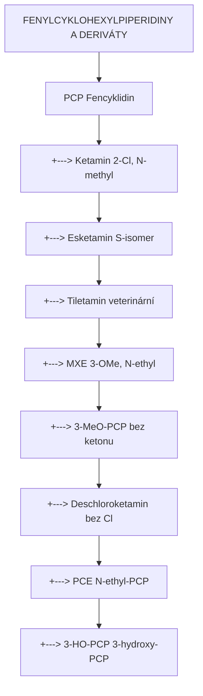
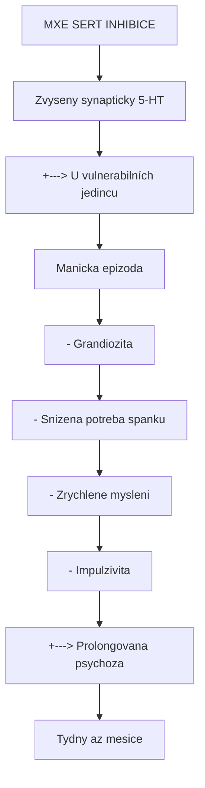

+++
title = "Methoxetamin (MXE)"
description = "Designer disociativ - NMDA antagonista a SERT inhibitor s prodlouzenym ucinkem"
weight = 3

[taxonomies]
tridy = ["Arylcyklohexylaminy"]
receptory = ["NMDA", "SERT", "Sigma", "Opioidni"]
zdroje = ["Synteticke", "Designer droga"]
+++

# Methoxetamin - Designer disociativ

**Methoxetamin** (MXE, 3-MeO-2-Oxo-PCE, "Mexxy") je synteticky **arylcyklohexylamin** vyvinuty jako "legalni" alternativa [ketaminu](@/alkaloids/ketamin.md). Kombinuje antagonismus [NMDA receptoru](@/receptors/nmda.md) s inhibici zpetneho vychytavani [serotoninu](@/glossary/serotonin.md), coz mu dava unikatni farmakologicky profil. Znamy pro prodlouzene trvani ucinku (3-5 hodin vs 1-2 h ketamin) a vyrazne "M-hole" zkusenosti.

**VAROVANI**: MXE je neregistrovana latka s omezenymi bezpecnostnimi daty. Toxikologicky profil neni plne znamy.

---

## Chemicka struktura

### Zakladni parametry

| Vlastnost | Hodnota |
|-----------|---------|
| **Chemicky nazev** | 2-(ethylamino)-2-(3-methoxyfenyl)cyklohexan-1-on |
| **Alternativni nazvy** | MXE, Mexxy, 3-MeO-2-Oxo-PCE, Methoxetamine |
| **Molekularni vzorec** | C15H21NO2 |
| **Molekularni hmotnost** | 247,33 g/mol |
| **CAS cislo** | 1239943-76-0 |
| **IUPAC** | 2-(ethylamino)-2-(3-methoxyphenyl)cyclohexan-1-one |
| **SMILES** | CCNC1(CCCCC1=O)c2cccc(OC)c2 |
| **PubChem CID** | 52911295 |
| **Chiralita** | Racemát |

### Strukturni porovnani s ketaminem

```
KETAMIN                          METHOXETAMIN (MXE)
   Cl                               OMe (3-methoxy)
    |                                |
[=]-[=]                          [=]-[=]
   \      N-CH3                     \      N-CH2CH3
    [=]  /                           [=]  /
       [Cyklohexan]                     [Cyklohexan]
          ||                               ||
          O                                O

Rozdily:
- Cl (orto) -> OMe (meta)
- N-methyl -> N-ethyl

Dusledky:
- Vyssi afinita k SERT
- Prodlouzene trvani
- Jina subjektivni kvalita
```

### Strukturni klasifikace

| Kategorie | Zarazeni |
|-----------|----------|
| **Trida** | Arylcyklohexylaminy |
| **Podtrida** | 3-methoxy substituovane |
| **Typ** | Designer disociativ |
| **Chiralita** | Racemát (R + S) |
| **Puvod** | Synteticky |

### Vztah k jinym arylcyklohexylaminům



<details>
<summary>ASCII verze diagramu</summary>

```
FENYLCYKLOHEXYLPIPERIDINY A DERIVÁTY

PCP (Fencyklidin)
 |
 +---> Ketamin (2-Cl, N-methyl)
 |        |
 |        +---> Esketamin (S-isomer)
 |        |
 |        +---> Tiletamin (veterinární)
 |
 +---> MXE (3-OMe, N-ethyl)
 |        |
 |        +---> 3-MeO-PCP (bez ketonu)
 |        |
 |        +---> Deschloroketamin (bez Cl)
 |
 +---> PCE (N-ethyl-PCP)
 |
 +---> 3-HO-PCP (3-hydroxy-PCP)
```

</details>

---

## Fyzikalne-chemicke vlastnosti

| Vlastnost | Hodnota |
|-----------|---------|
| **Teplota tani** | 125-128 C (HCl sol) |
| **Barva** | Bila az kremova |
| **Skupenstvi** | Pevna latka (prasek, krystaly) |
| **Rozpustnost ve vode** | Dobre rozpustny (HCl sol) |
| **Rozpustnost v ethanolu** | Dobre rozpustny |
| **pKa** | ~8,5 (odhadovano) |
| **logP** | ~2,5 (odhadovano) |
| **Biologicky polocas** | 3-6 hodin (odhadovano) |

### Formy na trhu

| Forma | Popis | Poznamka |
|-------|-------|----------|
| **Prasek** | Bila/kremova | Nejbeznejsi |
| **Krystaly** | Bile jehličky | "Shards" |
| **Tablety** | Lisovane | Vzacnejsi |
| **Kapky** | Roztok | Volumetricke davkovani |

---

## Historie

### Vznik a rozsireni

| Rok | Udalost | Vyznam |
|-----|---------|--------|
| **2010** | Prvni synteza/objeveni | Nezname misto puvodu |
| **2010** | Prvni zpravy (Bluelight) | Online psychonauticka komunita |
| **2011** | Rozsireni v UK | "Legal high" status |
| **2012** | Prvni fatality | UK, EU |
| **2013** | Zakaz v UK | Class B |
| **2014** | Zakaz v EU (mnoho státu) | Postupne |
| **2015** | Celosvetove omezeni | Snizona dostupnost |
| **2016+** | Raritni dostupnost | "Golden era" MXE skoncila |

### Kontext "legal highs"

```
VLNA DESIGNER DISOCIATIV (2010-2015)

2010: MXE se objevi
      - "Legalni ketamin"
      - Prodlouzeny ucinek
      - Online prodej

2011-2012: Vrchol popularity
      - Head shopy, RC vendori
      - Psychonauticka komunita
      - Prvni case reports v literature

2013: Prvni zakazy
      - UK: Class B
      - USA: některé státy

2014-2015: Globalni restrikce
      - EU regulatory actions
      - Cina: zakaz prekurzoru
      - Snizona produkce

2016+: Post-MXE éra
      - Vzacna dostupnost
      - Nahrazeni jinymi ACH
      - "MXE nostalgie"
```

---

## Farmakologie

### Receptorovy profil

| Receptor | Ki (nM) | Ucinek | Srovnani s ketaminem |
|----------|---------|--------|---------------------|
| **[NMDA](@/receptors/nmda.md) (PCP site)** | ~300-500 | Antagonista | Podobna nebo vyssi |
| **SERT** | ~500-1000 | Inhibitor | Vyrazne vyssi |
| **NET** | ~5000 | Slaba inhibice | Podobna |
| **DAT** | >10000 | Minimalni | Podobny |
| **Opioidni (mu)** | ~10000 | Slaby agonista | Podobny |
| **Opioidni (kappa)** | ~10000 | Slaby agonista | Podobny |
| **[Sigma-1](@/receptors/sigma-1.md)** | ~2000 | Agonista | Podobna |
| **D2** | >10000 | Minimalni | Podobny |

### Klicove farmakologicke rozdily od ketaminu

| Aspekt | MXE | Ketamin |
|--------|-----|---------|
| **NMDA afinita** | Vyssi nebo podobna | Reference |
| **SERT inhibice** | VYRAZNA | Minimalni |
| **Trvani** | 3-5+ hodin | 1-2 hodiny |
| **Subjektivni "warmth"** | Vyrazna | Mirna |
| **Antidepresivni potencial** | Teoreticky vyssi | Prokázaný |
| **Manie risk** | Vyssi (SERT) | Nizsi |

### Mechanismus ucinku

```mermaid
flowchart TD
    node_MXE["MXE"]
    node_NMDAreceptorantagoni["+---&gt; NMDA receptor antagonismus"]
    node_Disociativnistavy["Disociativni stavy"]
    node_Analgzie["Analgézie"]
    node_NeuroplasticitaAMPAB["Neuroplasticita AMPA  BDNF"]
    node_SERTinhibice["+---&gt; SERT inhibice"]
    node_Zvysenysynaptickyser["Zvyseny synapticky serotonin"]
    node_Empatogennkomponenta["'Empatogenní' komponenta"]
    node_Prodlouzenyucinek["Prodlouzeny ucinek"]
    node_Rizikoserotoninsyndr["Riziko: serotonin syndrom, manie"]
    node_Sigma1agonismus["+---&gt; Sigma-1 agonismus"]
    node_Neuroprotekce["Neuroprotekce"]
    node_Modulacejinychrecept["Modulace jinych receptoru"]
    node_Opioidniaktivitaslab["+---&gt; Opioidni aktivita slabá"]
    node_Mrnanalgezie["Mírná analgezie"]
    node_Euforie["Euforie"]

    node_MXE --> node_NMDAreceptorantagoni
    node_NMDAreceptorantagoni --> node_Disociativnistavy
    node_Disociativnistavy --> node_Analgzie
    node_Analgzie --> node_NeuroplasticitaAMPAB
    node_NeuroplasticitaAMPAB --> node_SERTinhibice
    node_SERTinhibice --> node_Zvysenysynaptickyser
    node_Zvysenysynaptickyser --> node_Empatogennkomponenta
    node_Empatogennkomponenta --> node_Prodlouzenyucinek
    node_Prodlouzenyucinek --> node_Rizikoserotoninsyndr
    node_Rizikoserotoninsyndr --> node_Sigma1agonismus
    node_Sigma1agonismus --> node_Neuroprotekce
    node_Neuroprotekce --> node_Modulacejinychrecept
    node_Modulacejinychrecept --> node_Opioidniaktivitaslab
    node_Opioidniaktivitaslab --> node_Mrnanalgezie
    node_Mrnanalgezie --> node_Euforie

    click node_NMDAreceptorantagoni "/receptors/nmda/" "+---> NMDA receptor antagonismus"
    click node_Zvysenysynaptickyser "/glossary/serotonin/" "Zvyseny synapticky serotonin"
    click node_Rizikoserotoninsyndr "/glossary/serotonin/" "Riziko: serotonin syndrom, manie"
    click node_Sigma1agonismus "/receptors/sigma-1/" "+---> Sigma-1 agonismus"
```



<details>
<summary>ASCII verze diagramu</summary>

```
MXE
 |
 +---> NMDA receptor antagonismus
 |         |
 |         v
 |     Disociativni stavy
 |     Analgézie
 |     Neuroplasticita (AMPA → BDNF)
 |
 +---> SERT inhibice
 |         |
 |         v
 |     Zvyseny synapticky serotonin
 |     "Empatogenní" komponenta
 |     Prodlouzeny ucinek
 |     Riziko: serotonin syndrom, manie
 |
 +---> Sigma-1 agonismus
 |         |
 |         v
 |     Neuroprotekce
 |     Modulace jinych receptoru
 |
 +---> Opioidni aktivita (slabá)
           |
           v
       Mírná analgezie
       Euforie
```

</details>

---

## Farmakokinetika

### Odhadovane parametry (omezena data)

| Parametr | Hodnota | Poznamka |
|----------|---------|----------|
| **Biodostupnost (p.o.)** | ~30-50% | Odhadovano |
| **Biodostupnost (IN)** | ~50-70% | Odhadovano |
| **Tmax (p.o.)** | 1-2 hodiny | |
| **Tmax (IN)** | 15-30 minut | |
| **T1/2** | 3-6 hodin | Prodlouzeny vs ketamin |
| **Metabolismus** | Hepatalni (CYP?) | Nedostatecne charakterizovano |

### Cesty podani

| Cesta | Nastup | Trvani | Davka |
|-------|--------|--------|-------|
| **Peroralni** | 30-90 min | 4-6 h | 20-50 mg |
| **Intranazalni** | 10-30 min | 3-5 h | 15-40 mg |
| **Sublingvalni** | 15-45 min | 4-5 h | 15-40 mg |
| **Intramuskulární** | 5-15 min | 3-4 h | 15-35 mg |

### Metabolismus (hypoteticka draha)

```
MXE
 |
 | [CYP3A4?, CYP2B6?]
 | (O-demethylace)
 v
3-HO-2-Oxo-PCE (nor-MXE)
 |
 | [CYP?]
 | (N-deethylace)
 v
Nor-nor-MXE
 |
 | [Konjugace]
 v
Glucuronidy / Sulfáty
 |
 v
Renální exkrece
```

---

## Davkovani a fenomenologie

### Davkove rozsahy

| Uroven | Peroralni | Intranazalni | Efekt |
|--------|-----------|--------------|-------|
| **Threshold** | 5-10 mg | 5-10 mg | Prvotnl zmeny |
| **Nizka** | 10-25 mg | 10-20 mg | Mirna disociace |
| **Stredni** | 25-50 mg | 20-35 mg | Plna disociace |
| **Vysoka** | 50-75 mg | 35-60 mg | "M-hole" |
| **Velmi vysoka** | 75+ mg | 60+ mg | NEBEZPECNE |

**DULEZITE**: Tolerance se vyviji rychle. Tyto davky jsou pro novacky bez tolerance!

### "M-hole" fenomen

Ekvivalent ketaminoveho "K-hole", ale s unikatnimi charakteristikami:

| Aspekt | M-hole | K-hole |
|--------|--------|--------|
| **Nastup** | Postunnejsi | Rychlejsi |
| **Trvani** | 1-3 hodiny | 30-60 minut |
| **Charakter** | "Teplejsi", empaticky | "Chladnejsi", anesteticky |
| **Vizuály** | Komplexnejsi, barevnejsi | Vice geometricke |
| **Mysleni** | Castejsi mystické themes | Vice abstraktni |
| **Recovery** | Pomalejsi, vlnity | Rychlejsi, linearni |

### Subjektivni fenomenologie

```
CASOVY PRUBEH (stredni peroralni davka)

0-30 min:   Nastup
            - Mirna stimulace
            - "Come up" anxiety (nekdy)

30-90 min:  Peak build
            - Narustajici disociace
            - Zmeny v prostoru
            - "Warmth" a euforie

90-180 min: Plateau
            - Plna disociace
            - Vizualni zmeny
            - Zmenene mysleni
            - Mozny M-hole

180-300 min: Sestup
            - Postupne vraceni
            - "Afterglow"
            - Residualni disociace

300+ min:   Doznivani
            - Mirna sedace
            - Mozna nespavost
            - Kognitivni "fog"
```

### Subjektivni efekty (detailne)

| Kategorie | Efekty |
|-----------|--------|
| **Disociativni** | Depersonalizace, derealizace, telesne odpojeni |
| **Vizualni** | Pattern enhancement, geometrie, scenery |
| **Telesne** | Anestetický pocit, "floating", teplo |
| **Kognitivni** | Zmenene mysleni, dezorganizace, insight |
| **Emocni** | Euforie, empatogenní "warmth", pokoj |
| **Auditorni** | Enhancement hudby, distorze |

---

## Bezpecnost

### Znama rizika

| Riziko | Zavaznost | Frekvence |
|--------|-----------|-----------|
| **Serotonin syndrom** | Potenciálne smrtelné | Při kombinacích |
| **Manie/psychoza** | Zavazne | U predisponovanych |
| **Urologicka toxicita** | Zavazne (dlouhodobe) | Pri chronickem pouziti |
| **Cerebellarni toxicita** | Zavazne | Ojedinele zpravy |
| **Predavkovani** | Smrtelne | Pri vysokych davkach |

### Srovnani toxicity s ketaminem

| Aspekt | MXE | Ketamin |
|--------|-----|---------|
| **Serotonin syndrom riziko** | VYSOKE | Nizke |
| **Manie riziko** | Vysoke | Nizke |
| **Urologicka toxicita** | Neznama, pravdepodobna | Dobre zdokumentovana |
| **LD50 (odhadovane)** | Neznamy | ~100-150 mg/kg (mysí) |
| **Terapeuticke okno** | Uzsi | Sirsi |

### Serotonin syndrom - kriticke varovani

MXE je POTENTNI SERT INHIBITOR - kombinace jsou NEBEZPECNE:

| Absolutne kontraindikovano | Mechanismus |
|---------------------------|-------------|
| **MAOI** | SMRTELNE |
| **SSRI** | Serotonin syndrom |
| **SNRI** | Serotonin syndrom |
| **MDMA** | Extrémni SS riziko |
| **Tramadol** | SS + respiracni deprese |
| **Lithium** | SS |
| **Tryptofan** | SS |

### Manie a psychoza

MXE je spojeny s vyraznejsim rizikem manie nez ketamin:



<details>
<summary>ASCII verze diagramu</summary>

```
MXE SERT INHIBICE
        |
        v
Zvyseny synapticky 5-HT
        |
        +---> U vulnerabilních jedincu
        |          |
        |          v
        |     Manicka epizoda
        |     - Grandiozita
        |     - Snizena potreba spanku
        |     - Zrychlene mysleni
        |     - Impulzivita
        |
        +---> Prolongovana psychoza
                   |
                   v
              Tydny az mesice
```

</details>

### Urologicka toxicita

Analogie ke ketaminove cystitide - nedostatecne studovano u MXE:

| Symptom | Casovy ramec | Reverzibilita |
|---------|--------------|---------------|
| **Dysuria** | Mesice pouzivani | Castecne |
| **Frekvence** | Mesice | Castecne |
| **Hematurie** | Pokrocile | Variabilni |
| **Snizena kapacita** | Chronicke | Mozna ireverzibilni |

### Cerebellarni toxicita

Ojedinele case reports:

| Symptom | Popis |
|---------|-------|
| **Ataxie** | Porucha koordinace |
| **Dysartrie** | Nezretelna rec |
| **Nystagmus** | Ocni pohyby |
| **Tremor** | Cerebellární |

---

## Lekove interakce

### Absolutne kontraindikovane

| Latka | Mechanismus | Dusledek |
|-------|-------------|----------|
| **MAOI (vsetky typy)** | Synergicka 5-HT toxicita | SMRT |
| **SSRI** | Aditivni SERT | Tezky SS |
| **SNRI** | Aditivni SERT + NET | Tezky SS |
| **MDMA** | Masivni 5-HT release + reuptake blok | Kriticka SS |
| **Tramadol** | 5-HT + respiracni | SS + deprese |

### Vysoke riziko

| Latka | Mechanismus | Dusledek |
|-------|-------------|----------|
| **Lithium** | 5-HT senzitizace | SS |
| **DXM** | Aditivni NMDA + SERT | Silna disociace + SS |
| **Triptany** | 5-HT agonismus | SS |
| **Opiaty** | Aditivni deprese | Respiracni selhani |

### Stredni riziko

| Latka | Mechanismus | Poznamka |
|-------|-------------|----------|
| **Ketamin** | Aditivni NMDA | Prodlouzena silna disociace |
| **Alkohol** | CNS deprese | Nebezpecne |
| **Benzodiazepiny** | CNS deprese | Nebezpecne |
| **GHB/GBL** | CNS deprese | Respiracni |

---

## Pravni status

### Mezinarodni

| Jurisdikce | Status | Rok |
|------------|--------|-----|
| **UK** | Class B | 2013 |
| **USA** | Schedule I analogue (některé státy explicit) | 2011-2015 |
| **Nemecko** | BtMG (kontrolovana latka) | 2013 |
| **Rusko** | Kontrolovana | 2012 |
| **Cina** | Kontrolovana (prekurzory) | 2015 |
| **EU** | Většina státu kontroluje | 2013-2016 |

### Ceska republika

| Aspekt | Status |
|--------|--------|
| **Pravni status** | Nen explicitne v seznamu |
| **Analogova klauze** | Potenciálne aplikovatelna |
| **Prodej** | Pravne sede zona |
| **Drzeni** | Pravne sede zona |
| **Dostupnost** | Velmi omezena |

---

## Detekce

### Analyticke metody

| Metoda | Detekce | Poznamka |
|--------|---------|----------|
| **GC-MS** | Ano | Specificka identifikace |
| **LC-MS/MS** | Ano | Zlatý standard |
| **Imunoassay (ketamin)** | Variabilni | Mozna křížová reaktivita |
| **Bezne panely** | NE | Vyzaduje specificky test |

### Detekcni okna

| Matrice | Okno | Poznamka |
|---------|------|----------|
| **Moc** | 2-4 dny | Odhadovano |
| **Krev** | 1-2 dny | Odhadovano |
| **Vlasy** | Mesice | Teoreticky |
| **Sliny** | 1-2 dny | Teoreticky |

---

## Reference

### Case reports a toxikologie

1. Shields, J.E. et al. (2012). *Methoxetamine-associated reversible cerebellar toxicity*. Clinical Toxicology.

2. Wood, D.M. et al. (2012). *Emergency department presentations associated with use of methoxetamine*. Annals of Emergency Medicine.

3. Wikstrom, M. et al. (2013). *Two fatal intoxications with the new designer drug methoxetamine*. Journal of Analytical Toxicology.

### Farmakologie

4. Roth, B.L. et al. (2013). *Novel psychoactive substances: pharmacology, clinical effects and case studies*. Drug and Alcohol Dependence.

5. Coppola, M. & Mondola, R. (2012). *Methoxetamine: From ketamine to new designer drug*. European Psychiatry.

### Prehledove clanky

6. Morris, H. & Wallach, J. (2014). *From PCP to MXE: A comprehensive review of the non-medical use of dissociative drugs*. Drug Testing and Analysis.

7. Corazza, O. et al. (2012). *Phenomenon of new drugs on the Internet: the case of ketamine derivative methoxetamine*. Human Psychopharmacology.

---

## Krizove odkazy

### Souvisejici latky
- [Ketamin](@/alkaloids/ketamin.md) - Strukturne pribuzny
- [Esketamin](@/substances/esketamine.md) - Enantiomer ketaminu
- [PCP](@/substances/pcp.md) - Arylcyklohexylamin
- [DXM](@/substances/dxm.md) - Jiny NMDA antagonista

### Receptory
- [NMDA receptor](@/receptors/nmda.md) - Primarni cil
- [Sigma-1 receptor](@/receptors/sigma-1.md) - Sekundarni cil
- [Serotonin](@/glossary/serotonin.md) - SERT inhibice

### Bezpecnost
- [Serotonin syndrom](@/conditions/serotonin-syndrome.md) - Kriticke riziko
- [Harm reduction](@/harm-reduction/_index.md) - Bezpecnejsi uzivani

---

**VAROVANI**: MXE je neregistrovana latka s omezenymi bezpecnostnimi daty. Kombinace s jinymi serotonergnimi latkami muze byt smrtelna. Tato stranka je pouze informacni a nepodporuje nezakonne aktivity.

---

Zpet na [Substance](@/substances/_index.md) | [Ketamin](@/alkaloids/ketamin.md) | [NMDA receptor](@/receptors/nmda.md)
