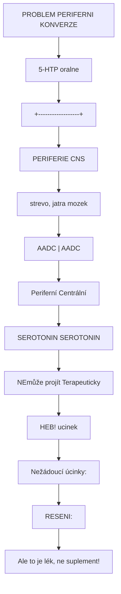

+++
title = "5-HTP"
description = "5-Hydroxytryptofan - prekurzor serotoninu, suplement pro naladu a spanek s dulezitymi bezpecnostnimi upozorneními"
weight = 1
insert_anchor_links = "right"

+++

# 5-HTP - Prekurzor serotoninu

**5-Hydroxytryptofan** (5-HTP, oxitriptan) je prirodni aminokyselina a metabolicky intermediat v [biosynteze serotoninu](@/biosynthesis/serotonin.md). Jako suplement se pouziva pro podporu nalady, spanku a regulace chuti k jidlu. Na rozdil od L-tryptofanu, 5-HTP **obchazi rate-limiting krok** (TPH) a konvertuje se primo na serotonin.

---

## Chemicka charakteristika

### Zakladni parametry

| Vlastnost | Hodnota |
|-----------|---------|
| **Chemicky nazev** | 5-Hydroxy-L-tryptofan |
| **Molekularni vzorec** | C11H12N2O3 |
| **Molekularni hmotnost** | 220,23 g/mol |
| **CAS cislo** | 56-69-9 |
| **Zdroj** | Griffonia simplicifolia (semena) |
| **Status** | Doplnek stravy (EU, USA) |

### Pozice v biosynteze

```
L-TRYPTOFAN (esencialni aminokyselina)
     |
     | [TPH] Tryptofan hydroxylaza
     | RATE-LIMITING STEP
     | (Lze obejit suplementaci 5-HTP)
     v
5-HTP <------ SUPLEMENTACE
     |
     | [AADC] Aromaticka aminokyselina dekarboxylaza
     | Kofaktor: Vitamin B6 (PLP)
     | (Rychly, neomezujici krok)
     v
SEROTONIN (5-HT)
```

---

## Farmakokinetika

### Absorpce a metabolismus

| Parametr | Hodnota |
|----------|---------|
| **Biodostupnost** | ~70% (oralne) |
| **Tmax** | 1-2 hodiny |
| **T1/2** | 2-7 hodin |
| **Metabolismus** | AADC → Serotonin |
| **Prostup HEB** | Ano (volne) |
| **Periferní konverze** | Ano (problém - viz níze) |

### Centralni vs. periferni konverze



<details>
<summary>ASCII verze diagramu</summary>

```
PROBLEM PERIFERNI KONVERZE

5-HTP (oralne)
     |
     +------------------+
     |                  |
     v                  v
PERIFERIE           CNS
(strevo, jatra)     (mozek)
     |                  |
     | [AADC]           | [AADC]
     v                  v
Periferní          Centrální
SEROTONIN          SEROTONIN
     |                  |
     v                  v
NEmůže projít      Terapeuticky
HEB!               ucinek
     |
     v
Nežádoucí úcinky:
- GI (nausea, prujem)
- Kardiovaskulární?

RESENI:
- Nizsi davky
- Kombinace s periferni inhibitorem AADC (carbidopa)
  [Ale to je lék, ne suplement!]

```mermaid
flowchart TD
    node_details["&lt;/details&gt;"]
    node_Pouzitiadavkovani["## Pouziti a davkovani"]
    node_Indikacesuplementace["### Indikace suplementace"]
    node_IndikaceEvidenceDavk["Indikace | Evidence | Davka"]
    node_c5c63a54["----------|----------|-------"]
    node_DepreseSlabastredni1["**Deprese** | Slaba-stredni | 150-300 mg/den"]
    node_UzkostSlaba50200mgde["**Uzkost** | Slaba | 50-200 mg/den"]
    node_InsomnieStredni10030["**Insomnie** | Stredni | 100-300 mg pred spankem"]
    node_MigrnaSlabastredni10["**Migréna** | Slaba-stredni | 100-600 mg/den"]
    node_FibromyalgieSlaba100["**Fibromyalgie** | Slaba | 100 mg 3x denne"]
    node_ObezitaSlaba250900mg["**Obezita** | Slaba | 250-900 mg/den"]
    node_Davkovacischema["### Davkovaci schema"]
    node_UrovenDavkaFrekvence["Uroven | Davka | Frekvence"]
    node_7c034496["--------|-------|-----------"]
    node_Zacinajici50mg12xden["**Zacinajici** | 50 mg | 1-2x denne"]
    node_Stredni100mg23xdenne["**Stredni** | 100 mg | 2-3x denne"]
    node_Vyssi150200mg23xdenn["**Vyssi** | 150-200 mg | 2-3x denne"]
    node_Maximum300mgDenneroz["**Maximum** | 300 mg | Denne rozdelene"]
    node_Formy["### Formy"]
    node_FormaPoznamka["Forma | Poznamka"]
    node_92f0e563["-------|----------"]
    node_TobolkyNejbeznejsi50["**Tobolky** | Nejbeznejsi, 50-100 mg"]
    node_TabletySprodlouzenym["**Tablety** | S prodlouzenym uvolnovanim"]
    node_PrasekPropresnejsida["**Prasek** | Pro presnejsi davkovani"]
    node_SB6Nekterproduktyobs["**S B6** | Nekteré produkty obsahuji B6"]
    node_Vedlejsiucinky["## Vedlejsi ucinky"]
    node_Cast["### Casté"]
    node_UcinekMechanismusMan["Ucinek | Mechanismus | Management"]
    node_4a9aff83["--------|-------------|------------"]
    node_NauseaPerifernseroto["**Nausea** | Periferní serotonin GI | Snizit davku, s jidlem"]
    node_PrujemGImotilitaSniz["**Prujem** | GI motilita | Snizit davku"]
    node_ZivesnyCentrlnseroto["**Zive sny** | Centrální serotonin | -"]
    node_OspalostSerotoninmel["**Ospalost** | Serotonin  melatonin | Podavat vecer"]
    node_Vzacnalezvazne["### Vzacné ale závazne"]
    node_UcinekRizikoPoznamka["Ucinek | Riziko | Poznamka"]
    node_044b3c3d["--------|--------|----------"]
    node_Eosinofiliamyalgiasy["**Eosinofilia-myalgia syndrom EMS** | Historicky | Kontaminace L-tryptofanu 1989"]
    node_KardiovaskularniTeor["**Kardiovaskularni** | Teoreticke | Periferni serotonin  fibróza chlopni?"]
    node_Serotoninovsyndromco["**Serotoninový syndrom@/conditions/serotonin-syndrome.md** | Pri kombinacích | Viz níze"]
    node_Interakceakontraindi["## Interakce a kontraindikace"]
    node_KRITICKESerotoninovy["### KRITICKE: Serotoninovy syndrom"]
    node_5HTPzvysujeserotonin["**5-HTP zvysuje serotonin a muze zpusobit serotoninovy syndrom pri kombinaci s jinými serotonergiky!**"]
    node_KombinaceRizikoDopor["Kombinace | Riziko | Doporuceni"]
    node_4cb394f3["-----------|--------|------------"]
    node_5HTPSSRIVYSOKEKONTRA["**5-HTP + SSRI** | VYSOKE | **KONTRAINDIKOVANO**"]
    node_5HTPSNRIVYSOKEKONTRA["**5-HTP + SNRI** | VYSOKE | **KONTRAINDIKOVANO**"]
    node_5HTPMAOiKRITICKEABSO["**5-HTP + MAOi** | KRITICKE | **ABSOLUTNE KONTRAINDIKOVANO**"]
    node_5HTPTramadolVYSOKEVy["**5-HTP + Tramadol** | VYSOKE | Vynechat"]
    node_5HTPMDMAVYSOKEVizhar["**5-HTP + MDMA** | VYSOKE | Viz harm reduction"]
    node_5HTPTriptanySTREDNIO["**5-HTP + Triptany** | STREDNI | Opatrnost"]
    node_5HTPLtryptofanSTREDN["**5-HTP + L-tryptofan** | STREDNI | Redundantni"]
    node_Priznakyserotoninovh["### Priznaky serotoninového syndromu"]

    node_details --> node_Pouzitiadavkovani
    node_Pouzitiadavkovani --> node_Indikacesuplementace
    node_Indikacesuplementace --> node_IndikaceEvidenceDavk
    node_IndikaceEvidenceDavk --> node_c5c63a54
    node_c5c63a54 --> node_DepreseSlabastredni1
    node_DepreseSlabastredni1 --> node_UzkostSlaba50200mgde
    node_UzkostSlaba50200mgde --> node_InsomnieStredni10030
    node_InsomnieStredni10030 --> node_MigrnaSlabastredni10
    node_MigrnaSlabastredni10 --> node_FibromyalgieSlaba100
    node_FibromyalgieSlaba100 --> node_ObezitaSlaba250900mg
    node_ObezitaSlaba250900mg --> node_Davkovacischema
    node_Davkovacischema --> node_UrovenDavkaFrekvence
    node_UrovenDavkaFrekvence --> node_7c034496
    node_7c034496 --> node_Zacinajici50mg12xden
    node_Zacinajici50mg12xden --> node_Stredni100mg23xdenne
    node_Stredni100mg23xdenne --> node_Vyssi150200mg23xdenn
    node_Vyssi150200mg23xdenn --> node_Maximum300mgDenneroz
    node_Maximum300mgDenneroz --> node_Formy
    node_Formy --> node_FormaPoznamka
    node_FormaPoznamka --> node_92f0e563
    node_92f0e563 --> node_TobolkyNejbeznejsi50
    node_TobolkyNejbeznejsi50 --> node_TabletySprodlouzenym
    node_TabletySprodlouzenym --> node_PrasekPropresnejsida
    node_PrasekPropresnejsida --> node_SB6Nekterproduktyobs
    node_SB6Nekterproduktyobs --> node_Vedlejsiucinky
    node_Vedlejsiucinky --> node_Cast
    node_Cast --> node_UcinekMechanismusMan
    node_UcinekMechanismusMan --> node_4a9aff83
    node_4a9aff83 --> node_NauseaPerifernseroto
    node_NauseaPerifernseroto --> node_PrujemGImotilitaSniz
    node_PrujemGImotilitaSniz --> node_ZivesnyCentrlnseroto
    node_ZivesnyCentrlnseroto --> node_OspalostSerotoninmel
    node_OspalostSerotoninmel --> node_Vzacnalezvazne
    node_Vzacnalezvazne --> node_UcinekRizikoPoznamka
    node_UcinekRizikoPoznamka --> node_044b3c3d
    node_044b3c3d --> node_Eosinofiliamyalgiasy
    node_Eosinofiliamyalgiasy --> node_KardiovaskularniTeor
    node_KardiovaskularniTeor --> node_Serotoninovsyndromco
    node_Serotoninovsyndromco --> node_Interakceakontraindi
    node_Interakceakontraindi --> node_KRITICKESerotoninovy
    node_KRITICKESerotoninovy --> node_5HTPzvysujeserotonin
    node_5HTPzvysujeserotonin --> node_KombinaceRizikoDopor
    node_KombinaceRizikoDopor --> node_4cb394f3
    node_4cb394f3 --> node_5HTPSSRIVYSOKEKONTRA
    node_5HTPSSRIVYSOKEKONTRA --> node_5HTPSNRIVYSOKEKONTRA
    node_5HTPSNRIVYSOKEKONTRA --> node_5HTPMAOiKRITICKEABSO
    node_5HTPMAOiKRITICKEABSO --> node_5HTPTramadolVYSOKEVy
    node_5HTPTramadolVYSOKEVy --> node_5HTPMDMAVYSOKEVizhar
    node_5HTPMDMAVYSOKEVizhar --> node_5HTPTriptanySTREDNIO
    node_5HTPTriptanySTREDNIO --> node_5HTPLtryptofanSTREDN
    node_5HTPLtryptofanSTREDN --> node_Priznakyserotoninovh

    click node_NauseaPerifernseroto "/glossary/serotonin/" "**Nausea** | Periferní serotonin GI | Snizit davku, s jidlem"
    click node_ZivesnyCentrlnseroto "/glossary/serotonin/" "**Zive sny** | Centrální serotonin | -"
    click node_OspalostSerotoninmel "/glossary/serotonin/" "**Ospalost** | Serotonin  melatonin | Podavat vecer"
    click node_Eosinofiliamyalgiasy "/amino-acids/tryptophan/" "**Eosinofilia-myalgia syndrom EMS** | Historicky | Kontaminace L-tryptofanu 1989"
    click node_KardiovaskularniTeor "/glossary/serotonin/" "**Kardiovaskularni** | Teoreticke | Periferni serotonin  fibróza chlopni?"
    click node_Serotoninovsyndromco "/conditions/serotonin-syndrome/" "**Serotoninový syndrom@/conditions/serotonin-syndrome.md** | Pri kombinacích | Viz níze"
    click node_KRITICKESerotoninovy "/conditions/serotonin-syndrome/" "### KRITICKE: Serotoninovy syndrom"
    click node_5HTPzvysujeserotonin "/conditions/serotonin-syndrome/" "**5-HTP zvysuje serotonin a muze zpusobit serotoninovy syndrom pri kombinaci s jinými serotonergiky!**"
    click node_5HTPMDMAVYSOKEVizhar "/alkaloids/mdma/" "**5-HTP + MDMA** | VYSOKE | Viz harm reduction"
    click node_5HTPLtryptofanSTREDN "/amino-acids/tryptophan/" "**5-HTP + L-tryptofan** | STREDNI | Redundantni"
    click node_Priznakyserotoninovh "/glossary/serotonin/" "### Priznaky serotoninového syndromu"
```


<details>
<summary>ASCII verze diagramu</summary>

```
</details>

---

## Pouziti a davkovani

### Indikace (suplementace)

| Indikace | Evidence | Davka |
|----------|----------|-------|
| **Deprese** | Slaba-stredni | 150-300 mg/den |
| **Uzkost** | Slaba | 50-200 mg/den |
| **Insomnie** | Stredni | 100-300 mg pred spankem |
| **Migréna** | Slaba-stredni | 100-600 mg/den |
| **Fibromyalgie** | Slaba | 100 mg 3x denne |
| **Obezita** | Slaba | 250-900 mg/den |

### Davkovaci schema

| Uroven | Davka | Frekvence |
|--------|-------|-----------|
| **Zacinajici** | 50 mg | 1-2x denne |
| **Stredni** | 100 mg | 2-3x denne |
| **Vyssi** | 150-200 mg | 2-3x denne |
| **Maximum** | 300 mg | Denne (rozdelene) |

### Formy

| Forma | Poznamka |
|-------|----------|
| **Tobolky** | Nejbeznejsi, 50-100 mg |
| **Tablety** | S prodlouzenym uvolnovanim |
| **Prasek** | Pro presnejsi davkovani |
| **S B6** | Nekteré produkty obsahuji B6 |

---

## Vedlejsi ucinky

### Casté

| Ucinek | Mechanismus | Management |
|--------|-------------|------------|
| **Nausea** | Periferní serotonin (GI) | Snizit davku, s jidlem |
| **Prujem** | GI motilita | Snizit davku |
| **Zive sny** | Centrální serotonin | - |
| **Ospalost** | Serotonin → melatonin | Podavat vecer |

### Vzacné ale závazne

| Ucinek | Riziko | Poznamka |
|--------|--------|----------|
| **Eosinofilia-myalgia syndrom (EMS)** | Historicky | Kontaminace L-tryptofanu 1989 |
| **Kardiovaskularni** | Teoreticke | Periferni serotonin → fibróza chlopni? |
| **[Serotoninový syndrom](@/conditions/serotonin-syndrome.md)** | Pri kombinacích | Viz níze |

---

## Interakce a kontraindikace

### KRITICKE: Serotoninovy syndrom

**5-HTP zvysuje serotonin a muze zpusobit serotoninovy syndrom pri kombinaci s jinými serotonergiky!**

| Kombinace | Riziko | Doporuceni |
|-----------|--------|------------|
| **5-HTP + SSRI** | VYSOKE | **KONTRAINDIKOVANO** |
| **5-HTP + SNRI** | VYSOKE | **KONTRAINDIKOVANO** |
| **5-HTP + MAOi** | KRITICKE | **ABSOLUTNE KONTRAINDIKOVANO** |
| **5-HTP + Tramadol** | VYSOKE | Vynechat |
| **5-HTP + MDMA** | VYSOKE | Viz harm reduction |
| **5-HTP + Triptany** | STREDNI | Opatrnost |
| **5-HTP + L-tryptofan** | STREDNI | Redundantni |

### Priznaky serotoninového syndromu

```

</details>
VAROVNE PRIZNAKY

Pri kombinaci 5-HTP s serotonergiky sledujte:

MIRNE:
- Neklid, agitace
- Tachykardie
- Mydriáza (rozsirene zornice)
- Poceni

STREDNI:
- Hyperthermie
- Tremor
- Hyperreflexie

ZAVAZNE (URGENTNI!):
- Horečka >40°C
- Svalová rigidita
- Klonus
- Zmatenost

-> Pri zavaznych priznacích OKAMZITE vyhledat lékařskou pomoc!
```mermaid
flowchart TD
    node_Kontraindikace["### Kontraindikace"]
    node_AbsolutniRelativni["Absolutni | Relativni"]
    node_ca238cbb["-----------|-----------"]
    node_SoucasnaterapieSSRIS["Soucasna terapie SSRI/SNRI | Kardiální onemocneni"]
    node_SoucasnaterapieMAOiD["Soucasna terapie MAOi | Downův syndrom snizeny metabolismus"]
    node_KarcinoidsyndromTeho["Karcinoid syndrom | Tehotenstvi/kojeni"]
    node_Planovanaoperacevysa["Planovana operace vysadit 2 tydny pred"]
    node_5HTPapsychedelika["## 5-HTP a psychedelika"]
    node_MDMAa5HTPharmreducti["### MDMA a 5-HTP - harm reduction"]
    node_Vharmreductionkomuni["V harm reduction komunitě existuje praxe uzivani 5-HTP po MDMA k 'doplneni serotoninu':"]

    node_Kontraindikace --> node_AbsolutniRelativni
    node_AbsolutniRelativni --> node_ca238cbb
    node_ca238cbb --> node_SoucasnaterapieSSRIS
    node_SoucasnaterapieSSRIS --> node_SoucasnaterapieMAOiD
    node_SoucasnaterapieMAOiD --> node_KarcinoidsyndromTeho
    node_KarcinoidsyndromTeho --> node_Planovanaoperacevysa
    node_Planovanaoperacevysa --> node_5HTPapsychedelika
    node_5HTPapsychedelika --> node_MDMAa5HTPharmreducti
    node_MDMAa5HTPharmreducti --> node_Vharmreductionkomuni

    click node_MDMAa5HTPharmreducti "/alkaloids/mdma/" "### MDMA a 5-HTP - harm reduction"
    click node_Vharmreductionkomuni "/alkaloids/mdma/" "V harm reduction komunitě existuje praxe uzivani 5-HTP po MDMA k "doplneni serotoninu":"
```

<details>
<summary>ASCII verze diagramu</summary>

```
### Kontraindikace

| Absolutni | Relativni |
|-----------|-----------|
| Soucasna terapie SSRI/SNRI | Kardiální onemocneni |
| Soucasna terapie MAOi | Downův syndrom (snizeny metabolismus) |
| Karcinoid syndrom | Tehotenstvi/kojeni |
| | Planovana operace (vysadit 2 tydny pred) |

---

## 5-HTP a psychedelika

### MDMA a 5-HTP - harm reduction

V harm reduction komunitě existuje praxe uzivani 5-HTP po MDMA k "doplneni serotoninu":

```

</details>
MDMA A 5-HTP - HARM REDUCTION PROTOKOL

PRED MDMA:
[NIKDY nebrat 5-HTP!]
-> Zvysene riziko serotoninového syndromu

BEHEM MDMA:
[NIKDY nebrat 5-HTP!]
-> Velmi vysoke riziko SS

PO MDMA (harm reduction):
Casovani: Minimalne 12-24 hodin PO MDMA
Davka: 50-100 mg
Frekvence: 1-2x denne, 3-7 dni
Ucinek: Teoreticky urychleni regenerace 5-HT

VAROVANI:
- Tato praxe NENI vedecky overena
- Riziko pri predcasnem podani
- Lepsi prevence: Delsi intervaly mezi MDMA
```

### Psilocybin/LSD a 5-HTP

| Kombinace | Interakce | Poznamka |
|-----------|-----------|----------|
| **5-HTP pred** | Teoreticky zvysený ucinek | Neovereno, rizikove |
| **5-HTP po** | Minimalni | Nepotrebne (5-HT2A agonismus, ne uvolneni) |

### Ayahuasca a 5-HTP

**KONTRAINDIKOVANO**: Ayahuasca obsahuje MAOi (harmin, harmalin). Kombinace s 5-HTP = vysoké riziko serotoninového syndromu.

---

## Srovnani s L-tryptofanem

| Aspekt | 5-HTP | L-Tryptofan |
|--------|-------|-------------|
| **Konverze na serotonin** | Prima (1 krok) | Nepřima (2 kroky) |
| **Rate-limiting** | Obchazi TPH | Limitován TPH |
| **Efektivita** | Vyssi | Nizsi |
| **Periferní efekty** | Vice | Méne |
| **Dostupnost** | Suplement | Suplement/potraviny |
| **Cena** | Vyssi | Nizsi |
| **Kompetice na BBB** | Ne | Ano (LNAA) |

---

## Evidence

### Klinicke studie

| Studie | Indikace | Design | Vysledek |
|--------|----------|--------|----------|
| **Shaw 2002** | Deprese | Systematicky prehled | Nedostatecna evidence |
| **Birdsall 1998** | Deprese | Review | Slibne, ale male studie |
| **Ribeiro 2000** | Fibromyalgie | RCT | Pozitivni |
| **De Giorgis 1992** | Dětská migréna | RCT | Efektivni |

### Limitace evidence

| Problem | Popis |
|---------|-------|
| **Male studie** | Většina <50 pacientů |
| **Metodologie** | Casto nekvalitní |
| **Placebo efekt** | Variabilní kontrola |
| **Publikační bias** | Možný |

---

## Praktická doporuceni

### Bezpecne uzivani

1. **Zacit nizkou davkou** (50 mg)
2. **Titruovat pomalu** (tydenni intervaly)
3. **Vzdy s jidlem** (snizeni GI efektu)
4. **Vecer** (pokud pro spanek)
5. **NIKDY s serotonergiky** (SSRI, SNRI, MAOi)
6. **Konzultovat s lekařem** (zejména pri medikaci)

### Kdo by NEMEL uzivat 5-HTP

- Pacienti na antidepresivech
- Pacienti na tramadolu
- Pred/po MDMA (<24h)
- Pred ayahuascou (<2 tydny)
- Tehotne a kojici
- Kardiaci (preventivne)

---

## Reference

### Prehledove články

1. Birdsall, T.C. (1998). *5-Hydroxytryptophan: a clinically-effective serotonin precursor*. Alternative Medicine Review.

2. Turner, E.H. et al. (2006). *Serotonin a la carte: supplementation with the serotonin precursor 5-hydroxytryptophan*. Pharmacology & Therapeutics.

### Bezpecnost

3. Das, Y.T. et al. (2004). *Safety of 5-hydroxy-L-tryptophan*. Toxicology Letters.

### Interakce

4. Bijlsma, E.Y. et al. (2020). *Interactions between serotonergic substances*. Journal of Psychopharmacology.

---

## Viz take

### Biosynteza
- [Biosynteza serotoninu](@/biosynthesis/serotonin.md) - 5-HTP v kontextu
- [L-Tryptofan](@/amino-acids/tryptophan.md) - Prekurzor 5-HTP

### Bezpecnost
- [Serotoninovy syndrom](@/conditions/serotonin-syndrome.md) - Kriticke riziko

### Souvisejici latky
- [MDMA](@/alkaloids/mdma.md) - Harm reduction kontext
- [Serotonin](@/glossary/serotonin.md) - Cilovy neurotransmiter

---

<- Zpet na [Suplementy](@/supplements/_index.md)
