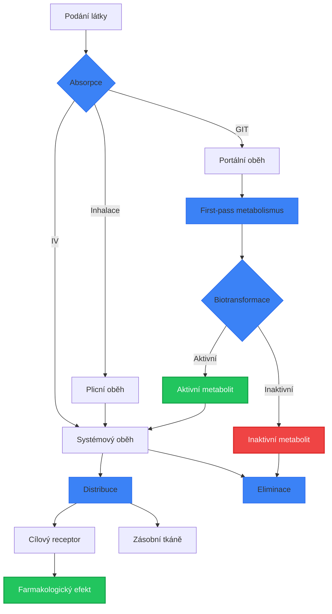
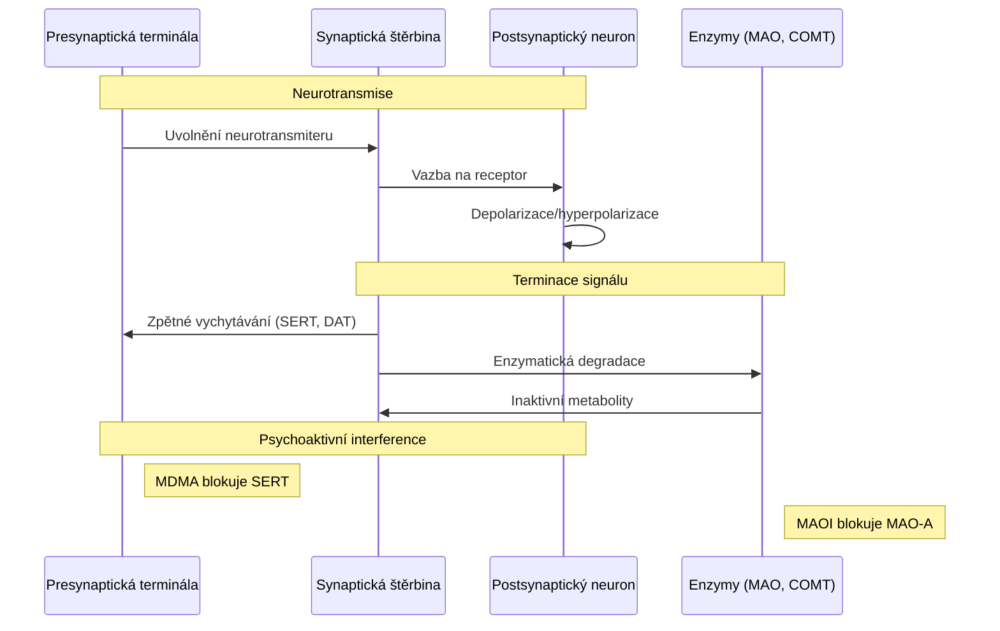
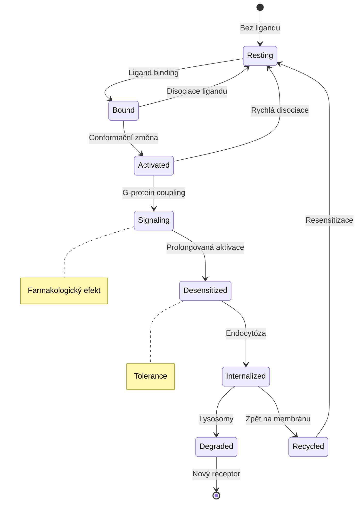
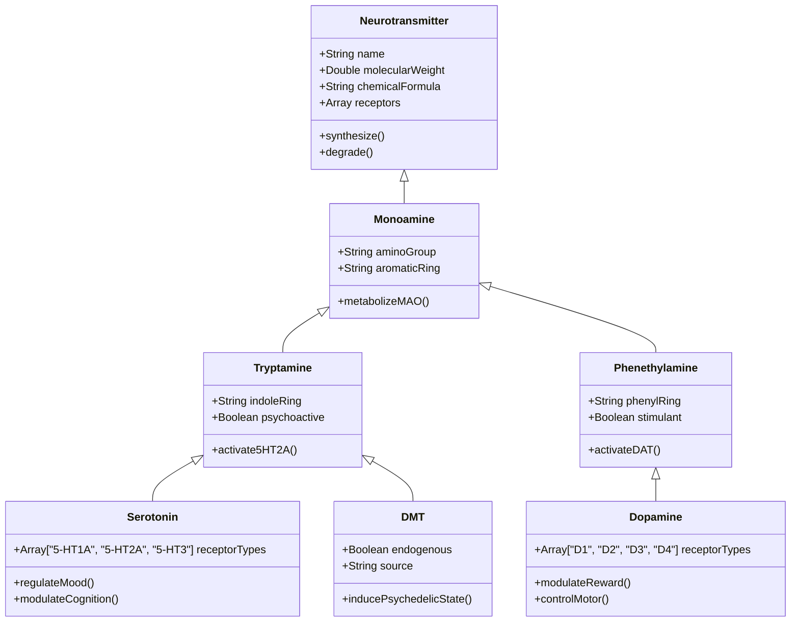
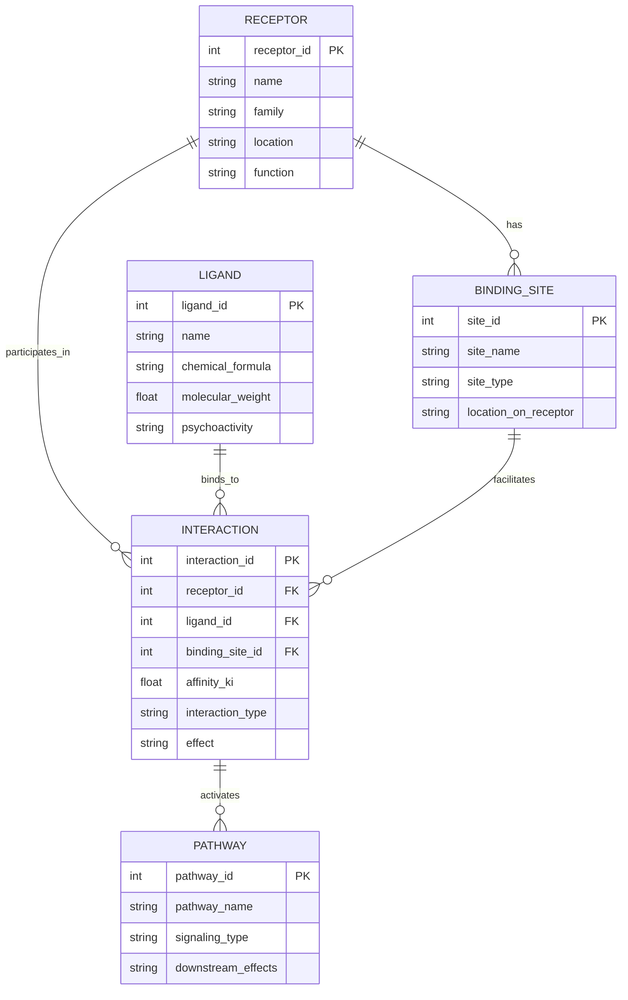
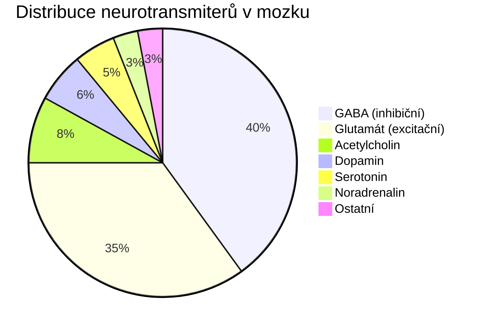
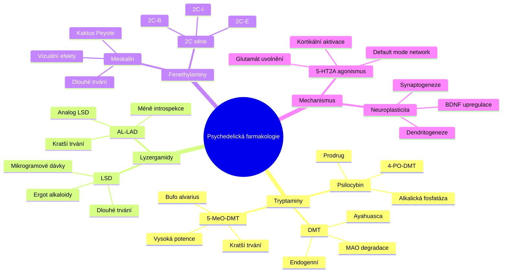
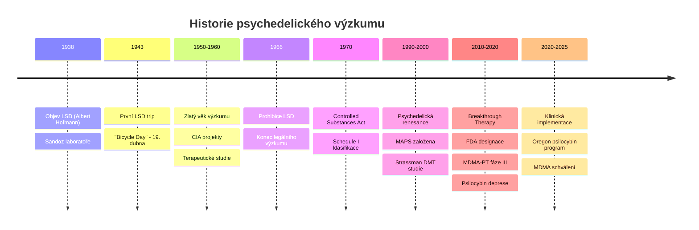

+++
title = "Test diagramů - Mermaid integrace"
description = "Kompletní test Mermaid diagram integrace s exportem PNG a dark/light mode synchronizaci"
date = 2026-01-30
updated = 2026-01-30
draft = false
weight = 999

[taxonomies]
categories = ["test", "diagramy"]
tags = ["mermaid", "diagramy", "test", "png-export", "dark-mode"]

[extra]
lead = "Testovací stránka demonstrující všechny typy Mermaid diagramů s funkcí PNG exportu a automatické synchronizace témat."
+++

# Test Mermaid diagram integrace

Tato stránka testuje kompletní implementaci Mermaid.js s následujícími funkcemi:
- ⚡ On-demand loading (knihovna se načte pouze při přítomnosti diagramů)
- 🖼️ PNG export s vysokým rozlišením
- 🌗 Automatická synchronizace dark/light mode
- 📱 Responzivní design
- ⚠️ Error handling a fallback zobrazení

## Flowchart - Farmakokinetická cesta



## Sequence Diagram - Synaptic Transmission



## State Diagram - Receptor States



## Gantt Chart - Psychedelická terapie protokol

```mermaid
gantt
    title Protokol psychedelické terapie (MDMA-PT)
    dateFormat  HH:mm
    axisFormat %H:%M

    section Příprava
    Screening & Edukace    :done, prep1, 09:00, 10:00
    Set & Setting příprava :done, prep2, 10:00, 10:30

    section Terapie
    Baseline měření        :active, base, 10:30, 11:00
    MDMA administrace     :milestone, dosing, 11:00, 11:01
    Onset období          :onset, 11:00, 11:45
    Peak efekt            :peak, 11:45, 15:45
    Comedown              :comedown, 15:45, 18:00

    section Monitorování
    Vitální funkce        :monitoring, 11:00, 18:00
    Psychologická podpora :support, 11:00, 18:00
    Integrace začátek     :integration, 17:00, 18:00

    section Follow-up
    Day after call        :followup1, after comedown, 1h
    Week 1 session        :followup2, after followup1, 1w
```



## Class Diagram - Neurotransmitter Hierarchy



## ER Diagram - Neuroreceptor Database Schema



## Pie Chart - Neurotransmitter Distribution



## Mindmap - Psychedelická farmakologie



## Timeline - Historie psychedelické vědy



## Test chybového stavu

Následující diagram obsahuje záměrnou syntaktickou chybu pro test error handlingu:

```mermaid
graph TD
    A[Start] --> B{Decision
    B --> C[Option 1]
    B --> D[Option 2
    C --> E[End]
    D --> E
    // Záměrně neuzavřené závorky a chybějící šipky
```

---

## Instrukce k testování

1. **PNG Export**: Klikněte na tlačítko "PNG" u libovolného diagramu
2. **Fullscreen**: Použijte tlačítko pro celou obrazovku
3. **Theme Switching**: Přepněte mezi světlým/tmavým režimem
4. **Responsivita**: Otestujte na různých velikostech obrazovky
5. **Error Handling**: Posledný diagram by měl zobrazit chybové hlášení

*Všechny diagramy by měly být interaktivní a exportovatelné jako PNG soubory.*